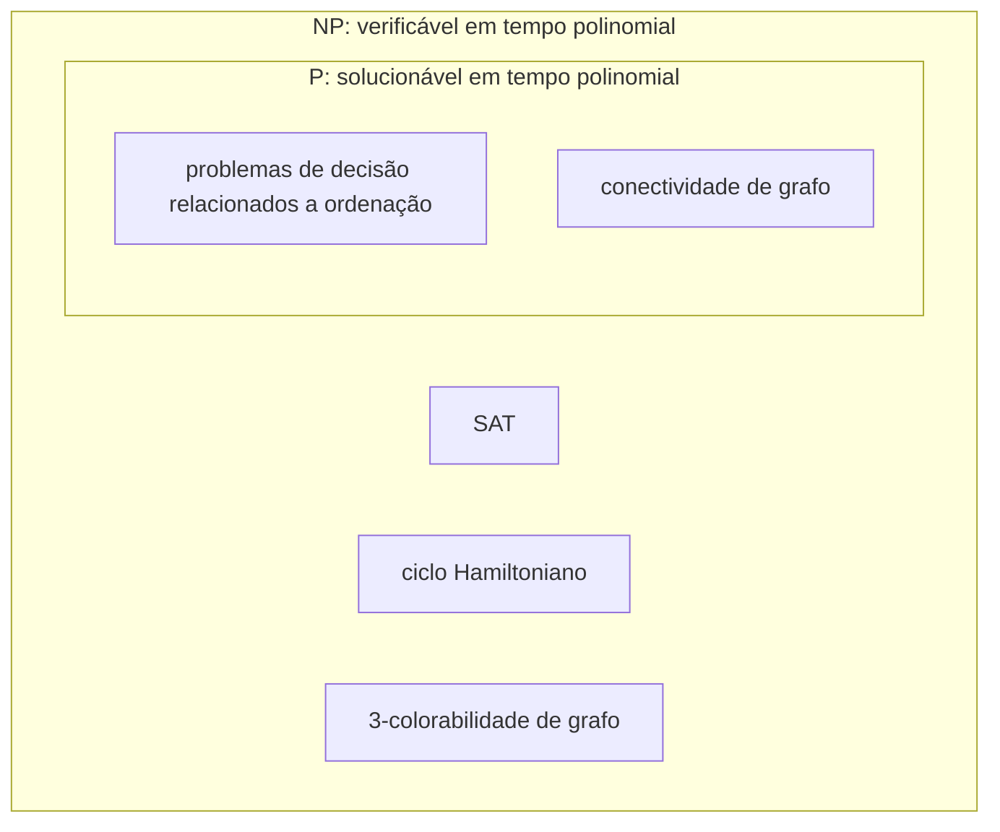

## Objetivos de Aprendizagem

- Definir NP com precisão como uma classe de problemas de decisão construída em torno de *verificação* em tempo polinomial, não solução em tempo polinomial.
- Distinguir NP corretamente de "solucionável em tempo exponencial" e explicar por que essa formulação comum é um equívoco.
- Identificar os dois componentes de uma definição baseada em verificador: um certificado proposto, e um procedimento de checagem em tempo polinomial.
- Demonstrar que P é um subconjunto de NP, usando um argumento direto, construtivo.
- Reconhecer exemplos concretos de problemas que se acredita estarem em NP mas não conhecidos como estando em P.

## Contexto e Motivação

O conceito anterior formalizou P como a classe de problemas que algum algoritmo consegue *solucionar*, encontrar uma resposta SIM-ou-NÃO correta, do zero, em tempo polinomial. Mas o Exemplo Resolvido 2 daquele conceito deixou uma lacuna visível: o problema do ciclo Hamiltoniano não tinha nenhum algoritmo de tempo polinomial conhecido para encontrar uma solução, só um de força bruta exponencial. NP é construída para descrever exatamente essa situação com precisão, fazendo uma pergunta inteiramente diferente. Em vez de "uma solução pode ser *encontrada* rapidamente," NP pergunta "se alguém entregasse a você uma solução proposta, você conseguiria *checar* que ela está correta, rapidamente." Isso soa parecido mas não é, e a lacuna entre eles, se todo problema rapidamente-checável é também rapidamente-solucionável, é precisamente a pergunta P versus NP para a qual esta disciplina inteira está construindo.

O exemplo canônico torna a distinção concreta. Pegue uma fórmula booleana, uma string de variáveis conectadas por E, OU, e NÃO, e pergunte: alguma atribuição de VERDADEIRO/FALSO a suas variáveis faz a fórmula inteira avaliar para VERDADEIRO? Este é o problema de satisfatibilidade booleana, SAT, e nenhum algoritmo de tempo polinomial é conhecido para encontrar tal atribuição do zero; os melhores algoritmos gerais conhecidos são exponenciais no número de variáveis. Mas suponha que alguém *entregue a você* uma atribuição proposta específica, digamos, "faça x₁ = VERDADEIRO, x₂ = FALSO, x₃ = VERDADEIRO, …" e peça que você confirme que ela de fato satisfaz a fórmula. Isso é só inserir os valores e avaliar a fórmula uma vez, o que leva tempo linear no tamanho da fórmula. Encontrar uma atribuição satisfatória entre exponencialmente muitas possibilidades é (acredita-se) difícil; verificar uma atribuição proposta específica é fácil. NP é a classe formal construída em torno de exatamente essa assimetria.

Essa definição baseada em verificador é a que importa, e vale a pena ser preciso sobre ela desde o início, porque um atalho muito comum, "NP significa que leva tempo exponencial para solucionar", é simplesmente errado, e ativamente enganoso sobre o que as letras sequer significam (NP significa "nondeterministic polynomial time", tempo polinomial não-determinístico, um nome que se refere à definição baseada em verificação abaixo, não a nenhuma afirmação sobre tempo de execução exponencial). Acertar isso exatamente agora é o que faz os próximos conceitos, NP-completude, reduções, e a própria pergunta P versus NP, fazerem sentido de forma alguma.

## Teoria Central

### Definição formal: NP como problemas verificáveis

Um problema de decisão L está em **NP** se existe um verificador V de tempo polinomial e uma constante k tais que: para toda entrada x, x é uma instância-SIM de L se e somente se existe algum **certificado** (também chamado testemunha) c, com |c| ≤ |x|^k (o comprimento do certificado é ele mesmo limitado por um polinômio no tamanho da entrada), tal que V(x, c) aceita, e o próprio V roda em tempo polinomial em |x|.

Desempacotando isso: para mostrar que um problema está em NP, você precisa de dois ingredientes. Primeiro, uma noção de como seria um certificado para uma instância-SIM, para SAT, um certificado é uma atribuição de variável proposta; para ciclo Hamiltoniano, um certificado é uma ordenação proposta dos vértices; para 3-colorabilidade de grafo, um certificado é uma atribuição proposta de uma dentre três cores a cada vértice. Segundo, um verificador de tempo polinomial que, dado a entrada e um certificado, checa se aquele certificado de fato testemunha uma resposta SIM, para SAT, avalie a fórmula sob a atribuição proposta; para ciclo Hamiltoniano, checque que a ordenação proposta visita todo vértice exatamente uma vez e que vértices consecutivos são de fato conectados por uma aresta; para 3-colorabilidade, checque que nenhum dois vértices adjacentes compartilham uma cor. Em cada um desses casos, o passo de *checagem* é mecânico e rápido, mesmo que nenhum método rápido seja conhecido para produzir o certificado em primeiro lugar.

### Por que "tempo polinomial não-determinístico"

O nome NP vem de uma caracterização equivalente, alternativa: um problema está em NP se uma máquina de Turing *não-determinística*, uma com permissão, a cada passo, para ramificar em múltiplas configurações seguintes possíveis simultaneamente, aceitando se *qualquer* ramo aceita, consegue decidi-lo em tempo polinomial. Isso é equivalente à definição de verificador: uma máquina não-determinística pode ser pensada como "adivinhando" um certificado (ramificando sobre todo certificado possível de uma vez) e depois verificando-o deterministicamente ao longo daquele único ramo. Computadores reais não conseguem ramificar dessa forma, o que é exatamente por que problemas NP se acredita exigirem tempo exponencial para *solucionar* em qualquer máquina real, o fator de ramificação precisa ser pago de alguma forma, ou tentando certificados um de cada vez (exponencialmente muitos deles) ou, se P = NP, por algum truque de tempo polinomial ainda desconhecido que evita a ramificação por completo. Esta é também a fonte do equívoco comum tratado abaixo: tempo polinomial não-determinístico não é a mesma coisa que tempo exponencial comum (determinístico), mesmo que simular uma máquina não-determinística deterministicamente atualmente só seja conhecido como alcançável em tempo exponencial.

### P é um subconjunto de NP

Todo problema em P também está em NP, e a prova é direta e construtiva em vez de meramente plausível. Seja L qualquer problema em P, decidido por algum algoritmo de tempo polinomial A. Para mostrar que L está em NP, defina um verificador V que simplesmente ignora qualquer certificado que lhe seja entregue, roda A na entrada x, e aceita se e somente se A aceita. V roda em tempo polinomial porque A roda. E a condição "se e somente se existe um certificado" vale trivialmente: se x é uma instância-SIM, A aceita por conta própria, então V(x, c) aceita para *qualquer* c (incluindo um vazio), um certificado existe (de fato, toda string é um). Se x é uma instância-NÃO, A rejeita independentemente da entrada, então V(x, c) rejeita para todo c, nenhum certificado existe. Solucionar um problema diretamente é uma forma (trivial) de "verificar" qualquer resposta proposta: apenas resolva-o você mesmo e checque que sua própria resposta corresponde, ignorando aquela que lhe foi entregue. Isso dá P ⊆ NP.

Se essa contenção é *estrita*, se NP tem problemas que genuinamente não estão em P, em vez de P e NP secretamente serem a mesma classe, é exatamente a pergunta P versus NP, não resolvida e coberta como o encerramento desta disciplina. O que a Teoria Central estabelece aqui é só a direção fácil: P ⊆ NP é um fato demonstrado; NP ⊆ P (o que tornaria as classes iguais) não é conhecido como verdadeiro ou falso.

### Problemas concretos que se acredita estarem em NP mas não conhecidos como estando em P

SAT, ciclo Hamiltoniano, e 3-colorabilidade de grafo são três problemas com verificadores de tempo polinomial conhecidos (procedimentos de checagem de certificado), colocando-os em NP, mas sem nenhum algoritmo de tempo polinomial conhecido para encontrar uma atribuição satisfatória, um ciclo Hamiltoniano, ou uma 3-coloração válida do zero. Ninguém demonstrou que nenhum tal algoritmo pode existir, essa é precisamente a razão pela qual P versus NP permanece em aberto em vez de resolvido, mas décadas de esforço de muitos pesquisadores falharam em encontrar um para qualquer um desses problemas, o que é parte do caso circunstancial (desenvolvido mais adiante uma vez que NP-completude é introduzida) de que eles são genuinamente difíceis.

## Exemplos Resolvidos

### Exemplo 1: verificando um certificado para SAT

**Problema:** Considere a fórmula booleana φ = (x₁ ∨ x₂) ∧ (¬x₁ ∨ x₃) ∧ (¬x₂ ∨ ¬x₃). Um certificado proposto é x₁ = VERDADEIRO, x₂ = FALSO, x₃ = VERDADEIRO. Verifique se este certificado testemunha que φ é satisfatível.

**Verificação.** Substitua os valores propostos em cada cláusula: (x₁ ∨ x₂) = (VERDADEIRO ∨ FALSO) = VERDADEIRO. (¬x₁ ∨ x₃) = (FALSO ∨ VERDADEIRO) = VERDADEIRO. (¬x₂ ∨ ¬x₃) = (VERDADEIRO ∨ FALSO) = VERDADEIRO. Todas as três cláusulas avaliam para VERDADEIRO, então sua conjunção φ avalia para VERDADEIRO. Este certificado é válido, φ é satisfatível, testemunhado por esta atribuição específica. Note o que esta verificação *não* exigiu: nenhuma busca sobre as 2³ = 8 atribuições possíveis foi necessária, porque um candidato específico já foi entregue. Esta única substituição-e-checagem levou três avaliações de cláusula, um custo linear no tamanho de φ, polinomial (de fato linear) independentemente de quantas variáveis φ tem, o que é exatamente a propriedade de verificador que coloca SAT em NP.

### Exemplo 2: verificando um certificado para ciclo Hamiltoniano

**Problema:** Um grafo tem vértices {A, B, C, D} e arestas {A-B, B-C, C-D, D-A, A-C}. Um certificado proposto é a ordenação A, B, C, D. Verifique se isso testemunha um ciclo Hamiltoniano.

**Verificação.** Duas coisas precisam valer: a ordenação precisa incluir todo vértice exatamente uma vez, e cada par consecutivo (incluindo voltar do último para o primeiro) precisa ser conectado por uma aresta real. A ordenação A, B, C, D inclui todos os quatro vértices exatamente uma vez. Checando arestas: A-B é uma aresta (sim), B-C é uma aresta (sim), C-D é uma aresta (sim), D-A é uma aresta (sim, fechando o ciclo). Todos os quatro pares consecutivos são arestas genuínas, então este certificado é válido, o grafo tem um ciclo Hamiltoniano, testemunhado por esta ordenação específica. Esta checagem custou quatro consultas de aresta, novamente linear no tamanho da descrição do grafo, independentemente de quantas ordenações totais (4! = 24, aqui) teriam que ser tentadas para *encontrar* esta do zero.

### Exemplo 3: P ⊆ NP tornado concreto com conectividade de grafo

**Problema:** Conectividade de grafo ("existe um caminho de s a t") é conhecida como estando em P, decidível por busca em largura em tempo O(V + E). Construa um verificador explícito estilo-NP para ela, seguindo a prova da Teoria Central.

**Construção.** Defina o verificador V(grafo, certificado) para simplesmente descartar o certificado por completo, rodar busca em largura a partir de s, e aceitar se t é alcançado. Este V roda em tempo O(V + E), polinomial, correspondendo exatamente ao próprio tempo de execução do algoritmo de solução, porque o verificador não está fazendo nada além de resolver o problema de novo. Para qualquer instância-SIM (s e t de fato conectados), V aceita independentemente de qual certificado é fornecido, escolha qualquer string como "o certificado," até mesmo uma vazia. Para qualquer instância-NÃO, V rejeita independentemente do que é fornecido. Este é um verificador legítimo, embora sem glamour: demonstra que a estratégia "resolva você mesmo e ignore o certificado proposto" da prova de P ⊆ NP não é só um argumento abstrato mas algo que pode ser escrito concretamente para um problema específico, familiar.

## Equívocos Comuns e Armadilhas

- **"NP significa que o problema leva tempo exponencial para solucionar."** Esta é a leitura equivocada mais comum do nome, e é falsa como enunciada. NP é definida por *verificabilidade* em tempo polinomial de um certificado proposto, não por nenhuma afirmação sobre quanto tempo solucionar o problema do zero leva. Acontece de ser verdade que nenhum algoritmo de solução em tempo polinomial é *conhecido* para muitos problemas NP (SAT entre eles), e que os melhores algoritmos de solução conhecidos para esses problemas são exponenciais, mas "nenhum algoritmo polinomial é atualmente conhecido" é uma afirmação inteiramente diferente, mais fraca, do que "comprovadamente exige tempo exponencial", e nenhuma das duas afirmações é parte da definição real de NP. Pior, pela prova de P ⊆ NP acima, todo problema em P, incluindo os solucionáveis em tempo linear, como conectividade de grafo, também está em NP, o que sozinho refuta "NP significa exponencial": um problema de tempo linear não pode também "significar" tempo exponencial.
- **"Já que SAT está em NP mas não conhecida como estando em P, checar um certificado para SAT deve ser tão difícil quanto encontrar um."** O Exemplo Resolvido 1 mostra o oposto diretamente: checar um certificado específico levou três avaliações de cláusula, enquanto encontrar um (no pior caso, sem nenhuma esperteza) poderia exigir checar todas as 2³ atribuições possíveis. O ponto inteiro da definição de NP é que checar e encontrar são (acredita-se) diferentes em dificuldade, confundi-los apaga a distinção que a classe existe para capturar.
- **"Um problema está em NP só se nenhum algoritmo de solução em tempo polinomial existir para ele."** Isso inverte a definição, e o Exemplo 3 existe especificamente para corrigir isso: conectividade de grafo tem um algoritmo de solução em tempo polinomial perfeitamente bom (busca em largura) e ainda está em NP, porque P ⊆ NP incondicionalmente. NP não é "a classe de problemas difíceis de solucionar", é a classe (maior) de problemas fáceis de verificar, que acontece de incluir todo problema fácil de solucionar como um caso especial, mais (acredita-se) alguns genuinamente mais difíceis além disso.

## Resumo

NP é a classe de problemas de decisão para os quais um certificado-SIM proposto pode ser verificado em tempo polinomial, independentemente de algum procedimento de tempo polinomial ser conhecido para encontrar tal certificado do zero. SAT é o exemplo condutor: inserir uma atribuição de variável proposta específica em uma fórmula booleana e checar se ela satisfaz toda cláusula leva tempo linear no tamanho da fórmula, mesmo que nenhum método de tempo polinomial seja conhecido para construir uma atribuição satisfatória quando nenhuma é entregue. P ⊆ NP é um fato demonstrado, construtivo: qualquer algoritmo de solução em tempo polinomial dobra como um verificador de tempo polinomial que simplesmente ignora o certificado proposto e resolve o problema ele mesmo de novo. Se essa contenção é estrita (se NP tem problemas que P genuinamente não tem) é a pergunta P versus NP em aberto. Acima de tudo, a definição de NP é sobre velocidade de verificação, não sobre tempo de solução ser exponencial, um problema de tempo linear como conectividade de grafo está em NP precisamente porque está em P, o que sozinho descarta equiparar "NP" com "necessariamente exponencial."

## Documentation Links

- [Stanford CS154: Course Home](https://cs154.stanford.edu/): doc
- [MIT 18.404/6.5400: Course Information (Sipser)](https://math.mit.edu/~sipser/18404/info.pdf): doc
