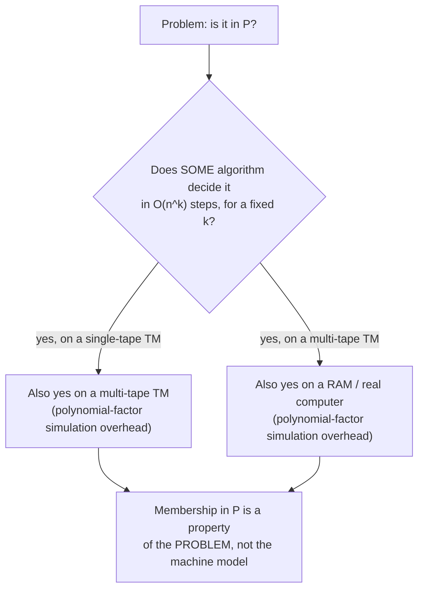

## Learning Objectives

- Define the complexity class P precisely, in terms of decision problems and Turing-machine running time.
- Explain why "polynomial time" — rather than some other threshold — is the standard dividing line for "efficiently solvable."
- Justify polynomial time's robustness across reasonable models of computation, connecting it to the Church-Turing thesis.
- Justify why polynomial-time algorithms compose: running one after another, or one inside another, stays polynomial.
- Name concrete, already-familiar problems that belong to P, and state why they do.

## Context & Motivation

You already know how to describe an algorithm's running time using Big-O notation — you can look at a sorting routine, a graph traversal, or a nested loop and say confidently that it runs in O(n log n), or O(n²), or O(n). What Big-O gives you is a language for describing *how one specific algorithm* scales. The complexity class **P** takes that same vocabulary and does something slightly different with it: instead of describing an algorithm, it describes a *problem* — asking not "how fast is this particular piece of code" but "does *any* algorithm at all, running on a standard model of computation, solve this problem in time bounded by a polynomial in the input size." P gives the Big-O vocabulary you already have a precise, formal home: it is the class of decision problems solvable in time O(n^k), for some constant k, where n is the size of the input. This is a genuine formalization of something you already have working intuition for, not a new idea layered on top of an unrelated one.

Why does this particular threshold — polynomial time, as opposed to, say, "runs in under a second" or "runs in time O(n^3) exactly" — deserve to be treated as *the* dividing line between problems that are practically solvable and problems that aren't? The honest answer is that it's an imperfect line, and the discipline is explicit about that imperfection: an algorithm running in O(n^100) is technically "efficient" by this definition and would be useless in practice, while an algorithm running in O(1.0001^n) is technically "inefficient" and might well be fast enough for every input anyone will ever feed it. But despite these edge cases, polynomial time turns out to be a remarkably robust and useful dividing line, for two concrete reasons developed in Core Theory below: it composes cleanly, and it is stable across every reasonable model of computation — a stability that traces directly back to the Church-Turing thesis you've already studied.

This matters for exactly the same practical reason Big-O analysis mattered when you first learned it: a problem's membership in P is a promise that scale-up doesn't become catastrophic. A graph-connectivity check that works on a thousand-node graph today will still work on a million-node graph tomorrow, at a cost that grows predictably rather than explosively, precisely because connectivity checking is in P. The next few concepts in this discipline exist to draw a sharp contrast with problems that make no such promise — and P is the baseline every one of those later problems will be judged against.

## Core Theory

### Formal definition

A **decision problem** is a problem whose answer is always YES or NO — equivalently, a language L (the set of input strings for which the answer is YES) that a Turing machine can be asked to decide. The complexity class **P** is the set of decision problems L such that there exists a Turing machine M and a constant k where, for every input of size n, M halts within O(n^k) steps and correctly decides whether the input belongs to L.

Two details in this definition matter and are easy to skate past. First, **k is a fixed constant, independent of n** — the bound has to be a single polynomial that works for every input size, not a bound that's allowed to grow shape as n grows. Second, "size of the input" (n) means the length of the input's encoding — for a graph, that's roughly the number of vertices and edges; for a number, it's roughly the number of digits (not the number's value) — a distinction that will matter later when some problems that look polynomial in the *value* of a number turn out not to be polynomial in the number of *digits* used to write it down.

### Why polynomial time composes

One of the two properties that makes "polynomial time" a mathematically convenient dividing line, rather than an arbitrary one, is that polynomials are closed under composition, addition, and multiplication by a constant. If a program calls a subroutine that runs in O(n^a) time a total of O(n^b) times, the overall cost is O(n^(a+b)) — still a polynomial. If two polynomial-time algorithms are run one after another, the total time is the sum of two polynomials, itself a polynomial (specifically, the highest-degree one dominates, and constants are absorbed exactly as they were in ordinary Big-O reasoning). This closure property fails for many other candidate thresholds: if "efficient" meant O(n) exactly, calling a linear-time subroutine n times would already break that threshold. Polynomial time is the loosest reasonable threshold that still guarantees this kind of compositional stability — build a polynomial-time solution to a problem out of polynomial-time pieces, in a polynomial number of steps, and the result is still polynomial-time, with no separate accounting needed at every step.

### Why polynomial time is robust across models

The second property is that "solvable in polynomial time" doesn't actually depend on which reasonable computational model does the solving. A single-tape Turing machine, a multi-tape Turing machine, a random-access machine, or an ordinary modern processor can all simulate one another with at most a polynomial-factor slowdown — a k-tape Turing machine can be simulated by a single-tape one with only a quadratic overhead, for instance. This means that a problem's membership in P is a fact about the *problem*, not an artifact of which particular machine model happened to be used to state the definition. This is exactly the same stability the Church-Turing thesis already established for computability itself — "computable" turned out not to depend on which reasonable model of computation was chosen, and "efficiently computable," in the polynomial-time sense, inherits that same model-independence. This robustness is sometimes stated as its own informal claim (the extended, or "polynomial," Church-Turing thesis) precisely because it plays the same foundational role for efficiency that the original thesis plays for computability at all.

### Concrete problems already known to be in P

You've already studied algorithms for several problems that are textbook members of P, without that label having been attached yet. Comparison-based sorting (merge sort, for instance) decides, as a byproduct, questions like "is this list already sorted" or "does this list contain a duplicate" in O(n log n) time — polynomial in the size of the input list. Graph connectivity — "is there a path between vertex s and vertex t" — is decidable by a breadth-first or depth-first traversal in O(V + E) time, which is linear, and therefore polynomial, in the size of the graph's encoding. Neither of these facts required any new algorithmic idea to establish; they follow immediately from algorithms you already know how to run, once "polynomial time" is recognized as the formal property those algorithms' running times already satisfy.

## Worked Examples

### Example 1 — checking membership in P from a running-time bound

**Problem:** An algorithm decides whether a given list of n integers contains a duplicate by running a nested loop — for each of the n elements, it compares against every other element. Is this problem in P?

**Reasoning.** The nested-loop algorithm does at most n · (n − 1) comparisons, which is O(n²). This is a polynomial bound (k = 2) that holds for every input size n, using a fixed algorithm. Therefore the duplicate-detection problem is in P — regardless of whether a faster algorithm exists (a sorting-based approach achieves O(n log n), which is also polynomial, just a smaller-degree one). Membership in P only requires *some* polynomial-time algorithm to exist; it does not require that algorithm to be the fastest one known.

### Example 2 — a running time that is NOT polynomial

**Problem:** An algorithm decides, for a graph on n vertices, whether it has a Hamiltonian cycle (a cycle visiting every vertex exactly once) by trying every possible permutation of the n vertices and checking whether it forms a valid cycle. Does this establish that the Hamiltonian cycle problem is in P?

**Reasoning.** There are n! permutations of n vertices, and checking each one costs at most O(n) additional work, for a total running time of O(n! · n). The factorial function n! grows faster than any fixed polynomial n^k — for any constant k, n! eventually exceeds n^k as n grows, and no single k can be chosen that bounds n! for every n. So this particular algorithm does not establish membership in P; it only shows the problem is *decidable* (which was never in question — the harder question is efficiency). This is exactly the gap the next concept, NP, is built to describe: no polynomial-time algorithm is known for Hamiltonian cycle, but as will be shown, a *proposed* Hamiltonian cycle can be checked quickly.

### Example 3 — verifying the composition property directly

**Problem:** Algorithm A decides problem X in O(n³) time. Algorithm B decides problem Y in O(n²) time and, as one of its steps, calls algorithm A exactly once per element of its own input (n times total), on a sub-input of size at most n. What is the overall running time of B, and is Y still in P?

**Reasoning.** Each call to A costs O(n³) (bounding the sub-input's size by n, the whole input's size, is always valid since a sub-input can't be larger than the input it came from). B calls A up to n times, contributing O(n · n³) = O(n⁴) from those calls alone, plus B's own O(n²) work outside those calls. The total is O(n⁴ + n²) = O(n⁴) — still a fixed polynomial, degree 4 instead of degree 3. So Y remains in P. This is the composition property from Core Theory made concrete: nesting polynomial-time algorithms inside polynomial-time algorithms, even repeatedly, never escapes polynomial time — it only ever changes which polynomial you land on.

## Common Misconceptions & Pitfalls

- **"An algorithm that runs in O(2^n) on some inputs but usually finishes fast in practice is 'basically' in P."** Membership in P is about the worst-case bound over *all* inputs of a given size, holding for a fixed exponent k, not about typical or average behavior. An algorithm with an exponential worst case is not in P no matter how rarely that worst case is triggered in practice — P is a statement about a guarantee, not a statement about observed behavior on the inputs someone happened to try.
- **"P means 'fast.'"** An algorithm running in O(n^100) time is a member of P by the formal definition, and would be catastrophically slow for any n larger than a handful — doubling the input size multiplies the running time by 2^100. Conversely, an algorithm running in O(1.0001^n), technically not in P since it's exponential, might be perfectly usable for every input size anyone will realistically supply. P is a mathematical dividing line chosen for its composability and model-independence, not a certification of practical speed — this gap is acknowledged directly in Context & Motivation, not something to paper over.
- **"n is the value of the input number, so an algorithm that loops from 1 to n is polynomial."** Size n means the length of the input's *encoding*, not its numeric value. A number m is written using roughly log₂(m) bits, so an algorithm that loops m times (rather than log(m) times) is actually exponential in the input's true size — this is precisely the trap that makes some number-theoretic problems deceptively look "polynomial" until the encoding-size distinction is applied carefully.
- **"Showing one algorithm for a problem is exponential proves the problem itself is not in P."** As Worked Example 2 shows, ruling out membership in P for a problem requires ruling out *every* possible algorithm, not just the one you happened to try. An exponential algorithm for a problem only shows that particular algorithm is slow; it says nothing about whether a cleverer, polynomial-time algorithm might still exist (and for some problems, one later was found, even after years of only exponential algorithms being known).

## Summary

P formalizes exactly the intuition already built through Big-O analysis: it is the class of decision problems solvable by some Turing machine in O(n^k) time, for a fixed constant k, where n measures the size of the input's encoding. Polynomial time earns its role as the standard (if imperfect) line between "efficiently solvable" and "not" for two structural reasons: polynomials compose cleanly under addition, multiplication, and nesting, so building solutions out of polynomial-time pieces never escapes polynomial time; and polynomial-time membership is stable across every reasonable model of computation, a robustness that mirrors, and extends, the model-independence the Church-Turing thesis already established for computability itself. Sorting-related decision problems and graph connectivity are concrete, already-familiar examples of problems in P. The open question this class sets up for everything that follows is what happens to problems where no polynomial-time algorithm is known to exist at all — which is exactly where NP begins.

## Documentation Links

- [MIT 18.404/6.5400 — Course Information (Sipser)](https://math.mit.edu/~sipser/18404/info.pdf) — doc
- [ACM/IEEE CS2013 — Full Curriculum Site](https://csed.acm.org/cs2013-version/) — doc
