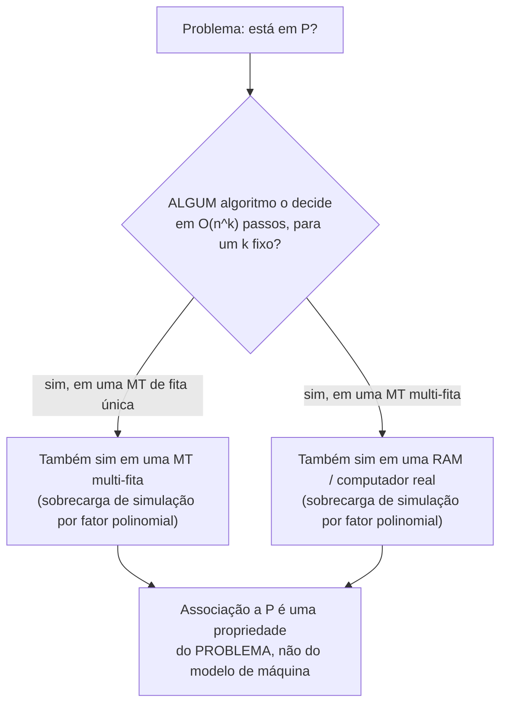

## Objetivos de Aprendizagem

- Definir a classe de complexidade P com precisão, em termos de problemas de decisão e tempo de execução de máquina de Turing.
- Explicar por que "tempo polinomial", em vez de algum outro limiar, é a linha de divisão padrão para "eficientemente solucionável."
- Justificar a robustez do tempo polinomial através de modelos razoáveis de computação, conectando-a à tese de Church-Turing.
- Justificar por que algoritmos de tempo polinomial se compõem: rodar um depois do outro, ou um dentro do outro, permanece polinomial.
- Nomear problemas concretos, já familiares, que pertencem a P, e enunciar por quê.

## Contexto e Motivação

Você já sabe como descrever o tempo de execução de um algoritmo usando notação Big-O, você consegue olhar para uma rotina de ordenação, uma travessia de grafo, ou um laço aninhado e dizer com confiança que roda em O(n log n), ou O(n²), ou O(n). O que Big-O dá a você é uma linguagem para descrever *como um algoritmo específico* escala. A classe de complexidade **P** pega esse mesmo vocabulário e faz algo ligeiramente diferente com ele: em vez de descrever um algoritmo, ela descreve um *problema*, perguntando não "quão rápido é este pedaço específico de código" mas "existe *algum* algoritmo de forma alguma, rodando em um modelo padrão de computação, que resolve este problema em tempo limitado por um polinômio no tamanho da entrada." P dá ao vocabulário Big-O que você já tem um lar preciso, formal: é a classe de problemas de decisão solucionáveis em tempo O(n^k), para alguma constante k, onde n é o tamanho da entrada. Esta é uma formalização genuína de algo para o qual você já tem intuição funcionando, não uma ideia nova empilhada em cima de uma não relacionada.

Por que este limiar particular, tempo polinomial, em oposição a, digamos, "roda em menos de um segundo" ou "roda em tempo O(n³) exatamente", merece ser tratado como *a* linha de divisão entre problemas que são praticamente solucionáveis e problemas que não são? A resposta honesta é que é uma linha imperfeita, e a disciplina é explícita sobre aquela imperfeição: um algoritmo rodando em O(n^100) é tecnicamente "eficiente" por esta definição e seria inútil na prática, enquanto um algoritmo rodando em O(1.0001^n) é tecnicamente "ineficiente" e poderia muito bem ser rápido o suficiente para toda entrada que alguém algum dia vá entregar a ele. Mas apesar desses casos extremos, tempo polinomial acaba sendo uma linha de divisão notavelmente robusta e útil, por duas razões concretas desenvolvidas na Teoria Central abaixo: ela se compõe de forma limpa, e é estável através de todo modelo razoável de computação, uma estabilidade que remonta diretamente à tese de Church-Turing que você já estudou.

Isso importa pela exata mesma razão prática pela qual a análise Big-O importou quando você a aprendeu pela primeira vez: a associação de um problema a P é uma promessa de que escalar não se torna catastrófico. Uma checagem de conectividade de grafo que funciona em um grafo de mil nós hoje ainda vai funcionar em um grafo de um milhão de nós amanhã, a um custo que cresce previsivelmente em vez de explosivamente, precisamente porque checagem de conectividade está em P. Os próximos conceitos nesta disciplina existem para traçar um contraste nítido com problemas que não fazem tal promessa, e P é a linha de base contra a qual cada um desses problemas posteriores vai ser julgado.

## Teoria Central

### Definição formal

Um **problema de decisão** é um problema cuja resposta é sempre SIM ou NÃO, equivalentemente, uma linguagem L (o conjunto de strings de entrada para as quais a resposta é SIM) que uma máquina de Turing pode ser convidada a decidir. A classe de complexidade **P** é o conjunto de problemas de decisão L tais que existe uma máquina de Turing M e uma constante k onde, para toda entrada de tamanho n, M para dentro de O(n^k) passos e decide corretamente se a entrada pertence a L.

Dois detalhes nesta definição importam e são fáceis de passar batido. Primeiro, **k é uma constante fixa, independente de n**, o limite precisa ser um único polinômio que funciona para todo tamanho de entrada, não um limite que tem permissão para mudar de forma conforme n cresce. Segundo, "tamanho da entrada" (n) significa o comprimento da codificação da entrada, para um grafo, isso é aproximadamente o número de vértices e arestas; para um número, é aproximadamente o número de dígitos (não o valor do número), uma distinção que vai importar mais adiante quando alguns problemas que parecem polinomiais no *valor* de um número acabam não sendo polinomiais no número de *dígitos* usados para escrevê-lo.

### Por que tempo polinomial se compõe

Uma das duas propriedades que torna "tempo polinomial" uma linha de divisão matematicamente conveniente, em vez de arbitrária, é que polinômios são fechados sob composição, adição, e multiplicação por uma constante. Se um programa chama uma sub-rotina que roda em tempo O(n^a) um total de O(n^b) vezes, o custo geral é O(n^(a+b)), ainda um polinômio. Se dois algoritmos de tempo polinomial são rodados um depois do outro, o tempo total é a soma de dois polinômios, ele mesmo um polinômio (especificamente, o de maior grau domina, e constantes são absorvidas exatamente como eram no raciocínio Big-O comum). Esta propriedade de fechamento falha para muitos outros limiares candidatos: se "eficiente" significasse O(n) exatamente, chamar uma sub-rotina de tempo linear n vezes já quebraria aquele limiar. Tempo polinomial é o limiar razoável mais frouxo que ainda garante esse tipo de estabilidade composicional, construa uma solução de tempo polinomial para um problema a partir de peças de tempo polinomial, em um número polinomial de passos, e o resultado ainda é de tempo polinomial, sem contabilidade separada necessária a cada passo.

### Por que tempo polinomial é robusto através de modelos

A segunda propriedade é que "solucionável em tempo polinomial" não depende de fato de qual modelo computacional razoável faz a solução. Uma máquina de Turing de fita única, uma máquina de Turing multi-fita, uma máquina de acesso aleatório, ou um processador moderno comum podem todos simular uns aos outros com no máximo uma desaceleração por fator polinomial, uma máquina de Turing de k fitas pode ser simulada por uma de fita única com só uma sobrecarga quadrática, por exemplo. Isso significa que a associação de um problema a P é um fato sobre o *problema*, não um artefato de qual modelo de máquina particular aconteceu de ser usado para enunciar a definição. Esta é exatamente a mesma estabilidade que a tese de Church-Turing já estabeleceu para a própria computabilidade, "computável" acabou não dependendo de qual modelo razoável de computação foi escolhido, e "eficientemente computável", no sentido de tempo polinomial, herda essa mesma independência de modelo. Esta robustez às vezes é enunciada como sua própria afirmação informal (a tese de Church-Turing estendida, ou "polinomial") precisamente porque desempenha o mesmo papel fundacional para eficiência que a tese original desempenha para computabilidade de forma alguma.

### Problemas concretos já conhecidos como estando em P

Você já estudou algoritmos para vários problemas que são membros de livro-texto de P, sem que esse rótulo tenha sido associado ainda. Ordenação baseada em comparação (merge sort, por exemplo) decide, como subproduto, perguntas como "esta lista já está ordenada" ou "esta lista contém uma duplicata" em tempo O(n log n), polinomial no tamanho da lista de entrada. Conectividade de grafo, "existe um caminho entre o vértice s e o vértice t", é decidível por uma travessia em largura ou em profundidade em tempo O(V + E), que é linear, e portanto polinomial, no tamanho da codificação do grafo. Nenhum desses fatos exigiu nenhuma ideia algorítmica nova para estabelecer; eles seguem imediatamente de algoritmos que você já sabe como rodar, uma vez que "tempo polinomial" é reconhecido como a propriedade formal que os tempos de execução desses algoritmos já satisfazem.

## Exemplos Resolvidos

### Exemplo 1: checando associação a P a partir de um limite de tempo de execução

**Problema:** Um algoritmo decide se uma dada lista de n inteiros contém uma duplicata rodando um laço aninhado, para cada um dos n elementos, ele compara contra todo outro elemento. Este problema está em P?

**Raciocínio.** O algoritmo de laço aninhado faz no máximo n · (n − 1) comparações, o que é O(n²). Este é um limite polinomial (k = 2) que vale para todo tamanho de entrada n, usando um algoritmo fixo. Portanto o problema de detecção de duplicata está em P, independentemente de existir um algoritmo mais rápido (uma abordagem baseada em ordenação alcança O(n log n), que também é polinomial, só de grau menor). Associação a P só exige que *algum* algoritmo de tempo polinomial exista; não exige que aquele algoritmo seja o mais rápido conhecido.

### Exemplo 2: um tempo de execução que NÃO é polinomial

**Problema:** Um algoritmo decide, para um grafo em n vértices, se ele tem um ciclo Hamiltoniano (um ciclo visitando todo vértice exatamente uma vez) tentando toda permutação possível dos n vértices e checando se forma um ciclo válido. Isso estabelece que o problema do ciclo Hamiltoniano está em P?

**Raciocínio.** Há n! permutações de n vértices, e checar cada uma custa no máximo O(n) trabalho adicional, para um tempo de execução total de O(n! · n). A função fatorial n! cresce mais rápido que qualquer polinômio fixo n^k, para qualquer constante k, n! eventualmente excede n^k conforme n cresce, e nenhum único k pode ser escolhido que limite n! para todo n. Então este algoritmo específico não estabelece associação a P; ele só mostra que o problema é *decidível* (o que nunca esteve em questão, a pergunta mais difícil é eficiência). Esta é exatamente a lacuna que o próximo conceito, NP, é construído para descrever: nenhum algoritmo de tempo polinomial é conhecido para ciclo Hamiltoniano, mas como será mostrado, um ciclo Hamiltoniano *proposto* pode ser checado rapidamente.

### Exemplo 3: verificando a propriedade de composição diretamente

**Problema:** O algoritmo A decide o problema X em tempo O(n³). O algoritmo B decide o problema Y em tempo O(n²) e, como um de seus passos, chama o algoritmo A exatamente uma vez por elemento de sua própria entrada (n vezes no total), em uma subentrada de tamanho no máximo n. Qual é o tempo de execução geral de B, e Y ainda está em P?

**Raciocínio.** Cada chamada a A custa O(n³) (limitar o tamanho da subentrada por n, o tamanho da entrada inteira, é sempre válido já que uma subentrada não pode ser maior que a entrada de onde veio). B chama A até n vezes, contribuindo O(n · n³) = O(n⁴) só dessas chamadas, mais o próprio trabalho O(n²) de B fora dessas chamadas. O total é O(n⁴ + n²) = O(n⁴), ainda um polinômio fixo, grau 4 em vez de grau 3. Então Y permanece em P. Esta é a propriedade de composição da Teoria Central tornada concreta: aninhar algoritmos de tempo polinomial dentro de algoritmos de tempo polinomial, mesmo repetidamente, nunca escapa de tempo polinomial, só muda em qual polinômio você aterrissa.

## Equívocos Comuns e Armadilhas

- **"Um algoritmo que roda em O(2^n) em algumas entradas mas geralmente termina rápido na prática está 'basicamente' em P."** Associação a P é sobre o limite de pior caso sobre *todas* as entradas de um dado tamanho, valendo para um expoente k fixo, não sobre comportamento típico ou médio. Um algoritmo com um pior caso exponencial não está em P não importa quão raramente aquele pior caso é disparado na prática, P é uma afirmação sobre uma garantia, não uma afirmação sobre comportamento observado nas entradas que alguém aconteceu de tentar.
- **"P significa 'rápido'."** Um algoritmo rodando em tempo O(n^100) é um membro de P pela definição formal, e seria catastroficamente lento para qualquer n maior que um punhado, dobrar o tamanho da entrada multiplica o tempo de execução por 2^100. Ao contrário, um algoritmo rodando em O(1.0001^n), tecnicamente não em P já que é exponencial, poderia ser perfeitamente usável para todo tamanho de entrada que alguém realisticamente forneça. P é uma linha de divisão matemática escolhida por sua composabilidade e independência de modelo, não uma certificação de velocidade prática, essa lacuna é reconhecida diretamente em Contexto e Motivação, não algo para encobrir.
- **"n é o valor do número de entrada, então um algoritmo que itera de 1 a n é polinomial."** Tamanho n significa o comprimento da *codificação* da entrada, não seu valor numérico. Um número m é escrito usando aproximadamente log₂(m) bits, então um algoritmo que itera m vezes (em vez de log(m) vezes) é na verdade exponencial no tamanho real da entrada, esta é precisamente a armadilha que faz alguns problemas teórico-numéricos parecerem enganosamente "polinomiais" até que a distinção de tamanho de codificação seja aplicada cuidadosamente.
- **"Mostrar que um algoritmo para um problema é exponencial demonstra que o problema em si não está em P."** Como o Exemplo Resolvido 2 mostra, descartar associação a P para um problema exige descartar *todo* algoritmo possível, não só aquele que você aconteceu de tentar. Um algoritmo exponencial para um problema só mostra que aquele algoritmo específico é lento; não diz nada sobre se um algoritmo mais esperto, de tempo polinomial, ainda poderia existir (e para alguns problemas, um foi depois encontrado, mesmo depois de anos de só algoritmos exponenciais serem conhecidos).

## Resumo

P formaliza exatamente a intuição já construída através da análise Big-O: é a classe de problemas de decisão solucionáveis por alguma máquina de Turing em tempo O(n^k), para uma constante fixa k, onde n mede o tamanho da codificação da entrada. Tempo polinomial ganha seu papel como a linha padrão (embora imperfeita) entre "eficientemente solucionável" e "não" por duas razões estruturais: polinômios se compõem de forma limpa sob adição, multiplicação, e aninhamento, então construir soluções a partir de peças de tempo polinomial nunca escapa de tempo polinomial; e associação a tempo polinomial é estável através de todo modelo razoável de computação, uma robustez que espelha, e estende, a independência de modelo que a tese de Church-Turing já estabeleceu para a própria computabilidade. Problemas de decisão relacionados a ordenação e conectividade de grafo são exemplos concretos, já familiares, de problemas em P. A pergunta em aberto que esta classe estabelece para tudo que segue é o que acontece com problemas onde nenhum algoritmo de tempo polinomial é conhecido como existindo de forma alguma, que é exatamente onde NP começa.

## Documentation Links

- [MIT 18.404/6.5400: Course Information (Sipser)](https://math.mit.edu/~sipser/18404/info.pdf): doc
- [ACM/IEEE CS2013: Full Curriculum Site](https://csed.acm.org/cs2013-version/): doc
