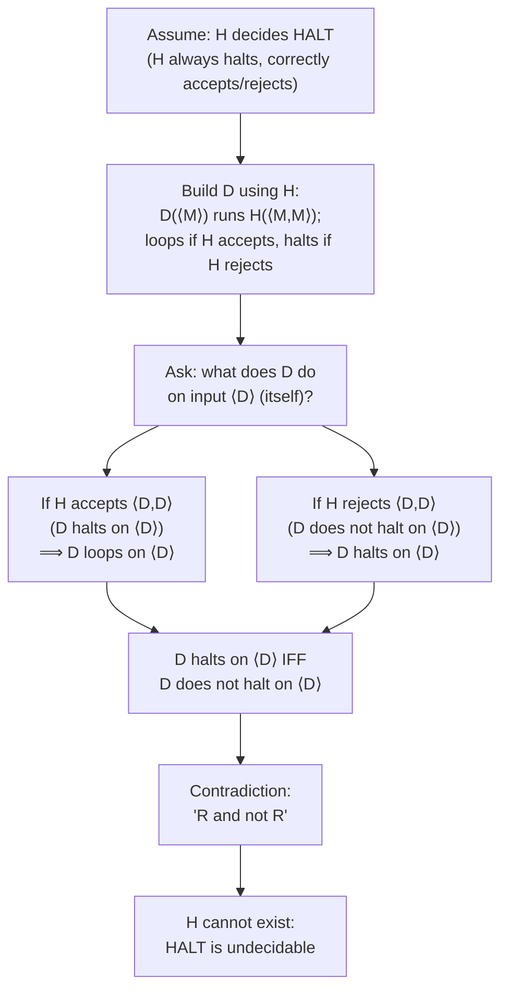

## Learning Objectives

- State the Halting Problem precisely as a language, HALT = {⟨M, w⟩ : M is a Turing machine that halts on input w}, and explain what it would mean for HALT to be decidable.
- Reproduce Turing's diagonalization argument in full: construct the hypothetical decider H, the derived machine D, and the self-referential input ⟨D⟩.
- Derive, explicitly, the contradiction "D halts on ⟨D⟩ if and only if D does not halt on ⟨D⟩," and explain why this forces H not to exist.
- Identify this argument as an instance of proof by contradiction, naming which assumption is negated and which statement is shown false.
- Explain why HALT is Turing-recognizable even though it is not decidable, and what that gap means operationally.

## Context & Motivation

Every programmer has, at some point, wished for a tool that could look at a program and its input and simply say, in finite time and with certainty, whether that program will ever finish running or will loop forever. Static analyzers try to approximate this for restricted cases; debuggers let you watch a program run and guess; but no one has ever built a tool that answers the question *correctly, in general, for every possible program and every possible input* — and this course is about to show that no one ever will, not because the engineering is hard, but because the task is logically impossible. This is the Halting Problem, and its undecidability is arguably the single most important result in the theory of computation: it is the first concrete example of a well-posed, precisely stated yes/no question about programs that has no algorithmic answer at all, and it sets the template — diagonalization, self-reference, proof by contradiction — that essentially every other undecidability result in this discipline (reductions, Rice's Theorem, and beyond) will lean on.

The result traces directly to Alan Turing's 1936 paper "On Computable Numbers, with an Application to the Entscheidungsproblem," which introduced the Turing machine specifically as the formal vehicle for proving that certain questions about computation have no computational answer. The "Entscheidungsproblem" (decision problem) Turing was answering was a variant of exactly this: is there a general procedure that decides whether any given mathematical statement is provable? Turing's answer — routed through the Halting Problem's undecidability — was no, and the argument he used has survived unchanged in structure for nearly a century because it does not depend on any accident of 1936-era machines; it depends only on the fact that a Turing machine's description can itself be fed to a Turing machine as input, which is unavoidable in any sufficiently general model of computation. Given the prior concept's setup (decidable languages are exactly those with a machine that halts and correctly answers on every input, while recognizable languages permit looping on rejected inputs), the Halting Problem lands as the sharpest possible illustration of that gap: it is recognizable — simply simulate M on w and accept if it halts — but, as this concept proves, it is not decidable, because no machine can also correctly detect and report the case where M runs forever without ever running forever itself while checking.

The proof structure you are about to see already has a name from a wholly different part of this curriculum: proof by contradiction, covered in general in "Proof by Contradiction," where a claim P is established by assuming ¬P, reasoning forward, and reaching a statement known to be false — after which modus tollens forces ¬P itself to be false, and therefore P true. Turing's argument for the undecidability of HALT is not merely *analogous* to that technique; it *is* that technique, applied to a very specific P: "no Turing machine decides HALT." The proof assumes the opposite — that a decider H for HALT exists — builds a specific, self-referential machine using H, and derives an outright logical impossibility, exactly the pattern that proof by contradiction predicts. Recognizing this connection is not a stylistic aside: it means the diagonalization argument, however unfamiliar it looks the first time through, is not a new kind of reasoning at all — it is the same "assume the opposite, build toward an absurdity" move already justified and practiced elsewhere, aimed at a new and much more consequential target.

## Core Theory

### Precise statement of the problem

Define the language

HALT = {⟨M, w⟩ : M is a Turing machine, w is a string, and M halts when run on input w}

where ⟨M, w⟩ denotes some fixed, computable encoding of the pair (machine description, input string) as a single string. "M halts on w" means M's computation on w eventually reaches an accept or reject state and stops — it does *not* run forever. The Halting Problem asks: is HALT a decidable language? That is, does there exist a Turing machine H such that, for every encoded pair ⟨M, w⟩:

- if M halts on w, H halts and accepts ⟨M, w⟩;
- if M does not halt on w (it loops forever), H halts and rejects ⟨M, w⟩.

Crucially, H itself must always halt — on every input, regardless of what M does — since a decider is required to halt on every input, never merely to loop when the answer would be "no."

### Theorem: HALT is undecidable

**Theorem.** No Turing machine decides HALT.

**Proof, by contradiction.** Suppose, for the sake of contradiction, that HALT *is* decidable — that is, suppose there exists a Turing machine H that, on any input ⟨M, w⟩, halts and outputs:

- accept, if M halts on w;
- reject, if M does not halt on w.

Using H as a subroutine, construct a new Turing machine D. D takes as input the description of a single Turing machine, ⟨M⟩ (note: not a pair — just one machine description, which D will feed to itself in a moment), and operates as follows:

**D, on input ⟨M⟩:**
1. Run H on input ⟨M, M⟩ — that is, feed M's own description to H as *both* the machine and the input.
2. If H accepts ⟨M, M⟩ (meaning: M halts when run on its own description as input), then D enters an infinite loop and never halts.
3. If H rejects ⟨M, M⟩ (meaning: M does not halt when run on its own description as input), then D halts and rejects (or accepts — any halting behavior works; the point is only that D halts).

In short: D does the *opposite* of what H predicts M would do on input ⟨M⟩. Since H was assumed to always halt (it is a decider), step 1 always completes, so D is a well-defined Turing machine: on every input ⟨M⟩, D either halts (case 3) or loops forever (case 2), depending entirely on what H says about M.

Now — and this is the pivotal, self-referential move — ask what D does when it is run on its *own* description, ⟨D⟩, as input.

By D's own construction (substituting M := D in the three steps above):

- D runs H on ⟨D, D⟩.
- If H accepts ⟨D, D⟩ — meaning D halts on input ⟨D⟩ — then D (by its own step 2) loops forever on ⟨D⟩.
- If H rejects ⟨D, D⟩ — meaning D does not halt on input ⟨D⟩ — then D (by its own step 3) halts on ⟨D⟩.

Read that again as a single statement about D running on ⟨D⟩: **D halts on ⟨D⟩ if and only if D does not halt on ⟨D⟩.** This is a direct logical contradiction — a statement of the form "R and not R," where R = "D halts on ⟨D⟩." It cannot be resolved by more careful analysis of D's behavior, because D's behavior on ⟨D⟩ is forced, by H's own assumed correctness, to be simultaneously halting and non-halting. No actual machine can do this; the contradiction is absolute.

Since every step in constructing D from H, and every step in the argument that D on ⟨D⟩ leads to "halts iff does not halt," is a valid, mechanical consequence of assuming H exists and correctly decides HALT, the only assumption available to blame is the one made at the outset: that H exists at all. Therefore no such H can exist, and HALT is not decidable. ∎

This is precisely the shape codified in "Proof by Contradiction": the target claim P is "no Turing machine decides HALT"; the proof assumes ¬P (a decider H exists), reasons forward mechanically (building D, then running D on ⟨D⟩), and reaches a statement C of the form "R and not R" — an outright impossibility — which forces ¬P to be false and P true. Nothing about self-reference or diagonalization changes the underlying logical machinery; it only supplies the specific ¬P → C chain that a generic contradiction proof requires.

### Why the diagonalization label

The argument is called a "diagonalization" argument because of its family resemblance to Cantor's diagonal argument for the uncountability of the reals: imagine an (infinite) table whose rows are indexed by machines M and whose columns are also indexed by machines M, where cell (M, N) records whether M halts on ⟨N⟩. H, if it existed, would let you fill in every cell of this table. D is constructed to disagree with the "diagonal" of this table — D's behavior on ⟨D⟩ is defined to be the *opposite* of what the diagonal entry (D, D) says H would predict. This is exactly the same trick Cantor used to construct a real number that differs from every number on a list, at the position corresponding to itself. The self-application (feeding a machine its own description) is what makes the diagonal move possible at all: D must be able to run itself, in encoded form, as input to H, which is precisely why the Halting Problem's contradiction requires D to inspect ⟨D⟩ rather than some fixed, unrelated string.

### HALT is recognizable but not decidable

Although HALT is not decidable, it is Turing-recognizable: the machine that, on input ⟨M, w⟩, simulates M running on w and accepts if and when that simulation halts, correctly recognizes HALT — it accepts every ⟨M, w⟩ where M halts on w, and it fails to halt (rather than incorrectly rejecting) on every ⟨M, w⟩ where M does not halt on w. This machine is not a decider, precisely because it does not halt on the "no" instances — it simply keeps simulating forever, which is indistinguishable, from the outside, from "still working on it." The undecidability proof above shows that this asymmetry cannot be fixed: no cleverer simulation, timeout heuristic, or static analysis can, in general, replace the missing "halt and report no" behavior, because doing so for *every* possible M and w is exactly what was shown impossible.

## Worked Examples

### Example 1 — walking D through a concrete (hypothetical) H

**Problem:** Suppose, purely as an exercise (impossible, since H cannot exist, but useful for tracing the mechanics), that H behaves exactly as specified: H(⟨M, w⟩) accepts iff M halts on w. Trace exactly what D does on input ⟨D⟩, step by step, and identify where the contradiction appears.

**Trace.** D is invoked on ⟨D⟩. Following D's own definition with M := D:
1. D runs H on ⟨D, D⟩. Per H's specification, this returns accept iff D halts on input ⟨D⟩.
2. Suppose the returned answer is "accept" (i.e., suppose D halts on ⟨D⟩). Then by D's step 2, D loops forever on this input. But we assumed D halts on ⟨D⟩ — contradiction: D cannot both halt and loop on the same input, on the same run.
3. Suppose instead the returned answer is "reject" (i.e., suppose D does not halt on ⟨D⟩). Then by D's step 3, D halts on this input. But we assumed D does not halt on ⟨D⟩ — again a contradiction.

**Conclusion.** Both of the only two possible outcomes for H(⟨D,D⟩) — accept or reject — lead immediately to a contradiction about whether D halts on ⟨D⟩. Since H is assumed to always produce one of these two outcomes (it is a decider, and deciders always halt), there is no consistent way for the scenario to play out at all. The contradiction is not a curiosity about a specific edge case — it shows the *entire hypothetical* (H exists and behaves as specified) is untenable.

### Example 2 — why fixing D by "detecting infinite loops directly" does not work

**Problem:** A common objection: "why not just have D detect that it's about to loop forever, and halt in that case, sidestepping the paradox?" Explain precisely why this does not save the argument.

**Reasoning.** The objection assumes there is some other means, outside of asking H, for D (or anything else) to detect whether a given machine loops forever. But detecting whether an arbitrary machine halts on a given input is *exactly* HALT — the very language H was assumed to decide. "Detect the infinite loop directly" is not a way around calling H; it is a restatement of what H was supposed to already do. If D could reliably detect this some other way, that other way would itself be a decider for HALT, and the same construction (build a D′ from that alternate decider, run D′ on ⟨D′⟩) reproduces the identical contradiction one level up. There is no escape hatch that does not itself require deciding HALT, which is precisely the thing under proof to be impossible.

### Example 3 — applying the argument's logic to a slightly different self-reference

**Problem:** Suppose someone proposes a "partial" decider H′ that is only required to correctly decide HALT for machines M that do not take their own description as input (i.e., H′ need not handle the self-referential case ⟨M, M⟩ at all). Does the Halting Problem's undecidability proof say anything about H′?

**Reasoning.** The proof above specifically constructs D and refutes H by evaluating D on ⟨D⟩ — a self-referential input. If H′ is explicitly permitted to behave arbitrarily (or be undefined) exactly on inputs of the form ⟨M, M⟩, then the D-construction cannot be carried out against H′ in the way shown, because the contradiction required H to give a definite, correct answer specifically on ⟨D, D⟩. This does not mean H′ is easy to build in general (deciding HALT correctly on all non-self-referential pairs ⟨M, w⟩ where w ≠ ⟨M⟩ is still an enormous, almost certainly still-undecidable task, provable by a closely related argument), but it illustrates precisely which piece of H's assumed power the contradiction depends on: correctness on the single, self-referential pair ⟨D, D⟩. This is exactly why the proof is often described as exploiting self-reference rather than "brute impossibility" in general — the contradiction is surgically aimed at one specific input.

## Common Misconceptions & Pitfalls

- **"The Halting Problem is undecidable just means nobody has found the algorithm yet — a cleverer approach might still work."** The proof above is not an empirical failure to find an algorithm; it is a demonstration that *any* algorithm claiming to decide HALT can be turned, mechanically, into a machine D whose behavior is logically contradictory. This rules out every possible algorithm, not just the ones tried so far, including algorithms that have not been invented yet — the argument never inspects what H's internal logic looks like, only that it is assumed to always halt and always answer correctly.
- **"D looping forever in step 2 is itself a violation, so D isn't a valid Turing machine."** D is a perfectly well-defined Turing machine — looping forever on some inputs is completely ordinary behavior for a Turing machine (it just means D does not decide anything on those inputs; it recognizes or does neither). The contradiction is not that D fails to be a legitimate machine; it is that H's assumed correctness about D's behavior on ⟨D⟩ is self-refuting.
- **"The contradiction only shows that this particular H is wrong — a different, smarter H might avoid it."** The proof places no restriction whatsoever on H's internal design; H is only assumed to have the two defining properties of a HALT-decider (always halts, always correct). The construction of D and the resulting contradiction go through identically for *any* machine with those two properties, so the conclusion is that no machine with those properties can exist, not that this specific H was poorly built.
- **"Since HALT is undecidable, it's also not recognizable — 'undecidable' means 'nothing can be determined about it.'"** HALT is recognizable (simulate and accept on halting), just not decidable. Undecidable only rules out the stronger requirement of always halting with a correct yes/no answer; it says nothing about whether a one-sided recognizer can exist, and in this case one plainly does.
- **"Running D on ⟨D⟩ is a strange edge case invented just for the proof — real Turing machines never process their own descriptions."** Self-application (a machine taking its own description as input) is completely mechanical and always available: any Turing machine's description is just a finite string, and any finite string can be fed as input to any Turing machine, including that very machine. There is nothing paradoxical about the *setup*; the paradox is specifically what happens when H is layered on top of that ordinary self-application.

## Summary

The Halting Problem asks whether HALT = {⟨M, w⟩ : M halts on w} is decidable, and Turing's original argument proves it is not, by contradiction: assume a decider H for HALT exists, build a machine D that runs H on ⟨M, M⟩ and does the opposite of what H predicts, then evaluate D on its own description ⟨D⟩ — deriving the explicit contradiction that D halts on ⟨D⟩ if and only if D does not halt on ⟨D⟩. Since this is a genuine logical impossibility ("R and not R"), the only faulty assumption is that H exists at all, so no decider for HALT can exist. This argument is a direct instance of the general proof-by-contradiction technique — assume the negation of the claim, reach an absurdity, conclude the claim — applied via a self-referential, diagonalization-style construction that will recur throughout this discipline. HALT nonetheless remains Turing-recognizable: simulating M on w and accepting upon halting correctly handles every "yes" instance, even though no machine can also correctly and reliably report every "no" instance in finite time.

## Documentation Links

- [MIT 18.404/6.5400 — Course Information (Sipser)](https://math.mit.edu/~sipser/18404/info.pdf) — doc
- [Stanford CS154 — Course Home](https://cs154.stanford.edu/) — doc
