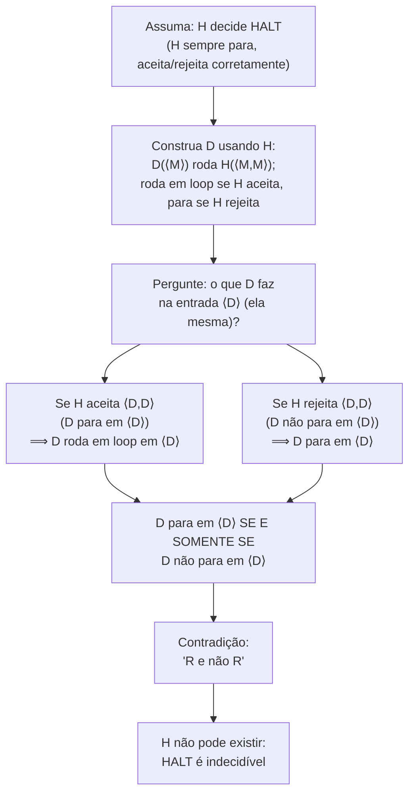

## Objetivos de Aprendizagem

- Enunciar o Problema da Parada com precisão como uma linguagem, HALT = {⟨M, w⟩ : M é uma máquina de Turing que para na entrada w}, e explicar o que significaria HALT ser decidível.
- Reproduzir o argumento de diagonalização de Turing por completo: construir o decisor hipotético H, a máquina derivada D, e a entrada autorreferencial ⟨D⟩.
- Derivar, explicitamente, a contradição "D para em ⟨D⟩ se e somente se D não para em ⟨D⟩", e explicar por que isso força H a não existir.
- Identificar este argumento como uma instância de prova por contradição, nomeando qual suposição é negada e qual afirmação é mostrada falsa.
- Explicar por que HALT é Turing-reconhecível mesmo não sendo decidível, e o que essa lacuna significa operacionalmente.

## Contexto e Motivação

Todo programador já, em algum momento, desejou uma ferramenta que pudesse olhar para um programa e sua entrada e simplesmente dizer, em tempo finito e com certeza, se aquele programa algum dia vai terminar de rodar ou vai rodar para sempre em loop. Analisadores estáticos tentam aproximar isso para casos restritos; depuradores deixam você observar um programa rodar e adivinhar; mas ninguém jamais construiu uma ferramenta que responde a pergunta *corretamente, em geral, para todo programa possível e toda entrada possível*, e este curso está prestes a mostrar que ninguém jamais vai construir, não porque a engenharia é difícil, mas porque a tarefa é logicamente impossível. Este é o Problema da Parada, e sua indecidibilidade é indiscutivelmente o resultado mais importante na teoria da computação: é o primeiro exemplo concreto de uma pergunta sim/não bem posta, precisamente enunciada, sobre programas que não tem nenhuma resposta algorítmica de forma alguma, e estabelece o modelo, diagonalização, autorreferência, prova por contradição, no qual essencialmente todo outro resultado de indecidibilidade nesta disciplina (reduções, o Teorema de Rice, e além) vai se apoiar.

O resultado remonta diretamente ao artigo de Alan Turing de 1936, "On Computable Numbers, with an Application to the Entscheidungsproblem," que introduziu a máquina de Turing especificamente como o veículo formal para demonstrar que certas perguntas sobre computação não têm resposta computacional. O "Entscheidungsproblem" (problema da decisão) que Turing estava respondendo era uma variante exatamente disto: existe um procedimento geral que decide se qualquer enunciado matemático dado é demonstrável? A resposta de Turing, roteada através da indecidibilidade do Problema da Parada, foi não, e o argumento que ele usou sobreviveu inalterado em estrutura por quase um século porque não depende de nenhum acidente das máquinas da era de 1936; depende só do fato de que a descrição de uma máquina de Turing pode ela mesma ser entregue a uma máquina de Turing como entrada, o que é inevitável em qualquer modelo suficientemente geral de computação. Dada a configuração do conceito anterior (linguagens decidíveis são exatamente aquelas com uma máquina que para e responde corretamente em toda entrada, enquanto linguagens reconhecíveis permitem rodar em loop em entradas rejeitadas), o Problema da Parada surge como a ilustração mais aguda possível daquela lacuna: é reconhecível, simplesmente simule M em w e aceite se ela para, mas, como este conceito demonstra, não é decidível, porque nenhuma máquina consegue também corretamente detectar e reportar o caso onde M roda para sempre sem ela mesma rodar para sempre enquanto checa.

A estrutura da prova que você está prestes a ver já tem um nome de uma parte totalmente diferente deste currículo: prova por contradição, coberta em geral em "Prova por Contradição", onde uma afirmação P é estabelecida assumindo ¬P, raciocinando adiante, e alcançando uma afirmação conhecida como falsa, depois do que modus tollens força ¬P em si a ser falso, e portanto P verdadeiro. O argumento de Turing para a indecidibilidade de HALT não é meramente *análogo* àquela técnica; ele *é* aquela técnica, aplicada a um P muito específico: "nenhuma máquina de Turing decide HALT." A prova assume o oposto, que um decisor H para HALT existe, constrói uma máquina específica, autorreferencial, usando H, e deriva uma impossibilidade lógica direta, exatamente o padrão que prova por contradição prediz. Reconhecer essa conexão não é um aparte estilístico: significa que o argumento de diagonalização, por mais não familiar que pareça na primeira vez, não é de forma alguma um novo tipo de raciocínio, é o mesmo movimento "assuma o oposto, construa em direção a um absurdo" já justificado e praticado em outro lugar, mirado a um alvo novo e muito mais consequente.

## Teoria Central

### Enunciado preciso do problema

Defina a linguagem

HALT = {⟨M, w⟩ : M é uma máquina de Turing, w é uma string, e M para quando rodada na entrada w}

onde ⟨M, w⟩ denota alguma codificação fixa, computável, do par (descrição de máquina, string de entrada) como uma única string. "M para em w" significa que a computação de M em w eventualmente alcança um estado de aceitação ou rejeição e para, ela *não* roda para sempre. O Problema da Parada pergunta: HALT é uma linguagem decidível? Ou seja, existe uma máquina de Turing H tal que, para todo par codificado ⟨M, w⟩:

- se M para em w, H para e aceita ⟨M, w⟩;
- se M não para em w (ela roda para sempre em loop), H para e rejeita ⟨M, w⟩.

Crucialmente, H em si precisa sempre parar, em toda entrada, independentemente do que M faz, já que um decisor é exigido a parar em toda entrada, nunca meramente rodar em loop quando a resposta seria "não."

### Teorema: HALT é indecidível

**Teorema.** Nenhuma máquina de Turing decide HALT.

**Prova, por contradição.** Suponha, para fins de contradição, que HALT *é* decidível, ou seja, suponha que existe uma máquina de Turing H que, em qualquer entrada ⟨M, w⟩, para e produz:

- aceita, se M para em w;
- rejeita, se M não para em w.

Usando H como uma sub-rotina, construa uma nova máquina de Turing D. D recebe como entrada a descrição de uma única máquina de Turing, ⟨M⟩ (note: não um par, só uma descrição de máquina, que D vai entregar a si mesma em um momento), e opera da seguinte forma:

**D, na entrada ⟨M⟩:**
1. Rode H na entrada ⟨M, M⟩, ou seja, entregue a própria descrição de M a H tanto como a máquina quanto como a entrada.
2. Se H aceita ⟨M, M⟩ (significando: M para quando rodada em sua própria descrição como entrada), então D entra em um loop infinito e nunca para.
3. Se H rejeita ⟨M, M⟩ (significando: M não para quando rodada em sua própria descrição como entrada), então D para e rejeita (ou aceita, qualquer comportamento de parada funciona; o ponto é só que D para).

Em resumo: D faz o *oposto* do que H prediz que M faria na entrada ⟨M⟩. Já que H foi assumida como sempre parando (ela é um decisor), o passo 1 sempre completa, então D é uma máquina de Turing bem definida: em toda entrada ⟨M⟩, D ou para (caso 3) ou roda para sempre em loop (caso 2), dependendo inteiramente do que H diz sobre M.

Agora, e este é o movimento pivotal, autorreferencial, pergunte o que D faz quando é rodada em sua *própria* descrição, ⟨D⟩, como entrada.

Pela própria construção de D (substituindo M := D nos três passos acima):

- D roda H em ⟨D, D⟩.
- Se H aceita ⟨D, D⟩, significando que D para na entrada ⟨D⟩, então D (pelo seu próprio passo 2) roda para sempre em loop em ⟨D⟩.
- Se H rejeita ⟨D, D⟩, significando que D não para na entrada ⟨D⟩, então D (pelo seu próprio passo 3) para em ⟨D⟩.

Leia isso de novo como uma única afirmação sobre D rodando em ⟨D⟩: **D para em ⟨D⟩ se e somente se D não para em ⟨D⟩.** Esta é uma contradição lógica direta, uma afirmação da forma "R e não R", onde R = "D para em ⟨D⟩." Ela não pode ser resolvida por uma análise mais cuidadosa do comportamento de D, porque o comportamento de D em ⟨D⟩ é forçado, pela própria correção assumida de H, a ser simultaneamente parando e não parando. Nenhuma máquina real consegue fazer isso; a contradição é absoluta.

Já que todo passo na construção de D a partir de H, e todo passo no argumento de que D em ⟨D⟩ leva a "para se e somente se não para", é uma consequência mecânica válida de assumir que H existe e decide HALT corretamente, a única suposição disponível para culpar é a feita no início: que H existe de forma alguma. Portanto nenhuma tal H pode existir, e HALT não é decidível. ∎

Esta é precisamente a forma codificada em "Prova por Contradição": a afirmação alvo P é "nenhuma máquina de Turing decide HALT"; a prova assume ¬P (um decisor H existe), raciocina adiante mecanicamente (construindo D, depois rodando D em ⟨D⟩), e alcança uma afirmação C da forma "R e não R", uma impossibilidade categórica, o que força ¬P a ser falso e P verdadeiro. Nada sobre autorreferência ou diagonalização muda a maquinaria lógica subjacente; ela só fornece a cadeia específica ¬P → C que uma prova por contradição genérica exige.

### Por que o rótulo diagonalização

O argumento é chamado de argumento de "diagonalização" por causa de sua semelhança de família com o argumento diagonal de Cantor para a incontabilidade dos reais: imagine uma tabela (infinita) cujas linhas são indexadas por máquinas M e cujas colunas também são indexadas por máquinas M, onde a célula (M, N) registra se M para em ⟨N⟩. H, se existisse, deixaria você preencher toda célula desta tabela. D é construída para discordar da "diagonal" desta tabela, o comportamento de D em ⟨D⟩ é definido para ser o *oposto* do que a entrada diagonal (D, D) diz que H prediria. Este é exatamente o mesmo truque que Cantor usou para construir um número real que difere de todo número em uma lista, na posição correspondente a si mesmo. A autoaplicação (entregar a uma máquina sua própria descrição) é o que torna o movimento diagonal possível de forma alguma: D precisa ser capaz de rodar a si mesma, em forma codificada, como entrada para H, o que é precisamente por que a contradição do Problema da Parada exige que D inspecione ⟨D⟩ em vez de alguma string fixa, não relacionada.

### HALT é reconhecível mas não decidível

Embora HALT não seja decidível, ela é Turing-reconhecível: a máquina que, na entrada ⟨M, w⟩, simula M rodando em w e aceita se e quando aquela simulação para, corretamente reconhece HALT, ela aceita todo ⟨M, w⟩ onde M para em w, e ela falha em parar (em vez de incorretamente rejeitar) em todo ⟨M, w⟩ onde M não para em w. Esta máquina não é um decisor, precisamente porque ela não para nas instâncias "não", ela simplesmente continua simulando para sempre, o que é indistinguível, de fora, de "ainda trabalhando nisso." A prova de indecidibilidade acima mostra que essa assimetria não pode ser corrigida: nenhuma simulação mais esperta, heurística de timeout, ou análise estática consegue, em geral, substituir o comportamento faltante de "parar e reportar não", porque fazer isso para *todo* M e w possível é exatamente o que foi mostrado impossível.

## Exemplos Resolvidos

### Exemplo 1: percorrendo D através de uma H hipotética concreta

**Problema:** Suponha, puramente como um exercício (impossível, já que H não pode existir, mas útil para rastrear a mecânica), que H se comporta exatamente como especificado: H(⟨M, w⟩) aceita se e somente se M para em w. Rastreie exatamente o que D faz na entrada ⟨D⟩, passo a passo, e identifique onde a contradição aparece.

**Rastro.** D é invocada em ⟨D⟩. Seguindo a própria definição de D com M := D:
1. D roda H em ⟨D, D⟩. Pela especificação de H, isso retorna aceita se e somente se D para na entrada ⟨D⟩.
2. Suponha que a resposta retornada é "aceita" (ou seja, suponha que D para em ⟨D⟩). Então pelo passo 2 de D, D roda para sempre em loop nesta entrada. Mas nós assumimos que D para em ⟨D⟩, contradição: D não pode tanto parar quanto rodar em loop na mesma entrada, na mesma execução.
3. Suponha em vez disso que a resposta retornada é "rejeita" (ou seja, suponha que D não para em ⟨D⟩). Então pelo passo 3 de D, D para nesta entrada. Mas nós assumimos que D não para em ⟨D⟩, novamente uma contradição.

**Conclusão.** Ambos os únicos dois resultados possíveis para H(⟨D,D⟩), aceita ou rejeita, levam imediatamente a uma contradição sobre se D para em ⟨D⟩. Já que H é assumida como sempre produzindo um desses dois resultados (ela é um decisor, e decisores sempre param), não há forma consistente do cenário se desenrolar de forma alguma. A contradição não é uma curiosidade sobre um caso extremo específico, ela mostra que o *cenário hipotético inteiro* (H existe e se comporta como especificado) é insustentável.

### Exemplo 2: por que consertar D "detectando loops infinitos diretamente" não funciona

**Problema:** Uma objeção comum: "por que não simplesmente fazer D detectar que está prestes a entrar em loop para sempre, e parar nesse caso, contornando o paradoxo?" Explique precisamente por que isso não salva o argumento.

**Raciocínio.** A objeção assume que existe algum outro meio, fora de chamar H, para D (ou qualquer outra coisa) detectar se uma dada máquina roda para sempre em loop. Mas detectar se uma máquina arbitrária para em uma dada entrada é *exatamente* HALT, a própria linguagem que H foi assumida como decidindo. "Detecte o loop infinito diretamente" não é uma forma de contornar chamar H; é uma reafirmação do que H deveria já fazer. Se D pudesse detectar isso de forma confiável de alguma outra forma, aquela outra forma seria ela mesma um decisor para HALT, e a mesma construção (construa um D′ a partir daquele decisor alternativo, rode D′ em ⟨D′⟩) reproduz a contradição idêntica um nível acima. Não há saída de emergência que não exija ela mesma decidir HALT, que é precisamente a coisa sob prova de ser impossível.

### Exemplo 3: aplicando a lógica do argumento a uma autorreferência ligeiramente diferente

**Problema:** Suponha que alguém propõe um decisor "parcial" H′ que só é exigido a decidir corretamente HALT para máquinas M que não recebem sua própria descrição como entrada (ou seja, H′ não precisa tratar o caso autorreferencial ⟨M, M⟩ de forma alguma). A prova de indecidibilidade do Problema da Parada diz algo sobre H′?

**Raciocínio.** A prova acima especificamente constrói D e refuta H avaliando D em ⟨D⟩, uma entrada autorreferencial. Se H′ é explicitamente permitida a se comportar arbitrariamente (ou ser indefinida) exatamente em entradas da forma ⟨M, M⟩, então a construção-D não pode ser realizada contra H′ da forma mostrada, porque a contradição exigia que H desse uma resposta definitiva, correta especificamente em ⟨D, D⟩. Isso não significa que H′ é fácil de construir em geral (decidir HALT corretamente em todos os pares não autorreferenciais ⟨M, w⟩ onde w ≠ ⟨M⟩ ainda é uma tarefa enorme, quase certamente ainda indecidível, demonstrável por um argumento intimamente relacionado), mas ilustra precisamente qual pedaço do poder assumido de H a contradição depende: correção no único par autorreferencial, ⟨D, D⟩. Isto é exatamente por que a prova é frequentemente descrita como explorando autorreferência em vez de "impossibilidade bruta" em geral, a contradição é mirada cirurgicamente a uma entrada específica.

## Equívocos Comuns e Armadilhas

- **"O Problema da Parada ser indecidível só significa que ninguém encontrou o algoritmo ainda, uma abordagem mais esperta ainda poderia funcionar."** A prova acima não é uma falha empírica em encontrar um algoritmo; é uma demonstração de que *qualquer* algoritmo alegando decidir HALT pode ser transformado, mecanicamente, em uma máquina D cujo comportamento é logicamente contraditório. Isso descarta todo algoritmo possível, não só os já tentados, incluindo algoritmos ainda não inventados, o argumento nunca inspeciona como a lógica interna de H se parece, só que ela é assumida como sempre parando e sempre respondendo corretamente.
- **"D rodando para sempre em loop no passo 2 é em si uma violação, então D não é uma máquina de Turing válida."** D é uma máquina de Turing perfeitamente bem definida, rodar para sempre em loop em algumas entradas é um comportamento completamente comum para uma máquina de Turing (só significa que D não decide nada naquelas entradas; ela reconhece ou não faz nenhum dos dois). A contradição não é que D falha em ser uma máquina legítima; é que a correção assumida de H sobre o comportamento de D em ⟨D⟩ é autorrefutante.
- **"A contradição só mostra que essa H específica está errada, uma H diferente, mais esperta, poderia evitá-la."** A prova não coloca nenhuma restrição sobre o design interno de H; H só é assumida como tendo as duas propriedades definidoras de um decisor-de-HALT (sempre para, sempre correta). A construção de D e a contradição resultante se aplicam identicamente para *qualquer* máquina com essas duas propriedades, então a conclusão é que nenhuma máquina com essas propriedades pode existir, não que essa H específica foi mal construída.
- **"Já que HALT é indecidível, ela também não é reconhecível, 'indecidível' significa 'nada pode ser determinado sobre ela'."** HALT é reconhecível (simule e aceite ao parar), só não decidível. Indecidível só descarta o requisito mais forte de sempre parar com uma resposta sim/não correta; não diz nada sobre se um reconhecedor unilateral pode existir, e neste caso um claramente existe.
- **"Rodar D em ⟨D⟩ é um caso extremo estranho inventado só para a prova, máquinas de Turing reais nunca processam suas próprias descrições."** Autoaplicação (uma máquina recebendo sua própria descrição como entrada) é completamente mecânica e sempre disponível: a descrição de qualquer máquina de Turing é só uma string finita, e qualquer string finita pode ser entregue como entrada a qualquer máquina de Turing, incluindo essa mesma máquina. Não há nada paradoxal sobre a *configuração*; o paradoxo é especificamente o que acontece quando H é sobreposta a essa autoaplicação comum.

## Resumo

O Problema da Parada pergunta se HALT = {⟨M, w⟩ : M para em w} é decidível, e o argumento original de Turing demonstra que não é, por contradição: assuma que um decisor H para HALT existe, construa uma máquina D que roda H em ⟨M, M⟩ e faz o oposto do que H prediz, depois avalie D em sua própria descrição ⟨D⟩, derivando a contradição explícita de que D para em ⟨D⟩ se e somente se D não para em ⟨D⟩. Já que isso é uma impossibilidade lógica genuína ("R e não R"), a única suposição falha é que H existe de forma alguma, então nenhum decisor para HALT pode existir. Este argumento é uma instância direta da técnica geral de prova por contradição, assuma a negação da afirmação, alcance um absurdo, conclua a afirmação, aplicada via uma construção autorreferencial, em estilo diagonalização, que vai recorrer ao longo desta disciplina. HALT continua sendo Turing-reconhecível: simular M em w e aceitar ao parar trata corretamente toda instância "sim", mesmo que nenhuma máquina consiga também correta e confiavelmente reportar toda instância "não" em tempo finito.

## Documentation Links

- [MIT 18.404/6.5400: Course Information (Sipser)](https://math.mit.edu/~sipser/18404/info.pdf): doc
- [Stanford CS154: Course Home](https://cs154.stanford.edu/): doc
