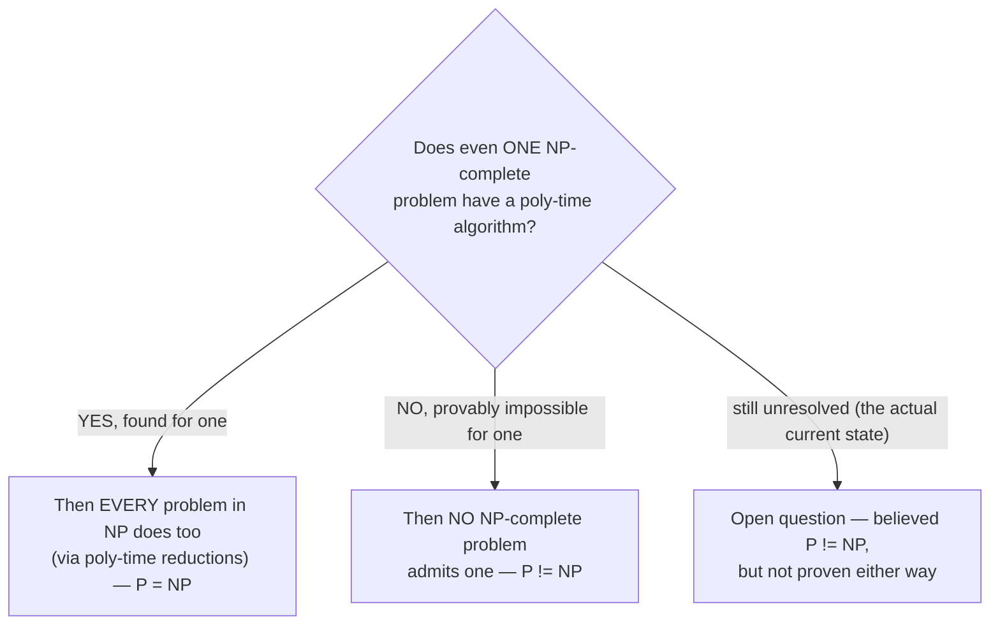

## Learning Objectives

- State the P vs. NP question precisely, in terms of the classes already built across this discipline.
- Explain the real, documented stakes of each possible resolution — for optimization and search problems, and for cryptography.
- Identify P vs. NP as one of the seven Clay Millennium Prize Problems, and state its current status accurately.
- Synthesize the discipline's two halves — decidability and complexity — by contrasting "proven impossible forever" with "conjectured hard, but unproven."
- Explain why NP-completeness (via reduction) makes the stakes of P vs. NP apply to an entire, enormous class of problems at once, rather than to one problem in isolation.

## Context & Motivation

Every concept in this discipline's second half has been building toward a single, precise question, and this capstone is where all of it finally converges. P is the class of problems solvable efficiently, from scratch, in polynomial time. NP is the (provably larger-or-equal) class of problems whose solutions can be efficiently *verified*, even when no efficient way to *find* one is known. NP-completeness identified specific problems — SAT, Independent Set, and (via reduction) an enormous, ever-growing catalog of others — that are simultaneously in NP and at least as hard as everything else in NP, meaning a polynomial-time algorithm for any single one of them would immediately yield one for all of NP at once. coNP mirrored the same verification-based idea around NO-answers instead of YES-answers. The **P vs. NP question** asks the thing all of this machinery was assembled to make precise: is P actually equal to NP? Does every problem whose solution can be *verified* quickly also admit one that can be *found* quickly — or is verifying genuinely, permanently easier than finding, for at least some problems?

This is not an idle academic curiosity. It is one of the seven **Clay Millennium Prize Problems**, named by the Clay Mathematics Institute in 2000 as the seven most important open problems in mathematics, each carrying a real, standing $1,000,000 prize for a correct proof (in either direction — proving P = NP or proving P ≠ NP would each qualify). Of the seven, only one (the Poincaré conjecture) has been solved since the prize was announced; P vs. NP remains open, and has remained open since the classes were formalized in the early 1970s, despite sustained effort from the theoretical computer science community across five decades.

The reason the question carries such weight is that NP-completeness (the previous three concepts' entire payoff) means the resolution wouldn't just settle the fate of one isolated problem — it would settle the fate of thousands of them simultaneously, all connected by polynomial-time reductions into one single class whose difficulty rises and falls together.

## Core Theory

### The question, precisely

**Does P = NP?** Equivalently, using the vocabulary built across this discipline: for every decision problem with a polynomial-time verifier, does there also exist a polynomial-time algorithm that solves it outright, with no certificate handed in advance? P ⊆ NP is proven (any polynomial-time solver doubles as its own trivial verifier, ignoring whatever certificate is supplied). What remains completely open is the reverse containment, NP ⊆ P — and NP-completeness gives a sharp, single-point way to settle it: because every problem in NP reduces, in polynomial time, to any one NP-complete problem, P = NP holds if and only if even one NP-complete problem (SAT, Independent Set, or any of the others reached by chained reductions) has a polynomial-time algorithm. Prove that for a single one, and the entire class NP collapses into P; prove no polynomial-time algorithm can exist for even one, and P ≠ NP follows for the whole class at once.

### The stakes if P = NP

If even one NP-complete problem turned out to have a polynomial-time algorithm, the consequences would be immediate and sweeping, for two well-documented reasons. First, an enormous range of currently-hard optimization and search problems — scheduling, routing, resource allocation, circuit design, and every other problem shown NP-complete by a reduction chain traced back to Cook-Levin — would suddenly admit efficient exact solutions, rather than the approximations and heuristics practitioners currently rely on. Problems currently considered intractable at real-world scale (vehicle routing across a large network, optimal chip layout, certain forms of protein structure prediction) would become efficiently solvable exactly, not merely approximately. Second, and just as consequentially: most modern public-key cryptography (RSA, and much of what secures internet traffic) relies on certain problems — factoring large numbers, or closely related problems — being easy to verify a proposed solution for but hard to solve from scratch, exactly the NP-style asymmetry this discipline has been building intuition for. A constructive proof of P = NP (one that came with an actual efficient algorithm, not merely a non-constructive existence proof) would threaten to make that asymmetry vanish, undermining the hardness assumptions much of internet security currently depends on.

### The stakes if P ≠ NP

If P ≠ NP is proven (the outcome most researchers in the field currently believe, based on decades of failed search for polynomial-time algorithms for any NP-complete problem, mirroring the circumstantial reasoning already discussed for NP vs. coNP), the practical situation on the ground would not change — the algorithms and heuristics already in use for hard optimization problems would remain exactly as effective (or ineffective) as they already are. What would change is that this would become a *proven*, permanent, formal fact about the nature of computation, rather than a well-supported but unproven belief: a hard mathematical confirmation that some problems whose solutions are easy to check are provably never going to admit an efficient way to find those solutions from scratch, closing off, permanently, the search for such an algorithm for any NP-complete problem.

### Synthesis: two halves of one discipline, two different kinds of "hard"

This discipline opened with the Church-Turing thesis, moved through the Turing machine as a formal model, the decidable/recognizable distinction, the Halting Problem, reductions, and Rice's theorem — establishing an entire universe of problems that are **undecidable**: no algorithm, however slow, can solve them, ever, on any computer that will ever exist, current or future. That conclusion is *proven*, not conjectured — Rice's theorem, for instance, sweeps an entire category of questions about program behavior into permanent, mathematically certain impossibility, with no room left for a future breakthrough to overturn it.

Complexity theory's half of the discipline is built on an entirely different footing, and it is worth stating this contrast explicitly rather than letting it pass unremarked: NP-completeness does not prove a problem is hard in this same permanent sense. It proves a *conditional*, structural fact — that a problem is exactly as hard as every other problem in NP, tied together by reductions — while leaving open, genuinely open, whether that shared difficulty is actually insurmountable in polynomial time or not. Every NP-complete problem might, in principle, still turn out to have an efficient algorithm waiting to be discovered; nothing proven so far rules it out. This is the real, load-bearing distinction to close this discipline on: undecidability is a proven ceiling, permanent and mathematical; NP-completeness (absent a resolution to P vs. NP) is a conjectured floor, extremely well-supported by circumstantial evidence and decades of failed search, but not, as of today, a proof.

## Worked Examples

### Example 1 — tracing the single-point leverage of NP-completeness

**Problem:** Suppose a researcher announces a polynomial-time algorithm for Independent Set. Trace the consequences using the reduction chain built in this discipline.

**Reasoning.** Independent Set was shown NP-complete via a polynomial-time reduction from 3-SAT (itself NP-complete via a reduction from SAT, which is NP-complete by Cook-Levin). If Independent Set had a polynomial-time solver, then 3-SAT could be solved in polynomial time too — reduce any 3-SAT instance to an Independent Set instance in polynomial time, solve that instance in polynomial time, and the answer transfers back (the composition-of-polynomials argument already used repeatedly in this discipline). Since 3-SAT is NP-complete, and every problem in NP reduces to 3-SAT (through SAT), the same argument chains all the way through: every problem in NP would now have a polynomial-time algorithm. So a single polynomial-time algorithm for Independent Set — one specific, unglamorous graph problem — would immediately prove P = NP, collapsing every open question in this discipline's complexity half into a settled one at once. This is exactly the leverage NP-completeness was built to supply.

### Example 2 — distinguishing the Halting Problem's status from SAT's status

**Problem:** Contrast what is actually known about the Halting Problem versus what is actually known about SAT's solving-time, using the vocabulary from this discipline's synthesis.

**Reasoning.** The Halting Problem is proven undecidable — no algorithm, of any running time, ever solves it correctly on every input; this was established by an explicit diagonalization argument earlier in this discipline, and no future discovery can overturn it, because it is a completed mathematical proof. SAT's situation is different in kind, not just in degree: no polynomial-time algorithm for SAT is *known*, and the belief that none exists is well-supported (SAT is NP-complete, and no NP-complete problem has ever yielded to a polynomial-time algorithm despite extensive effort) — but this is not a proof. It remains logically possible, as far as anyone has established, that a polynomial-time SAT algorithm exists and simply hasn't been found yet. Conflating "no known efficient algorithm, and probably none exists" (SAT's actual status) with "proven that no algorithm of any kind can ever exist" (the Halting Problem's actual status) is exactly the mistake this capstone's synthesis is built to head off.

### Example 3 — the cryptographic stakes made concrete

**Problem:** Explain, structurally, why a constructive proof of P = NP would threaten RSA-style cryptography, using the NP-verification asymmetry from earlier in this discipline.

**Reasoning.** RSA-style cryptography relies on a task (roughly: factoring a large number, or an equivalent hard problem) being easy to verify a proposed solution for (given a proposed factorization, multiplying the factors back together and checking the product matches the original number is fast) but hard to solve from scratch (finding the factors of a large number with no shortcuts is currently believed to require far more than polynomial time, using known algorithms). This is exactly the NP-style asymmetry between verifying and finding built up across this discipline. A constructive proof of P = NP — one that actually produced a working polynomial-time algorithm for an NP-complete problem, which could in turn be adapted to closely related hard problems underlying these cryptographic schemes — would collapse that asymmetry: finding would become just as easy as verifying, and the entire security assumption these schemes rest on would no longer hold.

## Common Misconceptions & Pitfalls

- **"P vs. NP has basically been solved; most people just assume P ≠ NP so it doesn't matter."** Widespread belief among researchers that P ≠ NP is not the same as a proof, and this capstone's synthesis exists precisely to keep that distinction sharp: P vs. NP remains a genuinely open Clay Millennium Prize Problem, with its $1,000,000 prize unclaimed, as of today. "Almost everyone believes X" and "X is proven" are different epistemic categories throughout this entire discipline, not just here — the same gap separates "SAT is believed hard" from "the Halting Problem is proven undecidable," as Example 2 makes explicit.
- **"If P = NP were proven, it would automatically mean fast algorithms for NP-complete problems are handed to us immediately."** A proof of P = NP could, in principle, be *non-constructive* — establishing that a polynomial-time algorithm exists without exhibiting one, or exhibiting one with an astronomically large polynomial degree or constant factor that is technically polynomial but practically useless (echoing the "P means fast" misconception already flagged when P was first defined). The stakes described in Core Theory assume a *usable* constructive algorithm would follow; a purely existential proof would settle the mathematical question without necessarily delivering the practical payoff overnight.
- **"NP-complete problems are proven to require exponential time, the same way the Halting Problem is proven undecidable."** This conflates the discipline's two halves exactly as the Core Theory synthesis warns against. NP-completeness establishes a conditional, relative fact (as hard as everything else in NP) resting on unproven — if extremely well-supported — grounds; it does not, on its own, prove any lower bound on solving time at all. The Halting Problem's undecidability is a completed proof with no analogous "maybe someone finds a way after all" escape hatch; no NP-complete problem's hardness enjoys that same certainty.
- **"P vs. NP is basically the same question as NP vs. coNP."** As the previous concept established, P = NP would imply NP = coNP, but the reverse implication doesn't hold — the two conjectures are related by a one-directional implication, not identical restatements of each other, and resolving one does not automatically resolve the other.

## Summary

The P vs. NP question asks whether every problem whose solution can be verified in polynomial time also admits one that can be found in polynomial time — equivalently, given NP-completeness's reduction machinery, whether even a single NP-complete problem (SAT, Independent Set, or any other reached by a chain of reductions) has a polynomial-time algorithm at all. It is one of the seven Clay Millennium Prize Problems, carrying a real, unclaimed $1,000,000 prize, and it remains open more than five decades after P and NP were first formalized. A proof of P = NP would deliver efficient exact algorithms for an enormous range of currently-hard optimization and search problems at once, and would threaten the hardness assumptions underlying most modern public-key cryptography; a proof of P ≠ NP (the outcome most researchers believe, though it remains unproven) would formally confirm, for the first time, a permanent limit on what can be efficiently computed, without changing the practical state of the art already in use. This capstone closes the discipline by making explicit the real distinction between its two halves: undecidable problems (Rice's theorem foremost among them) are proven impossible, forever, regardless of how P vs. NP resolves — while NP-complete problems are only conjectured hard, resting on decades of failed search rather than on a completed proof, and remain genuinely open to being overturned by a single, sufficiently clever polynomial-time algorithm.

## Documentation Links

- [MIT 18.404/6.5400 — Course Information (Sipser)](https://math.mit.edu/~sipser/18404/info.pdf) — doc
- [ACM/IEEE CS2013 — Full Curriculum Site](https://csed.acm.org/cs2013-version/) — doc
