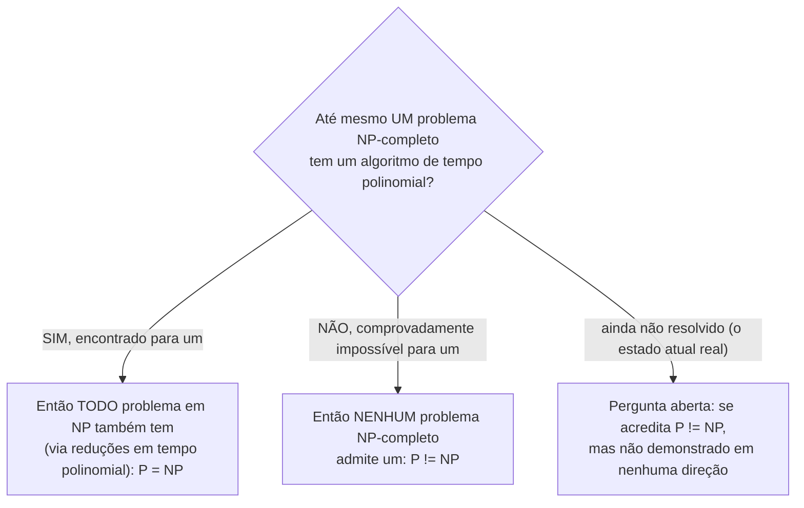

## Objetivos de Aprendizagem

- Enunciar a pergunta P versus NP com precisão, em termos das classes já construídas ao longo desta disciplina.
- Explicar as apostas reais, documentadas, de cada resolução possível, para problemas de otimização e busca, e para criptografia.
- Identificar P versus NP como um dos sete Problemas do Prêmio Millennium do Clay Institute, e enunciar seu status atual com precisão.
- Sintetizar as duas metades da disciplina, decidibilidade e complexidade, contrastando "comprovadamente impossível para sempre" com "conjecturado difícil, mas não demonstrado."
- Explicar por que NP-completude (via redução) faz as apostas de P versus NP se aplicarem a uma classe inteira, enorme, de problemas de uma vez, em vez de a um único problema isolado.

## Contexto e Motivação

Todo conceito na segunda metade desta disciplina esteve construindo em direção a uma única pergunta precisa, e este encerramento é onde tudo isso finalmente converge. P é a classe de problemas solucionáveis eficientemente, do zero, em tempo polinomial. NP é a classe (comprovadamente maior-ou-igual) de problemas cujas soluções podem ser eficientemente *verificadas*, mesmo quando nenhuma forma eficiente de *encontrar* uma é conhecida. NP-completude identificou problemas específicos, SAT, Conjunto Independente, e (via redução) um catálogo enorme, sempre crescente, de outros, que estão simultaneamente em NP e ao menos tão difíceis quanto tudo mais em NP, significando que um algoritmo de tempo polinomial para qualquer um deles imediatamente produziria um para todo NP de uma vez. coNP espelhou a mesma ideia baseada em verificação em torno de respostas NÃO em vez de respostas SIM. A **pergunta P versus NP** pergunta a coisa para a qual toda essa maquinaria foi montada para tornar precisa: P é de fato igual a NP? Todo problema cuja solução pode ser *verificada* rapidamente também admite uma que pode ser *encontrada* rapidamente, ou verificar é genuína, permanentemente mais fácil que encontrar, para ao menos alguns problemas?

Esta não é uma curiosidade acadêmica ociosa. É um dos sete **Problemas do Prêmio Millennium do Clay Institute**, nomeados pelo Clay Mathematics Institute em 2000 como os sete problemas em aberto mais importantes em matemática, cada um carregando um prêmio real, permanente, de $1.000.000 por uma prova correta (em qualquer direção, demonstrar P = NP ou demonstrar P ≠ NP ambos se qualificariam). Dos sete, só um (a conjectura de Poincaré) foi resolvido desde que o prêmio foi anunciado; P versus NP permanece em aberto, e permanece em aberto desde que as classes foram formalizadas no início dos anos 1970, apesar de esforço sustentado da comunidade de ciência da computação teórica através de cinco décadas.

A razão pela qual a pergunta carrega tanto peso é que NP-completude (o retorno inteiro dos três conceitos anteriores) significa que a resolução não resolveria só o destino de um problema isolado, resolveria o destino de milhares deles simultaneamente, todos conectados por reduções em tempo polinomial em uma única classe cuja dificuldade sobe e desce junto.

## Teoria Central

### A pergunta, com precisão

**P = NP?** Equivalentemente, usando o vocabulário construído ao longo desta disciplina: para todo problema de decisão com um verificador de tempo polinomial, também existe um algoritmo de tempo polinomial que o resolve diretamente, sem nenhum certificado entregue de antemão? P ⊆ NP é demonstrado (qualquer solucionador de tempo polinomial dobra como seu próprio verificador trivial, ignorando qualquer certificado fornecido). O que permanece completamente em aberto é a contenção reversa, NP ⊆ P, e NP-completude dá uma forma nítida, de um único ponto, de resolvê-la: porque todo problema em NP se reduz, em tempo polinomial, a qualquer problema NP-completo, P = NP vale se e somente se até mesmo um problema NP-completo (SAT, Conjunto Independente, ou qualquer um dos outros alcançados por reduções encadeadas) tem um algoritmo de tempo polinomial. Demonstre isso para um único, e a classe NP inteira colapsa em P; demonstre que nenhum algoritmo de tempo polinomial pode existir para até mesmo um, e P ≠ NP segue para a classe inteira de uma vez.

### As apostas se P = NP

Se até mesmo um problema NP-completo se revelasse ter um algoritmo de tempo polinomial, as consequências seriam imediatas e abrangentes, por duas razões bem documentadas. Primeiro, uma gama enorme de problemas de otimização e busca atualmente difíceis, escalonamento, roteamento, alocação de recursos, design de circuitos, e todo outro problema mostrado NP-completo por uma cadeia de redução remontando a Cook-Levin, subitamente admitiriam soluções exatas eficientes, em vez das aproximações e heurísticas em que praticantes atualmente confiam. Problemas atualmente considerados intratáveis em escala do mundo real (roteamento de veículos através de uma rede grande, layout ótimo de chip, certas formas de predição de estrutura de proteína) se tornariam eficientemente solucionáveis exatamente, não meramente aproximadamente. Segundo, e igualmente consequente: a maior parte da criptografia moderna de chave pública (RSA, e boa parte do que protege tráfego de internet) se apoia em certos problemas, fatorar números grandes, ou problemas intimamente relacionados, serem fáceis de verificar uma solução proposta mas difíceis de resolver do zero, exatamente a assimetria estilo-NP para a qual esta disciplina esteve construindo intuição. Uma prova construtiva de P = NP (uma que viesse com um algoritmo eficiente real, não meramente uma prova de existência não construtiva) ameaçaria fazer aquela assimetria desaparecer, minando as suposições de dificuldade das quais boa parte da segurança de internet atualmente depende.

### As apostas se P ≠ NP

Se P ≠ NP é demonstrado (o resultado que a maioria dos pesquisadores na área atualmente acredita, baseado em décadas de busca falha por algoritmos de tempo polinomial para qualquer problema NP-completo, espelhando o raciocínio circunstancial já discutido para NP versus coNP), a situação prática no terreno não mudaria, os algoritmos e heurísticas já em uso para problemas de otimização difíceis permaneceriam exatamente tão efetivos (ou inefetivos) quanto já são. O que mudaria é que isso se tornaria um fato *demonstrado*, permanente, formal sobre a natureza da computação, em vez de uma crença bem sustentada mas não demonstrada: uma confirmação matemática rígida de que alguns problemas cujas soluções são fáceis de checar comprovadamente nunca vão admitir uma forma eficiente de encontrar aquelas soluções do zero, fechando, permanentemente, a busca por tal algoritmo para qualquer problema NP-completo.

### Síntese: duas metades de uma disciplina, dois tipos diferentes de "difícil"

Esta disciplina abriu com a tese de Church-Turing, passou pela máquina de Turing como um modelo formal, a distinção decidível/reconhecível, o Problema da Parada, reduções, e o teorema de Rice, estabelecendo um universo inteiro de problemas que são **indecidíveis**: nenhum algoritmo, por mais lento que seja, consegue resolvê-los, jamais, em nenhum computador que algum dia venha a existir, atual ou futuro. Aquela conclusão é *demonstrada*, não conjecturada, o teorema de Rice, por exemplo, varre uma categoria inteira de perguntas sobre comportamento de programa para impossibilidade permanente, matematicamente certa, sem nenhum espaço restante para uma descoberta futura reverter isso.

A metade da teoria da complexidade desta disciplina é construída sobre uma base inteiramente diferente, e vale a pena enunciar este contraste explicitamente em vez de deixá-lo passar sem comentário: NP-completude não demonstra que um problema é difícil neste mesmo sentido permanente. Ela demonstra um fato *condicional*, estrutural, que um problema é exatamente tão difícil quanto todo outro problema em NP, atados por reduções, enquanto deixa em aberto, genuinamente em aberto, se aquela dificuldade compartilhada é de fato insuperável em tempo polinomial ou não. Todo problema NP-completo poderia, em princípio, ainda acabar tendo um algoritmo eficiente esperando para ser descoberto; nada demonstrado até agora descarta isso. Esta é a distinção real, estrutural, para encerrar esta disciplina: indecidibilidade é um teto demonstrado, permanente e matemático; NP-completude (na ausência de uma resolução para P versus NP) é um piso conjecturado, extremamente bem sustentado por evidência circunstancial e décadas de busca falha, mas não, até hoje, uma prova.

## Exemplos Resolvidos

### Exemplo 1: rastreando a alavancagem de um único ponto de NP-completude

**Problema:** Suponha que um pesquisador anuncia um algoritmo de tempo polinomial para Conjunto Independente. Rastreie as consequências usando a cadeia de redução construída nesta disciplina.

**Raciocínio.** Conjunto Independente foi mostrado NP-completo via uma redução em tempo polinomial de 3-SAT (ela mesma NP-completa via uma redução de SAT, que é NP-completa por Cook-Levin). Se Conjunto Independente tivesse um solucionador de tempo polinomial, então 3-SAT poderia ser resolvida em tempo polinomial também, reduza qualquer instância de 3-SAT para uma instância de Conjunto Independente em tempo polinomial, resolva aquela instância em tempo polinomial, e a resposta se transfere de volta (o argumento de composição-de-polinômios já usado repetidamente nesta disciplina). Já que 3-SAT é NP-completa, e todo problema em NP se reduz a 3-SAT (através de SAT), o mesmo argumento se encadeia até o fim: todo problema em NP agora teria um algoritmo de tempo polinomial. Então um único algoritmo de tempo polinomial para Conjunto Independente, um problema de grafo específico, sem glamour, imediatamente demonstraria P = NP, colapsando toda pergunta em aberto na metade de complexidade desta disciplina em uma resolvida de uma vez. Esta é exatamente a alavancagem que NP-completude foi construída para fornecer.

### Exemplo 2: distinguindo o status do Problema da Parada do status de SAT

**Problema:** Contraste o que é de fato conhecido sobre o Problema da Parada versus o que é de fato conhecido sobre o tempo de solução de SAT, usando o vocabulário da síntese desta disciplina.

**Raciocínio.** O Problema da Parada é demonstrado indecidível, nenhum algoritmo, de qualquer tempo de execução, jamais o resolve corretamente em toda entrada; isso foi estabelecido por um argumento de diagonalização explícito anteriormente nesta disciplina, e nenhuma descoberta futura pode reverter isso, porque é uma prova matemática completa. A situação de SAT é diferente em tipo, não só em grau: nenhum algoritmo de tempo polinomial para SAT é *conhecido*, e a crença de que nenhum existe é bem sustentada (SAT é NP-completa, e nenhum problema NP-completo jamais cedeu a um algoritmo de tempo polinomial apesar de esforço extensivo), mas isso não é uma prova. Permanece logicamente possível, até onde alguém estabeleceu, que um algoritmo de tempo polinomial para SAT exista e simplesmente não tenha sido encontrado ainda. Confundir "nenhum algoritmo eficiente conhecido, e provavelmente nenhum existe" (o status real de SAT) com "demonstrado que nenhum algoritmo de nenhum tipo jamais pode existir" (o status real do Problema da Parada) é exatamente o erro que a síntese deste encerramento é construída para evitar.

### Exemplo 3: as apostas criptográficas tornadas concretas

**Problema:** Explique, estruturalmente, por que uma prova construtiva de P = NP ameaçaria criptografia estilo-RSA, usando a assimetria de verificação-NP de anteriormente nesta disciplina.

**Raciocínio.** Criptografia estilo-RSA se apoia em uma tarefa (aproximadamente: fatorar um número grande, ou um problema difícil equivalente) sendo fácil de verificar uma solução proposta para (dada uma fatoração proposta, multiplicar os fatores de volta e checar que o produto corresponde ao número original é rápido) mas difícil de resolver do zero (encontrar os fatores de um número grande sem atalhos atualmente se acredita exigir muito mais que tempo polinomial, usando algoritmos conhecidos). Esta é exatamente a assimetria estilo-NP entre verificar e encontrar construída ao longo desta disciplina. Uma prova construtiva de P = NP, uma que de fato produzisse um algoritmo de tempo polinomial funcional para um problema NP-completo, o que por sua vez poderia ser adaptado a problemas difíceis intimamente relacionados subjacentes a esses esquemas criptográficos, colapsaria aquela assimetria: encontrar se tornaria tão fácil quanto verificar, e a suposição de segurança inteira sobre a qual esses esquemas repousam não valeria mais.

## Equívocos Comuns e Armadilhas

- **"P versus NP basicamente já foi resolvido; a maioria das pessoas só assume P ≠ NP então não importa."** Crença generalizada entre pesquisadores de que P ≠ NP não é o mesmo que uma prova, e a síntese deste encerramento existe precisamente para manter essa distinção nítida: P versus NP permanece um Problema do Prêmio Millennium do Clay genuinamente em aberto, com seu prêmio de $1.000.000 não reclamado, até hoje. "Quase todo mundo acredita em X" e "X é demonstrado" são categorias epistêmicas diferentes ao longo desta disciplina inteira, não só aqui, a mesma lacuna separa "SAT se acredita difícil" de "o Problema da Parada é demonstrado indecidível," como o Exemplo 2 torna explícito.
- **"Se P = NP fosse demonstrado, isso automaticamente significaria que algoritmos rápidos para problemas NP-completos seriam entregues a nós imediatamente."** Uma prova de P = NP poderia, em princípio, ser *não construtiva*, estabelecendo que um algoritmo de tempo polinomial existe sem exibir um, ou exibindo um com um grau polinomial ou fator constante astronomicamente grande que é tecnicamente polinomial mas praticamente inútil (ecoando o equívoco "P significa rápido" já sinalizado quando P foi primeiro definido). As apostas descritas na Teoria Central assumem que um algoritmo construtivo *usável* se seguiria; uma prova puramente existencial resolveria a pergunta matemática sem necessariamente entregar o retorno prático da noite para o dia.
- **"Problemas NP-completos são demonstrados exigirem tempo exponencial, da mesma forma que o Problema da Parada é demonstrado indecidível."** Isto confunde as duas metades da disciplina exatamente como a síntese da Teoria Central alerta contra. NP-completude estabelece um fato condicional, relativo (tão difícil quanto tudo mais em NP) repousando em bases não demonstradas, embora extremamente bem sustentadas; ela não demonstra, por si só, nenhum limite inferior sobre tempo de solução de forma alguma. A indecidibilidade do Problema da Parada é uma prova completa sem nenhuma saída análoga de "talvez alguém encontre uma forma afinal"; nenhuma dificuldade de problema NP-completo goza dessa mesma certeza.
- **"P versus NP é basicamente a mesma pergunta que NP versus coNP."** Como o conceito anterior estabeleceu, P = NP implicaria NP = coNP, mas a implicação reversa não vale, as duas conjecturas são relacionadas por uma implicação unidirecional, não reafirmações idênticas uma da outra, e resolver uma não resolve automaticamente a outra.

## Resumo

A pergunta P versus NP pergunta se todo problema cuja solução pode ser verificada em tempo polinomial também admite uma que pode ser encontrada em tempo polinomial, equivalentemente, dada a maquinaria de redução de NP-completude, se até mesmo um único problema NP-completo (SAT, Conjunto Independente, ou qualquer outro alcançado por uma cadeia de reduções) tem um algoritmo de tempo polinomial de forma alguma. É um dos sete Problemas do Prêmio Millennium do Clay, carregando um prêmio real, não reclamado, de $1.000.000, e permanece em aberto mais de cinco décadas depois de P e NP terem sido primeiro formalizadas. Uma prova de P = NP entregaria algoritmos exatos eficientes para uma gama enorme de problemas de otimização e busca atualmente difíceis de uma vez, e ameaçaria as suposições de dificuldade subjacentes à maior parte da criptografia moderna de chave pública; uma prova de P ≠ NP (o resultado que a maioria dos pesquisadores acredita, embora permaneça não demonstrado) confirmaria formalmente, pela primeira vez, um limite permanente sobre o que pode ser eficientemente computado, sem mudar o estado prático da arte já em uso. Este encerramento fecha a disciplina tornando explícita a distinção real entre suas duas metades: problemas indecidíveis (o teorema de Rice em primeiro lugar entre eles) são comprovadamente impossíveis, para sempre, independentemente de como P versus NP se resolve, enquanto problemas NP-completos são só conjecturados difíceis, repousando em décadas de busca falha em vez de em uma prova completa, e permanecem genuinamente abertos a serem revertidos por um único algoritmo de tempo polinomial suficientemente esperto.

## Documentation Links

- [MIT 18.404/6.5400: Course Information (Sipser)](https://math.mit.edu/~sipser/18404/info.pdf): doc
- [ACM/IEEE CS2013: Full Curriculum Site](https://csed.acm.org/cs2013-version/): doc
