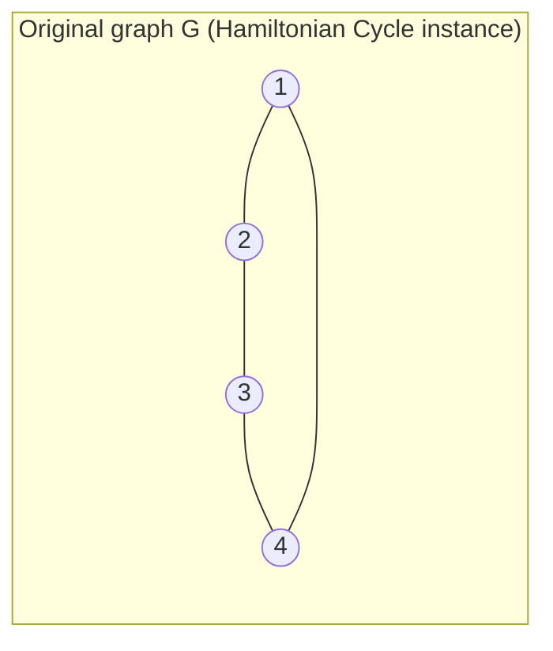

## Learning Objectives

- State the Traveling Salesman Problem's decision version precisely, and distinguish it from the optimization version most people mean by "TSP."
- Verify that TSP's decision version is in NP, by identifying its certificate and the polynomial-time check that certificate admits.
- Construct, in full, a polynomial-time reduction from Hamiltonian Cycle to TSP, proving TSP is NP-hard.
- Explain why TSP and Minimum Spanning Trees, despite both being phrased as "connect every vertex as cheaply as possible," sit on opposite sides of the P versus NP divide.
- Distinguish what "NP-hard" implies in practice (no known polynomial exact algorithm, not "no algorithm at all") from what it does not imply.

## Context & Motivation

The algorithms discipline that precedes this one in this curriculum spent an entire topic on Minimum Spanning Trees: given a weighted, connected graph, find the cheapest set of edges connecting every vertex. Both Kruskal's and Prim's algorithms solve this exactly, in polynomial time, by exploiting a genuine structural fact (the cut property) that a greedy, edge-at-a-time strategy is always safe to trust. The **Traveling Salesman Problem** is phrased in almost identical language, given a weighted, complete graph, find the cheapest way to visit every vertex, and it is tempting to expect a similarly clean greedy algorithm to exist for it too. It does not, and this concept exists to show, rigorously rather than by assertion, exactly why: TSP's requirement that the visit be a single closed *tour*, entering and leaving each vertex exactly once, rather than merely a connected subgraph, is enough to push the problem from P's polynomial-time-solvable world into the NP-complete world, a difference the previous concept's reduction technique now has the machinery to prove directly rather than merely gesture at.

## Core Theory

### TSP's decision version, stated precisely

The **TSP decision problem** takes a complete weighted graph `G = (V, E)` (every pair of vertices connected by an edge, each with a nonnegative weight) and a budget `B`, and asks: does `G` contain a **tour**, a cycle visiting every vertex in `V` exactly once and returning to its start, with total edge weight at most `B`? This is distinct from the more familiar **optimization version** ("find the *cheapest* tour"), in exactly the same way the algorithms discipline's shortest-path problems have both a decision flavor ("is there a path of length at most k?") and an optimization flavor ("find the shortest path"); complexity theory works with decision versions specifically because NP is officially a class of *languages* (yes/no questions), not a class of optimization problems, though the two versions are equivalent in difficulty for TSP (an efficient solution to one gives an efficient solution to the other, a fact this concept's misconceptions section returns to).

### TSP is in NP

A certificate for a "yes" instance is simply the tour itself, a proposed ordering of all vertices in `V`. Verifying it is straightforward and fast: check that the proposed ordering visits every vertex in `V` exactly once (a single pass, O(n)), sum the weights of the n edges connecting consecutive vertices in the ordering, including the edge back to the start (O(n) additions), and check that sum is at most `B` (one comparison). This entire check runs in polynomial time in the size of `G`, exactly the certificate-verification pattern already established for every other NP problem this discipline has examined, confirming TSP's decision version is in NP.

### The reduction: Hamiltonian Cycle to TSP

To show TSP is NP-hard, this concept reduces from **Hamiltonian Cycle**: given an arbitrary (not necessarily complete) undirected graph `G = (V, E)`, does `G` contain a cycle visiting every vertex exactly once? Hamiltonian Cycle is itself a classical NP-complete problem, established by a reduction chain built on Cook-Levin's theorem (SAT to 3-SAT to Vertex Cover to Hamiltonian Cycle is the standard textbook path); this concept treats that chain as a known, citable result exactly as the previous concept treated 3-SAT's NP-completeness as a known corollary of Cook-Levin, rather than re-deriving it here, so the reduction can focus entirely on the new transformation: Hamiltonian Cycle to TSP.

**The construction.** Given an instance of Hamiltonian Cycle, an arbitrary graph `G = (V, E)` with `n = |V|` vertices, build a TSP instance as follows:

1. Construct a complete graph `G' = (V, E')` on the same vertex set (every pair of vertices connected, since TSP requires a complete graph).
2. Assign weight 1 to every edge `(u, v)` that was already present in `E` (an original edge of `G`).
3. Assign weight 2 to every edge `(u, v)` not present in `E` (a "new" edge, added only to make `G'` complete).
4. Set the budget `B = n` (exactly the number of vertices, equivalently the number of edges in any tour).

This construction takes time polynomial in `n` (checking, for every one of the `O(n²)` pairs of vertices, whether that pair is an edge of `G`, a single lookup each), satisfying the polynomial-time requirement any valid reduction must meet.

**Claim:** `G` has a Hamiltonian cycle if and only if `G'` has a tour of weight at most `B = n`.

**Forward direction.** Suppose `G` has a Hamiltonian cycle, visiting its `n` vertices in some order and returning to the start, using only edges of `G`. That exact same ordering is a valid tour in `G'` (every vertex, exactly once, since `G'` is complete and contains every vertex `G` does), and every one of its `n` edges was an original edge of `G`, so every one weighs exactly 1 in `G'`. Total weight `= n × 1 = n = B`. A tour of weight at most `B` exists.

**Backward direction.** Suppose `G'` has a tour of weight at most `B = n`. Any tour visiting `n` vertices uses exactly `n` edges. Since every edge in `G'` weighs either 1 or 2, and the tour's total is at most `n`, **every single edge in the tour must weigh exactly 1**: if even one edge weighed 2, the total would be at least `(n - 1) × 1 + 1 × 2 = n + 1`, exceeding the budget `B = n`. A weight-1 edge in `G'` is, by construction, an original edge of `G`. So a tour using only weight-1 edges is a cycle using only edges of `G`, visiting every vertex exactly once, exactly the definition of a Hamiltonian cycle in `G`.

Both directions hold, and the construction runs in polynomial time, so this is a valid polynomial-time reduction from Hamiltonian Cycle to TSP. Since Hamiltonian Cycle is NP-complete, TSP is NP-hard, and combined with TSP being in NP (established above), **TSP's decision version is NP-complete**.

### Why MST and TSP diverge, structurally

The reduction's backward direction is the precise place where TSP's extra difficulty, compared to MST, becomes visible mathematically rather than just intuitively: a tour is a single cycle touching every vertex exactly once, a *global* structural constraint on the entire edge set at once, whereas a spanning tree merely needs to connect everything, with no constraint on how many edges meet at any one vertex or on forming a single closed loop. MST's cut property lets a locally-greedy choice (cheapest edge crossing any cut) be verified safe one edge at a time, independent of the rest of the tree's eventual shape; no analogous local, greedy certificate is known for "this edge is definitely part of some optimal Hamiltonian tour," and the NP-completeness just proven is exactly why: if such a certificate existed and could be checked quickly, it would yield a polynomial-time TSP algorithm, refuting TSP's NP-hardness (assuming P ≠ NP, the widely believed but unproven conjecture this discipline's capstone concept examines directly).

## Worked Examples

### Example 1: applying the reduction to a graph that has a Hamiltonian cycle

**Problem:** Let `G` be the 4-cycle: vertices `{1, 2, 3, 4}`, edges `{1-2, 2-3, 3-4, 4-1}` (already itself a Hamiltonian cycle). Apply the reduction and verify the resulting TSP instance has a tour of weight exactly `B = 4`.

**Building `G'`:** Complete graph on `{1,2,3,4}`. Original edges `1-2, 2-3, 3-4, 4-1` get weight 1. The two remaining pairs, `1-3` and `2-4` (not edges of `G`), get weight 2.

**Checking the tour `1-2-3-4-1`:** Edges used: `(1,2)=1`, `(2,3)=1`, `(3,4)=1`, `(4,1)=1`. Total `= 4 = B`. A tour of weight at most `B` exists, correctly reflecting that `G` does have a Hamiltonian cycle (itself).

### Example 2: applying the reduction to a graph with no Hamiltonian cycle, and confirming no cheap tour exists

**Problem:** Let `G₂` be a path, not a cycle: vertices `{1, 2, 3, 4}`, edges `{1-2, 2-3, 3-4}` only (no edge closing `4` back to `1`). `G₂` has no Hamiltonian cycle (it has only 3 edges total, one short of the 4 a Hamiltonian cycle on 4 vertices requires, so no cycle visiting all 4 vertices can exist at all). Verify every tour in the resulting `G'₂` exceeds the budget `B = 4`.

**Building `G'₂`:** Complete graph on `{1,2,3,4}`. Weight-1 edges: `1-2, 2-3, 3-4` (the 3 original edges). Weight-2 edges: `1-3, 1-4, 2-4` (the 3 remaining pairs).

**Checking all three distinct 4-vertex tours:**

- Tour `1-2-3-4-1`: weights `1 + 1 + 1 + 2 = 5` (edge `4-1` is weight 2, since it's not in `G₂`).
- Tour `1-2-4-3-1`: weights `1 + 2 + 1 + 2 = 6`.
- Tour `1-3-2-4-1`: weights `2 + 1 + 2 + 2 = 7`.

**Conclusion:** The cheapest possible tour costs 5, strictly more than `B = 4`. This is not a coincidence specific to this example: since `G₂` has only 3 weight-1 edges total, any 4-edge tour must include at least one weight-2 edge, forcing a total of at least `3 × 1 + 1 × 2 = 5 > 4`. No tour of weight at most `B` exists, correctly reflecting that `G₂` has no Hamiltonian cycle.

## Common Misconceptions & Pitfalls

- **"Since Kruskal's and Prim's solve MST greedily and in polynomial time, some similarly clever greedy rule should solve TSP too."** Example 2's minimum tour (weight 5) is *not* found by any of the standard greedy heuristics for TSP (like always visiting the nearest unvisited city) with a guarantee of optimality, and no such guaranteed-optimal greedy rule is known for TSP, precisely because (per Core Theory's structural comparison) no local, edge-by-edge safety certificate analogous to MST's cut property has ever been found for the tour constraint, and the NP-completeness proven here is exactly the reason none is expected to exist.
- **"NP-hard means no algorithm exists for TSP at all, so real systems relying on it are stuck."** NP-hardness means no known algorithm solves every instance exactly in *polynomial time in the worst case*; TSP is routinely solved exactly for real problem sizes using techniques like branch-and-bound, and approximated efficiently and well for many practical cases (metric TSP admits a polynomial-time algorithm guaranteed within a constant factor of optimal). NP-hardness is a statement about worst-case guaranteed exactness, not about the problem being unapproachable in practice.
- **"Since we reduced Hamiltonian Cycle to TSP, this proves Hamiltonian Cycle is at least as hard as TSP."** The direction is the opposite, and this is one of the single most common errors when reading a reduction: `A ≤p B` (A reduces to B) means solving B efficiently would let you solve A efficiently, so B is *at least as hard as* A, not the reverse. Here, Hamiltonian Cycle reduces to TSP specifically to show TSP inherits Hamiltonian Cycle's hardness, not to show anything about TSP being easy.
- **"The optimization version of TSP (find the cheapest tour) and the decision version proven NP-complete here are entirely separate problems with unrelated difficulty."** They are polynomial-time equivalent in difficulty: given an oracle that solves the decision version instantly, binary search on `B` (or, for integer weights, a linear scan) finds the optimal tour's exact weight in polynomially many queries, and conversely an optimal-weight oracle trivially answers the decision version by comparing that weight to `B`. The decision version is used for the NP-completeness proof specifically because NP is formally defined over yes/no languages, not because the optimization version is somehow a different problem in practice.

## Summary

TSP's decision version, does a complete weighted graph admit a tour of total weight at most `B`, is in NP (a proposed tour is checked in polynomial time) and NP-hard, proven here by a direct, fully worked polynomial-time reduction from the classical NP-complete Hamiltonian Cycle problem: build a complete graph assigning weight 1 to original edges and weight 2 to the rest, set the budget to the vertex count `n`, and a cheap-enough tour exists exactly when a Hamiltonian cycle does, because any tour cheaper than `n + 1` is forced to use only weight-1 (original) edges. Combined, TSP's decision version is NP-complete. This stands in sharp contrast to Minimum Spanning Trees, solved exactly in polynomial time by Kruskal's and Prim's greedy algorithms in the algorithms discipline preceding this one, despite both problems sounding, on the surface, like the same "connect every vertex as cheaply as possible" question: TSP's requirement of a single closed tour through every vertex, rather than merely a connected subgraph, is precisely the extra structural constraint this reduction shows pushes the problem out of the polynomial-time world, assuming the P versus NP conjecture this discipline's capstone concept examines directly.

## Documentation Links

- [ACM/IEEE CS2013 - Algorithms and Complexity Knowledge Area](https://csed.acm.org/cs2013-version/): doc
- [MIT 6.006 - Lecture Notes (OCW)](https://ocw.mit.edu/courses/6-006-introduction-to-algorithms-spring-2020/pages/lecture-notes/): doc
