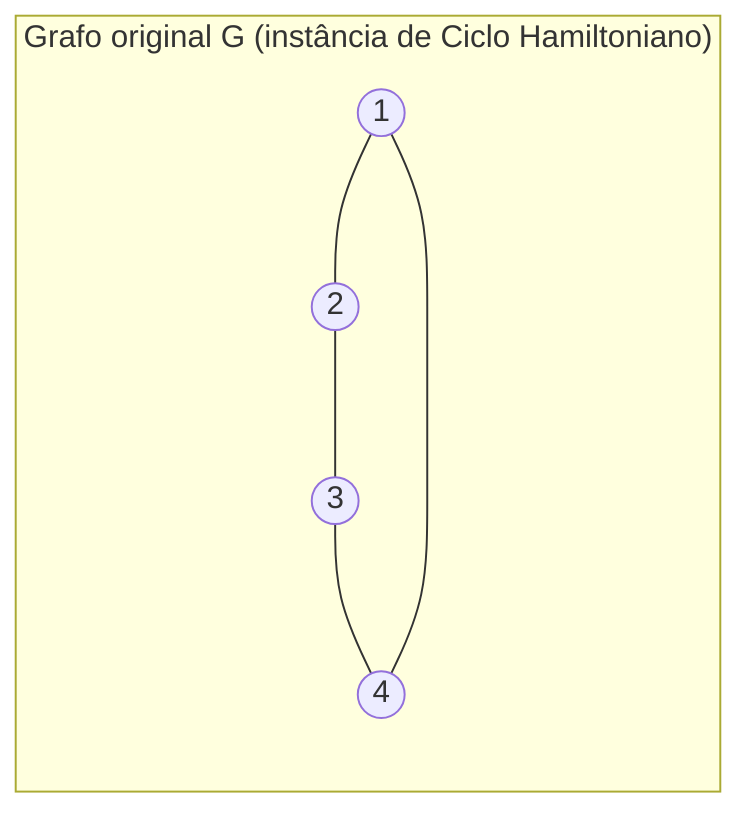

## Objetivos de Aprendizagem

- Enunciar precisamente a versão de decisão do Problema do Caixeiro Viajante, e distingui-la da versão de otimização que a maioria das pessoas quer dizer com "TSP".
- Verificar que a versão de decisão do TSP está em NP, identificando seu certificado e a verificação em tempo polinomial que esse certificado admite.
- Construir, por completo, uma redução em tempo polinomial de Ciclo Hamiltoniano para TSP, provando que TSP é NP-difícil.
- Explicar por que TSP e Árvores Geradoras Mínimas, apesar de ambos serem formulados como "conectar todo vértice da forma mais barata possível", ficam em lados opostos da divisão P versus NP.
- Distinguir o que "NP-difícil" implica na prática (nenhum algoritmo exato polinomial conhecido, não "nenhum algoritmo de forma alguma") do que não implica.

## Contexto e Motivação

A disciplina de algoritmos que precede esta no currículo dedicou um tópico inteiro a Árvores Geradoras Mínimas: dado um grafo ponderado e conexo, encontre o conjunto mais barato de arestas conectando todo vértice. Tanto o algoritmo de Kruskal quanto o de Prim resolvem isso exatamente, em tempo polinomial, explorando um fato estrutural genuíno (a propriedade de corte) de que uma estratégia gulosa, aresta por aresta, é sempre segura de confiar. O **Problema do Caixeiro Viajante** é formulado em linguagem quase idêntica, dado um grafo ponderado e completo, encontre a forma mais barata de visitar todo vértice, e é tentador esperar que um algoritmo guloso igualmente limpo exista para ele também. Não existe, e este conceito existe para mostrar, rigorosamente em vez de por afirmação, exatamente por quê: a exigência do TSP de que a visita seja um único **tour** fechado, entrando e saindo de cada vértice exatamente uma vez, em vez de meramente um subgrafo conexo, é suficiente para empurrar o problema do mundo solucionável-em-tempo-polinomial de P para o mundo NP-completo, uma diferença que a técnica de redução do conceito anterior agora tem a maquinaria para provar diretamente em vez de apenas sugerir.

## Teoria Central

### A versão de decisão do TSP, enunciada precisamente

O **problema de decisão do TSP** recebe um grafo completo ponderado `G = (V, E)` (todo par de vértices conectado por uma aresta, cada uma com peso não negativo) e um orçamento `B`, e pergunta: `G` contém um **tour**, um ciclo visitando todo vértice em `V` exatamente uma vez e retornando ao início, com peso total de aresta no máximo `B`? Isso é distinto da mais familiar **versão de otimização** ("encontre o tour *mais barato*"), exatamente da mesma forma que os problemas de caminho mínimo da disciplina de algoritmos têm tanto um sabor de decisão ("existe um caminho de comprimento no máximo k?") quanto um sabor de otimização ("encontre o caminho mais curto"); a teoria da complexidade trabalha com versões de decisão especificamente porque NP é oficialmente uma classe de *linguagens* (perguntas sim/não), não uma classe de problemas de otimização, embora as duas versões sejam equivalentes em dificuldade para o TSP (uma solução eficiente para uma dá uma solução eficiente para a outra, um fato ao qual a seção de equívocos deste conceito retorna).

### TSP está em NP

Um certificado para uma instância "sim" é simplesmente o próprio tour, uma ordenação proposta de todos os vértices em `V`. Verificá-lo é direto e rápido: verifique que a ordenação proposta visita todo vértice em `V` exatamente uma vez (uma única passada, O(n)), some os pesos das n arestas conectando vértices consecutivos na ordenação, incluindo a aresta de volta ao início (O(n) somas), e verifique que essa soma é no máximo `B` (uma comparação). Essa verificação inteira roda em tempo polinomial no tamanho de `G`, exatamente o padrão de verificação de certificado já estabelecido para todo outro problema NP que esta disciplina examinou, confirmando que a versão de decisão do TSP está em NP.

### A redução: Ciclo Hamiltoniano para TSP

Para mostrar que TSP é NP-difícil, este conceito reduz a partir de **Ciclo Hamiltoniano**: dado um grafo não direcionado arbitrário (não necessariamente completo) `G = (V, E)`, `G` contém um ciclo visitando todo vértice exatamente uma vez? Ciclo Hamiltoniano é ele mesmo um problema NP-completo clássico, estabelecido por uma cadeia de redução construída sobre o teorema de Cook-Levin (SAT para 3-SAT para Cobertura de Vértices para Ciclo Hamiltoniano é o caminho de livro-texto padrão); este conceito trata essa cadeia como um resultado conhecido e citável exatamente como o conceito anterior tratou a NP-completude do 3-SAT como um corolário conhecido de Cook-Levin, em vez de derivá-la novamente aqui, então a redução pode focar inteiramente na nova transformação: Ciclo Hamiltoniano para TSP.

**A construção.** Dada uma instância de Ciclo Hamiltoniano, um grafo arbitrário `G = (V, E)` com `n = |V|` vértices, construa uma instância de TSP da seguinte forma:

1. Construa um grafo completo `G' = (V, E')` sobre o mesmo conjunto de vértices (todo par de vértices conectado, já que TSP exige um grafo completo).
2. Atribua peso 1 a toda aresta `(u, v)` que já estava presente em `E` (uma aresta original de `G`).
3. Atribua peso 2 a toda aresta `(u, v)` não presente em `E` (uma aresta "nova", adicionada só para tornar `G'` completo).
4. Defina o orçamento `B = n` (exatamente o número de vértices, equivalentemente o número de arestas em qualquer tour).

Essa construção leva tempo polinomial em `n` (verificando, para cada um dos `O(n²)` pares de vértices, se aquele par é uma aresta de `G`, uma única consulta cada), satisfazendo o requisito de tempo polinomial que toda redução válida precisa cumprir.

**Afirmação:** `G` tem um ciclo Hamiltoniano se e somente se `G'` tem um tour de peso no máximo `B = n`.

**Direção direta.** Suponha que `G` tenha um ciclo Hamiltoniano, visitando seus `n` vértices em alguma ordem e retornando ao início, usando só arestas de `G`. Essa mesma ordenação exata é um tour válido em `G'` (todo vértice, exatamente uma vez, já que `G'` é completo e contém todo vértice que `G` contém), e cada uma de suas `n` arestas era uma aresta original de `G`, então cada uma pesa exatamente 1 em `G'`. Peso total `= n × 1 = n = B`. Um tour de peso no máximo `B` existe.

**Direção reversa.** Suponha que `G'` tenha um tour de peso no máximo `B = n`. Qualquer tour visitando `n` vértices usa exatamente `n` arestas. Já que toda aresta em `G'` pesa 1 ou 2, e o total do tour é no máximo `n`, **toda aresta única no tour precisa pesar exatamente 1**: se mesmo uma aresta pesasse 2, o total seria pelo menos `(n - 1) × 1 + 1 × 2 = n + 1`, excedendo o orçamento `B = n`. Uma aresta de peso 1 em `G'` é, por construção, uma aresta original de `G`. Então um tour usando só arestas de peso 1 é um ciclo usando só arestas de `G`, visitando todo vértice exatamente uma vez, exatamente a definição de um ciclo Hamiltoniano em `G`.

Ambas as direções valem, e a construção roda em tempo polinomial, então essa é uma redução em tempo polinomial válida de Ciclo Hamiltoniano para TSP. Já que Ciclo Hamiltoniano é NP-completo, TSP é NP-difícil, e combinado com TSP estar em NP (estabelecido acima), **a versão de decisão do TSP é NP-completa**.

### Por que MST e TSP divergem, estruturalmente

A direção reversa da redução é o lugar preciso onde a dificuldade extra do TSP, comparada a MST, se torna visível matematicamente em vez de apenas intuitivamente: um tour é um único ciclo tocando todo vértice exatamente uma vez, uma restrição estrutural *global* sobre o conjunto de arestas inteiro de uma vez, enquanto uma árvore geradora só precisa conectar tudo, sem restrição sobre quantas arestas se encontram em qualquer vértice ou sobre formar um único laço fechado. A propriedade de corte de MST permite que uma escolha localmente gulosa (aresta mais barata cruzando qualquer corte) seja verificada como segura uma aresta de cada vez, independente do formato eventual do resto da árvore; nenhum certificado local e guloso análogo é conhecido para "essa aresta definitivamente faz parte de algum tour Hamiltoniano ótimo", e a NP-completude recém-provada é exatamente por quê: se tal certificado existisse e pudesse ser verificado rapidamente, ele produziria um algoritmo de TSP em tempo polinomial, refutando a NP-dificuldade do TSP (assumindo P ≠ NP, a conjectura amplamente acreditada mas não provada que o conceito de ápice desta disciplina examina diretamente).

## Exemplos Resolvidos

### Exemplo 1: aplicando a redução a um grafo que tem um ciclo Hamiltoniano

**Problema:** Seja `G` o 4-ciclo: vértices `{1, 2, 3, 4}`, arestas `{1-2, 2-3, 3-4, 4-1}` (já ele mesmo um ciclo Hamiltoniano). Aplique a redução e verifique que a instância de TSP resultante tem um tour de peso exatamente `B = 4`.

**Construindo `G'`:** Grafo completo sobre `{1,2,3,4}`. As arestas originais `1-2, 2-3, 3-4, 4-1` recebem peso 1. Os dois pares restantes, `1-3` e `2-4` (que não são arestas de `G`), recebem peso 2.

**Verificando o tour `1-2-3-4-1`:** Arestas usadas: `(1,2)=1`, `(2,3)=1`, `(3,4)=1`, `(4,1)=1`. Total `= 4 = B`. Um tour de peso no máximo `B` existe, refletindo corretamente que `G` de fato tem um ciclo Hamiltoniano (ele mesmo).

### Exemplo 2: aplicando a redução a um grafo sem ciclo Hamiltoniano, e confirmando que nenhum tour barato existe

**Problema:** Seja `G₂` um caminho, não um ciclo: vértices `{1, 2, 3, 4}`, arestas `{1-2, 2-3, 3-4}` apenas (sem aresta fechando `4` de volta a `1`). `G₂` não tem ciclo Hamiltoniano (tem só 3 arestas no total, uma a menos que as 4 que um ciclo Hamiltoniano em 4 vértices exige, então nenhum ciclo visitando todos os 4 vértices pode existir de forma alguma). Verifique que todo tour no `G'₂` resultante excede o orçamento `B = 4`.

**Construindo `G'₂`:** Grafo completo sobre `{1,2,3,4}`. Arestas de peso 1: `1-2, 2-3, 3-4` (as 3 arestas originais). Arestas de peso 2: `1-3, 1-4, 2-4` (os 3 pares restantes).

**Verificando os três tours distintos de 4 vértices:**

- Tour `1-2-3-4-1`: pesos `1 + 1 + 1 + 2 = 5` (a aresta `4-1` pesa 2, já que não está em `G₂`).
- Tour `1-2-4-3-1`: pesos `1 + 2 + 1 + 2 = 6`.
- Tour `1-3-2-4-1`: pesos `2 + 1 + 2 + 2 = 7`.

**Conclusão:** O tour mais barato possível custa 5, estritamente mais que `B = 4`. Isso não é uma coincidência específica deste exemplo: já que `G₂` tem só 3 arestas de peso 1 no total, qualquer tour de 4 arestas precisa incluir pelo menos uma aresta de peso 2, forçando um total de pelo menos `3 × 1 + 1 × 2 = 5 > 4`. Nenhum tour de peso no máximo `B` existe, refletindo corretamente que `G₂` não tem ciclo Hamiltoniano.

## Equívocos Comuns e Armadilhas

- **"Já que Kruskal e Prim resolvem MST gulosamente e em tempo polinomial, alguma regra gulosa igualmente esperta deveria resolver TSP também."** O tour mínimo do Exemplo 2 (peso 5) *não* é encontrado por nenhuma das heurísticas gulosas padrão para TSP (como sempre visitar a cidade não visitada mais próxima) com garantia de otimalidade, e nenhuma regra gulosa com garantia de otimalidade é conhecida para TSP, precisamente porque (pela comparação estrutural da Teoria Central) nenhum certificado local de segurança, aresta por aresta, análogo à propriedade de corte de MST, jamais foi encontrado para a restrição de tour, e a NP-completude aqui provada é exatamente a razão pela qual nenhum é esperado existir.
- **"NP-difícil significa que nenhum algoritmo existe para TSP de forma alguma, então sistemas reais que dependem dele estão travados."** NP-dificuldade significa que nenhum algoritmo conhecido resolve toda instância exatamente em *tempo polinomial no pior caso*; TSP é rotineiramente resolvido exatamente para tamanhos reais de problema usando técnicas como branch-and-bound, e aproximado eficiente e bem para muitos casos práticos (TSP métrico admite um algoritmo em tempo polinomial garantido dentro de um fator constante do ótimo). NP-dificuldade é uma afirmação sobre exatidão garantida de pior caso, não sobre o problema ser inabordável na prática.
- **"Já que reduzimos Ciclo Hamiltoniano para TSP, isso prova que Ciclo Hamiltoniano é pelo menos tão difícil quanto TSP."** A direção é a oposta, e este é um dos erros mais comuns ao ler uma redução: `A ≤p B` (A reduz a B) significa que resolver B eficientemente permitiria resolver A eficientemente, então B é *pelo menos tão difícil quanto* A, não o contrário. Aqui, Ciclo Hamiltoniano reduz a TSP especificamente para mostrar que TSP herda a dificuldade de Ciclo Hamiltoniano, não para mostrar nada sobre TSP ser fácil.
- **"A versão de otimização do TSP (encontre o tour mais barato) e a versão de decisão aqui provada NP-completa são problemas inteiramente separados com dificuldades não relacionadas."** Elas são equivalentes em dificuldade em tempo polinomial: dado um oráculo que resolve a versão de decisão instantaneamente, busca binária sobre `B` (ou, para pesos inteiros, uma varredura linear) encontra o peso exato do tour ótimo em polinomialmente muitas consultas, e reciprocamente um oráculo de peso ótimo trivialmente responde a versão de decisão comparando esse peso a `B`. A versão de decisão é usada para a prova de NP-completude especificamente porque NP é formalmente definida sobre linguagens sim/não, não porque a versão de otimização seja de alguma forma um problema diferente na prática.

## Resumo

A versão de decisão do TSP, um grafo completo ponderado admite um tour de peso total no máximo `B`, está em NP (um tour proposto é verificado em tempo polinomial) e é NP-difícil, provado aqui por uma redução em tempo polinomial direta e completamente trabalhada a partir do problema clássico NP-completo de Ciclo Hamiltoniano: construa um grafo completo atribuindo peso 1 a arestas originais e peso 2 ao restante, defina o orçamento como a contagem de vértices `n`, e um tour barato o suficiente existe exatamente quando um ciclo Hamiltoniano existe, porque qualquer tour mais barato que `n + 1` é forçado a usar só arestas de peso 1 (originais). Combinado, a versão de decisão do TSP é NP-completa. Isso contrasta fortemente com Árvores Geradoras Mínimas, resolvidas exatamente em tempo polinomial pelos algoritmos gulosos de Kruskal e Prim na disciplina de algoritmos que precede esta, apesar de os dois problemas soarem, na superfície, como a mesma pergunta de "conectar todo vértice da forma mais barata possível": a exigência do TSP de um único tour fechado passando por todo vértice, em vez de meramente um subgrafo conexo, é precisamente a restrição estrutural extra que esta redução mostra empurrar o problema para fora do mundo de tempo polinomial, assumindo a conjectura P versus NP que o conceito de ápice desta disciplina examina diretamente.

## Documentation Links

- [ACM/IEEE CS2013 - Algorithms and Complexity Knowledge Area](https://csed.acm.org/cs2013-version/): doc
- [MIT 6.006 - Lecture Notes (OCW)](https://ocw.mit.edu/courses/6-006-introduction-to-algorithms-spring-2020/pages/lecture-notes/): doc
