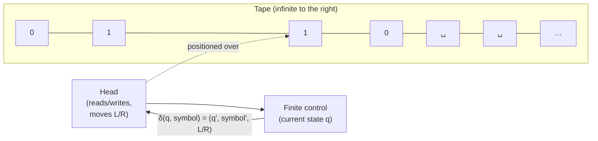

## Learning Objectives

- State the formal components of a Turing machine (tape, head, states, transition function) and explain the role each plays.
- Define precisely what it means for a Turing machine to accept, reject, or loop forever on an input.
- Trace a small Turing machine's execution step by step on a specific input, tracking the tape contents, head position, and current state at every step.
- Design a Turing machine deciding a simple language and justify, informally, that it halts and answers correctly on every input.
- Explain why the Turing machine is treated here purely as the formal vehicle for defining "computable," rather than as an object of study for its own mechanics.

## Context & Motivation

The previous concept in this track argued — as a thesis, not a provable fact — that "effectively computable" and "computable by a Turing machine" pick out the same class of functions. That argument only does real work once "Turing machine" has an exact, unambiguous mathematical definition; otherwise the thesis is trading one vague notion for another. This concept supplies that definition, and it does so with a specific, narrow purpose in mind: not to study Turing machines as fascinating objects in their own right, nor to catalog the many variants and encodings that a full treatment of automata theory would cover, but to pin down, once and for all, exactly what it means for *some mechanical procedure* to accept, reject, or fail to terminate on a given input. Every subsequent concept in this track — decidability, recognizability, the Halting Problem, the complexity classes P and NP — is stated in terms of Turing machines specifically because this concept fixes what that phrase means with total precision.

It is worth being explicit about scope here, since a full course on automata theory (covered by this platform's separate `formal-languages-automata` discipline — finite automata, regular expressions, context-free grammars, pushdown automata) spends a great deal of time on restricted models of computation and on the Chomsky hierarchy relating them. None of that is this concept's job. The Turing machine introduced here is deliberately the *most powerful*, *least restricted* model — an infinite tape and unrestricted movement — precisely because the goal is to capture *all* mechanical computation, with no restriction at all, not to compare restricted models against each other. Both MIT's 18.404 and Stanford's CS154 — the two courses this curriculum traces most closely — draw exactly this line: define the Turing machine just precisely enough to talk about computability, and leave automata-theoretic depth to a different course. This concept follows that same line: tape, head, states, transition function, and the three possible fates of a computation (accept, reject, loop) — nothing more elaborate than that is needed, or covered, here.

## Core Theory

### The components

A **Turing machine** consists of:

1. **An infinite tape**, divided into discrete cells, each holding a single symbol from a finite **tape alphabet** Γ (which includes a special **blank symbol** ␣, and typically the input alphabet Σ as a subset of Γ). The tape extends infinitely in (at least) one direction — there is always another cell available, holding a blank symbol by default until something is written there.
2. **A read/write head**, positioned over exactly one cell of the tape at any time. On each step, the head reads the symbol in the cell it is over, and (per the transition function) writes a symbol into that same cell, then moves one cell **left** or **right**.
3. **A finite set of states** Q, including a distinguished **start state** q₀, and two distinguished **halting states**: an **accept state** q_accept and a **reject state** q_reject (distinct from each other, and once entered, the machine stops).
4. **A transition function** δ, mapping (current state, symbol under head) to (new state, symbol to write, direction to move):

   δ : Q × Γ → Q × Γ × {L, R}

   (formally, δ is undefined on q_accept and q_reject, since the machine halts immediately upon entering either.)

A **configuration** of the machine at any moment is fully captured by three things: the current state, the entire tape contents, and the head's position — this triple is all that is needed to determine every subsequent step, since the transition function depends on nothing else.

### Acceptance, rejection, and looping

Given an input string w (written on the tape, left-justified, with blanks filling the rest), the machine starts in state q₀ with the head over the first symbol of w, and applies δ repeatedly, one step at a time, each step producing a new configuration from the last. Exactly one of three things happens:

- **Accept.** The machine eventually enters state q_accept. Computation halts immediately, and the input is **accepted**.
- **Reject.** The machine eventually enters state q_reject. Computation halts immediately, and the input is **rejected**.
- **Loop (never halts).** The machine runs forever, producing an unending sequence of configurations, never entering q_accept or q_reject. Note "loop" here is a shorthand for "runs forever," not necessarily a literal repeating cycle of configurations — the tape can grow and change without bound and the machine can still simply never halt.

This three-way split is the entire payoff of formalizing the machine: acceptance, rejection, and non-termination are now precise, unambiguous, mathematically defined outcomes of running δ on a starting configuration, rather than informal descriptions of what a procedure "does." A language L is **decided** by a machine M if M accepts every w ∈ L and rejects every w ∉ L (i.e., M always halts, and answers correctly) — this notion, along with the more permissive "recognized," is developed fully as its own concept next; here it is enough to have accept/reject/loop pinned down precisely, since that is the vocabulary the decide/recognize distinction is built from.

### A note on lean mechanics (deliberately)

This is the full extent of the machine model needed for this track. There is deliberately no development here of multi-tape machines, nondeterministic Turing machines, machine encodings ⟨M⟩, universal Turing machines, or equivalence proofs between variants — all standard material in a dedicated automata-theory or computability course, and all provably equivalent in power to the single-tape deterministic model defined above (consistent with the Church-Turing thesis's convergence evidence from the previous concept). The single-tape deterministic model above already suffices to define accept/reject/loop precisely, which is all that later concepts in this track (decidability, the Halting Problem, P and NP) actually build on.

## Worked Examples

### Example 1 — designing a Turing machine for 0ⁿ1ⁿ

**Problem:** Design a Turing machine that decides the language L = { 0ⁿ1ⁿ : n ≥ 0 } — strings consisting of some number of 0's followed by exactly the same number of 1's (including the empty string, n = 0).

**Design idea.** Repeatedly cross off one 0 from the left and one matching 1 from the right, alternating, until either everything has been crossed off (accept) or a mismatch is found (reject). Use a marked symbol X in Γ to record "already crossed off."

**States:** q₀ (start; also handles the empty-string case), q_find1 (scanning right, past 0's and X's, looking for a 1 to cross off), q_back (scanning left, back to the leftmost uncrossed 0), q_accept, q_reject. Tape alphabet Γ = {0, 1, X, ␣}.

**Transition function (informally, as a rule table):**

| State | Read | Write | Move | New state |
|---|---|---|---|---|
| q₀ | 0 | X | R | q_find1 |
| q₀ | X | X | R | q₀ (skip already-crossed 0's when re-entering) |
| q₀ | ␣ | ␣ | — | **accept** (nothing left — handles n = 0, and the final all-crossed-off case) |
| q₀ | 1 | — | — | **reject** (a 1 appears before all 0's are matched — malformed) |
| q_find1 | 0 or X | same | R | q_find1 (skip remaining 0's/X's) |
| q_find1 | 1 | X | L | q_back |
| q_find1 | ␣ | — | — | **reject** (ran out of tape before finding a matching 1) |
| q_back | 0 or X | same | L | q_back (skip back over 0's/X's) |
| q_back | ␣ | ␣ | R | q₀ (found the left edge; re-enter q₀ to find the next uncrossed 0) |

**Trace on input `0011` (accepted).** The input occupies tape positions 0–3 (`0,0,1,1`); tracking (state, head position, symbol read, symbol written, move, new state) at each step:

| Step | State before | Head reads | Write | Move | New state |
|---|---|---|---|---|---|
| 1 | q₀, pos 0 | `0` | `X` | R | q_find1 |
| 2 | q_find1, pos 1 | `0` | `0` | R | q_find1 |
| 3 | q_find1, pos 2 | `1` | `X` | L | q_back |
| 4 | q_back, pos 1 | `0` | `0` | L | q_back |
| 5 | q_back, pos 0 | `X` | `X` | L | q_back |
| 6 | q_back, pos -1 | `␣` | `␣` | R | q₀ |
| 7 | q₀, pos 0 | `X` | `X` | R | q₀ |
| 8 | q₀, pos 1 | `0` | `X` | R | q_find1 |
| 9 | q_find1, pos 2 | `X` | `X` | R | q_find1 |
| 10 | q_find1, pos 3 | `1` | `X` | L | q_back |
| 11 | q_back, pos 2 | `X` | `X` | L | q_back |
| 12 | q_back, pos 1 | `X` | `X` | L | q_back |
| 13 | q_back, pos 0 | `X` | `X` | L | q_back |
| 14 | q_back, pos -1 | `␣` | `␣` | R | q₀ |
| 15 | q₀, pos 0 | `X` | `X` | R | q₀ |
| 16 | q₀, pos 1 | `X` | `X` | R | q₀ |
| 17 | q₀, pos 2 | `X` | `X` | R | q₀ |
| 18 | q₀, pos 3 | `X` | `X` | R | q₀ |
| 19 | q₀, pos 4 | `␣` | — | — | **accept** |

Tape is entirely `XXXX` by the end, all four symbols matched and crossed off in two full passes, and the machine halts in q_accept. Input `0011` is correctly accepted.

**Trace on input `010` (rejected) — abbreviated.** The input `0,1,0` sits at positions 0,1,2. Step 1: q₀ reads `0` (pos 0), writes `X`, moves R, enters q_find1 (tape: `X10`). Step 2: q_find1 reads `1` (pos 1), writes `X`, moves L, enters q_back (tape: `XX0`). Step 3: q_back reads `X` (pos 0), moves L, still q_back. Step 4: q_back reads blank (pos -1), moves R, re-enters q₀ at pos 0. Step 5: q₀ reads `X` (pos 0), moves R, still q₀, now at pos 1 (also `X`). Step 6: q₀ reads `X` (pos 1), moves R, still q₀, now at pos 2, which still holds the untouched third input symbol, `0`. Step 7: q₀ reads `0` (pos 2), writes `X`, moves R, enters q_find1 at pos 3. Step 8: q_find1 reads blank (pos 3) — no matching `1` remains anywhere on the tape — **reject**, correctly, since `010` has a leftover `0` with no `1` left to pair it against.

### Example 2 — tracing the same idea on a smaller, fully explicit case

**Problem:** Trace the machine from Example 1 on the simplest nontrivial rejected input, `01` reversed — i.e., `10` — to see rejection triggered by the very first rule.

**Trace:** Step 1: q₀, position 0, reads `1`. By the rule table, q₀ reading `1` immediately **rejects** — no crossing off happens at all, since a 0ⁿ1ⁿ string can never legally start with a `1` unless n = 0, and n = 0 means the empty string, not a string starting with `1`. This one-step rejection illustrates that reject can happen immediately, not just after extensive tape-scanning — the machine is not obligated to do any "work" before rejecting; it only must eventually reach q_reject (or, dually, q_accept) to halt with an answer.

### Example 3 — an even-number-of-1s decider, traced on two inputs

**Problem:** Design and trace a Turing machine deciding L_even = { w ∈ {0,1}* : w contains an even number of 1's (including zero) }.

**Design idea.** No crossing-off or back-and-forth is needed here — the machine only needs one bit of memory: whether the number of 1's seen so far, scanning left to right, is even or odd. That single bit is exactly what the finite control's state can hold. States: q_even (start; even 1's seen so far, including zero), q_odd (odd 1's seen so far). On a blank (end of input), accept from q_even, reject from q_odd.

**Transitions:** δ(q_even, 0) = (q_even, 0, R); δ(q_even, 1) = (q_odd, 1, R); δ(q_odd, 0) = (q_odd, 0, R); δ(q_odd, 1) = (q_even, 1, R); δ(q_even, ␣) = accept; δ(q_odd, ␣) = reject.

**Trace on `1011` (three 1's — odd — should reject):**

| Step | State | Head reads | New state |
|---|---|---|---|
| 1 | q_even | `1` | q_odd |
| 2 | q_odd | `0` | q_odd |
| 3 | q_odd | `1` | q_even |
| 4 | q_even | `1` | q_odd |
| 5 | q_odd | `␣` | **reject** |

Three 1's is odd, and the machine correctly rejects.

**Trace on `1001` (two 1's — even — should accept):**

| Step | State | Head reads | New state |
|---|---|---|---|
| 1 | q_even | `1` | q_odd |
| 2 | q_odd | `0` | q_odd |
| 3 | q_odd | `0` | q_odd |
| 4 | q_odd | `1` | q_even |
| 5 | q_even | `␣` | **accept** |

Two 1's is even, and the machine correctly accepts. This example — deliberately simpler than Example 1 — shows a machine that never needs to write anything different from what it reads, using state purely as memory; it also illustrates that a Turing machine always halts on this L_even (every branch of δ leads to a strictly shorter remaining input or a halt), so this machine in fact *decides* L_even rather than merely running forever on some inputs.

## Common Misconceptions & Pitfalls

- **"The tape is just like an array, so a Turing machine is basically a for-loop over an array."** The tape is infinite (or at least unboundedly extendable), and the machine can move the head back and forth arbitrarily many times, revisiting and overwriting the same cells repeatedly — Example 1's machine crosses the same input region multiple times, alternating direction. Nothing bounds the number of steps in terms of the input length alone the way a single array pass would; that unbounded revisiting is exactly what gives the model its full computational power, unlike a single left-to-right scan.
- **"If a machine doesn't reach q_reject, it must accept."** False — the third possibility, looping forever, is a real and distinct outcome, not just "not yet finished." A machine can run forever without ever entering q_accept or q_reject; nothing in the formal definition guarantees termination. (This exact gap — a machine that may run forever instead of cleanly rejecting — is precisely what separates "decidable" from merely "recognizable," the subject of the next concept.)
- **"Rejecting requires scanning the whole input first."** Example 2 shows a machine rejecting after a single step, immediately, with no scanning at all — δ(q₀, 1) = reject fires the instant an illegal leading symbol is read. Acceptance and rejection are about *which halting state is eventually reached*, not about how much of the tape has been examined first.
- **"The transition function can look at more than the current state and current symbol — like, it can 'remember' what it read three steps ago directly."** It cannot, by the formal definition — δ's entire domain is (state, symbol under head), nothing more. Any "memory" of earlier symbols has to be encoded either in the current state (as in Example 3, where q_even/q_odd *is* the memory of a parity bit) or by writing marks onto the tape itself and reading them back later (as in Example 1, where X marks "already processed"). This is a real design constraint, not a minor technicality — every Turing machine's apparent "memory" is built entirely from these two mechanisms.

## Summary

A Turing machine is fully specified by an infinite tape over a finite alphabet, a read/write head that moves one cell left or right per step, a finite set of states including a start state and distinguished accept/reject states, and a transition function δ: Q × Γ → Q × Γ × {L, R}. Running the machine on an input produces exactly one of three outcomes: it **accepts** (halts in q_accept), it **rejects** (halts in q_reject), or it **loops forever** (never halts at all) — this three-way split, made completely precise by the formal model, is the entire reason for defining the machine this way. Two small worked examples — a 0ⁿ1ⁿ decider using tape-marking and repeated left/right passes, and an even-number-of-1's decider using only two states as a one-bit memory — showed the mechanics traced step by step on concrete inputs, both accepted and rejected. Deliberately left undeveloped here are TM variants, encodings, and automata-theoretic constructions (multi-tape machines, nondeterminism, universal machines) — those belong to a dedicated automata-theory treatment; everything this track needs going forward is just the vocabulary of accept, reject, and loop, fixed precisely by this single-tape deterministic model.

## Documentation Links

- [Stanford CS154 — Course Home](https://cs154.stanford.edu/) — doc
- [MIT 18.404/6.5400 — Course Information (Sipser)](https://math.mit.edu/~sipser/18404/info.pdf) — doc
