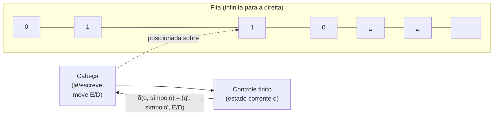

## Objetivos de Aprendizagem

- Enunciar os componentes formais de uma máquina de Turing (fita, cabeça, estados, função de transição) e explicar o papel que cada um desempenha.
- Definir precisamente o que significa uma máquina de Turing aceitar, rejeitar, ou rodar para sempre em uma entrada.
- Rastrear a execução de uma pequena máquina de Turing passo a passo em uma entrada específica, rastreando o conteúdo da fita, a posição da cabeça, e o estado corrente a cada passo.
- Desenhar uma máquina de Turing decidindo uma linguagem simples e justificar, informalmente, que ela para e responde corretamente em toda entrada.
- Explicar por que a máquina de Turing é tratada aqui puramente como o veículo formal para definir "computável", em vez de como um objeto de estudo por sua própria mecânica.

## Contexto e Motivação

O conceito anterior nesta trilha argumentou, como uma tese, não um fato demonstrável, que "efetivamente computável" e "computável por uma máquina de Turing" selecionam a mesma classe de funções. Aquele argumento só faz trabalho real uma vez que "máquina de Turing" tenha uma definição matemática exata, sem ambiguidade; caso contrário a tese está trocando uma noção vaga por outra. Este conceito fornece aquela definição, e o faz com um propósito específico, estreito, em mente: não estudar máquinas de Turing como objetos fascinantes em seu próprio direito, nem catalogar as muitas variantes e codificações que um tratamento completo de teoria dos autômatos cobriria, mas fixar, de uma vez por todas, exatamente o que significa *algum procedimento mecânico* aceitar, rejeitar, ou falhar em terminar em uma dada entrada. Todo conceito subsequente nesta trilha, decidibilidade, reconhecibilidade, o Problema da Parada, as classes de complexidade P e NP, é enunciado em termos de máquinas de Turing especificamente porque este conceito fixa o que aquela frase significa com precisão total.

Vale a pena ser explícito sobre o escopo aqui, já que um curso completo de teoria dos autômatos (coberto pela disciplina separada `formal-languages-automata` desta plataforma, autômatos finitos, expressões regulares, gramáticas livres de contexto, autômatos de pilha) gasta uma quantidade grande de tempo em modelos restritos de computação e na hierarquia de Chomsky relacionando-os. Nada disso é o trabalho deste conceito. A máquina de Turing introduzida aqui é deliberadamente o modelo *mais poderoso*, *menos restrito*, uma fita infinita e movimento irrestrito, precisamente porque o objetivo é capturar *toda* computação mecânica, sem nenhuma restrição, não comparar modelos restritos uns contra os outros. Tanto o 18.404 do MIT quanto o CS154 de Stanford, os dois cursos que este currículo mais de perto segue, traçam exatamente esta linha: defina a máquina de Turing só precisamente o suficiente para falar sobre computabilidade, e deixe a profundidade da teoria dos autômatos para um curso diferente. Este conceito segue essa mesma linha: fita, cabeça, estados, função de transição, e os três destinos possíveis de uma computação (aceitar, rejeitar, rodar para sempre), nada mais elaborado que isso é necessário, ou coberto, aqui.

## Teoria Central

### Os componentes

Uma **máquina de Turing** consiste de:

1. **Uma fita infinita**, dividida em células discretas, cada uma contendo um único símbolo de um **alfabeto de fita** finito Γ (que inclui um **símbolo em branco** especial ␣, e tipicamente o alfabeto de entrada Σ como um subconjunto de Γ). A fita se estende infinitamente em (pelo menos) uma direção, sempre há outra célula disponível, contendo um símbolo em branco por padrão até que algo seja escrito ali.
2. **Uma cabeça de leitura/escrita**, posicionada sobre exatamente uma célula da fita a qualquer momento. A cada passo, a cabeça lê o símbolo na célula sobre a qual está, e (conforme a função de transição) escreve um símbolo naquela mesma célula, depois se move uma célula para a **esquerda** ou **direita**.
3. **Um conjunto finito de estados** Q, incluindo um **estado inicial** q₀ distinto, e dois **estados de parada** distintos: um **estado de aceitação** q_accept e um **estado de rejeição** q_reject (distintos entre si, e uma vez alcançado, a máquina para).
4. **Uma função de transição** δ, mapeando (estado corrente, símbolo sob a cabeça) para (novo estado, símbolo a escrever, direção para mover):

   δ : Q × Γ → Q × Γ × {L, R}

   (formalmente, δ não é definida em q_accept e q_reject, já que a máquina para imediatamente ao entrar em qualquer um deles.)

Uma **configuração** da máquina em qualquer momento é totalmente capturada por três coisas: o estado corrente, o conteúdo inteiro da fita, e a posição da cabeça, esta tripla é tudo que é necessário para determinar todo passo subsequente, já que a função de transição não depende de mais nada.

### Aceitação, rejeição, e loop

Dada uma string de entrada w (escrita na fita, justificada à esquerda, com brancos preenchendo o resto), a máquina começa no estado q₀ com a cabeça sobre o primeiro símbolo de w, e aplica δ repetidamente, um passo de cada vez, cada passo produzindo uma nova configuração a partir da última. Exatamente uma de três coisas acontece:

- **Aceitar.** A máquina eventualmente entra no estado q_accept. A computação para imediatamente, e a entrada é **aceita**.
- **Rejeitar.** A máquina eventualmente entra no estado q_reject. A computação para imediatamente, e a entrada é **rejeitada**.
- **Loop (nunca para).** A máquina roda para sempre, produzindo uma sequência infinita de configurações, nunca entrando em q_accept ou q_reject. Note que "loop" aqui é uma abreviação para "roda para sempre", não necessariamente um ciclo literal repetitivo de configurações, a fita pode crescer e mudar sem limite e a máquina ainda pode simplesmente nunca parar.

Esta divisão em três é o retorno inteiro de formalizar a máquina: aceitação, rejeição, e não-terminação são agora resultados precisos, sem ambiguidade, matematicamente definidos de rodar δ em uma configuração inicial, em vez de descrições informais do que um procedimento "faz." Uma linguagem L é **decidida** por uma máquina M se M aceita todo w ∈ L e rejeita todo w ∉ L (ou seja, M sempre para, e responde corretamente), esta noção, junto com a mais permissiva "reconhecida", é desenvolvida por completo como seu próprio conceito a seguir; aqui é suficiente ter aceitar/rejeitar/loop fixados com precisão, já que esse é o vocabulário do qual a distinção decidir/reconhecer é construída.

### Uma nota sobre mecânica enxuta (deliberadamente)

Esta é a extensão completa do modelo de máquina necessário para esta trilha. Não há deliberadamente aqui nenhum desenvolvimento de máquinas multi-fita, máquinas de Turing não-determinísticas, codificações de máquina ⟨M⟩, máquinas de Turing universais, ou provas de equivalência entre variantes, todo material padrão em um curso dedicado de teoria dos autômatos ou computabilidade, e todos comprovadamente equivalentes em poder ao modelo determinístico de fita única definido acima (consistente com a evidência de convergência da tese de Church-Turing do conceito anterior). O modelo determinístico de fita única acima já basta para definir aceitar/rejeitar/loop com precisão, o que é tudo sobre o que conceitos posteriores nesta trilha (decidibilidade, o Problema da Parada, P e NP) de fato se constroem.

## Exemplos Resolvidos

### Exemplo 1: desenhando uma máquina de Turing para 0ⁿ1ⁿ

**Problema:** Desenhe uma máquina de Turing que decide a linguagem L = { 0ⁿ1ⁿ : n ≥ 0 }: strings consistindo de algum número de 0's seguido por exatamente o mesmo número de 1's (incluindo a string vazia, n = 0).

**Ideia de design.** Repetidamente risque um 0 pela esquerda e um 1 correspondente pela direita, alternando, até que ou tudo tenha sido riscado (aceitar) ou uma incompatibilidade seja encontrada (rejeitar). Use um símbolo marcado X em Γ para registrar "já riscado."

**Estados:** q₀ (inicial; também trata o caso da string vazia), q_find1 (varrendo à direita, passando por 0's e X's, procurando um 1 para riscar), q_back (varrendo à esquerda, voltando ao 0 não riscado mais à esquerda), q_accept, q_reject. Alfabeto de fita Γ = {0, 1, X, ␣}.

**Função de transição (informalmente, como uma tabela de regras):**

| Estado | Lê | Escreve | Move | Novo estado |
|---|---|---|---|---|
| q₀ | 0 | X | D | q_find1 |
| q₀ | X | X | D | q₀ (pula 0's já riscados ao reentrar) |
| q₀ | ␣ | ␣ |: | **aceitar** (nada resta, trata n = 0, e o caso final de tudo riscado) |
| q₀ | 1 |: |: | **rejeitar** (um 1 aparece antes de todos os 0's serem casados, malformado) |
| q_find1 | 0 ou X | igual | D | q_find1 (pula 0's/X's restantes) |
| q_find1 | 1 | X | E | q_back |
| q_find1 | ␣ |: |: | **rejeitar** (fita esgotada antes de encontrar um 1 correspondente) |
| q_back | 0 ou X | igual | E | q_back (pula de volta sobre 0's/X's) |
| q_back | ␣ | ␣ | D | q₀ (encontrou a borda esquerda; reentra em q₀ para encontrar o próximo 0 não riscado) |

**Rastro na entrada `0011` (aceita).** A entrada ocupa as posições de fita 0-3 (`0,0,1,1`); rastreando (estado, posição da cabeça, símbolo lido, símbolo escrito, movimento, novo estado) a cada passo:

| Passo | Estado antes | Cabeça lê | Escreve | Move | Novo estado |
|---|---|---|---|---|---|
| 1 | q₀, pos 0 | `0` | `X` | D | q_find1 |
| 2 | q_find1, pos 1 | `0` | `0` | D | q_find1 |
| 3 | q_find1, pos 2 | `1` | `X` | E | q_back |
| 4 | q_back, pos 1 | `0` | `0` | E | q_back |
| 5 | q_back, pos 0 | `X` | `X` | E | q_back |
| 6 | q_back, pos -1 | `␣` | `␣` | D | q₀ |
| 7 | q₀, pos 0 | `X` | `X` | D | q₀ |
| 8 | q₀, pos 1 | `0` | `X` | D | q_find1 |
| 9 | q_find1, pos 2 | `X` | `X` | D | q_find1 |
| 10 | q_find1, pos 3 | `1` | `X` | E | q_back |
| 11 | q_back, pos 2 | `X` | `X` | E | q_back |
| 12 | q_back, pos 1 | `X` | `X` | E | q_back |
| 13 | q_back, pos 0 | `X` | `X` | E | q_back |
| 14 | q_back, pos -1 | `␣` | `␣` | D | q₀ |
| 15 | q₀, pos 0 | `X` | `X` | D | q₀ |
| 16 | q₀, pos 1 | `X` | `X` | D | q₀ |
| 17 | q₀, pos 2 | `X` | `X` | D | q₀ |
| 18 | q₀, pos 3 | `X` | `X` | D | q₀ |
| 19 | q₀, pos 4 | `␣` |: |: | **aceitar** |

A fita é inteiramente `XXXX` no final, todos os quatro símbolos casados e riscados em duas passagens completas, e a máquina para em q_accept. A entrada `0011` é corretamente aceita.

**Rastro na entrada `010` (rejeitada): abreviado.** A entrada `0,1,0` ocupa as posições 0,1,2. Passo 1: q₀ lê `0` (pos 0), escreve `X`, move D, entra em q_find1 (fita: `X10`). Passo 2: q_find1 lê `1` (pos 1), escreve `X`, move E, entra em q_back (fita: `XX0`). Passo 3: q_back lê `X` (pos 0), move E, continua q_back. Passo 4: q_back lê branco (pos -1), move D, reentra em q₀ na pos 0. Passo 5: q₀ lê `X` (pos 0), move D, continua q₀, agora na pos 1 (também `X`). Passo 6: q₀ lê `X` (pos 1), move D, continua q₀, agora na pos 2, que ainda contém o terceiro símbolo de entrada intocado, `0`. Passo 7: q₀ lê `0` (pos 2), escreve `X`, move D, entra em q_find1 na pos 3. Passo 8: q_find1 lê branco (pos 3), nenhum `1` correspondente resta em lugar nenhum na fita, **rejeita**, corretamente, já que `010` tem um `0` sobrando sem nenhum `1` restante para parear com ele.

### Exemplo 2: rastreando a mesma ideia em um caso menor, totalmente explícito

**Problema:** Rastreie a máquina do Exemplo 1 na entrada rejeitada não trivial mais simples, `01` invertido, ou seja, `10`, para ver rejeição disparada pela própria primeira regra.

**Rastro:** Passo 1: q₀, posição 0, lê `1`. Pela tabela de regras, q₀ lendo `1` imediatamente **rejeita**, nenhum risco acontece de forma alguma, já que uma string 0ⁿ1ⁿ nunca pode legalmente começar com um `1` a menos que n = 0, e n = 0 significa a string vazia, não uma string começando com `1`. Esta rejeição de um único passo ilustra que rejeitar pode acontecer imediatamente, não só depois de varredura extensiva de fita, a máquina não é obrigada a fazer nenhum "trabalho" antes de rejeitar; ela só precisa eventualmente alcançar q_reject (ou, dualmente, q_accept) para parar com uma resposta.

### Exemplo 3: um decisor de número-par-de-1's, rastreado em duas entradas

**Problema:** Desenhe e rastreie uma máquina de Turing decidindo L_even = { w ∈ {0,1}* : w contém um número par de 1's (incluindo zero) }.

**Ideia de design.** Nenhum riscar ou ir-e-voltar é necessário aqui, a máquina só precisa de um bit de memória: se o número de 1's visto até agora, varrendo da esquerda para a direita, é par ou ímpar. Aquele único bit é exatamente o que o estado do controle finito pode manter. Estados: q_even (inicial; 1's pares vistos até agora, incluindo zero), q_odd (1's ímpares vistos até agora). Em um branco (fim da entrada), aceita a partir de q_even, rejeita a partir de q_odd.

**Transições:** δ(q_even, 0) = (q_even, 0, D); δ(q_even, 1) = (q_odd, 1, D); δ(q_odd, 0) = (q_odd, 0, D); δ(q_odd, 1) = (q_even, 1, D); δ(q_even, ␣) = aceita; δ(q_odd, ␣) = rejeita.

**Rastro em `1011` (três 1's, ímpar, deveria rejeitar):**

| Passo | Estado | Cabeça lê | Novo estado |
|---|---|---|---|
| 1 | q_even | `1` | q_odd |
| 2 | q_odd | `0` | q_odd |
| 3 | q_odd | `1` | q_even |
| 4 | q_even | `1` | q_odd |
| 5 | q_odd | `␣` | **rejeitar** |

Três 1's é ímpar, e a máquina corretamente rejeita.

**Rastro em `1001` (dois 1's, par, deveria aceitar):**

| Passo | Estado | Cabeça lê | Novo estado |
|---|---|---|---|
| 1 | q_even | `1` | q_odd |
| 2 | q_odd | `0` | q_odd |
| 3 | q_odd | `0` | q_odd |
| 4 | q_odd | `1` | q_even |
| 5 | q_even | `␣` | **aceitar** |

Dois 1's é par, e a máquina corretamente aceita. Este exemplo, deliberadamente mais simples que o Exemplo 1, mostra uma máquina que nunca precisa escrever nada diferente do que lê, usando estado puramente como memória; também ilustra que uma máquina de Turing sempre para neste L_even (todo ramo de δ leva a uma entrada restante estritamente mais curta ou uma parada), então esta máquina de fato *decide* L_even em vez de meramente rodar para sempre em algumas entradas.

## Equívocos Comuns e Armadilhas

- **"A fita é só como um array, então uma máquina de Turing é basicamente um for-loop sobre um array."** A fita é infinita (ou ao menos extensível sem limite), e a máquina pode mover a cabeça para trás e para frente arbitrariamente muitas vezes, revisitando e sobrescrevendo as mesmas células repetidamente, a máquina do Exemplo 1 cruza a mesma região de entrada múltiplas vezes, alternando direção. Nada limita o número de passos em termos só do comprimento da entrada da forma que uma única passagem de array faria; aquela revisitação sem limite é exatamente o que dá ao modelo seu poder computacional completo, diferente de uma única varredura da esquerda para a direita.
- **"Se uma máquina não alcança q_reject, ela deve aceitar."** Falso, a terceira possibilidade, rodar para sempre em loop, é um resultado real e distinto, não só "ainda não terminou." Uma máquina pode rodar para sempre sem nunca entrar em q_accept ou q_reject; nada na definição formal garante terminação. (Esta exata lacuna, uma máquina que pode rodar para sempre em vez de rejeitar de forma limpa, é precisamente o que separa "decidível" de meramente "reconhecível", o assunto do próximo conceito.)
- **"Rejeitar exige varrer a entrada inteira primeiro."** O Exemplo 2 mostra uma máquina rejeitando depois de um único passo, imediatamente, sem varredura nenhuma, δ(q₀, 1) = rejeitar dispara no instante em que um símbolo inicial ilegal é lido. Aceitação e rejeição são sobre *qual estado de parada é eventualmente alcançado*, não sobre quanto da fita foi examinado antes.
- **"A função de transição pode olhar para mais que o estado corrente e o símbolo corrente, tipo, pode 'lembrar' o que leu três passos atrás diretamente."** Não pode, pela definição formal, o domínio inteiro de δ é (estado, símbolo sob a cabeça), nada mais. Qualquer "memória" de símbolos anteriores tem que ser codificada ou no estado corrente (como no Exemplo 3, onde q_even/q_odd *é* a memória de um bit de paridade) ou escrevendo marcas na própria fita e lendo-as de volta depois (como no Exemplo 1, onde X marca "já processado"). Esta é uma restrição de design real, não uma tecnicalidade menor, a "memória" aparente de toda máquina de Turing é construída inteiramente a partir desses dois mecanismos.

## Resumo

Uma máquina de Turing é totalmente especificada por uma fita infinita sobre um alfabeto finito, uma cabeça de leitura/escrita que se move uma célula para a esquerda ou direita por passo, um conjunto finito de estados incluindo um estado inicial e estados distintos de aceitação/rejeição, e uma função de transição δ: Q × Γ → Q × Γ × {L, R}. Rodar a máquina em uma entrada produz exatamente um de três resultados: ela **aceita** (para em q_accept), ela **rejeita** (para em q_reject), ou ela **roda para sempre em loop** (nunca para de forma alguma), esta divisão em três, tornada completamente precisa pelo modelo formal, é a razão inteira para definir a máquina desta forma. Dois pequenos exemplos resolvidos, um decisor de 0ⁿ1ⁿ usando marcação de fita e passagens repetidas esquerda/direita, e um decisor de número-par-de-1's usando só dois estados como uma memória de um bit, mostraram a mecânica rastreada passo a passo em entradas concretas, tanto aceitas quanto rejeitadas. Deliberadamente deixados sem desenvolvimento aqui estão variantes de MT, codificações, e construções de teoria dos autômatos (máquinas multi-fita, não-determinismo, máquinas universais), essas pertencem a um tratamento dedicado de teoria dos autômatos; tudo que esta trilha precisa daqui em diante é só o vocabulário de aceitar, rejeitar, e loop, fixado com precisão por este modelo determinístico de fita única.

## Documentation Links

- [Stanford CS154: Course Home](https://cs154.stanford.edu/): doc
- [MIT 18.404/6.5400: Course Information (Sipser)](https://math.mit.edu/~sipser/18404/info.pdf): doc
