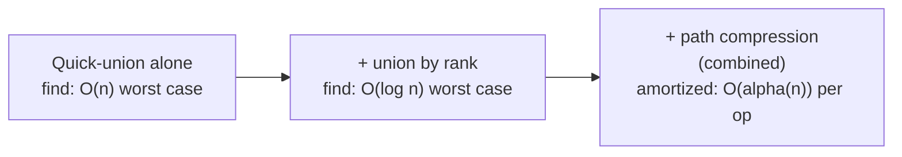

## Learning Objectives

- State the combined union-by-rank-plus-path-compression bound: a sequence of m operations on n elements costs O(m α(n)) total, where α is the inverse Ackermann function.
- Explain, in practical terms, why α(n) is effectively a constant (less than 5) for any n that could ever occur, without needing the full proof.
- Distinguish amortized cost (total cost over a sequence, divided by the number of operations) from worst-case cost of any single operation, and explain why union-find's guarantee is stated as the former.
- Articulate why this result is considered surprising and worth knowing, distinct from merely "another O(log n)-type bound."
- Connect this result back to the Princeton "Algorithms, Part I" course's use of union-find as its opening lecture, as the canonical first example of amortized analysis.

## Context & Motivation

The previous two concepts each independently improved union-find: union by rank capped every tree's height at O(log n), and path compression flattened trees during `find` calls, shortening paths for every future query. Both are real, worthwhile optimizations on their own. But the reason Sedgewick and Wayne's Princeton "Algorithms, Part I" builds its opening lecture around union-find specifically — rather than any of dozens of other data structures it could have chosen to introduce the course — is what happens when the two are combined: a sequence of m union and find operations on n elements, using both union by rank (or size) and path compression together, costs a total of O(m α(n)), where α is the inverse Ackermann function. This is not merely "a bit better than O(log n)" — it is a genuinely different category of bound, because α(n) grows so slowly that it is, for every practical purpose, a constant.

This result is famous specifically because it is surprising in a way that most algorithmic bounds are not. Most improvements from "linear" to "logarithmic" to "log log" still involve a function that keeps growing, however slowly, without bound, as n grows without bound. The inverse Ackermann function does grow without bound too, in the strict mathematical sense — but it grows so unbelievably slowly that no value of n physically expressible in this universe (more atoms than exist, more operations than could ever be performed) pushes α(n) above 4 or 5. Calling something "essentially constant time" is a claim made loosely all the time in casual discussion of algorithms; union-find with both optimizations is one of the very few places in computer science where that claim can be made with this much rigor behind it, and it is exactly the reason this material anchors the opening of one of the field's most-taken algorithms courses — it is the first, best example students see of the gap between "worst case for one operation" and "amortized cost averaged over a long sequence," a distinction the rest of the course leans on repeatedly.

## Core Theory

### What "amortized" means here, precisely

Amortized cost is a statement about a *sequence* of operations, not about any single operation in isolation. It says: perform m operations (any mix of `union` and `find`) on a structure that starts with n elements, and add up the total work done across all of them — the amortized bound O(m α(n)) is a bound on that *total*, which, divided by m, gives an average cost per operation of O(α(n)). This is compatible with some individual operation, somewhere in the sequence, costing more than O(α(n)) — what the bound rules out is many expensive operations happening across the sequence; the expensive ones must be rare enough, and the cheap ones common enough, that the total stays within O(m α(n)). This is a fundamentally different kind of guarantee than a worst-case-per-operation bound like "every single `find` costs O(log n)," and recognizing the difference is essential to interpreting the result correctly.

### The bound, stated precisely

With n elements and a sequence of m operations (unions and finds intermixed, in any order, including finds on elements that have already been through several unions), using both union by rank (or size) and path compression:

Total cost of all m operations = O(m · α(n))

where α(n) is the inverse of the Ackermann function — specifically, the inverse of a version of Ackermann's function that itself grows faster than any fixed-height tower of exponentials (faster than 2^2^2^…^2 for any fixed number of 2's in the tower). Because Ackermann's function grows that explosively, its inverse grows correspondingly, almost unimaginably, slowly.

### Why α(n) is "constant" for any n that will ever occur

To make "grows unbelievably slowly" concrete: α(n) stays at 4 or below for every n up to a number so large it dwarfs any conceivable input size — far beyond the number of atoms estimated to exist in the observable universe (roughly 10^80), let alone any array or graph any real program will ever construct. In other words, while it is true that α(n) is not, in the mathematically pedantic sense, a constant function — it does, technically, keep increasing as n grows without any fixed upper bound — no value of n that is physically realizable as an input to a real program will ever push α(n) past 4 or 5. This is why the result is routinely and correctly summarized as "essentially constant time per operation": the qualifier "essentially" is doing real, defensible work here, not glossing over a meaningful caveat.

### Why this is surprising, not just "another good bound"

Most improvements in this area follow a familiar shape: unweighted quick-union gives O(n) worst-case `find`; adding union by rank alone gives O(log n); one might guess adding path compression on top gives something like O(log log n), continuing the same pattern of "each optimization shaves off one more logarithm." That guess would already be a reasonable, respectable improvement — and it would still be wrong, in the sense of dramatically understating what actually happens. The combination does not merely shave off another logarithm; it drops to a function that, for all practical values of n, does not grow at all. This qualitative jump — from "a function that keeps growing, just more slowly" to "a function that is provably constant for every input size that could ever exist" — is what makes this a landmark result worth knowing by name, rather than just one entry in a list of asymptotic improvements. The full proof of the O(m α(n)) bound is genuinely advanced (it involves a careful potential-function or blocking-argument analysis) and is not reproduced here — what matters at this level is knowing the result exists, stating it accurately, and understanding why it is remarkable.

### A visual summary of the progression

Each arrow represents one concept from this module's progression — the point of this final concept is the last arrow, where the combination produces a qualitatively different (not just quantitatively smaller) bound than either optimization achieves alone.

## Worked Examples

### Example 1 — interpreting the bound on a concrete sequence

**Problem:** A program performs m = 1,000,000 union-find operations on a structure holding n = 1,000,000 elements, using union by size and path compression together. Roughly how much total work should be expected, and what is the average cost per operation?

**Reasoning.** By the amortized bound, total work is O(m α(n)) = O(1,000,000 · α(1,000,000)). Since α(n) is at most 4 for any n up to towers of exponentials vastly larger than 1,000,000, α(1,000,000) is, concretely, at most 4 (in fact, for such a modest n, it is smaller still — α is at most 3 for n up into ranges far beyond typical program sizes). So total work is O(4,000,000) — a small constant multiple of m. Dividing by m operations, the average cost per operation is a small constant (at most about 4 "units" of work per operation, where a unit here corresponds to the constant-factor cost of one parent-pointer step). This is the concrete payoff of the abstract bound: for any realistic n, this is indistinguishable, in practice, from a true O(1)-per-operation structure.

### Example 2 — why a single expensive `find` does not violate the amortized guarantee

**Problem:** Suppose within a long sequence of operations, one particular `find` call happens to walk a path of length 6 before path compression kicks in and flattens it. Does this violate the O(m α(n)) amortized bound?

**Reasoning.** No — the amortized bound is a statement about the *sum* of costs across the whole sequence, not a claim that every individual operation costs O(α(n)). A handful of operations walking a somewhat longer path (bounded, thanks to union by rank, by O(log n) even in the worst case before compression helps) is entirely compatible with the total, summed over m operations, staying within O(m α(n)) — because path compression ensures that once a long path has been walked and paid for, the nodes on it become cheap (O(1)) for the remainder of the sequence, effectively "amortizing" that one expensive walk's cost across all the future cheap lookups it enables. This is exactly the distinction from the Core Theory section: amortized cost bounds the average, not the maximum of any single operation, and it is precisely because expensive operations become rare and self-correcting (via compression) that the average stays essentially constant.

## Common Misconceptions & Pitfalls

- **"O(m α(n)) means every single operation costs O(α(n))."** It means the *total* over m operations costs O(m α(n)) — individual operations can cost more (bounded by O(log n) even in the worst case, thanks to union by rank alone), as Example 2 shows; the guarantee is about the sum, divided by m, not about any one operation's ceiling.
- **"α(n) is literally a constant function, mathematically."** α(n) is not, strictly, a constant — it is a genuine function of n that increases without bound as n increases without bound, in the same sense that log(n) or log(log(n)) do. What makes it practically indistinguishable from a constant is that its rate of growth is so extreme in the inverse direction (because Ackermann's function itself grows so explosively) that it never exceeds about 4 for any n that is physically realizable. "Essentially constant" is a claim about practice, not a claim that the mathematics has changed categories.
- **"This result means union-find operations are literally always fast, no exceptions, ever."** The bound is amortized over a sequence and depends on both optimizations (union by rank/size and path compression) being present together; a union-find implementation missing one of them (e.g., quick-union with only path compression and no rank/size weighting, or weighted quick-union with no compression) does not automatically inherit this specific O(m α(n)) guarantee, even though each optimization alone still helps.
- **"Since α(n) ≤ 5 in practice, it's fine to just write O(1) everywhere and not mention α(n) at all."** For engineering purposes, treating it as constant is reasonable and common — but stating the bound accurately as O(m α(n)) rather than O(m) matters when discussing the actual theoretical result, since it is the precise, historically correct statement (and conflating it with a true O(1) worst-case-per-operation bound, which this is not, misrepresents what was actually proven).

## Summary

Combining union by rank (or size) with path compression gives a sequence of m union-find operations on n elements a total cost of O(m α(n)), where α is the inverse Ackermann function — a bound categorically different from, and far stronger than, "just another logarithmic improvement." Because Ackermann's function grows explosively fast, its inverse grows correspondingly, almost immeasurably slowly: α(n) never exceeds about 4 or 5 for any n that could physically be realized as an input, anywhere, ever — making "essentially constant time per operation" a claim that can be stated with genuine rigor here, one of the few places in algorithms where that phrase is not an approximation glossing over real growth. The bound is amortized, meaning it constrains the total cost over a whole sequence of operations, not the cost of any single operation in isolation — a small number of individually expensive operations is fully compatible with the guarantee, precisely because path compression ensures each expensive walk pays for cheaper lookups afterward. This result is exactly why Sedgewick and Wayne open "Algorithms, Part I" with union-find: it is the cleanest possible vehicle for teaching the core idea of amortized analysis, using a structure simple enough to implement from scratch in a few lines yet rich enough to demonstrate one of the most celebrated bounds in the field.

## Documentation Links

- [Sedgewick & Wayne — Algorithms Lectures (Princeton)](https://algs4.cs.princeton.edu/lectures/) — doc
- [MIT 6.006 — Lecture Notes (OCW)](https://ocw.mit.edu/courses/6-006-introduction-to-algorithms-spring-2020/pages/lecture-notes/) — doc
