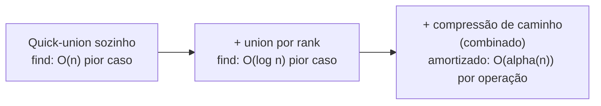

## Objetivos de Aprendizagem

- Enunciar o limite combinado union-por-rank-mais-compressão-de-caminho: uma sequência de m operações em n elementos custa O(m α(n)) no total, onde α é a função inversa de Ackermann.
- Explicar, em termos práticos, por que α(n) é efetivamente uma constante (menor que 5) para qualquer n que jamais poderia ocorrer, sem precisar da prova completa.
- Distinguir custo amortizado (custo total sobre uma sequência, dividido pelo número de operações) de custo de pior caso de qualquer operação única, e explicar por que a garantia do union-find é enunciada como a primeira.
- Articular por que este resultado é considerado surpreendente e digno de conhecer, distinto de meramente "mais um limite tipo O(log n)."
- Conectar este resultado de volta ao uso de union-find pelo curso "Algorithms, Part I" de Princeton como sua palestra de abertura, como o primeiro exemplo canônico de análise amortizada.

## Contexto e Motivação

Os dois conceitos anteriores cada um independentemente melhorou union-find: union por rank limitou a altura de toda árvore a O(log n), e compressão de caminho achatou árvores durante chamadas `find`, encurtando caminhos para toda consulta futura. Ambas são otimizações reais e valiosas por si só. Mas a razão pela qual "Algorithms, Part I" de Sedgewick e Wayne em Princeton constrói sua palestra de abertura em torno de union-find especificamente, em vez de qualquer uma das dezenas de outras estruturas de dados que poderia ter escolhido para introduzir o curso, é o que acontece quando as duas são combinadas: uma sequência de m operações union e find em n elementos, usando tanto union por rank (ou size) quanto compressão de caminho juntos, custa um total de O(m α(n)), onde α é a função inversa de Ackermann. Isso não é meramente "um pouco melhor que O(log n)", é uma categoria genuinamente diferente de limite, porque α(n) cresce tão devagar que é, para todo propósito prático, uma constante.

Este resultado é famoso especificamente porque é surpreendente de uma forma que a maioria dos limites algorítmicos não é. A maioria das melhorias de "linear" para "logarítmico" para "log log" ainda envolve uma função que continua crescendo, por mais devagar que seja, sem limite, conforme n cresce sem limite. A função inversa de Ackermann também cresce sem limite, no sentido matemático estrito, mas cresce tão inacreditavelmente devagar que nenhum valor de n fisicamente expressável neste universo (mais átomos do que existem, mais operações do que jamais poderiam ser realizadas) empurra α(n) acima de 4 ou 5. Chamar algo de "essencialmente tempo constante" é uma afirmação feita frouxamente o tempo todo em discussão casual de algoritmos; union-find com ambas as otimizações é um dos poucos lugares na ciência da computação onde essa afirmação pode ser feita com tanto rigor por trás dela, e é exatamente a razão pela qual esse material ancora a abertura de um dos cursos de algoritmos mais frequentados do campo, é o primeiro e melhor exemplo que estudantes veem da lacuna entre "pior caso para uma operação" e "custo amortizado calculado em média ao longo de uma longa sequência", uma distinção sobre a qual o resto do curso se apoia repetidamente.

## Teoria Central

### O que "amortizado" significa aqui, precisamente

Custo amortizado é uma afirmação sobre uma *sequência* de operações, não sobre qualquer operação única isoladamente. Diz: realize m operações (qualquer mistura de `union` e `find`) em uma estrutura que começa com n elementos, e some o trabalho total feito através de todas elas, o limite amortizado O(m α(n)) é um limite sobre esse *total*, que, dividido por m, dá um custo médio por operação de O(α(n)). Isso é compatível com alguma operação individual, em algum lugar na sequência, custando mais que O(α(n)), o que o limite descarta é muitas operações caras acontecendo através da sequência; as caras devem ser raras o suficiente, e as baratas comuns o suficiente, que o total permaneça dentro de O(m α(n)). Este é um tipo de garantia fundamentalmente diferente de um limite de pior-caso-por-operação como "toda única `find` custa O(log n)," e reconhecer a diferença é essencial para interpretar o resultado corretamente.

### O limite, enunciado precisamente

Com n elementos e uma sequência de m operações (uniões e finds misturados, em qualquer ordem, incluindo finds em elementos que já passaram por várias uniões), usando tanto union por rank (ou size) quanto compressão de caminho:

Custo total de todas as m operações = O(m · α(n))

onde α(n) é o inverso da função de Ackermann, especificamente, o inverso de uma versão da função de Ackermann que ela mesma cresce mais rápido que qualquer torre de altura fixa de exponenciais (mais rápido que 2^2^2^…^2 para qualquer número fixo de 2s na torre). Porque a função de Ackermann cresce tão explosivamente, seu inverso cresce correspondentemente, quase inimaginavelmente devagar.

### Por que α(n) é "constante" para qualquer n que jamais ocorrerá

Para tornar "cresce inacreditavelmente devagar" concreto: α(n) permanece em 4 ou abaixo para todo n até um número tão grande que ofusca qualquer tamanho de entrada concebível, muito além do número de átomos estimado existir no universo observável (aproximadamente 10^80), muito menos qualquer array ou grafo que qualquer programa real jamais construirá. Em outras palavras, embora seja verdade que α(n) não é, no sentido matematicamente pedante, uma função constante, tecnicamente, continua aumentando conforme n cresce sem nenhum limite superior fixo, nenhum valor de n que seja fisicamente realizável como entrada para um programa real jamais empurrará α(n) além de 4 ou 5. Isso é por que o resultado é rotineira e corretamente resumido como "essencialmente tempo constante por operação": o qualificador "essencialmente" está fazendo trabalho real e defensável aqui, não encobrindo uma ressalva significativa.

### Por que isso é surpreendente, não apenas "mais um bom limite"

A maioria das melhorias nessa área segue um formato familiar: quick-union não ponderado dá `find` O(n) no pior caso; adicionar union por rank sozinho dá O(log n); alguém poderia adivinhar que adicionar compressão de caminho em cima disso dá algo como O(log log n), continuando o mesmo padrão de "cada otimização remove mais um logaritmo." Esse palpite já seria uma melhoria razoável e respeitável, e ainda estaria errado, no sentido de subestimar dramaticamente o que de fato acontece. A combinação não apenas remove mais um logaritmo; cai para uma função que, para todos os valores práticos de n, não cresce de forma alguma. Esse salto qualitativo, de "uma função que continua crescendo, apenas mais devagar" para "uma função que é comprovadamente constante para todo tamanho de entrada que jamais poderia existir", é o que torna este um resultado marco que vale a pena conhecer pelo nome, em vez de apenas mais uma entrada em uma lista de melhorias assintóticas. A prova completa do limite O(m α(n)) é genuinamente avançada (envolve uma análise cuidadosa de função de potencial ou argumento de bloqueio) e não é reproduzida aqui, o que importa neste nível é saber que o resultado existe, enunciá-lo precisamente, e entender por que é notável.

### Um resumo visual da progressão

Cada seta representa um conceito da progressão deste módulo, o ponto deste conceito final é a última seta, onde a combinação produz um limite qualitativamente diferente (não apenas quantitativamente menor) do que qualquer otimização alcança sozinha.

## Exemplos Resolvidos

### Exemplo 1 — interpretando o limite em uma sequência concreta

**Problema:** Um programa realiza m = 1.000.000 operações union-find em uma estrutura contendo n = 1.000.000 elementos, usando union por size e compressão de caminho juntos. Aproximadamente quanto trabalho total deveria ser esperado, e qual é o custo médio por operação?

**Raciocínio.** Pelo limite amortizado, o trabalho total é O(m α(n)) = O(1.000.000 · α(1.000.000)). Como α(n) é no máximo 4 para qualquer n até torres de exponenciais vastamente maiores que 1.000.000, α(1.000.000) é, concretamente, no máximo 4 (de fato, para um n tão modesto, é ainda menor, α é no máximo 3 para n até faixas muito além de tamanhos de programa típicos). Então o trabalho total é O(4.000.000), um pequeno múltiplo constante de m. Dividindo por m operações, o custo médio por operação é uma pequena constante (no máximo cerca de 4 "unidades" de trabalho por operação, onde uma unidade aqui corresponde ao custo de fator constante de um passo de ponteiro de pai). Este é o retorno concreto do limite abstrato: para qualquer n realista, isso é indistinguível, na prática, de uma verdadeira estrutura O(1)-por-operação.

### Exemplo 2 — por que um único `find` caro não viola a garantia amortizada

**Problema:** Suponha que dentro de uma longa sequência de operações, uma chamada `find` específica aconteça de percorrer um caminho de comprimento 6 antes de compressão de caminho entrar em ação e o achatar. Isso viola o limite amortizado O(m α(n))?

**Raciocínio.** Não, o limite amortizado é uma afirmação sobre a *soma* de custos através de toda a sequência, não uma afirmação de que toda operação individual custa O(α(n)). Um punhado de operações percorrendo um caminho um tanto mais longo (limitado, graças a union por rank, por O(log n) mesmo no pior caso antes de compressão ajudar) é inteiramente compatível com o total, somado ao longo de m operações, permanecer dentro de O(m α(n)), porque compressão de caminho garante que uma vez que um caminho longo foi percorrido e pago, os nós nele se tornam baratos (O(1)) para o resto da sequência, efetivamente "amortizando" o custo daquela caminhada cara através de todas as futuras buscas baratas que ela habilita. Esta é exatamente a distinção da seção de Teoria Central: custo amortizado limita a média, não o máximo de qualquer operação única, e é precisamente porque operações caras se tornam raras e autocorretivas (via compressão) que a média permanece essencialmente constante.

## Equívocos Comuns e Armadilhas

- **"O(m α(n)) significa que toda única operação custa O(α(n))."** Significa que o *total* ao longo de m operações custa O(m α(n)), operações individuais podem custar mais (limitadas por O(log n) mesmo no pior caso, graças a union por rank sozinho), como o Exemplo 2 mostra; a garantia é sobre a soma, dividida por m, não sobre o teto de qualquer operação única.
- **"α(n) é literalmente uma função constante, matematicamente."** α(n) não é, estritamente, uma constante, é uma função genuína de n que aumenta sem limite conforme n aumenta sem limite, no mesmo sentido que log(n) ou log(log(n)). O que a torna praticamente indistinguível de uma constante é que sua taxa de crescimento é tão extrema na direção inversa (porque a própria função de Ackermann cresce tão explosivamente) que nunca excede cerca de 4 para qualquer n que seja fisicamente realizável. "Essencialmente constante" é uma afirmação sobre a prática, não uma afirmação de que a matemática mudou de categorias.
- **"Este resultado significa que operações union-find são literalmente sempre rápidas, sem exceções, nunca."** O limite é amortizado ao longo de uma sequência e depende de ambas as otimizações (union por rank/size e compressão de caminho) estarem presentes juntas; uma implementação union-find faltando uma delas (por exemplo, quick-union apenas com compressão de caminho e sem ponderação rank/size, ou weighted quick-union sem compressão) não herda automaticamente essa garantia específica O(m α(n)), mesmo que cada otimização sozinha ainda ajude.
- **"Já que α(n) ≤ 5 na prática, está tudo bem apenas escrever O(1) em todo lugar e não mencionar α(n) de forma alguma."** Para propósitos de engenharia, tratá-lo como constante é razoável e comum, mas enunciar o limite precisamente como O(m α(n)) em vez de O(m) importa ao discutir o resultado teórico real, já que é a afirmação precisa e historicamente correta (e confundi-lo com um verdadeiro limite O(1)-pior-caso-por-operação, que não é o caso, deturpa o que de fato foi provado).

## Resumo

Combinar union por rank (ou size) com compressão de caminho dá a uma sequência de m operações union-find em n elementos um custo total de O(m α(n)), onde α é a função inversa de Ackermann, um limite categoricamente diferente, e muito mais forte, que "apenas mais uma melhoria logarítmica." Porque a função de Ackermann cresce explosivamente rápido, seu inverso cresce correspondentemente, quase imensuravelmente devagar: α(n) nunca excede cerca de 4 ou 5 para qualquer n que possa fisicamente ser realizado como uma entrada, em qualquer lugar, jamais, tornando "essencialmente tempo constante por operação" uma afirmação que pode ser enunciada com rigor genuíno aqui, um dos poucos lugares em algoritmos onde essa frase não é uma aproximação encobrindo crescimento real. O limite é amortizado, significando que restringe o custo total ao longo de uma sequência inteira de operações, não o custo de qualquer operação única isoladamente, um pequeno número de operações individualmente caras é totalmente compatível com a garantia, precisamente porque compressão de caminho garante que toda caminhada cara paga por buscas mais baratas depois. Este resultado é exatamente por que Sedgewick e Wayne abrem "Algorithms, Part I" com union-find: é o veículo mais limpo possível para ensinar a ideia central de análise amortizada, usando uma estrutura simples o suficiente para implementar do zero em poucas linhas mas rica o suficiente para demonstrar um dos limites mais celebrados do campo.

## Documentation Links

- [Sedgewick & Wayne — Algorithms Lectures (Princeton)](https://algs4.cs.princeton.edu/lectures/) — doc
- [MIT 6.006 — Lecture Notes (OCW)](https://ocw.mit.edu/courses/6-006-introduction-to-algorithms-spring-2020/pages/lecture-notes/) — doc
