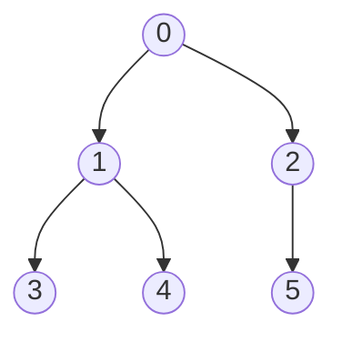
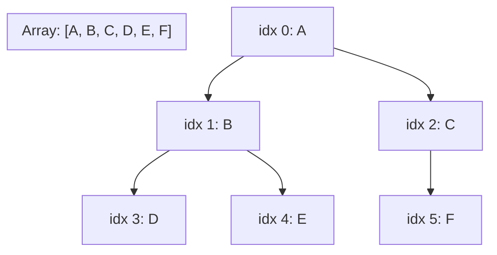

## Learning Objectives

- State the complete-tree property precisely, and explain why it is the shape guarantee that a heap maintains at all times.
- Derive the child and parent index formulas (`2i+1`, `2i+2`, `(i-1)//2`) from the complete-tree property, rather than merely memorizing them.
- Explain why completeness guarantees the array representation has zero wasted slots, in contrast to a general binary tree.
- Implement child/parent index lookups directly on a plain Python list, with correct bounds checking.
- Compare the memory and locality trade-offs of the array representation against a pointer-based (linked) binary tree representation.

## Context & Motivation

The prerequisite `binary-trees-terminology-and-representation` concept introduced two ways to store a binary tree: the linked representation (Node objects with `left`/`right` pointers) and the implicit array representation, where a node at index `i` has its children at `2i+1` and `2i+2` with no pointers stored at all. That concept was explicit that the array trick is only worth using when the tree stays close to *complete* — it even worked a concrete counterexample, a chain of left children, where the array representation would need roughly `2^height` slots to store only `height + 1` real nodes, almost all of them wasted `None` entries. At the time, that was presented as an aside: a technique worth knowing, filed away for later, while the linked representation remained the default for the general binary trees and binary search trees that discipline actually built.

This concept is where that aside stops being an aside. A heap is not a general binary tree that happens to sometimes be complete — a heap is defined to *always* be complete, as a maintained invariant, every single time an element is inserted or removed. That single guarantee changes the calculus entirely: the array representation's one weakness (wasted slots on incomplete trees) simply cannot occur for a heap, because a heap by definition never has gaps. So the technique that was a curiosity for general binary trees becomes the *primary, default* representation for heaps — not an alternative worth mentioning, but the standard one used in essentially every heap implementation you will encounter, including the one built into Python's own `heapq` module and the priority queue in most standard libraries. The pointer overhead that the linked representation pays for every single node (two references per node, each consuming memory and each requiring a pointer-chasing memory access to follow) is eliminated entirely, replaced by arithmetic on a single flat array — a change that matters not just for memory footprint but for cache locality, since a flat array is stored contiguously and modern CPUs read contiguous memory far faster than they chase pointers scattered across the heap (the memory heap, not to be confused with the data structure — an unfortunate but standard naming collision).

## Core Theory

### The complete-tree property, precisely

A binary tree is **complete** if every level is entirely filled except possibly the last, and the last level (if partial) has all its nodes pushed as far left as possible, with no gaps. Equivalently: if you number nodes level by level, left to right, starting from the root as position 0, a complete tree's nodes occupy exactly the positions `0, 1, 2, ..., n-1` for some count `n` — there is no position `k < n` that is empty while some position `> k` is occupied. This is exactly the shape guarantee a heap maintains after every insertion and every extraction (developed in `heap-insert-and-extract`): the tree never has a "hole" anywhere except possibly at the very end of the last level.



Labeling each node by its level-order position (0 through 5), this tree is complete: level 0 has {0}, level 1 has {1, 2} (full), and level 2 has {3, 4, 5} — partial, but filled left to right with no gaps, and there is no position 6 occupied while some earlier position were empty.

### From completeness to index arithmetic — deriving the formulas, not memorizing them

Because a complete tree's nodes correspond exactly to positions `0` through `n-1` in level order with no gaps, it is safe to store node `k` at array index `k` directly — position and array index coincide. The child/parent formulas fall out of counting how many nodes appear before a given level.

Consider node at index `i`. In a complete, level-numbered tree, level `d` contains nodes numbered from `2^d - 1` to `2^(d+1) - 2` (there are `2^d` nodes at level `d`, and the levels before it total `2^d - 1` nodes, so level `d` starts right after those). If index `i` sits at level `d`, its position *within* that level is `i - (2^d - 1)`. Its two children sit at level `d+1`, which starts at index `2^(d+1) - 1`, and — because each parent at level `d` produces exactly two consecutive slots at level `d+1` — the children of the `j`-th node in level `d` (0-indexed within the level) occupy positions `2j` and `2j+1` within level `d+1`. Substituting `j = i - (2^d - 1)`:

- left child index = `(2^(d+1) - 1) + 2(i - (2^d - 1)) = 2^(d+1) - 1 + 2i - 2^(d+1) + 2 = 2i + 1`
- right child index = left child index + 1 = `2i + 2`

Running the same relationship in reverse — given a child at index `i`, which parent produced it? — a child index is always either `2p+1` or `2p+2` for its parent `p`. Solving both for `p`: if `i = 2p+1`, then `p = (i-1)/2`; if `i = 2p+2`, then `p = (i-2)/2 = (i-1)/2 - 0.5`, which rounds down to the same integer under floor division either way. So for any `i > 0`:

- parent index = `(i - 1) // 2` (integer/floor division)

These three formulas — child of `i` at `2i+1` and `2i+2`, parent of `i` at `(i-1)//2` — are not arbitrary conventions to memorize; they are the direct arithmetic consequence of a level-order numbering applied to a tree that is guaranteed complete. If the tree were *not* guaranteed complete, this arithmetic would silently break: index `2i+1` might not correspond to an actual left child at all, but to some unrelated node several levels away, because gaps earlier in the array would throw off the level-order correspondence entirely. Completeness is not a nice-to-have for this representation — it is the load-bearing assumption the whole scheme depends on.



Reading the arithmetic off this diagram: node A (index 0) has children at `2(0)+1=1` and `2(0)+2=2` — B and C, matching the picture. Node B (index 1) has children at `2(1)+1=3` and `2(1)+2=4` — D and E. Node C (index 2) would have children at `2(2)+1=5` and `2(2)+2=6`; index 5 exists (F), index 6 does not (array length 6) — consistent with C having only one child in the diagram. D's parent: `(3-1)//2 = 1` — index 1, which is B. ✓.

### Zero wasted space, and no pointer overhead

Because a complete tree's `n` nodes occupy array indices `0` through `n-1` with no gaps whatsoever, the array representation of a heap uses exactly `n` array slots for `n` elements — never more. Compare this to the linked representation, where each of the `n` nodes needs its own object plus two references (`left`, `right`), meaning roughly `3n` words of memory (one for the value, two for pointers) versus the array representation's `n` words (just the values, with children found by arithmetic instead of by storing a pointer). Beyond raw memory, the array representation is also friendlier to CPU caches: a contiguous array can be read largely sequentially, and a modern CPU pulls in whole cache lines at once, so nearby indices are often already in cache — whereas a linked structure scatters its nodes across whatever memory the allocator happened to hand out, turning every `.left` or `.right` dereference into a potential cache miss. This is precisely why the earlier concept flagged this technique as "compact and cache-friendly" for complete trees specifically, and why it becomes the default, not merely an option, once completeness is a guaranteed invariant rather than a coincidence.

## Worked Examples

### Example 1 — Implementing child/parent lookups directly on a Python list

**Problem:** Given a heap stored as a plain Python list, write the three index functions and use them to navigate.

```python
heap = [90, 70, 80, 30, 60, 75, 20]

def left(i):
    return 2 * i + 1

def right(i):
    return 2 * i + 2

def parent(i):
    return (i - 1) // 2

# Navigating from the root:
print(heap[0])                      # 90 — the root
print(heap[left(0)], heap[right(0)])  # 70 80 — root's two children
print(heap[left(1)], heap[right(1)])  # 30 60 — index 1's (70's) two children
print(heap[parent(6)])              # heap[2] = 80 — index 6's (20's) parent
```

Bounds matter here: `left(i)` or `right(i)` can compute an index that is `>= len(heap)`, meaning that child slot simply doesn't exist (this node is a leaf, or has only one child). Any code walking children must check `left(i) < len(heap)` before indexing — this is exactly analogous to checking for `None` in the linked representation, just expressed as a bounds check instead of a null check.

### Example 2 — Finding all leaves and all internal nodes by index alone

**Problem:** For a heap of length `n = 10`, which indices are leaves (no children), and which are internal (have at least one child) — using only arithmetic, no traversal?

**Reasoning.** An index `i` is a leaf exactly when `left(i) = 2i+1 >= n`, i.e., `i >= (n-1)/2`. For `n = 10`: `(n-1)/2 = 4.5`, so any index `i >= 4.5`, meaning `i` in `{5, 6, 7, 8, 9}`, is a leaf — five leaf indices. Indices `{0, 1, 2, 3, 4}` are internal (each has at least a left child, since `2(4)+1 = 9 < 10`).

```python
n = 10
leaves = [i for i in range(n) if 2*i+1 >= n]
internal = [i for i in range(n) if 2*i+1 < n]
print(leaves)    # [5, 6, 7, 8, 9]
print(internal)  # [0, 1, 2, 3, 4]
```

This index-only reasoning — no need to walk the structure to know which nodes are leaves — is a direct payoff of the array representation's arithmetic: the same question in a linked tree would require actually visiting each node and checking whether `left is None and right is None`.

### Example 3 — Why the formulas fail silently on a non-complete tree

**Problem:** Suppose someone stores a non-complete binary tree in an array by simply skipping missing nodes, e.g. representing "root with only a right child, whose right child has only a left child" as `[R, C1, C2]` (omitting the missing left child of R entirely, rather than using `None` as a placeholder). Show that the child-index arithmetic gives wrong answers.

**Reasoning.** With `R` at index 0, the formula says its children live at indices 1 and 2 — but by the tree's actual shape, index 1 in this compressed array is meant to represent `R`'s *right* child (there is no left child), and index 2 is meant to represent that right child's *left* child. The formula `left(0) = 1` would incorrectly report `C1` (which is actually `R`'s right child) as `R`'s left child, and would report nothing at index 2 as belonging to `R` at all (when in fact `C2` is two levels down, not one).

```python
# Correct approach: use None as an explicit placeholder for every missing slot,
# preserving the level-order correspondence the arithmetic depends on.
tree = [None] * 7          # room for root + 2 children + 4 grandchildren
tree[0] = "R"
tree[2] = "C1"             # R's right child at index 2, left (index 1) stays None
tree[5] = "C2"             # C1's left child at index 2*2+1 = 5
print(tree)  # ['R', None, 'C1', None, None, 'C2', None]
```

The lesson: the array representation's arithmetic is only correct when every level-order position is accounted for, occupied or explicitly marked empty — silently compacting the array by skipping absent nodes (as the first, wrong attempt did) breaks the index correspondence entirely. This is a non-issue for heaps specifically, precisely because completeness guarantees there are never any gaps to accidentally compact away.

## Common Misconceptions & Pitfalls

- **"The array representation works for any binary tree, not just complete ones — you just skip the missing nodes."** Example 3 shows exactly why this fails: skipping missing nodes to compact the array destroys the level-order correspondence the child/parent formulas rely on. The array representation is lossless and gap-free *only* when the tree is complete (or explicitly padded with placeholders for missing slots, which reintroduces the wasted space the technique was meant to avoid).
- **"Index arithmetic is just a convenient trick; the underlying tree structure is somehow different from a linked tree of the same shape."** They are the identical tree — same parent-child relationships, same shape — differing only in *how* that shape is recorded in memory (arithmetic vs. explicit pointers). Anything true of the tree's structure (its height, which nodes are leaves, root-to-leaf paths) is computed identically either way; only the mechanics of "how do I find this node's child" differ.
- **"Since 1-based array indexing makes the formulas prettier (children of `i` at `2i` and `2i+1`, parent at `i//2`), 0-based indexing is just an arbitrary implementation inconvenience."** Both conventions are equally valid and equally derivable from the same level-order argument — 1-based indexing shifts every position by one, which happens to make the formulas marginally cleaner, but Python's lists are 0-based by convention, so `2i+1`/`2i+2`/`(i-1)//2` is the version that matches the language's indexing rather than an inferior compromise.
- **"A node's parent index formula, `(i-1)//2`, needs a special case depending on whether `i` is even or odd."** It does not — integer floor division already collapses both cases (`i = 2p+1` giving `p` exactly, and `i = 2p+2` giving `(2p+1)//2 = p` after flooring) into the single formula `(i-1)//2` for any `i > 0`; introducing a manual even/odd branch is unnecessary and a common source of off-by-one bugs.

## Summary

A heap's array representation is only lossless because a heap maintains completeness as an invariant — every level full except possibly the last, filled strictly left to right with no gaps — which lets node `k` in level-order correspond exactly to array index `k`, no placeholders needed. From that correspondence, the child/parent index formulas (`2i+1`, `2i+2` for children; `(i-1)//2` for parent) fall out directly by counting how many nodes precede a given level, rather than being arbitrary rules to memorize. Compared to a pointer-based linked tree, the array representation uses exactly `n` slots for `n` values with zero pointer overhead, and its contiguous layout is friendlier to CPU cache behavior — advantages that hold specifically because completeness is guaranteed, not incidental, which is precisely the connection this concept draws back to the brief mention of implicit arrays in `binary-trees-terminology-and-representation`, where the same technique was noted but not yet load-bearing.

## Documentation Links

- [MIT 6.006 — Lecture Notes (OCW)](https://ocw.mit.edu/courses/6-006-introduction-to-algorithms-spring-2020/pages/lecture-notes/) — doc
- [Sedgewick & Wayne — Algorithms Lectures (Princeton)](https://algs4.cs.princeton.edu/lectures/) — doc
