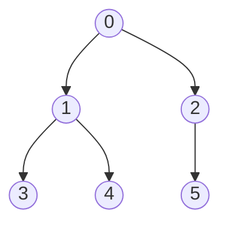
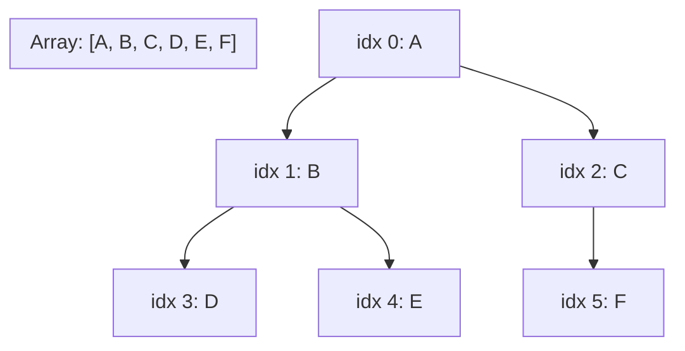

## Objetivos de Aprendizagem

- Enunciar precisamente a propriedade de árvore completa, e explicar por que é a garantia de formato que um heap mantém o tempo todo.
- Derivar as fórmulas de índice de filho e pai (`2i+1`, `2i+2`, `(i-1)//2`) a partir da propriedade de árvore completa, em vez de meramente memorizá-las.
- Explicar por que completude garante que a representação em array tem zero posições desperdiçadas, em contraste com uma árvore binária geral.
- Implementar buscas de índice filho/pai diretamente em uma lista Python comum, com verificação de limites correta.
- Comparar as trocas de memória e localidade da representação em array contra uma representação de árvore binária baseada em ponteiro (encadeada).

## Contexto e Motivação

O conceito pré-requisito `binary-trees-terminology-and-representation` introduziu duas formas de armazenar uma árvore binária: a representação encadeada (objetos Node com ponteiros `left`/`right`) e a representação implícita em array, onde um nó no índice `i` tem seus filhos em `2i+1` e `2i+2` sem nenhum ponteiro armazenado de forma alguma. Aquele conceito foi explícito de que o truque de array só vale a pena usar quando a árvore permanece próxima de *completa*, chegou a trabalhar um contraexemplo concreto, uma corrente de filhos esquerdos, onde a representação em array precisaria de aproximadamente `2^altura` posições para armazenar apenas `altura + 1` nós reais, quase todos entradas `None` desperdiçadas. Naquele momento, isso foi apresentado como um aparte: uma técnica que vale a pena conhecer, arquivada para depois, enquanto a representação encadeada permaneceu o padrão para as árvores binárias gerais e árvores binárias de busca que aquela disciplina de fato construiu.

Este conceito é onde esse aparte deixa de ser um aparte. Um heap não é uma árvore binária geral que acontece de às vezes ser completa, um heap é definido para *sempre* ser completo, como um invariante mantido, toda vez que um elemento é inserido ou removido. Essa única garantia muda o cálculo inteiramente: a única fraqueza da representação em array (posições desperdiçadas em árvores incompletas) simplesmente não pode ocorrer para um heap, porque um heap por definição nunca tem lacunas. Então a técnica que era uma curiosidade para árvores binárias gerais se torna a representação *primária e padrão* para heaps, não uma alternativa que vale a pena mencionar, mas a padrão usada em essencialmente toda implementação de heap que você vai encontrar, incluindo aquela embutida no próprio módulo `heapq` do Python e a fila de prioridade na maioria das bibliotecas padrão. A sobrecarga de ponteiro que a representação encadeada paga para todo único nó (duas referências por nó, cada uma consumindo memória e cada uma exigindo um acesso de memória de perseguição de ponteiro para seguir) é eliminada inteiramente, substituída por aritmética em um único array plano, uma mudança que importa não apenas para a pegada de memória mas para localidade de cache, já que um array plano é armazenado contiguamente e CPUs modernas leem memória contígua muito mais rápido do que perseguem ponteiros espalhados pelo heap (o heap de memória, não confundir com a estrutura de dados, uma colisão de nomenclatura infeliz mas padrão).

## Teoria Central

### A propriedade de árvore completa, precisamente

Uma árvore binária é **completa** se todo nível é inteiramente preenchido exceto possivelmente o último, e o último nível (se parcial) tem todos os seus nós empurrados o mais à esquerda possível, sem lacunas. Equivalentemente: se você numerar nós nível por nível, da esquerda para a direita, começando da raiz como posição 0, os nós de uma árvore completa ocupam exatamente as posições `0, 1, 2, ..., n-1` para alguma contagem `n`, não há posição `k < n` que esteja vazia enquanto alguma posição `> k` esteja ocupada. Esta é exatamente a garantia de formato que um heap mantém depois de toda inserção e toda extração (desenvolvida em `heap-insert-and-extract`): a árvore nunca tem um "buraco" em nenhum lugar exceto possivelmente no exato final do último nível.



Rotulando cada nó por sua posição em ordem de nível (0 a 5), esta árvore é completa: o nível 0 tem {0}, o nível 1 tem {1, 2} (cheio), e o nível 2 tem {3, 4, 5}, parcial, mas preenchido da esquerda para a direita sem lacunas, e não há posição 6 ocupada enquanto alguma posição anterior estivesse vazia.

### De completude para aritmética de índice, derivando as fórmulas, não memorizando-as

Como os nós de uma árvore completa correspondem exatamente às posições `0` até `n-1` em ordem de nível sem lacunas, é seguro armazenar o nó `k` no índice de array `k` diretamente, posição e índice de array coincidem. As fórmulas de filho/pai caem diretamente de contar quantos nós aparecem antes de um dado nível.

Considere o nó no índice `i`. Em uma árvore completa e numerada por nível, o nível `d` contém nós numerados de `2^d - 1` a `2^(d+1) - 2` (há `2^d` nós no nível `d`, e os níveis antes dele totalizam `2^d - 1` nós, então o nível `d` começa logo depois desses). Se o índice `i` está no nível `d`, sua posição *dentro* daquele nível é `i - (2^d - 1)`. Seus dois filhos ficam no nível `d+1`, que começa no índice `2^(d+1) - 1`, e, porque cada pai no nível `d` produz exatamente duas posições consecutivas no nível `d+1`, os filhos do `j`-ésimo nó no nível `d` (indexado a partir de 0 dentro do nível) ocupam as posições `2j` e `2j+1` dentro do nível `d+1`. Substituindo `j = i - (2^d - 1)`:

- índice do filho esquerdo = `(2^(d+1) - 1) + 2(i - (2^d - 1)) = 2^(d+1) - 1 + 2i - 2^(d+1) + 2 = 2i + 1`
- índice do filho direito = índice do filho esquerdo + 1 = `2i + 2`

Rodando a mesma relação ao contrário, dado um filho no índice `i`, qual pai o produziu? Um índice de filho é sempre ou `2p+1` ou `2p+2` para seu pai `p`. Resolvendo ambos para `p`: se `i = 2p+1`, então `p = (i-1)/2`; se `i = 2p+2`, então `p = (i-2)/2 = (i-1)/2 - 0.5`, que arredonda para baixo ao mesmo inteiro sob divisão de piso de qualquer forma. Então para qualquer `i > 0`:

- índice do pai = `(i - 1) // 2` (divisão inteira/de piso)

Essas três fórmulas, filho de `i` em `2i+1` e `2i+2`, pai de `i` em `(i-1)//2`, não são convenções arbitrárias para memorizar; são a consequência aritmética direta de uma numeração em ordem de nível aplicada a uma árvore garantida completa. Se a árvore *não* fosse garantida completa, essa aritmética quebraria silenciosamente: o índice `2i+1` poderia não corresponder a um filho esquerdo real de forma alguma, mas a algum nó não relacionado vários níveis distantes, porque lacunas anteriores no array desviariam a correspondência em ordem de nível inteiramente. Completude não é um bônus para essa representação, é a suposição estrutural da qual todo o esquema depende.



Lendo a aritmética a partir deste diagrama: o nó A (índice 0) tem filhos em `2(0)+1=1` e `2(0)+2=2`, B e C, correspondendo à imagem. O nó B (índice 1) tem filhos em `2(1)+1=3` e `2(1)+2=4`, D e E. O nó C (índice 2) teria filhos em `2(2)+1=5` e `2(2)+2=6`; o índice 5 existe (F), o índice 6 não (comprimento de array 6), consistente com C tendo apenas um filho no diagrama. O pai de D: `(3-1)//2 = 1`, índice 1, que é B. ✓.

### Zero espaço desperdiçado, e nenhuma sobrecarga de ponteiro

Porque os `n` nós de uma árvore completa ocupam índices de array `0` até `n-1` sem nenhuma lacuna de forma alguma, a representação em array de um heap usa exatamente `n` posições de array para `n` elementos, nunca mais. Compare isso com a representação encadeada, onde cada um dos `n` nós precisa de seu próprio objeto mais duas referências (`left`, `right`), significando aproximadamente `3n` palavras de memória (uma para o valor, duas para ponteiros) versus as `n` palavras da representação em array (apenas os valores, com filhos encontrados por aritmética em vez de por armazenar um ponteiro). Além da memória bruta, a representação em array também é mais amigável ao cache da CPU: um array contíguo pode ser lido em grande parte sequencialmente, e uma CPU moderna traz linhas de cache inteiras de uma vez, então índices próximos frequentemente já estão em cache, enquanto uma estrutura encadeada espalha seus nós através de qualquer memória que o alocador aconteceu de entregar, transformando toda desreferência `.left` ou `.right` em um potencial cache miss. Isso é precisamente por que o conceito anterior sinalizou essa técnica como "compacta e amigável ao cache" especificamente para árvores completas, e por que se torna o padrão, não meramente uma opção, uma vez que completude é um invariante garantido em vez de uma coincidência.

## Exemplos Resolvidos

### Exemplo 1 — implementando buscas filho/pai diretamente em uma lista Python

**Problema:** Dado um heap armazenado como uma lista Python comum, escreva as três funções de índice e use-as para navegar.

```python
heap = [90, 70, 80, 30, 60, 75, 20]

def left(i):
    return 2 * i + 1

def right(i):
    return 2 * i + 2

def parent(i):
    return (i - 1) // 2

# Navegando a partir da raiz:
print(heap[0])                      # 90 — a raiz
print(heap[left(0)], heap[right(0)])  # 70 80 — os dois filhos da raiz
print(heap[left(1)], heap[right(1)])  # 30 60 — os dois filhos do índice 1 (70)
print(heap[parent(6)])              # heap[2] = 80 — o pai do índice 6 (20)
```

Limites importam aqui: `left(i)` ou `right(i)` pode calcular um índice que é `>= len(heap)`, significando que aquela posição de filho simplesmente não existe (este nó é uma folha, ou tem apenas um filho). Qualquer código percorrendo filhos deve verificar `left(i) < len(heap)` antes de indexar, isso é exatamente análogo a verificar `None` na representação encadeada, apenas expresso como uma verificação de limite em vez de uma verificação nula.

### Exemplo 2 — encontrando todas as folhas e todos os nós internos apenas por índice

**Problema:** Para um heap de comprimento `n = 10`, quais índices são folhas (sem filhos), e quais são internos (têm pelo menos um filho), usando apenas aritmética, sem travessia?

**Raciocínio.** Um índice `i` é uma folha exatamente quando `left(i) = 2i+1 >= n`, ou seja, `i >= (n-1)/2`. Para `n = 10`: `(n-1)/2 = 4,5`, então qualquer índice `i >= 4,5`, significando `i` em `{5, 6, 7, 8, 9}`, é uma folha, cinco índices de folha. Os índices `{0, 1, 2, 3, 4}` são internos (cada um tem pelo menos um filho esquerdo, já que `2(4)+1 = 9 < 10`).

```python
n = 10
leaves = [i for i in range(n) if 2*i+1 >= n]
internal = [i for i in range(n) if 2*i+1 < n]
print(leaves)    # [5, 6, 7, 8, 9]
print(internal)  # [0, 1, 2, 3, 4]
```

Esse raciocínio apenas-por-índice, sem precisar percorrer a estrutura para saber quais nós são folhas, é um retorno direto da aritmética da representação em array: a mesma pergunta em uma árvore encadeada exigiria de fato visitar cada nó e verificar se `left is None and right is None`.

### Exemplo 3 — por que as fórmulas falham silenciosamente em uma árvore não completa

**Problema:** Suponha que alguém armazene uma árvore binária não completa em um array simplesmente pulando nós ausentes, por exemplo, representando "raiz com apenas um filho direito, cujo filho direito tem apenas um filho esquerdo" como `[R, C1, C2]` (omitindo o filho esquerdo ausente de R inteiramente, em vez de usar `None` como um espaço reservado). Mostre que a aritmética de índice de filho dá respostas erradas.

**Raciocínio.** Com `R` no índice 0, a fórmula diz que seus filhos vivem nos índices 1 e 2, mas pelo formato real da árvore, o índice 1 neste array comprimido é destinado a representar o filho *direito* de `R` (não há filho esquerdo), e o índice 2 é destinado a representar o filho *esquerdo* daquele filho direito. A fórmula `left(0) = 1` reportaria incorretamente `C1` (que na verdade é o filho direito de `R`) como o filho esquerdo de `R`, e reportaria nada no índice 2 como pertencente a `R` de forma alguma (quando de fato `C2` está dois níveis abaixo, não um).

```python
# Abordagem correta: use None como um espaço reservado explícito para toda posição ausente,
# preservando a correspondência em ordem de nível da qual a aritmética depende.
tree = [None] * 7          # espaço para raiz + 2 filhos + 4 netos
tree[0] = "R"
tree[2] = "C1"             # filho direito de R no índice 2, esquerdo (índice 1) permanece None
tree[5] = "C2"             # filho esquerdo de C1 no índice 2*2+1 = 5
print(tree)  # ['R', None, 'C1', None, None, 'C2', None]
```

A lição: a aritmética da representação em array só está correta quando toda posição em ordem de nível é contabilizada, ocupada ou explicitamente marcada vazia, compactar silenciosamente o array pulando nós ausentes (como a primeira tentativa errada fez) quebra a correspondência de índice inteiramente. Isso não é um problema para heaps especificamente, precisamente porque completude garante que nunca há lacunas para acidentalmente compactar.

## Equívocos Comuns e Armadilhas

- **"A representação em array funciona para qualquer árvore binária, não apenas completas, você só pula os nós ausentes."** O Exemplo 3 mostra exatamente por que isso falha: pular nós ausentes para compactar o array destrói a correspondência em ordem de nível da qual as fórmulas de filho/pai dependem. A representação em array é sem perdas e sem lacunas *apenas* quando a árvore é completa (ou explicitamente preenchida com espaços reservados para posições ausentes, o que reintroduz o espaço desperdiçado que a técnica pretendia evitar).
- **"Aritmética de índice é apenas um truque conveniente; a estrutura de árvore subjacente é de alguma forma diferente de uma árvore encadeada do mesmo formato."** São a árvore idêntica, mesmas relações pai-filho, mesmo formato, diferindo apenas em *como* esse formato é registrado na memória (aritmética vs. ponteiros explícitos). Qualquer coisa verdadeira sobre a estrutura da árvore (sua altura, quais nós são folhas, caminhos raiz-a-folha) é calculada identicamente de qualquer forma; apenas a mecânica de "como encontro o filho deste nó" difere.
- **"Já que indexação de array baseada em 1 torna as fórmulas mais bonitas (filhos de `i` em `2i` e `2i+1`, pai em `i//2`), indexação baseada em 0 é apenas um inconveniente de implementação arbitrário."** Ambas as convenções são igualmente válidas e igualmente derivadas do mesmo argumento em ordem de nível, indexação baseada em 1 desloca toda posição por um, o que acontece de tornar as fórmulas marginalmente mais limpas, mas listas do Python são baseadas em 0 por convenção, então `2i+1`/`2i+2`/`(i-1)//2` é a versão que corresponde à indexação da linguagem em vez de um compromisso inferior.
- **"A fórmula de índice de pai de um nó, `(i-1)//2`, precisa de um caso especial dependendo de se `i` é par ou ímpar."** Não precisa, divisão de piso inteira já colapsa ambos os casos (`i = 2p+1` dando `p` exatamente, e `i = 2p+2` dando `(2p+1)//2 = p` depois de arredondar para baixo) em uma única fórmula `(i-1)//2` para qualquer `i > 0`; introduzir um ramo manual par/ímpar é desnecessário e uma fonte comum de bugs de off-by-one.

## Resumo

A representação em array de um heap só é sem perdas porque um heap mantém completude como um invariante, todo nível cheio exceto possivelmente o último, preenchido estritamente da esquerda para a direita sem lacunas, o que permite que o nó `k` em ordem de nível corresponda exatamente ao índice de array `k`, sem espaços reservados necessários. A partir dessa correspondência, as fórmulas de índice filho/pai (`2i+1`, `2i+2` para filhos; `(i-1)//2` para pai) caem diretamente contando quantos nós precedem um dado nível, em vez de serem regras arbitrárias para memorizar. Comparada a uma árvore encadeada baseada em ponteiro, a representação em array usa exatamente `n` posições para `n` valores com zero sobrecarga de ponteiro, e seu layout contíguo é mais amigável ao comportamento de cache da CPU, vantagens que se mantêm especificamente porque completude é garantida, não incidental, que é precisamente a conexão que este conceito traça de volta à breve menção de arrays implícitos em `binary-trees-terminology-and-representation`, onde a mesma técnica foi notada mas ainda não estrutural.

## Documentation Links

- [MIT 6.006 — Lecture Notes (OCW)](https://ocw.mit.edu/courses/6-006-introduction-to-algorithms-spring-2020/pages/lecture-notes/) — doc
- [Sedgewick & Wayne — Algorithms Lectures (Princeton)](https://algs4.cs.princeton.edu/lectures/) — doc
