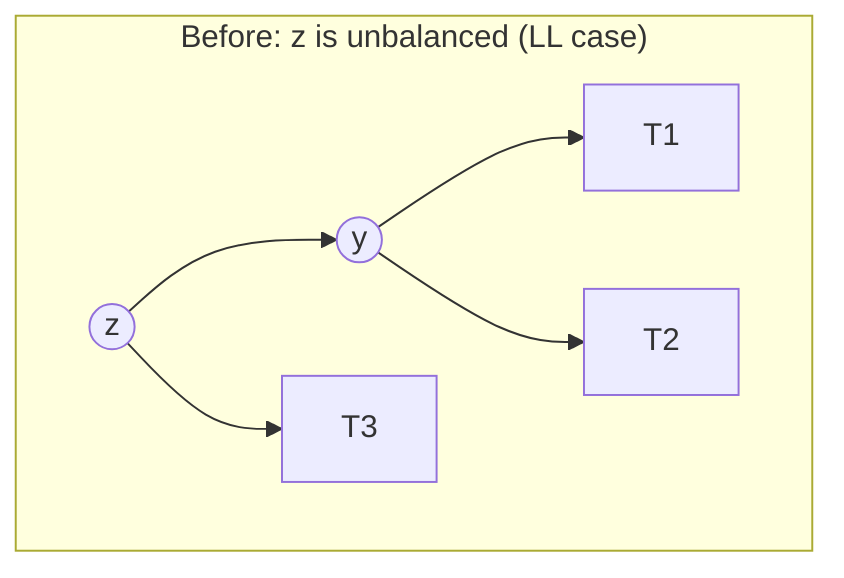
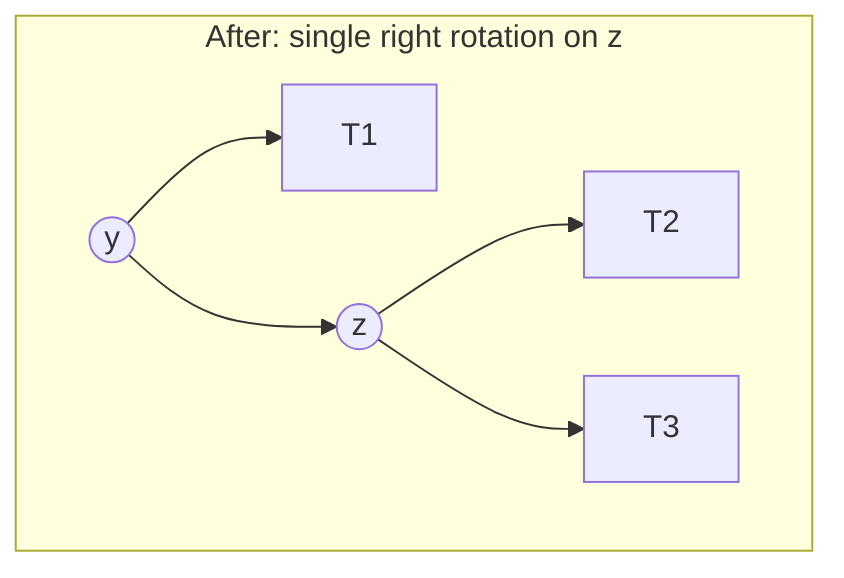
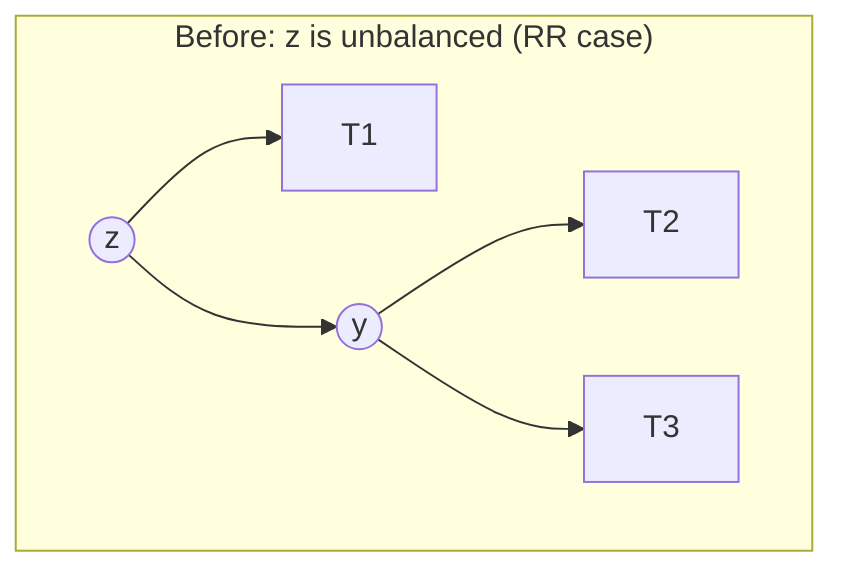
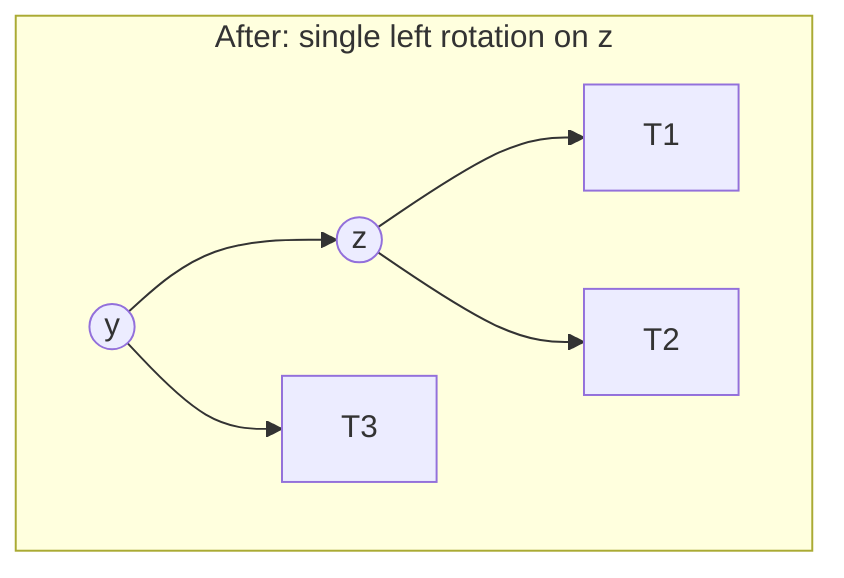
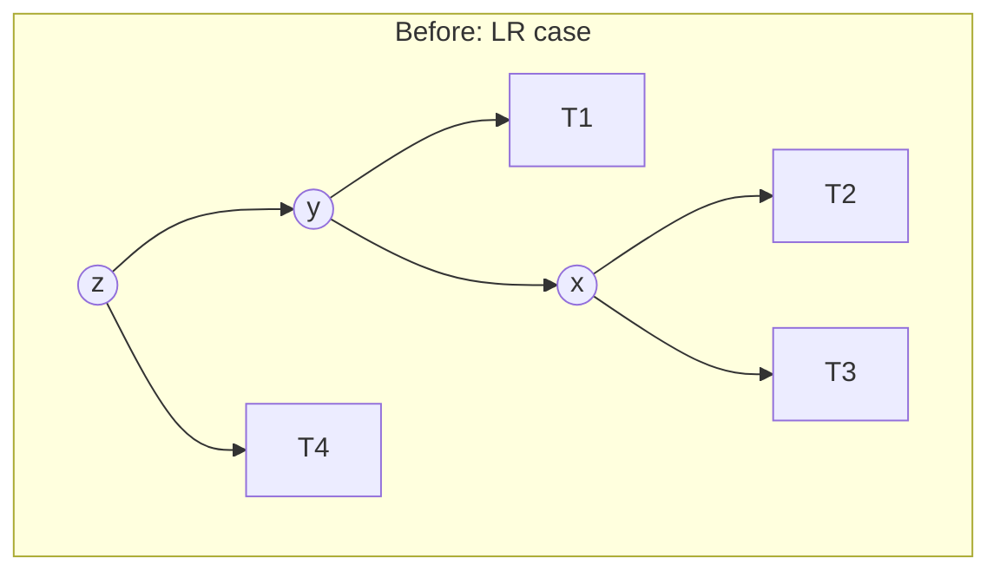
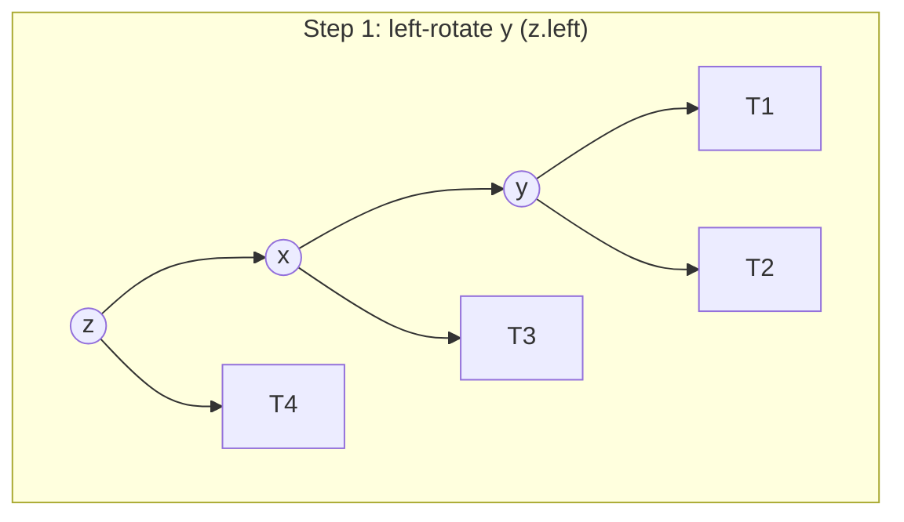
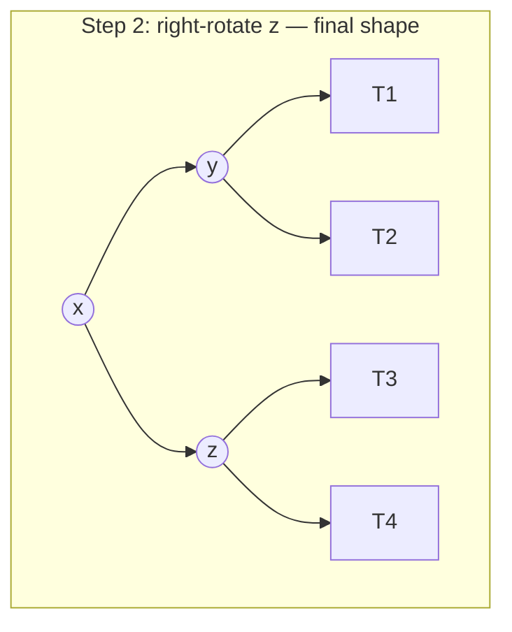
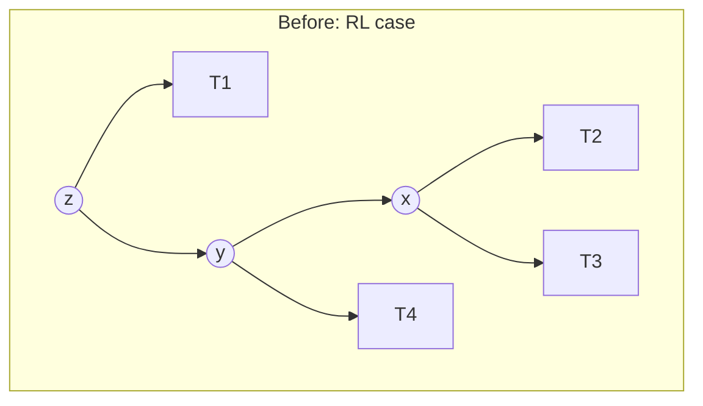
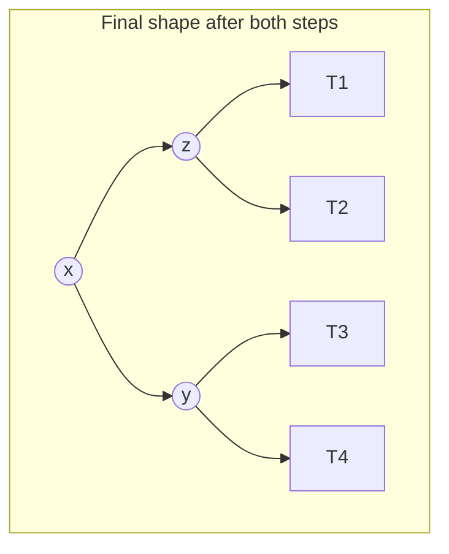
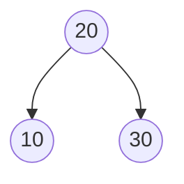

## Learning Objectives

- Explain what a rotation does at the pointer level: a constant number of parent/child link reassignments that change which node is locally "on top," without disturbing the BST ordering of any value.
- Given an unbalanced node, determine which of the four cases (LL, RR, LR, RL) applies by inspecting the balance factor of the unbalanced node and its taller child.
- Perform a single right rotation and a single left rotation by hand, explicitly relabeling every subtree pointer involved.
- Perform a double rotation (left-right and right-left) as two single rotations composed, explicitly relabeling every subtree pointer at each step.
- State why a rotation runs in O(1) time and why at most one rotation is ever needed to restore balance after a single insertion.

## Context & Motivation

The previous concept made the AVL invariant precise — every node's balance factor must lie in {−1, 0, 1} — and proved, via the Fibonacci-recurrence argument, that maintaining this invariant everywhere forces the whole tree's height to stay O(log n). What it did not yet explain is *how* the invariant gets restored the moment an insertion or deletion pushes some node's balance factor to ±2. That mechanism is a **rotation**: a small, local, constant-time restructuring of three or four nodes around a single edge, and it is the mechanical heart of this entire discipline — not just for AVL trees, but, in a related form, for red-black trees two concepts from now as well.

This concept is deliberately the most exhaustively mechanical one in the discipline, and that is by design: rotations are exactly the kind of operation where a hand-wavy verbal description ("shift some nodes around to fix the balance") hides real subtlety about which pointer points where, and getting even one pointer wrong silently corrupts the BST property. The only way to actually own this material is to walk through every one of the four cases — LL, RR, LR, RL — with concrete before/after pictures and explicit pointer reassignment, which is exactly what this concept does. Once this mechanism is fully in hand, the next concept (red-black trees) can afford to treat rebalancing at a more conceptual level, precisely because the detailed case analysis that would otherwise be needed there has already been done here.

## Core Theory

### What a rotation does, in general terms

A **rotation** takes a locally unbalanced node z and one of its children y (the one on the taller side) and swaps their roles: y becomes the new local root of that subtree, and z becomes one of y's children. Exactly one subtree — the one "in between" z and y in the in-order sequence — has to be relocated from being a child of y to being a child of z, or vice versa. Every other subtree involved keeps the same parent-relationship shape it had before, just reattached under the new arrangement. Crucially, a rotation only ever touches a fixed, small number of pointers (four or five, depending on the case) — it never walks into or copies any of the subtrees themselves, which is exactly why a rotation costs O(1) time regardless of how large the subtrees involved happen to be.

The property that makes this safe is that a rotation **never changes the in-order sequence of values** in the tree — it only changes which nodes are ancestors of which. Since the BST invariant is entirely a statement about in-order sequence (everything to the left of a node is smaller, everything to the right is larger), and a rotation preserves that sequence exactly, the tree remains a valid BST after any rotation, no exceptions.

### Single right rotation (fixes the LL case)

Suppose node z has balance factor +2 (left subtree too tall), and z's left child y has balance factor ≥ 0 (y's own left side is the taller or equal one) — this is the **LL case**, so named because the imbalance was created by inserting into the left subtree of the left child.



A **single right rotation** on z fixes this: y takes z's place as the local root, z becomes y's right child, and T2 (which was y's right subtree) is reassigned as z's new left subtree — it is the only subtree that has to move.



In code, with `z` the unbalanced node:

```python
def rotate_right(z):
    y = z.left
    T2 = y.right          # the one subtree that must move
    y.right = z           # z becomes y's right child
    z.left = T2           # T2 becomes z's new left child
    update_height(z)      # z's height must be recomputed first — it's now lower in the tree
    update_height(y)      # then y's, since it depends on z's new height
    return y               # y is the new local root; caller must re-attach it above
```

Note the order: `update_height(z)` must run before `update_height(y)`, because y's height now depends on z's (newly reduced) height — updating in the wrong order would compute y's height from a stale value.

### Single left rotation (fixes the RR case)

The exact mirror image: z has balance factor −2 (right subtree too tall), and z's right child y has balance factor ≤ 0 — the **RR case**.





```python
def rotate_left(z):
    y = z.right
    T2 = y.left            # the one subtree that must move
    y.left = z             # z becomes y's left child
    z.right = T2           # T2 becomes z's new right child
    update_height(z)
    update_height(y)
    return y
```

### Double rotation: left-right (fixes the LR case)

Suppose z has balance factor +2, but this time z's left child y has balance factor < 0 — y's *right* side is the taller one. A single right rotation on z alone would not fix this (it would just relocate the imbalance rather than remove it), because the extra height is buried inside y's right subtree, not y's left. The fix is two rotations in sequence: first rotate y itself to the **left**, which pulls y's tall right child x up into y's old position; then rotate z to the **right**, exactly as in the single-rotation case, now that the tall subtree has been repositioned correctly.







x ends up as the new local root, with y and z as its two children — a genuinely different final shape from either single-rotation case, since here it is the *grandchild* x, not the child y, that ends up on top.

```python
def rotate_left_right(z):
    z.left = rotate_left(z.left)   # step 1: fix the "inner" tilt of y first
    return rotate_right(z)          # step 2: now a plain single rotation resolves z
```

### Double rotation: right-left (fixes the RL case)

The mirror image again: z has balance factor −2, and z's right child y has balance factor > 0 (y's *left* side is the taller one). First rotate y to the **right**, then rotate z to the **left**.





```python
def rotate_right_left(z):
    z.right = rotate_right(z.right)  # step 1: fix the "inner" tilt of y first
    return rotate_left(z)             # step 2: now a plain single rotation resolves z
```

### Choosing which of the four cases applies

After an insertion, walk back up from the newly inserted node toward the root, updating each ancestor's height as you go. The moment an ancestor z is found with balance factor +2 or −2, stop and classify it using only z and its taller child y:

```python
def rebalance(z):
    update_height(z)
    bf = balance_factor(z)
    if bf > 1:                        # left-heavy
        if balance_factor(z.left) < 0:
            return rotate_left_right(z)   # LR case
        else:
            return rotate_right(z)        # LL case
    if bf < -1:                       # right-heavy
        if balance_factor(z.right) > 0:
            return rotate_right_left(z)   # RL case
        else:
            return rotate_left(z)         # RR case
    return z                           # already balanced, nothing to do
```

Only two pieces of information decide the case: the sign of z's own balance factor (which side is too tall) and the sign of the taller child's balance factor (which side of *that* child is too tall) — never the depth of the imbalance or the size of the subtrees involved.

### How many rotations does a single insertion need?

A genuinely useful fact, provable by checking that a rotation always restores the pre-insertion height of the affected subtree exactly: after inserting one value into an AVL tree, **at most one rotation (single or double) is ever needed** to restore the invariant across the *entire* tree, no matter how deep the tree is. This is because a rotation, once applied at the lowest unbalanced ancestor, restores that subtree's height to exactly what it was before the insertion — so no ancestor further up ever sees a changed height, and no further rotation is triggered. Deletion does not share this property — removing a node can require rebalancing at every level from the deletion point up to the root, in the worst case O(log n) rotations — but that asymmetry does not change the overall O(log n) time bound for either operation, since each individual rotation is O(1) and there are at most O(log n) ancestors to check either way.

## Worked Examples

### Example 1 — a single rotation, LL case, built from three insertions

**Problem:** Insert `30`, then `20`, then `10` into an empty AVL tree, applying rebalancing after the insertion that first creates a violation.

**Insert 30:** single node, root.

**Insert 20:** `20 < 30`, becomes 30's left child. bf(30) = height(20) − height(None) = 0 − (−1) = 1. No violation.

**Insert 10:** `10 < 30`, left to 20; `10 < 20`, becomes 20's left child. Now bf(20) = 0 − (−1) = 0 (both of 20's own children are absent/leaf — wait 20 now has left child 10, so bf(20) = height(10) − height(None) = 0 − (−1) = 1, fine). Check bf(30): height(20) is now 1 (since 20 has child 10), height(None) on the right is −1, so bf(30) = 1 − (−1) = 2. **Violation at z = 30.**

Classify: z = 30, bf(z) = +2 (left-heavy). y = z.left = 20, bf(y) = +1 (≥ 0) → **LL case**, single right rotation on 30.

Applying `rotate_right(30)`: y = 20, T2 = y.right = None. y.right = z (30). z.left = T2 (None). Result: 20 is the new root, with left child 10 and right child 30.



In-order traversal before the rotation (10, 20, 30, read by walking the chain 30→20→10 in-order) and after (10, 20, 30, read from the new tree) are identical — confirming the rotation changed only shape, not sequence.

### Example 2 — a double rotation, LR case, built from three insertions

**Problem:** Insert `30`, then `10`, then `20`.

**Insert 30:** root. **Insert 10:** `10 < 30`, left child of 30. **Insert 20:** `20 < 30`, left to 10; `20 > 10`, becomes 10's *right* child.

Check bf(10): height(None) − height(20) = −1 − 0 = −1, fine. Check bf(30): height(10) = 1 (since 10 now has a child) vs height(None) = −1, bf(30) = 1 − (−1) = 2. **Violation at z = 30.**

Classify: bf(z=30) = +2 (left-heavy). y = z.left = 10, bf(y) = height(None) − height(20) = −1 − 0 = −1 (< 0) → **LR case**.

**Step 1 — left-rotate y (=10):** x = y.right = 20. T2 = x.left = None. x.left = y (10). y.right = T2 (None). Now the subtree that was rooted at 10 is rooted at 20, with 10 as its left child. Attach this back: z.left = 20.

**Step 2 — right-rotate z (=30):** y = z.left = 20 (the node just promoted). T2 = y.right = None. y.right = z (30). z.left = T2 (None).

Final: 20 is the new root, left child 10, right child 30.


This is the identical final shape as Example 1, even though the insertion order (30, 10, 20 here versus 30, 20, 10 there) and the case triggered (LR versus LL) were both different — a reminder that for any three values, there is really only one balanced arrangement (the median on top, the smaller and larger values as its two children), and every rotation case is just a different route to reaching it depending on the order of arrival.

### Example 3 — a rotation deep inside a larger tree, and why no further rotation is needed above it

**Problem:** Suppose node `20` is a left child several levels below the root of some larger AVL tree, and `20`'s own subtree currently has left child `10` (height 0) and right child `30` (height 0) — a locally balanced 3-node subtree of height 1. A new value, `5`, is inserted, landing as the left child of `10`. Show the local rebalancing and explain why no ancestor above `20` needs to rotate.

**Before insertion:** subtree rooted at 20, height 1 (bf(20) = 0). Whatever `20`'s height contributes to its parent's balance factor higher up, it is currently contributing height 1.

**After inserting 5:** 10 now has a left child (5), so height(10) becomes 1. bf(20) = height(10) − height(30) = 1 − 0 = 1 — no violation yet at 20 itself. But suppose the insertion actually happened one level further down such that it is `10`'s balance factor, not `20`'s, that first goes to ±2 (e.g., if 10 already had a left-heavy shape before 5 arrived) — a rotation restores balance at that lower point, and the *height of the subtree rooted at 20 after the rotation is exactly what it was before the insertion* (height 1, the same as when 20 had children 10 and 30 both as simple leaves).

**Why this matters going up the tree:** any ancestor P of 20 computed its own balance factor using height(20) = 1 before the insertion. Since the rotation restores height(20) to exactly 1 after fixing the local violation, P's balance factor is completely unaffected by the whole episode — P never even needs to check, let alone rotate. This is the concrete mechanism behind the "at most one rotation per insertion" fact from Core Theory: the rotation doesn't just fix the local problem, it erases all evidence (in terms of height) that anything happened, as far as the rest of the tree above it is concerned.

## Common Misconceptions & Pitfalls

- **"A rotation changes which values are stored, or their relative order."** It does not — Example 1 explicitly checks that in-order traversal is unchanged before and after. A rotation only ever changes *ancestor/descendant* relationships among existing nodes; every value's position relative to every other value (which is smaller, which is larger) is completely preserved, which is exactly why the result is still a valid BST.
- **"A rotation is an O(log n) or O(n) operation, since it 'restructures' the tree."** A rotation reassigns a fixed, small number of pointers (four in a single rotation, more if you count both steps of a double rotation) and never traverses into any of the subtrees it relocates — T1, T2, T3 (and T4, for the double-rotation cases) move by reference, as whole units, in O(1) time regardless of their internal size.
- **"Whether to use a single or double rotation depends on how deep the imbalance is, or how large the subtrees are."** It depends on exactly one thing: the sign of the balance factor of the unbalanced node's taller child (Core Theory's `rebalance` function checks only `balance_factor(z.left)` or `balance_factor(z.right)`, nothing about depth or size).
- **"Left rotation and right rotation are interchangeable names for the same operation."** They are mirror images, not synonyms, and picking the wrong one for a given case does not "sort of" fix the imbalance — it either does nothing useful or actively creates a violation somewhere else. A right rotation is used precisely when the *left* subtree is too tall (it promotes the left child upward, rotating the excess weight to the right); a left rotation is the reverse.
- **"After every insertion, you need to check and potentially rotate at every ancestor up to the root."** As Example 3 and the closing fact of Core Theory show, at most one rotation is ever needed for an insertion — once it fires, the affected subtree's height is restored to its pre-insertion value, and every ancestor above it sees no change at all. (Deletion is the exception where multiple rotations up the path really can be needed — a genuine asymmetry between the two operations worth remembering.)

## Summary

A rotation is a constant-time, purely local restructuring of three or four nodes around a single edge that changes which node is the local subtree root while leaving the tree's in-order sequence — and therefore its validity as a BST — completely unchanged. There are exactly four cases, determined by the balance factor of the unbalanced node z and its taller child y: **LL** (z left-heavy, y left-heavy or balanced) fixed by a single right rotation; **RR** (mirror) fixed by a single left rotation; **LR** (z left-heavy, y right-heavy) fixed by a left rotation on y followed by a right rotation on z; **RL** (mirror) fixed by a right rotation on y followed by a left rotation on z. Each rotation touches only a fixed number of pointers, independent of subtree size, and after an insertion at most one such rotation (single or double) is ever needed anywhere in the tree, because a rotation restores the affected subtree's exact pre-insertion height. With this mechanism fully in hand, the next concept can introduce red-black trees' rebalancing at a more conceptual level, leaning on the detailed pointer-level case analysis already done here.

## Documentation Links

- [MIT 6.006 — Lecture Notes (OCW)](https://ocw.mit.edu/courses/6-006-introduction-to-algorithms-spring-2020/pages/lecture-notes/) — doc
- [MIT 6.006 — Syllabus (OCW)](https://ocw.mit.edu/courses/6-006-introduction-to-algorithms-spring-2020/pages/syllabus/) — doc
