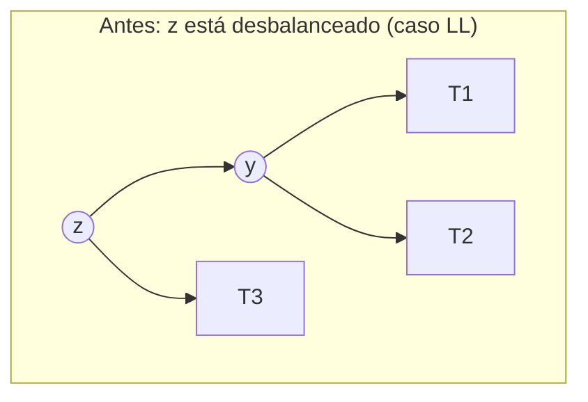
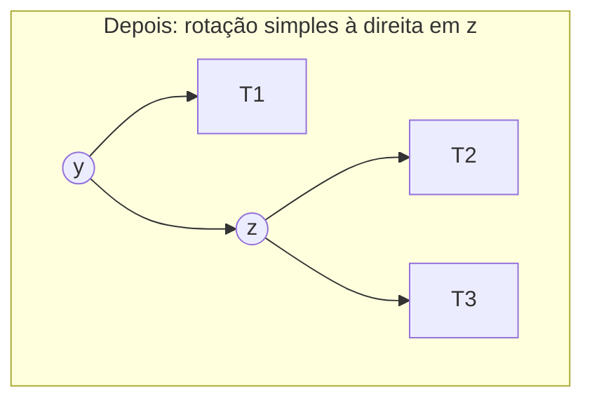
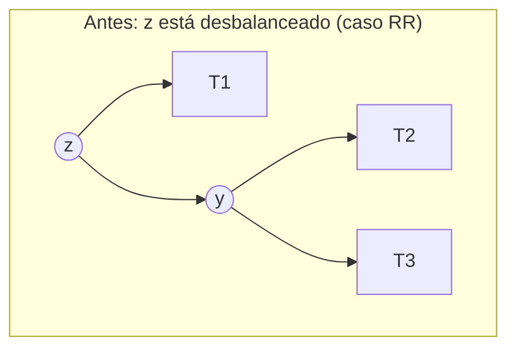
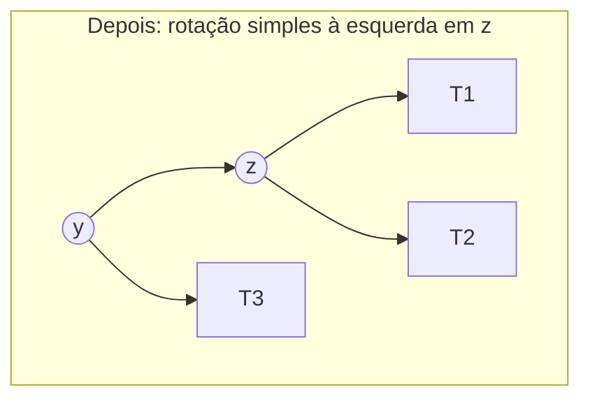
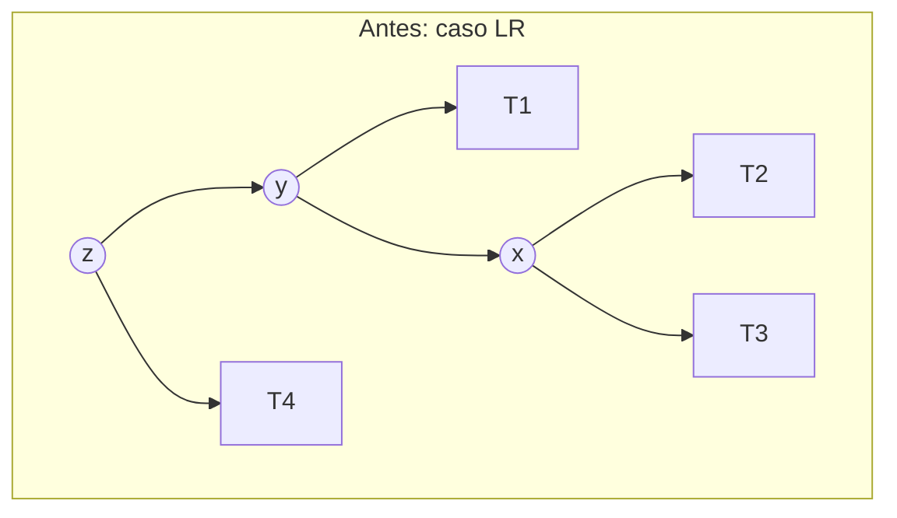
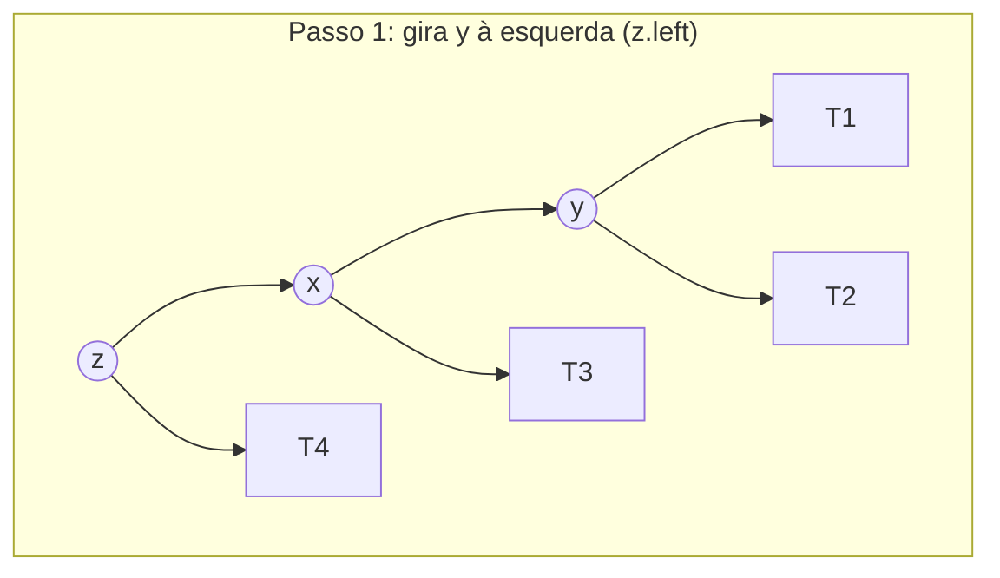
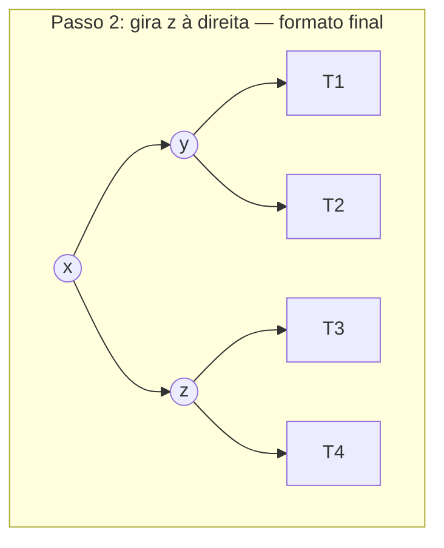
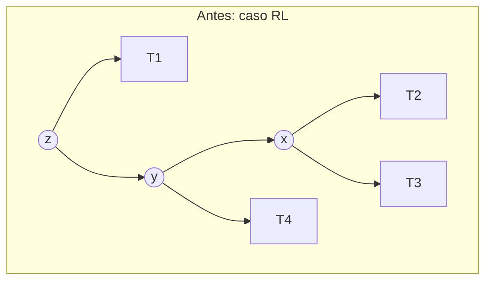
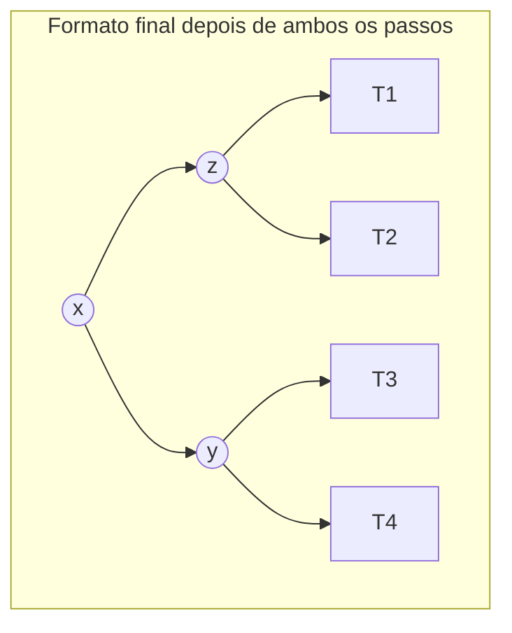
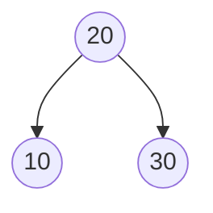

## Objetivos de Aprendizagem

- Explicar o que uma rotação faz no nível de ponteiro: um número constante de reatribuições de link pai/filho que mudam qual nó está localmente "no topo," sem perturbar a ordenação BST de nenhum valor.
- Dado um nó desbalanceado, determinar qual dos quatro casos (LL, RR, LR, RL) se aplica inspecionando o fator de balanceamento do nó desbalanceado e de seu filho mais alto.
- Realizar uma única rotação à direita e uma única rotação à esquerda à mão, reetiquetando explicitamente todo ponteiro de subárvore envolvido.
- Realizar uma rotação dupla (esquerda-direita e direita-esquerda) como duas rotações únicas compostas, reetiquetando explicitamente todo ponteiro de subárvore em cada passo.
- Enunciar por que uma rotação roda em tempo O(1) e por que no máximo uma rotação é jamais necessária para restaurar balanceamento depois de uma única inserção.

## Contexto e Motivação

O conceito anterior tornou o invariante AVL preciso, o fator de balanceamento de todo nó deve estar em {−1, 0, 1}, e provou, via o argumento da recorrência de Fibonacci, que manter esse invariante em todo lugar força a altura da árvore inteira a permanecer O(log n). O que ainda não explicou é *como* o invariante é restaurado no momento em que uma inserção ou remoção empurra o fator de balanceamento de algum nó para ±2. Esse mecanismo é uma **rotação**: uma reestruturação pequena, local, e de tempo constante de três ou quatro nós em torno de uma única aresta, e é o coração mecânico de toda esta disciplina, não apenas para árvores AVL, mas, em uma forma relacionada, para árvores rubro-negras dois conceitos daqui também.

Este conceito é deliberadamente o mais exaustivamente mecânico da disciplina, e isso é por design: rotações são exatamente o tipo de operação onde uma descrição verbal vaga ("mude alguns nós para consertar o balanceamento") esconde sutileza real sobre qual ponteiro aponta para onde, e errar mesmo um ponteiro silenciosamente corrompe a propriedade BST. A única forma de de fato dominar esse material é percorrer cada um dos quatro casos, LL, RR, LR, RL, com imagens concretas de antes/depois e reatribuição explícita de ponteiro, que é exatamente o que este conceito faz. Uma vez que esse mecanismo está completamente em mãos, o próximo conceito (árvores rubro-negras) pode se dar ao luxo de tratar rebalanceamento em um nível mais conceitual, precisamente porque a análise de caso detalhada que de outra forma seria necessária ali já foi feita aqui.

## Teoria Central

### O que uma rotação faz, em termos gerais

Uma **rotação** pega um nó localmente desbalanceado z e um de seus filhos y (aquele do lado mais alto) e troca seus papéis: y se torna a nova raiz local daquela subárvore, e z se torna um dos filhos de y. Exatamente uma subárvore, aquela "entre" z e y na sequência em ordem, precisa ser realocada de ser filha de y para ser filha de z, ou vice-versa. Toda outra subárvore envolvida mantém a mesma forma de relação pai-filho que tinha antes, apenas reanexada sob o novo arranjo. Crucialmente, uma rotação sempre toca apenas um número fixo e pequeno de ponteiros (quatro ou cinco, dependendo do caso), ela nunca entra ou copia nenhuma das próprias subárvores, que é exatamente por que uma rotação custa tempo O(1) independentemente de quão grandes as subárvores envolvidas aconteçam de ser.

A propriedade que torna isso seguro é que uma rotação **nunca muda a sequência em ordem de valores** na árvore, ela apenas muda quais nós são ancestrais de quais. Como o invariante BST é inteiramente uma afirmação sobre sequência em ordem (tudo à esquerda de um nó é menor, tudo à direita é maior), e uma rotação preserva essa sequência exatamente, a árvore permanece uma BST válida depois de qualquer rotação, sem exceções.

### Rotação simples à direita (conserta o caso LL)

Suponha que o nó z tem fator de balanceamento +2 (subárvore esquerda alta demais), e o filho esquerdo y de z tem fator de balanceamento ≥ 0 (o próprio lado esquerdo de y é o mais alto ou igual), este é o **caso LL**, assim nomeado porque o desequilíbrio foi criado inserindo na subárvore esquerda do filho esquerdo.



Uma **rotação simples à direita** em z conserta isso: y toma o lugar de z como a raiz local, z se torna o filho direito de y, e T2 (que era a subárvore direita de y) é reatribuída como a nova subárvore esquerda de z, é a única subárvore que precisa se mover.



Em código, com `z` o nó desbalanceado:

```python
def rotate_right(z):
    y = z.left
    T2 = y.right          # a única subárvore que deve se mover
    y.right = z           # z se torna o filho direito de y
    z.left = T2           # T2 se torna o novo filho esquerdo de z
    update_height(z)      # a altura de z deve ser recalculada primeiro — agora está mais baixa na árvore
    update_height(y)      # depois a de y, já que depende da nova altura de z
    return y               # y é a nova raiz local; quem chamou deve reanexá-la acima
```

Note a ordem: `update_height(z)` deve rodar antes de `update_height(y)`, porque a altura de y agora depende da altura (recém-reduzida) de z, atualizar na ordem errada calcularia a altura de y a partir de um valor obsoleto.

### Rotação simples à esquerda (conserta o caso RR)

A imagem espelhada exata: z tem fator de balanceamento −2 (subárvore direita alta demais), e o filho direito y de z tem fator de balanceamento ≤ 0, o **caso RR**.





```python
def rotate_left(z):
    y = z.right
    T2 = y.left            # a única subárvore que deve se mover
    y.left = z             # z se torna o filho esquerdo de y
    z.right = T2           # T2 se torna o novo filho direito de z
    update_height(z)
    update_height(y)
    return y
```

### Rotação dupla: esquerda-direita (conserta o caso LR)

Suponha que z tem fator de balanceamento +2, mas dessa vez o filho esquerdo y de z tem fator de balanceamento < 0, o lado *direito* de y é o mais alto. Uma única rotação à direita em z sozinha não consertaria isso (apenas realocaria o desequilíbrio em vez de removê-lo), porque a altura extra está enterrada dentro da subárvore direita de y, não a esquerda de y. O conserto é duas rotações em sequência: primeiro gire o próprio y para a **esquerda**, o que puxa o alto filho direito x de y para cima na antiga posição de y; depois gire z para a **direita**, exatamente como no caso de rotação simples, agora que a subárvore alta foi reposicionada corretamente.







x acaba como a nova raiz local, com y e z como seus dois filhos, um formato final genuinamente diferente de qualquer caso de rotação simples, já que aqui é o *neto* x, não o filho y, que acaba no topo.

```python
def rotate_left_right(z):
    z.left = rotate_left(z.left)   # passo 1: conserta a inclinação "interna" de y primeiro
    return rotate_right(z)          # passo 2: agora uma rotação simples comum resolve z
```

### Rotação dupla: direita-esquerda (conserta o caso RL)

A imagem espelhada novamente: z tem fator de balanceamento −2, e o filho direito y de z tem fator de balanceamento > 0 (o lado *esquerdo* de y é o mais alto). Primeiro gire y para a **direita**, depois gire z para a **esquerda**.





```python
def rotate_right_left(z):
    z.right = rotate_right(z.right)  # passo 1: conserta a inclinação "interna" de y primeiro
    return rotate_left(z)             # passo 2: agora uma rotação simples comum resolve z
```

### Escolhendo qual dos quatro casos se aplica

Depois de uma inserção, suba de volta a partir do nó recém-inserido em direção à raiz, atualizando a altura de cada ancestral conforme você vai. No momento em que um ancestral z é encontrado com fator de balanceamento +2 ou −2, pare e classifique-o usando apenas z e seu filho mais alto y:

```python
def rebalance(z):
    update_height(z)
    bf = balance_factor(z)
    if bf > 1:                        # pesado à esquerda
        if balance_factor(z.left) < 0:
            return rotate_left_right(z)   # caso LR
        else:
            return rotate_right(z)        # caso LL
    if bf < -1:                       # pesado à direita
        if balance_factor(z.right) > 0:
            return rotate_right_left(z)   # caso RL
        else:
            return rotate_left(z)         # caso RR
    return z                           # já balanceado, nada a fazer
```

Apenas duas informações decidem o caso: o sinal do próprio fator de balanceamento de z (qual lado está alto demais) e o sinal do fator de balanceamento do filho mais alto (qual lado *daquele* filho está alto demais), nunca a profundidade do desequilíbrio ou o tamanho das subárvores envolvidas.

### Quantas rotações uma única inserção precisa?

Um fato genuinamente útil, provável verificando que uma rotação sempre restaura a altura pré-inserção exata da subárvore afetada: depois de inserir um valor em uma árvore AVL, **no máximo uma rotação (simples ou dupla) é jamais necessária** para restaurar o invariante através da árvore *inteira*, não importa quão profunda a árvore seja. Isso é porque uma rotação, uma vez aplicada no ancestral desbalanceado mais baixo, restaura a altura daquela subárvore para exatamente o que era antes da inserção, então nenhum ancestral mais acima jamais vê uma altura mudada, e nenhuma rotação adicional é disparada. Remoção não compartilha essa propriedade, remover um nó pode exigir rebalanceamento em todo nível do ponto de remoção até a raiz, no pior caso O(log n) rotações, mas essa assimetria não muda o limite geral de tempo O(log n) para nenhuma das operações, já que cada rotação individual é O(1) e há no máximo O(log n) ancestrais para verificar de qualquer forma.

## Exemplos Resolvidos

### Exemplo 1 — uma rotação simples, caso LL, construída a partir de três inserções

**Problema:** Insira `30`, depois `20`, depois `10` em uma árvore AVL vazia, aplicando rebalanceamento depois da inserção que primeiro cria uma violação.

**Insira 30:** nó único, raiz.

**Insira 20:** `20 < 30`, se torna filho esquerdo de 30. bf(30) = altura(20) − altura(None) = 0 − (−1) = 1. Sem violação.

**Insira 10:** `10 < 30`, esquerda para 20; `10 < 20`, se torna filho esquerdo de 20. Agora bf(20) = 0 − (−1) = 0 (ambos os próprios filhos de 20 estão ausentes/folha — espere, 20 agora tem filho esquerdo 10, então bf(20) = altura(10) − altura(None) = 0 − (−1) = 1, tudo bem). Verifique bf(30): altura(20) agora é 1 (já que 20 tem filho 10), altura(None) à direita é −1, então bf(30) = 1 − (−1) = 2. **Violação em z = 30.**

Classifique: z = 30, bf(z) = +2 (pesado à esquerda). y = z.left = 20, bf(y) = +1 (≥ 0) → **caso LL**, rotação simples à direita em 30.

Aplicando `rotate_right(30)`: y = 20, T2 = y.right = None. y.right = z (30). z.left = T2 (None). Resultado: 20 é a nova raiz, com filho esquerdo 10 e filho direito 30.



A travessia em ordem antes da rotação (10, 20, 30, lida percorrendo a corrente 30→20→10 em ordem) e depois (10, 20, 30, lida da nova árvore) são idênticas, confirmando que a rotação mudou apenas formato, não sequência.

### Exemplo 2 — uma rotação dupla, caso LR, construída a partir de três inserções

**Problema:** Insira `30`, depois `10`, depois `20`.

**Insira 30:** raiz. **Insira 10:** `10 < 30`, filho esquerdo de 30. **Insira 20:** `20 < 30`, esquerda para 10; `20 > 10`, se torna filho *direito* de 10.

Verifique bf(10): altura(None) − altura(20) = −1 − 0 = −1, tudo bem. Verifique bf(30): altura(10) = 1 (já que 10 agora tem um filho) vs altura(None) = −1, bf(30) = 1 − (−1) = 2. **Violação em z = 30.**

Classifique: bf(z=30) = +2 (pesado à esquerda). y = z.left = 10, bf(y) = altura(None) − altura(20) = −1 − 0 = −1 (< 0) → **caso LR**.

**Passo 1 — gire y (=10) à esquerda:** x = y.right = 20. T2 = x.left = None. x.left = y (10). y.right = T2 (None). Agora a subárvore que estava enraizada em 10 está enraizada em 20, com 10 como seu filho esquerdo. Reanexe isso: z.left = 20.

**Passo 2 — gire z (=30) à direita:** y = z.left = 20 (o nó recém-promovido). T2 = y.right = None. y.right = z (30). z.left = T2 (None).

Final: 20 é a nova raiz, filho esquerdo 10, filho direito 30.


Este é o formato final idêntico ao Exemplo 1, mesmo que a ordem de inserção (30, 10, 20 aqui versus 30, 20, 10 lá) e o caso disparado (LR versus LL) fossem ambos diferentes, um lembrete de que para quaisquer três valores, há de fato apenas um arranjo balanceado (a mediana no topo, os valores menor e maior como seus dois filhos), e todo caso de rotação é apenas uma rota diferente para alcançá-lo dependendo da ordem de chegada.

### Exemplo 3 — uma rotação profundamente dentro de uma árvore maior, e por que nenhuma rotação adicional é necessária acima dela

**Problema:** Suponha que o nó `20` é um filho esquerdo vários níveis abaixo da raiz de alguma árvore AVL maior, e a própria subárvore de `20` atualmente tem filho esquerdo `10` (altura 0) e filho direito `30` (altura 0), uma subárvore de 3 nós localmente balanceada de altura 1. Um novo valor, `5`, é inserido, caindo como o filho esquerdo de `10`. Mostre o rebalanceamento local e explique por que nenhum ancestral acima de `20` precisa girar.

**Antes da inserção:** subárvore enraizada em 20, altura 1 (bf(20) = 0). O que quer que a altura de `20` contribua para o fator de balanceamento de seu pai mais acima, atualmente está contribuindo altura 1.

**Depois de inserir 5:** 10 agora tem um filho esquerdo (5), então altura(10) se torna 1. bf(20) = altura(10) − altura(30) = 1 − 0 = 1, sem violação ainda no próprio 20. Mas suponha que a inserção de fato aconteceu um nível mais abaixo tal que é o fator de balanceamento de `10`, não o de `20`, que primeiro vai para ±2 (por exemplo, se 10 já tinha um formato pesado à esquerda antes de 5 chegar), uma rotação restaura balanceamento naquele ponto mais baixo, e a *altura da subárvore enraizada em 20 depois da rotação é exatamente o que era antes da inserção* (altura 1, a mesma de quando 20 tinha filhos 10 e 30 ambos como folhas simples).

**Por que isso importa subindo a árvore:** qualquer ancestral P de 20 calculou seu próprio fator de balanceamento usando altura(20) = 1 antes da inserção. Como a rotação restaura altura(20) para exatamente 1 depois de consertar a violação local, o fator de balanceamento de P é completamente não afetado por todo o episódio, P nunca sequer precisa verificar, muito menos girar. Este é o mecanismo concreto por trás do fato de "no máximo uma rotação por inserção" da Teoria Central: a rotação não apenas conserta o problema local, ela apaga toda evidência (em termos de altura) de que algo aconteceu, no que diz respeito ao resto da árvore acima dela.

## Equívocos Comuns e Armadilhas

- **"Uma rotação muda quais valores são armazenados, ou sua ordem relativa."** Não muda, o Exemplo 1 verifica explicitamente que a travessia em ordem é inalterada antes e depois. Uma rotação sempre muda apenas relações de *ancestral/descendente* entre nós existentes; a posição de todo valor em relação a todo outro valor (qual é menor, qual é maior) é completamente preservada, que é exatamente por que o resultado ainda é uma BST válida.
- **"Uma rotação é uma operação O(log n) ou O(n), já que 'reestrutura' a árvore."** Uma rotação reatribui um número fixo e pequeno de ponteiros (quatro em uma rotação simples, mais se você contar ambos os passos de uma rotação dupla) e nunca entra em nenhuma das subárvores que realoca, T1, T2, T3 (e T4, para os casos de rotação dupla) se movem por referência, como unidades inteiras, em tempo O(1) independentemente de seu tamanho interno.
- **"Se usar uma rotação simples ou dupla depende de quão profundo o desequilíbrio é, ou de quão grandes as subárvores são."** Depende de exatamente uma coisa: o sinal do fator de balanceamento do filho mais alto do nó desbalanceado (a função `rebalance` da Teoria Central verifica apenas `balance_factor(z.left)` ou `balance_factor(z.right)`, nada sobre profundidade ou tamanho).
- **"Rotação à esquerda e rotação à direita são nomes intercambiáveis para a mesma operação."** São imagens espelhadas, não sinônimos, e escolher a errada para um dado caso não "meio que" conserta o desequilíbrio, ou não faz nada útil ou ativamente cria uma violação em outro lugar. Uma rotação à direita é usada precisamente quando a subárvore *esquerda* está alta demais (ela promove o filho esquerdo para cima, girando o peso excedente para a direita); uma rotação à esquerda é o reverso.
- **"Depois de toda inserção, você precisa verificar e potencialmente girar em todo ancestral até a raiz."** Como o Exemplo 3 e o fato de encerramento da Teoria Central mostram, no máximo uma rotação é jamais necessária para uma inserção, uma vez que ela dispara, a altura da subárvore afetada é restaurada ao seu valor pré-inserção, e todo ancestral acima dela não vê nenhuma mudança de forma alguma. (Remoção é a exceção onde múltiplas rotações subindo o caminho de fato podem ser necessárias, uma assimetria genuína entre as duas operações que vale a pena lembrar.)

## Resumo

Uma rotação é uma reestruturação de tempo constante e puramente local de três ou quatro nós em torno de uma única aresta que muda qual nó é a raiz local da subárvore enquanto deixa a sequência em ordem da árvore, e portanto sua validade como BST, completamente inalterada. Há exatamente quatro casos, determinados pelo fator de balanceamento do nó desbalanceado z e de seu filho mais alto y: **LL** (z pesado à esquerda, y pesado à esquerda ou balanceado) consertado por uma rotação simples à direita; **RR** (espelho) consertado por uma rotação simples à esquerda; **LR** (z pesado à esquerda, y pesado à direita) consertado por uma rotação à esquerda em y seguida de uma rotação à direita em z; **RL** (espelho) consertado por uma rotação à direita em y seguida de uma rotação à esquerda em z. Cada rotação toca apenas um número fixo de ponteiros, independente do tamanho da subárvore, e depois de uma inserção no máximo uma dessas rotações (simples ou dupla) é jamais necessária em qualquer lugar da árvore, porque uma rotação restaura a altura pré-inserção exata da subárvore afetada. Com esse mecanismo completamente em mãos, o próximo conceito pode introduzir o rebalanceamento de árvores rubro-negras em um nível mais conceitual, apoiando-se na análise de caso detalhada de nível de ponteiro já feita aqui.

## Documentation Links

- [MIT 6.006 — Lecture Notes (OCW)](https://ocw.mit.edu/courses/6-006-introduction-to-algorithms-spring-2020/pages/lecture-notes/) — doc
- [MIT 6.006 — Syllabus (OCW)](https://ocw.mit.edu/courses/6-006-introduction-to-algorithms-spring-2020/pages/syllabus/) — doc
