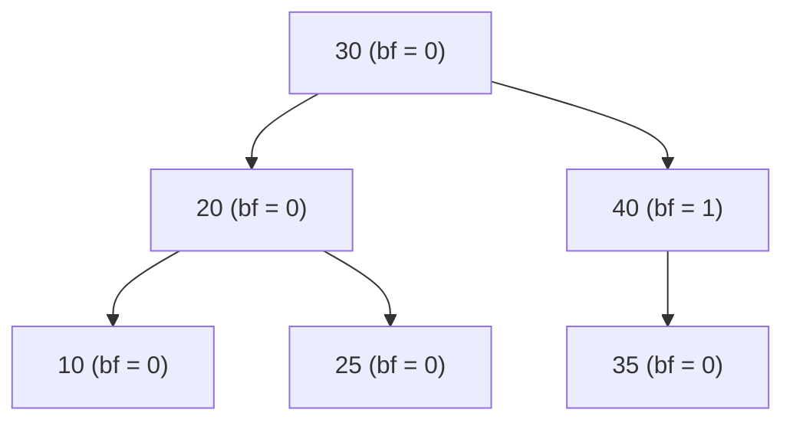
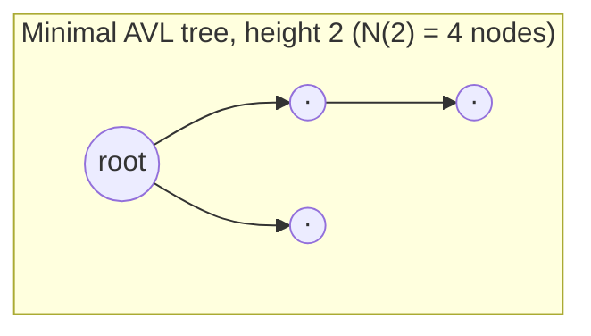
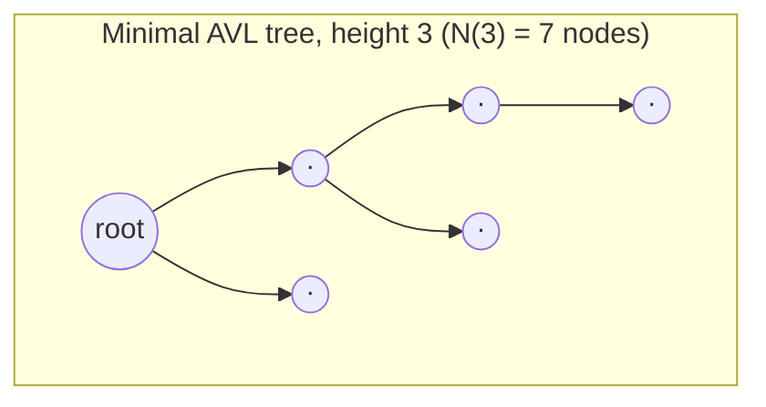
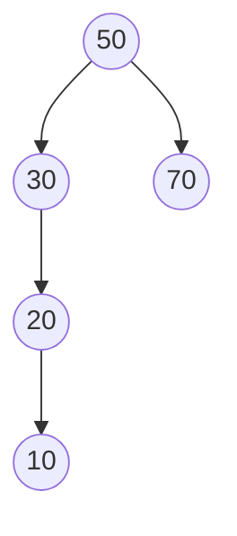
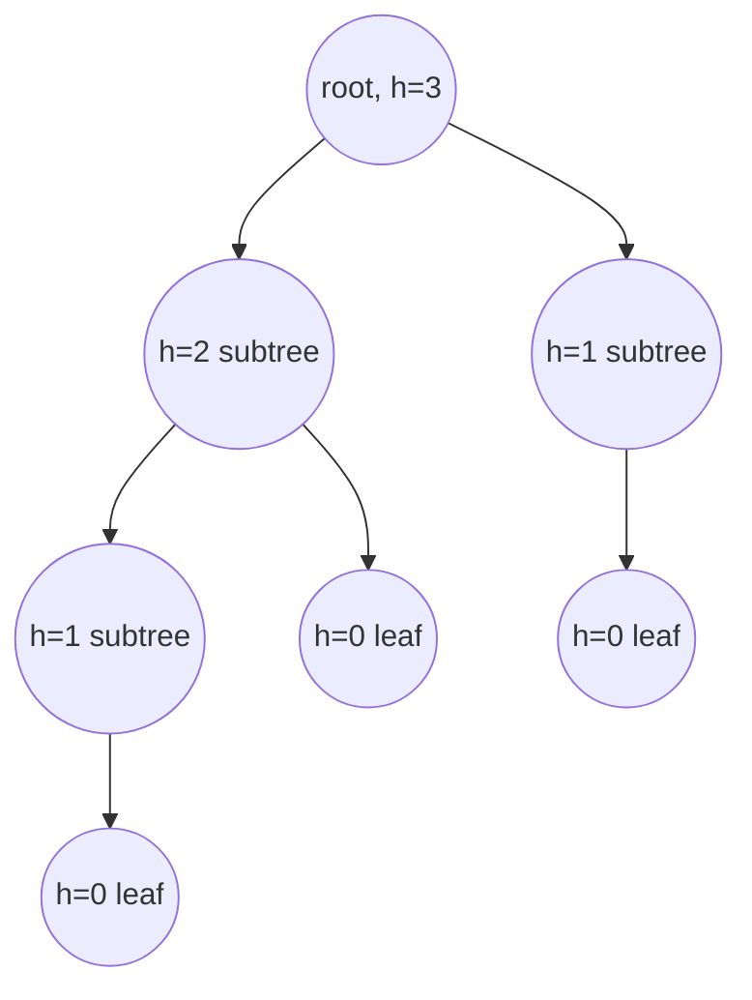

## Learning Objectives

- Define the **height** of a node and the **balance factor** of a node precisely, including the convention used for empty subtrees.
- State the AVL invariant exactly: every node's balance factor must lie in {−1, 0, 1}.
- Derive the minimum-node-count recurrence for an AVL tree of a given height, connect it to the Fibonacci sequence, and use it to justify why the AVL invariant forces height to be O(log n).
- Compute balance factors for the nodes of a given tree and identify which, if any, violate the invariant.
- Explain, at the level of what data must be maintained, why each AVL node stores its own height rather than recomputing it from scratch on every check.

## Context & Motivation

The previous concept, Why Balance Matters, introduced the general idea of a balance invariant — a local, checkable, locally restorable condition on tree shape that guarantees O(log n) height regardless of insertion order — without committing to any specific rule. This concept commits to the first and historically earliest one: the **AVL invariant**, named for Georgy Adelson-Velsky and Evgenii Landis, who published it in 1962 as the first self-balancing binary search tree scheme, years before red-black trees existed. AVL trees are worth studying not merely as a historical artifact but because their invariant is the simplest one that actually works, stated in one sentence and checked with one subtraction per node, which makes AVL trees an unusually clean setting to see the "local rule, global guarantee" idea from the previous concept made completely precise and completely provable.

What makes this concept more than a definition exercise is a genuinely worthwhile fact that is easy to take on faith and much more satisfying to actually derive: *why* does a rule this simple — just keep every node's two subtrees within one level of each other — guarantee anything at all about the tree's overall height? The answer turns out to connect directly to the Fibonacci sequence, one of the most recognizable objects in all of discrete mathematics, showing up here in a context (tree balancing) that has nothing to do with rabbits or golden ratios on the surface. Seeing that connection derived rather than asserted is the central goal of this concept's Core Theory section, and it is exactly the kind of result — surprising on first exposure, inevitable once you see the recurrence — that this curriculum tries to earn rather than assume.

## Core Theory

### Height and balance factor, defined precisely

The **height** of a node is the length of the longest path from that node down to a leaf, measured in edges. By convention, an empty subtree (a null pointer where a child could be) has height −1, and a single leaf node has height 0 — this convention is what makes the arithmetic in the rest of this concept come out cleanly, so it is worth fixing before anything else.

The **balance factor** of a node is defined as:

```
balance(node) = height(node.left) − height(node.right)
```

A positive balance factor means the left subtree is taller; a negative one means the right subtree is taller; zero means they are exactly equal in height. This single number, recomputed after any structural change near a node, is everything the AVL invariant needs to check.

### The AVL invariant, stated exactly

A binary search tree is an **AVL tree** if and only if, for every node in the tree, its balance factor is one of −1, 0, or +1. Equivalently: for every node, the heights of its left and right subtrees differ by at most 1. Any node whose balance factor is −2, +2, or further from zero is said to **violate** the invariant, and a correctly maintained AVL implementation never leaves such a violation in place after an operation completes — it is detected and corrected (via a rotation, the subject of the next concept) before the insertion or deletion is considered finished.



Every node above has balance factor in {−1, 0, 1} — heights 20 and 40's subtrees, and 30's two subtrees, never differ by more than one level — so this is a valid AVL tree, even though it is not perfectly symmetric (node 40 has one child and node 20 has two).

### Why this local rule forces global O(log n) height

This is the fact worth actually proving rather than taking on faith: given that every node individually obeys the ±1 rule, how tall can the *whole* tree possibly get, relative to its number of nodes?

Turn the question around and ask instead: what is the *fewest* nodes an AVL tree of height h can possibly have? Call this quantity N(h). If N(h) turns out to grow quickly (exponentially) in h, then the reverse statement follows immediately: a tree with only n nodes cannot have height any larger than the h at which N(h) first exceeds n — because any taller tree would need more nodes than are actually available.

To make a tree of height h with as few nodes as possible while still obeying the AVL invariant, put the fewest possible nodes in each subtree: one subtree must reach all the way down to height h − 1 (otherwise the whole tree wouldn't have height h at all), and the invariant allows the *other* subtree to be as much as one level shorter, i.e., height h − 2 — going shorter than that would leave the first subtree only h - 1 tall relative to a subtree of height less than h-2, which is still fine for the invariant, but height h − 2 is what minimizes node count while still respecting the ±1 gap, since making the second subtree any smaller doesn't reduce below what's already the minimal tree of the smallest legal height. This gives a recurrence:

```
N(-1) = 0            (empty tree)
N(0)  = 1             (single leaf)
N(h)  = 1 + N(h-1) + N(h-2)   for h ≥ 1
```

(the "1" counts the root itself). Computing the first several values:

| h | N(h) |
|---|------|
| −1 | 0 |
| 0 | 1 |
| 1 | 1 + N(0) + N(−1) = 1 + 1 + 0 = 2 |
| 2 | 1 + N(1) + N(0) = 1 + 2 + 1 = 4 |
| 3 | 1 + N(2) + N(1) = 1 + 4 + 2 = 7 |
| 4 | 1 + N(3) + N(2) = 1 + 7 + 4 = 12 |
| 5 | 1 + N(4) + N(3) = 1 + 12 + 7 = 20 |

This recurrence — each term the sum of the previous two, plus a constant — is exactly the Fibonacci recurrence in disguise. Formally, if M(h) = N(h) + 1, then M(h) = M(h−1) + M(h−2) with M(−1) = 1 and M(0) = 2, which makes M(h) equal to the (h+3)-th Fibonacci number (using F(1) = F(2) = 1). Fibonacci numbers are well known to grow **exponentially**, specifically like φ^h ⁄ √5 where φ = (1+√5)/2 ≈ 1.618 is the golden ratio. So N(h) also grows exponentially in h, roughly as φ^h.

Now apply the turn-it-around argument: an AVL tree with n actual nodes must have n ≥ N(h), where h is its height. Since N(h) ≈ φ^h (up to constants), this means φ^h = O(n), and taking logarithms:

```
h = O(log_φ n) = O(log n / log φ) ≈ O(1.44 · log₂ n)
```

This is the result the whole invariant is built to deliver: height is O(log n). The constant, about 1.44, is worse than the roughly 1.0 a perfectly, exhaustively balanced tree would achieve (log₂ n exactly) — an AVL tree can be up to about 44% taller than the theoretical minimum for its node count — but it is still logarithmic, still asymptotically the same class of performance, and it was obtained from nothing more than a per-node ±1 rule checked locally. That is precisely the "local rule, global guarantee" claim from the previous concept, made completely rigorous.





Each of these is the *sparsest* possible AVL tree at its height — one subtree at the maximum allowed height, the other exactly one shorter, recursively all the way down. Real AVL trees built from real insertions are almost always denser (more nodes for the same height) than this worst case, so the O(1.44 log₂ n) bound is a genuine worst-case guarantee, not a typical-case estimate.

### Maintaining height incrementally

The balance-factor check above assumes height(left) and height(right) are already known — recomputing a subtree's height from scratch by walking every node in it would cost O(size of subtree), and doing that at every node on every insertion would defeat the purpose of an O(log n) operation. Instead, every AVL node stores its own height as a field, updated in O(1) time whenever one of its children's heights changes:

```python
class AVLNode:
    def __init__(self, value):
        self.value = value
        self.left = None
        self.right = None
        self.height = 0  # leaf by default

def height(node):
    return node.height if node is not None else -1

def update_height(node):
    node.height = 1 + max(height(node.left), height(node.right))

def balance_factor(node):
    return height(node.left) - height(node.right)
```

`height(None)` returning −1 encodes the empty-subtree convention directly; `update_height` is the O(1) step run on every node along the path affected by an insertion or deletion, after that node's children have potentially changed — the mechanism the next concept relies on when it walks back up the tree checking balance factors after a rotation.

## Worked Examples

### Example 1 — computing balance factors and spotting a violation

**Problem:** For the tree below, compute the balance factor of every node and determine whether it is a valid AVL tree.



**Compute heights bottom-up.** Node 10: leaf, height 0. Node 20: has left child 10 (height 0), no right child (height −1); height(20) = 1 + max(0, −1) = 1. Node 70: leaf, height 0. Node 30: left child 20 (height 1), no right child (height −1); height(30) = 1 + max(1, −1) = 2. Node 50: left child 30 (height 2), right child 70 (height 0); height(50) = 1 + max(2, 0) = 3.

**Compute balance factors.** bf(10) = height(None) − height(None) = −1 − (−1) = 0. bf(20) = height(10) − height(None) = 0 − (−1) = 1. bf(70) = 0. bf(30) = height(20) − height(None) = 1 − (−1) = 2. bf(50) = height(30) − height(70) = 2 − 0 = 2.

**Conclusion.** Node 30 has balance factor 2, and node 50 also has balance factor 2 — both violate the AVL invariant (allowed range is {−1, 0, 1}). This tree is **not** a valid AVL tree; it has degenerated into a left-leaning chain from 50 down to 10, exactly the kind of shape the invariant is designed to forbid and that a rotation (next concept) would correct.

### Example 2 — building the minimal AVL tree of height 3 and confirming the node count

**Problem:** Using the recursive construction from Core Theory (one subtree of height h − 1, the other of height h − 2, both minimal), build a minimal AVL tree of height 3 and confirm it has exactly N(3) = 7 nodes.

**Construction.** A height-3 minimal tree needs a root, a subtree of height 2 (minimal, 4 nodes), and a subtree of height 1 (minimal, 2 nodes). A minimal height-2 subtree itself needs a root, a subtree of height 1 (2 nodes), and a subtree of height 0 (1 node) — total 1 + 2 + 1 = 4, matching N(2) = 4 from the table. A minimal height-1 subtree needs a root plus one leaf child — 2 nodes, matching N(1).



**Count.** Root (1) + height-2 subtree (4 nodes: its own root, its height-1 sub-subtree of 2 nodes, and its height-0 leaf of 1 node) + height-1 subtree (2 nodes) = 1 + 4 + 2 = 7. ✓ matches N(3) = 7 exactly, and every node's balance factor is within {−1, 0, 1} by construction, since each subtree pairing was built to differ by exactly the maximum allowed gap of 1.

### Example 3 — bounding the height of a million-node AVL tree

**Problem:** Using the O(1.44 log₂ n) bound derived in Core Theory, estimate the maximum possible height of an AVL tree holding n = 1,000,000 nodes, and compare it to the height a perfectly balanced tree would have.

**Perfectly balanced case.** log₂(1,000,000) ≈ 19.93, so a perfectly, exhaustively balanced tree would have height about 20.

**AVL worst case.** Using the derived constant: h ≤ 1.44 × log₂(1,000,000) ≈ 1.44 × 19.93 ≈ 28.7, so an AVL tree on a million nodes has height at most about 29 in the worst case (the precise refined bound, using exact Fibonacci-based constants, gives 28 — close enough to confirm the derivation's order of magnitude).

**Comparison.** 29 versus 20 is a real but modest gap — about 44% taller in the absolute worst case — and both are still overwhelmingly closer to the O(log n) regime than to the O(n) ≈ 1,000,000 height a plain, unbalanced BST could reach under sorted insertion, as shown in the previous concept. This is the concrete payoff of the whole derivation: the ±1 local rule costs a modest constant-factor height penalty relative to perfect balance, in exchange for an ironclad guarantee that the O(n) worst case can never occur at all.

## Common Misconceptions & Pitfalls

- **"A balance factor of 2 is fine as long as it doesn't get much bigger."** It is not fine — the AVL invariant is exactly {−1, 0, 1}, with no tolerance beyond that. Example 1 shows a balance factor of 2 at two different nodes in the same tree, and by definition that tree is not a valid AVL tree, regardless of how "close" 2 might seem to the allowed range.
- **"An AVL tree is always perfectly balanced, i.e., height exactly ⌈log₂(n+1)⌉."** Example 3 shows this is false — an AVL tree's worst-case height (~1.44 log₂ n) is measurably taller than a perfectly balanced tree's height (log₂ n). The AVL invariant guarantees O(log n) height, not the *minimum possible* height for n nodes; those are different claims, and conflating them overstates what the invariant promises.
- **"Checking the AVL invariant requires knowing the size of the whole tree."** It does not — the balance factor at a node depends only on the heights of that node's two immediate children, which are themselves maintained incrementally (Core Theory's `update_height`). No global traversal or node count is ever needed to check or restore the invariant at a given node.
- **"Balance factor and height are the same measurement."** Height is a property of a single subtree (how far down it extends); balance factor is a *difference* between two subtrees' heights, defined only in relation to a node's two children. Example 1 computes both for several nodes side by side specifically to keep the two from blurring together — height(30) = 2 is not the same number as bf(30) = 2, even though they coincide numerically in that particular example.
- **"The Fibonacci connection is just a curiosity, not something that affects real behavior."** It is the entire reason the ~1.44 constant exists rather than some other number, or no bound at all — a different local rule (say, allowing a gap of up to 2 instead of 1) would produce a different recurrence, a different growth rate, and a different, worse constant. The tightness of AVL's particular ±1 choice is a direct, provable consequence of exactly this recurrence, not an incidental design choice.

## Summary

The AVL invariant states that every node's **balance factor** — height(left subtree) minus height(right subtree) — must lie in {−1, 0, 1}, checked and restored after every insertion or deletion. This single, simple, locally-checkable rule is provably strong enough to bound the entire tree's height at O(log n): the minimum number of nodes an AVL tree of height h can have, N(h), obeys the recurrence N(h) = 1 + N(h−1) + N(h−2), which is the Fibonacci recurrence in disguise and therefore grows exponentially in h — forcing height to grow only logarithmically in node count, specifically about 1.44 · log₂ n in the worst case, a real but modest penalty relative to a perfectly balanced tree's log₂ n. Maintaining this efficiently requires storing each node's height as a field, updated in O(1) time rather than recomputed by traversal. The next concept covers the mechanism — rotation — that a correct AVL implementation uses to restore the invariant the instant an insertion or deletion pushes some node's balance factor outside {−1, 0, 1}.

## Documentation Links

- [MIT 6.006 — Lecture Notes (OCW)](https://ocw.mit.edu/courses/6-006-introduction-to-algorithms-spring-2020/pages/lecture-notes/) — doc
- [Stanford CS166 — Data Structures](https://web.stanford.edu/class/cs166) — doc
