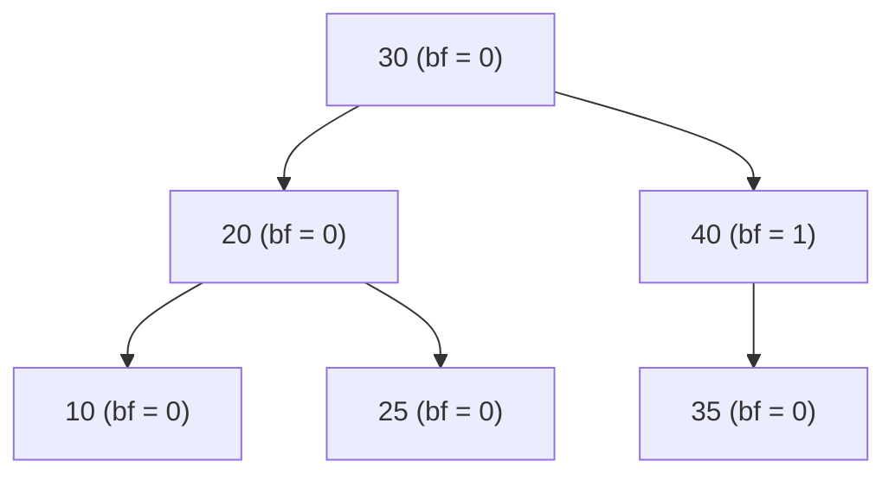
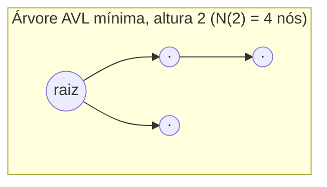
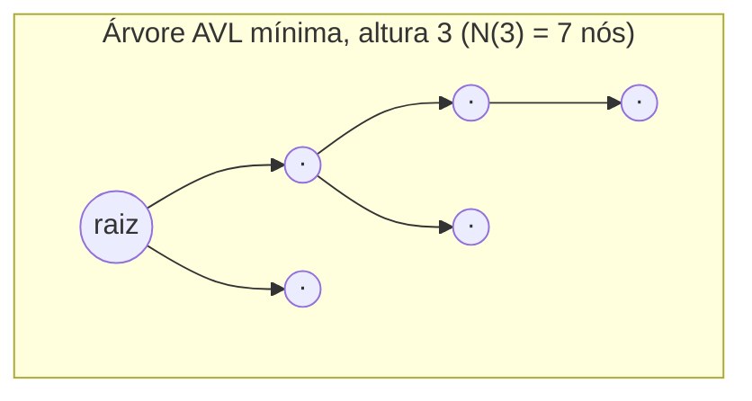
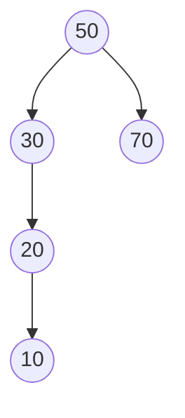
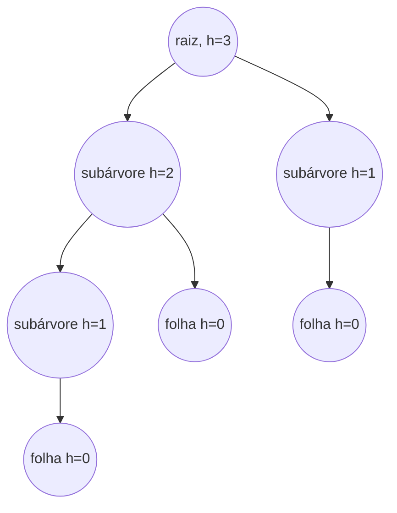

## Objetivos de Aprendizagem

- Definir precisamente a **altura** de um nó e o **fator de balanceamento** de um nó, incluindo a convenção usada para subárvores vazias.
- Enunciar exatamente o invariante AVL: o fator de balanceamento de todo nó deve estar em {−1, 0, 1}.
- Derivar a recorrência de contagem mínima de nós para uma árvore AVL de uma dada altura, conectá-la à sequência de Fibonacci, e usá-la para justificar por que o invariante AVL força altura a ser O(log n).
- Calcular fatores de balanceamento para os nós de uma dada árvore e identificar quais, se algum, violam o invariante.
- Explicar, no nível de quais dados devem ser mantidos, por que todo nó AVL armazena sua própria altura em vez de recalculá-la do zero em toda verificação.

## Contexto e Motivação

O conceito anterior, Por Que Balanceamento Importa, introduziu a ideia geral de um invariante de balanceamento, uma condição local, verificável, localmente restaurável sobre o formato de árvore que garante altura O(log n) independentemente da ordem de inserção, sem se comprometer com nenhuma regra específica. Este conceito se compromete com a primeira e historicamente mais antiga: o **invariante AVL**, nomeado em homenagem a Georgy Adelson-Velsky e Evgenii Landis, que o publicaram em 1962 como o primeiro esquema de árvore binária de busca autobalanceada, anos antes de árvores rubro-negras existirem. Árvores AVL valem a pena estudar não meramente como um artefato histórico mas porque seu invariante é o mais simples que de fato funciona, enunciado em uma frase e verificado com uma subtração por nó, o que torna árvores AVL um cenário incomumente limpo para ver a ideia de "regra local, garantia global" do conceito anterior tornada completamente precisa e completamente provável.

O que torna este conceito mais que um exercício de definição é um fato genuinamente valioso que é fácil de aceitar por fé e muito mais satisfatório de fato derivar: *por que* uma regra tão simples, apenas manter as duas subárvores de todo nó dentro de um nível uma da outra, garante qualquer coisa sobre a altura geral da árvore? A resposta acaba se conectando diretamente à sequência de Fibonacci, um dos objetos mais reconhecíveis em toda a matemática discreta, aparecendo aqui em um contexto (balanceamento de árvore) que não tem nada a ver com coelhos ou razões áureas na superfície. Ver essa conexão derivada em vez de afirmada é o objetivo central da seção Teoria Central deste conceito, e é exatamente o tipo de resultado, surpreendente na primeira exposição, inevitável uma vez que você vê a recorrência, que este currículo tenta conquistar em vez de assumir.

## Teoria Central

### Altura e fator de balanceamento, definidos precisamente

A **altura** de um nó é o comprimento do caminho mais longo daquele nó até uma folha, medido em arestas. Por convenção, uma subárvore vazia (um ponteiro nulo onde um filho poderia estar) tem altura −1, e um único nó folha tem altura 0, essa convenção é o que faz a aritmética no resto deste conceito sair de forma limpa, então vale a pena fixá-la antes de mais nada.

O **fator de balanceamento** de um nó é definido como:

```
balanceamento(nó) = altura(nó.esquerda) − altura(nó.direita)
```

Um fator de balanceamento positivo significa que a subárvore esquerda é mais alta; um negativo significa que a subárvore direita é mais alta; zero significa que são exatamente iguais em altura. Este único número, recalculado depois de qualquer mudança estrutural perto de um nó, é tudo que o invariante AVL precisa verificar.

### O invariante AVL, enunciado exatamente

Uma árvore binária de busca é uma **árvore AVL** se e somente se, para todo nó na árvore, seu fator de balanceamento é um de −1, 0, ou +1. Equivalentemente: para todo nó, as alturas de suas subárvores esquerda e direita diferem em no máximo 1. Qualquer nó cujo fator de balanceamento é −2, +2, ou mais longe de zero é dito **violar** o invariante, e uma implementação AVL corretamente mantida nunca deixa tal violação em vigor depois de uma operação ser concluída, ela é detectada e corrigida (via uma rotação, o assunto do próximo conceito) antes de a inserção ou remoção ser considerada terminada.



Todo nó acima tem fator de balanceamento em {−1, 0, 1}, as alturas das subárvores de 20 e 40, e as duas subárvores de 30, nunca diferem por mais de um nível, então esta é uma árvore AVL válida, mesmo que não seja perfeitamente simétrica (o nó 40 tem um filho e o nó 20 tem dois).

### Por que essa regra local força altura global O(log n)

Este é o fato que vale a pena de fato provar em vez de aceitar por fé: dado que todo nó individualmente obedece à regra de ±1, quão alta a árvore *inteira* pode possivelmente ficar, em relação ao seu número de nós?

Inverta a pergunta e pergunte em vez disso: qual é o número *mínimo* de nós que uma árvore AVL de altura h pode possivelmente ter? Chame essa quantidade de N(h). Se N(h) acaba crescendo rapidamente (exponencialmente) em h, então a afirmação reversa segue imediatamente: uma árvore com apenas n nós não pode ter altura maior que a h na qual N(h) primeiro excede n, porque qualquer árvore mais alta precisaria de mais nós do que de fato estão disponíveis.

Para fazer uma árvore de altura h com o mínimo de nós possível enquanto ainda obedece ao invariante AVL, coloque o mínimo de nós possível em cada subárvore: uma subárvore deve alcançar até a altura h − 1 (caso contrário a árvore inteira não teria altura h de forma alguma), e o invariante permite que a *outra* subárvore seja até um nível mais curta, ou seja, altura h − 2, ir mais curta que isso deixaria a primeira subárvore apenas h - 1 de altura em relação a uma subárvore de altura menor que h-2, o que ainda é permitido pelo invariante, mas altura h − 2 é o que minimiza a contagem de nós enquanto ainda respeita a lacuna de ±1, já que tornar a segunda subárvore ainda menor não reduz abaixo do que já é a árvore mínima da menor altura legal. Isso dá uma recorrência:

```
N(-1) = 0            (árvore vazia)
N(0)  = 1             (folha única)
N(h)  = 1 + N(h-1) + N(h-2)   para h ≥ 1
```

(o "1" conta a própria raiz). Calculando os primeiros vários valores:

| h | N(h) |
|---|------|
| −1 | 0 |
| 0 | 1 |
| 1 | 1 + N(0) + N(−1) = 1 + 1 + 0 = 2 |
| 2 | 1 + N(1) + N(0) = 1 + 2 + 1 = 4 |
| 3 | 1 + N(2) + N(1) = 1 + 4 + 2 = 7 |
| 4 | 1 + N(3) + N(2) = 1 + 7 + 4 = 12 |
| 5 | 1 + N(4) + N(3) = 1 + 12 + 7 = 20 |

Essa recorrência, cada termo a soma dos dois anteriores, mais uma constante, é exatamente a recorrência de Fibonacci disfarçada. Formalmente, se M(h) = N(h) + 1, então M(h) = M(h−1) + M(h−2) com M(−1) = 1 e M(0) = 2, o que torna M(h) igual ao (h+3)-ésimo número de Fibonacci (usando F(1) = F(2) = 1). Números de Fibonacci são bem conhecidos por crescer **exponencialmente**, especificamente como φ^h ⁄ √5 onde φ = (1+√5)/2 ≈ 1,618 é a razão áurea. Então N(h) também cresce exponencialmente em h, aproximadamente como φ^h.

Agora aplique o argumento invertido: uma árvore AVL com n nós reais deve ter n ≥ N(h), onde h é sua altura. Como N(h) ≈ φ^h (até constantes), isso significa φ^h = O(n), e tomando logaritmos:

```
h = O(log_φ n) = O(log n / log φ) ≈ O(1,44 · log₂ n)
```

Este é o resultado para o qual todo o invariante é construído para entregar: altura é O(log n). A constante, cerca de 1,44, é pior que o aproximadamente 1,0 que uma árvore perfeitamente e exaustivamente balanceada alcançaria (log₂ n exatamente), uma árvore AVL pode ser até cerca de 44% mais alta que o mínimo teórico para sua contagem de nós, mas ainda é logarítmica, ainda assintoticamente a mesma classe de desempenho, e foi obtida a partir de nada mais que uma regra de ±1 por nó verificada localmente. Isso é precisamente a afirmação de "regra local, garantia global" do conceito anterior, tornada completamente rigorosa.





Cada uma dessas é a árvore AVL mais *esparsa* possível em sua altura, uma subárvore na altura máxima permitida, a outra exatamente uma mais curta, recursivamente até o fim. Árvores AVL reais construídas a partir de inserções reais são quase sempre mais densas (mais nós para a mesma altura) que esse pior caso, então o limite O(1,44 log₂ n) é uma garantia genuína de pior caso, não uma estimativa de caso típico.

### Mantendo altura incrementalmente

A verificação de fator de balanceamento acima assume que altura(esquerda) e altura(direita) já são conhecidas, recalcular a altura de uma subárvore do zero percorrendo todo nó nela custaria O(tamanho da subárvore), e fazer isso em todo nó em toda inserção derrotaria o propósito de uma operação O(log n). Em vez disso, todo nó AVL armazena sua própria altura como um campo, atualizado em tempo O(1) sempre que a altura de um de seus filhos muda:

```python
class AVLNode:
    def __init__(self, value):
        self.value = value
        self.left = None
        self.right = None
        self.height = 0  # folha por padrão

def height(node):
    return node.height if node is not None else -1

def update_height(node):
    node.height = 1 + max(height(node.left), height(node.right))

def balance_factor(node):
    return height(node.left) - height(node.right)
```

`height(None)` retornando −1 codifica a convenção de subárvore vazia diretamente; `update_height` é o passo O(1) executado em todo nó ao longo do caminho afetado por uma inserção ou remoção, depois de os filhos daquele nó terem potencialmente mudado, o mecanismo do qual o próximo conceito depende quando sobe de volta pela árvore verificando fatores de balanceamento depois de uma rotação.

## Exemplos Resolvidos

### Exemplo 1 — calculando fatores de balanceamento e identificando uma violação

**Problema:** Para a árvore abaixo, calcule o fator de balanceamento de todo nó e determine se é uma árvore AVL válida.



**Calcule alturas de baixo para cima.** Nó 10: folha, altura 0. Nó 20: tem filho esquerdo 10 (altura 0), sem filho direito (altura −1); altura(20) = 1 + max(0, −1) = 1. Nó 70: folha, altura 0. Nó 30: filho esquerdo 20 (altura 1), sem filho direito (altura −1); altura(30) = 1 + max(1, −1) = 2. Nó 50: filho esquerdo 30 (altura 2), filho direito 70 (altura 0); altura(50) = 1 + max(2, 0) = 3.

**Calcule fatores de balanceamento.** bf(10) = altura(None) − altura(None) = −1 − (−1) = 0. bf(20) = altura(10) − altura(None) = 0 − (−1) = 1. bf(70) = 0. bf(30) = altura(20) − altura(None) = 1 − (−1) = 2. bf(50) = altura(30) − altura(70) = 2 − 0 = 2.

**Conclusão.** O nó 30 tem fator de balanceamento 2, e o nó 50 também tem fator de balanceamento 2, ambos violam o invariante AVL (a faixa permitida é {−1, 0, 1}). Esta árvore **não** é uma árvore AVL válida; ela degenerou em uma corrente inclinada à esquerda de 50 até 10, exatamente o tipo de formato que o invariante é projetado para proibir e que uma rotação (próximo conceito) corrigiria.

### Exemplo 2 — construindo a árvore AVL mínima de altura 3 e confirmando a contagem de nós

**Problema:** Usando a construção recursiva da Teoria Central (uma subárvore de altura h − 1, a outra de altura h − 2, ambas mínimas), construa uma árvore AVL mínima de altura 3 e confirme que ela tem exatamente N(3) = 7 nós.

**Construção.** Uma árvore mínima de altura 3 precisa de uma raiz, uma subárvore de altura 2 (mínima, 4 nós), e uma subárvore de altura 1 (mínima, 2 nós). Uma subárvore mínima de altura 2 ela mesma precisa de uma raiz, uma subárvore de altura 1 (2 nós), e uma subárvore de altura 0 (1 nó), total 1 + 2 + 1 = 4, correspondendo a N(2) = 4 da tabela. Uma subárvore mínima de altura 1 precisa de uma raiz mais um filho folha, 2 nós, correspondendo a N(1).



**Contagem.** Raiz (1) + subárvore de altura 2 (4 nós: sua própria raiz, sua sub-subárvore de altura 1 com 2 nós, e sua folha de altura 0 com 1 nó) + subárvore de altura 1 (2 nós) = 1 + 4 + 2 = 7. ✓ corresponde exatamente a N(3) = 7, e o fator de balanceamento de todo nó está dentro de {−1, 0, 1} por construção, já que cada pareamento de subárvore foi construído para diferir por exatamente a lacuna máxima permitida de 1.

### Exemplo 3 — limitando a altura de uma árvore AVL de um milhão de nós

**Problema:** Usando o limite O(1,44 log₂ n) derivado na Teoria Central, estime a altura máxima possível de uma árvore AVL contendo n = 1.000.000 nós, e compare-a com a altura que uma árvore perfeitamente balanceada teria.

**Caso perfeitamente balanceado.** log₂(1.000.000) ≈ 19,93, então uma árvore perfeitamente e exaustivamente balanceada teria altura de cerca de 20.

**Pior caso AVL.** Usando a constante derivada: h ≤ 1,44 × log₂(1.000.000) ≈ 1,44 × 19,93 ≈ 28,7, então uma árvore AVL com um milhão de nós tem altura no máximo cerca de 29 no pior caso (o limite refinado preciso, usando constantes exatas baseadas em Fibonacci, dá 28, próximo o suficiente para confirmar a ordem de magnitude da derivação).

**Comparação.** 29 versus 20 é uma lacuna real mas modesta, cerca de 44% mais alta no pior caso absoluto, e ambas ainda estão esmagadoramente mais próximas do regime O(log n) do que da altura O(n) ≈ 1.000.000 que uma BST comum e não balanceada poderia alcançar sob inserção ordenada, como mostrado no conceito anterior. Este é o retorno concreto de toda a derivação: a regra local de ±1 custa uma penalidade de altura de fator constante modesta em relação ao balanceamento perfeito, em troca de uma garantia inabalável de que o pior caso O(n) nunca pode ocorrer de forma alguma.

## Equívocos Comuns e Armadilhas

- **"Um fator de balanceamento de 2 está tudo bem desde que não fique muito maior."** Não está tudo bem, o invariante AVL é exatamente {−1, 0, 1}, sem tolerância além disso. O Exemplo 1 mostra um fator de balanceamento de 2 em dois nós diferentes na mesma árvore, e por definição essa árvore não é uma árvore AVL válida, independentemente de quão "perto" 2 possa parecer da faixa permitida.
- **"Uma árvore AVL é sempre perfeitamente balanceada, ou seja, altura exatamente ⌈log₂(n+1)⌉."** O Exemplo 3 mostra que isso é falso, a altura de pior caso de uma árvore AVL (~1,44 log₂ n) é mensuravelmente mais alta que a altura de uma árvore perfeitamente balanceada (log₂ n). O invariante AVL garante altura O(log n), não a altura *mínima possível* para n nós; essas são afirmações diferentes, e confundi-las superestima o que o invariante promete.
- **"Verificar o invariante AVL exige saber o tamanho da árvore inteira."** Não exige, o fator de balanceamento em um nó depende apenas das alturas dos dois filhos imediatos desse nó, que são elas mesmas mantidas incrementalmente (o `update_height` da Teoria Central). Nenhuma travessia global ou contagem de nós é jamais necessária para verificar ou restaurar o invariante em um dado nó.
- **"Fator de balanceamento e altura são a mesma medição."** Altura é uma propriedade de uma única subárvore (até onde ela se estende); fator de balanceamento é uma *diferença* entre as alturas de duas subárvores, definida apenas em relação aos dois filhos de um nó. O Exemplo 1 calcula ambos para vários nós lado a lado especificamente para evitar que os dois se confundam, altura(30) = 2 não é o mesmo número que bf(30) = 2, mesmo que coincidam numericamente naquele exemplo particular.
- **"A conexão com Fibonacci é apenas uma curiosidade, não algo que afeta comportamento real."** É toda a razão pela qual a constante ~1,44 existe em vez de algum outro número, ou nenhum limite de forma alguma, uma regra local diferente (digamos, permitindo uma lacuna de até 2 em vez de 1) produziria uma recorrência diferente, uma taxa de crescimento diferente, e uma constante diferente e pior. A precisão da escolha específica de ±1 da AVL é uma consequência direta e provável exatamente dessa recorrência, não uma escolha de design incidental.

## Resumo

O invariante AVL afirma que o **fator de balanceamento** de todo nó, altura(subárvore esquerda) menos altura(subárvore direita), deve estar em {−1, 0, 1}, verificado e restaurado depois de toda inserção ou remoção. Essa única regra simples e localmente verificável é comprovadamente forte o suficiente para limitar a altura da árvore inteira a O(log n): o número mínimo de nós que uma árvore AVL de altura h pode ter, N(h), obedece à recorrência N(h) = 1 + N(h−1) + N(h−2), que é a recorrência de Fibonacci disfarçada e portanto cresce exponencialmente em h, forçando a altura a crescer apenas logaritmicamente na contagem de nós, especificamente cerca de 1,44 · log₂ n no pior caso, uma penalidade real mas modesta em relação ao log₂ n de uma árvore perfeitamente balanceada. Manter isso eficientemente exige armazenar a altura de cada nó como um campo, atualizado em tempo O(1) em vez de recalculado por travessia. O próximo conceito cobre o mecanismo, rotação, que uma implementação AVL correta usa para restaurar o invariante no instante em que uma inserção ou remoção empurra o fator de balanceamento de algum nó para fora de {−1, 0, 1}.

## Documentation Links

- [MIT 6.006 — Lecture Notes (OCW)](https://ocw.mit.edu/courses/6-006-introduction-to-algorithms-spring-2020/pages/lecture-notes/) — doc
- [Stanford CS166 — Data Structures](https://web.stanford.edu/class/cs166) — doc
