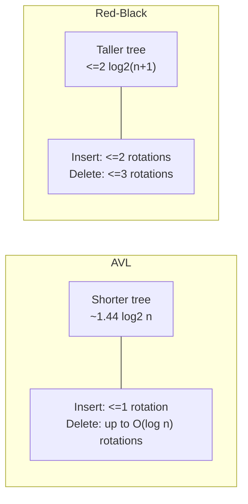

## Learning Objectives

- Summarize, side by side, the AVL and red-black invariants and the height bounds each one produces.
- Explain the mechanical trade-off precisely: AVL bounds rotations tightly on insert but not on delete; red-black bounds rotations tightly on both, at the cost of a looser height guarantee.
- State which workload characteristics — read-heavy versus write-heavy — favor which structure, and why, in terms of the height and rotation trade-offs.
- Connect the choice to real, well-known systems that made each decision (Java's `TreeMap`, the Linux scheduler) and articulate the workload reasoning behind each.
- Given a described scenario, recommend AVL or red-black with a justification grounded in the actual trade-off, not a blanket preference.

## Context & Motivation

This discipline opened by proving that a plain binary search tree offers no height guarantee at all, then spent four concepts building two complete, correct, independently sufficient fixes: AVL trees, with a strict numeric invariant and a fully worked-out four-case rotation mechanism, and red-black trees, with a looser color-based invariant and a conceptual recolor-then-rotate fix-up. Both guarantee O(log n) height. Both guarantee O(log n) search, insert, and delete. If the only question were "does this solve the problem the first concept raised," the answer for either structure is an unqualified yes, and a curriculum could reasonably stop there.

But real engineering decisions are rarely settled by "does it work" alone — they are settled by "which one works *better, here*," and that question has a real, substantive, non-arbitrary answer once the two structures' actual costs are compared rather than just their asymptotic guarantees. This closing concept does exactly that comparison, using the precise numbers already derived in the previous two concepts (AVL's ~1.44·log₂ n height bound, red-black's ~2·log₂(n+1) bound, and the respective rotation-count guarantees for insertion and deletion), and connects the resulting trade-off to genuine, citable decisions made inside real, widely used software. This is not a hypothetical exercise: the fact that Java's ordered collections and the Linux kernel scheduler both chose red-black trees, for reasons directly traceable to their workloads, is exactly the kind of "theory meets practice" payoff this whole discipline has been building toward.

## Core Theory

### The two invariants, side by side

| | AVL | Red-Black |
|---|---|---|
| Local rule | Every node's balance factor ∈ {−1, 0, 1} | Every node red or black; root black; no red-red edge; equal black-height on every path |
| Per-node overhead | A height or balance-factor field (small integer) | A single color bit |
| Worst-case height | ≈ 1.44 · log₂ n | ≤ 2 · log₂(n + 1) |
| Rotations per insertion | At most 1 (single or double) | At most 2 |
| Rotations per deletion | Up to O(log n) in the worst case | At most 3 |
| Non-rotation fix-up work | Balance-factor recompute, O(1) per ancestor visited | Recoloring, O(1) per ancestor visited |

Both rows for "worst-case height" describe genuinely different guarantees, not the same number expressed two ways — the gap between them (roughly 38% taller for red-black at the scale examined in the previous concept's Example 2) is real, small, and never large enough to change either structure's asymptotic class, but large enough to matter when every comparison in a hot lookup path counts.

### The height trade-off, quantified across scales

| n | AVL bound (≈1.44 log₂ n) | Red-black bound (≤2 log₂(n+1)) | Plain BST worst case (n − 1) |
|---|---|---|---|
| 1,000 | ≈ 14 | ≈ 20 | 999 |
| 100,000 | ≈ 24 | ≈ 33 | 99,999 |
| 1,000,000 | ≈ 29 | ≈ 40 | 999,999 |

The rightmost column is a reminder of what both structures are actually being compared *against* first — the degenerate case this whole discipline exists to eliminate — before being compared against each other. Relative to that baseline, the AVL/red-black gap (a matter of single-digit or low-double-digit extra comparisons per lookup) is a genuinely minor consideration; it only becomes a meaningful factor once the catastrophic failure mode has already been ruled out by *either* structure, and the choice becomes purely about optimizing the constant factor.

### The rotation trade-off, quantified

The more consequential asymmetry is not height but update cost, and it runs in the opposite direction from what the height numbers alone might suggest. AVL's strict invariant means an insertion is cheap — at most one rotation, ever, as proved in the AVL rotations concept — but a *deletion* can require rebalancing at every ancestor from the deleted node's position up to the root, meaning up to O(log n) separate rotations in the worst case. Red-black's looser invariant means both insertion and deletion are capped at a small constant number of rotations (2 and 3, respectively) regardless of how deep the tree is — the potentially O(log n)-long part of a red-black update is the recoloring walk, and recoloring is cheaper, structurally, than a rotation: a rotation reassigns several pointers and changes parent/child relationships (with the attendant cache-locality and, in a concurrent structure, locking implications that come with restructuring), while a recoloring simply flips a bit on a node already being visited. This is the real substance of "AVL trades more rotations for a shorter tree, red-black trades a taller tree for fewer rotations" — it is not a vague slogan, it is the direct, provable consequence of the two invariants' different tolerances, worked out fully in the two preceding concepts.

### Reading the trade-off by workload

Putting the two axes together yields a genuinely actionable rule, not just an abstract comparison:

- **Read-heavy workloads** — where lookups vastly outnumber insertions and deletions — benefit most from AVL's shorter worst-case height, because every one of those many lookups pays the height cost directly, while the (rarer) updates' higher rotation cost is paid infrequently enough not to matter in aggregate.
- **Write-heavy workloads** — where insertions and deletions are frequent, possibly as frequent as or more frequent than lookups — benefit most from red-black's tightly bounded rotation counts, because the more expensive AVL deletion case (potentially O(log n) rotations) would otherwise be paid over and over, while the modest extra height red-black carries is paid only on the comparatively less frequent lookups.

### Real systems, real choices

Two concrete, well-documented examples make this concrete rather than theoretical:

- **Java's `TreeMap` and `TreeSet`** are implemented internally as red-black trees. A general-purpose ordered-collection library cannot know in advance whether its callers will be read-heavy or write-heavy — it has to make one default choice for every possible use — and red-black's tightly bounded worst-case update cost (never more than a small constant number of rotations, no matter what) is the safer default when the workload mix is unknown, precisely because it eliminates the possibility of a surprise O(log n)-rotation deletion cascade under an unlucky access pattern.
- **The Linux kernel's Completely Fair Scheduler (CFS)** uses a red-black tree to store runnable tasks ordered by virtual runtime, and this is a workload that is about as write-heavy as it gets: every context switch can insert a task back into the runqueue and remove the next one to run, happening thousands of times per second on a busy system. The scheduler's "lookup" operation (find the task with the smallest virtual runtime) is additionally kept O(1) via a cached pointer to the tree's leftmost node, meaning height barely matters for reads at all in this design — so the entire trade-off collapses in red-black's favor: minimize rotation cost on the frequent inserts/removes, and don't worry about search height, since search essentially never has to walk the tree's full height in the first place.

## Worked Examples

### Example 1 — a back-of-envelope cost comparison for a mixed workload

**Problem:** A system holds n = 100,000 keys and performs 1,000,000 lookups and 10,000 updates (inserts and deletes combined) per unit of time. Using the height bounds from Core Theory, compare the two structures' approximate total worst-case work.

**Heights at n = 100,000:** AVL ≈ 24, red-black ≈ 33 (from the table above).

**Lookup cost.** 1,000,000 lookups × height per lookup: AVL ≈ 24,000,000 worst-case comparisons; red-black ≈ 33,000,000 — red-black does about 9,000,000 more comparisons in the worst case across this workload, purely from its taller tree.

**Update cost.** 10,000 updates: AVL's insertions are cheap (≤ 1 rotation each) but its deletions can cost up to height-many rotations (≤ 24 each in the worst case) — if even a modest fraction of the 10,000 updates are deletions hitting this worst case, the rotation count alone could reach into the tens of thousands of extra pointer-restructuring operations. Red-black bounds every single update, insert or delete, at 2 or 3 rotations — at most 30,000 rotations total across all 10,000 updates even in the worst case, with the remaining fix-up work being cheap recoloring.

**Reading the result.** With lookups outnumbering updates 100 to 1 in this example, the extra ~9,000,000 comparisons red-black pays on lookups likely dominates the comparison — this scenario actually favors AVL, since the lookup volume swamps the update volume by two orders of magnitude. Flip the ratio (say, 10,000 lookups and 1,000,000 updates) and the conclusion reverses: red-black's tightly bounded rotation cost on the now-dominant update volume becomes the deciding factor. The lesson is not "AVL wins" or "red-black wins" in the abstract — it is that the actual read/write ratio of the real workload is what decides, exactly as Core Theory's workload rule states.

### Example 2 — why the Linux scheduler's choice is not a coincidence

**Problem:** Justify, using the concepts from this discipline, why the Linux CFS scheduler's choice of a red-black tree (rather than an AVL tree) for its runqueue is the workload-appropriate choice rather than an arbitrary one.

**Characterizing the workload.** A context switch removes the currently running task from the tree (or reinserts it, if it should keep running with updated virtual runtime) and finds/removes the next task to run — both an update and a lookup happen on essentially every context switch, which can occur thousands of times per second under normal system load. This is about as extreme a write-heavy workload as a tree-based structure is likely to see in practice.

**Applying the rule from Core Theory.** Write-heavy workloads favor red-black's tightly bounded rotation counts (≤ 2 for insert, ≤ 3 for delete) over AVL's cheap-insert-but-potentially-expensive-delete asymmetry. Since deletions are exactly as frequent as insertions in this workload (every context switch does both), AVL's worse-case deletion cost (up to O(log n) rotations) would be paid on a very large fraction of these thousands-per-second operations, while red-black's bound holds regardless.

**Conclusion.** The choice is a direct, textbook application of the trade-off derived in this concept — not a coincidence, and not simply "red-black is the popular default," but a decision that matches the specific shape (heavily write-dominated, latency-sensitive, extremely frequent) of the scheduler's actual access pattern.

### Example 3 — a read-heavy counter-example

**Problem:** A compiler's front end builds a symbol table once per compilation unit, from a source file's declarations, and then queries that table repeatedly during every subsequent compilation pass (type checking, code generation, optimization) — updates happen only while parsing declarations (a small, one-time cost per compilation), while lookups happen continuously across every later pass. Which structure does the workload rule favor?

**Characterizing the workload.** This is a clearly read-heavy pattern: a bounded, one-time burst of insertions followed by a much larger, sustained volume of lookups across multiple passes over the same data.

**Applying the rule.** Read-heavy workloads favor AVL's shorter worst-case height, since the (comparatively rare) insertions' higher potential rotation cost is paid once, up front, while every one of the many subsequent lookups benefits from the shorter tree.

**Conclusion.** AVL is the workload-appropriate choice here — the mirror image of Example 2's scheduler scenario, using the exact same rule from Core Theory applied to an opposite read/write ratio.

## Common Misconceptions & Pitfalls

- **"One of these two trees is just objectively better, and the other is legacy baggage."** Both guarantee O(log n) for every operation; the difference is entirely in the constants, and those constants favor different structures depending on the workload, as Examples 1 through 3 show concretely. Neither structure is obsolete or strictly dominated by the other.
- **"Since red-black trees back Java's `TreeMap` and Linux's scheduler, they must be strictly superior to AVL trees."** Those are both workloads with unpredictable or extremely write-heavy access patterns (Core Theory explains exactly why red-black is the safer or better choice in each case) — the popularity of red-black trees in general-purpose library code reflects that libraries cannot predict their callers' read/write ratio and must default to the safer worst-case bound, not that AVL trees are inferior for workloads whose read-heavy nature is actually known in advance, as in Example 3.
- **"The worst-case height gap between AVL and red-black means red-black lookups are always noticeably slower in practice."** The heights compared in Core Theory's table are worst-case bounds, not typical outcomes — for most real, non-adversarial insertion sequences, both structures tend to stay much closer to the ideal log₂ n height than their respective worst-case ceilings suggest, and the practical difference in average lookup cost is usually far smaller than the worst-case table implies.
- **"Choosing between AVL and red-black is a correctness decision."** It is not — both structures are equally correct, in the sense that both provably maintain the BST property and provably bound height at O(log n) under every sequence of insertions and deletions. The choice is purely a performance-engineering one, made on the basis of expected workload, exactly as Examples 1 through 3 illustrate.
- **"A write-heavy workload always means red-black wins, full stop, no further analysis needed."** Example 1 shows that even a workload with some updates can still favor AVL overall if lookups dominate by a large enough margin — the actual read/write *ratio*, not just the presence of some writes, is what the trade-off in Core Theory turns on.

## Summary

AVL and red-black trees both solve the exact problem this discipline opened with — a plain BST's unbounded worst-case height — but they solve it with different constants attached to the same O(log n) guarantee. AVL's stricter invariant (balance factor in {−1, 0, 1}) yields a shorter tree (≈1.44 log₂ n) and a cheap insertion (≤ 1 rotation), at the cost of a potentially expensive deletion (up to O(log n) rotations). Red-black's looser invariant (the four color rules) yields a taller tree (≤ 2 log₂(n+1)) but tightly bounds *both* insertion and deletion at a small constant number of rotations, pushing the O(log n) part of an update into cheap recoloring instead. The resulting rule — read-heavy workloads favor AVL's shorter tree, write-heavy or unpredictable workloads favor red-black's cheaper updates — is not an abstraction: it is the actual, documented reasoning behind Java's `TreeMap`/`TreeSet` choosing red-black trees as a safe general-purpose default, and the Linux kernel's CFS scheduler choosing red-black trees for an extremely write-heavy runqueue. This closes the balance-invariant story this discipline opened with: two rigorously justified, genuinely different, both entirely valid answers to the same design question, chosen in practice according to the shape of the actual workload rather than by a single universal preference.

## Documentation Links

- [MIT 6.006 — Lecture Notes (OCW)](https://ocw.mit.edu/courses/6-006-introduction-to-algorithms-spring-2020/pages/lecture-notes/) — doc
- [Sedgewick & Wayne — Algorithms Lectures (Princeton)](https://algs4.cs.princeton.edu/lectures/) — doc
