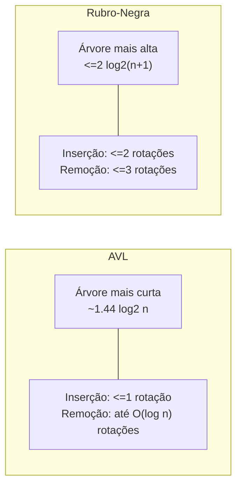

## Objetivos de Aprendizagem

- Resumir, lado a lado, os invariantes AVL e rubro-negro e os limites de altura que cada um produz.
- Explicar a troca mecânica precisamente: AVL limita rotações rigidamente na inserção mas não na remoção; rubro-negra limita rotações rigidamente em ambas, ao custo de uma garantia de altura mais frouxa.
- Enunciar quais características de carga de trabalho, leitura pesada versus escrita pesada, favorecem qual estrutura, e por quê, em termos das trocas de altura e rotação.
- Conectar a escolha a sistemas reais e bem conhecidos que fizeram cada decisão (`TreeMap` do Java, o escalonador do Linux) e articular o raciocínio de carga de trabalho por trás de cada um.
- Dado um cenário descrito, recomendar AVL ou rubro-negra com uma justificativa fundamentada na troca real, não uma preferência genérica.

## Contexto e Motivação

Esta disciplina abriu provando que uma árvore binária de busca comum não oferece nenhuma garantia de altura, depois passou quatro conceitos construindo dois consertos completos, corretos, e independentemente suficientes: árvores AVL, com um invariante numérico estrito e um mecanismo de rotação de quatro casos completamente trabalhado, e árvores rubro-negras, com um invariante mais frouxo baseado em cor e um fix-up conceitual de recolorir-depois-girar. Ambas garantem altura O(log n). Ambas garantem busca, inserção, e remoção O(log n). Se a única pergunta fosse "isso resolve o problema que o primeiro conceito levantou," a resposta para qualquer uma das estruturas é um sim inequívoco, e um currículo poderia razoavelmente parar por aí.

Mas decisões reais de engenharia raramente são resolvidas por "isso funciona" sozinho, são resolvidas por "qual funciona *melhor, aqui*," e essa pergunta tem uma resposta real, substantiva, e não arbitrária uma vez que os custos reais das duas estruturas são comparados em vez de apenas suas garantias assintóticas. Este conceito de encerramento faz exatamente essa comparação, usando os números precisos já derivados nos dois conceitos anteriores (o limite de altura ~1,44·log₂ n da AVL, o limite ~2·log₂(n+1) da rubro-negra, e as respectivas garantias de contagem de rotação para inserção e remoção), e conecta a troca resultante a decisões genuínas e citáveis feitas dentro de software real e amplamente usado. Isso não é um exercício hipotético: o fato de as coleções ordenadas do Java e o escalonador do kernel Linux ambos terem escolhido árvores rubro-negras, por razões diretamente rastreáveis às suas cargas de trabalho, é exatamente o tipo de retorno "teoria encontra a prática" para o qual toda esta disciplina vinha se construindo.

## Teoria Central

### Os dois invariantes, lado a lado

| | AVL | Rubro-Negra |
|---|---|---|
| Regra local | O fator de balanceamento de todo nó ∈ {−1, 0, 1} | Todo nó vermelho ou preto; raiz preta; sem aresta vermelho-vermelho; black-height igual em todo caminho |
| Sobrecarga por nó | Um campo de altura ou fator de balanceamento (inteiro pequeno) | Um único bit de cor |
| Altura de pior caso | ≈ 1,44 · log₂ n | ≤ 2 · log₂(n + 1) |
| Rotações por inserção | No máximo 1 (simples ou dupla) | No máximo 2 |
| Rotações por remoção | Até O(log n) no pior caso | No máximo 3 |
| Trabalho de fix-up sem rotação | Recálculo de fator de balanceamento, O(1) por ancestral visitado | Recoloração, O(1) por ancestral visitado |

Ambas as linhas de "altura de pior caso" descrevem garantias genuinamente diferentes, não o mesmo número expresso de duas formas, a lacuna entre elas (aproximadamente 38% mais alta para rubro-negra na escala examinada no Exemplo 2 do conceito anterior) é real, pequena, e nunca grande o suficiente para mudar a classe assintótica de qualquer uma das estruturas, mas grande o suficiente para importar quando toda comparação em um caminho de busca crítico conta.

### A troca de altura, quantificada através de escalas

| n | Limite AVL (≈1,44 log₂ n) | Limite rubro-negro (≤2 log₂(n+1)) | Pior caso de BST comum (n − 1) |
|---|---|---|---|
| 1.000 | ≈ 14 | ≈ 20 | 999 |
| 100.000 | ≈ 24 | ≈ 33 | 99.999 |
| 1.000.000 | ≈ 29 | ≈ 40 | 999.999 |

A coluna mais à direita é um lembrete daquilo contra o que ambas as estruturas de fato estão sendo comparadas primeiro, o caso degenerado que toda esta disciplina existe para eliminar, antes de serem comparadas uma contra a outra. Em relação a esse baseline, a lacuna AVL/rubro-negra (uma questão de comparações extras de um dígito ou baixa dezena por busca) é uma consideração genuinamente menor; só se torna um fator significativo uma vez que o modo de falha catastrófico já foi descartado por *qualquer uma* das estruturas, e a escolha se torna puramente sobre otimizar o fator constante.

### A troca de rotação, quantificada

A assimetria mais consequente não é altura mas custo de atualização, e corre na direção oposta do que os números de altura sozinhos poderiam sugerir. O invariante estrito da AVL significa que uma inserção é barata, no máximo uma rotação, sempre, como provado no conceito de rotações AVL, mas uma *remoção* pode exigir rebalanceamento em todo ancestral da posição do nó removido até a raiz, significando até O(log n) rotações separadas no pior caso. O invariante mais frouxo da rubro-negra significa que tanto inserção quanto remoção são limitadas a um pequeno número constante de rotações (2 e 3, respectivamente) independentemente de quão profunda a árvore seja, a parte potencialmente O(log n) de uma atualização rubro-negra é a caminhada de recoloração, e recoloração é mais barata, estruturalmente, que uma rotação: uma rotação reatribui vários ponteiros e muda relações pai/filho (com as implicações de localidade de cache decorrentes e, em uma estrutura concorrente, de bloqueio que vêm com reestruturação), enquanto uma recoloração simplesmente inverte um bit em um nó já sendo visitado. Esta é a substância real de "AVL troca mais rotações por uma árvore mais curta, rubro-negra troca uma árvore mais alta por menos rotações", não é um slogan vago, é a consequência direta e provável das diferentes tolerâncias dos dois invariantes, completamente trabalhada nos dois conceitos precedentes.

### Lendo a troca por carga de trabalho

Colocar os dois eixos juntos produz uma regra genuinamente acionável, não apenas uma comparação abstrata:

- **Cargas de trabalho de leitura pesada**, onde buscas superam em muito inserções e remoções, se beneficiam mais da altura de pior caso mais curta da AVL, porque toda uma dessas muitas buscas paga o custo de altura diretamente, enquanto o custo de rotação mais alto das atualizações (mais raras) é pago com pouca frequência o suficiente para não importar no agregado.
- **Cargas de trabalho de escrita pesada**, onde inserções e remoções são frequentes, possivelmente tão frequentes quanto ou mais frequentes que buscas, se beneficiam mais das contagens de rotação rigidamente limitadas da rubro-negra, porque o caso de remoção AVL mais caro (potencialmente O(log n) rotações) de outra forma seria pago repetidamente, enquanto a altura extra modesta que a rubro-negra carrega é paga apenas nas buscas comparativamente menos frequentes.

### Sistemas reais, escolhas reais

Dois exemplos concretos e bem documentados tornam isso concreto em vez de teórico:

- **`TreeMap` e `TreeSet` do Java** são implementados internamente como árvores rubro-negras. Uma biblioteca de coleção ordenada de propósito geral não pode saber de antemão se seus chamadores serão de leitura pesada ou escrita pesada, tem que fazer uma escolha padrão para todo uso possível, e o custo de atualização de pior caso rigidamente limitado da rubro-negra (nunca mais que um pequeno número constante de rotações, não importa o quê) é o padrão mais seguro quando a mistura de carga de trabalho é desconhecida, precisamente porque elimina a possibilidade de uma cascata surpresa de remoção com rotações O(log n) sob um padrão de acesso azarado.
- **O Escalonador Completamente Justo (CFS) do kernel Linux** usa uma árvore rubro-negra para armazenar tarefas executáveis ordenadas por tempo de execução virtual, e essa é uma carga de trabalho tão de escrita pesada quanto pode ficar: toda troca de contexto pode inserir uma tarefa de volta na fila de execução e remover a próxima a executar, acontecendo milhares de vezes por segundo em um sistema ocupado. A operação de "busca" do escalonador (encontrar a tarefa com o menor tempo de execução virtual) é adicionalmente mantida O(1) via um ponteiro em cache para o nó mais à esquerda da árvore, significando que altura mal importa para leituras de forma alguma neste design, então toda a troca colapsa a favor da rubro-negra: minimize o custo de rotação nas inserções/remoções frequentes, e não se preocupe com altura de busca, já que a busca essencialmente nunca precisa percorrer a altura completa da árvore para começar.

## Exemplos Resolvidos

### Exemplo 1 — uma comparação de custo aproximada para uma carga de trabalho mista

**Problema:** Um sistema contém n = 100.000 chaves e realiza 1.000.000 buscas e 10.000 atualizações (inserções e remoções combinadas) por unidade de tempo. Usando os limites de altura da Teoria Central, compare o trabalho total aproximado de pior caso das duas estruturas.

**Alturas em n = 100.000:** AVL ≈ 24, rubro-negra ≈ 33 (da tabela acima).

**Custo de busca.** 1.000.000 buscas × altura por busca: AVL ≈ 24.000.000 comparações de pior caso; rubro-negra ≈ 33.000.000, rubro-negra faz cerca de 9.000.000 mais comparações no pior caso através dessa carga de trabalho, puramente por causa de sua árvore mais alta.

**Custo de atualização.** 10.000 atualizações: as inserções da AVL são baratas (≤ 1 rotação cada) mas suas remoções podem custar até altura-muitas rotações (≤ 24 cada no pior caso), se mesmo uma fração modesta das 10.000 atualizações forem remoções atingindo esse pior caso, a contagem de rotação sozinha poderia chegar a dezenas de milhares de operações extras de reestruturação de ponteiro. Rubro-negra limita toda única atualização, inserção ou remoção, a 2 ou 3 rotações, no máximo 30.000 rotações no total através de todas as 10.000 atualizações mesmo no pior caso, com o trabalho de fix-up restante sendo recoloração barata.

**Lendo o resultado.** Com buscas superando atualizações 100 para 1 neste exemplo, as ~9.000.000 comparações extras que a rubro-negra paga em buscas provavelmente domina a comparação, este cenário na verdade favorece a AVL, já que o volume de busca supera o volume de atualização por duas ordens de magnitude. Inverta a razão (digamos, 10.000 buscas e 1.000.000 atualizações) e a conclusão se inverte: o custo de rotação rigidamente limitado da rubro-negra sobre o volume de atualização agora dominante se torna o fator decisivo. A lição não é "AVL vence" ou "rubro-negra vence" em abstrato, é que a razão real de leitura/escrita da carga de trabalho real é o que decide, exatamente como a regra de carga de trabalho da Teoria Central afirma.

### Exemplo 2 — por que a escolha do escalonador Linux não é uma coincidência

**Problema:** Justifique, usando os conceitos desta disciplina, por que a escolha de uma árvore rubro-negra (em vez de uma árvore AVL) para sua fila de execução pelo escalonador CFS do Linux é a escolha apropriada para a carga de trabalho em vez de uma arbitrária.

**Caracterizando a carga de trabalho.** Uma troca de contexto remove a tarefa atualmente em execução da árvore (ou a reinsere, se ela deveria continuar executando com tempo de execução virtual atualizado) e encontra/remove a próxima tarefa a executar, tanto uma atualização quanto uma busca acontecem em essencialmente toda troca de contexto, que pode ocorrer milhares de vezes por segundo sob carga de sistema normal. Isso é uma carga de trabalho de escrita pesada tão extrema quanto uma estrutura baseada em árvore provavelmente veria na prática.

**Aplicando a regra da Teoria Central.** Cargas de trabalho de escrita pesada favorecem as contagens de rotação rigidamente limitadas da rubro-negra (≤ 2 para inserção, ≤ 3 para remoção) sobre a assimetria de inserção-barata-mas-remoção-potencialmente-cara da AVL. Como remoções são exatamente tão frequentes quanto inserções nessa carga de trabalho (toda troca de contexto faz ambas), o custo de remoção de pior caso da AVL (até O(log n) rotações) seria pago em uma fração muito grande dessas operações de milhares por segundo, enquanto o limite da rubro-negra se mantém independentemente.

**Conclusão.** A escolha é uma aplicação direta e de livro-texto da troca derivada neste conceito, não uma coincidência, e não simplesmente "rubro-negra é o padrão popular," mas uma decisão que corresponde ao formato específico (fortemente dominado por escrita, sensível a latência, extremamente frequente) do padrão de acesso real do escalonador.

### Exemplo 3 — um contraexemplo de leitura pesada

**Problema:** O front-end de um compilador constrói uma tabela de símbolos uma vez por unidade de compilação, a partir das declarações de um arquivo fonte, e depois consulta essa tabela repetidamente durante toda passagem de compilação subsequente (verificação de tipo, geração de código, otimização), atualizações acontecem apenas durante o parsing de declarações (um custo pequeno e único por unidade de compilação), enquanto buscas acontecem continuamente através de múltiplas passagens sobre os mesmos dados. Qual estrutura a regra de carga de trabalho favorece?

**Caracterizando a carga de trabalho.** Este é um padrão claramente de leitura pesada: uma explosão limitada e única de inserções seguida por um volume muito maior e sustentado de buscas através de múltiplas passagens.

**Aplicando a regra.** Cargas de trabalho de leitura pesada favorecem a altura de pior caso mais curta da AVL, já que o custo de rotação potencial mais alto das inserções (comparativamente raras) é pago uma vez, antecipadamente, enquanto toda uma das muitas buscas subsequentes se beneficia da árvore mais curta.

**Conclusão.** AVL é a escolha apropriada para a carga de trabalho aqui, a imagem espelhada do cenário do escalonador do Exemplo 2, usando exatamente a mesma regra da Teoria Central aplicada a uma razão de leitura/escrita oposta.

## Equívocos Comuns e Armadilhas

- **"Uma dessas duas árvores é apenas objetivamente melhor, e a outra é bagagem legada."** Ambas garantem O(log n) para toda operação; a diferença está inteiramente nas constantes, e essas constantes favorecem estruturas diferentes dependendo da carga de trabalho, como os Exemplos 1 a 3 mostram concretamente. Nenhuma estrutura é obsoleta ou estritamente dominada pela outra.
- **"Já que árvores rubro-negras sustentam `TreeMap` do Java e o escalonador do Linux, devem ser estritamente superiores a árvores AVL."** Essas são ambas cargas de trabalho com padrões de acesso imprevisíveis ou extremamente de escrita pesada (a Teoria Central explica exatamente por que rubro-negra é a escolha mais segura ou melhor em cada caso), a popularidade de árvores rubro-negras em código de biblioteca de propósito geral reflete que bibliotecas não podem prever a razão de leitura/escrita de seus chamadores e devem usar como padrão o limite de pior caso mais seguro, não que árvores AVL sejam inferiores para cargas de trabalho cuja natureza de leitura pesada é de fato conhecida de antemão, como no Exemplo 3.
- **"A lacuna de altura de pior caso entre AVL e rubro-negra significa que buscas em rubro-negra são sempre notavelmente mais lentas na prática."** As alturas comparadas na tabela da Teoria Central são limites de pior caso, não resultados típicos, para a maioria das sequências de inserção reais e não adversariais, ambas as estruturas tendem a permanecer muito mais perto da altura ideal log₂ n do que seus respectivos tetos de pior caso sugerem, e a diferença prática no custo médio de busca geralmente é muito menor do que a tabela de pior caso implica.
- **"Escolher entre AVL e rubro-negra é uma decisão de correção."** Não é, ambas as estruturas são igualmente corretas, no sentido de que ambas comprovadamente mantêm a propriedade BST e comprovadamente limitam a altura a O(log n) sob toda sequência de inserções e remoções. A escolha é puramente de engenharia de desempenho, feita com base na carga de trabalho esperada, exatamente como os Exemplos 1 a 3 ilustram.
- **"Uma carga de trabalho de escrita pesada sempre significa que rubro-negra vence, ponto final, sem análise adicional necessária."** O Exemplo 1 mostra que mesmo uma carga de trabalho com algumas atualizações ainda pode favorecer a AVL no geral se buscas dominarem por uma margem grande o suficiente, a *razão* real de leitura/escrita, não apenas a presença de algumas escritas, é o que determina a troca na Teoria Central.

## Resumo

Árvores AVL e rubro-negras ambas resolvem o problema exato com o qual esta disciplina abriu, a altura de pior caso ilimitada de uma BST comum, mas o resolvem com constantes diferentes anexadas à mesma garantia O(log n). O invariante mais estrito da AVL (fator de balanceamento em {−1, 0, 1}) produz uma árvore mais curta (≈1,44 log₂ n) e uma inserção barata (≤ 1 rotação), ao custo de uma remoção potencialmente cara (até O(log n) rotações). O invariante mais frouxo da rubro-negra (as quatro regras de cor) produz uma árvore mais alta (≤ 2 log₂(n+1)) mas limita rigidamente *tanto* inserção quanto remoção a um pequeno número constante de rotações, empurrando a parte O(log n) de uma atualização para recoloração barata em vez disso. A regra resultante, cargas de trabalho de leitura pesada favorecem a árvore mais curta da AVL, cargas de trabalho de escrita pesada ou imprevisíveis favorecem as atualizações mais baratas da rubro-negra, não é uma abstração: é o raciocínio real e documentado por trás de `TreeMap`/`TreeSet` do Java escolherem árvores rubro-negras como um padrão seguro de propósito geral, e o escalonador CFS do kernel Linux escolher árvores rubro-negras para uma fila de execução extremamente de escrita pesada. Isso fecha a história de invariante de balanceamento com a qual esta disciplina abriu: duas respostas rigorosamente justificadas, genuinamente diferentes, ambas totalmente válidas, para a mesma pergunta de design, escolhidas na prática de acordo com o formato da carga de trabalho real em vez de por uma única preferência universal.

## Documentation Links

- [MIT 6.006 — Lecture Notes (OCW)](https://ocw.mit.edu/courses/6-006-introduction-to-algorithms-spring-2020/pages/lecture-notes/) — doc
- [Sedgewick & Wayne — Algorithms Lectures (Princeton)](https://algs4.cs.princeton.edu/lectures/) — doc
