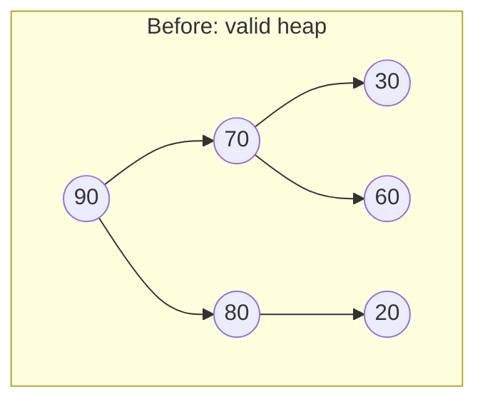
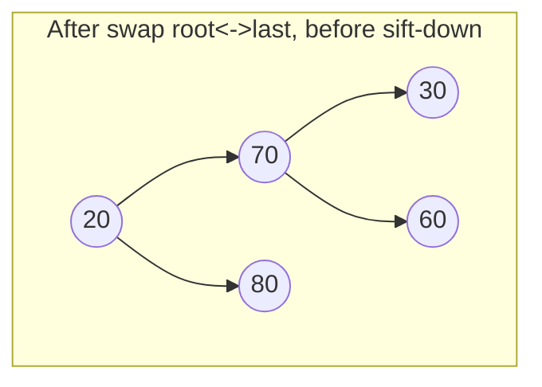
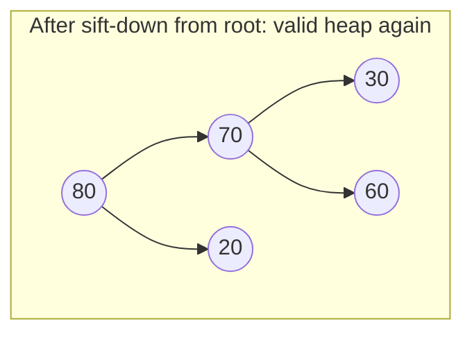

## Learning Objectives

- Implement insert (append + sift-up) and explain why appending at the end is what keeps the tree complete.
- Implement extract-max (swap root with last, remove last, sift-down from root) and explain why the swap-with-last step, rather than simply deleting the root, is what preserves completeness.
- Trace sift-up and sift-down by hand on concrete arrays, including every comparison and swap.
- Justify why both operations run in O(log n): each follows exactly one path in the tree, and the tree's height is Θ(log n) because it stays complete.
- Distinguish sift-up (insert's repair direction) from sift-down (extract's repair direction, and heapify's), and explain why insert cannot use sift-down or extract use sift-up.

## Context & Motivation

The heapify concept showed how to build a valid heap from scratch, all at once, in O(n) time when every value is available up front. But a priority queue in real use is rarely static — it's constantly being asked to add a new item (a new process arriving, a new event scheduled, a new edge discovered) and to remove the current highest-priority item (dispatch the next process, fire the next event, relax the next edge). These are the two operations that actually make a heap function as a *priority queue* over its lifetime, rather than as a one-time snapshot, and they are the two operations this concept covers: **insert** and **extract-max** (or extract-min, for a min-heap — everything below mirrors directly).

Both operations lean on the same two invariants established so far: completeness (so the array representation stays lossless, per the array-representation concept) and the heap property (so the root always holds the extreme value, per the heap-property concept). The elegant part is that both operations can be understood as "temporarily and minimally break one invariant, then repair it by walking a single path" — insert breaks completeness for an instant by placing a new value in a spot that might violate the heap property, then repairs the heap property by walking *up*; extract breaks the heap property for an instant by replacing the root, then repairs it by walking *down*. Neither operation ever needs to inspect more than one root-to-leaf (or leaf-to-root) path, which is exactly why both cost O(log n) — the tree's height, guaranteed logarithmic by completeness, is the only distance either operation ever has to travel.

## Core Theory

### Insert: append then sift-up

To insert a new value into a heap of `n` elements, append it to the end of the array — this becomes the new element at index `n` (the array's new last position). Appending at the end is what keeps the tree complete: the very next available level-order position is always exactly the end of the array, by the definition of completeness itself, so placing the new value there — and nowhere else — is the only way to add one node while preserving completeness automatically, no matter what value is being inserted.

Appending, however, says nothing about whether the new value satisfies the heap property relative to its new parent — it might be far larger than its parent (in a max-heap), violating the property immediately. **Sift-up** (or "bubble-up") repairs this: compare the new element to its parent; if it's larger, swap; repeat from the new position, walking up toward the root, until either the element finds a parent it's not larger than, or it reaches the root.

```python
def sift_up(arr, i):
    while i > 0:
        p = (i - 1) // 2
        if arr[i] <= arr[p]:
            break  # heap property holds against this parent; done
        arr[i], arr[p] = arr[p], arr[i]
        i = p

def insert(arr, value):
    arr.append(value)
    sift_up(arr, len(arr) - 1)
```

Sift-up only ever walks upward along the single path from the new leaf to the root, so its cost is bounded by the tree's height — O(log n), since completeness guarantees height stays Θ(log n) regardless of insertion order (a guarantee a BST does not have).

### Extract-max: swap root with last, shrink, then sift-down

To remove the maximum (always the root, by the heap property), the naive move — just delete index 0 — would leave a gap at the root and force every other element to shift up by one position, an O(n) operation, and would also destroy the parent/child index relationships for everything that moved. The actual algorithm avoids this entirely: swap the root with the *last* element in the array, shrink the array by one (removing what is now the last element — the old root, now safely at the end and returned as the answer), and then sift-down from the root to repair whatever violation the swap introduced.

```python
def extract_max(arr):
    if not arr:
        raise IndexError("extract_max from empty heap")
    max_val = arr[0]
    last = arr.pop()          # remove and hold the last element
    if arr:                   # if anything remains, put it at the root and fix up
        arr[0] = last
        sift_down(arr, 0, len(arr))
    return max_val
```

(`sift_down` here is exactly the operation defined in the heapify concept — compare a node to its two children, swap with the larger if it's out of order, continue from the new position.) Swapping in the *last* element specifically is what preserves completeness: removing the very last level-order position is the only removal that keeps every remaining node's position contiguous from index 0, exactly mirroring why insertion could only ever append at the end. Whatever value ends up at the root after the swap may violate the heap property against its new children, but sift-down repairs that by walking down a single path — again bounded by the tree's height, O(log n).







90 is extracted; 20 (the old last element) takes the root's place, immediately violating the property against both 70 and 80; sift-down compares 20 to its children (70, 80), swaps with the larger (80), and — since 20 is now a leaf position with no children — stops. One path, one swap, done.

### Why the direction of repair cannot be swapped between the two operations

Insert always repairs by sifting *up*, never down, because the only invariant it disturbs is "does the new leaf satisfy the property against its ancestors" — everything else in the tree was already a valid heap before the insertion, so there is nothing below the new leaf that could possibly need fixing (it has no children yet). Extract always repairs by sifting *down*, never up, because the disturbed node (the old last element, now at the root) has two full subtrees beneath it that are still independently valid heaps — the violation, if any, is strictly between the new root and its children, never between the new root and something further down that needs walking past its immediate children, and never upward (a root has no parent to violate against, or to check). Using the wrong direction for either operation isn't just inefficient, it's outright incorrect — sifting the newly appended leaf downward would compare it to children it doesn't have and never actually check it against the ancestor chain where the real violation lives.

## Worked Examples

### Example 1 — Inserting into a heap, tracing every comparison

**Problem:** Insert `65` into the heap `[90, 70, 80, 30, 60, 75, 20]`.

**Append.** `arr = [90, 70, 80, 30, 60, 75, 20, 65]`. New element at index 7.

**Sift-up from index 7.** Parent of 7 is `(7-1)//2 = 3` (value 30). Is 65 > 30? Yes — swap: `[90, 70, 80, 65, 60, 75, 20, 30]`. Continue from index 3.

Parent of 3 is `(3-1)//2 = 1` (value 70). Is 65 > 70? No — stop.

**Result:** `[90, 70, 80, 65, 60, 75, 20, 30]`. Verify locally: index 0 (90) ≥ 70, 80 ✓; index 1 (70) ≥ 65, 60 ✓; the rest unchanged and previously valid. One swap, one comparison that failed and stopped the climb — exactly one path walked, from the new leaf up two levels toward (but not reaching) the root.

### Example 2 — Extracting the max, tracing the swap and sift-down

**Problem:** Extract the max from `[90, 70, 80, 65, 60, 75, 20, 30]` (the result of Example 1).

**Swap root with last, shrink.** Last element is `30` (index 7). Save `max_val = 90`. New array (before sift-down): `[30, 70, 80, 65, 60, 75, 20]` (length 7 now — the old last slot is gone, and 30 sits at the root).

**Sift-down from index 0.** Children of 0: index 1 (70), index 2 (80). Larger is 80. Is 30 < 80? Yes — swap: `[80, 70, 30, 65, 60, 75, 20]`. Continue from index 2 (where 30 now sits).

Children of index 2: `2(2)+1=5` (75), `2(2)+2=6` (20). Larger is 75. Is 30 < 75? Yes — swap: `[80, 70, 75, 65, 60, 30, 20]`. Continue from index 5.

Children of index 5: `2(5)+1=11`, `2(5)+2=12`, both out of range (length 7). Leaf — stop.

**Result:** `arr = [80, 70, 75, 65, 60, 30, 20]`, returned `max_val = 90`. Verify: index 0 (80) ≥ 70, 75 ✓; index 1 (70) ≥ 65, 60 ✓; index 2 (75) ≥ 30, 20 ✓. Valid heap, restored in exactly two swaps along a single downward path.

### Example 3 — Building a heap via repeated insertion vs. bottom-up heapify, and confirming both give valid (if different) results

**Problem:** Build a heap from `[3, 1, 4, 1, 5]` two ways: (a) inserting one at a time into an initially empty heap, and (b) bottom-up heapify on the array directly. Confirm both results are valid max-heaps, and note that they need not be identical.

**(a) Repeated insertion.**
```python
arr_a = []
for v in [3, 1, 4, 1, 5]:
    insert(arr_a, v)
print(arr_a)
```
Tracing: insert 3 → `[3]`. Insert 1 → `[3, 1]` (1 ≤ 3, no sift needed). Insert 4 → `[3, 1, 4]`, sift-up index 2: parent index 0 (value 3), 4 > 3, swap → `[4, 1, 3]`. Insert 1 → `[4, 1, 3, 1]`, sift-up index 3: parent index 1 (value 1), 1 ≤ 1, stop. Insert 5 → `[4, 1, 3, 1, 5]`, sift-up index 4: parent index 1 (value 1), 5 > 1, swap → `[4, 5, 3, 1, 1]`; continue from index 1: parent index 0 (value 4), 5 > 4, swap → `[5, 4, 3, 1, 1]`. Final: `[5, 4, 3, 1, 1]`.

**(b) Bottom-up heapify.**
```python
arr_b = [3, 1, 4, 1, 5]
heapify(arr_b)
print(arr_b)
```
`n=5`, `last_internal = 5//2-1 = 1`. Sift-down index 1 (value 1): children at 3 (value 1), 4 (value 5); larger is 5; 1 < 5, swap → `[3, 5, 4, 1, 1]`; continue from index 4 (leaf, stop). Sift-down index 0 (value 3): children at 1 (value 5), 2 (value 4); larger is 5; 3 < 5, swap → `[5, 3, 4, 1, 1]`; continue from index 1: children at 3 (value 1), 4 (value 1); 3 ≥ both, stop. Final: `[5, 3, 4, 1, 1]`.

**Comparison.** `[5, 4, 3, 1, 1]` versus `[5, 3, 4, 1, 1]` — different arrays, both valid max-heaps of the same five values (root 5 in both; both satisfy every parent-child check). This confirms directly what the heap-property concept noted: the heap property under-determines the exact arrangement, so two correct algorithms building "a" heap from the same values need not produce "the" same heap.

## Common Misconceptions & Pitfalls

- **"Extract-max should just remove the root and promote one of its children into the empty slot, recursively."** This is a plausible-sounding alternative, but it does not preserve completeness in general — promoting a child up and recursively filling *that* gap can easily leave the very last level-order position occupied while some earlier position sits empty, breaking the shape invariant the array representation depends on. Swap-with-last-then-sift-down is specifically designed to avoid ever creating a gap anywhere except at the true end of the array.
- **"Insert should sift the new element down, since heapify's sift-down is the 'main' repair operation."** A freshly appended leaf has no children to compare against — sifting it "down" is a no-op by construction, since a leaf's `left`/`right` indices are always out of range. The violation insert can create is only ever between the new leaf and its ancestors, which requires walking up, not down.
- **"Both insert and extract cost O(log n), so they must do roughly the same amount of work."** They both have the same asymptotic bound because both are limited to a single height-bounded path, but the actual work differs: insert's sift-up stops as soon as it finds a parent it's not bigger than (often quickly, especially for a value that isn't extreme), while extract's sift-down starts from a value that was just plucked from an arbitrary leaf position and is often quite out of place at the root, so it frequently walks the full height of the tree before stopping. Both are O(log n) worst case, but their typical-case behavior is not symmetric.
- **"Building a heap from n values by repeated insertion and by bottom-up heapify must produce the identical array, since both are 'correct'."** Example 3 shows two different, individually valid, results from the same input values — the heap property permits many valid arrangements of a given value set, and different construction orders (or different algorithms entirely) can and do land on different ones.

## Summary

Insert appends a new value at the end of the array — the only position that preserves completeness — then repairs the heap property by sifting up along the single path from that leaf toward the root, stopping as soon as the property holds. Extract-max reads the root as the answer, swaps it with the last element (the only removal that preserves completeness), shrinks the array, and repairs the heap property by sifting down along a single path from the root, stopping at whichever level the moved element finds its correct resting place. Both operations are bounded by the tree's height, which stays Θ(log n) automatically because completeness is maintained as an invariant — so both cost O(log n), regardless of the values involved, in contrast to a BST whose corresponding operations can degrade if the tree isn't separately kept balanced. Insert and extract repair in opposite directions for a structural reason, not an arbitrary convention: insert's only possible violation lies above the new leaf, and extract's only possible violation lies below the new root.

## Documentation Links

- [Sedgewick & Wayne — Algorithms Lectures (Princeton)](https://algs4.cs.princeton.edu/lectures/) — doc
- [MIT 6.006 — Lecture Notes (OCW)](https://ocw.mit.edu/courses/6-006-introduction-to-algorithms-spring-2020/pages/lecture-notes/) — doc
