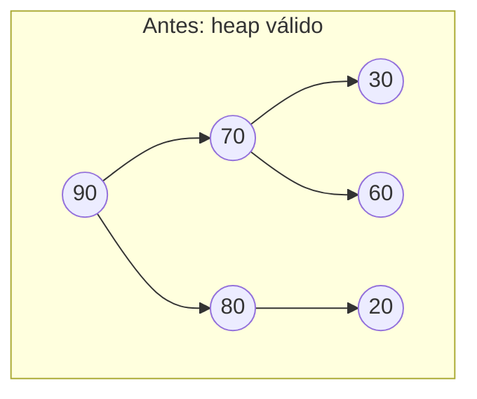
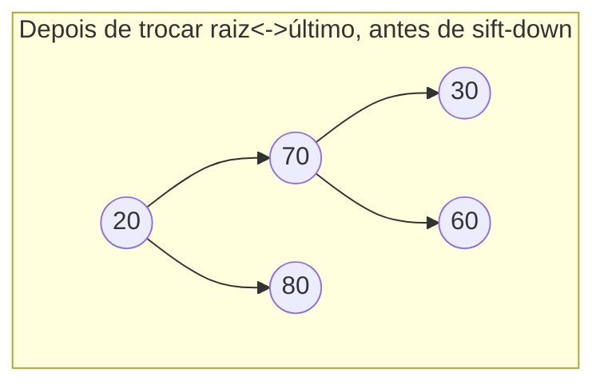
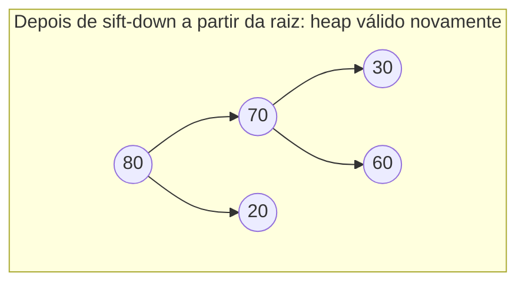

## Objetivos de Aprendizagem

- Implementar inserção (anexar + sift-up) e explicar por que anexar no final é o que mantém a árvore completa.
- Implementar extrair-máximo (trocar raiz com o último, remover o último, sift-down a partir da raiz) e explicar por que o passo de trocar-com-o-último, em vez de simplesmente deletar a raiz, é o que preserva completude.
- Rastrear sift-up e sift-down à mão em arrays concretos, incluindo toda comparação e troca.
- Justificar por que ambas as operações rodam em O(log n): cada uma segue exatamente um caminho na árvore, e a altura da árvore é Θ(log n) porque permanece completa.
- Distinguir sift-up (a direção de reparo da inserção) de sift-down (a direção de reparo da extração, e do heapify), e explicar por que inserção não pode usar sift-down ou extração usar sift-up.

## Contexto e Motivação

O conceito de heapify mostrou como construir um heap válido do zero, tudo de uma vez, em tempo O(n) quando todo valor está disponível antecipadamente. Mas uma fila de prioridade em uso real raramente é estática, está constantemente sendo solicitada para adicionar um novo item (um novo processo chegando, um novo evento agendado, uma nova aresta descoberta) e para remover o item de prioridade mais alta atual (despachar o próximo processo, disparar o próximo evento, relaxar a próxima aresta). Essas são as duas operações que de fato fazem um heap funcionar como uma *fila de prioridade* ao longo de sua vida, em vez de como uma foto instantânea única, e são as duas operações que este conceito cobre: **inserir** e **extrair-máximo** (ou extrair-mínimo, para um min-heap, tudo abaixo espelha diretamente).

Ambas as operações se apoiam nos mesmos dois invariantes estabelecidos até agora: completude (para que a representação em array permaneça sem perdas, pelo conceito de representação em array) e a propriedade de heap (para que a raiz sempre contenha o valor extremo, pelo conceito de propriedade de heap). A parte elegante é que ambas as operações podem ser entendidas como "quebre temporária e minimamente um invariante, depois o repare percorrendo um único caminho", inserir quebra completude por um instante colocando um novo valor em um lugar que pode violar a propriedade de heap, depois repara a propriedade de heap percorrendo *para cima*; extrair quebra a propriedade de heap por um instante substituindo a raiz, depois a repara percorrendo *para baixo*. Nenhuma operação jamais precisa inspecionar mais de um caminho raiz-a-folha (ou folha-a-raiz), que é exatamente por que ambas custam O(log n), a altura da árvore, garantida logarítmica por completude, é a única distância que qualquer operação jamais precisa percorrer.

## Teoria Central

### Inserir: anexar depois fazer sift-up

Para inserir um novo valor em um heap de `n` elementos, anexe-o ao final do array, isso se torna o novo elemento no índice `n` (a nova última posição do array). Anexar no final é o que mantém a árvore completa: a próxima posição em ordem de nível disponível é sempre exatamente o final do array, pela própria definição de completude, então colocar o novo valor ali, e em nenhum outro lugar, é a única forma de adicionar um nó preservando completude automaticamente, não importa qual valor esteja sendo inserido.

Anexar, no entanto, não diz nada sobre se o novo valor satisfaz a propriedade de heap em relação ao seu novo pai, pode ser muito maior que seu pai (em um max-heap), violando a propriedade imediatamente. **Sift-up** (ou "bubble-up") conserta isso: compare o novo elemento a seu pai; se é maior, troque; repita a partir da nova posição, subindo em direção à raiz, até que ou o elemento encontre um pai a que não seja maior, ou alcance a raiz.

```python
def sift_up(arr, i):
    while i > 0:
        p = (i - 1) // 2
        if arr[i] <= arr[p]:
            break  # a propriedade de heap se mantém contra esse pai; terminado
        arr[i], arr[p] = arr[p], arr[i]
        i = p

def insert(arr, value):
    arr.append(value)
    sift_up(arr, len(arr) - 1)
```

Sift-up sempre sobe apenas ao longo do único caminho da nova folha até a raiz, então seu custo é limitado pela altura da árvore, O(log n), já que completude garante que a altura permanece Θ(log n) independentemente da ordem de inserção (uma garantia que uma BST não tem).

### Extrair-máximo: trocar raiz com o último, encolher, depois fazer sift-down

Para remover o máximo (sempre a raiz, pela propriedade de heap), o movimento ingênuo, apenas deletar o índice 0, deixaria uma lacuna na raiz e forçaria todo outro elemento a mudar uma posição para cima, uma operação O(n), e também destruiria as relações de índice pai/filho para tudo que se moveu. O algoritmo real evita isso inteiramente: troque a raiz com o *último* elemento no array, encolha o array em um (removendo o que agora é o último elemento, a antiga raiz, agora seguramente no final e retornada como a resposta), e depois faça sift-down a partir da raiz para consertar qualquer violação que a troca introduziu.

```python
def extract_max(arr):
    if not arr:
        raise IndexError("extract_max from empty heap")
    max_val = arr[0]
    last = arr.pop()          # remove e guarda o último elemento
    if arr:                   # se algo permanece, coloca-o na raiz e conserta
        arr[0] = last
        sift_down(arr, 0, len(arr))
    return max_val
```

(`sift_down` aqui é exatamente a operação definida no conceito de heapify, compare um nó a seus dois filhos, troque com o maior se estiver fora de ordem, continue a partir da nova posição.) Trocar pelo *último* elemento especificamente é o que preserva completude: remover a exata última posição em ordem de nível é a única remoção que mantém a posição de todo nó restante contígua a partir do índice 0, espelhando exatamente por que inserção só poderia anexar no final. Qualquer valor que acabe na raiz depois da troca pode violar a propriedade de heap contra seus novos filhos, mas sift-down conserta isso percorrendo um único caminho para baixo, novamente limitado pela altura da árvore, O(log n).







90 é extraído; 20 (o antigo último elemento) toma o lugar da raiz, imediatamente violando a propriedade contra tanto 70 quanto 80; sift-down compara 20 a seus filhos (70, 80), troca com o maior (80), e, já que 20 agora está em uma posição de folha sem filhos, para. Um caminho, uma troca, terminado.

### Por que a direção de reparo não pode ser trocada entre as duas operações

Inserção sempre conserta fazendo sift *para cima*, nunca para baixo, porque o único invariante que perturba é "a nova folha satisfaz a propriedade contra seus ancestrais", tudo mais na árvore já era um heap válido antes da inserção, então não há nada abaixo da nova folha que possivelmente precisasse de conserto (ainda não tem filhos). Extração sempre conserta fazendo sift *para baixo*, nunca para cima, porque o nó perturbado (o antigo último elemento, agora na raiz) tem duas subárvores completas abaixo dele que ainda são independentemente heaps válidos, a violação, se houver, está estritamente entre a nova raiz e seus filhos, nunca entre a nova raiz e algo mais abaixo que precisaria percorrer além de seus filhos imediatos, e nunca para cima (uma raiz não tem pai contra o qual violar, ou verificar). Usar a direção errada para qualquer operação não é apenas ineficiente, é diretamente incorreto, fazer sift da folha recém-anexada para baixo a compararia a filhos que ela não tem e nunca de fato a verificaria contra a cadeia de ancestral onde a violação real vive.

## Exemplos Resolvidos

### Exemplo 1 — inserindo em um heap, rastreando toda comparação

**Problema:** Insira `65` no heap `[90, 70, 80, 30, 60, 75, 20]`.

**Anexe.** `arr = [90, 70, 80, 30, 60, 75, 20, 65]`. Novo elemento no índice 7.

**Sift-up a partir do índice 7.** O pai de 7 é `(7-1)//2 = 3` (valor 30). 65 > 30? Sim, troque: `[90, 70, 80, 65, 60, 75, 20, 30]`. Continue a partir do índice 3.

O pai de 3 é `(3-1)//2 = 1` (valor 70). 65 > 70? Não, pare.

**Resultado:** `[90, 70, 80, 65, 60, 75, 20, 30]`. Verifique localmente: índice 0 (90) ≥ 70, 80 ✓; índice 1 (70) ≥ 65, 60 ✓; o resto inalterado e previamente válido. Uma troca, uma comparação que falhou e parou a subida, exatamente um caminho percorrido, da nova folha subindo dois níveis em direção a (mas não alcançando) a raiz.

### Exemplo 2 — extraindo o máximo, rastreando a troca e o sift-down

**Problema:** Extraia o máximo de `[90, 70, 80, 65, 60, 75, 20, 30]` (o resultado do Exemplo 1).

**Troque a raiz pelo último, encolha.** O último elemento é `30` (índice 7). Guarde `max_val = 90`. Novo array (antes do sift-down): `[30, 70, 80, 65, 60, 75, 20]` (comprimento 7 agora, a antiga última posição se foi, e 30 fica na raiz).

**Sift-down a partir do índice 0.** Filhos de 0: índice 1 (70), índice 2 (80). O maior é 80. 30 < 80? Sim, troque: `[80, 70, 30, 65, 60, 75, 20]`. Continue a partir do índice 2 (onde 30 agora está).

Filhos do índice 2: `2(2)+1=5` (75), `2(2)+2=6` (20). O maior é 75. 30 < 75? Sim, troque: `[80, 70, 75, 65, 60, 30, 20]`. Continue a partir do índice 5.

Filhos do índice 5: `2(5)+1=11`, `2(5)+2=12`, ambos fora da faixa (comprimento 7). Folha, pare.

**Resultado:** `arr = [80, 70, 75, 65, 60, 30, 20]`, retornado `max_val = 90`. Verifique: índice 0 (80) ≥ 70, 75 ✓; índice 1 (70) ≥ 65, 60 ✓; índice 2 (75) ≥ 30, 20 ✓. Heap válido, restaurado em exatamente duas trocas ao longo de um único caminho descendente.

### Exemplo 3 — construindo um heap via inserção repetida vs. heapify de baixo para cima, e confirmando que ambos dão resultados válidos (embora diferentes)

**Problema:** Construa um heap a partir de `[3, 1, 4, 1, 5]` de duas formas: (a) inserindo um de cada vez em um heap inicialmente vazio, e (b) heapify de baixo para cima diretamente no array. Confirme que ambos os resultados são max-heaps válidos, e note que não precisam ser idênticos.

**(a) Inserção repetida.**
```python
arr_a = []
for v in [3, 1, 4, 1, 5]:
    insert(arr_a, v)
print(arr_a)
```
Rastreando: insira 3 → `[3]`. Insira 1 → `[3, 1]` (1 ≤ 3, nenhum sift necessário). Insira 4 → `[3, 1, 4]`, sift-up índice 2: índice do pai 0 (valor 3), 4 > 3, troque → `[4, 1, 3]`. Insira 1 → `[4, 1, 3, 1]`, sift-up índice 3: índice do pai 1 (valor 1), 1 ≤ 1, pare. Insira 5 → `[4, 1, 3, 1, 5]`, sift-up índice 4: índice do pai 1 (valor 1), 5 > 1, troque → `[4, 5, 3, 1, 1]`; continue a partir do índice 1: índice do pai 0 (valor 4), 5 > 4, troque → `[5, 4, 3, 1, 1]`. Final: `[5, 4, 3, 1, 1]`.

**(b) Heapify de baixo para cima.**
```python
arr_b = [3, 1, 4, 1, 5]
heapify(arr_b)
print(arr_b)
```
`n=5`, `last_internal = 5//2-1 = 1`. Sift-down índice 1 (valor 1): filhos em 3 (valor 1), 4 (valor 5); o maior é 5; 1 < 5, troque → `[3, 5, 4, 1, 1]`; continue a partir do índice 4 (folha, pare). Sift-down índice 0 (valor 3): filhos em 1 (valor 5), 2 (valor 4); o maior é 5; 3 < 5, troque → `[5, 3, 4, 1, 1]`; continue a partir do índice 1: filhos em 3 (valor 1), 4 (valor 1); 3 ≥ ambos, pare. Final: `[5, 3, 4, 1, 1]`.

**Comparação.** `[5, 4, 3, 1, 1]` versus `[5, 3, 4, 1, 1]`, arrays diferentes, ambos max-heaps válidos dos mesmos cinco valores (raiz 5 em ambos; ambos satisfazem toda verificação pai-filho). Isso confirma diretamente o que o conceito de propriedade de heap notou: a propriedade de heap sub-determina o arranjo exato, então dois algoritmos corretos construindo "um" heap a partir dos mesmos valores não precisam produzir "o" mesmo heap.

## Equívocos Comuns e Armadilhas

- **"Extrair-máximo deveria apenas remover a raiz e promover um de seus filhos para a posição vazia, recursivamente."** Esta é uma alternativa de aparência plausível, mas não preserva completude em geral, promover um filho para cima e recursivamente preencher *aquela* lacuna pode facilmente deixar a exata última posição em ordem de nível ocupada enquanto alguma posição anterior fica vazia, quebrando o invariante de formato do qual a representação em array depende. Trocar-com-o-último-depois-sift-down é especificamente projetado para evitar jamais criar uma lacuna em qualquer lugar exceto no verdadeiro final do array.
- **"Inserção deveria fazer sift do novo elemento para baixo, já que o sift-down do heapify é a operação de conserto 'principal'."** Uma folha recém-anexada não tem filhos contra os quais comparar, fazer sift-down dela é uma operação nula por construção, já que os índices `left`/`right` de uma folha sempre estão fora da faixa. A violação que inserção pode criar está apenas entre a nova folha e seus ancestrais, o que exige subir, não descer.
- **"Tanto inserção quanto extração custam O(log n), então devem fazer aproximadamente a mesma quantidade de trabalho."** Ambas têm o mesmo limite assintótico porque ambas são limitadas a um único caminho limitado por altura, mas o trabalho real difere: o sift-up da inserção para assim que encontra um pai a que não é maior (frequentemente rápido, especialmente para um valor que não é extremo), enquanto o sift-down da extração começa a partir de um valor que acabou de ser arrancado de uma posição de folha arbitrária e frequentemente está bem fora de lugar na raiz, então frequentemente percorre a altura completa da árvore antes de parar. Ambas são O(log n) no pior caso, mas seu comportamento de caso típico não é simétrico.
- **"Construir um heap a partir de n valores por inserção repetida e por heapify de baixo para cima deve produzir o array idêntico, já que ambos são 'corretos'."** O Exemplo 3 mostra dois resultados diferentes e individualmente válidos a partir dos mesmos valores de entrada, a propriedade de heap permite muitos arranjos válidos de um dado conjunto de valores, e ordens de construção diferentes (ou algoritmos inteiramente diferentes) podem e de fato caem em diferentes.

## Resumo

Inserir anexa um novo valor ao final do array, a única posição que preserva completude, depois conserta a propriedade de heap fazendo sift-up ao longo do único caminho daquela folha em direção à raiz, parando assim que a propriedade se mantém. Extrair-máximo lê a raiz como a resposta, troca-a pelo último elemento (a única remoção que preserva completude), encolhe o array, e conserta a propriedade de heap fazendo sift-down ao longo de um único caminho a partir da raiz, parando em qualquer nível onde o elemento movido encontra seu lugar de descanso correto. Ambas as operações são limitadas pela altura da árvore, que permanece Θ(log n) automaticamente porque completude é mantida como um invariante, então ambas custam O(log n), independentemente dos valores envolvidos, em contraste com uma BST cujas operações correspondentes podem degradar se a árvore não for separadamente mantida balanceada. Inserção e extração consertam em direções opostas por uma razão estrutural, não uma convenção arbitrária: a única violação possível da inserção fica acima da nova folha, e a única violação possível da extração fica abaixo da nova raiz.

## Documentation Links

- [Sedgewick & Wayne — Algorithms Lectures (Princeton)](https://algs4.cs.princeton.edu/lectures/) — doc
- [MIT 6.006 — Lecture Notes (OCW)](https://ocw.mit.edu/courses/6-006-introduction-to-algorithms-spring-2020/pages/lecture-notes/) — doc
