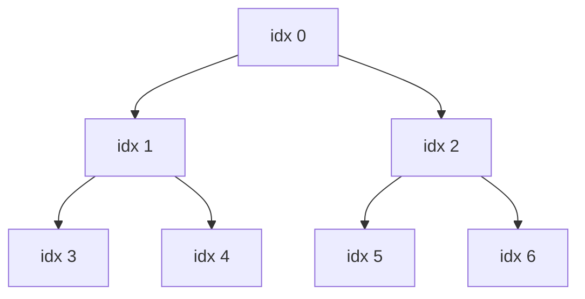
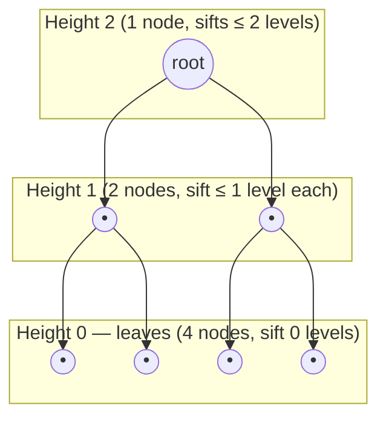

## Learning Objectives

- Implement the sift-down (bubble-down) operation that restores the heap property at a single node whose subtrees are already valid heaps.
- Implement bottom-up heapify: sift-down applied to every internal node, starting from the last non-leaf node and working back to the root.
- State why heapify must proceed from the last non-leaf node backward, rather than from the root forward.
- Derive, via the aggregate height-sum argument, why bottom-up heapify runs in O(n) time rather than the O(n log n) a naive analysis would suggest.
- Contrast bottom-up heapify against building a heap by n individual insertions, and explain why the two approaches have different asymptotic costs despite producing the same result.

## Context & Motivation

The previous concept established that a heap's array representation is only meaningful because completeness is guaranteed — every level full except possibly the last — and that the child/parent index arithmetic depends on that guarantee holding. But an arbitrary array of `n` values, freshly loaded from unsorted input, is certainly complete in *shape* (it's just a flat array, so the level-order correspondence is automatically fine) but very likely does *not* satisfy the heap *property* — nothing says index 0 holds the largest value, or that any parent is ≥ its children. Turning an arbitrary array into something that satisfies both the shape and the value-ordering guarantees a heap needs is the job of **heapify**.

The naive way to do this would be to start with an empty heap and insert the `n` values one at a time, using the insert operation from `heap-insert-and-extract` (each insertion costs O(log n), so n insertions cost O(n log n) total). That approach works, and it's exactly what you'd do if the values arrived one at a time, live. But if all `n` values are available up front — which is precisely the situation `heapsort` will be in — there is a strictly better algorithm: process the nodes bottom-up, from the last internal node back to the root, sifting each one down into place. This produces a valid heap in **O(n)** time — not O(n log n) — which is a genuinely surprising result the first time you see it, since sifting a single node down can itself cost O(log n), and there are Θ(n) nodes to process, so the naive multiplication "Θ(n) nodes × O(log n) each" suggests O(n log n) as an upper bound. The reason the actual bound is tighter is worth deriving carefully rather than accepting on faith, because the same style of aggregate argument — most of the work is cheap, only a vanishing fraction of nodes do the expensive part — recurs throughout algorithm analysis (amortized analysis of dynamic arrays and the potential-method arguments used for other data structures both lean on the identical idea).

## Core Theory

### Sift-down: restoring the heap property at one node

**Sift-down** (also called "bubble-down" or "max-heapify" in some textbooks — a naming collision worth flagging, since "heapify" is used both for this single-node operation and for the whole-array algorithm built from it) takes a node whose two subtrees are already valid max-heaps, but which may itself violate the heap property relative to its children, and repairs it. The operation: compare the node to its two children; if it is already ≥ both, stop — the property holds. Otherwise, swap it with whichever child is larger, and recurse on the position it was just swapped into (since that subtree may now itself be violated one level down).

```python
def sift_down(arr, i, n):
    """Restore the heap property at index i, assuming both subtrees of i
    are already valid max-heaps. Only considers the first n elements of arr."""
    while True:
        left, right = 2 * i + 1, 2 * i + 2
        largest = i
        if left < n and arr[left] > arr[largest]:
            largest = left
        if right < n and arr[right] > arr[largest]:
            largest = right
        if largest == i:
            break  # heap property already holds here
        arr[i], arr[largest] = arr[largest], arr[i]
        i = largest  # continue fixing up from the new position
```

Sift-down only ever follows a single root-to-leaf path downward from its starting index, so its cost is proportional to the *height* of the subtree rooted at the starting node — O(height), not O(n) — regardless of how large the whole array is.

### Bottom-up heapify: why start from the last non-leaf node, not the root

**Heapify** (the whole-array algorithm) applies sift-down to every internal node, but the order matters critically: it must proceed from the **last non-leaf node backward to the root** (i.e., in decreasing index order), never forward from the root. The reason is sift-down's own precondition: it assumes both subtrees of the node it's called on are *already* valid heaps. Leaves trivially satisfy this (no children, nothing to check), so sift-down is safe to call, with no work done, on any leaf. Working backward from the last internal node toward the root guarantees that by the time sift-down is called on any given node, both of its children's subtrees have already been processed (since children always have a strictly larger index than their parent, and the traversal order is decreasing), so they are already valid heaps — exactly the precondition sift-down needs.

The last non-leaf (internal) node in an array of length `n` sits at index `(n // 2) - 1` — this follows directly from the leaf-test formula in the previous concept (index `i` is a leaf exactly when `2i + 1 >= n`); the largest `i` failing that test is the last internal node.

```python
def heapify(arr):
    n = len(arr)
    last_internal = n // 2 - 1
    for i in range(last_internal, -1, -1):
        sift_down(arr, i, n)
    return arr
```



For `n = 7`, `last_internal = 7 // 2 - 1 = 2`, so heapify calls `sift_down` on indices 2, 1, 0 in that order — never touching indices 3 through 6 directly (they're leaves, correctly skipped since sift-down on a leaf does nothing anyway), and crucially processing index 2's subtree (leaves 5, 6) before index 0 ever runs, and index 1's subtree (leaves 3, 4) before index 0 runs — so that when sift-down finally reaches the root (index 0), both its subtrees are already guaranteed-valid heaps.

### Deriving the O(n) bound: the aggregate height-sum argument

Here is the calculation that looks like it should give O(n log n) but doesn't. Sift-down's cost at a node is O(height of the subtree at that node) — bounded by the number of levels it might have to descend. If there are roughly `n/2` internal nodes and the *worst-case* height any of them could have is O(log n) (the height of the whole tree), multiplying gives `(n/2) × O(log n) = O(n log n)`. This bound is correct but *not tight* — it's an overestimate, because it applies the tree's overall worst-case height to every node, when in reality only the handful of nodes near the root are anywhere close to that height; the vast majority of nodes are near the bottom and can only sift down a tiny distance before hitting a leaf level.

To get the tight bound, sum the actual per-node work more carefully, grouped by height rather than by node. In a complete tree of `n` nodes, at height `h` above the leaves (leaves themselves are height 0), there are **at most `⌈n / 2^(h+1)⌉`** nodes — intuitively, roughly half the nodes are leaves (height 0), roughly a quarter are one level up (height 1), roughly an eighth are height 2, and so on, halving at each successive height, because completeness packs the tree as tightly as possible near the bottom. A node at height `h` can sift down at most `h` levels before hitting a leaf, so its sift-down work is O(h). The total work across the whole heapify call is therefore bounded by:

```
Total work ≤ Σ (nodes at height h) × O(h)
           ≤ Σ_{h=0}^{log n}  (n / 2^(h+1)) × h
           =  (n/2) × Σ_{h=0}^{log n}  h / 2^h
```

The sum `Σ h / 2^h` (over all `h` from 0 to infinity) is a standard convergent series that sums to exactly **2** — it does not grow with `n` at all, it's a fixed constant regardless of how many terms are included, because each successive term shrinks geometrically fast enough to overwhelm the linear growth of `h` in the numerator. Substituting:

```
Total work ≤ (n/2) × 2 = n = O(n)
```

This is the crux of the whole derivation: the number of nodes that could possibly sift down *far* (near the root, large `h`) shrinks exponentially, while the number of nodes that sift down only a *little* (near the leaves, small `h`) is the overwhelming majority — roughly half of all nodes are leaves and do zero work, another quarter are one level up and do at most 1 step of work, and so on. The naive `(n/2) × log n` bound assumed every node might cost as much as the most expensive node; the aggregate sum shows that assumption is far too pessimistic once you account for how few nodes are actually capable of costing that much.



In this 7-node tree: 4 leaves (height 0) contribute 0 work each; 2 nodes at height 1 contribute at most 1 step each (2 total); 1 node at height 2 (the root) contributes at most 2 steps. Worst-case total: `0 + 0 + 0 + 0 + 1 + 1 + 2 = 4`, comfortably within O(n) = O(7), and far below what `(n/2) × log₂(n) ≈ 3.5 × 2.8 ≈ 10` would have suggested as an upper bound.

## Worked Examples

### Example 1 — Heapifying a small array by hand, tracking every swap

**Problem:** Turn `[4, 10, 3, 5, 1]` into a valid max-heap using bottom-up heapify.

**Setup.** `n = 5`, so `last_internal = 5 // 2 - 1 = 1`. Process indices 1, then 0.

**i = 1** (value 10). Children at `2(1)+1=3` (value 5) and `2(1)+2=4` (value 1). 10 is already ≥ both — no swap needed. Array unchanged: `[4, 10, 3, 5, 1]`.

**i = 0** (value 4). Children at 1 (value 10) and 2 (value 3). Larger child is 10 at index 1. 4 < 10, so swap: `[10, 4, 3, 5, 1]`. Continue sifting from index 1 (where 4 now sits). Children of index 1 are 3 (value 5) and 4 (value 1). Larger is 5 at index 3. 4 < 5, so swap: `[10, 5, 3, 4, 1]`. Continue from index 3 — but index 3 has children at `2(3)+1=7` and `2(3)+2=8`, both out of range (n=5), so it's a leaf; stop.

**Result:** `[10, 5, 3, 4, 1]`. Verify: index 0 (10) ≥ 5, 3 ✓; index 1 (5) ≥ 4, 1 ✓; index 2 (3) is a leaf here (children at 5, 6, out of range). Valid max-heap, built in exactly 2 comparisons-and-swaps at the root and 1 at index 1 — far fewer total operations than 5 separate O(log 5) insertions would have required.

### Example 2 — Confirming heapify order matters: doing it root-first breaks the precondition

**Problem:** Take the same array `[4, 10, 3, 5, 1]` and sift down from the root *first*, then work down, to see the failure mode.

**i = 0** (value 4) first. Children at 1 (value 10), 2 (value 3). Larger is 10; swap: `[10, 4, 3, 5, 1]`. Continue sifting from index 1 (value 4 now there). Children at 3 (value 5), 4 (value 1). Larger is 5; swap: `[10, 5, 3, 4, 1]`.

That actually happened to work out fine in this particular case — but only because index 1's subtree, at the moment the root was processed, had not yet been "fixed" by a separate pass, so sift-down's own recursive continuation ended up doing the necessary work anyway *as a side effect* of chasing the swapped element down. The real danger surfaces with a case where a node's subtree needs internal fixing *independent of* whatever gets swapped into it from above. Consider `[1, 2, 10, 3, 4]`: if index 0 (value 1) is sifted first, its children are 2 (index 1) and 10 (index 2); larger is 10, swap: `[10, 2, 1, 3, 4]`, continue from index 2 (value 1 now there) — index 2 has children at 5, 6, out of range, so it stops. But index 1 (value 2) was never checked against its own children (3 and 4 at indices 3, 4) — 2 < 4, a heap violation left completely unrepaired, because root-first processing swapped the root and moved on without ever revisiting index 1's own local violation. Bottom-up order (index 1 before index 0) would have caught and fixed this first, guaranteeing index 1's subtree was already valid before the root ever needed to compare against it.

### Example 3 — Tracing the height-sum bound on a slightly larger example

**Problem:** For `n = 15` (a perfect binary tree of height 3: 1 root + 2 + 4 + 8 leaves), compute the exact worst-case total sift-down work via the height-sum formula, and compare it to the naive `(n/2) log n` estimate.

**Height-sum calculation.** Nodes at height 0 (leaves): 8, each costing 0. Height 1: 4 nodes, each costing at most 1. Height 2: 2 nodes, each costing at most 2. Height 3 (root): 1 node, costing at most 3.

```
Total ≤ 8(0) + 4(1) + 2(2) + 1(3) = 0 + 4 + 4 + 3 = 11
```

**Naive estimate.** `(n/2) × log₂(n) = 7.5 × log₂(15) ≈ 7.5 × 3.9 ≈ 29.3`.

The actual worst-case bound (11) is well under half of what the naive per-node-worst-case multiplication (≈29) suggested, and the gap only widens as `n` grows, since the height-sum approach gives a bound that grows linearly in `n` while the naive one grows as `n log n` — for `n = 1,000,000`, the height-sum bound stays proportional to `n`, while `(n/2) log n` would suggest roughly ten times more work than actually occurs.

## Common Misconceptions & Pitfalls

- **"Heapify costs O(n log n) because there are n nodes and each sift-down is O(log n)."** This is the exact naive-multiplication trap the Core Theory section derives past: it applies the *tree's* worst-case height to *every* node, but the overwhelming majority of nodes sit near the bottom of the tree and have almost no room to sift down. The tight bound requires summing actual per-node work grouped by height, which the geometric series `Σ h/2^h = 2` collapses to O(n), not O(n log n).
- **"You can heapify by sifting down from the root forward to the last node — order doesn't really matter, as long as every internal node gets processed."** Example 2 shows this directly breaks: sift-down's correctness depends on its precondition that both subtrees of the node it's called on are already valid heaps. Processing top-down violates that precondition for every call except possibly the very first, and can leave real violations unrepaired, as the `[1, 2, 10, 3, 4]` case demonstrated.
- **"Heapify and n individual insertions must cost the same, since they both end up building a heap out of n values."** They produce *a* valid heap either way (not necessarily the identical arrangement, since heaps aren't unique for a given value set), but the cost is genuinely different: n insertions cost O(n log n) because each insertion independently pays up to O(log n) to sift a single new element up from the bottom, while bottom-up heapify's O(n) bound comes from the fact that most of its sift-downs are cheap (near the leaves) — an asymmetry that insertion, which always starts a new element at the bottom and sifts *up*, cannot exploit in the same way.
- **"The `last_internal = n // 2 - 1` formula is a special-case trick specific to heapify."** It is simply the leaf-test formula from the array-representation concept (`i` is a leaf iff `2i+1 >= n`) solved for the largest non-leaf `i` — the same underlying arithmetic reused, not a new, unrelated rule to memorize separately.

## Summary

Sift-down repairs the heap property at a single node whose two subtrees are already valid heaps, and costs O(height of that subtree). Bottom-up heapify applies sift-down to every internal node in decreasing index order — from the last non-leaf node, `n // 2 - 1`, back to the root — which is required precisely because sift-down's precondition (both subtrees already valid) is only guaranteed to hold in that processing order. Although a naive per-node bound suggests O(n log n) (Θ(n) internal nodes, each up to O(log n)), the tight analysis groups nodes by height rather than by count: roughly half the nodes are leaves doing zero work, a quarter do at most one step, an eighth at most two, and so on, and the resulting sum `Σ (n / 2^(h+1)) × h` collapses via the convergent series `Σ h/2^h = 2` to a total of O(n) — a genuinely tighter and non-obvious bound, not merely an asserted one. This is strictly better than building the same heap via n individual O(log n) insertions, which costs O(n log n) overall, because insertion's up-sifting cannot exploit the same "most nodes are near the bottom" asymmetry that down-sifting does.

## Documentation Links

- [MIT 6.006 — Lecture Notes (OCW)](https://ocw.mit.edu/courses/6-006-introduction-to-algorithms-spring-2020/pages/lecture-notes/) — doc
- [ACM/IEEE CS2013 — Algorithms and Complexity Knowledge Area](https://csed.acm.org/cs2013-version/) — doc
