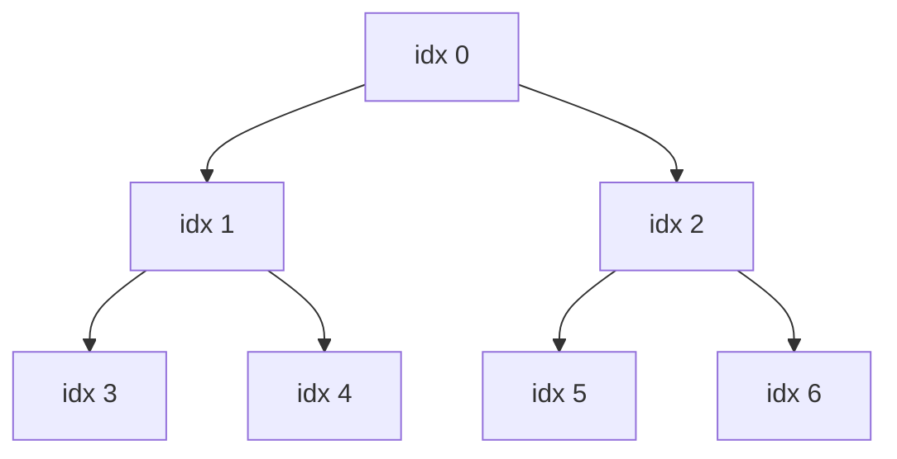
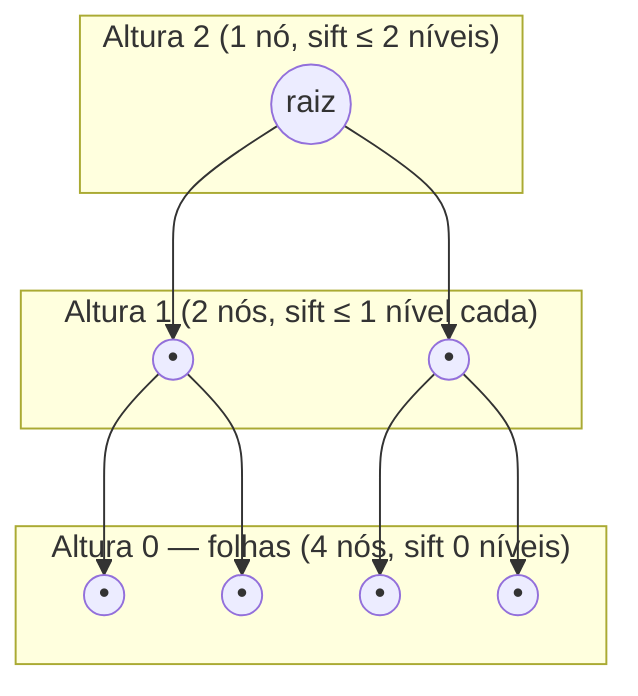

## Objetivos de Aprendizagem

- Implementar a operação de sift-down (bubble-down) que restaura a propriedade de heap em um único nó cujas subárvores já são heaps válidos.
- Implementar heapify de baixo para cima: sift-down aplicado a todo nó interno, começando do último nó não-folha e voltando até a raiz.
- Enunciar por que heapify deve proceder do último nó não-folha para trás, em vez da raiz para frente.
- Derivar, via o argumento agregado de soma de altura, por que heapify de baixo para cima roda em tempo O(n) em vez do O(n log n) que uma análise ingênua sugeriria.
- Contrastar heapify de baixo para cima contra construir um heap por n inserções individuais, e explicar por que as duas abordagens têm custos assintóticos diferentes apesar de produzirem o mesmo resultado.

## Contexto e Motivação

O conceito anterior estabeleceu que a representação em array de um heap só é significativa porque completude é garantida, todo nível cheio exceto possivelmente o último, e que a aritmética de índice filho/pai depende dessa garantia se manter. Mas um array arbitrário de `n` valores, recém-carregado de entrada não ordenada, certamente é completo em *formato* (é apenas um array plano, então a correspondência em ordem de nível está automaticamente correta) mas muito provavelmente *não* satisfaz a *propriedade* de heap, nada diz que o índice 0 contém o maior valor, ou que qualquer pai é ≥ seus filhos. Transformar um array arbitrário em algo que satisfaz tanto as garantias de formato quanto de ordenação de valor de que um heap precisa é o trabalho do **heapify**.

A forma ingênua de fazer isso seria começar com um heap vazio e inserir os `n` valores um de cada vez, usando a operação de inserção de `heap-insert-and-extract` (cada inserção custa O(log n), então n inserções custam O(n log n) no total). Essa abordagem funciona, e é exatamente o que você faria se os valores chegassem um de cada vez, ao vivo. Mas se todos os `n` valores estão disponíveis antecipadamente, que é precisamente a situação em que `heapsort` estará, há um algoritmo estritamente melhor: processe os nós de baixo para cima, do último nó interno de volta até a raiz, fazendo sift-down de cada um até seu lugar. Isso produz um heap válido em tempo **O(n)**, não O(n log n), que é um resultado genuinamente surpreendente na primeira vez que você o vê, já que fazer sift-down de um único nó pode em si custar O(log n), e há Θ(n) nós para processar, então a multiplicação ingênua "Θ(n) nós × O(log n) cada" sugere O(n log n) como um limite superior. A razão pela qual o limite real é mais apertado vale a pena derivar cuidadosamente em vez de aceitar por fé, porque o mesmo estilo de argumento agregado, a maior parte do trabalho é barata, apenas uma fração decrescente de nós faz a parte cara, reaparece ao longo da análise de algoritmo (análise amortizada de arrays dinâmicos e os argumentos de método de potencial usados para outras estruturas de dados ambos se apoiam na ideia idêntica).

## Teoria Central

### Sift-down: restaurando a propriedade de heap em um nó

**Sift-down** (também chamado de "bubble-down" ou "max-heapify" em alguns livros-texto, uma colisão de nomenclatura que vale a pena sinalizar, já que "heapify" é usado tanto para essa operação de nó único quanto para o algoritmo de array inteiro construído a partir dela) pega um nó cujas duas subárvores já são max-heaps válidos, mas que ele mesmo pode violar a propriedade de heap em relação a seus filhos, e o conserta. A operação: compare o nó a seus dois filhos; se ele já é ≥ ambos, pare, a propriedade se mantém. Caso contrário, troque-o com qualquer que seja o filho maior, e recorra na posição para a qual acabou de ser trocado (já que aquela subárvore agora pode ela mesma estar violada um nível abaixo).

```python
def sift_down(arr, i, n):
    """Restaura a propriedade de heap no índice i, assumindo que ambas as subárvores de i
    já são max-heaps válidos. Só considera os primeiros n elementos de arr."""
    while True:
        left, right = 2 * i + 1, 2 * i + 2
        largest = i
        if left < n and arr[left] > arr[largest]:
            largest = left
        if right < n and arr[right] > arr[largest]:
            largest = right
        if largest == i:
            break  # a propriedade de heap já se mantém aqui
        arr[i], arr[largest] = arr[largest], arr[i]
        i = largest  # continua consertando a partir da nova posição
```

Sift-down sempre segue apenas um único caminho raiz-a-folha descendo a partir de seu índice inicial, então seu custo é proporcional à *altura* da subárvore enraizada no nó inicial, O(altura), não O(n), independentemente de quão grande seja o array inteiro.

### Heapify de baixo para cima: por que começar do último nó não-folha, não da raiz

O **Heapify** (o algoritmo de array inteiro) aplica sift-down a todo nó interno, mas a ordem importa criticamente: deve proceder do **último nó não-folha de volta até a raiz** (ou seja, em ordem de índice decrescente), nunca da raiz para frente. A razão é a própria precondição do sift-down: ele assume que ambas as subárvores do nó em que é chamado já são heaps válidos. Folhas satisfazem isso trivialmente (sem filhos, nada a verificar), então é seguro chamar sift-down, sem nenhum trabalho feito, em qualquer folha. Trabalhar para trás a partir do último nó interno em direção à raiz garante que, no momento em que sift-down é chamado em qualquer dado nó, ambas as subárvores de seus filhos já foram processadas (já que filhos sempre têm um índice estritamente maior que seu pai, e a ordem de travessia é decrescente), então já são heaps válidos, exatamente a precondição de que sift-down precisa.

O último nó não-folha (interno) em um array de comprimento `n` fica no índice `(n // 2) - 1`, isso segue diretamente da fórmula de teste de folha do conceito anterior (o índice `i` é uma folha exatamente quando `2i + 1 >= n`); o maior `i` que falha nesse teste é o último nó interno.

```python
def heapify(arr):
    n = len(arr)
    last_internal = n // 2 - 1
    for i in range(last_internal, -1, -1):
        sift_down(arr, i, n)
    return arr
```



Para `n = 7`, `last_internal = 7 // 2 - 1 = 2`, então heapify chama `sift_down` nos índices 2, 1, 0 nessa ordem, nunca tocando os índices 3 a 6 diretamente (são folhas, corretamente pulados já que sift-down em uma folha não faz nada de qualquer forma), e crucialmente processando a subárvore do índice 2 (folhas 5, 6) antes de o índice 0 rodar, e a subárvore do índice 1 (folhas 3, 4) antes de o índice 0 rodar, de modo que quando sift-down finalmente alcança a raiz (índice 0), ambas as suas subárvores já são heaps garantidamente válidos.

### Derivando o limite O(n): o argumento agregado de soma de altura

Aqui está o cálculo que parece que deveria dar O(n log n) mas não dá. O custo do sift-down em um nó é O(altura da subárvore naquele nó), limitado pelo número de níveis que ele pode ter que descer. Se há aproximadamente `n/2` nós internos e a altura de *pior caso* que qualquer um deles poderia ter é O(log n) (a altura da árvore inteira), multiplicar dá `(n/2) × O(log n) = O(n log n)`. Esse limite está correto mas *não é apertado*, é uma superestimativa, porque aplica a altura de pior caso geral da árvore a todo nó, quando na realidade apenas o punhado de nós perto da raiz está sequer perto dessa altura; a vasta maioria dos nós está perto do fundo e só pode fazer sift-down por uma distância minúscula antes de atingir um nível de folha.

Para obter o limite apertado, some o trabalho real por nó mais cuidadosamente, agrupado por altura em vez de por contagem de nó. Em uma árvore completa de `n` nós, na altura `h` acima das folhas (as próprias folhas são altura 0), há **no máximo `⌈n / 2^(h+1)⌉`** nós, intuitivamente, aproximadamente metade dos nós são folhas (altura 0), aproximadamente um quarto está um nível acima (altura 1), aproximadamente um oitavo é altura 2, e assim por diante, pela metade a cada altura sucessiva, porque completude empacota a árvore o mais apertado possível perto do fundo. Um nó na altura `h` pode fazer sift-down no máximo `h` níveis antes de atingir uma folha, então seu trabalho de sift-down é O(h). O trabalho total através de toda a chamada de heapify é portanto limitado por:

```
Trabalho total ≤ Σ (nós na altura h) × O(h)
              ≤ Σ_{h=0}^{log n}  (n / 2^(h+1)) × h
              =  (n/2) × Σ_{h=0}^{log n}  h / 2^h
```

A soma `Σ h / 2^h` (sobre todo `h` de 0 até infinito) é uma série convergente padrão que soma exatamente **2**, não cresce com `n` de forma alguma, é uma constante fixa independentemente de quantos termos são incluídos, porque cada termo sucessivo encolhe geometricamente rápido o suficiente para superar o crescimento linear de `h` no numerador. Substituindo:

```
Trabalho total ≤ (n/2) × 2 = n = O(n)
```

Este é o cerne de toda a derivação: o número de nós que poderiam possivelmente fazer sift-down *longe* (perto da raiz, `h` grande) encolhe exponencialmente, enquanto o número de nós que fazem sift-down apenas um *pouco* (perto das folhas, `h` pequeno) é a vasta maioria, aproximadamente metade de todos os nós são folhas e fazem zero trabalho, outro quarto está um nível acima e faz no máximo 1 passo de trabalho, e assim por diante. O limite ingênuo `(n/2) × log n` assumiu que todo nó poderia custar tanto quanto o nó mais caro; a soma agregada mostra que essa suposição é longe demais pessimista uma vez que você contabiliza quão poucos nós de fato são capazes de custar tanto.



Nesta árvore de 7 nós: 4 folhas (altura 0) contribuem 0 trabalho cada; 2 nós na altura 1 contribuem no máximo 1 passo cada (2 no total); 1 nó na altura 2 (a raiz) contribui no máximo 2 passos. Total de pior caso: `0 + 0 + 0 + 0 + 1 + 1 + 2 = 4`, confortavelmente dentro de O(n) = O(7), e bem abaixo do que `(n/2) × log₂(n) ≈ 3,5 × 2,8 ≈ 10` teria sugerido como um limite superior.

## Exemplos Resolvidos

### Exemplo 1 — fazendo heapify de um pequeno array à mão, rastreando toda troca

**Problema:** Transforme `[4, 10, 3, 5, 1]` em um max-heap válido usando heapify de baixo para cima.

**Configuração.** `n = 5`, então `last_internal = 5 // 2 - 1 = 1`. Processe os índices 1, depois 0.

**i = 1** (valor 10). Filhos em `2(1)+1=3` (valor 5) e `2(1)+2=4` (valor 1). 10 já é ≥ ambos, nenhuma troca necessária. Array inalterado: `[4, 10, 3, 5, 1]`.

**i = 0** (valor 4). Filhos em 1 (valor 10) e 2 (valor 3). O filho maior é 10 no índice 1. 4 < 10, então troque: `[10, 4, 3, 5, 1]`. Continue fazendo sift a partir do índice 1 (onde 4 agora está). Os filhos do índice 1 são 3 (valor 5) e 4 (valor 1). O maior é 5 no índice 3. 4 < 5, então troque: `[10, 5, 3, 4, 1]`. Continue a partir do índice 3, mas o índice 3 tem filhos em `2(3)+1=7` e `2(3)+2=8`, ambos fora da faixa (n=5), então é uma folha; pare.

**Resultado:** `[10, 5, 3, 4, 1]`. Verifique: índice 0 (10) ≥ 5, 3 ✓; índice 1 (5) ≥ 4, 1 ✓; índice 2 (3) é uma folha aqui (filhos em 5, 6, fora da faixa). Max-heap válido, construído em exatamente 2 comparações-e-trocas na raiz e 1 no índice 1, muito menos operações totais do que 5 inserções O(log 5) separadas teriam exigido.

### Exemplo 2 — confirmando que a ordem de heapify importa: fazer da raiz primeiro quebra a precondição

**Problema:** Pegue o mesmo array `[4, 10, 3, 5, 1]` e faça sift-down a partir da raiz *primeiro*, depois desça, para ver o modo de falha.

**i = 0** (valor 4) primeiro. Filhos em 1 (valor 10), 2 (valor 3). O maior é 10; troque: `[10, 4, 3, 5, 1]`. Continue fazendo sift a partir do índice 1 (valor 4 agora ali). Filhos em 3 (valor 5), 4 (valor 1). O maior é 5; troque: `[10, 5, 3, 4, 1]`.

Isso na verdade acabou funcionando bem neste caso específico, mas apenas porque a subárvore do índice 1, no momento em que a raiz foi processada, ainda não tinha sido "consertada" por uma passagem separada, então a própria continuação recursiva do sift-down acabou fazendo o trabalho necessário de qualquer forma *como efeito colateral* de perseguir o elemento trocado descendo. O perigo real surge com um caso onde a subárvore de um nó precisa de conserto interno *independentemente* do que quer que seja trocado para dentro dela de cima. Considere `[1, 2, 10, 3, 4]`: se o índice 0 (valor 1) é feito sift primeiro, seus filhos são 2 (índice 1) e 10 (índice 2); o maior é 10, troque: `[10, 2, 1, 3, 4]`, continue a partir do índice 2 (valor 1 agora ali), o índice 2 tem filhos em 5, 6, fora da faixa, então para. Mas o índice 1 (valor 2) nunca foi verificado contra seus próprios filhos (3 e 4 nos índices 3, 4), 2 < 4, uma violação de heap deixada completamente sem reparo, porque o processamento da raiz primeiro trocou a raiz e seguiu em frente sem nunca revisitar a própria violação local do índice 1. Ordem de baixo para cima (índice 1 antes do índice 0) teria capturado e consertado isso primeiro, garantindo que a subárvore do índice 1 já era válida antes de a raiz sequer precisar compará-la.

### Exemplo 3 — rastreando o limite de soma de altura em um exemplo um pouco maior

**Problema:** Para `n = 15` (uma árvore binária perfeita de altura 3: 1 raiz + 2 + 4 + 8 folhas), calcule o trabalho total de sift-down de pior caso exato via a fórmula de soma de altura, e compare-o com a estimativa ingênua `(n/2) log n`.

**Cálculo de soma de altura.** Nós na altura 0 (folhas): 8, cada um custando 0. Altura 1: 4 nós, cada um custando no máximo 1. Altura 2: 2 nós, cada um custando no máximo 2. Altura 3 (raiz): 1 nó, custando no máximo 3.

```
Total ≤ 8(0) + 4(1) + 2(2) + 1(3) = 0 + 4 + 4 + 3 = 11
```

**Estimativa ingênua.** `(n/2) × log₂(n) = 7,5 × log₂(15) ≈ 7,5 × 3,9 ≈ 29,3`.

O limite de pior caso real (11) está bem abaixo da metade do que a multiplicação ingênua de pior-caso-por-nó (≈29) sugeriu, e a lacuna só se amplia conforme `n` cresce, já que a abordagem de soma de altura dá um limite que cresce linearmente em `n` enquanto o ingênuo cresce como `n log n`, para `n = 1.000.000`, o limite de soma de altura permanece proporcional a `n`, enquanto `(n/2) log n` sugeriria aproximadamente dez vezes mais trabalho do que de fato ocorre.

## Equívocos Comuns e Armadilhas

- **"Heapify custa O(n log n) porque há n nós e cada sift-down é O(log n)."** Esta é exatamente a armadilha de multiplicação ingênua que a seção de Teoria Central deriva para além: ela aplica a altura de pior caso da *árvore* a *todo* nó, mas a vasta maioria dos nós fica perto do fundo da árvore e tem quase nenhum espaço para fazer sift-down. O limite apertado exige somar o trabalho real por nó agrupado por altura, que a série geométrica `Σ h/2^h = 2` colapsa para O(n), não O(n log n).
- **"Você pode fazer heapify fazendo sift-down da raiz para frente até o último nó, a ordem não importa realmente, contanto que todo nó interno seja processado."** O Exemplo 2 mostra que isso quebra diretamente: a correção do sift-down depende de sua precondição de que ambas as subárvores do nó em que é chamado já são heaps válidos. Processar de cima para baixo viola essa precondição para toda chamada exceto possivelmente a primeiríssima, e pode deixar violações reais sem reparo, como o caso `[1, 2, 10, 3, 4]` demonstrou.
- **"Heapify e n inserções individuais devem custar o mesmo, já que ambos acabam construindo um heap a partir de n valores."** Ambos produzem *um* heap válido de qualquer forma (não necessariamente o arranjo idêntico, já que heaps não são únicos para um dado conjunto de valores), mas o custo é genuinamente diferente: n inserções custam O(n log n) porque cada inserção paga independentemente até O(log n) para fazer sift-up de um único novo elemento a partir do fundo, enquanto o limite O(n) do heapify de baixo para cima vem do fato de que a maioria de seus sift-downs são baratos (perto das folhas), uma assimetria que inserção, que sempre começa um novo elemento no fundo e faz sift *para cima*, não pode explorar da mesma forma.
- **"A fórmula `last_internal = n // 2 - 1` é um truque de caso especial específico do heapify."** É simplesmente a fórmula de teste de folha do conceito de representação em array (`i` é uma folha sse `2i+1 >= n`) resolvida para o maior `i` não-folha, a mesma aritmética subjacente reutilizada, não uma nova regra não relacionada para memorizar separadamente.

## Resumo

Sift-down conserta a propriedade de heap em um único nó cujas duas subárvores já são heaps válidos, e custa O(altura daquela subárvore). Heapify de baixo para cima aplica sift-down a todo nó interno em ordem de índice decrescente, do último nó não-folha, `n // 2 - 1`, de volta até a raiz, o que é exigido precisamente porque a precondição do sift-down (ambas as subárvores já válidas) só é garantida a se manter nessa ordem de processamento. Embora um limite ingênuo por nó sugira O(n log n) (Θ(n) nós internos, cada um até O(log n)), a análise apertada agrupa nós por altura em vez de por contagem: aproximadamente metade dos nós são folhas fazendo zero trabalho, um quarto faz no máximo um passo, um oitavo no máximo dois, e assim por diante, e a soma resultante `Σ (n / 2^(h+1)) × h` colapsa via a série convergente `Σ h/2^h = 2` para um total de O(n), um limite genuinamente mais apertado e não óbvio, não meramente um afirmado. Isso é estritamente melhor que construir o mesmo heap via n inserções O(log n) individuais, que custa O(n log n) no total, porque o sift-up da inserção não consegue explorar a mesma assimetria de "a maioria dos nós está perto do fundo" que o sift-down consegue.

## Documentation Links

- [MIT 6.006 — Lecture Notes (OCW)](https://ocw.mit.edu/courses/6-006-introduction-to-algorithms-spring-2020/pages/lecture-notes/) — doc
- [ACM/IEEE CS2013 — Algorithms and Complexity Knowledge Area](https://csed.acm.org/cs2013-version/) — doc
