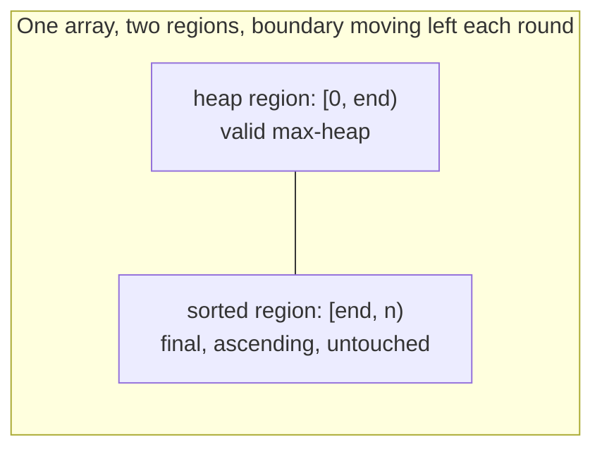

## Learning Objectives

- Implement heapsort as two phases: build a max-heap in place with heapify, then repeatedly extract the max into the back of the same array.
- Explain why heapsort is in-place, requiring no auxiliary array, and trace exactly how the "sorted" and "heap" regions of the array grow and shrink within one buffer.
- Derive heapsort's total O(n log n) running time from its two phases' individual costs (O(n) heapify, then n rounds of O(log n) sift-down).
- Compare heapsort's guarantees against merge sort's and quicksort's, specifically on memory usage and worst-case time.
- Trace heapsort by hand on a small array, showing the array's contents after every extraction.

## Context & Motivation

Every piece of machinery needed for heapsort has already been built: `heapify-building-a-heap-in-linear-time` showed how to turn an arbitrary array into a valid max-heap in O(n) time, and `heap-insert-and-extract` showed how to remove the maximum from a heap in O(log n) by swapping it to the back of the array and sifting down. Heapsort is not a new algorithm requiring new machinery — it is the observation that chaining these two already-understood pieces together, in a specific way, sorts an array in place: heapify the whole array once, and then repeatedly extract the max, but instead of throwing the extracted value away or copying it elsewhere, let it come to rest in the very slot that extraction's "swap with last" step already vacates for it.

This matters as more than a cute trick, because it puts heapsort in genuinely useful company among the comparison-based sorts a computer science curriculum covers. Merge sort guarantees O(n log n) in the worst case, but needs O(n) auxiliary space to merge into — it cannot sort in place without giving up its stability or its running-time guarantee. Quicksort sorts in place and is extremely fast in practice, but its worst-case running time is O(n²), a risk that only careful pivot selection (or randomization) mitigates rather than eliminates. Heapsort is the sort that keeps *both* of the properties the other two each have to give up one of: an O(n log n) worst-case guarantee, matching merge sort, *and* in-place operation with no extra array, matching quicksort's memory profile. The price it pays instead is a practical one, not an asymptotic one — heapsort's inner loop tends to have worse cache behavior than quicksort's (the sift-down step jumps around the array via index arithmetic rather than scanning contiguous ranges) and it is not a stable sort, so it is not automatically the "best" choice in practice, but it is the clean textbook answer to "can I have merge sort's guarantee without merge sort's memory cost?"

## Core Theory

### Phase 1: heapify the whole array

The first phase is exactly the heapify algorithm already developed: starting from the last non-leaf node (`n // 2 - 1`) and working backward to the root, sift each internal node down so its subtree becomes a valid max-heap. After this phase, the entire array — treated as an implicit complete binary tree — satisfies the max-heap property, and in particular, `arr[0]` holds the maximum value in the array. This phase costs O(n), by the aggregate height-sum argument already derived in the heapify concept — it is not re-derived here, only reused.

### Phase 2: repeatedly extract the max into the back of the array

The second phase performs `n - 1` rounds of essentially the extract-max operation, but with one adjustment: instead of shrinking the array by popping the last element off entirely (as a standalone heap's extract-max does), heapsort keeps the array at its full length throughout and simply treats a shrinking *prefix* as "still a heap" and a growing *suffix* as "already sorted." Concretely, each round: swap `arr[0]` (the current maximum, of whatever portion is still being treated as a heap) with `arr[k]`, where `k` is the last index of the still-active heap region; then shrink the heap region's boundary by one (so index `k` is now permanently outside it, holding a value that is now in its final sorted position); then sift-down from the root, but only within the new, smaller heap region.

```python
def heapsort(arr):
    n = len(arr)
    # Phase 1: build a max-heap in place, O(n)
    for i in range(n // 2 - 1, -1, -1):
        sift_down(arr, i, n)
    # Phase 2: repeatedly move the max to the end, shrinking the heap region
    for end in range(n - 1, 0, -1):
        arr[0], arr[end] = arr[end], arr[0]   # move current max to its final spot
        sift_down(arr, 0, end)                # restore heap property, only within [0, end)
    return arr
```

Because `sift_down` is called with a shrinking `n` parameter (`end`, decreasing each round), it never touches the already-sorted suffix — it treats indices `end` and beyond as simply not existing, so the maximum, once placed at index `end`, is never disturbed again by any later round.



This is exactly what "in-place" means here: there is only ever one array in memory. The heap region and the sorted region are not separate storage — they are just two disjoint index ranges within the same buffer, and each round of phase 2 shrinks the first range by exactly one and grows the second by exactly one, until the heap region is empty and the entire array is the sorted region.

### Deriving the O(n log n) total

Phase 1 costs O(n), as already established. Phase 2 performs exactly `n - 1` rounds; each round does one swap (O(1)) and one sift-down call, and the sift-down at round `k` operates on a heap of size at most `n` (in the worst case, close to the original size, since the heap region only shrinks by one per round), so each round's sift-down costs O(log n) in the worst case (bounded by the height of a heap of size up to `n`). Summing `n - 1` rounds each costing O(log n):

```
Phase 2 total ≤ (n - 1) × O(log n) = O(n log n)
```

Total cost: `O(n)` (phase 1) `+ O(n log n)` (phase 2) `= O(n log n)`, since the `O(n log n)` term dominates the `O(n)` term for large `n`. This bound holds in the worst case, not merely on average — unlike quicksort, there is no adversarial input that pushes heapsort's phase 2 above O(log n) per round, because sift-down's cost is always bounded by the current heap's height, which itself never exceeds O(log (current heap size)) regardless of what values are present, since completeness (not value distribution) is what determines height.

### Comparing the three classic O(n log n)-class sorts

| | Worst-case time | Extra space | In-place? | Stable? |
|---|---|---|---|---|
| Merge sort | O(n log n) guaranteed | O(n) auxiliary array | No | Yes |
| Quicksort | O(n²) worst case (rare with good pivoting) | O(log n) recursion stack (typical) | Yes | No |
| Heapsort | O(n log n) guaranteed | O(1) auxiliary | Yes | No |

Heapsort is the sort that guarantees merge sort's worst-case bound while matching quicksort's in-place memory profile — a combination neither of the other two achieves on its own. It gives up quicksort's typically excellent constant factors (heapsort's sift-down accesses array locations far apart from each other, via index arithmetic, which tends to produce more cache misses than quicksort's mostly-sequential partitioning scans) and gives up merge sort's stability (heapsort can and does reorder equal elements relative to each other, since the heap property only ever compares values, never original positions). In a course context, heapsort is most valuable not as "the fastest sort in practice" but as the concrete existence proof that O(n log n)-worst-case and O(1)-extra-space are simultaneously achievable — a combination that is not obvious until you see this algorithm construct it directly out of pieces already built for an entirely different purpose (priority queues).

## Worked Examples

### Example 1 — Full heapsort trace on a small array

**Problem:** Sort `[4, 10, 3, 5, 1]` using heapsort, showing the array after phase 1 and after every round of phase 2.

**Phase 1 (heapify).** This is exactly Example 1 from the heapify concept: result `[10, 5, 3, 4, 1]`.

**Phase 2, round 1** (`end = 4`). Swap `arr[0]` (10) and `arr[4]` (1): `[1, 5, 3, 4, 10]`. Index 4 is now sorted (holds the true maximum, 10, in its final position). Sift-down from index 0, within range `[0, 4)`: children of 0 are indices 1 (value 5), 2 (value 3); larger is 5; 1 < 5, swap: `[5, 1, 3, 4, 10]`; continue from index 1: children at 3 (value 4); `2(1)+2=4` is out of the active range (`end=4` means only indices 0–3 are in play); compare only against index 3 (value 4); 1 < 4, swap: `[5, 4, 3, 1, 10]`; continue from index 3: children at 7, 8, both out of range — stop.

**Round 2** (`end = 3`). Swap `arr[0]` (5) and `arr[3]` (1): `[1, 4, 3, 5, 10]`. Index 3 now sorted. Sift-down from 0 within `[0, 3)`: children at 1 (value 4), 2 (value 3); larger is 4; 1 < 4, swap: `[4, 1, 3, 5, 10]`; continue from index 1: children at `2(1)+1=3`, out of active range (`end=3`) — stop.

**Round 3** (`end = 2`). Swap `arr[0]` (4) and `arr[2]` (3): `[3, 1, 4, 5, 10]`. Index 2 now sorted. Sift-down from 0 within `[0, 2)`: children at 1 (value 1); only child in range; 3 ≥ 1 already — no swap.

**Round 4** (`end = 1`). Swap `arr[0]` (3) and `arr[1]` (1): `[1, 3, 4, 5, 10]`. Index 1 now sorted. Heap region is now `[0, 1)` — a single element, trivially a heap; sift-down does nothing.

**Final result:** `[1, 3, 4, 5, 10]` — fully sorted ascending, using the same five array slots throughout, no auxiliary array at any point.

### Example 2 — Counting comparisons to see the O(n log n) shape empirically

**Problem:** For the trace in Example 1 (`n = 5`), count the total number of parent-vs-child comparisons made across all of phase 2, and compare against `n log₂ n`.

**Counting from the trace.** Round 1: 2 comparisons (index 0 vs its two children, then index 1 vs its one active child). Round 2: 1 comparison. Round 3: 1 comparison. Round 4: 0 comparisons (single-element heap). Total: `2 + 1 + 1 + 0 = 4` comparisons across phase 2.

**Reference bound.** `n log₂ n = 5 × log₂ 5 ≈ 5 × 2.32 ≈ 11.6`. The observed count (4) sits comfortably under this bound, consistent with O(n log n) as an upper bound rather than a tight prediction for every small input — for small `n` the constant factors and the specific values involved matter more than the asymptotic shape, which only becomes a reliable predictor of actual comparison counts as `n` grows large.

### Example 3 — Heapsort on an array with duplicate values, to see instability directly

**Problem:** Sort `[5, 3, 5, 1]`, where two elements share the value 5, and observe that heapsort does not necessarily preserve their original relative order (i.e., it is not a stable sort).

**Phase 1 (heapify).** `n=4`, `last_internal = 4//2-1 = 1`. Sift-down index 1 (value 3): children at index 3 (value 1) only (`2(1)+2=4` out of range); 3 ≥ 1, no swap. Sift-down index 0 (value 5, call it 5ₐ, the one originally at index 0): children at index 1 (value 3), index 2 (value 5, call it 5_b, originally at index 2); larger of the two children is 5_b; is 5ₐ < 5_b? No (they're equal, and sift-down only swaps on strictly-less) — 5ₐ already satisfies "≥ both children," so no swap occurs. Array after phase 1: `[5ₐ, 3, 5_b, 1]` (unchanged from input, labels added only to track identity).

**Phase 2, round 1** (`end=3`). Swap `arr[0]` (5ₐ) and `arr[3]` (1): `[1, 3, 5_b, 5ₐ]`. Index 3 now holds 5ₐ, sorted. Sift-down from 0 within `[0,3)`: children at 1 (value 3), 2 (value 5_b); larger is 5_b; 1 < 5_b, swap: `[5_b, 3, 1, 5ₐ]`; continue from index 2 — no children in range (`end=3`), stop.

**Round 2** (`end=2`). Current array is `[5_b, 3, 1, 5ₐ]`. Swap `arr[0]` (5_b) and `arr[2]` (1): `[1, 3, 5_b, 5ₐ]`. Index 2 now holds 5_b, sorted. Sift-down from 0 within `[0,2)`: only the left child (index 1, value 3) is in range (index 2 is excluded, since `end=2`); 1 < 3, swap: `[3, 1, 5_b, 5ₐ]`; continue from index 1 — no children in range, stop.

**Round 3** (`end=1`). Current array is `[3, 1, 5_b, 5ₐ]`. Swap `arr[0]` (3) and `arr[1]` (1): `[1, 3, 5_b, 5ₐ]`. Index 1 now holds 3, sorted. Heap region is now `[0, 1)`, a single element — nothing left to sift.

**Final array:** `1, 3, 5_b, 5ₐ` — the element originally at index 2 (5_b) ends up *before* the element originally at index 0 (5ₐ) in the final sorted order, even though 5ₐ appeared first in the input. This is exactly what "not stable" means: two equal elements can and do swap relative order through the sequence of swaps, something a stable sort (like merge sort, implemented carefully) guarantees will never happen.

## Common Misconceptions & Pitfalls

- **"Heapsort needs an extra array to hold the sorted output, same as merge sort."** It does not — Example 1's trace shows the entire sort happening within the original five slots, with the "sorted" and "heap" designations being nothing more than which index range is currently being treated which way. This in-place property is precisely heapsort's main advantage over merge sort.
- **"Since heapsort builds a max-heap and merge sort is also O(n log n), the two must have comparable performance in practice."** Both share the same worst-case asymptotic bound, but heapsort's sift-down jumps around the array by index arithmetic (`2i+1`, `2i+2`), which tends to touch memory less predictably than merge sort's or quicksort's more sequential access patterns — in practice, heapsort is often measurably slower than a well-tuned quicksort on typical inputs, despite matching or beating quicksort's worst-case guarantee.
- **"Extracting the max n times and heapsort's phase 2 are literally identical operations."** They are extremely close but not quite identical: a standalone extract-max (from `heap-insert-and-extract`) shrinks the actual array with `pop()`, discarding the boundary entirely, while heapsort's phase 2 keeps the array at full length and simply moves the boundary between "active heap" and "sorted, off-limits" — the same swap-and-sift-down mechanics, applied without ever resizing the underlying array.
- **"Heapsort's worst case can degrade the way quicksort's does, for some adversarial input."** It cannot — sift-down's cost is bounded purely by the height of a complete tree of the current heap size, a bound that depends only on how many elements remain, never on what those elements' values are or what order they arrive in. This is exactly the property quicksort lacks (its cost depends on how pivots interact with the specific input values), which is why heapsort — unlike quicksort — offers an O(n log n) guarantee with no known adversarial input that breaks it.

## Summary

Heapsort has exactly two phases, both built from machinery already developed for heaps generally: heapify the entire array in place, O(n), so index 0 holds the maximum; then, n − 1 times, swap the current maximum to the boundary between the shrinking heap region and the growing sorted region, and sift-down within the smaller heap region, each round costing O(log n). The two phases combine to O(n) + O(n log n) = O(n log n) total, a bound that holds in the worst case unconditionally, because sift-down's cost depends only on the current heap's size, never on the values it contains. Against the other two classic O(n log n)-class sorts, heapsort uniquely combines merge sort's worst-case time guarantee with quicksort's in-place, O(1)-extra-space memory profile — a combination neither of the other two achieves alone — at the cost of weaker cache locality than quicksort and the loss of stability, as the duplicate-value trace demonstrated directly.

## Documentation Links

- [MIT 6.006 — Lecture Notes (OCW)](https://ocw.mit.edu/courses/6-006-introduction-to-algorithms-spring-2020/pages/lecture-notes/) — doc
- [Sedgewick & Wayne — Algorithms Lectures (Princeton)](https://algs4.cs.princeton.edu/lectures/) — doc
