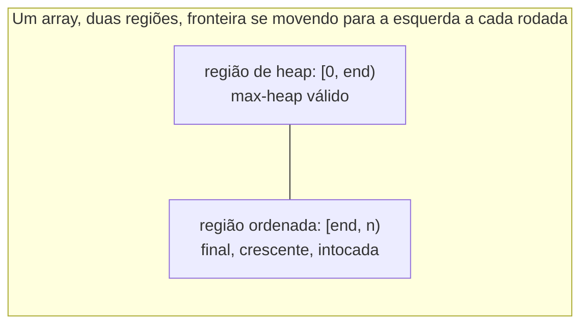

## Objetivos de Aprendizagem

- Implementar heapsort como duas fases: construir um max-heap in-place com heapify, depois extrair repetidamente o máximo para o final do mesmo array.
- Explicar por que heapsort é in-place, não exigindo nenhum array auxiliar, e rastrear exatamente como as regiões "ordenada" e "heap" do array crescem e encolhem dentro de um único buffer.
- Derivar o tempo de execução total O(n log n) do heapsort a partir dos custos individuais de suas duas fases (heapify O(n), depois n rodadas de sift-down O(log n)).
- Comparar as garantias do heapsort contra as do merge sort e quicksort, especificamente sobre uso de memória e tempo de pior caso.
- Rastrear heapsort à mão em um pequeno array, mostrando o conteúdo do array depois de toda extração.

## Contexto e Motivação

Todo maquinário necessário para heapsort já foi construído: `heapify-building-a-heap-in-linear-time` mostrou como transformar um array arbitrário em um max-heap válido em tempo O(n), e `heap-insert-and-extract` mostrou como remover o máximo de um heap em O(log n) trocando-o para o final do array e fazendo sift-down. Heapsort não é um algoritmo novo exigindo maquinário novo, é a observação de que encadear essas duas peças já compreendidas juntas, de uma forma específica, ordena um array in-place: faça heapify do array inteiro uma vez, e depois extraia repetidamente o máximo, mas em vez de descartar o valor extraído ou copiá-lo para outro lugar, deixe-o descansar exatamente na posição que o passo "trocar com o último" da extração já esvazia para ele.

Isso importa como mais do que um truque interessante, porque coloca o heapsort em companhia genuinamente útil entre as ordenações baseadas em comparação que um currículo de ciência da computação cobre. Merge sort garante O(n log n) no pior caso, mas precisa de O(n) espaço auxiliar para fazer merge, não pode ordenar in-place sem abrir mão de sua estabilidade ou de sua garantia de tempo de execução. Quicksort ordena in-place e é extremamente rápido na prática, mas seu tempo de execução de pior caso é O(n²), um risco que apenas seleção cuidadosa de pivô (ou randomização) mitiga em vez de eliminar. Heapsort é a ordenação que mantém *ambas* as propriedades que as outras duas cada uma tem que abrir mão de uma: uma garantia de pior caso O(n log n), correspondendo ao merge sort, *e* operação in-place sem array extra, correspondendo ao perfil de memória do quicksort. O preço que paga em vez disso é prático, não assintótico, o loop interno do heapsort tende a ter pior comportamento de cache que o do quicksort (o passo de sift-down salta pelo array via aritmética de índice em vez de varrer faixas contíguas) e não é uma ordenação estável, então não é automaticamente a "melhor" escolha na prática, mas é a resposta limpa de livro-texto para "posso ter a garantia do merge sort sem o custo de memória do merge sort?"

## Teoria Central

### Fase 1: heapify o array inteiro

A primeira fase é exatamente o algoritmo de heapify já desenvolvido: começando do último nó não-folha (`n // 2 - 1`) e trabalhando de volta até a raiz, faça sift-down de cada nó interno para que sua subárvore se torne um max-heap válido. Depois dessa fase, o array inteiro, tratado como uma árvore binária completa implícita, satisfaz a propriedade de max-heap, e em particular, `arr[0]` contém o valor máximo no array. Essa fase custa O(n), pelo argumento agregado de soma de altura já derivado no conceito de heapify, não rederivado aqui, apenas reutilizado.

### Fase 2: extraia repetidamente o máximo para o final do array

A segunda fase realiza `n - 1` rodadas essencialmente da operação de extrair-máximo, mas com um ajuste: em vez de encolher o array retirando o último elemento inteiramente (como o extrair-máximo de um heap independente faz), heapsort mantém o array em seu comprimento completo o tempo todo e simplesmente trata um *prefixo* encolhendo como "ainda um heap" e um *sufixo* crescendo como "já ordenado." Concretamente, cada rodada: troca `arr[0]` (o máximo atual, de qualquer porção que ainda está sendo tratada como um heap) com `arr[k]`, onde `k` é o último índice da região de heap ainda ativa; depois encolhe a fronteira da região de heap em um (então o índice `k` agora está permanentemente fora dela, contendo um valor que agora está em sua posição final ordenada); depois faz sift-down a partir da raiz, mas apenas dentro da nova e menor região de heap.

```python
def heapsort(arr):
    n = len(arr)
    # Fase 1: constrói um max-heap in-place, O(n)
    for i in range(n // 2 - 1, -1, -1):
        sift_down(arr, i, n)
    # Fase 2: move repetidamente o máximo para o final, encolhendo a região de heap
    for end in range(n - 1, 0, -1):
        arr[0], arr[end] = arr[end], arr[0]   # move o máximo atual para sua posição final
        sift_down(arr, 0, end)                # restaura a propriedade de heap, só dentro de [0, end)
    return arr
```

Porque `sift_down` é chamado com um parâmetro `n` encolhendo (`end`, decrescendo a cada rodada), ele nunca toca no sufixo já ordenado, trata os índices `end` e além como simplesmente não existentes, então o máximo, uma vez colocado no índice `end`, nunca é perturbado novamente por nenhuma rodada posterior.



Isso é exatamente o que "in-place" significa aqui: há apenas um array na memória, sempre. A região de heap e a região ordenada não são armazenamento separado, são apenas duas faixas de índice disjuntas dentro do mesmo buffer, e cada rodada da fase 2 encolhe a primeira faixa em exatamente um e cresce a segunda em exatamente um, até que a região de heap esteja vazia e o array inteiro seja a região ordenada.

### Derivando o total O(n log n)

A fase 1 custa O(n), como já estabelecido. A fase 2 realiza exatamente `n - 1` rodadas; cada rodada faz uma troca (O(1)) e uma chamada de sift-down, e o sift-down na rodada `k` opera em um heap de tamanho no máximo `n` (no pior caso, próximo do tamanho original, já que a região de heap só encolhe em um por rodada), então o sift-down de cada rodada custa O(log n) no pior caso (limitado pela altura de um heap de tamanho até `n`). Somando `n - 1` rodadas cada uma custando O(log n):

```
Total da fase 2 ≤ (n - 1) × O(log n) = O(n log n)
```

Custo total: `O(n)` (fase 1) `+ O(n log n)` (fase 2) `= O(n log n)`, já que o termo `O(n log n)` domina o termo `O(n)` para `n` grande. Esse limite se mantém no pior caso, não apenas em média, ao contrário do quicksort, não há entrada adversarial que empurre a fase 2 do heapsort acima de O(log n) por rodada, porque o custo do sift-down é sempre limitado pela altura do heap atual, que ela mesma nunca excede O(log (tamanho do heap atual)) independentemente de quais valores estejam presentes, já que completude (não distribuição de valor) é o que determina altura.

### Comparando as três ordenações clássicas de classe O(n log n)

| | Tempo de pior caso | Espaço extra | In-place? | Estável? |
|---|---|---|---|---|
| Merge sort | O(n log n) garantido | Array auxiliar O(n) | Não | Sim |
| Quicksort | O(n²) pior caso (raro com bom pivoteamento) | Pilha de recursão O(log n) (típico) | Sim | Não |
| Heapsort | O(n log n) garantido | O(1) auxiliar | Sim | Não |

Heapsort é a ordenação que garante o limite de pior caso do merge sort enquanto corresponde ao perfil de memória in-place do quicksort, uma combinação que nenhuma das outras duas alcança sozinha. Abre mão dos fatores constantes tipicamente excelentes do quicksort (o sift-down do heapsort acessa localizações de array distantes umas das outras, via aritmética de índice, que tende a produzir mais cache misses que as varreduras de particionamento majoritariamente sequenciais do quicksort) e abre mão da estabilidade do merge sort (heapsort pode e de fato reordena elementos iguais entre si, já que a propriedade de heap sempre compara apenas valores, nunca posições originais). Em um contexto de curso, heapsort é mais valioso não como "a ordenação mais rápida na prática" mas como a prova de existência concreta de que O(n log n)-pior-caso e O(1)-espaço-extra são simultaneamente alcançáveis, uma combinação que não é óbvia até que você veja esse algoritmo construí-la diretamente a partir de peças já construídas para um propósito inteiramente diferente (filas de prioridade).

## Exemplos Resolvidos

### Exemplo 1 — rastreamento completo de heapsort em um pequeno array

**Problema:** Ordene `[4, 10, 3, 5, 1]` usando heapsort, mostrando o array depois da fase 1 e depois de toda rodada da fase 2.

**Fase 1 (heapify).** Este é exatamente o Exemplo 1 do conceito de heapify: resultado `[10, 5, 3, 4, 1]`.

**Fase 2, rodada 1** (`end = 4`). Troque `arr[0]` (10) e `arr[4]` (1): `[1, 5, 3, 4, 10]`. O índice 4 agora está ordenado (contém o verdadeiro máximo, 10, em sua posição final). Sift-down a partir do índice 0, dentro da faixa `[0, 4)`: filhos de 0 são os índices 1 (valor 5), 2 (valor 3); o maior é 5; 1 < 5, troque: `[5, 1, 3, 4, 10]`; continue a partir do índice 1: filhos em 3 (valor 4); `2(1)+2=4` está fora da faixa ativa (`end=4` significa que apenas os índices 0–3 estão em jogo); compare apenas contra o índice 3 (valor 4); 1 < 4, troque: `[5, 4, 3, 1, 10]`; continue a partir do índice 3: filhos em 7, 8, ambos fora da faixa, pare.

**Rodada 2** (`end = 3`). Troque `arr[0]` (5) e `arr[3]` (1): `[1, 4, 3, 5, 10]`. O índice 3 agora está ordenado. Sift-down a partir de 0 dentro de `[0, 3)`: filhos em 1 (valor 4), 2 (valor 3); o maior é 4; 1 < 4, troque: `[4, 1, 3, 5, 10]`; continue a partir do índice 1: filhos em `2(1)+1=3`, fora da faixa ativa (`end=3`), pare.

**Rodada 3** (`end = 2`). Troque `arr[0]` (4) e `arr[2]` (3): `[3, 1, 4, 5, 10]`. O índice 2 agora está ordenado. Sift-down a partir de 0 dentro de `[0, 2)`: filhos em 1 (valor 1); apenas filho na faixa; 3 ≥ 1 já, nenhuma troca.

**Rodada 4** (`end = 1`). Troque `arr[0]` (3) e `arr[1]` (1): `[1, 3, 4, 5, 10]`. O índice 1 agora está ordenado. A região de heap agora é `[0, 1)`, um único elemento, trivialmente um heap; sift-down não faz nada.

**Resultado final:** `[1, 3, 4, 5, 10]`, totalmente ordenado em ordem crescente, usando as mesmas cinco posições de array o tempo todo, sem nenhum array auxiliar em nenhum momento.

### Exemplo 2 — contando comparações para ver o formato O(n log n) empiricamente

**Problema:** Para o rastreamento no Exemplo 1 (`n = 5`), conte o número total de comparações pai-vs-filho feitas através de toda a fase 2, e compare contra `n log₂ n`.

**Contando a partir do rastreamento.** Rodada 1: 2 comparações (índice 0 vs seus dois filhos, depois índice 1 vs seu único filho ativo). Rodada 2: 1 comparação. Rodada 3: 1 comparação. Rodada 4: 0 comparações (heap de elemento único). Total: `2 + 1 + 1 + 0 = 4` comparações através da fase 2.

**Limite de referência.** `n log₂ n = 5 × log₂ 5 ≈ 5 × 2,32 ≈ 11,6`. A contagem observada (4) fica confortavelmente abaixo desse limite, consistente com O(n log n) como um limite superior em vez de uma previsão apertada para toda entrada pequena, para `n` pequeno os fatores constantes e os valores específicos envolvidos importam mais que o formato assintótico, que só se torna um preditor confiável de contagens de comparação reais conforme `n` cresce.

### Exemplo 3 — heapsort em um array com valores duplicados, para ver instabilidade diretamente

**Problema:** Ordene `[5, 3, 5, 1]`, onde dois elementos compartilham o valor 5, e observe que heapsort não necessariamente preserva sua ordem relativa original (ou seja, não é uma ordenação estável).

**Fase 1 (heapify).** `n=4`, `last_internal = 4//2-1 = 1`. Sift-down índice 1 (valor 3): filhos apenas no índice 3 (valor 1) (`2(1)+2=4` fora da faixa); 3 ≥ 1, nenhuma troca. Sift-down índice 0 (valor 5, chame-o de 5ₐ, o que estava originalmente no índice 0): filhos no índice 1 (valor 3), índice 2 (valor 5, chame-o de 5_b, originalmente no índice 2); o maior dos dois filhos é 5_b; 5ₐ < 5_b? Não (são iguais, e sift-down só troca em estritamente-menor), 5ₐ já satisfaz "≥ ambos os filhos," então nenhuma troca ocorre. Array depois da fase 1: `[5ₐ, 3, 5_b, 1]` (inalterado da entrada, rótulos adicionados apenas para rastrear identidade).

**Fase 2, rodada 1** (`end=3`). Troque `arr[0]` (5ₐ) e `arr[3]` (1): `[1, 3, 5_b, 5ₐ]`. O índice 3 agora contém 5ₐ, ordenado. Sift-down a partir de 0 dentro de `[0,3)`: filhos em 1 (valor 3), 2 (valor 5_b); o maior é 5_b; 1 < 5_b, troque: `[5_b, 3, 1, 5ₐ]`; continue a partir do índice 2, sem filhos na faixa (`end=3`), pare.

**Rodada 2** (`end=2`). O array atual é `[5_b, 3, 1, 5ₐ]`. Troque `arr[0]` (5_b) e `arr[2]` (1): `[1, 3, 5_b, 5ₐ]`. O índice 2 agora contém 5_b, ordenado. Sift-down a partir de 0 dentro de `[0,2)`: apenas o filho esquerdo (índice 1, valor 3) está na faixa (o índice 2 é excluído, já que `end=2`); 1 < 3, troque: `[3, 1, 5_b, 5ₐ]`; continue a partir do índice 1, sem filhos na faixa, pare.

**Rodada 3** (`end=1`). O array atual é `[3, 1, 5_b, 5ₐ]`. Troque `arr[0]` (3) e `arr[1]` (1): `[1, 3, 5_b, 5ₐ]`. O índice 1 agora contém 3, ordenado. A região de heap agora é `[0, 1)`, um único elemento, nada resta para fazer sift.

**Array final:** `1, 3, 5_b, 5ₐ`, o elemento originalmente no índice 2 (5_b) acaba *antes* do elemento originalmente no índice 0 (5ₐ) na ordem final ordenada, mesmo que 5ₐ aparecesse primeiro na entrada. Isso é exatamente o que "não estável" significa: dois elementos iguais podem e de fato trocam de ordem relativa através da sequência de trocas, algo que uma ordenação estável (como merge sort, implementada cuidadosamente) garante que nunca acontecerá.

## Equívocos Comuns e Armadilhas

- **"Heapsort precisa de um array extra para conter a saída ordenada, igual ao merge sort."** Não precisa, o rastreamento do Exemplo 1 mostra a ordenação inteira acontecendo dentro das cinco posições originais, com as designações "ordenada" e "heap" sendo nada mais do que qual faixa de índice está atualmente sendo tratada de qual forma. Essa propriedade in-place é precisamente a principal vantagem do heapsort sobre o merge sort.
- **"Já que heapsort constrói um max-heap e merge sort também é O(n log n), os dois devem ter desempenho comparável na prática."** Ambos compartilham o mesmo limite assintótico de pior caso, mas o sift-down do heapsort salta pelo array por aritmética de índice (`2i+1`, `2i+2`), que tende a tocar memória de forma menos previsível que os padrões de acesso mais sequenciais do merge sort ou quicksort, na prática, heapsort frequentemente é mensuravelmente mais lento que um quicksort bem ajustado em entradas típicas, apesar de corresponder ou superar a garantia de pior caso do quicksort.
- **"Extrair o máximo n vezes e a fase 2 do heapsort são literalmente operações idênticas."** São extremamente próximas mas não exatamente idênticas: um extrair-máximo independente (de `heap-insert-and-extract`) encolhe o array real com `pop()`, descartando a fronteira inteiramente, enquanto a fase 2 do heapsort mantém o array em comprimento completo e simplesmente move a fronteira entre "heap ativo" e "ordenado, fora de limites", a mesma mecânica de troca-e-sift-down, aplicada sem jamais redimensionar o array subjacente.
- **"O pior caso do heapsort pode degradar da forma que o do quicksort faz, para alguma entrada adversarial."** Não pode, o custo do sift-down é limitado puramente pela altura de uma árvore completa do tamanho de heap atual, um limite que depende apenas de quantos elementos restam, nunca de quais são os valores desses elementos ou em que ordem chegam. Essa é exatamente a propriedade que o quicksort não tem (seu custo depende de como pivôs interagem com os valores de entrada específicos), que é por que heapsort, ao contrário do quicksort, oferece uma garantia O(n log n) sem nenhuma entrada adversarial conhecida que a quebre.

## Resumo

Heapsort tem exatamente duas fases, ambas construídas a partir de maquinário já desenvolvido para heaps em geral: faça heapify do array inteiro in-place, O(n), para que o índice 0 contenha o máximo; depois, n − 1 vezes, troque o máximo atual para a fronteira entre a região de heap encolhendo e a região ordenada crescendo, e faça sift-down dentro da região de heap menor, cada rodada custando O(log n). As duas fases se combinam para O(n) + O(n log n) = O(n log n) no total, um limite que se mantém no pior caso incondicionalmente, porque o custo do sift-down depende apenas do tamanho do heap atual, nunca dos valores que contém. Contra as outras duas ordenações clássicas de classe O(n log n), heapsort combina unicamente a garantia de tempo de pior caso do merge sort com o perfil de memória in-place e O(1)-espaço-extra do quicksort, uma combinação que nenhuma das outras duas alcança sozinha, ao custo de localidade de cache mais fraca que o quicksort e a perda de estabilidade, como o rastreamento de valor duplicado demonstrou diretamente.

## Documentation Links

- [MIT 6.006 — Lecture Notes (OCW)](https://ocw.mit.edu/courses/6-006-introduction-to-algorithms-spring-2020/pages/lecture-notes/) — doc
- [Sedgewick & Wayne — Algorithms Lectures (Princeton)](https://algs4.cs.princeton.edu/lectures/) — doc
