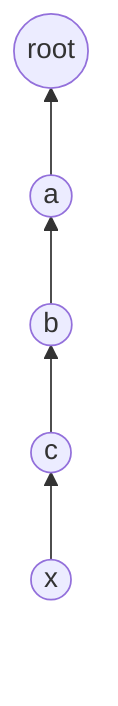
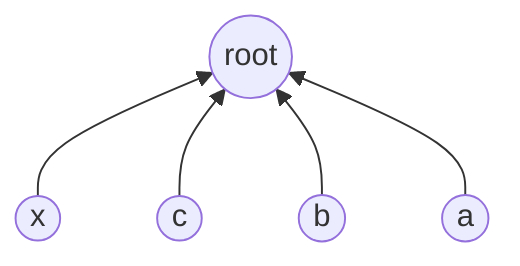

## Learning Objectives

- Implement path compression as a modification to `find` that repoints every node visited on the way to the root directly at that root.
- Trace a `find` call on a multi-level tree and show the tree's shape before and after compression.
- Explain why path compression is "free" to add — it changes no operation's contract, only the internal shape left behind after a `find`.
- Distinguish full path compression from the cheaper "path halving" and "path splitting" variants, and state what all three have in common.
- Articulate why path compression alone, or union by rank alone, each already helps, but the pair together does substantially better than either alone.

## Context & Motivation

Union by rank, from the previous concept, fixed one specific pathology of quick-union — it stopped `union` from ever building unboundedly tall trees by accident, capping height at O(log n). But O(log n) per `find`, while a real improvement over the unbounded chains of plain quick-union, is not yet the endpoint Sedgewick and Wayne's Princeton "Algorithms, Part I" course is building toward when it opens with union-find. There is a second, complementary optimization available, and it comes from noticing something almost wasteful about the plain `find` operation: every time `find(p)` walks up a chain of ancestors to reach the root, it *learns* the root for every single node along that path — and then throws that information away, leaving the tree exactly as tall as it was, so that the next `find` on any of those same intermediate nodes has to re-walk the same path from scratch.

Path compression fixes this by spending a small amount of extra work during a `find` call to flatten the tree for every future query. While walking up to the root, revisit every node on the path and point it directly at the root, rather than at its immediate former parent. This changes nothing about what `find` returns — it still returns the root, and the partition it represents is completely unchanged — it only changes the *shape* of the tree afterward, making every future `find` on any of those compressed nodes an O(1) lookup instead of a multi-hop walk. This is, in a real sense, a "free" optimization: it does not need any new bookkeeping array (unlike union by rank, which needs a `size` or `rank` array), it does not change what any operation returns, and it costs no more than a second pass over a path `find` was already walking.

## Core Theory

### The mechanism: flatten while you climb

Plain `find` (from quick-union) walks parent pointers to the root and returns it, touching every node on the path exactly once, read-only. Path compression adds a second pass — after locating the root, walk the path again and set every visited node's parent directly to the root:

```python
class PathCompressedUnionFind:
    def __init__(self, n):
        self.parent = list(range(n))
        self.size = [1] * n  # combine with union by rank/size, as is standard practice

    def find(self, p):
        root = p
        while self.parent[root] != root:
            root = self.parent[root]
        # second pass: compress every node on the path directly to root
        while self.parent[p] != root:
            p, self.parent[p] = self.parent[p], root
        return root

    def connected(self, p, q):
        return self.find(p) == self.find(q)

    def union(self, p, q):
        root_p, root_q = self.find(p), self.find(q)
        if root_p == root_q:
            return
        if self.size[root_p] < self.size[root_q]:
            self.parent[root_p] = root_q
            self.size[root_q] += self.size[root_p]
        else:
            self.parent[root_q] = root_p
            self.size[root_p] += self.size[root_q]
```

The first `while` loop is identical to plain `find` — it locates the root. The second `while` loop re-walks the same path (using the *original* parent pointers, which is why `p` is reset to the original argument before the second loop starts) and rewrites each node's parent to point straight at `root`. The extra cost is proportional to the path length just walked — at most a constant factor more work than plain `find` already did — in exchange for permanently shortening that path for every node on it.

### A concrete before/after: depth 4 collapsing to depth 1

Consider a tree of depth 4 (five levels, root at depth 0) built up through some sequence of unions, with node `x` at the deepest level:



Before any compressed `find`, reaching `x`'s root requires four hops: x → c → b → a → root. Calling `find(x)` with path compression walks that same path to discover `root`, then, on the second pass, rewrites the parent of `x`, `c`, `b`, and `a` to all point directly at `root`:



After this single `find(x)` call, the tree's depth for these five nodes has collapsed from 4 to 1 — every one of x, c, b, a is now a direct child of `root`. Critically, this benefit is not limited to `x`: the next `find(c)`, `find(b)`, or `find(a)` is now also a single hop, even though the original call was only asked about `x`. Path compression's cost is paid once, by whichever `find` call happens to walk a long path, and its benefit is collected by every node on that path, for every future query touching any of them.

### Why this doesn't change any operation's contract

It is worth being explicit about what stays fixed: `find(p)` still returns the same root it would have returned without compression (the partition membership is untouched — compression never changes which group any element belongs to, only how quickly that group's identifying root can be located next time). `union` is unaffected in its own logic; it simply calls the now-compressing `find` to locate roots, same as before. No caller of this ADT can observe path compression happening except through timing — which is exactly the point: it is a pure performance optimization layered onto an unchanged interface.

### Variants: path halving and path splitting

Full path compression, as coded above, requires two passes over the path (one to find the root, one to rewrite). Two cheaper single-pass variants achieve almost the same effect: **path splitting** makes every node on the path point to its *grandparent* (not the root) during the single upward walk, and **path halving** does the same but only for every other node. Neither collapses the path all the way to depth 1 in a single call the way full compression does, but both still provably shrink paths over repeated calls, and both are common in production implementations because they avoid a second full pass. All three variants — full compression, splitting, halving — share the same essential idea: use the information already being gathered while walking up to a root to shorten paths for the future, rather than discarding that information once the root has been found.

## Worked Examples

### Example 1 — tracing full path compression on a depth-4 chain

**Problem:** Given `parent = [1, 2, 3, 4, 4]` for elements 0–4 (so 0 → 1 → 2 → 3 → 4, with 4 as its own root), trace `find(0)` with full path compression, showing the `parent` array after the call.

**First pass (locate root):** start at `root = 0`. `parent[0] = 1 ≠ 0`, so `root = 1`. `parent[1] = 2 ≠ 1`, so `root = 2`. `parent[2] = 3 ≠ 2`, so `root = 3`. `parent[3] = 4 ≠ 3`, so `root = 4`. `parent[4] = 4`, stop. Root found: 4.

**Second pass (compress):** reset `p = 0`. Loop while `parent[p] != root (4)`:
- `p = 0`: `parent[0] = 1 ≠ 4`. Set `parent[0] = 4`. Advance `p = 1` (the *old* parent[0], captured before overwriting, per the simultaneous assignment `p, self.parent[p] = self.parent[p], root`).
- `p = 1`: `parent[1] = 2 ≠ 4`. Set `parent[1] = 4`. Advance `p = 2`.
- `p = 2`: `parent[2] = 3 ≠ 4`. Set `parent[2] = 4`. Advance `p = 3`.
- `p = 3`: `parent[3] = 4 = root`. Loop stops (3 already points at root, nothing left to compress on this path beyond what's already done — note 3's parent was already 4 before this call).

**Result:** `parent = [4, 4, 4, 4, 4]`. Every element from the original depth-4 chain now points directly at root 4. A subsequent `find(0)`, `find(1)`, `find(2)`, or `find(3)` is now a single array lookup — one hop, not four, three, two, or one respectively (only element 3 was already at depth 1 before this call).

### Example 2 — path compression interacting with a later union

**Problem:** Starting from the compressed state at the end of Example 1 (`parent = [4,4,4,4,4]`), suppose element 5 is a singleton (`parent[5] = 5`) and `union(5, 0)` is called, using union by size where `size[4] = 5` (tracking the five compressed elements) and `size[5] = 1`. What does the tree look like afterward, and what is the cost of `find(5)` immediately after?

**Reasoning.** `union(5, 0)` first calls `find(5) = 5` (already a root, no compression needed — path length zero) and `find(0)`. Since element 0 already points directly at root 4 (post-compression from Example 1), `find(0)` is a single hop, returning 4 immediately, with nothing further to compress. Comparing sizes, `size[5] = 1 < size[4] = 5`, so 5's root is attached under 4's root: `parent[5] = 4`, `size[4] = 6`.

**Cost of `find(5)` right after:** one hop, 5 → 4. Even the brand-new attachment sits directly under the root, because the tree it was compared against had already been flattened by the earlier `find` call — this illustrates how path compression's benefit compounds: later operations on an already-compressed tree tend to stay cheap, since new attachments happen at the root level rather than at the bottom of some long-since-flattened chain.

## Common Misconceptions & Pitfalls

- **"Path compression changes which group an element belongs to."** It does not — it only ever rewrites a node's parent pointer to point at that same node's *existing* root (the root `find` was already going to return). The partition — which elements are in which group — is completely unaffected; only the internal tree shape (and therefore future lookup cost) changes.
- **"Compression means the whole tree becomes flat (depth 1) after just one `find` call, anywhere in the tree."** Only the specific path walked by that one `find` call gets flattened — nodes elsewhere in the same tree, on a different branch never visited by that call, are untouched and keep whatever depth they had. Example 2's element 5 only became a one-hop lookup because it happened to be unioned onto an already-compressed root; it was not automatically flattened by Example 1's call, which never touched it.
- **"You need a second array or extra bookkeeping to support path compression, similar to the size/rank array for weighting."** Path compression needs no extra storage at all — it only rewrites the existing `parent` array in place. This is part of why it is often described as an almost-free optimization: no new invariant to maintain, no new field to keep in sync.
- **"Path compression by itself is enough to get the best possible bound — you don't really need union by rank too."** Path compression alone does improve amortized performance over plain quick-union, but the famous near-constant bound (covered in the next concept) specifically requires combining path compression *with* union by rank or size. Either optimization alone helps; it is the combination that produces the celebrated inverse-Ackermann result.

## Summary

Path compression modifies `find` to exploit information it was already gathering: while walking up to a root, it makes a second pass (or, in the cheaper halving/splitting variants, folds this into the same pass) that repoints every visited node directly at the root, flattening the tree for every future query without changing what any operation returns or requiring any extra bookkeeping array. A tree of depth 4 walked by a single compressed `find` call collapses to depth 1 for every node on that path, as the worked examples trace explicitly — and that benefit compounds, since later unions onto an already-compressed root tend to attach at the root level rather than at the bottom of some long chain. Path compression pairs with, but is conceptually independent of, union by rank/size from the previous concept; each optimization improves worst-case behavior on its own, but as the next concept shows, it is specifically the combination of both that produces union-find's famous near-constant amortized cost per operation.

## Documentation Links

- [Sedgewick & Wayne — Algorithms Lectures (Princeton)](https://algs4.cs.princeton.edu/lectures/) — doc
- [Stanford CS166 — Data Structures](https://web.stanford.edu/class/cs166) — doc
