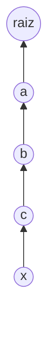
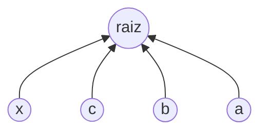

## Objetivos de Aprendizagem

- Implementar compressão de caminho como uma modificação a `find` que reponta todo nó visitado a caminho da raiz diretamente para essa raiz.
- Rastrear uma chamada `find` em uma árvore de múltiplos níveis e mostrar o formato da árvore antes e depois da compressão.
- Explicar por que compressão de caminho é "grátis" de adicionar, ela não muda o contrato de nenhuma operação, apenas o formato interno deixado depois de um `find`.
- Distinguir compressão de caminho completa das variantes mais baratas "path halving" e "path splitting," e enunciar o que as três têm em comum.
- Articular por que compressão de caminho sozinha, ou union por rank sozinho, cada uma já ajuda, mas o par junto faz substancialmente melhor que qualquer um sozinho.

## Contexto e Motivação

Union por rank, do conceito anterior, consertou uma patologia específica do quick-union, parou `union` de jamais construir árvores ilimitadamente altas por acidente, limitando altura a O(log n). Mas O(log n) por `find`, embora uma melhoria real sobre as correntes ilimitadas do quick-union comum, ainda não é o ponto final para o qual o curso "Algorithms, Part I" de Sedgewick e Wayne em Princeton está construindo quando abre com union-find. Há uma segunda otimização complementar disponível, e vem de notar algo quase desperdiçador sobre a operação `find` comum: toda vez que `find(p)` sobe uma cadeia de ancestrais para alcançar a raiz, ele *aprende* a raiz para todo único nó ao longo daquele caminho, e então descarta essa informação, deixando a árvore exatamente tão alta quanto estava, de modo que a próxima `find` em qualquer um desses mesmos nós intermediários tem que repercorrer o mesmo caminho do zero.

Compressão de caminho conserta isso gastando uma pequena quantidade de trabalho extra durante uma chamada `find` para achatar a árvore para toda consulta futura. Ao subir até a raiz, revisite todo nó no caminho e o aponte diretamente para a raiz, em vez de para seu antigo pai imediato. Isso não muda nada sobre o que `find` retorna, ainda retorna a raiz, e a partição que representa é completamente inalterada, apenas muda o *formato* da árvore depois, tornando toda futura `find` em qualquer um desses nós comprimidos uma busca O(1) em vez de uma caminhada de múltiplos saltos. Esta é, em um sentido real, uma otimização "grátis": não precisa de nenhum novo array de contabilidade (ao contrário de union por rank, que precisa de um array `size` ou `rank`), não muda o que nenhuma operação retorna, e custa não mais que uma segunda passagem sobre um caminho que `find` já estava percorrendo.

## Teoria Central

### O mecanismo: achate enquanto sobe

`find` comum (do quick-union) sobe ponteiros de pai até a raiz e a retorna, tocando todo nó no caminho exatamente uma vez, apenas leitura. Compressão de caminho adiciona uma segunda passagem, depois de localizar a raiz, percorra o caminho novamente e defina o pai de todo nó visitado diretamente como a raiz:

```python
class PathCompressedUnionFind:
    def __init__(self, n):
        self.parent = list(range(n))
        self.size = [1] * n  # combina com union por rank/size, como é prática padrão

    def find(self, p):
        root = p
        while self.parent[root] != root:
            root = self.parent[root]
        # segunda passagem: comprime todo nó no caminho diretamente para a raiz
        while self.parent[p] != root:
            p, self.parent[p] = self.parent[p], root
        return root

    def connected(self, p, q):
        return self.find(p) == self.find(q)

    def union(self, p, q):
        root_p, root_q = self.find(p), self.find(q)
        if root_p == root_q:
            return
        if self.size[root_p] < self.size[root_q]:
            self.parent[root_p] = root_q
            self.size[root_q] += self.size[root_p]
        else:
            self.parent[root_q] = root_p
            self.size[root_p] += self.size[root_q]
```

O primeiro loop `while` é idêntico ao `find` comum, localiza a raiz. O segundo loop `while` repercorre o mesmo caminho (usando os ponteiros de pai *originais*, que é por que `p` é resetado para o argumento original antes de o segundo loop começar) e reescreve o pai de cada nó para apontar direto para `root`. O custo extra é proporcional ao comprimento do caminho acabado de percorrer, no máximo um fator constante a mais de trabalho que `find` comum já fazia, em troca de encurtar permanentemente esse caminho para todo nó nele.

### Um antes/depois concreto: profundidade 4 colapsando para profundidade 1

Considere uma árvore de profundidade 4 (cinco níveis, raiz na profundidade 0) construída através de alguma sequência de uniões, com o nó `x` no nível mais profundo:



Antes de qualquer `find` comprimido, alcançar a raiz de `x` exige quatro saltos: x → c → b → a → raiz. Chamar `find(x)` com compressão de caminho percorre esse mesmo caminho para descobrir `raiz`, depois, na segunda passagem, reescreve o pai de `x`, `c`, `b`, e `a` para todos apontarem diretamente para `raiz`:



Depois dessa única chamada `find(x)`, a profundidade da árvore para esses cinco nós colapsou de 4 para 1, cada um de x, c, b, a agora é um filho direto de `raiz`. Criticamente, esse benefício não está limitado a `x`: a próxima `find(c)`, `find(b)`, ou `find(a)` agora também é um único salto, mesmo que a chamada original só tenha sido perguntada sobre `x`. O custo da compressão de caminho é pago uma vez, por qualquer chamada `find` que aconteça de percorrer um caminho longo, e seu benefício é coletado por todo nó nesse caminho, para toda consulta futura tocando qualquer um deles.

### Por que isso não muda o contrato de nenhuma operação

Vale a pena ser explícito sobre o que permanece fixo: `find(p)` ainda retorna a mesma raiz que retornaria sem compressão (a associação de partição é intocada, compressão nunca muda a qual grupo qualquer elemento pertence, apenas quão rapidamente a raiz identificadora daquele grupo pode ser localizada na próxima vez). `union` é inafetada em sua própria lógica; simplesmente chama a agora comprimindo `find` para localizar raízes, igual a antes. Nenhum chamador desse TAD pode observar compressão de caminho acontecendo exceto através de cronometragem, que é exatamente o ponto: é uma otimização de desempenho pura sobreposta a uma interface inalterada.

### Variantes: path halving e path splitting

Compressão de caminho completa, como codificada acima, exige duas passagens sobre o caminho (uma para encontrar a raiz, uma para reescrever). Duas variantes mais baratas de passagem única alcançam quase o mesmo efeito: **path splitting** faz todo nó no caminho apontar para seu *avô* (não a raiz) durante a única caminhada ascendente, e **path halving** faz o mesmo mas apenas para cada outro nó. Nenhuma colapsa o caminho totalmente para profundidade 1 em uma única chamada da forma que compressão completa faz, mas ambas ainda comprovadamente encolhem caminhos ao longo de chamadas repetidas, e ambas são comuns em implementações de produção porque evitam uma segunda passagem completa. Todas as três variantes, compressão completa, splitting, halving, compartilham a mesma ideia essencial: use a informação já sendo coletada enquanto sobe até uma raiz para encurtar caminhos para o futuro, em vez de descartar essa informação uma vez que a raiz foi encontrada.

## Exemplos Resolvidos

### Exemplo 1 — rastreando compressão de caminho completa em uma corrente de profundidade 4

**Problema:** Dado `parent = [1, 2, 3, 4, 4]` para elementos 0–4 (então 0 → 1 → 2 → 3 → 4, com 4 como sua própria raiz), rastreie `find(0)` com compressão de caminho completa, mostrando o array `parent` depois da chamada.

**Primeira passagem (localiza raiz):** comece em `root = 0`. `parent[0] = 1 ≠ 0`, então `root = 1`. `parent[1] = 2 ≠ 1`, então `root = 2`. `parent[2] = 3 ≠ 2`, então `root = 3`. `parent[3] = 4 ≠ 3`, então `root = 4`. `parent[4] = 4`, pare. Raiz encontrada: 4.

**Segunda passagem (comprime):** resete `p = 0`. Faça loop enquanto `parent[p] != root (4)`:
- `p = 0`: `parent[0] = 1 ≠ 4`. Defina `parent[0] = 4`. Avance `p = 1` (o *antigo* parent[0], capturado antes de sobrescrever, pela atribuição simultânea `p, self.parent[p] = self.parent[p], root`).
- `p = 1`: `parent[1] = 2 ≠ 4`. Defina `parent[1] = 4`. Avance `p = 2`.
- `p = 2`: `parent[2] = 3 ≠ 4`. Defina `parent[2] = 4`. Avance `p = 3`.
- `p = 3`: `parent[3] = 4 = root`. O loop para (3 já aponta para a raiz, nada resta para comprimir nesse caminho além do que já foi feito, note que o pai de 3 já era 4 antes dessa chamada).

**Resultado:** `parent = [4, 4, 4, 4, 4]`. Todo elemento da corrente de profundidade 4 original agora aponta diretamente para a raiz 4. Uma `find(0)`, `find(1)`, `find(2)`, ou `find(3)` subsequente agora é uma única busca de array, um salto, não quatro, três, dois, ou um respectivamente (apenas o elemento 3 já estava na profundidade 1 antes dessa chamada).

### Exemplo 2 — compressão de caminho interagindo com uma união posterior

**Problema:** Começando do estado comprimido no final do Exemplo 1 (`parent = [4,4,4,4,4]`), suponha que o elemento 5 é um singleton (`parent[5] = 5`) e `union(5, 0)` é chamado, usando union por size onde `size[4] = 5` (rastreando os cinco elementos comprimidos) e `size[5] = 1`. Como fica a árvore depois, e qual é o custo de `find(5)` imediatamente depois?

**Raciocínio.** `union(5, 0)` primeiro chama `find(5) = 5` (já uma raiz, nenhuma compressão necessária, comprimento de caminho zero) e `find(0)`. Como o elemento 0 já aponta diretamente para a raiz 4 (pós-compressão do Exemplo 1), `find(0)` é um único salto, retornando 4 imediatamente, sem nada mais para comprimir. Comparando tamanhos, `size[5] = 1 < size[4] = 5`, então a raiz de 5 é anexada sob a raiz de 4: `parent[5] = 4`, `size[4] = 6`.

**Custo de `find(5)` logo depois:** um salto, 5 → 4. Mesmo a anexação recém-nova fica diretamente sob a raiz, porque a árvore contra a qual foi comparada já tinha sido achatada pela chamada `find` anterior, isso ilustra como o benefício da compressão de caminho se acumula: operações posteriores em uma árvore já comprimida tendem a permanecer baratas, já que novas anexações acontecem no nível da raiz em vez de no fundo de alguma corrente há muito achatada.

## Equívocos Comuns e Armadilhas

- **"Compressão de caminho muda a qual grupo um elemento pertence."** Não muda, apenas reescreve o ponteiro de pai de um nó para apontar para a raiz *existente* desse mesmo nó (a raiz que `find` já ia retornar). A partição, quais elementos estão em qual grupo, é completamente inafetada; apenas o formato interno da árvore (e portanto o custo de busca futuro) muda.
- **"Compressão significa que a árvore inteira se torna plana (profundidade 1) depois de apenas uma chamada `find`, em qualquer lugar da árvore."** Apenas o caminho específico percorrido por aquela única chamada `find` é achatado, nós em outro lugar na mesma árvore, em um ramo diferente jamais visitado por aquela chamada, são intocados e mantêm qualquer profundidade que tinham. O elemento 5 do Exemplo 2 só se tornou uma busca de um salto porque aconteceu de ser unido a uma raiz já comprimida; não foi automaticamente achatado pela chamada do Exemplo 1, que nunca o tocou.
- **"Você precisa de um segundo array ou contabilidade extra para suportar compressão de caminho, similar ao array size/rank para ponderação."** Compressão de caminho não precisa de nenhum armazenamento extra de forma alguma, apenas reescreve o array `parent` existente in-place. Isso é parte de por que frequentemente é descrita como uma otimização quase grátis: nenhum invariante novo para manter, nenhum campo novo para manter sincronizado.
- **"Compressão de caminho sozinha é suficiente para obter o melhor limite possível, você não realmente precisa de union por rank também."** Compressão de caminho sozinha de fato melhora o desempenho amortizado sobre quick-union comum, mas o famoso limite quase constante (coberto no próximo conceito) especificamente exige combinar compressão de caminho *com* union por rank ou size. Qualquer otimização sozinha ajuda; é a combinação que produz o celebrado resultado inverso-de-Ackermann.

## Resumo

Compressão de caminho modifica `find` para explorar informação que já estava coletando: enquanto sobe até uma raiz, faz uma segunda passagem (ou, nas variantes mais baratas de halving/splitting, dobra isso na mesma passagem) que reponta todo nó visitado diretamente para a raiz, achatando a árvore para toda consulta futura sem mudar o que nenhuma operação retorna ou exigir nenhum array de contabilidade extra. Uma árvore de profundidade 4 percorrida por uma única chamada `find` comprimida colapsa para profundidade 1 para todo nó nesse caminho, como os exemplos resolvidos rastreiam explicitamente, e esse benefício se acumula, já que uniões posteriores sobre uma raiz já comprimida tendem a anexar no nível da raiz em vez de no fundo de alguma corrente longa. Compressão de caminho se combina com, mas é conceitualmente independente de, union por rank/size do conceito anterior; cada otimização melhora o comportamento de pior caso por si só, mas como o próximo conceito mostra, é especificamente a combinação de ambas que produz o famoso custo amortizado quase constante por operação do union-find.

## Documentation Links

- [Sedgewick & Wayne — Algorithms Lectures (Princeton)](https://algs4.cs.princeton.edu/lectures/) — doc
- [Stanford CS166 — Data Structures](https://web.stanford.edu/class/cs166) — doc
