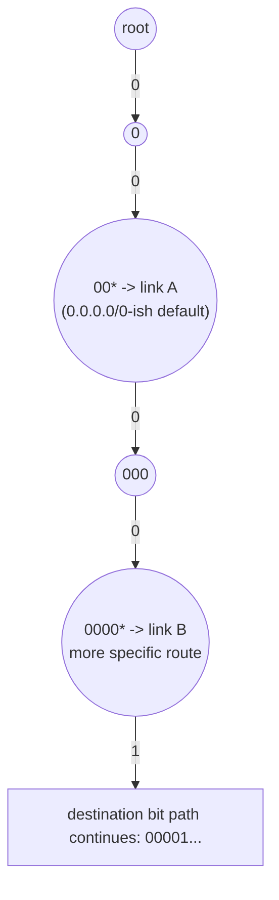
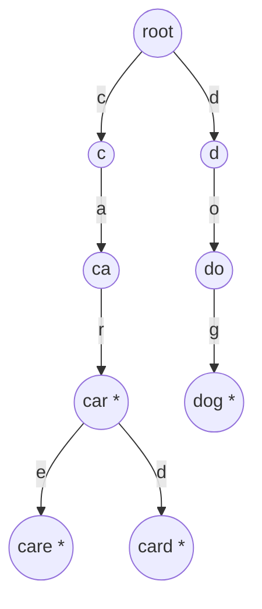

## Learning Objectives

- Explain how a search box's autocomplete feature maps directly onto a trie's `keysWithPrefix` operation, as the current text field's contents form the prefix query.
- Trace a concrete autocomplete query through a small toy trie, from the typed prefix to the returned suggestion list.
- Explain longest-prefix-match routing and why an IP router's forwarding decision is structurally a trie search over an address's binary representation.
- Distinguish longest-prefix-match from the exact-prefix collection used in autocomplete, and explain why routing needs the "longest" qualifier while autocomplete does not.
- Identify, for a new problem description, whether it fits the autocomplete pattern (collect all matches) or the routing pattern (find the single best, most specific match).

## Context & Motivation

The previous two concepts built the trie and ternary search trie as abstract structures, with each operation justified on its own terms — insert, search, prefix-match, and the memory trade-off of a three-child node. This concept exists to close the loop with genuine, everyday systems that rely on exactly these mechanics, not as a hypothetical "you could imagine using a trie for..." aside, but as documented, load-bearing components of software most people interact with daily. Two examples cover the range well: a search box's autocomplete suggestions, which is directly `keysWithPrefix` with essentially no modification, and an IP router's forwarding table, which uses the same prefix-walking mechanism but with an important twist — it wants not every match, but the single *most specific* one.

Seeing both examples side by side is instructive precisely because they diverge on one design point while agreeing on everything else: both walk a trie character-by-character (or bit-by-bit, for IP addresses) following the query's own content, and both rely on the trie's core guarantee that keys sharing a prefix share a path. Where they differ is what they do once that walk is underway — autocomplete wants to collect a *set* of completions below wherever the walk currently stands, while a router wants to track the *single most recent* complete match seen *along* the walk, discarding all shorter matches in favor of the longest (most specific) one found. That difference is worth internalizing precisely, because it is the deciding factor in which pattern a new problem calls for: "give me everything that matches" versus "give me the single best match, preferring specificity."

## Core Theory

### Autocomplete: keysWithPrefix, applied directly

A search box's autocomplete feature — suggesting completions as a user types — is, at its structural core, nothing more than calling `keysWithPrefix` on every keystroke, using whatever text has been typed so far as the prefix. As the user types `c`, then `ca`, then `car`, the application issues (conceptually) `keysWithPrefix("c")`, then `keysWithPrefix("ca")`, then `keysWithPrefix("car")` against a trie built from the underlying dictionary of candidate words (search history, product names, dictionary words — whatever the domain calls for), and displays the returned list as suggestions. This is exactly why a trie, rather than a hash table, sits underneath this feature in practice: the query changes on every keystroke, and each query is itself a prefix query, which is the one operation a trie answers natively and a hash table cannot answer without a full scan (as demonstrated concretely in the first concept of this topic).

Real autocomplete implementations layer refinements on top of the bare `keysWithPrefix` mechanism — ranking suggestions by frequency or recency rather than returning them in arbitrary trie-traversal order, capping the number of results returned, and often storing a frequency count or weight alongside the end-of-word marker at each terminal node so that popular completions can be surfaced first — but the structural foundation underneath every one of these refinements is still: walk to the prefix's node, then collect (and this time, rank) the complete words in the subtree below it.

### Routing tables: longest-prefix-match

An IP router's job is to decide, for each incoming packet, which outgoing link to forward it toward, based on the packet's destination address. A router's forwarding table is a list of *route entries*, where each entry pairs an **address prefix** (for example, `192.168.1.0/24`, meaning "the first 24 bits of the address must match this pattern") with an outgoing link. A single destination address can match *multiple* entries simultaneously — a very general entry like `0.0.0.0/0` (matching every address, the "default route") coexists with much more specific entries like `192.168.1.0/24` — and the routing rule is: **use the entry with the longest matching prefix**, i.e., the most specific match available, not merely the first match found or an arbitrary one among several.

This "longest matching prefix wins" rule is structurally a trie search, with the address's bits (rather than a string's characters) as the path being walked: build a trie where each edge represents one bit (0 or 1) of an address, and each route entry is inserted as a key whose length equals its prefix length (a `/24` entry is a 24-bit key). Looking up a destination address means walking the trie bit by bit following the address's own bits, and — this is the key structural difference from plain `keysWithPrefix` — recording the most recently seen matching route entry *at each node passed along the way*, so that by the time the walk falls off the trie (or exhausts the address), whatever was last recorded is the longest (most specific) prefix that matched. This differs from autocomplete's "collect everything below" in exactly the way flagged in Context & Motivation: routing wants the single deepest match encountered *during* the walk down, not a collection gathered *below* wherever the walk stops.

Here, a destination address whose first four bits are `0000` and continues further would pass through both `00*` (marked, giving link A) and `0000*` (marked, giving link B) on the way down — the walk records link A first, then overwrites that record with link B upon reaching the deeper match, so link B (the longer, more specific prefix) is the one ultimately used, exactly matching the longest-prefix-match rule.

### Why the "longest" qualifier matters for routing but not autocomplete

Autocomplete has no analogous notion of "most specific single answer" because the whole point is to present the user with *multiple* candidate completions to choose from — collecting the entire subtree below the typed prefix is the correct behavior, not a step toward picking one winner. Routing, by contrast, must make exactly one forwarding decision per packet; presenting "here are three possible routes, pick one" is not an option a router has, since a packet can only be forwarded once. This is why routing layers an extra piece of state onto the basic trie walk — tracking the best (longest) match seen so far as the walk descends — that autocomplete's simpler "collect the subtree" never needs.

## Worked Examples

### Example 1 — a toy autocomplete trie, walked concretely

**Problem:** A search box's suggestion dictionary contains the words `"cat"`, `"car"`, `"care"`, `"card"`, `"dog"`. Build the trie, then trace what happens as a user types `c`, then `ca`, then `car`.

**Solution.** The trie (using the standard trie from earlier concepts in this topic):

- User types `"c"`: `keys_with_prefix("c")` walks root → `c`, then collects the entire subtree below it. From `c`, the only child is `a` (`ca`), then `car*`, which itself branches to `care*` and `card*`. The full result is `["car", "care", "card"]` — this dictionary was deliberately chosen so all three words overlap through `car`, to highlight the branching below it. The user sees all three suggested completions from a single keystroke.
- User types `"ca"`: `keys_with_prefix("ca")` walks root → `c` → `ca`, collecting the same subtree: `["car", "care", "card"]` — unchanged, since no word in the dictionary starts with `c` but not `ca`.
- User types `"car"`: `keys_with_prefix("car")` walks root → `c` → `ca` → `car`, and collects from there: `car` itself is end-of-word (included), plus `care` and `card` below it: `["car", "care", "card"]` — still all three, since `car` is a genuine prefix of `care` and `card` as well as being a complete word itself.

The narrowing that a user actually experiences would show up on the *next* keystroke: typing `"care"` narrows the result to `["care"]` alone, since `keys_with_prefix("care")` walks to the `care` node, which has no children — the subtree collect returns only `care` itself.

### Example 2 — longest-prefix-match on a small routing table

**Problem:** A router's forwarding table has three entries: `0*` → link A (matches any address starting with bit 0), `010*` → link B, `0101*` → link C. A packet arrives destined for an address starting with the bits `01011...`. Which link does the router use?

**Solution.** Walk the trie bit by bit along the destination's bits (`0`, `1`, `0`, `1`, `1`, ...), tracking the most recent match:

- Bit 1 (`0`): arrive at the node for prefix `0`, which is marked (route `0*` → link A). Record: best match so far = link A (length 1).
- Bit 2 (`1`): arrive at prefix `01`, not marked (no route entry has exactly this prefix). Best match unchanged: still link A.
- Bit 3 (`0`): arrive at prefix `010`, marked (route `010*` → link B). Record: best match so far = link B (length 3), overwriting link A.
- Bit 4 (`1`): arrive at prefix `0101`, marked (route `0101*` → link C). Record: best match so far = link C (length 4), overwriting link B.
- Bit 5 (`1`): arrive at prefix `01011` — no route entry exists this deep, so the walk falls off the trie here.

The walk ends (falls off the trie), and the last recorded best match is link C, the length-4 prefix `0101*` — the most specific of the three entries that matched. This is exactly the longest-prefix-match rule: even though `0*` and `010*` both also matched this destination address, the router uses `0101*` because it is the longest (most specific) of the three.

### Example 3 — why a hash table cannot back either application

**Problem:** Briefly justify, for both autocomplete and routing, why a hash table of complete strings (or complete addresses) could not serve as a drop-in replacement for the trie in these two applications.

**Solution.** For autocomplete: a hash table stores complete keys (`"car"`, `"care"`, `"card"`) at scrambled, unrelated locations by design — there is no way to ask a hash table "give me every key starting with `car`" without inspecting every stored key individually and checking `.startswith("car")` on each, exactly as shown in this topic's very first concept. Autocomplete needs this query on every keystroke, so the cost of a full scan on every character typed would make the feature scale poorly as the dictionary grows, regardless of how fast the hash table's exact lookup is. For routing: a hash table could store each route entry as an exact key (`"010*"` mapped to link B), but a router's actual query is a full destination address, which will almost certainly not be an exact key in the table — routing fundamentally requires checking many *candidate prefixes* of the destination address against the table and picking the longest match, which a hash table (built for exact-key equality, not prefix relationships) offers no efficient way to do at all; the router would need to try every possible prefix length of the address against the hash table separately, which is a poor fit for real-time packet forwarding at the speeds routers operate at.

## Common Misconceptions & Pitfalls

- **"Autocomplete and longest-prefix-match are the same algorithm."** Both walk a trie following the query's own characters or bits, but they differ in what they do with matches: autocomplete collects every complete word in the subtree *below* wherever the walk currently stands (potentially many results, presented as a menu of choices), while longest-prefix-match tracks the single most recently seen match *along* the walk itself and discards everything else once a longer match supersedes it (exactly one result, used for exactly one decision). Conflating the two leads to routing implementations that incorrectly try to return "all matching routes" instead of the one longest match, and autocomplete implementations that incorrectly try to pick just one "best" suggestion when users generally want to see several candidates.
- **"A router literally builds a trie labeled with decimal IP address characters, like '192.168.1.1'."** Real routing tries operate on the *binary* representation of an address (or occasionally per-octet, but never on the decimal string form), because the prefix-length semantics of CIDR notation (`/24`, `/8`, etc.) refer to a count of leading *bits*, not decimal digits or dots — a `/24` prefix is 24 bits, not 24 characters of a dotted string. Treating IP addresses as ordinary strings for this purpose produces prefix boundaries that don't correspond to anything a router's actual forwarding rules mean.
- **"More specific route entries are rare edge cases; the default route usually wins."** In real routing tables, longest-prefix-match is designed precisely so that specific entries *routinely* override general ones — a `/0` default route exists specifically to be overridden by anything more specific, and most real traffic on most real networks matches a specific route, not the default. Assuming the general case dominates gets the entire purpose of longest-prefix-match backwards.
- **"Autocomplete results naturally come back in a useful order."** A bare `keysWithPrefix` traversal returns results in whatever order the trie's traversal happens to visit them (often related to alphabetical or insertion order, depending on implementation), not in an order reflecting popularity, frequency, or relevance. Real autocomplete systems layer explicit ranking (frequency counts, recency, personalization) on top of the raw trie traversal — the trie supplies the *candidate set* efficiently, not the final displayed order.

## Summary

Autocomplete and IP routing are two genuine, widely deployed applications that both rest on a trie's prefix-walking mechanism, but they use it in structurally different ways. Autocomplete calls `keysWithPrefix` directly on the text typed so far, collecting every complete word in the subtree below the current prefix as a menu of candidate completions — the exact operation a hash table cannot offer without a full scan. IP routing walks a trie built from address prefixes bit by bit along a destination address, but instead of collecting every match, it tracks only the single most recently seen (and therefore longest, most specific) match encountered along the way, since a router must make exactly one forwarding decision per packet rather than presenting several options. The shared foundation — shared prefixes become shared trie paths, enabling an efficient prefix-aware walk — is what makes both applications tractable at the scale and speed they require; the divergence in what each does with the matches found along that walk is what makes them two genuinely distinct patterns worth telling apart, not one pattern applied twice.

## Documentation Links

- [Sedgewick & Wayne — Algorithms Lectures (Princeton)](https://algs4.cs.princeton.edu/lectures/) — doc
- [ACM/IEEE CS2013 — Algorithms and Complexity Knowledge Area](https://csed.acm.org/cs2013-version/) — doc
