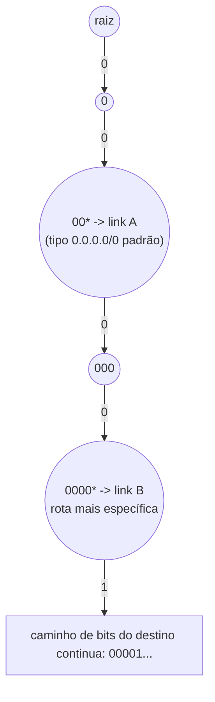
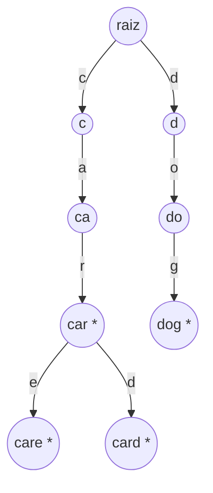

## Objetivos de Aprendizagem

- Explicar como o recurso de autocomplete de uma caixa de busca mapeia diretamente para a operação `keysWithPrefix` de uma trie, já que o conteúdo atual do campo de texto forma a consulta de prefixo.
- Rastrear uma consulta de autocomplete concreta através de uma pequena trie de brinquedo, do prefixo digitado até a lista de sugestões retornada.
- Explicar o roteamento por prefixo mais longo (longest-prefix-match) e por que a decisão de encaminhamento de um roteador IP é estruturalmente uma busca em trie sobre a representação binária de um endereço.
- Distinguir o casamento por prefixo mais longo da coleta por prefixo exato usada em autocomplete, e explicar por que roteamento precisa do qualificador "mais longo" enquanto autocomplete não precisa.
- Identificar, para uma nova descrição de problema, se ela se encaixa no padrão de autocomplete (coletar todos os casamentos) ou no padrão de roteamento (encontrar o único casamento mais específico).

## Contexto e Motivação

Os dois conceitos anteriores construíram a trie e a ternary search trie como estruturas abstratas, com cada operação justificada em seus próprios termos, inserção, busca, casamento de prefixo, e a troca de memória de um nó de três filhos. Este conceito existe para fechar o ciclo com sistemas genuínos e cotidianos que dependem exatamente desses mecanismos, não como um hipotético "você poderia imaginar usar uma trie para..." à parte, mas como componentes documentados e estruturais de software que a maioria das pessoas usa diariamente. Dois exemplos cobrem bem a gama: as sugestões de autocomplete de uma caixa de busca, que é diretamente `keysWithPrefix` com essencialmente nenhuma modificação, e a tabela de encaminhamento de um roteador IP, que usa o mesmo mecanismo de caminhada por prefixo mas com uma reviravolta importante, ela quer não todo casamento, mas o único casamento *mais específico*.

Ver os dois exemplos lado a lado é instrutivo precisamente porque eles divergem em um ponto de design enquanto concordam em tudo o mais: ambos caminham por uma trie caractere por caractere (ou bit por bit, para endereços IP) seguindo o próprio conteúdo da consulta, e ambos dependem da garantia central da trie de que chaves que compartilham um prefixo compartilham um caminho. Onde eles diferem é no que fazem uma vez que essa caminhada está em andamento, autocomplete quer coletar um *conjunto* de completações abaixo de onde quer que a caminhada esteja no momento, enquanto um roteador quer rastrear o *único casamento completo mais recente* visto *ao longo* da caminhada, descartando todos os casamentos mais curtos em favor do mais longo (mais específico) encontrado. Essa diferença vale a pena internalizar precisamente, porque é o fator decisivo em qual padrão um novo problema exige: "me dê tudo que casa" versus "me dê o único melhor casamento, preferindo especificidade".

## Teoria Central

### Autocomplete: keysWithPrefix, aplicado diretamente

O recurso de autocomplete de uma caixa de busca, sugerir completações enquanto um usuário digita, é, em seu núcleo estrutural, nada mais que chamar `keysWithPrefix` a cada tecla pressionada, usando o que quer que tenha sido digitado até agora como o prefixo. Enquanto o usuário digita `c`, depois `ca`, depois `car`, a aplicação emite (conceitualmente) `keysWithPrefix("c")`, depois `keysWithPrefix("ca")`, depois `keysWithPrefix("car")` contra uma trie construída a partir do dicionário subjacente de palavras candidatas (histórico de busca, nomes de produtos, palavras de dicionário, o que quer que o domínio exija), e exibe a lista retornada como sugestões. Isso é exatamente por que uma trie, em vez de uma hash table, fica por baixo desse recurso na prática: a consulta muda a cada tecla pressionada, e cada consulta é ela própria uma consulta de prefixo, que é a única operação que uma trie responde nativamente e uma hash table não pode responder sem uma varredura completa (como demonstrado concretamente no primeiro conceito deste tópico).

Implementações reais de autocomplete adicionam refinamentos por cima do mecanismo puro de `keysWithPrefix`, classificando sugestões por frequência ou recência em vez de retorná-las em ordem arbitrária de travessia da trie, limitando o número de resultados retornados, e frequentemente armazenando uma contagem de frequência ou peso ao lado do marcador de fim-de-palavra em cada nó terminal para que completações populares possam ser exibidas primeiro, mas a fundação estrutural por baixo de cada um desses refinamentos ainda é: caminhe até o nó do prefixo, depois colete (e desta vez, classifique) as palavras completas na subárvore abaixo dele.

### Tabelas de roteamento: casamento por prefixo mais longo

O trabalho de um roteador IP é decidir, para cada pacote recebido, para qual link de saída encaminhá-lo, baseado no endereço de destino do pacote. A tabela de encaminhamento de um roteador é uma lista de *entradas de rota*, onde cada entrada emparelha um **prefixo de endereço** (por exemplo, `192.168.1.0/24`, significando "os primeiros 24 bits do endereço devem casar com este padrão") com um link de saída. Um único endereço de destino pode casar com *múltiplas* entradas simultaneamente, uma entrada bem geral como `0.0.0.0/0` (casando com todo endereço, a "rota padrão") coexiste com entradas muito mais específicas como `192.168.1.0/24`, e a regra de roteamento é: **use a entrada com o prefixo de casamento mais longo**, ou seja, o casamento mais específico disponível, não meramente o primeiro casamento encontrado ou um arbitrário entre vários.

Essa regra de "prefixo de casamento mais longo vence" é estruturalmente uma busca em trie, com os bits do endereço (em vez dos caracteres de uma string) como o caminho sendo percorrido: construa uma trie onde cada aresta representa um bit (0 ou 1) de um endereço, e cada entrada de rota é inserida como uma chave cujo comprimento é igual ao comprimento de seu prefixo (uma entrada `/24` é uma chave de 24 bits). Buscar um endereço de destino significa caminhar pela trie bit a bit seguindo os próprios bits do endereço, e, esta é a diferença estrutural chave em relação ao `keysWithPrefix` simples, registrar a entrada de rota de casamento mais recentemente vista *em cada nó passado ao longo do caminho*, para que no momento em que a caminhada saia da trie (ou o endereço se esgote), o que quer que tenha sido registrado por último seja o prefixo mais longo (mais específico) que casou. Isso difere do "coletar tudo abaixo" do autocomplete exatamente da forma sinalizada em Contexto e Motivação: roteamento quer o único casamento mais profundo encontrado *durante* a caminhada descendente, não uma coleção reunida *abaixo* de onde quer que a caminhada pare.

Aqui, um endereço de destino cujos primeiros quatro bits são `0000` e continua além passaria tanto por `00*` (marcado, dando link A) quanto por `0000*` (marcado, dando link B) no caminho descendente, a caminhada registra o link A primeiro, depois sobrescreve esse registro com o link B ao alcançar o casamento mais profundo, então o link B (o prefixo mais longo, mais específico) é o que acaba sendo usado, exatamente casando com a regra de casamento por prefixo mais longo.

### Por que o qualificador "mais longo" importa para roteamento mas não para autocomplete

Autocomplete não tem uma noção análoga de "única resposta mais específica" porque o ponto inteiro é apresentar ao usuário *múltiplos* candidatos de completação para escolher, coletar a subárvore inteira abaixo do prefixo digitado é o comportamento correto, não um passo em direção a escolher um vencedor. Roteamento, em contraste, deve tomar exatamente uma decisão de encaminhamento por pacote; apresentar "aqui estão três rotas possíveis, escolha uma" não é uma opção que um roteador tem, já que um pacote só pode ser encaminhado uma vez. É por isso que roteamento adiciona uma peça extra de estado à caminhada básica em trie, rastreando o melhor (mais longo) casamento visto até agora enquanto a caminhada desce, algo que o "coletar a subárvore" mais simples do autocomplete nunca precisa.

## Exemplos Resolvidos

### Exemplo 1 — uma trie de autocomplete de brinquedo, percorrida concretamente

**Problema:** O dicionário de sugestões de uma caixa de busca contém as palavras `"cat"`, `"car"`, `"care"`, `"card"`, `"dog"`. Construa a trie, depois rastreie o que acontece enquanto um usuário digita `c`, depois `ca`, depois `car`.

**Solução.** A trie (usando a trie padrão dos conceitos anteriores deste tópico):

- Usuário digita `"c"`: `keys_with_prefix("c")` caminha raiz → `c`, depois coleta a subárvore inteira abaixo dele. A partir de `c`, o único filho é `a` (`ca`), depois `car*`, que ele próprio se ramifica em `care*` e `card*`. O resultado completo é `["car", "care", "card"]`, este dicionário foi deliberadamente escolhido para que todas as três palavras se sobrepusessem através de `car`, para destacar a ramificação abaixo dele. O usuário vê as três completações sugeridas a partir de uma única tecla.
- Usuário digita `"ca"`: `keys_with_prefix("ca")` caminha raiz → `c` → `ca`, coletando a mesma subárvore: `["car", "care", "card"]`, inalterado, já que nenhuma palavra no dicionário começa com `c` mas não com `ca`.
- Usuário digita `"car"`: `keys_with_prefix("car")` caminha raiz → `c` → `ca` → `car`, e coleta a partir dali: `car` em si é fim-de-palavra (incluído), mais `care` e `card` abaixo dele: `["car", "care", "card"]`, ainda todas as três, já que `car` é um prefixo genuíno tanto de `care` quanto de `card`, além de ser ele próprio uma palavra completa.

O estreitamento que um usuário de fato experimenta apareceria na *próxima* tecla: digitar `"care"` estreita o resultado para `["care"]` apenas, já que `keys_with_prefix("care")` caminha até o nó `care`, que não tem filhos, a coleta da subárvore retorna apenas `care` em si.

### Exemplo 2 — casamento por prefixo mais longo em uma pequena tabela de roteamento

**Problema:** A tabela de encaminhamento de um roteador tem três entradas: `0*` → link A (casa com qualquer endereço começando com bit 0), `010*` → link B, `0101*` → link C. Um pacote chega destinado a um endereço começando com os bits `01011...`. Qual link o roteador usa?

**Solução.** Caminhe pela trie bit a bit ao longo dos bits do destino (`0`, `1`, `0`, `1`, `1`, ...), rastreando o casamento mais recente:

- Bit 1 (`0`): chega ao nó para o prefixo `0`, que está marcado (rota `0*` → link A). Registra: melhor casamento até agora = link A (comprimento 1).
- Bit 2 (`1`): chega ao prefixo `01`, não marcado (nenhuma entrada de rota tem exatamente este prefixo). Melhor casamento inalterado: ainda link A.
- Bit 3 (`0`): chega ao prefixo `010`, marcado (rota `010*` → link B). Registra: melhor casamento até agora = link B (comprimento 3), sobrescrevendo o link A.
- Bit 4 (`1`): chega ao prefixo `0101`, marcado (rota `0101*` → link C). Registra: melhor casamento até agora = link C (comprimento 4), sobrescrevendo o link B.
- Bit 5 (`1`): chega ao prefixo `01011`, nenhuma entrada de rota existe tão profundo, então a caminhada sai da trie aqui.

A caminhada termina (sai da trie), e o último melhor casamento registrado é o link C, o prefixo de comprimento 4 `0101*`, o mais específico das três entradas que casaram. Isso é exatamente a regra de casamento por prefixo mais longo: mesmo que `0*` e `010*` ambos também tenham casado com este endereço de destino, o roteador usa `0101*` porque é o mais longo (mais específico) dos três.

### Exemplo 3 — por que uma hash table não pode substituir nenhuma das duas aplicações

**Problema:** Justifique brevemente, tanto para autocomplete quanto para roteamento, por que uma hash table de strings completas (ou endereços completos) não poderia servir como substituto direto para a trie nessas duas aplicações.

**Solução.** Para autocomplete: uma hash table armazena chaves completas (`"car"`, `"care"`, `"card"`) em localizações embaralhadas e sem relação por design, não há como perguntar a uma hash table "me dê toda chave que começa com `car`" sem inspecionar cada chave armazenada individualmente e verificar `.startswith("car")` em cada uma, exatamente como mostrado no primeiríssimo conceito deste tópico. Autocomplete precisa dessa consulta a cada tecla pressionada, então o custo de uma varredura completa a cada caractere digitado faria o recurso escalar mal conforme o dicionário cresce, independentemente de quão rápida seja a busca exata da hash table. Para roteamento: uma hash table poderia armazenar cada entrada de rota como uma chave exata (`"010*"` mapeado para o link B), mas a consulta real de um roteador é um endereço de destino completo, que quase certamente não será uma chave exata na tabela, roteamento fundamentalmente exige verificar muitos *prefixos candidatos* do endereço de destino contra a tabela e escolher o casamento mais longo, o que uma hash table (construída para igualdade de chave exata, não relações de prefixo) não oferece nenhuma forma eficiente de fazer; o roteador precisaria tentar todo comprimento de prefixo possível do endereço contra a hash table separadamente, o que é um ajuste ruim para encaminhamento de pacotes em tempo real nas velocidades em que roteadores operam.

## Equívocos Comuns e Armadilhas

- **"Autocomplete e casamento por prefixo mais longo são o mesmo algoritmo."** Ambos caminham por uma trie seguindo os próprios caracteres ou bits da consulta, mas diferem no que fazem com os casamentos: autocomplete coleta toda palavra completa na subárvore *abaixo* de onde quer que a caminhada esteja no momento (potencialmente muitos resultados, apresentados como um menu de escolhas), enquanto casamento por prefixo mais longo rastreia o único casamento mais recentemente visto *ao longo* da própria caminhada e descarta tudo mais uma vez que um casamento mais longo o substitui (exatamente um resultado, usado para exatamente uma decisão). Confundir os dois leva a implementações de roteamento que incorretamente tentam retornar "todas as rotas que casam" em vez do único casamento mais longo, e implementações de autocomplete que incorretamente tentam escolher apenas uma "melhor" sugestão quando usuários geralmente querem ver vários candidatos.
- **"Um roteador literalmente constrói uma trie rotulada com caracteres decimais de endereço IP, tipo '192.168.1.1'."** Tries de roteamento reais operam sobre a representação *binária* de um endereço (ou ocasionalmente por octeto, mas nunca sobre a forma de string decimal), porque a semântica de comprimento de prefixo da notação CIDR (`/24`, `/8`, etc.) se refere a uma contagem de *bits* iniciais, não dígitos decimais ou pontos, um prefixo `/24` são 24 bits, não 24 caracteres de uma string pontilhada. Tratar endereços IP como strings comuns para este propósito produz fronteiras de prefixo que não correspondem a nada que as regras de encaminhamento reais de um roteador signifiquem.
- **"Entradas de rota mais específicas são casos raros de borda; a rota padrão geralmente vence."** Em tabelas de roteamento reais, casamento por prefixo mais longo é projetado precisamente para que entradas específicas *rotineiramente* substituam as gerais, uma rota padrão `/0` existe especificamente para ser substituída por algo mais específico, e a maior parte do tráfego real na maioria das redes reais casa com uma rota específica, não a padrão. Assumir que o caso geral domina inverte completamente o propósito inteiro do casamento por prefixo mais longo.
- **"Resultados de autocomplete naturalmente voltam em uma ordem útil."** Uma travessia pura de `keysWithPrefix` retorna resultados na ordem que quer que a travessia da trie aconteça de visitá-los (frequentemente relacionada à ordem alfabética ou de inserção, dependendo da implementação), não em uma ordem refletindo popularidade, frequência, ou relevância. Sistemas de autocomplete reais adicionam classificação explícita (contagens de frequência, recência, personalização) por cima da travessia bruta da trie, a trie fornece o *conjunto de candidatos* eficientemente, não a ordem de exibição final.

## Resumo

Autocomplete e roteamento IP são duas aplicações genuínas e amplamente implantadas que ambas repousam sobre o mecanismo de caminhada por prefixo de uma trie, mas o usam de formas estruturalmente diferentes. Autocomplete chama `keysWithPrefix` diretamente sobre o texto digitado até agora, coletando toda palavra completa na subárvore abaixo do prefixo atual como um menu de completações candidatas, a operação exata que uma hash table não pode oferecer sem uma varredura completa. Roteamento IP caminha por uma trie construída a partir de prefixos de endereço bit a bit ao longo de um endereço de destino, mas em vez de coletar todo casamento, rastreia apenas o único casamento mais recentemente visto (e portanto mais longo, mais específico) encontrado ao longo do caminho, já que um roteador deve tomar exatamente uma decisão de encaminhamento por pacote em vez de apresentar várias opções. A fundação compartilhada, prefixos compartilhados se tornam caminhos de trie compartilhados, habilitando uma caminhada eficiente e ciente de prefixo, é o que torna ambas as aplicações viáveis na escala e velocidade que exigem; a divergência no que cada uma faz com os casamentos encontrados ao longo daquela caminhada é o que as torna dois padrões genuinamente distintos que vale a pena diferenciar, não um padrão aplicado duas vezes.

## Documentation Links

- [Sedgewick & Wayne — Algorithms Lectures (Princeton)](https://algs4.cs.princeton.edu/lectures/) — doc
- [ACM/IEEE CS2013 — Algorithms and Complexity Knowledge Area](https://csed.acm.org/cs2013-version/) — doc
