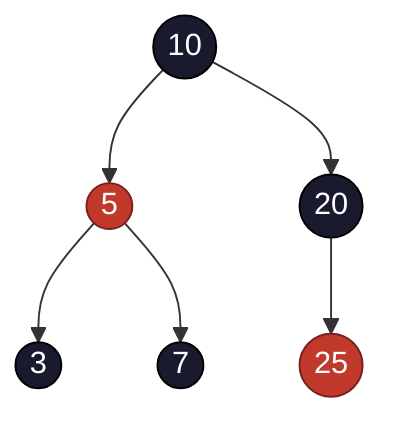

## Learning Objectives

- State the four red-black invariants precisely: every node is red or black, the root is black, a red node never has a red child, and every root-to-leaf path has the same number of black nodes.
- Derive, from these four invariants, why a red-black tree's height is bounded by 2·log₂(n+1).
- Identify that red-black trees are not an academic curiosity but the actual scheme behind Java's `TreeMap`/`TreeSet` and the typical implementation behind C++'s `std::map`/`std::set`.
- Describe, at a conceptual level, how insertion and deletion restore the invariants using recoloring and rotations, without needing to enumerate every case exhaustively.
- Contrast a red-black node's bookkeeping overhead (one color bit) with an AVL node's (a height or balance-factor field).

## Context & Motivation

The previous two concepts built AVL trees from the ground up: a precise numeric invariant (balance factor in {−1, 0, 1}), a rigorous proof via the Fibonacci recurrence of why that invariant bounds height, and a fully worked-out mechanism — rotation, in all four cases — for restoring the invariant after any insertion or deletion. AVL trees are a complete, correct answer to the problem this discipline opened with. They are not, however, the *only* answer, and this concept introduces the second classic one: the **red-black tree**, originally devised by Rudolf Bayer in 1972 (under the name "symmetric binary B-tree") and given its modern color-based presentation by Leonidas Guibas and Robert Sedgewick in 1978.

The reason a second scheme is worth an entire concept, rather than a footnote, is that red-black trees are not a minor variation — they enforce a **looser** balance condition than AVL's, expressed through node colors rather than height numbers, and that looseness is not a weakness to apologize for. It is a deliberate, well-understood engineering trade-off: a red-black tree can be somewhat taller than an AVL tree holding the same data, but it needs to perform fewer rotations, on average, to stay that way after an insertion or deletion. That trade-off is exactly why red-black trees, not AVL trees, are what actually ships inside some of the most widely used software in existence: Java's `java.util.TreeMap` and `TreeSet` have been implemented as red-black trees since their introduction, and every major C++ standard library implementation (libstdc++, the Microsoft STL, libc++) implements `std::map` and `std::set` as red-black trees as well, even though the C++ standard itself only mandates the *complexity guarantees* a red-black tree happens to deliver, not the specific data structure. Understanding red-black trees, in other words, is understanding a piece of infrastructure that sits underneath enormous amounts of real, everyday code. The full quantitative comparison between AVL and red-black — when the trade-off favors one over the other — is this discipline's closing concept; this one is about getting the red-black invariants themselves precisely right.

## Core Theory

### The four invariants, stated precisely

A **red-black tree** is a binary search tree in which every node carries one additional bit of information — a **color**, either red or black — subject to four rules, all of which must hold simultaneously at every quiescent moment (the same "always, not just eventually" sense of "invariant" introduced in this discipline's first concept):

1. **Every node is colored either red or black.** (No third option, no uncolored node.)
2. **The root is black.**
3. **A red node never has a red child** — equivalently, no path from the root to a leaf ever contains two red nodes in a row. This is often phrased as "no red-red edge."
4. **Every path from a given node down to any of its descendant NIL leaves contains the same number of black nodes.** This count (not including the starting node itself) is called that node's **black-height**.

That fourth rule requires a convention about what counts as a "leaf": every real node's missing child pointers are treated as pointing to a shared sentinel **NIL** node, and that NIL node is always considered **black**. This convention is not a minor technicality — the height-bound proof below depends on counting NIL leaves as black, and skipping this convention is one of the most common sources of an incorrectly "verified" red-black tree.



Root 10 is black (rule 2); the only red nodes are 5 and 25, and neither has a red child (rule 3); every root-to-NIL path passes through exactly two black nodes counting the terminating NIL (rule 4, verified explicitly in Worked Example 1).

### Why these four rules bound height at 2·log₂(n+1)

This is the fact this concept most wants to actually justify rather than assert, and it follows a similar shape to the Fibonacci argument for AVL trees in the prior concept: a counting argument, this time based on black-height rather than plain height.

**Step 1 — a subtree with black-height bh has at least 2^bh − 1 internal (non-NIL) nodes.** Proof by induction on height. If a node x is itself a NIL leaf, its black-height is 0 by convention, and it has 0 internal nodes — matching 2⁰ − 1 = 0. For an internal node x with black-height bh(x), consider its two children: each child's black-height is either bh(x) (if the child is red, since a red node doesn't consume a black-height count on the way down) or bh(x) − 1 (if the child is black). Either way, each child's black-height is at least bh(x) − 1, so by the inductive hypothesis (children have smaller height than x), each child's subtree has at least 2^(bh(x)−1) − 1 internal nodes. Summing both children plus x itself: at least 1 + 2·(2^(bh(x)−1) − 1) = 2^bh(x) − 1 internal nodes in x's subtree.

**Step 2 — relate black-height at the root to the tree's actual height.** Rule 3 (no red-red edge) guarantees that on any root-to-leaf path, red nodes can never be adjacent — so at least every other node on the path is black. This means the black-height of the root, bh(root), is at least h/2, where h is the tree's actual height (the longest root-to-leaf path).

**Step 3 — combine.** With n the total number of internal (real) nodes, Step 1 gives n ≥ 2^bh(root) − 1 ≥ 2^(h/2) − 1. Solving for h: n + 1 ≥ 2^(h/2), so h/2 ≤ log₂(n+1), giving:

```
h ≤ 2 · log₂(n + 1)
```

This is the red-black height bound, and it is a genuinely different constant from AVL's ~1.44 · log₂ n: red-black trees are permitted to be up to about **twice** as tall, in the absolute worst case, as a perfectly balanced tree of the same size — a noticeably looser guarantee than AVL's ~44% penalty. Both are still O(log n), which is all either invariant is actually required to deliver; the difference in the constant is exactly the "stricter versus looser" trade-off this discipline's closing concept examines in full.

### Insertion and deletion: recoloring and rotation, conceptually

A new value is always inserted as a **red** leaf. This choice is deliberate: inserting a red node can never, by itself, change any black-height count (rule 4 is automatically preserved, since a red node contributes zero to black-height), so the only rule a fresh insertion can possibly violate is rule 3 — a red node might now have a red parent. If the new node's parent is black, nothing further is needed; the tree is already a valid red-black tree again. If the parent is red, a **fix-up** procedure walks upward from the new node, resolving the red-red violation using one of two kinds of local repair, chosen by examining the new node's "uncle" (its grandparent's other child):

- **If the uncle is red:** recolor the parent and uncle to black and the grandparent to red. This repairs the local violation but may simply relocate it one level up (the grandparent, now red, might itself have a red parent) — so the fix-up continues climbing, potentially all the way to the root, purely by recoloring, with no rotation at all in this branch of the case analysis.
- **If the uncle is black (or absent, i.e., NIL):** a rotation — single or double, in the same spirit as the AVL rotations covered in the previous concept, though the exact pointer mechanics differ in the details of which nodes get recolored alongside the rotation — resolves the violation immediately, without needing to climb any further.

Deletion follows the same spirit — recoloring first, rotation only when recoloring alone cannot restore rule 4 — but has more distinct cases to consider, because removing a node (especially a black one) can reduce a black-height count in a way that recoloring several ancestors may or may not be able to absorb before a rotation becomes necessary. The important conceptual takeaway, and the reason this discipline does not repeat AVL's exhaustive four-case treatment here, is that the *shape* of the fix-up is the same idea already fully derived for AVL: detect a local invariant violation, walk upward resolving it with a bounded amount of local work, and use rotation only when cheaper recoloring cannot do the job alone. A known, citable fact worth remembering rather than re-deriving here: red-black insertion never requires more than a small constant number of rotations (at most two) to finish, no matter how many recolorings preceded them, and deletion never requires more than a small constant number either (at most three) — the potentially O(log n)-long part of either operation is the recoloring walk, not the rotation count, and recoloring alone is O(1) work per node visited.

### Overhead comparison: one color bit versus a height field

An AVL node needs enough bits to store a height or balance factor — in practice, often a small integer field (a byte is more than enough, since heights are bounded by O(log n), but it is rarely packed down to fewer bits in typical implementations). A red-black node needs exactly **one bit**: red or black. In memory-conscious implementations, that bit can often be folded into an existing pointer's unused low bit (since pointers are typically aligned to even addresses) at essentially zero extra memory cost — a detail that partly explains why red-black trees are an attractive default in general-purpose library code where memory overhead per node matters across potentially millions of nodes.

## Worked Examples

### Example 1 — verifying all four invariants on a concrete tree

**Problem:** Confirm that the tree from Core Theory (root 10 black, 5 red, 20 black, 3 black, 7 black, 25 red) satisfies all four red-black invariants.

**Rule 1 (every node colored):** By construction, every node listed has an explicit color. ✓

**Rule 2 (root black):** Node 10, the root, is black. ✓

**Rule 3 (no red-red edge):** The red nodes are 5 and 25. Check 5's children: 3 (black) and 7 (black) — no red child. Check 25's children: both NIL, which count as black by convention — no red child. ✓

**Rule 4 (equal black-height on every root-to-NIL path):** Enumerate every root-to-NIL path from 10, counting black nodes after the root (root's own color isn't counted in this convention, only nodes strictly below it down to and including the terminating NIL):

- 10 → 5 → 3 → NIL: nodes counted are 3 (black), NIL (black) = 2 black nodes.
- 10 → 5 → 7 → NIL: 7 (black), NIL (black) = 2.
- 10 → 20 → NIL (20's absent left child): 20 (black), NIL (black) = 2.
- 10 → 20 → 25 → NIL: 20 (black, counts as 1), 25 (red, doesn't count), NIL (black, counts as 1) = 2.

Total for this last path: 2. ✓ matches the other three paths.

**Conclusion.** All four root-to-NIL paths have exactly 2 black nodes; all four rules hold. This is a valid red-black tree.

### Example 2 — quantifying the height bound for a million nodes

**Problem:** For n = 1,000,000 nodes, compute the red-black worst-case height bound and compare it to the AVL worst-case bound from the previous concept and the plain-BST worst case from two concepts ago.

**Red-black bound.** h ≤ 2 · log₂(n + 1) = 2 · log₂(1,000,001) ≈ 2 × 19.93 ≈ 39.9, so height at most about 40 in the worst case.

**AVL bound (previous concept).** h ≤ 1.44 · log₂(n) ≈ 1.44 × 19.93 ≈ 28.7, so at most about 29.

**Plain BST worst case (Why Balance Matters).** h = n − 1 = 999,999 under sorted-order insertion.

**Comparison.** Even in its absolute worst case, a red-black tree on a million nodes (height ≤ 40) is nowhere near the plain BST's degenerate case (height 999,999) — both self-balancing schemes deliver the same qualitative O(log n) guarantee. The gap between AVL's ≈29 and red-black's ≈40 is real (red-black trees can be roughly 38% taller than AVL trees in the worst case here) but small compared to either one's gap from the unbalanced case. This is exactly the numeric backdrop the next concept uses to explain why that height difference, despite being real, is often not the deciding factor in choosing between the two schemes.

### Example 3 — a conceptual insertion fix-up: recolor-only versus rotation

**Problem:** Starting from the valid tree in Example 1, insert the value `1` as a new red leaf (it becomes the left child of 3), and describe, at a conceptual level, what kind of fix-up is triggered.

**Before the fix-up:** node 1 is red, its parent 3 is black. Since 3 is black, rule 3 is not violated at all — no fix-up is needed. This insertion required zero recoloring and zero rotation, illustrating the common case: most insertions land under a black parent and need no correction whatsoever.

**A different scenario:** suppose instead the value `4` is inserted as a new red right child of node 3 — but node 3 is black, so again no violation. Now suppose, hypothetically, node 3 had instead been colored red (a different starting tree) and the new red node's uncle (node 7) were also red: this is the "uncle red" case from Core Theory — recolor 3 and 7 to black, recolor their parent 5 to red, and check whether 5's new red color creates a violation with *its* parent 10 (it doesn't, since 10 is black) — fix-up complete via recoloring alone, no rotation needed. If instead the uncle had been black, a rotation at the grandparent (mirroring the AVL rotation mechanics from the previous concept, adapted to also swap the appropriate colors) would resolve the violation in a single step. This is the essential shape of every red-black insertion fix-up: check the uncle's color, recolor and possibly continue climbing, or rotate once and stop — without needing to memorize every sub-case as an exhaustive checklist the way AVL's four rotation cases were worked out mechanically in the previous concept.

## Common Misconceptions & Pitfalls

- **"Red-black trees are just a worse version of AVL trees."** They enforce a different, looser invariant on purpose — Example 2 shows the height penalty (≈40 versus ≈29 for a million nodes) is real but modest, and it buys cheaper rebalancing on insert/delete (at most a small constant number of rotations, versus AVL needing its own bounded-but-nonzero rotation cost too). Neither tree is strictly better; this is exactly the trade-off the next concept examines head-on.
- **"NIL leaves don't need to be counted when checking the invariants."** Rule 4's black-height counting depends on treating every NIL leaf as black — Example 1's path-by-path count explicitly includes the terminating NIL in every path's tally. Skipping this convention makes the four paths appear to have *different* black-heights when they actually match, leading to a false conclusion that a valid tree is invalid.
- **"A red node can have one red child and one black child, as long as it's not both."** Rule 3 forbids *any* red child of a red node — one red child is already a violation, not a partial pass. "No red-red edge" means zero tolerance on either side, not "at most one."
- **"Red-black insertion and deletion always require rotations to fix things."** Example 3 shows the most common case (new node's parent is black) requires no fix-up work at all, and even when a fix-up is triggered, the "uncle red" case resolves via recoloring alone, potentially all the way up to the root, with no rotation whatsoever in that branch.
- **"Since the C++ standard doesn't mandate red-black trees, it's incorrect to say `std::map` 'is' a red-black tree."** The standard indeed only specifies complexity guarantees (logarithmic search/insert/erase, in-order iteration), not the implementation — but this is a case where the guarantees are specific enough, and the implementation choice universal enough across every major standard library (libstdc++, libc++, MSVC STL), that "red-black tree" is a completely accurate practical description of what `std::map`/`std::set` actually are in virtually every real C++ program, and the same holds for Java's `TreeMap`/`TreeSet`, which document the red-black implementation directly.

## Summary

A red-black tree enforces balance through four rules on node colors rather than AVL's numeric height check: every node is red or black, the root is black, no red node has a red child, and every root-to-NIL-leaf path has the same number of black nodes (its black-height). A counting argument — any subtree with black-height bh has at least 2^bh − 1 internal nodes, combined with the no-red-red-edge rule forcing black-height to be at least half the tree's actual height — yields the bound h ≤ 2·log₂(n+1), a real but modest looseness compared to AVL's ~1.44·log₂ n. New nodes are always inserted red, which can only ever threaten the no-red-red rule, and the fix-up climbs the tree recoloring (cheap, potentially O(log n) steps) and rotating only when recoloring alone cannot finish the job (a small constant number of rotations, never an exhaustive case-by-case rebuild). This is not an academic scheme: it is the actual balancing strategy behind Java's `TreeMap`/`TreeSet` and the near-universal implementation choice behind C++'s `std::map`/`std::set`. The next and final concept in this discipline puts AVL and red-black side by side and asks, concretely, when a real system should prefer one over the other.

## Documentation Links

- [Sedgewick & Wayne — Algorithms Lectures (Princeton)](https://algs4.cs.princeton.edu/lectures/) — doc
- [ACM/IEEE CS2013 — Algorithms and Complexity Knowledge Area](https://csed.acm.org/cs2013-version/) — doc
