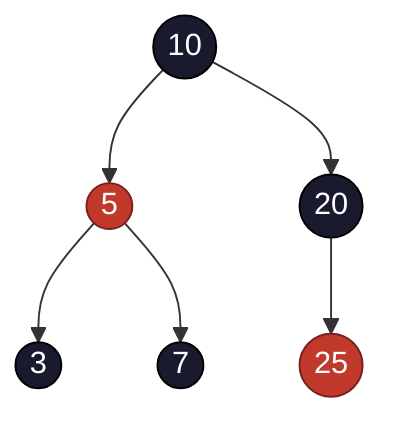

## Objetivos de Aprendizagem

- Enunciar precisamente os quatro invariantes rubro-negros: todo nó é vermelho ou preto, a raiz é preta, um nó vermelho nunca tem um filho vermelho, e todo caminho raiz-a-folha tem o mesmo número de nós pretos.
- Derivar, a partir desses quatro invariantes, por que a altura de uma árvore rubro-negra é limitada por 2·log₂(n+1).
- Identificar que árvores rubro-negras não são uma curiosidade acadêmica mas o esquema real por trás de `TreeMap`/`TreeSet` do Java e a implementação típica por trás de `std::map`/`std::set` do C++.
- Descrever, em um nível conceitual, como inserção e remoção restauram os invariantes usando recoloração e rotações, sem precisar enumerar exaustivamente cada caso.
- Contrastar a sobrecarga de contabilidade de um nó rubro-negro (um bit de cor) com a de um nó AVL (um campo de altura ou fator de balanceamento).

## Contexto e Motivação

Os dois conceitos anteriores construíram árvores AVL do zero: um invariante numérico preciso (fator de balanceamento em {−1, 0, 1}), uma prova rigorosa via a recorrência de Fibonacci de por que esse invariante limita altura, e um mecanismo completamente trabalhado, rotação, em todos os quatro casos, para restaurar o invariante depois de qualquer inserção ou remoção. Árvores AVL são uma resposta completa e correta para o problema com o qual esta disciplina abriu. Não são, no entanto, a *única* resposta, e este conceito introduz a segunda clássica: a **árvore rubro-negra**, originalmente concebida por Rudolf Bayer em 1972 (sob o nome de "árvore B binária simétrica") e dada sua apresentação moderna baseada em cor por Leonidas Guibas e Robert Sedgewick em 1978.

A razão pela qual um segundo esquema vale um conceito inteiro, em vez de uma nota de rodapé, é que árvores rubro-negras não são uma variação menor, elas impõem uma condição de balanceamento **mais frouxa** que a da AVL, expressa através de cores de nó em vez de números de altura, e essa frouxidão não é uma fraqueza pela qual pedir desculpas. É uma troca de engenharia deliberada e bem compreendida: uma árvore rubro-negra pode ser um tanto mais alta que uma árvore AVL contendo os mesmos dados, mas precisa realizar menos rotações, em média, para se manter assim depois de uma inserção ou remoção. Essa troca é exatamente por que árvores rubro-negras, não árvores AVL, são o que de fato vem embutido em alguns dos softwares mais amplamente usados que existem: `java.util.TreeMap` e `TreeSet` do Java foram implementados como árvores rubro-negras desde sua introdução, e toda implementação importante de biblioteca padrão de C++ (libstdc++, a STL da Microsoft, libc++) implementa `std::map` e `std::set` como árvores rubro-negras também, mesmo que o próprio padrão C++ apenas exija as *garantias de complexidade* que uma árvore rubro-negra acontece de entregar, não a estrutura de dados específica. Entender árvores rubro-negras, em outras palavras, é entender uma peça de infraestrutura que está por baixo de enormes quantidades de código real do dia a dia. A comparação quantitativa completa entre AVL e rubro-negra, quando a troca favorece uma sobre a outra, é o conceito de encerramento desta disciplina; este é sobre acertar precisamente os próprios invariantes rubro-negros.

## Teoria Central

### Os quatro invariantes, enunciados precisamente

Uma **árvore rubro-negra** é uma árvore binária de busca na qual todo nó carrega um bit adicional de informação, uma **cor**, vermelha ou preta, sujeita a quatro regras, todas as quais devem se manter simultaneamente em todo momento quiescente (o mesmo sentido "sempre, não apenas eventualmente" de "invariante" introduzido no primeiro conceito desta disciplina):

1. **Todo nó é colorido vermelho ou preto.** (Sem terceira opção, sem nó sem cor.)
2. **A raiz é preta.**
3. **Um nó vermelho nunca tem um filho vermelho**, equivalentemente, nenhum caminho da raiz até uma folha jamais contém dois nós vermelhos seguidos. Isso é frequentemente formulado como "sem aresta vermelho-vermelho."
4. **Todo caminho de um dado nó até qualquer uma de suas folhas NIL descendentes contém o mesmo número de nós pretos.** Essa contagem (não incluindo o próprio nó inicial) é chamada de **black-height** (altura preta) daquele nó.

Essa quarta regra exige uma convenção sobre o que conta como uma "folha": os ponteiros de filho ausentes de todo nó real são tratados como apontando para um nó sentinela **NIL** compartilhado, e esse nó NIL é sempre considerado **preto**. Essa convenção não é um tecnicismo menor, a prova do limite de altura abaixo depende de contar folhas NIL como pretas, e pular essa convenção é uma das fontes mais comuns de uma árvore rubro-negra incorretamente "verificada."



A raiz 10 é preta (regra 2); os únicos nós vermelhos são 5 e 25, e nenhum tem um filho vermelho (regra 3); todo caminho raiz-a-NIL passa por exatamente dois nós pretos contando o NIL terminal (regra 4, verificada explicitamente no Exemplo Resolvido 1).

### Por que essas quatro regras limitam a altura a 2·log₂(n+1)

Este é o fato que este conceito mais quer de fato justificar em vez de apenas afirmar, e segue um formato similar ao argumento de Fibonacci para árvores AVL no conceito anterior: um argumento de contagem, dessa vez baseado em black-height em vez de altura simples.

**Passo 1 — uma subárvore com black-height bh tem pelo menos 2^bh − 1 nós internos (não NIL).** Prova por indução sobre altura. Se um nó x é ele mesmo uma folha NIL, sua black-height é 0 por convenção, e tem 0 nós internos, correspondendo a 2⁰ − 1 = 0. Para um nó interno x com black-height bh(x), considere seus dois filhos: a black-height de cada filho é ou bh(x) (se o filho é vermelho, já que um nó vermelho não consome uma contagem de black-height ao descer) ou bh(x) − 1 (se o filho é preto). De qualquer forma, a black-height de cada filho é pelo menos bh(x) − 1, então pela hipótese indutiva (filhos têm altura menor que x), a subárvore de cada filho tem pelo menos 2^(bh(x)−1) − 1 nós internos. Somando ambos os filhos mais o próprio x: pelo menos 1 + 2·(2^(bh(x)−1) − 1) = 2^bh(x) − 1 nós internos na subárvore de x.

**Passo 2 — relacione black-height na raiz à altura real da árvore.** A regra 3 (sem aresta vermelho-vermelho) garante que em qualquer caminho raiz-a-folha, nós vermelhos nunca podem ser adjacentes, então pelo menos a cada outro nó no caminho é preto. Isso significa que a black-height da raiz, bh(raiz), é pelo menos h/2, onde h é a altura real da árvore (o caminho raiz-a-folha mais longo).

**Passo 3 — combine.** Com n o número total de nós internos (reais), o Passo 1 dá n ≥ 2^bh(raiz) − 1 ≥ 2^(h/2) − 1. Resolvendo para h: n + 1 ≥ 2^(h/2), então h/2 ≤ log₂(n+1), dando:

```
h ≤ 2 · log₂(n + 1)
```

Este é o limite de altura rubro-negro, e é uma constante genuinamente diferente do ~1,44 · log₂ n da AVL: árvores rubro-negras podem ser até cerca de **duas vezes** mais altas, no pior caso absoluto, que uma árvore perfeitamente balanceada do mesmo tamanho, uma garantia notavelmente mais frouxa que a penalidade de ~44% da AVL. Ambas ainda são O(log n), que é tudo que qualquer invariante de fato precisa entregar; a diferença na constante é exatamente a troca "mais estrito versus mais frouxo" que o conceito de encerramento desta disciplina examina completamente.

### Inserção e remoção: recoloração e rotação, conceitualmente

Um novo valor é sempre inserido como uma folha **vermelha**. Essa escolha é deliberada: inserir um nó vermelho nunca pode, por si só, mudar nenhuma contagem de black-height (a regra 4 é automaticamente preservada, já que um nó vermelho contribui zero para black-height), então a única regra que uma nova inserção pode possivelmente violar é a regra 3, um nó vermelho pode agora ter um pai vermelho. Se o pai do novo nó é preto, nada mais é necessário; a árvore já é uma árvore rubro-negra válida novamente. Se o pai é vermelho, um procedimento de **fix-up** sobe a partir do novo nó, resolvendo a violação vermelho-vermelho usando um de dois tipos de reparo local, escolhido examinando o "tio" do novo nó (o outro filho de seu avô):

- **Se o tio é vermelho:** recolore o pai e o tio para preto e o avô para vermelho. Isso repara a violação local mas pode simplesmente realocá-la um nível acima (o avô, agora vermelho, pode ele mesmo ter um pai vermelho), então o fix-up continua subindo, potencialmente até a raiz, puramente por recoloração, sem nenhuma rotação de forma alguma nesse ramo da análise de caso.
- **Se o tio é preto (ou ausente, ou seja, NIL):** uma rotação, simples ou dupla, no mesmo espírito das rotações AVL cobertas no conceito anterior, embora a mecânica exata de ponteiro difira nos detalhes de quais nós são recoloridos junto com a rotação, resolve a violação imediatamente, sem precisar subir mais.

Remoção segue o mesmo espírito, recoloração primeiro, rotação apenas quando recoloração sozinha não consegue restaurar a regra 4, mas tem mais casos distintos a considerar, porque remover um nó (especialmente um preto) pode reduzir uma contagem de black-height de uma forma que recolorir vários ancestrais pode ou não conseguir absorver antes de uma rotação se tornar necessária. A conclusão conceitual importante, e a razão pela qual esta disciplina não repete o tratamento exaustivo de quatro casos da AVL aqui, é que o *formato* do fix-up é a mesma ideia já completamente derivada para AVL: detecte uma violação de invariante local, suba resolvendo-a com uma quantidade limitada de trabalho local, e use rotação apenas quando recoloração mais barata não consegue fazer o trabalho sozinha. Um fato conhecido e citável que vale a pena lembrar em vez de rederivar aqui: inserção rubro-negra nunca exige mais que um pequeno número constante de rotações (no máximo duas) para terminar, não importa quantas recolorações a precederam, e remoção também nunca exige mais que um pequeno número constante (no máximo três), a parte potencialmente O(log n) de qualquer operação é a caminhada de recoloração, não a contagem de rotação, e recoloração sozinha é trabalho O(1) por nó visitado.

### Comparação de sobrecarga: um bit de cor versus um campo de altura

Um nó AVL precisa de bits suficientes para armazenar uma altura ou fator de balanceamento, na prática, frequentemente um pequeno campo inteiro (um byte é mais que suficiente, já que alturas são limitadas por O(log n), mas raramente é compactado para menos bits em implementações típicas). Um nó rubro-negro precisa de exatamente **um bit**: vermelho ou preto. Em implementações conscientes de memória, esse bit frequentemente pode ser dobrado no bit baixo não usado de um ponteiro existente (já que ponteiros são tipicamente alinhados a endereços pares) a custo de memória extra essencialmente zero, um detalhe que parcialmente explica por que árvores rubro-negras são um padrão atraente em código de biblioteca de propósito geral onde sobrecarga de memória por nó importa através de potencialmente milhões de nós.

## Exemplos Resolvidos

### Exemplo 1 — verificando todos os quatro invariantes em uma árvore concreta

**Problema:** Confirme que a árvore da Teoria Central (raiz 10 preta, 5 vermelha, 20 preta, 3 preta, 7 preta, 25 vermelha) satisfaz todos os quatro invariantes rubro-negros.

**Regra 1 (todo nó colorido):** Por construção, todo nó listado tem uma cor explícita. ✓

**Regra 2 (raiz preta):** O nó 10, a raiz, é preto. ✓

**Regra 3 (sem aresta vermelho-vermelho):** Os nós vermelhos são 5 e 25. Verifique os filhos de 5: 3 (preto) e 7 (preto), sem filho vermelho. Verifique os filhos de 25: ambos NIL, que contam como pretos por convenção, sem filho vermelho. ✓

**Regra 4 (black-height igual em todo caminho raiz-a-NIL):** Enumere todo caminho raiz-a-NIL de 10, contando nós pretos depois da raiz (a própria cor da raiz não é contada nessa convenção, apenas nós estritamente abaixo dela até e incluindo o NIL terminal):

- 10 → 5 → 3 → NIL: nós contados são 3 (preto), NIL (preto) = 2 nós pretos.
- 10 → 5 → 7 → NIL: 7 (preto), NIL (preto) = 2.
- 10 → 20 → NIL (filho esquerdo ausente de 20): 20 (preto), NIL (preto) = 2.
- 10 → 20 → 25 → NIL: 20 (preto, conta como 1), 25 (vermelho, não conta), NIL (preto, conta como 1) = 2.

Total para esse último caminho: 2. ✓ corresponde aos outros três caminhos.

**Conclusão.** Todos os quatro caminhos raiz-a-NIL têm exatamente 2 nós pretos; todas as quatro regras se mantêm. Esta é uma árvore rubro-negra válida.

### Exemplo 2 — quantificando o limite de altura para um milhão de nós

**Problema:** Para n = 1.000.000 nós, calcule o limite de altura de pior caso rubro-negro e compare-o com o limite de pior caso AVL do conceito anterior e o pior caso de BST comum de dois conceitos atrás.

**Limite rubro-negro.** h ≤ 2 · log₂(n + 1) = 2 · log₂(1.000.001) ≈ 2 × 19,93 ≈ 39,9, então altura no máximo cerca de 40 no pior caso.

**Limite AVL (conceito anterior).** h ≤ 1,44 · log₂(n) ≈ 1,44 × 19,93 ≈ 28,7, então no máximo cerca de 29.

**Pior caso de BST comum (Por Que Balanceamento Importa).** h = n − 1 = 999.999 sob inserção em ordem crescente.

**Comparação.** Mesmo em seu pior caso absoluto, uma árvore rubro-negra com um milhão de nós (altura ≤ 40) não está nem perto do caso degenerado da BST comum (altura 999.999), ambos os esquemas autobalanceados entregam a mesma garantia qualitativa O(log n). A lacuna entre o ≈29 da AVL e o ≈40 da rubro-negra é real (árvores rubro-negras podem ser aproximadamente 38% mais altas que árvores AVL no pior caso aqui) mas pequena comparada à lacuna de qualquer uma delas em relação ao caso não balanceado. Este é exatamente o pano de fundo numérico que o próximo conceito usa para explicar por que essa diferença de altura, apesar de real, frequentemente não é o fator decisivo ao escolher entre os dois esquemas.

### Exemplo 3 — um fix-up de inserção conceitual: apenas recoloração versus rotação

**Problema:** Começando da árvore válida no Exemplo 1, insira o valor `1` como uma nova folha vermelha (se torna o filho esquerdo de 3), e descreva, em um nível conceitual, que tipo de fix-up é disparado.

**Antes do fix-up:** o nó 1 é vermelho, seu pai 3 é preto. Como 3 é preto, a regra 3 não é violada de forma alguma, nenhum fix-up é necessário. Essa inserção não exigiu nenhuma recoloração e nenhuma rotação, ilustrando o caso comum: a maioria das inserções cai sob um pai preto e não precisa de nenhuma correção.

**Um cenário diferente:** suponha em vez disso que o valor `4` é inserido como um novo filho direito vermelho do nó 3, mas o nó 3 é preto, então novamente sem violação. Agora suponha, hipoteticamente, que o nó 3 tivesse sido colorido vermelho em vez disso (uma árvore inicial diferente) e o tio do novo nó vermelho (o nó 7) também fosse vermelho: este é o caso "tio vermelho" da Teoria Central, recolore 3 e 7 para preto, recolore seu pai 5 para vermelho, e verifique se a nova cor vermelha de 5 cria uma violação com *seu* pai 10 (não cria, já que 10 é preto), fix-up completo via recoloração sozinha, nenhuma rotação necessária. Se em vez disso o tio fosse preto, uma rotação no avô (espelhando a mecânica de rotação AVL do conceito anterior, adaptada para também trocar as cores apropriadas) resolveria a violação em um único passo. Este é o formato essencial de todo fix-up de inserção rubro-negra: verifique a cor do tio, recolore e possivelmente continue subindo, ou gire uma vez e pare, sem precisar memorizar todo subcaso como uma checklist exaustiva da forma que os quatro casos de rotação da AVL foram trabalhados mecanicamente no conceito anterior.

## Equívocos Comuns e Armadilhas

- **"Árvores rubro-negras são apenas uma versão pior de árvores AVL."** Elas impõem um invariante diferente e mais frouxo de propósito, o Exemplo 2 mostra que a penalidade de altura (≈40 versus ≈29 para um milhão de nós) é real mas modesta, e compra rebalanceamento mais barato em inserção/remoção (no máximo um pequeno número constante de rotações, versus a AVL também precisar de seu próprio custo de rotação limitado mas não nulo). Nenhuma árvore é estritamente melhor; esta é exatamente a troca que o próximo conceito examina de frente.
- **"Folhas NIL não precisam ser contadas ao verificar os invariantes."** A contagem de black-height da regra 4 depende de tratar toda folha NIL como preta, a contagem caminho-por-caminho do Exemplo 1 inclui explicitamente o NIL terminal na conta de todo caminho. Pular essa convenção faz os quatro caminhos parecerem ter black-heights *diferentes* quando na verdade correspondem, levando a uma conclusão falsa de que uma árvore válida é inválida.
- **"Um nó vermelho pode ter um filho vermelho e um filho preto, contanto que não sejam ambos."** A regra 3 proíbe *qualquer* filho vermelho de um nó vermelho, um filho vermelho já é uma violação, não uma aprovação parcial. "Sem aresta vermelho-vermelho" significa tolerância zero em qualquer um dos lados, não "no máximo um."
- **"Inserção e remoção rubro-negras sempre exigem rotações para consertar as coisas."** O Exemplo 3 mostra que o caso mais comum (pai do novo nó é preto) não exige nenhum trabalho de fix-up de forma alguma, e mesmo quando um fix-up é disparado, o caso "tio vermelho" se resolve via recoloração sozinha, potencialmente até a raiz, sem nenhuma rotação naquele ramo.
- **"Já que o padrão C++ não exige árvores rubro-negras, é incorreto dizer que `std::map` 'é' uma árvore rubro-negra."** O padrão de fato apenas especifica garantias de complexidade (busca/inserção/remoção logarítmicas, iteração em ordem), não a implementação, mas este é um caso em que as garantias são específicas o suficiente, e a escolha de implementação universal o suficiente através de toda biblioteca padrão importante (libstdc++, libc++, MSVC STL), que "árvore rubro-negra" é uma descrição prática completamente precisa do que `std::map`/`std::set` de fato são em virtualmente todo programa C++ real, e o mesmo vale para `TreeMap`/`TreeSet` do Java, que documentam a implementação rubro-negra diretamente.

## Resumo

Uma árvore rubro-negra impõe balanceamento através de quatro regras sobre cores de nó em vez da verificação numérica de altura da AVL: todo nó é vermelho ou preto, a raiz é preta, nenhum nó vermelho tem um filho vermelho, e todo caminho raiz-a-folha-NIL tem o mesmo número de nós pretos (sua black-height). Um argumento de contagem, qualquer subárvore com black-height bh tem pelo menos 2^bh − 1 nós internos, combinado com a regra de sem-aresta-vermelho-vermelho forçando black-height a ser pelo menos metade da altura real da árvore, produz o limite h ≤ 2·log₂(n+1), uma frouxidão real mas modesta comparada ao ~1,44·log₂ n da AVL. Novos nós são sempre inseridos vermelhos, o que só pode ameaçar a regra de sem-vermelho-vermelho, e o fix-up sobe a árvore recolorindo (barato, potencialmente O(log n) passos) e girando apenas quando recoloração sozinha não consegue terminar o trabalho (um pequeno número constante de rotações, nunca uma reconstrução exaustiva caso-a-caso). Este não é um esquema acadêmico: é a estratégia de balanceamento real por trás de `TreeMap`/`TreeSet` do Java e a escolha de implementação quase universal por trás de `std::map`/`std::set` do C++. O próximo e último conceito desta disciplina coloca AVL e rubro-negra lado a lado e pergunta, concretamente, quando um sistema real deveria preferir uma sobre a outra.

## Documentation Links

- [Sedgewick & Wayne — Algorithms Lectures (Princeton)](https://algs4.cs.princeton.edu/lectures/) — doc
- [ACM/IEEE CS2013 — Algorithms and Complexity Knowledge Area](https://csed.acm.org/cs2013-version/) — doc
