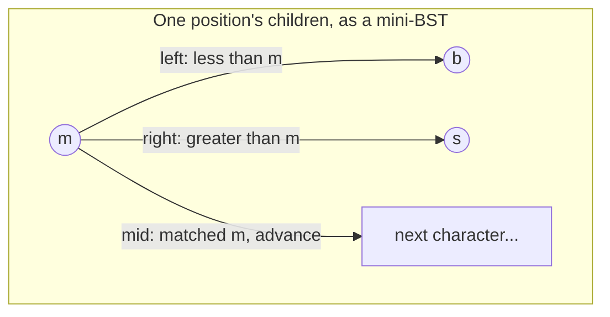
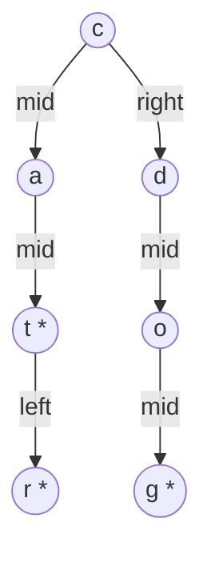

## Learning Objectives

- Explain the memory cost of a standard trie node (one child slot per possible alphabet character) and why it becomes wasteful for large or sparse alphabets.
- Describe the structure of a ternary search trie (TST) node — exactly three children (less-than, equal, greater-than) organized as a mini binary search on the current character.
- Trace an insert and a search operation through a TST, character by character, following the correct one of the three child pointers at each step.
- Compare the asymptotic search cost and real-world memory footprint of a TST against a standard (array- or dict-based) trie, and state the trade-off precisely.
- Determine, given a description of an alphabet and key set, whether a standard trie or a TST is the more appropriate choice.

## Context & Motivation

The standard trie from the previous two concepts makes a very specific bet at every single node: reserve a child slot for every character the alphabet could possibly contain, whether or not any key actually uses that slot at this position. For a small, fixed alphabet like lowercase English letters, that bet is cheap — 26 array slots per node, most of which end up occupied in a trie built from ordinary English words. But the moment the alphabet grows — Unicode text with tens of thousands of code points, case-sensitive keys mixed with digits and punctuation, or any application where the character set isn't small and tightly used — a per-node array sized to the whole alphabet becomes mostly empty space at nearly every node, since any individual key set typically touches only a small fraction of a large alphabet at any given position. A dictionary-based trie (using a Python `dict` per node, as in the previous concept) avoids allocating unused slots, but pays a different cost: a hash table's per-entry overhead (bucket arrays, hash computation, pointer chasing) at *every single node* of a structure that may already have millions of nodes for a large key set.

A **ternary search trie** (TST) is the answer to this specific problem: it keeps the trie's core idea — spell a key out one character per step, so shared prefixes share a path — but replaces the "one child slot per alphabet character" design with exactly three children per node, organized as a miniature binary search over the current character. This is a genuinely different data structure design, not a minor implementation tweak, and it appears in exactly the algorithms courses this curriculum traces (Sedgewick's treatment of TSTs alongside standard tries is canonical) because it demonstrates a recurring theme in data structure design: a structure's asymptotic complexity and its real-world memory footprint are two different axes, and a design that's slightly slower on one can be dramatically better on the other. Nothing about the alphabet size shows up in a TST's per-node cost, which is exactly the property that makes it viable for large or sparse alphabets where a standard trie's array-per-node design would be memory-prohibitive.

## Core Theory

### The memory problem a TST solves

In a standard trie backed by a fixed-size array (rather than a dictionary), each node reserves one slot per possible character in the alphabet, regardless of how many of those slots end up used. For an alphabet of size R, a trie with N total nodes uses O(N × R) space for child pointers alone, even if the actual key set only ever populates a small fraction of those slots at any given node. For R = 26 (lowercase English), this is usually tolerable. For R in the tens of thousands (Unicode) or for applications where each node in practice has very few of the possible next characters actually present (common once you're several characters deep into most words, where branching narrows sharply), the array approach wastes the overwhelming majority of its allocated space on empty slots that are never filled.

### The TST node: three children, not R

A TST node holds exactly three child pointers, conventionally called:

- **left** (or "less than"): the subtree for keys whose current character is *less than* this node's character.
- **mid** (or "equal"): the subtree for keys whose current character *equals* this node's character — following this pointer means moving on to the *next* character of the key.
- **right** (or "greater than"): the subtree for keys whose current character is *greater than* this node's character.

Each node also stores a single character (the one it represents) and, as in a standard trie, an end-of-word marker for keys that terminate exactly at this node's mid-path.

```python
class TSTNode:
    def __init__(self, char: str):
        self.char = char
        self.left = None
        self.mid = None
        self.right = None
        self.is_end_of_word = False
```

The left/right pointers do not advance to a new character at all — they stay at the *same* character position in the key, doing a binary-search-style comparison to find the right node for that position among however many distinct characters have been inserted there. Only the mid pointer advances the key position. This is the essential mechanism: rather than a single node fanning out into R children (one per possible character), a TST represents "the set of children at this position" as its own little binary search tree, with left/right as its internal comparisons and mid as the way out to the next position once a match is found.



### Insert and search: character-by-character, with a binary search at each step

To search a TST for a key, start at the root with the key's first character. At each node, compare the current key character to the node's character: if it's less, go left; if it's greater, go right (staying at the same key character in both cases); if it's equal, and there are more characters left in the key, advance to the next character and follow mid; if it's equal and the key is fully consumed, check the node's end-of-word marker exactly as in a standard trie. Insertion follows the identical comparisons, creating a new node wherever the needed left/right/mid pointer doesn't yet exist, and marking the final node (reached after the last character matches and advances) as end-of-word.

```python
class TST:
    def __init__(self):
        self.root = None

    def insert(self, key: str) -> None:
        self.root = self._insert(self.root, key, 0)

    def _insert(self, node, key, i):
        ch = key[i]
        if node is None:
            node = TSTNode(ch)
        if ch < node.char:
            node.left = self._insert(node.left, key, i)
        elif ch > node.char:
            node.right = self._insert(node.right, key, i)
        elif i + 1 < len(key):
            node.mid = self._insert(node.mid, key, i + 1)
        else:
            node.is_end_of_word = True
        return node

    def search(self, key: str) -> bool:
        node = self._search(self.root, key, 0)
        return node is not None and node.is_end_of_word

    def _search(self, node, key, i):
        if node is None:
            return None
        ch = key[i]
        if ch < node.char:
            return self._search(node.left, key, i)
        elif ch > node.char:
            return self._search(node.right, key, i)
        elif i + 1 < len(key):
            return self._search(node.mid, key, i + 1)
        else:
            return node
```

### Complexity trade-off, stated precisely

Searching a TST built from N keys of average length L costs O(L + log N) character comparisons in the well-balanced case — the log N term is the cost of the left/right binary search at each of the L character positions, which a standard trie's direct array or dict indexing avoids entirely (an array lookup or dict lookup for "the child for character c" is O(1), not O(log R)). So a TST is, in the strict asymptotic sense, somewhat slower per search than a standard trie with array-based nodes. What it wins in exchange is per-node memory: a TST node's size is fixed and small (one character, three pointers, one boolean) regardless of alphabet size, versus a standard trie node's O(R) child array. For a large or sparse alphabet, the TST's fixed small per-node cost, multiplied by a possibly larger node count from the added left/right structure, still typically comes out dramatically smaller in total memory than R pointers per node — this is the "trades a little search speed for dramatically better memory use" trade-off named directly in this concept's summary, and it is a genuine trade in both directions, not a strict win for the TST.

## Worked Examples

### Example 1 — inserting three keys into a TST and tracing the resulting shape

**Problem:** Insert `"cat"`, `"car"`, and `"dog"` into an empty TST, in that order, and trace the resulting node structure.

**Solution.** Inserting `"cat"` into an empty tree creates a fresh chain: root node `c` (mid) → `a` (mid) → `t` (marked end-of-word) — three nodes, each reached via mid since there was nothing to compare against yet.

Inserting `"car"`: at the root, `c == c`, so advance to `a` via mid, comparing `a` (from `"car"`) against the existing `a` node — equal, advance to the next character `r`, comparing against the existing mid child `t`. Since `r < t` alphabetically, go **left** from `t`, creating a new node `r` (marked end-of-word) as `t`'s left child — not a new mid-chain, but a sibling at the same character position as `t`.

Inserting `"dog"`: at the root, compare `d` (from `"dog"`) against the root's character `c`. Since `d > c`, go **right** from the root, creating a new node `d` — this starts an entirely separate chain from the root's right pointer, since `"dog"` shares no prefix with `"cat"`/`"car"`. Continue with mid-chains for `o` and `g` (marked end-of-word).



This trace shows the two distinct roles of the pointers clearly: mid always advances to a new character position (c→a→t spells `"ca_"`, then t/r are two different third characters at the *same* position), while left/right stay at one character position and only decide which node represents which value there.

### Example 2 — searching for a key that requires a left/right step

**Problem:** Using the TST from Example 1, trace `search("car")` and `search("cap")`.

**Solution.** `search("car")`: at root `c`, key char is `c` — equal, advance to key char `a`, follow mid to node `a`. At node `a`, key char is `a` — equal, advance to key char `r`, follow mid to node `t`. At node `t`, key char is `r`; since `r < t`, go left (staying at this same key character, not advancing) to node `r`. At node `r`, key char is `r` — equal, and this was the last character (i = 2, len - 1), so check `is_end_of_word` on this node: **True**. `"car"` is found.

`search("cap")`: identical walk through `c` → `a` → arrives at node `t` comparing key char `p`. Since `p < t`, go left to node `r`. At node `r`, key char is `p`; since `p < r`, go left again — but `r` has no left child (`None`). The search returns `None`, so `"cap"` is correctly reported absent, even though it shares two characters with a real stored key.

### Example 3 — estimating the memory difference against an array-based standard trie

**Problem:** For an alphabet of size R = 65,536 (a stand-in for a large Unicode subset) and a trie/TST both storing the same 10,000 keys, compare the *shape* of the memory cost (not exact byte counts) between an array-based standard trie and a TST.

**Solution.** An array-based standard trie node reserves R = 65,536 pointer slots regardless of how many are actually used — even a node with only 2 real children still allocates the full array (or some structure sized to R), so total memory scales as O(N_nodes × R), which for even a modest node count becomes enormous: a mere 1,000 nodes at 65,536 pointers each is tens of millions of pointer slots, nearly all of them empty. A TST node, by contrast, always holds exactly 3 pointers plus one character and one boolean, independent of R entirely — total memory scales as O(N_nodes), with a small constant factor, and N_nodes for a TST is typically somewhat larger than for the equivalent standard trie (because of the added left/right structure needed to distinguish characters at a shared position) but never scales with R. For R this large, the TST's total memory is dramatically smaller — this is precisely the scenario (large or sparse alphabet) where the standard trie's per-node array becomes untenable and the TST's fixed-size node is the practical choice, at the cost of the O(log N) left/right search per character noted in Core Theory.

## Common Misconceptions & Pitfalls

- **"A TST's left and right pointers advance to the next character, just like mid."** They do not — this is the single most important distinction to get right. Left and right stay at the *same* character position in the key, comparing against a different candidate character stored at a sibling node; only mid, taken after an equality match, moves on to the next character. Example 1's `t`/`r` pair — both representing the third character of a three-letter word, connected via left, not mid — depends entirely on this distinction holding.
- **"A TST is just a binary search tree of characters."** A TST is a hybrid: within one character position, the left/right structure genuinely behaves like a BST comparison, but the mid pointer introduces the trie's defining property (advancing character position, building shared-prefix paths) that a plain BST of whole strings does not have. Collapsing a TST into "a BST" loses the prefix-sharing behavior entirely.
- **"A TST is strictly better than a standard trie, so it should always be preferred."** A TST trades away some search speed (an added O(log N) factor from the left/right comparisons at each character) in exchange for memory efficiency. For a small, fixed alphabet like lowercase English letters, where an array-based standard trie's O(R) per-node cost is already cheap (R = 26), that memory savings is minor and not worth the added comparison overhead — a standard trie is often the better choice there. The TST's advantage is specific to large or sparse alphabets, not universal.
- **"Balance in a TST is automatic, just like in a standard trie."** A standard trie's shape depends only on which keys are inserted, not their insertion order, and its per-position lookup is always O(1) or O(R) depending on implementation — never dependent on comparison order. A TST's left/right structure, however, behaves like an ordinary (unbalanced) BST at each character position, meaning insertion order *does* affect its shape and its worst-case search cost, exactly as an unbalanced BST's shape and worst case depend on insertion order (a concern addressed in this discipline's self-balancing tree concepts, though rarely applied directly to TSTs in practice since character distributions at a given trie depth are rarely adversarial).

## Summary

A ternary search trie replaces a standard trie's per-node array of R child slots (one per possible alphabet character) with exactly three children — left, mid, right — organized as a miniature binary search over the current character at each position, where only mid advances the key position and left/right stay put while comparing against sibling characters. This makes per-node memory cost independent of alphabet size entirely, which is decisive for large or sparse alphabets (Unicode text, mixed-case and punctuated keys) where a standard array-based trie's O(R) per node becomes prohibitive, at the cost of an added O(log N) comparison factor per character during search — slower than a standard trie's O(1) per-character indexing, but still comparable to, and often better than, alternatives once memory is accounted for. The trade is genuine in both directions: for small fixed alphabets, a standard trie's cheap array indexing usually wins outright, while for large or sparse alphabets, the TST's fixed small node size wins on memory by a wide margin. Both structures preserve the defining trie property — shared prefixes become shared paths — which is what makes prefix-based operations native to either variant.

## Documentation Links

- [Sedgewick & Wayne — Algorithms Lectures (Princeton)](https://algs4.cs.princeton.edu/lectures/) — doc
- [Stanford CS166 — Data Structures](https://web.stanford.edu/class/cs166) — doc
