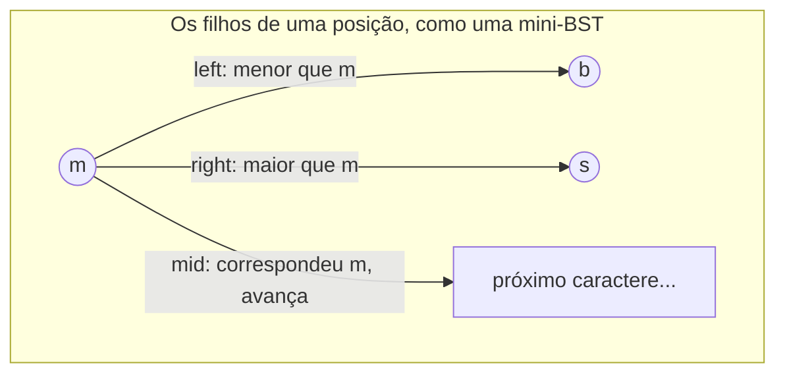
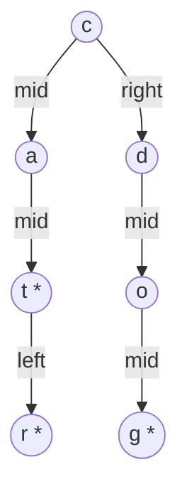

## Objetivos de Aprendizagem

- Explicar o custo de memória de um nó de trie padrão (um slot de filho por caractere possível do alfabeto) e por que se torna desperdiçador para alfabetos grandes ou esparsos.
- Descrever a estrutura de um nó de ternary search trie (TST), exatamente três filhos (menor-que, igual, maior-que) organizados como uma mini busca binária sobre o caractere atual.
- Rastrear uma operação de inserção e busca através de uma TST, caractere por caractere, seguindo o correto dos três ponteiros de filho em cada passo.
- Comparar o custo de busca assintótico e a pegada de memória do mundo real de uma TST contra uma trie padrão (baseada em array ou dict), e enunciar a troca precisamente.
- Determinar, dada uma descrição de um alfabeto e conjunto de chaves, se uma trie padrão ou uma TST é a escolha mais apropriada.

## Contexto e Motivação

A trie padrão dos dois conceitos anteriores faz uma aposta muito específica em todo único nó: reserve um slot de filho para todo caractere que o alfabeto poderia possivelmente conter, seja ou não alguma chave de fato usar aquele slot nessa posição. Para um alfabeto pequeno e fixo como letras minúsculas do inglês, essa aposta é barata, 26 slots de array por nó, a maioria dos quais acaba ocupada em uma trie construída a partir de palavras inglesas comuns. Mas no momento em que o alfabeto cresce, texto Unicode com dezenas de milhares de pontos de código, chaves sensíveis a caixa misturadas com dígitos e pontuação, ou qualquer aplicação onde o conjunto de caracteres não é pequeno e apertadamente usado, um array por nó dimensionado para o alfabeto inteiro se torna majoritariamente espaço vazio em quase todo nó, já que qualquer conjunto de chaves individual tipicamente toca apenas uma pequena fração de um alfabeto grande em qualquer posição dada. Uma trie baseada em dicionário (usando um `dict` do Python por nó, como no conceito anterior) evita alocar slots não usados, mas paga um custo diferente: a sobrecarga por entrada de uma hash table (arrays de bucket, cálculo de hash, perseguição de ponteiro) em *todo único nó* de uma estrutura que pode já ter milhões de nós para um conjunto de chaves grande.

Uma **ternary search trie** (TST) é a resposta para esse problema específico: mantém a ideia central da trie, soletrar uma chave um caractere por passo, para que prefixos compartilhados compartilhem um caminho, mas substitui o design de "um slot de filho por caractere de alfabeto" por exatamente três filhos por nó, organizados como uma busca binária em miniatura sobre o caractere atual. Este é um design de estrutura de dados genuinamente diferente, não um ajuste de implementação menor, e aparece exatamente nos cursos de algoritmos que este currículo rastreia (o tratamento de Sedgewick de TSTs ao lado de tries padrão é canônico) porque demonstra um tema recorrente em design de estrutura de dados: a complexidade assintótica de uma estrutura e sua pegada de memória do mundo real são dois eixos diferentes, e um design que é ligeiramente mais lento em um pode ser dramaticamente melhor no outro. Nada sobre o tamanho do alfabeto aparece no custo por nó de uma TST, que é exatamente a propriedade que a torna viável para alfabetos grandes ou esparsos onde o design de array-por-nó de uma trie padrão seria proibitivo em memória.

## Teoria Central

### O problema de memória que uma TST resolve

Em uma trie padrão apoiada em um array de tamanho fixo (em vez de um dicionário), cada nó reserva um slot por caractere possível no alfabeto, independentemente de quantos desses slots acabam usados. Para um alfabeto de tamanho R, uma trie com N nós totais usa O(N × R) de espaço apenas para ponteiros de filho, mesmo que o conjunto de chaves real apenas jamais popule uma pequena fração desses slots em qualquer nó dado. Para R = 26 (inglês minúsculo), isso geralmente é tolerável. Para R nas dezenas de milhares (Unicode) ou para aplicações onde cada nó na prática tem muito poucos dos possíveis próximos caracteres de fato presentes (comum uma vez que você está vários caracteres dentro da maioria das palavras, onde a ramificação se estreita nitidamente), a abordagem de array desperdiça a esmagadora maioria de seu espaço alocado em slots vazios que nunca são preenchidos.

### O nó de TST: três filhos, não R

Um nó de TST contém exatamente três ponteiros de filho, convencionalmente chamados:

- **left** (ou "menor que"): a subárvore para chaves cujo caractere atual é *menor que* o caractere deste nó.
- **mid** (ou "igual"): a subárvore para chaves cujo caractere atual *é igual* ao caractere deste nó, seguir esse ponteiro significa avançar para o *próximo* caractere da chave.
- **right** (ou "maior que"): a subárvore para chaves cujo caractere atual é *maior que* o caractere deste nó.

Cada nó também armazena um único caractere (aquele que representa) e, como em uma trie padrão, um marcador de fim-de-palavra para chaves que terminam exatamente no caminho-mid deste nó.

```python
class TSTNode:
    def __init__(self, char: str):
        self.char = char
        self.left = None
        self.mid = None
        self.right = None
        self.is_end_of_word = False
```

Os ponteiros left/right não avançam para um novo caractere de forma alguma, permanecem na *mesma* posição de caractere na chave, fazendo uma comparação estilo busca-binária para encontrar o nó certo para aquela posição entre quantos caracteres distintos foram inseridos ali. Apenas o ponteiro mid avança a posição da chave. Este é o mecanismo essencial: em vez de um único nó se ramificando em R filhos (um por caractere possível), uma TST representa "o conjunto de filhos nesta posição" como sua própria pequena árvore de busca binária, com left/right como suas comparações internas e mid como a saída para a próxima posição uma vez que uma correspondência é encontrada.



### Insert e search: caractere-por-caractere, com uma busca binária em cada passo

Para buscar uma chave em uma TST, comece na raiz com o primeiro caractere da chave. Em cada nó, compare o caractere atual da chave com o caractere do nó: se é menor, vá à esquerda; se é maior, vá à direita (permanecendo no mesmo caractere de chave em ambos os casos); se é igual, e há mais caracteres restantes na chave, avance para o próximo caractere e siga mid; se é igual e a chave está totalmente consumida, verifique o marcador de fim-de-palavra do nó exatamente como em uma trie padrão. Inserção segue as comparações idênticas, criando um novo nó onde quer que o ponteiro left/right/mid necessário ainda não exista, e marcando o nó final (alcançado depois de o último caractere corresponder e avançar) como fim-de-palavra.

```python
class TST:
    def __init__(self):
        self.root = None

    def insert(self, key: str) -> None:
        self.root = self._insert(self.root, key, 0)

    def _insert(self, node, key, i):
        ch = key[i]
        if node is None:
            node = TSTNode(ch)
        if ch < node.char:
            node.left = self._insert(node.left, key, i)
        elif ch > node.char:
            node.right = self._insert(node.right, key, i)
        elif i + 1 < len(key):
            node.mid = self._insert(node.mid, key, i + 1)
        else:
            node.is_end_of_word = True
        return node

    def search(self, key: str) -> bool:
        node = self._search(self.root, key, 0)
        return node is not None and node.is_end_of_word

    def _search(self, node, key, i):
        if node is None:
            return None
        ch = key[i]
        if ch < node.char:
            return self._search(node.left, key, i)
        elif ch > node.char:
            return self._search(node.right, key, i)
        elif i + 1 < len(key):
            return self._search(node.mid, key, i + 1)
        else:
            return node
```

### Troca de complexidade, enunciada precisamente

Buscar em uma TST construída a partir de N chaves de comprimento médio L custa O(L + log N) comparações de caractere no caso bem balanceado, o termo log N é o custo da busca binária left/right em cada uma das L posições de caractere, que a indexação direta de array ou dict de uma trie padrão evita inteiramente (uma busca de array ou busca de dict para "o filho para o caractere c" é O(1), não O(log R)). Então uma TST é, no sentido assintótico estrito, um tanto mais lenta por busca que uma trie padrão com nós baseados em array. O que ganha em troca é memória por nó: o tamanho de um nó de TST é fixo e pequeno (um caractere, três ponteiros, um booleano) independentemente do tamanho do alfabeto, versus o array de filho O(R) de um nó de trie padrão. Para um alfabeto grande ou esparso, o custo pequeno e fixo por nó da TST, multiplicado por uma contagem de nó possivelmente maior devido à estrutura left/right adicionada, ainda tipicamente sai dramaticamente menor em memória total que R ponteiros por nó, essa é a troca "troca um pouco de velocidade de busca por uso de memória dramaticamente melhor" nomeada diretamente no resumo deste conceito, e é uma troca genuína em ambas as direções, não uma vitória estrita para a TST.

## Exemplos Resolvidos

### Exemplo 1 — inserindo três chaves em uma TST e rastreando o formato resultante

**Problema:** Insira `"cat"`, `"car"`, e `"dog"` em uma TST vazia, nessa ordem, e rastreie a estrutura de nó resultante.

**Solução.** Inserir `"cat"` em uma árvore vazia cria uma corrente nova: nó raiz `c` (mid) → `a` (mid) → `t` (marcado fim-de-palavra), três nós, cada um alcançado via mid já que não havia nada para comparar contra ainda.

Inserindo `"car"`: na raiz, `c == c`, então avance para `a` via mid, comparando `a` (de `"car"`) contra o nó `a` existente, igual, avance para o próximo caractere `r`, comparando contra o filho mid existente `t`. Como `r < t` alfabeticamente, vá **à esquerda** de `t`, criando um novo nó `r` (marcado fim-de-palavra) como o filho esquerdo de `t`, não uma nova corrente-mid, mas um irmão na mesma posição de caractere que `t`.

Inserindo `"dog"`: na raiz, compare `d` (de `"dog"`) contra o caractere da raiz `c`. Como `d > c`, vá **à direita** da raiz, criando um novo nó `d`, isso inicia uma corrente inteiramente separada a partir do ponteiro direito da raiz, já que `"dog"` não compartilha nenhum prefixo com `"cat"`/`"car"`. Continue com correntes-mid para `o` e `g` (marcado fim-de-palavra).



Este rastreamento mostra os dois papéis distintos dos ponteiros claramente: mid sempre avança para uma nova posição de caractere (c→a→t soletra `"ca_"`, depois t/r são dois terceiros caracteres diferentes na *mesma* posição), enquanto left/right permanecem em uma posição de caractere e apenas decidem qual nó representa qual valor ali.

### Exemplo 2 — buscando uma chave que exige um passo left/right

**Problema:** Usando a TST do Exemplo 1, rastreie `search("car")` e `search("cap")`.

**Solução.** `search("car")`: na raiz `c`, o caractere de chave é `c`, igual, avance para o caractere de chave `a`, siga mid até o nó `a`. No nó `a`, o caractere de chave é `a`, igual, avance para o caractere de chave `r`, siga mid até o nó `t`. No nó `t`, o caractere de chave é `r`; como `r < t`, vá à esquerda (permanecendo nesse mesmo caractere de chave, não avançando) até o nó `r`. No nó `r`, o caractere de chave é `r`, igual, e este foi o último caractere (i = 2, len - 1), então verifique `is_end_of_word` nesse nó: **True**. `"car"` é encontrado.

`search("cap")`: caminhada idêntica através de `c` → `a` → chega no nó `t` comparando o caractere de chave `p`. Como `p < t`, vá à esquerda até o nó `r`. No nó `r`, o caractere de chave é `p`; como `p < r`, vá à esquerda novamente, mas `r` não tem filho esquerdo (`None`). A busca retorna `None`, então `"cap"` é corretamente relatado ausente, mesmo que compartilhe dois caracteres com uma chave real armazenada.

### Exemplo 3 — estimando a diferença de memória contra uma trie padrão baseada em array

**Problema:** Para um alfabeto de tamanho R = 65.536 (um substituto para um grande subconjunto Unicode) e uma trie/TST ambas armazenando as mesmas 10.000 chaves, compare o *formato* do custo de memória (não contagens exatas de byte) entre uma trie padrão baseada em array e uma TST.

**Solução.** Um nó de trie padrão baseado em array reserva R = 65.536 slots de ponteiro independentemente de quantos são de fato usados, mesmo um nó com apenas 2 filhos reais ainda aloca o array completo (ou alguma estrutura dimensionada para R), então a memória total escala como O(N_nós × R), que mesmo para uma contagem de nó modesta se torna enorme: meros 1.000 nós a 65.536 ponteiros cada são dezenas de milhões de slots de ponteiro, quase todos vazios. Um nó de TST, em contraste, sempre contém exatamente 3 ponteiros mais um caractere e um booleano, independente de R inteiramente, a memória total escala como O(N_nós), com um pequeno fator constante, e N_nós para uma TST é tipicamente um tanto maior que para a trie padrão equivalente (por causa da estrutura left/right adicionada necessária para distinguir caracteres em uma posição compartilhada) mas nunca escala com R. Para R tão grande, a memória total da TST é dramaticamente menor, esse é precisamente o cenário (alfabeto grande ou esparso) onde o array por nó da trie padrão se torna insustentável e o nó de tamanho fixo da TST é a escolha prática, ao custo da busca O(log N) left/right por caractere notada na Teoria Central.

## Equívocos Comuns e Armadilhas

- **"Os ponteiros left e right de uma TST avançam para o próximo caractere, igual ao mid."** Não avançam, esta é a distinção mais importante a acertar. Left e right permanecem na *mesma* posição de caractere na chave, comparando contra um caractere candidato diferente armazenado em um nó irmão; apenas mid, tomado depois de uma correspondência de igualdade, avança para o próximo caractere. O par `t`/`r` do Exemplo 1, ambos representando o terceiro caractere de uma palavra de três letras, conectados via left, não mid, depende inteiramente dessa distinção se manter.
- **"Uma TST é apenas uma árvore de busca binária de caracteres."** Uma TST é um híbrido: dentro de uma posição de caractere, a estrutura left/right genuinamente se comporta como uma comparação de BST, mas o ponteiro mid introduz a propriedade definidora da trie (avançar posição de caractere, construir caminhos de prefixo compartilhado) que uma BST comum de strings inteiras não tem. Colapsar uma TST em "uma BST" perde inteiramente o comportamento de compartilhamento de prefixo.
- **"Uma TST é estritamente melhor que uma trie padrão, então deveria sempre ser preferida."** Uma TST abre mão de alguma velocidade de busca (um fator O(log N) adicionado das comparações left/right em cada caractere) em troca de eficiência de memória. Para um alfabeto pequeno e fixo como letras minúsculas do inglês, onde o custo O(R) por nó de uma trie padrão baseada em array já é barato (R = 26), essa economia de memória é menor e não vale a sobrecarga de comparação adicionada, uma trie padrão frequentemente é a escolha melhor ali. A vantagem da TST é específica a alfabetos grandes ou esparsos, não universal.
- **"Balanceamento em uma TST é automático, igual em uma trie padrão."** O formato de uma trie padrão depende apenas de quais chaves são inseridas, não sua ordem de inserção, e sua busca por posição é sempre O(1) ou O(R) dependendo da implementação, nunca dependente da ordem de comparação. A estrutura left/right de uma TST, no entanto, se comporta como uma BST comum (não balanceada) em cada posição de caractere, significando que a ordem de inserção *de fato* afeta seu formato e seu custo de busca de pior caso, exatamente como o formato e pior caso de uma BST não balanceada dependem da ordem de inserção (uma preocupação abordada nos conceitos de árvore autobalanceada desta disciplina, embora raramente aplicada diretamente a TSTs na prática já que distribuições de caractere em uma dada profundidade de trie raramente são adversariais).

## Resumo

Uma ternary search trie substitui o array por nó de R slots de filho (um por caractere possível do alfabeto) de uma trie padrão por exatamente três filhos, left, mid, right, organizados como uma busca binária em miniatura sobre o caractere atual em cada posição, onde apenas mid avança a posição da chave e left/right permanecem parados enquanto comparam contra caracteres irmãos. Isso torna o custo de memória por nó independente do tamanho do alfabeto inteiramente, que é decisivo para alfabetos grandes ou esparsos (texto Unicode, chaves de caixa mista e pontuadas) onde o O(R) por nó de uma trie padrão baseada em array se torna proibitivo, ao custo de um fator de comparação O(log N) adicionado por caractere durante busca, mais lento que a indexação O(1) por caractere de uma trie padrão, mas ainda comparável a, e frequentemente melhor que, alternativas uma vez que memória é contabilizada. A troca é genuína em ambas as direções: para alfabetos pequenos e fixos, a indexação de array barata de uma trie padrão geralmente vence completamente, enquanto para alfabetos grandes ou esparsos, o tamanho de nó pequeno e fixo da TST vence em memória por uma margem larga. Ambas as estruturas preservam a propriedade definidora de trie, prefixos compartilhados se tornam caminhos compartilhados, que é o que torna operações baseadas em prefixo nativas para qualquer uma das variantes.

## Documentation Links

- [Sedgewick & Wayne — Algorithms Lectures (Princeton)](https://algs4.cs.princeton.edu/lectures/) — doc
- [Stanford CS166 — Data Structures](https://web.stanford.edu/class/cs166) — doc
