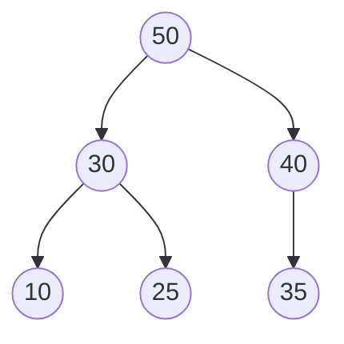

## Learning Objectives

- State the max-heap property (and its min-heap mirror) precisely, as a relation between a node and its children only.
- Explain why the heap property is strictly weaker than a binary search tree's total-ordering invariant, and identify concrete trees that satisfy one but not the other.
- Prove that the maximum element of a max-heap is always found at the root, in O(1).
- Contrast the cost of maintaining the heap property against the cost of maintaining a BST's ordering invariant under insertion.
- Recognize that a heap is not a sorted structure, and correctly predict what in-order-style traversal of a heap's array would (and would not) produce.

## Context & Motivation

The `binary-trees-terminology-and-representation` concept in the data-structures-i discipline built the full vocabulary for binary trees — root, leaf, depth, height, and the full/complete/perfect shape hierarchy — and, along the way, made a quiet but important observation: the *implicit array representation* it introduced (child of index `i` living at `2i+1` and `2i+2`) is compact and cache-friendly precisely when the underlying tree is complete, and it flagged, almost as a forward reference, that "this is exactly the efficiency that makes the array representation the standard choice for heaps later in this curriculum, where completeness is maintained as an invariant." That concept never needed the word "heap" for anything beyond that one sentence, because ordinary binary trees and binary search trees don't require completeness at all — they can be as lopsided as insertions happen to make them, and the array representation would be wasteful for them. A heap is the first structure in this course where completeness stops being incidental and becomes a maintained guarantee, which is exactly why the array trick that was a curiosity there becomes the *default* representation here (developed fully in the next concept).

But before getting to representation, there is a more fundamental question: what invariant does a heap actually enforce, and why is it useful? The answer is deliberately weaker than what a binary search tree enforces, and that weakness is the entire point. A BST guarantees a *total* ordering — for every node, everything in its left subtree is smaller and everything in its right subtree is larger — and that total ordering is expensive to buy: maintaining it under insertion or deletion can require rebalancing effort that (without extra machinery) allows the tree to degrade to a linked list in the worst case, as the upcoming `bst-performance-and-balance` material will make precise. A heap asks for far less: only that each node be at least as large as its own two children (for a max-heap), with no requirement whatsoever about how a node compares to its sibling's subtree, or how far-left descendants compare to far-right ones. This is a genuinely local, parent-child-only constraint, not a global one — and it turns out to be exactly enough to answer the one question a **priority queue** actually needs answered fast: "what's the most important thing waiting right now?" Operating systems scheduling which process runs next, Dijkstra's and Prim's algorithms repeatedly asking for the cheapest unvisited edge, and event-driven simulations processing events in timestamp order are all, underneath, asking a heap the same question over and over, and the heap property is tuned precisely to make that one question cheap while everything else about the structure stays loose and cheap to maintain.

## Core Theory

### The max-heap property, stated precisely

A binary tree satisfies the **max-heap property** if, for every node `v` that has a parent `p`, `p`'s value is greater than or equal to `v`'s value. Equivalently, stated top-down: every node's value is greater than or equal to the value of each of its children (a leaf has no children, so it satisfies the property vacuously). A **min-heap** is the mirror image: every node's value is less than or equal to each of its children's values. Unless stated otherwise, "heap" defaults to max-heap in this material, and everything said about it dualizes directly to the min-heap case by flipping every comparison.

Note precisely what this does *not* say: it says nothing about how a node's left child compares to its right child (either order, or equal values, is fine), and it says nothing about how a node compares to nodes in a *sibling's* subtree — a node's left grandchild could easily be larger than its right child, as long as it's still smaller than its own direct parent. The only guaranteed comparisons run along parent-child edges, never across siblings or between cousins.



Check the property directly: 50 ≥ 30 ✓, 50 ≥ 40 ✓, 30 ≥ 10 ✓, 30 ≥ 25 ✓, 40 ≥ 35 ✓. Every parent-child edge obeys the property, so this is a valid max-heap — even though 40 (a right child of the root) is larger than 30 (the root's left child), and even though 25 (a grandchild on the left) is larger than nothing across the tree except its own subtree. Cross-branch comparisons like "is 25 bigger or smaller than 35?" are simply never asked by the heap property, and indeed this heap doesn't answer that question at all.

### Why this weaker invariant is exactly enough for O(1) max-access

The max-heap property guarantees, by a one-line induction, that the root holds the overall maximum value in the tree: the root is ≥ both its children (by the property applied at the root); each of those children is, in turn, ≥ its own children (by the property applied one level down); chaining this argument down every root-to-leaf path shows the root is ≥ every node reachable from it — which, since the tree is connected, means every node in the tree. So finding the maximum of a max-heap is not a search at all — it is a single array or pointer read of the root, O(1), regardless of how many elements the heap holds. A min-heap gives the same guarantee for the minimum.

This is the trade the heap property is built around. A BST also lets you find an extreme value quickly (O(height) — walk all the way left, or all the way right), but finding the *maximum* is not what a BST is optimized for; a BST is optimized for finding *any* value by key, via its total ordering. A heap gives up that general lookup capability entirely — there is no efficient way to check "is value X anywhere in this heap?" beyond a linear scan, because the weak, local invariant gives no directional information to prune a search the way a BST's ordering does. What a heap buys instead is that the *one* specific query it's built for — the current extreme — costs O(1) always, and, as the next two concepts will show, both restoring the property after removing that extreme and inserting a brand-new element cost only O(log n), because each operation only ever has to fix up a single path from root to leaf (or leaf to root), never a whole subtree.

### Heap property vs. BST ordering — a side-by-side view

| | BST ordering invariant | Max-heap property |
|---|---|---|
| Scope of comparison | Every node vs. entire left/right subtree | Every node vs. its own two children only |
| What's fast | Search for arbitrary key: O(height) | Find the maximum: O(1) |
| What's not guaranteed | Nothing extra — ordering is total | Sibling subtrees are incomparable; heap gives no help finding arbitrary keys |
| Shape after insertions | Can degrade toward a linked list without rebalancing | Always kept complete (next concept) — height stays Θ(log n) automatically |

The last row matters as much as the others: because a heap's shape invariant (completeness, covered next) is independent of the *values* inserted — unlike a BST, whose shape is a direct consequence of the order values arrive in — a heap's height is always Θ(log n) with no separate balancing machinery required, the way AVL or red-black trees need for a BST. The heap property is weaker on what it guarantees about ordering, but the completeness that comes bundled with it is, in effect, "balance for free."

## Worked Examples

### Example 1 — Checking whether an array-backed tree is a valid max-heap

**Problem:** Treating `[9, 7, 8, 3, 6, 8, 2]` as a binary tree via the implicit array representation (index `i`'s children at `2i+1`, `2i+2`), is it a valid max-heap?

**Reasoning.** Walk every internal node (index 0 through the last index with at least one child) and check it against both children.

```python
heap = [9, 7, 8, 3, 6, 8, 2]

def is_max_heap(arr):
    n = len(arr)
    for i in range(n):
        left, right = 2 * i + 1, 2 * i + 2
        if left < n and arr[i] < arr[left]:
            return False, (i, left)
        if right < n and arr[i] < arr[right]:
            return False, (i, right)
    return True, None

print(is_max_heap(heap))
```

Checking by hand: index 0 (value 9) has children at 1, 2 (values 7, 8) — 9 ≥ 7 ✓, 9 ≥ 8 ✓. Index 1 (value 7) has children at 3, 4 (values 3, 6) — 7 ≥ 3 ✓, 7 ≥ 6 ✓. Index 2 (value 8) has children at 5, 6 (values 8, 2) — 8 ≥ 8 ✓ (equal values are fine, the property is ≥ not >), 8 ≥ 2 ✓. Indices 3, 4, 5, 6 have no children (their child indices exceed length 7), so nothing left to check. Every edge holds — this is a valid max-heap, and the code above returns `(True, None)`.

### Example 2 — A tree that "looks sorted" but isn't a valid heap, and one that looks scrambled but is

**Problem:** Is `[5, 8, 3]` a valid max-heap? Is `[5, 3, 4, 1, 2]`?

**First array.** Index 0 (value 5) has children at 1, 2 (values 8, 3). 5 ≥ 8 is false — the property is violated immediately at the root. So `[5, 8, 3]` is not a max-heap, even though nothing about it "looks unsorted" at a glance — the array simply has a larger value tucked under a smaller one.

**Second array.** Index 0 (value 5): children at 1, 2 (values 3, 4) — 5 ≥ 3 ✓, 5 ≥ 4 ✓. Index 1 (value 3): children at 3, 4 (values 1, 2) — 3 ≥ 1 ✓, 3 ≥ 2 ✓. Index 2 (value 4): children at indices 5, 6, both out of range (length 5) — nothing to check. This one is valid, even though reading the array left to right (`5, 3, 4, 1, 2`) is not sorted in any global sense — that's expected, since a heap only promises parent-child comparisons, not an overall order. This is precisely why iterating a heap's backing array in index order is not the same as iterating values in sorted order — a misconception worth flagging explicitly below.

### Example 3 — Same values, two different valid heaps

**Problem:** Build two different valid max-heaps from the same five values `{1, 2, 3, 4, 5}`, to show the heap property under-determines the tree's exact shape (of values, not of structure — the *shape* is fixed by completeness, covered next; only the value placement within that shape is what varies here).

**One valid arrangement:** `[5, 4, 3, 1, 2]` — root 5 ≥ children 4, 3 ✓; node 4 ≥ children 1, 2 ✓; node 3 is a leaf here (no children in range).

**Another valid arrangement:** `[5, 2, 4, 1, 3]` — root 5 ≥ children 2, 4 ✓; node 2 ≥ children 1, 3? Check: 2 ≥ 1 ✓, but 2 ≥ 3 is false. This arrangement is *not* valid — it's a useful near-miss showing how easy it is to accidentally break the property by placing a larger value under a smaller parent.

**A genuinely different valid arrangement:** `[5, 3, 4, 2, 1]` — root 5 ≥ 3, 4 ✓; node 3 ≥ children 2, 1 ✓; node 4 is a leaf here. This is a distinct valid max-heap from the first one (different value at index 1, different value at index 3 and 4), confirming that the heap property pins down *relationships*, not a unique arrangement — multiple different arrays can all be equally valid max-heaps of the same value set, unlike a BST, whose in-order structure for a fixed insertion order is far more constrained.

## Common Misconceptions & Pitfalls

- **"A heap is basically a loosely-sorted BST."** A heap's invariant is not a relaxed version of a BST's — it's a different kind of invariant altogether, comparing only parent to child rather than a node to its entire subtree. Example 2 showed a valid max-heap, `[5, 3, 4, 1, 2]`, that is not remotely sorted when read left to right; conflating "heap" with "approximately sorted array" leads directly to wrong predictions about what a traversal of a heap will produce.
- **"Reading a heap's array in index order gives you the values in sorted (descending) order."** It does not, and Example 2's second array demonstrates this directly: `5, 3, 4, 1, 2` is a valid heap but is not descending. Getting values out of a heap in sorted order requires repeated extraction of the root (covered in `heap-insert-and-extract` and `heapsort`), not a single pass over the backing array.
- **"Since the max is at the root, the second-largest value must be one of the root's two direct children."** This is true, actually — but it's worth being precise about *why*, since it's easy to overstate: the second-largest value is guaranteed to be one of the root's children only because every other node is dominated by some ancestor chain leading to the root, and the only nodes not dominated by anything except the root itself are the root's direct children. It is not guaranteed to be the *larger* of the two children in some naive sense beyond that — both children are candidates, and you do need to compare them to find which one it is.
- **"If a tree satisfies the heap property, it must also be a complete tree."** These are two independent invariants that heaps happen to maintain *together* by convention, but the value-ordering property (heap property) and the shape property (completeness) are logically separate. It's entirely possible to construct a binary tree that satisfies the heap property at every parent-child edge while being wildly incomplete (e.g., a long chain of left children only, each smaller than its parent) — such a tree obeys the heap property but is not the array-friendly shape that the next concept relies on.

## Summary

The max-heap property requires only that every node's value be ≥ each of its children's values (min-heap: ≤) — a purely local, parent-child constraint with no requirement across siblings or between cousins, unlike a BST's total ordering. This weaker invariant is still exactly enough to guarantee, by a simple chaining argument down every root-to-leaf path, that the maximum value in the entire tree sits at the root, giving O(1) access to the extreme value — the one query a priority queue actually needs answered instantly. The trade is real: a heap cannot efficiently answer "is value X present?" the way a BST can, but it also doesn't pay a BST's potential cost of degrading toward a linked list, because (as the next concept develops) the shape invariant that accompanies the heap property — completeness — is independent of insertion order and keeps height at Θ(log n) automatically. A heap is not a sorted structure, and no single pass over it produces sorted output; extracting values in order requires the repeated-extraction process covered in later concepts.

## Documentation Links

- [MIT 6.006 — Lecture Notes (OCW)](https://ocw.mit.edu/courses/6-006-introduction-to-algorithms-spring-2020/pages/lecture-notes/) — doc
- [Sedgewick & Wayne — Algorithms Lectures (Princeton)](https://algs4.cs.princeton.edu/lectures/) — doc
