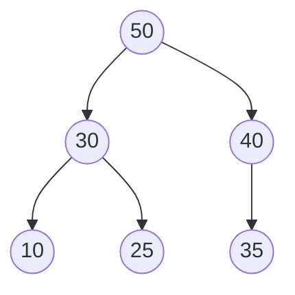

## Objetivos de Aprendizagem

- Enunciar precisamente a propriedade de max-heap (e seu espelho min-heap), como uma relação entre um nó e apenas seus filhos.
- Explicar por que a propriedade de heap é estritamente mais fraca que o invariante de ordenação total de uma árvore binária de busca, e identificar árvores concretas que satisfazem uma mas não a outra.
- Provar que o elemento máximo de um max-heap sempre é encontrado na raiz, em O(1).
- Contrastar o custo de manter a propriedade de heap contra o custo de manter o invariante de ordenação de uma BST sob inserção.
- Reconhecer que um heap não é uma estrutura ordenada, e prever corretamente o que uma travessia estilo em-ordem do array de um heap produziria (e não produziria).

## Contexto e Motivação

O conceito `binary-trees-terminology-and-representation` na disciplina data-structures-i construiu o vocabulário completo para árvores binárias, raiz, folha, profundidade, altura, e a hierarquia de formato completa/cheia/perfeita, e, ao longo do caminho, fez uma observação silenciosa mas importante: a *representação implícita em array* que introduziu (filho do índice `i` vivendo em `2i+1` e `2i+2`) é compacta e amigável ao cache precisamente quando a árvore subjacente é completa, e sinalizou, quase como uma referência futura, que "essa é exatamente a eficiência que torna a representação em array a escolha padrão para heaps mais tarde neste currículo, onde completude é mantida como um invariante." Aquele conceito nunca precisou da palavra "heap" para nada além dessa frase, porque árvores binárias comuns e árvores binárias de busca não exigem completude de forma alguma, podem ser tão desequilibradas quanto inserções acontecem de tornar, e a representação em array seria desperdiçadora para elas. Um heap é a primeira estrutura neste curso onde completude deixa de ser incidental e se torna uma garantia mantida, que é exatamente por que o truque de array que era uma curiosidade ali se torna a representação *padrão* aqui (desenvolvida completamente no próximo conceito).

Mas antes de chegar à representação, há uma pergunta mais fundamental: qual invariante um heap de fato impõe, e por que é útil? A resposta é deliberadamente mais fraca do que o que uma árvore binária de busca impõe, e essa fraqueza é todo o ponto. Uma BST garante uma ordenação *total*, para todo nó, tudo em sua subárvore esquerda é menor e tudo em sua subárvore direita é maior, e essa ordenação total é cara de comprar: mantê-la sob inserção ou remoção pode exigir esforço de rebalanceamento que (sem maquinário extra) permite que a árvore degrade para uma lista encadeada no pior caso, como o próximo material de `bst-performance-and-balance` tornará preciso. Um heap pede muito menos: apenas que cada nó seja pelo menos tão grande quanto seus próprios dois filhos (para um max-heap), sem nenhuma exigência sobre como um nó se compara à subárvore de seu irmão, ou como descendentes distantes à esquerda se comparam aos distantes à direita. Esta é uma restrição genuinamente local, apenas pai-filho, não global, e acaba sendo exatamente o suficiente para responder à única pergunta que uma **fila de prioridade** de fato precisa responder rapidamente: "qual é a coisa mais importante esperando agora mesmo?" Sistemas operacionais escalonando qual processo executa a seguir, os algoritmos de Dijkstra e Prim repetidamente perguntando pela aresta não visitada mais barata, e simulações orientadas a eventos processando eventos em ordem de timestamp estão todos, por baixo, perguntando a um heap a mesma pergunta repetidamente, e a propriedade de heap é ajustada precisamente para tornar essa única pergunta barata enquanto tudo mais sobre a estrutura permanece solto e barato de manter.

## Teoria Central

### A propriedade de max-heap, enunciada precisamente

Uma árvore binária satisfaz a **propriedade de max-heap** se, para todo nó `v` que tem um pai `p`, o valor de `p` é maior ou igual ao valor de `v`. Equivalentemente, enunciado de cima para baixo: o valor de todo nó é maior ou igual ao valor de cada um de seus filhos (uma folha não tem filhos, então satisfaz a propriedade vacuamente). Um **min-heap** é a imagem espelhada: o valor de todo nó é menor ou igual ao valor de cada um de seus filhos. A menos que especificado de outra forma, "heap" assume max-heap por padrão neste material, e tudo dito sobre ele se dualiza diretamente para o caso min-heap invertendo toda comparação.

Note precisamente o que isso *não* diz: não diz nada sobre como o filho esquerdo de um nó se compara ao filho direito (qualquer ordem, ou valores iguais, está tudo bem), e não diz nada sobre como um nó se compara a nós na subárvore de um *irmão*, o neto esquerdo de um nó poderia facilmente ser maior que seu filho direito, contanto que ainda seja menor que seu próprio pai direto. As únicas comparações garantidas correm ao longo de arestas pai-filho, nunca através de irmãos ou entre primos.



Verifique a propriedade diretamente: 50 ≥ 30 ✓, 50 ≥ 40 ✓, 30 ≥ 10 ✓, 30 ≥ 25 ✓, 40 ≥ 35 ✓. Toda aresta pai-filho obedece à propriedade, então este é um max-heap válido, mesmo que 40 (um filho direito da raiz) seja maior que 30 (o filho esquerdo da raiz), e mesmo que 25 (um neto à esquerda) seja maior que nada através da árvore exceto sua própria subárvore. Comparações entre ramos como "25 é maior ou menor que 35?" simplesmente nunca são feitas pela propriedade de heap, e de fato esse heap não responde a essa pergunta de forma alguma.

### Por que esse invariante mais fraco é exatamente suficiente para acesso máximo O(1)

A propriedade de max-heap garante, por uma indução de uma linha, que a raiz contém o valor máximo geral na árvore: a raiz é ≥ ambos seus filhos (pela propriedade aplicada na raiz); cada um desses filhos é, por sua vez, ≥ seus próprios filhos (pela propriedade aplicada um nível abaixo); encadear esse argumento descendo todo caminho raiz-a-folha mostra que a raiz é ≥ todo nó alcançável a partir dela, o que, já que a árvore é conectada, significa todo nó na árvore. Então encontrar o máximo de um max-heap não é uma busca de forma alguma, é uma única leitura de array ou ponteiro da raiz, O(1), independentemente de quantos elementos o heap contenha. Um min-heap dá a mesma garantia para o mínimo.

Esta é a troca em torno da qual a propriedade de heap é construída. Uma BST também permite encontrar um valor extremo rapidamente (O(altura), percorra todo o caminho à esquerda, ou todo o caminho à direita), mas encontrar o *máximo* não é para o que uma BST é otimizada; uma BST é otimizada para encontrar *qualquer* valor por chave, via sua ordenação total. Um heap abre mão dessa capacidade geral de busca inteiramente, não há forma eficiente de verificar "o valor X está em algum lugar neste heap?" além de uma varredura linear, porque o invariante fraco e local não dá nenhuma informação direcional para podar uma busca da forma que a ordenação de uma BST dá. O que um heap compra em vez disso é que a *única* consulta específica para a qual é construído, o extremo atual, custa O(1) sempre, e, como os próximos dois conceitos vão mostrar, tanto restaurar a propriedade depois de remover esse extremo quanto inserir um elemento totalmente novo custam apenas O(log n), porque cada operação só precisa consertar um único caminho da raiz até a folha (ou folha até a raiz), nunca uma subárvore inteira.

### Propriedade de heap vs. ordenação de BST — uma visão lado a lado

| | Invariante de ordenação BST | Propriedade de max-heap |
|---|---|---|
| Escopo da comparação | Todo nó vs. subárvore esquerda/direita inteira | Todo nó vs. apenas seus próprios dois filhos |
| O que é rápido | Buscar por chave arbitrária: O(altura) | Encontrar o máximo: O(1) |
| O que não é garantido | Nada extra, a ordenação é total | Subárvores irmãs são incomparáveis; o heap não ajuda a encontrar chaves arbitrárias |
| Formato depois de inserções | Pode degradar em direção a uma lista encadeada sem rebalanceamento | Sempre mantido completo (próximo conceito), altura permanece Θ(log n) automaticamente |

A última linha importa tanto quanto as outras: porque o invariante de formato de um heap (completude, coberta a seguir) é independente dos *valores* inseridos, ao contrário de uma BST, cujo formato é uma consequência direta da ordem em que os valores chegam, a altura de um heap é sempre Θ(log n) sem nenhum maquinário de balanceamento separado exigido, da forma que árvores AVL ou rubro-negras exigem para uma BST. A propriedade de heap é mais fraca sobre o que garante quanto a ordenação, mas a completude que vem embutida com ela é, em efeito, "balanceamento de graça."

## Exemplos Resolvidos

### Exemplo 1 — verificando se uma árvore apoiada em array é um max-heap válido

**Problema:** Tratando `[9, 7, 8, 3, 6, 8, 2]` como uma árvore binária via a representação implícita em array (filhos do índice `i` em `2i+1`, `2i+2`), é um max-heap válido?

**Raciocínio.** Percorra todo nó interno (índice 0 até o último índice com pelo menos um filho) e verifique-o contra ambos os filhos.

```python
heap = [9, 7, 8, 3, 6, 8, 2]

def is_max_heap(arr):
    n = len(arr)
    for i in range(n):
        left, right = 2 * i + 1, 2 * i + 2
        if left < n and arr[i] < arr[left]:
            return False, (i, left)
        if right < n and arr[i] < arr[right]:
            return False, (i, right)
    return True, None

print(is_max_heap(heap))
```

Verificando à mão: índice 0 (valor 9) tem filhos em 1, 2 (valores 7, 8), 9 ≥ 7 ✓, 9 ≥ 8 ✓. Índice 1 (valor 7) tem filhos em 3, 4 (valores 3, 6), 7 ≥ 3 ✓, 7 ≥ 6 ✓. Índice 2 (valor 8) tem filhos em 5, 6 (valores 8, 2), 8 ≥ 8 ✓ (valores iguais estão tudo bem, a propriedade é ≥ não >), 8 ≥ 2 ✓. Índices 3, 4, 5, 6 não têm filhos (seus índices de filho excedem o comprimento 7), então nada mais para verificar. Toda aresta se mantém, este é um max-heap válido, e o código acima retorna `(True, None)`.

### Exemplo 2 — uma árvore que "parece ordenada" mas não é um heap válido, e uma que parece embaralhada mas é

**Problema:** `[5, 8, 3]` é um max-heap válido? E `[5, 3, 4, 1, 2]`?

**Primeiro array.** Índice 0 (valor 5) tem filhos em 1, 2 (valores 8, 3). 5 ≥ 8 é falso, a propriedade é violada imediatamente na raiz. Então `[5, 8, 3]` não é um max-heap, mesmo que nada nele "pareça desordenado" à primeira vista, o array simplesmente tem um valor maior escondido sob um menor.

**Segundo array.** Índice 0 (valor 5): filhos em 1, 2 (valores 3, 4), 5 ≥ 3 ✓, 5 ≥ 4 ✓. Índice 1 (valor 3): filhos em 3, 4 (valores 1, 2), 3 ≥ 1 ✓, 3 ≥ 2 ✓. Índice 2 (valor 4): filhos nos índices 5, 6, ambos fora da faixa (comprimento 5), nada a verificar. Este é válido, mesmo que ler o array da esquerda para a direita (`5, 3, 4, 1, 2`) não seja ordenado em nenhum sentido global, isso é esperado, já que um heap só promete comparações pai-filho, não uma ordem geral. Isso é precisamente por que percorrer o array de apoio de um heap em ordem de índice não é o mesmo que percorrer valores em ordem crescente, um equívoco que vale a pena sinalizar explicitamente abaixo.

### Exemplo 3 — os mesmos valores, dois heaps válidos diferentes

**Problema:** Construa dois max-heaps válidos diferentes a partir dos mesmos cinco valores `{1, 2, 3, 4, 5}`, para mostrar que a propriedade de heap sub-determina o formato exato da árvore (de valores, não de estrutura, a *estrutura* é fixada por completude, coberta a seguir; apenas o posicionamento de valor dentro dessa estrutura é o que varia aqui).

**Um arranjo válido:** `[5, 4, 3, 1, 2]`, raiz 5 ≥ filhos 4, 3 ✓; nó 4 ≥ filhos 1, 2 ✓; nó 3 é uma folha aqui (sem filhos na faixa).

**Outro arranjo válido:** `[5, 2, 4, 1, 3]`, raiz 5 ≥ filhos 2, 4 ✓; nó 2 ≥ filhos 1, 3? Verifique: 2 ≥ 1 ✓, mas 2 ≥ 3 é falso. Este arranjo *não* é válido, é um quase-acerto útil mostrando quão fácil é acidentalmente quebrar a propriedade colocando um valor maior sob um pai menor.

**Um arranjo válido genuinamente diferente:** `[5, 3, 4, 2, 1]`, raiz 5 ≥ 3, 4 ✓; nó 3 ≥ filhos 2, 1 ✓; nó 4 é uma folha aqui. Este é um max-heap válido distinto do primeiro (valor diferente no índice 1, valor diferente nos índices 3 e 4), confirmando que a propriedade de heap fixa *relações*, não um arranjo único, múltiplos arrays diferentes podem todos ser igualmente max-heaps válidos do mesmo conjunto de valores, ao contrário de uma BST, cuja estrutura em ordem para uma ordem de inserção fixa é muito mais restrita.

## Equívocos Comuns e Armadilhas

- **"Um heap é basicamente uma BST frouxamente ordenada."** O invariante de um heap não é uma versão relaxada do de uma BST, é um tipo de invariante inteiramente diferente, comparando apenas pai a filho em vez de um nó a sua subárvore inteira. O Exemplo 2 mostrou um max-heap válido, `[5, 3, 4, 1, 2]`, que não está nem de longe ordenado quando lido da esquerda para a direita; confundir "heap" com "array aproximadamente ordenado" leva diretamente a previsões erradas sobre o que uma travessia de um heap vai produzir.
- **"Ler o array de um heap em ordem de índice dá os valores em ordem (decrescente)."** Não dá, e o segundo array do Exemplo 2 demonstra isso diretamente: `5, 3, 4, 1, 2` é um heap válido mas não é decrescente. Obter valores de um heap em ordem exige extração repetida da raiz (coberta em `heap-insert-and-extract` e `heapsort`), não uma única passagem sobre o array de apoio.
- **"Já que o máximo está na raiz, o segundo maior valor deve ser um dos dois filhos diretos da raiz."** Isso na verdade é verdade, mas vale a pena ser preciso sobre *por quê*, já que é fácil superestimar: o segundo maior valor é garantido ser um dos filhos da raiz apenas porque todo outro nó é dominado por alguma cadeia de ancestral levando à raiz, e os únicos nós não dominados por nada exceto a própria raiz são os filhos diretos da raiz. Não é garantido ser o *maior* dos dois filhos em algum sentido ingênuo além disso, ambos os filhos são candidatos, e você precisa compará-los para descobrir qual é.
- **"Se uma árvore satisfaz a propriedade de heap, ela também deve ser uma árvore completa."** Esses são dois invariantes independentes que heaps acontecem de manter *juntos* por convenção, mas a propriedade de ordenação de valor (propriedade de heap) e a propriedade de formato (completude) são logicamente separadas. É inteiramente possível construir uma árvore binária que satisfaça a propriedade de heap em toda aresta pai-filho enquanto é extremamente incompleta (por exemplo, uma longa corrente de apenas filhos esquerdos, cada um menor que seu pai), tal árvore obedece à propriedade de heap mas não é o formato amigável a array do qual o próximo conceito depende.

## Resumo

A propriedade de max-heap exige apenas que o valor de todo nó seja ≥ cada um dos valores de seus filhos (min-heap: ≤), uma restrição puramente local, pai-filho, sem exigência através de irmãos ou entre primos, ao contrário da ordenação total de uma BST. Esse invariante mais fraco ainda é exatamente suficiente para garantir, por um argumento simples de encadeamento descendo todo caminho raiz-a-folha, que o valor máximo em toda a árvore fica na raiz, dando acesso O(1) ao valor extremo, a única consulta que uma fila de prioridade de fato precisa responder instantaneamente. A troca é real: um heap não pode responder eficientemente "o valor X está presente?" da forma que uma BST pode, mas também não paga o custo potencial de uma BST de degradar em direção a uma lista encadeada, porque (como o próximo conceito desenvolve) o invariante de formato que acompanha a propriedade de heap, completude, é independente da ordem de inserção e mantém a altura em Θ(log n) automaticamente. Um heap não é uma estrutura ordenada, e nenhuma única passagem sobre ele produz saída ordenada; extrair valores em ordem exige o processo de extração repetida coberto em conceitos posteriores.

## Documentation Links

- [MIT 6.006 — Lecture Notes (OCW)](https://ocw.mit.edu/courses/6-006-introduction-to-algorithms-spring-2020/pages/lecture-notes/) — doc
- [Sedgewick & Wayne — Algorithms Lectures (Princeton)](https://algs4.cs.princeton.edu/lectures/) — doc
