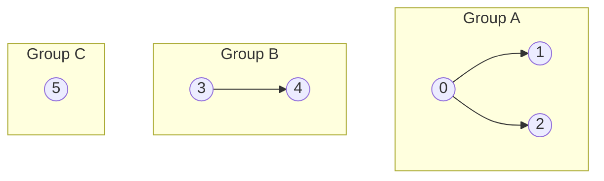

## Learning Objectives

- Define the disjoint-set (union-find) abstract data type in terms of its two operations, `union` and `find`.
- Explain how `find` alone is enough to answer a `connected` query between any two elements.
- Identify at least two real algorithmic problems — network connectivity and Kruskal's minimum spanning tree algorithm — that reduce directly to maintaining a dynamic partition of elements.
- Distinguish the union-find ADT from a general graph representation, and explain why it is a narrower, more specialized (and therefore faster) tool for the specific question it answers.
- State the two properties any correct union-find implementation must preserve: every element belongs to exactly one group, and groups only ever merge, never split.

## Context & Motivation

Suppose you are handed a long stream of pairs of computers, each pair reported as "these two just got connected by a cable," and at any point in the stream you might be asked "are computer 7 and computer 22 on the same network right now?" You could, in principle, rebuild the whole graph after every new cable and run a traversal (breadth-first search, depth-first search) from scratch to answer each connectivity question. That works, but it throws away everything you learned from the previous queries and previous cables — it treats each question as if the network had no history. The union-find abstract data type exists because there is a much better answer: maintain, incrementally, a partition of the elements into disjoint groups, where two elements are in the same group exactly when they are connected, and update that partition cheaply every time a new connection arrives, rather than recomputing it.

This is not a toy motivating example invented for a course — it is, in fact, the literal opening lecture of Robert Sedgewick and Kevin Wayne's "Algorithms, Part I" at Princeton, one of the most widely taken algorithms courses in the world (offered on Coursera and used as the textbook companion for Princeton's own CS courses). Sedgewick and Wayne open with union-find specifically, before graphs, before sorting, before anything else, because it is small enough to fully understand in one sitting and yet rich enough to carry the course's central methodological lesson: naive implementations that look "obviously fine" can be asymptotically terrible, and small, disciplined optimizations (which later concepts in this module develop) can turn a data structure with a bad worst case into one whose amortized cost per operation is, for all practical purposes, constant. Union-find is chosen as the vehicle for that lesson because the two operations it supports are almost embarrassingly simple to state, which makes it possible to see the optimizations and their effects with total clarity, unclouded by a complicated problem statement.

The union-find ADT is a collection of elements partitioned into disjoint sets — no element belongs to more than one set, and every element belongs to exactly one. It supports exactly two operations. `union(a, b)` merges the set containing `a` and the set containing `b` into a single set (if they were already the same set, nothing changes). `find(a)` returns an identifier for the set containing `a` — some canonical representative or label, not necessarily meaningful on its own, but useful because two elements are in the same set if and only if `find` returns the same identifier for both. From `find` alone, a third, derived operation falls out immediately: `connected(a, b)` is simply `find(a) == find(b)`. Notice what is deliberately absent — there is no `split` or `separate` operation. Once two elements have been merged into the same group, in this ADT, they never separate again. This restriction is not a limitation grudgingly accepted — it is exactly what makes the fast implementations in the concepts that follow possible; an ADT that had to support splitting groups back apart would need a substantially different (and typically more expensive) structure.

Beyond network connectivity, the single most important forward-pointer to name here is Kruskal's algorithm for building a minimum spanning tree, which will be covered in a sibling algorithms discipline in this curriculum. Kruskal's algorithm processes a graph's edges in increasing order of weight, and for each edge, must instantly answer one question: would adding this edge connect two vertices that are already connected (which would create a cycle, and so the edge must be rejected), or does it connect two previously separate components (in which case the edge belongs in the spanning tree, and the two components should now be treated as one)? This is, exactly, `connected` and `union` on a union-find structure over the graph's vertices — there is no reformulation needed, no adapter layer; Kruskal's algorithm simply *is* a loop that calls union-find operations, which is precisely why an efficient union-find implementation matters well beyond the toy connectivity example: it is a load-bearing component of one of the most-used graph algorithms in practice.

## Core Theory

### The ADT contract

Formally, a union-find (or disjoint-set) structure over a fixed universe of `n` elements, indexed `0` through `n − 1`, maintains a partition — a collection of disjoint, nonempty subsets whose union is the full set of `n` elements — and exposes:

- `find(p)`: returns an identifier for the subset containing element `p`.
- `union(p, q)`: replaces the subsets containing `p` and `q` with their union (a single merged subset); if `p` and `q` are already in the same subset, this is a no-op.
- `connected(p, q)` (derived): `true` exactly when `find(p) == find(q)`.

Initially, before any `union` call, every element is in its own singleton subset — there are `n` groups of size 1 each. Every `union` call reduces the number of distinct groups by exactly one (or leaves it unchanged, if the two elements were already connected). This gives an immediate, useful invariant: after any sequence of `union` calls, the number of groups is `n` minus the number of *effective* unions performed (unions that actually merged two previously distinct groups) — never negative, and it never increases, because there is no `split` operation to undo a merge.

### Why this ADT, and not a general graph

It is tempting to think "connectivity is a graph problem, so just build a graph and run a traversal" — and that would work correctly. The reason union-find exists as a distinct, narrower ADT is performance under a *dynamic*, incremental workload: a graph traversal from scratch costs time proportional to the number of vertices and edges every single time you ask a connectivity question, whereas a well-implemented union-find structure (the subject of the next several concepts in this module) answers each `find` or `union` in time that is, after the optimizations developed ahead, essentially constant, regardless of how many elements or how many prior unions there have been. The union-find ADT deliberately gives up generality — it cannot answer "what is the shortest path between these two elements," only "are they in the same group" — in exchange for that speed. This is a recurring theme worth internalizing generally: a narrower interface that promises less is often exactly what makes a much faster implementation possible.

### A visual model: forests of disjoint sets

The cleanest mental picture of a union-find structure partway through a sequence of operations is a forest — a collection of trees, one per group, where the elements of a group are the nodes of its tree, and no edge exists between trees belonging to different groups. This is exactly the mental model the next concept (`quick-find-and-quick-union`) makes literal in code.

Here there are three groups: {0, 1, 2}, {3, 4}, and {5}, drawn as three separate trees in one forest. A `union(2, 4)` call would merge the first two groups into one four-element group, leaving two groups total; a `find(1)` and a `find(0)` would return the same identifier (both are in Group A), while `find(1)` and `find(3)` would return different identifiers.

### The two invariants a correct implementation must preserve

Any implementation of this ADT — no matter how it internally represents the groups — must preserve two properties at every point in time: (1) every element belongs to exactly one group (the groups partition the universe — no element is missing, none is double-counted), and (2) groups only ever merge, never split. These two invariants are what make `find(a) == find(b)` a meaningful, stable test for "are `a` and `b` connected" — if either invariant were violated, that equivalence would silently become wrong.

## Worked Examples

### Example 1 — network connectivity from a stream of events

**Problem:** Ten computers, numbered 0–9, start with no connections. The following connection events arrive in order: `(4,3)`, `(3,8)`, `(6,5)`, `(9,4)`, `(2,1)`. After processing all five, is computer 8 connected to computer 9? Is computer 0 connected to anything?

**Reasoning, using the ADT abstractly (without committing to an implementation yet):** Start with 10 singleton groups: {0}, {1}, …, {9}.

- `union(4,3)` → merges {4} and {3} into {3,4}.
- `union(3,8)` → {3,4} and {8} merge into {3,4,8}.
- `union(6,5)` → {6} and {5} merge into {5,6}.
- `union(9,4)` → 4's group is {3,4,8}; merges with {9} into {3,4,8,9}.
- `union(2,1)` → {2} and {1} merge into {1,2}.

Final groups: {3,4,8,9}, {5,6}, {1,2}, {0} (untouched, still a singleton).

**Answer:** `connected(8, 9)` — both 8 and 9 are in {3,4,8,9} — is `true`. Computer 0 was never mentioned in any event, so it remains in its own singleton group {0}, connected to nothing else; `connected(0, k)` is `false` for every other `k`.

This is exactly the kind of question the ADT is built to answer cheaply and incrementally — notice that answering the query after all five events required no re-traversal of anything; it only required knowing the current partition, which was updated once per event.

### Example 2 — counting connected components as a running total

**Problem:** Using the same 10 computers and the same five events from Example 1, how many distinct groups exist after each event, in order?

**Reasoning:** Start with 10 groups. Each `union` call either merges two *distinct* groups (reducing the count by 1) or is a no-op on two elements already in the same group (count unchanged). Track it event by event:

| Event | Effective merge? | Group count after |
|---|---|---|
| start | — | 10 |
| union(4,3) | yes (4 and 3 were separate) | 9 |
| union(3,8) | yes (3's group and 8's group were separate) | 8 |
| union(6,5) | yes | 7 |
| union(9,4) | yes | 6 |
| union(2,1) | yes | 5 |

**Answer:** 5 distinct groups remain after all five events — matching the four listed groups from Example 1 ({3,4,8,9}, {5,6}, {1,2}, {0}) — five total once {0} is counted. This running-count technique (start at `n`, subtract 1 per effective union) is a useful sanity check independent of whatever concrete implementation is used underneath.

## Common Misconceptions & Pitfalls

- **"Union-find is just a graph, so I should use an adjacency list and run BFS/DFS for every connectivity query."** This is correct in the sense that it produces the right answer, but it defeats the entire point of the ADT: an adjacency-list-plus-traversal approach re-derives connectivity from scratch on every query, paying a cost proportional to the graph's size each time, rather than maintaining the partition incrementally. The specific implementations covered in the next concepts (quick-find, quick-union, and their optimized versions) are all designed to avoid exactly this recomputation.
- **"`union(a, b)` after `a` and `b` are already connected should do something — maybe merge them again, or error."** It should be a no-op, full stop. If `find(a) == find(b)` already, the sets containing them are already the same set, so "merging" them changes nothing; a correct implementation recognizes this case (often naturally, without extra checking, depending on the internal representation) and neither errors nor corrupts the partition.
- **"The identifier `find` returns has some meaning — e.g., it's the smallest element in the group, or the first element added."** In the general ADT contract, the identifier returned by `find` is only guaranteed to be *consistent* (same group ⟺ same identifier) — nothing more. Specific implementations may happen to always return, say, the root of a tree, but treating that root as semantically meaningful (as opposed to an implementation artifact) is a mistake that couples code unnecessarily to implementation details.
- **"You need a `split` operation for this to be a useful general-purpose structure."** The lack of `split` is deliberate, not a missing feature — it is exactly the restriction that makes the fast amortized implementations in this module possible. A structure needing to support arbitrary splits as well as merges is a fundamentally different (and typically much more expensive) problem.

## Summary

The union-find (disjoint-set) ADT maintains a dynamic partition of `n` elements into disjoint groups, exposing exactly two operations: `union(a, b)`, which merges two groups, and `find(a)`, which identifies which group `a` currently belongs to — from which `connected(a, b)` falls out as `find(a) == find(b)`. It deliberately omits any way to split a group back apart, and that restriction is what makes the module's upcoming optimizations possible. The ADT is motivated by real, recurring problems: tracking network connectivity incrementally as connections arrive, and — most notably — powering Kruskal's minimum spanning tree algorithm, where every edge considered requires exactly a `connected` check followed by, if the edge is kept, a `union`. Sedgewick and Wayne's Princeton "Algorithms, Part I" course opens with this exact ADT for good reason: it is simple enough to state completely in a few lines, yet rich enough to demonstrate, over the next several concepts, how a naive implementation with poor worst-case behavior can be transformed into one with essentially constant amortized cost per operation.

## Documentation Links

- [Sedgewick & Wayne — Algorithms Lectures (Princeton)](https://algs4.cs.princeton.edu/lectures/) — doc
- [Stanford CS166 — Data Structures](https://web.stanford.edu/class/cs166) — doc
