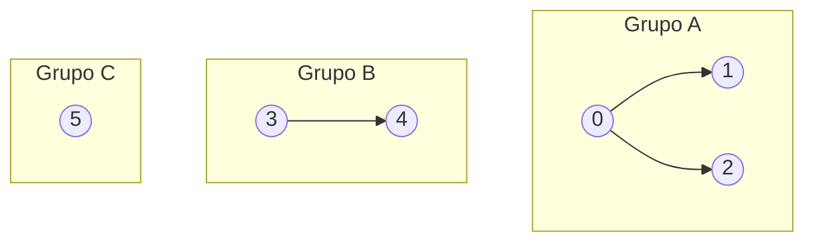

## Objetivos de Aprendizagem

- Definir o tipo abstrato de dado (TAD) de conjuntos disjuntos (union-find) em termos de suas duas operações, `union` e `find`.
- Explicar como `find` sozinho é suficiente para responder a uma consulta `connected` entre quaisquer dois elementos.
- Identificar pelo menos dois problemas algorítmicos reais, conectividade de rede e o algoritmo de árvore geradora mínima de Kruskal, que se reduzem diretamente a manter uma partição dinâmica de elementos.
- Distinguir o TAD union-find de uma representação de grafo geral, e explicar por que é uma ferramenta mais estreita e especializada (e portanto mais rápida) para a pergunta específica que responde.
- Enunciar as duas propriedades que qualquer implementação correta de union-find deve preservar: todo elemento pertence a exatamente um grupo, e grupos só se fundem, nunca se dividem.

## Contexto e Motivação

Suponha que você recebe um longo fluxo de pares de computadores, cada par relatado como "esses dois acabaram de ser conectados por um cabo," e a qualquer momento no fluxo você pode ser perguntado "o computador 7 e o computador 22 estão na mesma rede agora?" Você poderia, em princípio, reconstruir o grafo inteiro depois de todo novo cabo e rodar uma travessia (busca em largura, busca em profundidade) do zero para responder a cada pergunta de conectividade. Isso funciona, mas descarta tudo que você aprendeu das consultas anteriores e cabos anteriores, trata cada pergunta como se a rede não tivesse histórico. O tipo abstrato de dado union-find existe porque há uma resposta muito melhor: manter, incrementalmente, uma partição dos elementos em grupos disjuntos, onde dois elementos estão no mesmo grupo exatamente quando estão conectados, e atualizar essa partição baratamente toda vez que uma nova conexão chega, em vez de recalculá-la.

Este não é um exemplo motivador de brinquedo inventado para um curso, é, de fato, a literal palestra de abertura do "Algorithms, Part I" de Robert Sedgewick e Kevin Wayne em Princeton, um dos cursos de algoritmos mais frequentados do mundo (oferecido no Coursera e usado como o companheiro de livro-texto para os próprios cursos de CC de Princeton). Sedgewick e Wayne abrem com union-find especificamente, antes de grafos, antes de ordenação, antes de qualquer outra coisa, porque é pequeno o suficiente para entender completamente em uma sessão e ainda assim rico o suficiente para carregar a lição metodológica central do curso: implementações ingênuas que parecem "obviamente boas" podem ser assintoticamente terríveis, e pequenas otimizações disciplinadas (que conceitos posteriores neste módulo desenvolvem) podem transformar uma estrutura de dados com um pior caso ruim em uma cujo custo amortizado por operação é, para todos os propósitos práticos, constante. Union-find é escolhido como o veículo para essa lição porque as duas operações que suporta são quase embaraçosamente simples de enunciar, o que torna possível ver as otimizações e seus efeitos com clareza total, sem obscurecer por uma declaração de problema complicada.

O TAD union-find é uma coleção de elementos particionados em conjuntos disjuntos, nenhum elemento pertence a mais de um conjunto, e todo elemento pertence a exatamente um. Suporta exatamente duas operações. `union(a, b)` funde o conjunto contendo `a` e o conjunto contendo `b` em um único conjunto (se já fossem o mesmo conjunto, nada muda). `find(a)` retorna um identificador para o conjunto contendo `a`, algum representante canônico ou rótulo, não necessariamente significativo por si só, mas útil porque dois elementos estão no mesmo conjunto se e somente se `find` retorna o mesmo identificador para ambos. A partir de `find` sozinho, uma terceira operação derivada cai imediatamente: `connected(a, b)` é simplesmente `find(a) == find(b)`. Note o que está deliberadamente ausente, não há operação `split` ou `separate`. Uma vez que dois elementos foram fundidos no mesmo grupo, neste TAD, eles nunca mais se separam. Essa restrição não é uma limitação aceita a contragosto, é exatamente o que torna possíveis as implementações rápidas nos conceitos que seguem; um TAD que precisasse suportar dividir grupos de volta precisaria de uma estrutura substancialmente diferente (e tipicamente mais cara).

Além de conectividade de rede, o ponteiro para frente mais importante para nomear aqui é o algoritmo de Kruskal para construir uma árvore geradora mínima, que será coberto em uma disciplina irmã de algoritmos neste currículo. O algoritmo de Kruskal processa as arestas de um grafo em ordem crescente de peso, e para cada aresta, deve responder instantaneamente uma pergunta: adicionar essa aresta conectaria dois vértices que já estão conectados (o que criaria um ciclo, e portanto a aresta deve ser rejeitada), ou conecta dois componentes previamente separados (nesse caso, a aresta pertence à árvore geradora, e os dois componentes deveriam agora ser tratados como um)? Isso é, exatamente, `connected` e `union` em uma estrutura union-find sobre os vértices do grafo, não há reformulação necessária, nenhuma camada adaptadora; o algoritmo de Kruskal simplesmente *é* um loop que chama operações union-find, que é precisamente por que uma implementação eficiente de union-find importa muito além do exemplo de brinquedo de conectividade: é um componente estrutural de um dos algoritmos de grafo mais usados na prática.

## Teoria Central

### O contrato do TAD

Formalmente, uma estrutura union-find (ou conjunto disjunto) sobre um universo fixo de `n` elementos, indexados `0` a `n − 1`, mantém uma partição, uma coleção de subconjuntos disjuntos e não vazios cuja união é o conjunto completo de `n` elementos, e expõe:

- `find(p)`: retorna um identificador para o subconjunto contendo o elemento `p`.
- `union(p, q)`: substitui os subconjuntos contendo `p` e `q` por sua união (um único subconjunto fundido); se `p` e `q` já estão no mesmo subconjunto, isso é uma operação nula.
- `connected(p, q)` (derivado): `true` exatamente quando `find(p) == find(q)`.

Inicialmente, antes de qualquer chamada de `union`, todo elemento está em seu próprio subconjunto singleton, há `n` grupos de tamanho 1 cada. Toda chamada de `union` reduz o número de grupos distintos em exatamente um (ou o deixa inalterado, se os dois elementos já estivessem conectados). Isso dá um invariante imediato e útil: depois de qualquer sequência de chamadas `union`, o número de grupos é `n` menos o número de uniões *efetivas* realizadas (uniões que de fato fundiram dois grupos previamente distintos), nunca negativo, e nunca aumenta, porque não há operação `split` para desfazer uma fusão.

### Por que esse TAD, e não um grafo geral

É tentador pensar "conectividade é um problema de grafo, então apenas construa um grafo e rode uma travessia", e isso funcionaria corretamente. A razão pela qual union-find existe como um TAD distinto e mais estreito é desempenho sob uma carga de trabalho *dinâmica* e incremental: uma travessia de grafo do zero custa tempo proporcional ao número de vértices e arestas toda vez que você faz uma pergunta de conectividade, enquanto uma estrutura union-find bem implementada (o assunto dos próximos vários conceitos neste módulo) responde a todo `find` ou `union` em tempo que é, depois das otimizações desenvolvidas adiante, essencialmente constante, independentemente de quantos elementos ou quantas uniões prévias existiram. O TAD union-find deliberadamente abre mão de generalidade, não consegue responder "qual é o caminho mais curto entre esses dois elementos," apenas "eles estão no mesmo grupo", em troca dessa velocidade. Este é um tema recorrente que vale a pena internalizar em geral: uma interface mais estreita que promete menos frequentemente é exatamente o que torna possível uma implementação muito mais rápida.

### Um modelo visual: florestas de conjuntos disjuntos

A imagem mental mais limpa de uma estrutura union-find no meio de uma sequência de operações é uma floresta, uma coleção de árvores, uma por grupo, onde os elementos de um grupo são os nós de sua árvore, e nenhuma aresta existe entre árvores pertencentes a grupos diferentes. Este é exatamente o modelo mental que o próximo conceito (`quick-find-and-quick-union`) torna literal em código.

Aqui há três grupos: {0, 1, 2}, {3, 4}, e {5}, desenhados como três árvores separadas em uma floresta. Uma chamada `union(2, 4)` fundiria os dois primeiros grupos em um grupo de quatro elementos, deixando dois grupos no total; um `find(1)` e um `find(0)` retornariam o mesmo identificador (ambos estão no Grupo A), enquanto `find(1)` e `find(3)` retornariam identificadores diferentes.

### Os dois invariantes que uma implementação correta deve preservar

Qualquer implementação desse TAD, não importa como represente internamente os grupos, deve preservar duas propriedades a todo momento: (1) todo elemento pertence a exatamente um grupo (os grupos particionam o universo, nenhum elemento está faltando, nenhum é contado duas vezes), e (2) grupos só se fundem, nunca se dividem. Esses dois invariantes são o que torna `find(a) == find(b)` um teste significativo e estável para "a e b estão conectados", se qualquer invariante fosse violado, essa equivalência silenciosamente se tornaria errada.

## Exemplos Resolvidos

### Exemplo 1 — conectividade de rede a partir de um fluxo de eventos

**Problema:** Dez computadores, numerados 0–9, começam sem conexões. Os seguintes eventos de conexão chegam em ordem: `(4,3)`, `(3,8)`, `(6,5)`, `(9,4)`, `(2,1)`. Depois de processar todos os cinco, o computador 8 está conectado ao computador 9? O computador 0 está conectado a alguma coisa?

**Raciocínio, usando o TAD abstratamente (sem se comprometer com uma implementação ainda):** Comece com 10 grupos singleton: {0}, {1}, …, {9}.

- `union(4,3)` → funde {4} e {3} em {3,4}.
- `union(3,8)` → {3,4} e {8} se fundem em {3,4,8}.
- `union(6,5)` → {6} e {5} se fundem em {5,6}.
- `union(9,4)` → o grupo de 4 é {3,4,8}; funde com {9} em {3,4,8,9}.
- `union(2,1)` → {2} e {1} se fundem em {1,2}.

Grupos finais: {3,4,8,9}, {5,6}, {1,2}, {0} (intocado, ainda um singleton).

**Resposta:** `connected(8, 9)`, tanto 8 quanto 9 estão em {3,4,8,9}, é `true`. O computador 0 nunca foi mencionado em nenhum evento, então permanece em seu próprio grupo singleton {0}, conectado a nada mais; `connected(0, k)` é `false` para todo outro `k`.

Esse é exatamente o tipo de pergunta que o TAD é construído para responder baratamente e incrementalmente, note que responder à consulta depois de todos os cinco eventos não exigiu nenhuma retravessia de nada; apenas exigiu saber a partição atual, que foi atualizada uma vez por evento.

### Exemplo 2 — contando componentes conectados como um total corrente

**Problema:** Usando os mesmos 10 computadores e os mesmos cinco eventos do Exemplo 1, quantos grupos distintos existem depois de cada evento, em ordem?

**Raciocínio:** Comece com 10 grupos. Toda chamada `union` ou funde dois grupos *distintos* (reduzindo a contagem em 1) ou é uma operação nula em dois elementos já no mesmo grupo (contagem inalterada). Rastreie evento por evento:

| Evento | Fusão efetiva? | Contagem de grupo depois |
|---|---|---|
| início | — | 10 |
| union(4,3) | sim (4 e 3 estavam separados) | 9 |
| union(3,8) | sim (o grupo de 3 e o grupo de 8 estavam separados) | 8 |
| union(6,5) | sim | 7 |
| union(9,4) | sim | 6 |
| union(2,1) | sim | 5 |

**Resposta:** 5 grupos distintos permanecem depois de todos os cinco eventos, correspondendo aos quatro grupos listados do Exemplo 1 ({3,4,8,9}, {5,6}, {1,2}, {0}), cinco no total uma vez que {0} é contado. Essa técnica de contagem corrente (comece em `n`, subtraia 1 por união efetiva) é uma verificação de sanidade útil independente de qualquer implementação concreta usada por baixo.

## Equívocos Comuns e Armadilhas

- **"Union-find é apenas um grafo, então eu deveria usar uma lista de adjacência e rodar BFS/DFS para toda consulta de conectividade."** Isso está correto no sentido de que produz a resposta certa, mas derrota todo o ponto do TAD: uma abordagem de lista-de-adjacência-mais-travessia rederiva conectividade do zero em toda consulta, pagando um custo proporcional ao tamanho do grafo toda vez, em vez de manter a partição incrementalmente. As implementações específicas cobertas nos próximos conceitos (quick-find, quick-union, e suas versões otimizadas) são todas projetadas para evitar exatamente esse recálculo.
- **"`union(a, b)` depois de `a` e `b` já estarem conectados deveria fazer algo, talvez fundi-los de novo, ou dar erro."** Deveria ser uma operação nula, ponto final. Se `find(a) == find(b)` já, os conjuntos contendo-os já são o mesmo conjunto, então "fundi-los" não muda nada; uma implementação correta reconhece esse caso (frequentemente naturalmente, sem verificação extra, dependendo da representação interna) e nem dá erro nem corrompe a partição.
- **"O identificador que `find` retorna tem algum significado, por exemplo, é o menor elemento no grupo, ou o primeiro elemento adicionado."** No contrato geral do TAD, o identificador retornado por `find` só é garantido ser *consistente* (mesmo grupo ⟺ mesmo identificador), nada mais. Implementações específicas podem acontecer de sempre retornar, digamos, a raiz de uma árvore, mas tratar essa raiz como semanticamente significativa (em oposição a um artefato de implementação) é um erro que acopla código desnecessariamente a detalhes de implementação.
- **"Você precisa de uma operação `split` para isso ser uma estrutura de propósito geral útil."** A ausência de `split` é deliberada, não uma funcionalidade faltando, é exatamente a restrição que torna possíveis as implementações rápidas amortizadas neste módulo. Uma estrutura precisando suportar divisões arbitrárias além de fusões é um problema fundamentalmente diferente (e tipicamente muito mais caro).

## Resumo

O TAD union-find (conjunto disjunto) mantém uma partição dinâmica de `n` elementos em grupos disjuntos, expondo exatamente duas operações: `union(a, b)`, que funde dois grupos, e `find(a)`, que identifica a qual grupo `a` atualmente pertence, do qual `connected(a, b)` cai como `find(a) == find(b)`. Deliberadamente omite qualquer forma de dividir um grupo de volta, e essa restrição é o que torna possíveis as otimizações futuras do módulo. O TAD é motivado por problemas reais e recorrentes: rastrear conectividade de rede incrementalmente conforme conexões chegam, e, mais notavelmente, energizar o algoritmo de árvore geradora mínima de Kruskal, onde toda aresta considerada exige exatamente uma verificação `connected` seguida, se a aresta for mantida, de um `union`. O curso "Algorithms, Part I" de Sedgewick e Wayne em Princeton abre com esse exato TAD por boa razão: é simples o suficiente para enunciar completamente em poucas linhas, ainda assim rico o suficiente para demonstrar, ao longo dos próximos vários conceitos, como uma implementação ingênua com comportamento de pior caso ruim pode ser transformada em uma com custo amortizado essencialmente constante por operação.

## Documentation Links

- [Sedgewick & Wayne — Algorithms Lectures (Princeton)](https://algs4.cs.princeton.edu/lectures/) — doc
- [Stanford CS166 — Data Structures](https://web.stanford.edu/class/cs166) — doc
