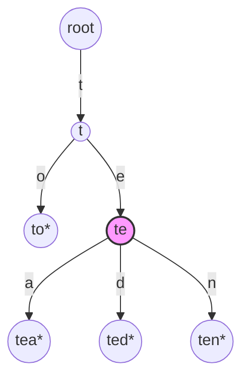

## Learning Objectives

- Implement insertion into a trie by walking (and creating, as needed) one node per character, then marking the final node reached as end-of-word.
- Implement exact-key search by walking the same character-by-character path and checking both that the walk completes and that the final node is marked end-of-word.
- Implement `keysWithPrefix` by walking to a prefix's node and then collecting every complete word in the subtree rooted there, and explain why this operation is the one a hash table cannot perform efficiently.
- Distinguish the three possible outcomes of a trie walk on a query string — the path runs out before consuming the whole string, the path is consumed but ends on a non-word node, or the path ends on a word node — and connect each to the correct return value.
- Analyze the time complexity of insert, search, and prefix-match in terms of key length and match-set size, rather than total number of stored keys.

## Context & Motivation

The previous concept established what a trie is and why it exists: a tree that spells keys out character by character so that shared prefixes become shared paths, purpose-built for a class of queries — "what keys start this way?" — that a hash table cannot answer without a full scan. This concept turns that structural idea into working operations. Three operations do essentially all of the work a trie is ever asked to do, and all three share the same underlying gesture: walk the tree one character at a time, following (or creating) the edge that matches the next character of whatever string is being processed. What differs between insert, search, and prefix-match is not the walk itself but what happens at the end of it and, in the case of prefix-match, what happens after it.

It's worth being precise about which of these three operations is routine and which is the genuinely distinctive one. Insert and search have direct analogues in a binary search tree or a hash table — every key-value structure needs some way to add a key and some way to check whether a key is present, and a trie's versions of these cost O(L) in the length of the key, not asymptotically better than a hash table's O(1) average and, if anything, usually a bit slower in wall-clock terms for typical key lengths. The operation that has no efficient analogue anywhere else in this course's data structures is prefix-match — sometimes named `keysWithPrefix` or `wordsWithPrefix` — which asks for every complete key sharing a given prefix, and answers it in time proportional to the prefix's length plus the number of matches found, completely independent of how many *other*, non-matching keys are also stored in the structure. That independence from the total key count is the entire point of a trie, and this concept is where it becomes a concrete, implementable operation rather than an abstract promise.

## Core Theory

### Shared machinery: the character-by-character walk

All three operations begin the same way: start at the root, and for each character of the input string (a key to insert, a key to search for, or a prefix to match against), move to the child edge labeled with that character. The operations diverge only in two respects: what to do when the desired child edge doesn't exist (insert creates it; search and prefix-match report failure), and what to do once the entire input string has been consumed (insert marks the final node; search checks the marker; prefix-match switches from walking to collecting).

```python
class TrieNode:
    def __init__(self):
        self.children = {}
        self.is_end_of_word = False

class Trie:
    def __init__(self):
        self.root = TrieNode()
```

### Insert: walk and create

To insert a key, walk from the root one character at a time; whenever the next required child edge does not yet exist, create it (a fresh `TrieNode`) before continuing. After the last character has been consumed, mark the node just reached as `is_end_of_word = True`.

```python
def insert(self, key: str) -> None:
    node = self.root
    for ch in key:
        if ch not in node.children:
            node.children[ch] = TrieNode()
        node = node.children[ch]
    node.is_end_of_word = True
```

Every character of `key` costs exactly one dictionary lookup (`ch not in node.children`) and, at worst, one node creation — so inserting a key of length L costs O(L), regardless of how many other keys are already in the trie. Re-inserting an already-present key is harmless: every edge already exists, so the loop just walks the existing path and re-marks (redundantly) a node already marked end-of-word.

### Search: walk and check, with three possible outcomes

Searching for an exact key looks almost identical to inserting, except that a missing edge means failure rather than an invitation to create one — and reaching the end of the string is not by itself sufficient for success. There are exactly three distinct outcomes to keep straight:

1. **The walk falls off the trie before the string is consumed** — some required child edge doesn't exist partway through. The key is definitely absent (it was never inserted, nor was any longer key sharing this much of a prefix).
2. **The walk consumes the entire string and lands on a node that exists but is *not* marked end-of-word.** This means the search string is a prefix of some longer stored key (or several), but was never itself inserted as a complete key. This is the case a naive implementation gets wrong most often — see Common Misconceptions.
3. **The walk consumes the entire string and lands on a node marked end-of-word.** The key is present.

```python
def search(self, key: str) -> bool:
    node = self.root
    for ch in key:
        if ch not in node.children:
            return False          # outcome 1
        node = node.children[ch]
    return node.is_end_of_word    # outcome 2 (False) or 3 (True)
```

Search costs O(L) for a key of length L — one dictionary lookup per character, with no dependency on how many total keys are stored, exactly like insert.

### Prefix-match: walk to the prefix, then collect the subtree

`keysWithPrefix` is where a trie earns its keep. The operation splits cleanly into two phases:

1. **Walk** to the node representing the given prefix, exactly as in search — except that reaching this node (regardless of whether it is itself marked end-of-word) is success; there is no "must be end-of-word" check on the prefix node itself, since a prefix need not be a complete key.
2. **Collect** every complete word in the subtree rooted at that node, by a depth-first traversal that records the path taken (as the growing suffix appended to the prefix) and appends the full accumulated string to the results whenever a node marked end-of-word is visited.

```python
def keys_with_prefix(self, prefix: str) -> list[str]:
    node = self.root
    for ch in prefix:
        if ch not in node.children:
            return []              # no key has this prefix at all
        node = node.children[ch]

    results = []
    self._collect(node, prefix, results)
    return results

def _collect(self, node: "TrieNode", path: str, results: list[str]) -> None:
    if node.is_end_of_word:
        results.append(path)
    for ch, child in node.children.items():
        self._collect(child, path + ch, results)
```

The walk phase costs O(P) for a prefix of length P — identical in shape to search. The collect phase costs time proportional to the number of nodes in the subtree below the prefix node, which is bounded by (and in practice close to) the number of matching keys and their total length — critically, **not** the number of keys stored elsewhere in the trie that don't share this prefix. This is the structural guarantee a hash table cannot offer: a hash table has no notion of "the subtree of keys sharing this prefix" because it never organizes keys by shared structure in the first place, so answering the same query over a `dict` requires inspecting every stored key (see the previous concept's Example 3).



Calling `keys_with_prefix("te")` walks `root → t → te` (the highlighted node), then a depth-first collect over just that subtree yields `["tea", "ted", "ten"]` — the sibling `to` is never visited at all, because it hangs off `t` directly, outside the `te` subtree.

## Worked Examples

### Example 1 — full insert-then-search trace

**Problem:** Starting from an empty trie, insert `"bat"`, `"bath"`, `"bat"` (again), and `"ball"`. Then evaluate `search("bat")`, `search("ba")`, and `search("balloon")`, explaining each result by outcome number from Core Theory.

**Solution.** Inserting `"bat"` creates nodes for `b`, `ba`, `bat` (marked end-of-word). Inserting `"bath"` reuses `b`, `ba`, `bat` and adds a new node `bath` (marked end-of-word); note `bat` remains marked end-of-word even though it now also has a child. Re-inserting `"bat"` walks the fully existing path and re-marks `bat` as end-of-word (no change). Inserting `"ball"` reuses `b`, creates `ba`... wait — `ba` already exists from `"bat"`, so it's reused; then creates new nodes `bal`, `ball` (marked end-of-word).

- `search("bat")`: walk `b → ba → bat` completes, and `bat` is marked end-of-word → **True** (outcome 3).
- `search("ba")`: walk `b → ba` completes, but `ba` is not marked end-of-word (only `bat`, `bath`, `ball` were ever inserted as complete words, not `ba` itself) → **False** (outcome 2) — `"ba"` is a prefix of stored keys but was never itself inserted.
- `search("balloon")`: walk `b → ba → bal → ball` succeeds, but the next character `o` has no child edge under `ball` (nothing beyond `"ball"` was inserted) → **False** (outcome 1), the walk falls off the trie.

### Example 2 — prefix-match with a mixed result set

**Problem:** Using the trie from Example 1 (`bat`, `bath`, `ball`), compute `keys_with_prefix("ba")` and `keys_with_prefix("bal")`, and note the cost of each relative to the total number of stored keys.

**Solution.** For `keys_with_prefix("ba")`: the walk phase reaches the `ba` node in 2 steps. The collect phase does a depth-first traversal of everything below `ba`: `ba → bat*` (record `"bat"`), `bat → bath*` (record `"bath"`), `ba → bal → ball*` (record `"ball"`). Result: `["bat", "bath", "ball"]` (order depends on dictionary iteration order in this implementation) — all three stored keys, because all three happen to start with `ba`.

For `keys_with_prefix("bal")`: the walk phase reaches the `bal` node in 3 steps. The collect phase only has one path below it: `bal → ball*`. Result: `["ball"]` — only one key visited during collection, even though the trie as a whole stores three keys total. This is the concrete demonstration of the complexity claim from Core Theory: the second query's cost tracked the size of the *matching* subtree (one node), not the trie's total size (three keys) — a hash table equivalent would have inspected all three keys with `.startswith("bal")` regardless of how many matched.

### Example 3 — implementing search using keys_with_prefix as a sanity check (and why you wouldn't in practice)

**Problem:** Show that `search(key)` is logically equivalent to checking whether `key` appears in the result of `keys_with_prefix(key)`, then explain why implementing search this way in production code would be a poor choice.

**Solution.**

```python
def search_via_prefix(self, key: str) -> bool:
    return key in self.keys_with_prefix(key)
```

This is logically correct: if `key` is a complete stored key, it will be discovered during the collect phase of `keys_with_prefix(key)` (since the walk lands exactly on `key`'s own node, and that node, being marked end-of-word, is included in the collected results), and if `key` is absent, either the walk fails (empty result) or the collect phase never records `key` itself (only longer keys extending past it). But this approach does needless extra work: `keys_with_prefix(key)` collects the *entire subtree* below `key`'s node — potentially many other longer keys — just to check whether `key` itself happens to be one of the end-of-word nodes along the way. The direct `search` implementation from Core Theory answers the same question in O(L) with no subtree traversal at all. This is a useful illustration that prefix-match subsumes search in principle (anything search can determine, prefix-match's result set also reveals) but should never replace it in practice, precisely because search is the cheaper, more targeted tool for the narrower question.

## Common Misconceptions & Pitfalls

- **"If the walk for a key completes without falling off the trie, the key must be present."** This is outcome 2 from Core Theory, and Example 1's `search("ba")` demonstrates it concretely: the walk completes, but `ba` was never marked end-of-word, because `"ba"` itself was never inserted as a complete key — only `"bat"`, `"bath"`, and `"ball"`, all of which merely pass through the `ba` node on their way to being longer words. Forgetting to check `is_end_of_word` and treating "the walk succeeded" as "the key is present" is one of the most common trie bugs, and it silently reports every stored key's proper prefixes as present when they are not.
- **"keysWithPrefix only needs to check the node the walk ends on."** The prefix node itself is only the *starting point* for collection, not the whole answer — Example 2's `keys_with_prefix("ba")` needed a full depth-first traversal of the subtree below `ba` to find all three matches, not just a check of whether `ba` itself is marked end-of-word (it isn't, in that example, yet three keys still match the prefix).
- **"A trie's insert and search are asymptotically faster than a hash table's."** They are not — both trie operations cost O(L) in key length, while a hash table's average-case cost is O(1) (technically also proportional to key length for computing the hash, but without a table-size-independent per-character walk overhead). A trie's real advantage is never raw insert/search speed; it is the existence of an efficient prefix-match operation that a hash table cannot offer at all without a full scan or an auxiliary structure.
- **"Deleting a key from a trie just means unmarking its end-of-word flag, full stop."** Unmarking the flag is necessary but sometimes insufficient for keeping the trie's memory usage tight: if the deleted key's node (and some ancestors) have no other children and are no longer end-of-word for any other key, those now-useless nodes should be pruned, or they persist indefinitely as dead weight. A correct implementation walks back up after unmarking and removes any node that has become both childless and non-terminal.

## Summary

Insert, search, and prefix-match all share the same character-by-character walk from the root, differing only in what happens when a required edge is missing (insert creates it; search and prefix-match fail) and what happens once the input is consumed (insert marks a node; search checks a marker; prefix-match switches to collecting an entire subtree). Both insert and search cost O(L) in the length of the key involved, no better asymptotically than a well-tuned hash table's O(1) average, so a trie is not chosen for those two operations alone. `keysWithPrefix` is the operation that justifies the structure: after an O(P) walk to the prefix's node, collecting every complete word in the subtree below it costs time proportional only to the size of the matching set, entirely independent of how many other keys are stored elsewhere in the trie — a guarantee a hash table cannot offer, because it has no structural notion of "keys sharing this prefix" to begin with. Getting the three walk outcomes right — falling off the trie, landing on an unmarked node, and landing on a marked node — is the detail most implementations get wrong first, particularly the middle case, where a string is a genuine prefix of stored keys but was never itself inserted.

## Documentation Links

- [Sedgewick & Wayne — Algorithms Lectures (Princeton)](https://algs4.cs.princeton.edu/lectures/) — doc
- [Stanford CS166 — Data Structures](https://web.stanford.edu/class/cs166) — doc
