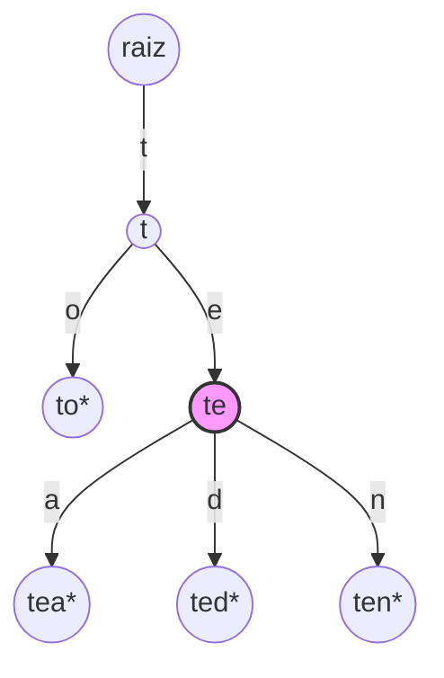

## Objetivos de Aprendizagem

- Implementar inserção em uma trie percorrendo (e criando, conforme necessário) um nó por caractere, depois marcando o nó final alcançado como fim-de-palavra.
- Implementar busca de chave exata percorrendo o mesmo caminho caractere-por-caractere e verificando tanto que a caminhada se completa quanto que o nó final está marcado fim-de-palavra.
- Implementar `keysWithPrefix` percorrendo até o nó de um prefixo e depois coletando toda palavra completa na subárvore enraizada ali, e explicar por que essa operação é a que uma hash table não consegue realizar eficientemente.
- Distinguir os três resultados possíveis de uma caminhada de trie em uma string de consulta, o caminho acaba antes de consumir a string inteira, o caminho é consumido mas termina em um nó não-palavra, ou o caminho termina em um nó palavra, e conectar cada um ao valor de retorno correto.
- Analisar a complexidade de tempo de insert, search, e prefix-match em termos de comprimento de chave e tamanho do conjunto correspondente, em vez do número total de chaves armazenadas.

## Contexto e Motivação

O conceito anterior estabeleceu o que é uma trie e por que existe: uma árvore que soletra chaves caractere por caractere de modo que prefixos compartilhados se tornam caminhos compartilhados, construída especificamente para uma classe de consultas, "quais chaves começam desta forma?", que uma hash table não consegue responder sem uma varredura completa. Este conceito transforma essa ideia estrutural em operações funcionando. Três operações fazem essencialmente todo o trabalho que uma trie jamais é solicitada a fazer, e todas as três compartilham o mesmo gesto subjacente: percorra a árvore um caractere de cada vez, seguindo (ou criando) a aresta que corresponde ao próximo caractere de qualquer string sendo processada. O que difere entre insert, search, e prefix-match não é a própria caminhada mas o que acontece no final dela e, no caso de prefix-match, o que acontece depois dela.

Vale a pena ser preciso sobre qual dessas três operações é rotineira e qual é a genuinamente distintiva. Insert e search têm análogos diretos em uma árvore binária de busca ou uma hash table, toda estrutura chave-valor precisa de alguma forma de adicionar uma chave e alguma forma de verificar se uma chave está presente, e as versões de trie disso custam O(L) no comprimento da chave, não assintoticamente melhor que o O(1) médio de uma hash table e, se algo, geralmente um pouco mais lento em termos de tempo de relógio para comprimentos de chave típicos. A operação que não tem análogo eficiente em nenhum outro lugar nas estruturas de dados deste curso é prefix-match, às vezes chamada `keysWithPrefix` ou `wordsWithPrefix`, que pede toda chave completa compartilhando um dado prefixo, e a responde em tempo proporcional ao comprimento do prefixo mais o número de correspondências encontradas, completamente independente de quantas *outras* chaves não correspondentes também estejam armazenadas na estrutura. Essa independência da contagem total de chaves é todo o ponto de uma trie, e este conceito é onde ela se torna uma operação concreta e implementável em vez de uma promessa abstrata.

## Teoria Central

### Maquinário compartilhado: a caminhada caractere-por-caractere

Todas as três operações começam da mesma forma: comece na raiz, e para cada caractere da string de entrada (uma chave para inserir, uma chave para buscar, ou um prefixo para corresponder), mova para a aresta filha rotulada com aquele caractere. As operações divergem apenas em dois aspectos: o que fazer quando a aresta filha desejada não existe (insert a cria; search e prefix-match relatam falha), e o que fazer uma vez que a string de entrada inteira foi consumida (insert marca o nó final; search verifica o marcador; prefix-match troca de percorrer para coletar).

```python
class TrieNode:
    def __init__(self):
        self.children = {}
        self.is_end_of_word = False

class Trie:
    def __init__(self):
        self.root = TrieNode()
```

### Insert: percorre e cria

Para inserir uma chave, percorra da raiz um caractere de cada vez; sempre que a próxima aresta filha necessária ainda não existe, crie-a (um `TrieNode` novo) antes de continuar. Depois de o último caractere ser consumido, marque o nó recém-alcançado como `is_end_of_word = True`.

```python
def insert(self, key: str) -> None:
    node = self.root
    for ch in key:
        if ch not in node.children:
            node.children[ch] = TrieNode()
        node = node.children[ch]
    node.is_end_of_word = True
```

Todo caractere de `key` custa exatamente uma busca de dicionário (`ch not in node.children`) e, no pior caso, uma criação de nó, então inserir uma chave de comprimento L custa O(L), independentemente de quantas outras chaves já estão na trie. Reinserir uma chave já presente é inofensivo: toda aresta já existe, então o loop apenas percorre o caminho existente e remarca (redundantemente) um nó já marcado fim-de-palavra.

### Search: percorre e verifica, com três resultados possíveis

Buscar por uma chave exata parece quase idêntico a inserir, exceto que uma aresta ausente significa falha em vez de um convite para criar uma, e alcançar o fim da string não é por si só suficiente para sucesso. Há exatamente três resultados distintos a manter claros:

1. **A caminhada cai fora da trie antes de a string ser consumida**, alguma aresta filha necessária não existe no meio do caminho. A chave está definitivamente ausente (nunca foi inserida, nem foi nenhuma chave mais longa compartilhando essa quantidade de prefixo).
2. **A caminhada consome a string inteira e cai em um nó que existe mas *não* está marcado fim-de-palavra.** Isso significa que a string de busca é um prefixo de alguma chave mais longa armazenada (ou várias), mas nunca foi ela mesma inserida como uma chave completa. Este é o caso que uma implementação ingênua erra com mais frequência, veja Equívocos Comuns.
3. **A caminhada consome a string inteira e cai em um nó marcado fim-de-palavra.** A chave está presente.

```python
def search(self, key: str) -> bool:
    node = self.root
    for ch in key:
        if ch not in node.children:
            return False          # resultado 1
        node = node.children[ch]
    return node.is_end_of_word    # resultado 2 (False) ou 3 (True)
```

Search custa O(L) para uma chave de comprimento L, uma busca de dicionário por caractere, sem dependência de quantas chaves no total estão armazenadas, exatamente como insert.

### Prefix-match: percorre até o prefixo, depois coleta a subárvore

`keysWithPrefix` é onde uma trie se paga. A operação se divide limpamente em duas fases:

1. **Percorra** até o nó representando o prefixo dado, exatamente como em search, exceto que alcançar esse nó (independentemente de ser ele mesmo marcado fim-de-palavra) é sucesso; não há verificação de "deve ser fim-de-palavra" no próprio nó de prefixo, já que um prefixo não precisa ser uma chave completa.
2. **Colete** toda palavra completa na subárvore enraizada naquele nó, por uma travessia em profundidade que registra o caminho percorrido (como o sufixo crescente anexado ao prefixo) e anexa a string acumulada completa aos resultados sempre que um nó marcado fim-de-palavra é visitado.

```python
def keys_with_prefix(self, prefix: str) -> list[str]:
    node = self.root
    for ch in prefix:
        if ch not in node.children:
            return []              # nenhuma chave tem esse prefixo de forma alguma
        node = node.children[ch]

    results = []
    self._collect(node, prefix, results)
    return results

def _collect(self, node: "TrieNode", path: str, results: list[str]) -> None:
    if node.is_end_of_word:
        results.append(path)
    for ch, child in node.children.items():
        self._collect(child, path + ch, results)
```

A fase de caminhada custa O(P) para um prefixo de comprimento P, idêntico em formato a search. A fase de coleta custa tempo proporcional ao número de nós na subárvore abaixo do nó de prefixo, que é limitado por (e na prática próximo de) o número de chaves correspondentes e seu comprimento total, criticamente, **não** o número de chaves armazenadas em outro lugar na trie que não compartilham esse prefixo. Esta é a garantia estrutural que uma hash table não pode oferecer: uma hash table não tem noção de "a subárvore de chaves compartilhando este prefixo" porque nunca organiza chaves por estrutura compartilhada em primeiro lugar, então responder à mesma consulta sobre um `dict` exige inspecionar toda chave armazenada (veja o Exemplo 3 do conceito anterior).



Chamar `keys_with_prefix("te")` percorre `raiz → t → te` (o nó destacado), depois uma coleta em profundidade sobre apenas aquela subárvore produz `["tea", "ted", "ten"]`, o irmão `to` nunca é visitado de forma alguma, porque pende diretamente de `t`, fora da subárvore `te`.

## Exemplos Resolvidos

### Exemplo 1 — rastreamento completo de insert-depois-search

**Problema:** Começando de uma trie vazia, insira `"bat"`, `"bath"`, `"bat"` (novamente), e `"ball"`. Depois avalie `search("bat")`, `search("ba")`, e `search("balloon")`, explicando cada resultado pelo número de resultado da Teoria Central.

**Solução.** Inserir `"bat"` cria nós para `b`, `ba`, `bat` (marcado fim-de-palavra). Inserir `"bath"` reutiliza `b`, `ba`, `bat` e adiciona um novo nó `bath` (marcado fim-de-palavra); note que `bat` permanece marcado fim-de-palavra mesmo que agora também tenha um filho. Reinserir `"bat"` percorre o caminho totalmente existente e remarca `bat` como fim-de-palavra (sem mudança). Inserir `"ball"` reutiliza `b`, cria `ba`... espere, `ba` já existe de `"bat"`, então é reutilizado; depois cria novos nós `bal`, `ball` (marcado fim-de-palavra).

- `search("bat")`: a caminhada `b → ba → bat` se completa, e `bat` está marcado fim-de-palavra → **True** (resultado 3).
- `search("ba")`: a caminhada `b → ba` se completa, mas `ba` não está marcado fim-de-palavra (apenas `bat`, `bath`, `ball` foram jamais inseridos como palavras completas, não `ba` em si) → **False** (resultado 2), `"ba"` é um prefixo de chaves armazenadas mas nunca foi ela mesma inserida.
- `search("balloon")`: a caminhada `b → ba → bal → ball` tem sucesso, mas o próximo caractere `o` não tem aresta filha sob `ball` (nada além de `"ball"` foi inserido) → **False** (resultado 1), a caminhada cai fora da trie.

### Exemplo 2 — correspondência de prefixo com um conjunto de resultado misto

**Problema:** Usando a trie do Exemplo 1 (`bat`, `bath`, `ball`), calcule `keys_with_prefix("ba")` e `keys_with_prefix("bal")`, e note o custo de cada uma em relação ao número total de chaves armazenadas.

**Solução.** Para `keys_with_prefix("ba")`: a fase de caminhada alcança o nó `ba` em 2 passos. A fase de coleta faz uma travessia em profundidade de tudo abaixo de `ba`: `ba → bat*` (registra `"bat"`), `bat → bath*` (registra `"bath"`), `ba → bal → ball*` (registra `"ball"`). Resultado: `["bat", "bath", "ball"]` (a ordem depende da ordem de iteração do dicionário nesta implementação), todas as três chaves armazenadas, porque as três acontecem de começar com `ba`.

Para `keys_with_prefix("bal")`: a fase de caminhada alcança o nó `bal` em 3 passos. A fase de coleta só tem um caminho abaixo dele: `bal → ball*`. Resultado: `["ball"]`, apenas uma chave visitada durante a coleta, mesmo que a trie como um todo armazene três chaves no total. Esta é a demonstração concreta da afirmação de complexidade da Teoria Central: o custo da segunda consulta acompanhou o tamanho da subárvore *correspondente* (um nó), não o tamanho total da trie (três chaves), um equivalente de hash table teria inspecionado todas as três chaves com `.startswith("bal")` independentemente de quantas correspondessem.

### Exemplo 3 — implementando search usando keys_with_prefix como uma verificação de sanidade (e por que você não faria isso na prática)

**Problema:** Mostre que `search(key)` é logicamente equivalente a verificar se `key` aparece no resultado de `keys_with_prefix(key)`, depois explique por que implementar search dessa forma em código de produção seria uma escolha ruim.

**Solução.**

```python
def search_via_prefix(self, key: str) -> bool:
    return key in self.keys_with_prefix(key)
```

Isso está logicamente correto: se `key` é uma chave completa armazenada, será descoberta durante a fase de coleta de `keys_with_prefix(key)` (já que a caminhada cai exatamente no próprio nó de `key`, e aquele nó, sendo marcado fim-de-palavra, está incluído nos resultados coletados), e se `key` está ausente, ou a caminhada falha (resultado vazio) ou a fase de coleta nunca registra a própria `key` (apenas chaves mais longas se estendendo além dela). Mas essa abordagem faz trabalho extra desnecessário: `keys_with_prefix(key)` coleta a *subárvore inteira* abaixo do nó de `key`, potencialmente muitas outras chaves mais longas, apenas para verificar se a própria `key` acontece de ser um dos nós fim-de-palavra ao longo do caminho. A implementação direta de `search` da Teoria Central responde à mesma pergunta em O(L) sem nenhuma travessia de subárvore de forma alguma. Esta é uma ilustração útil de que prefix-match engloba search em princípio (qualquer coisa que search possa determinar, o conjunto de resultado de prefix-match também revela) mas nunca deveria substituí-la na prática, precisamente porque search é a ferramenta mais barata e mais direcionada para a pergunta mais estreita.

## Equívocos Comuns e Armadilhas

- **"Se a caminhada para uma chave se completa sem cair fora da trie, a chave deve estar presente."** Este é o resultado 2 da Teoria Central, e `search("ba")` do Exemplo 1 o demonstra concretamente: a caminhada se completa, mas `ba` nunca foi marcado fim-de-palavra, porque `"ba"` em si nunca foi inserida como uma chave completa, apenas `"bat"`, `"bath"`, e `"ball"`, todas as quais meramente passam pelo nó `ba` a caminho de serem palavras mais longas. Esquecer de verificar `is_end_of_word` e tratar "a caminhada teve sucesso" como "a chave está presente" é um dos bugs de trie mais comuns, e silenciosamente relata todo prefixo próprio de chave armazenada como presente quando não é.
- **"keysWithPrefix só precisa verificar o nó em que a caminhada termina."** O próprio nó de prefixo é apenas o *ponto de partida* para coleta, não a resposta inteira, `keys_with_prefix("ba")` do Exemplo 2 precisou de uma travessia em profundidade completa da subárvore abaixo de `ba` para encontrar todas as três correspondências, não apenas uma verificação de se `ba` em si está marcado fim-de-palavra (não está, nesse exemplo, ainda assim três chaves correspondem ao prefixo).
- **"Insert e search de uma trie são assintoticamente mais rápidos que os de uma hash table."** Não são, ambas as operações de trie custam O(L) no comprimento da chave, enquanto o custo médio de uma hash table é O(1) (tecnicamente também proporcional ao comprimento da chave para calcular o hash, mas sem uma sobrecarga de caminhada por caractere independente do tamanho da tabela). A verdadeira vantagem de uma trie nunca é velocidade bruta de insert/search; é a existência de uma operação de correspondência de prefixo eficiente que uma hash table não pode oferecer de forma alguma sem uma varredura completa ou uma estrutura auxiliar.
- **"Deletar uma chave de uma trie apenas significa desmarcar sua flag de fim-de-palavra, ponto final."** Desmarcar a flag é necessário mas às vezes insuficiente para manter o uso de memória de uma trie enxuto: se o nó da chave deletada (e alguns ancestrais) não têm outros filhos e não são mais fim-de-palavra para nenhuma outra chave, esses nós agora inúteis deveriam ser podados, ou persistem indefinidamente como peso morto. Uma implementação correta sobe de volta depois de desmarcar e remove qualquer nó que se tornou tanto sem-filho quanto não-terminal.

## Resumo

Insert, search, e prefix-match todos compartilham a mesma caminhada caractere-por-caractere a partir da raiz, diferindo apenas no que acontece quando uma aresta necessária está ausente (insert a cria; search e prefix-match falham) e no que acontece uma vez que a entrada é consumida (insert marca um nó; search verifica um marcador; prefix-match troca para coletar uma subárvore inteira). Tanto insert quanto search custam O(L) no comprimento da chave envolvida, não melhor assintoticamente que o O(1) médio de uma hash table bem ajustada, então uma trie não é escolhida por essas duas operações sozinhas. `keysWithPrefix` é a operação que justifica a estrutura: depois de uma caminhada O(P) até o nó do prefixo, coletar toda palavra completa na subárvore abaixo dele custa tempo proporcional apenas ao tamanho do conjunto correspondente, inteiramente independente de quantas outras chaves estão armazenadas em outro lugar na trie, uma garantia que uma hash table não pode oferecer, porque não tem noção estrutural de "chaves compartilhando este prefixo" para começar. Acertar os três resultados de caminhada, cair fora da trie, cair em um nó não marcado, e cair em um nó marcado, é o detalhe que a maioria das implementações erra primeiro, particularmente o caso do meio, onde uma string é um prefixo genuíno de chaves armazenadas mas nunca foi ela mesma inserida.

## Documentation Links

- [Sedgewick & Wayne — Algorithms Lectures (Princeton)](https://algs4.cs.princeton.edu/lectures/) — doc
- [Stanford CS166 — Data Structures](https://web.stanford.edu/class/cs166) — doc
