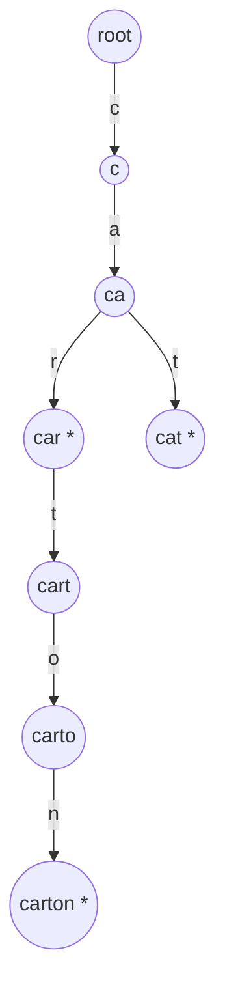
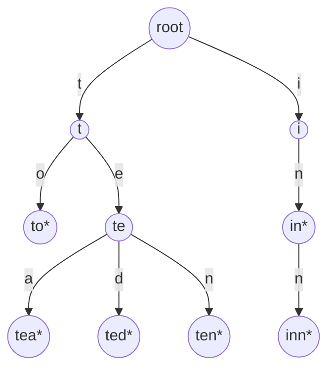

## Learning Objectives

- Define a trie as a tree in which a key's characters are spelled out one per edge along a root-to-node path, rather than stored as a whole value at a single node.
- Explain why keys that share a prefix in a trie also share the path in the tree that spells out that prefix, and why this is the structural source of every prefix operation a trie supports.
- Contrast a trie's storage model with a hash table's, and state precisely which operation a hash table cannot perform efficiently that a trie can.
- Identify the role of the "end of word" marker in distinguishing a complete key from a mere prefix of a longer key stored in the same trie.
- Predict, given a small set of string keys, the approximate shape of the trie that would result from inserting them.

## Context & Motivation

Every data structure in this course commits to a rule about where data lives, and that rule determines which questions the structure can answer quickly. Arrays commit to position; binary search trees commit to an ordering invariant that halves the search space at every node; hash tables, covered earlier in this curriculum, commit to something more aggressive still — they compute a key's storage location directly from an arithmetic function of the key's bits, discarding any relationship between the key's internal structure and where it ends up. That is exactly why a hash table achieves O(1) average-case lookup: the hash function scrambles similar keys into unrelated slots on purpose, so no accidental clustering degrades performance. But that same scrambling is also why a hash table cannot answer a question like "give me every key that starts with `car`" without a full scan of every stored key — `"car"`, `"cart"`, and `"carton"` might hash to three completely unrelated slots, because nothing about the hash function preserves the fact that they share a prefix. The hash table was never designed to preserve that relationship; it was designed to destroy it, in service of spreading keys evenly.

A trie (the name comes from "re**trie**val," though it is conventionally pronounced "try" to avoid confusion with "tree") takes the opposite bet. Instead of hashing a key to a single location, a trie spells the key out one character at a time, with each character corresponding to an edge in a tree, so that the path from the root to any node represents the sequence of characters read so far. The immediate consequence — and it is the entire reason tries exist as a distinct structure worth studying — is that two keys sharing a common prefix are forced, by the very mechanics of insertion, to share the initial stretch of path that spells out that prefix. `"car"`, `"cart"`, and `"carton"` all pass through the same three nodes for `c`, `a`, `r` before diverging, because inserting each of them walks the same first three edges. This is not a clever optimization layered on top of the structure; it is a direct structural consequence of how a trie represents strings at all, and it is the property a hash table structurally cannot offer, because a hash table has no notion of "walking partway into a key" — a hash code is computed all at once from the whole key, or not computed at all.

This complementary relationship is worth holding precisely, not as "tries are better than hash tables." For exact-key lookup — "is this exact string present, and what value is associated with it" — a well-tuned hash table remains the faster and more memory-frugal choice in most practical situations, and nothing about a trie changes that. What changes is the *question being asked*: the moment a workload needs prefix-based operations — autocomplete suggestions, spell-checking against a dictionary, longest-prefix-match routing (both covered as real applications later in this topic) — a hash table's O(1) average lookup becomes irrelevant, because the question it answers fastest ("is this exact key present?") isn't the question being asked ("what keys start this way?"). This concept, and the two that follow it, exist to give you a structure purpose-built for exactly that second kind of question, at the routine cost of the first kind (trie lookup for an exact key of length L costs O(L), not O(1) average) — a trade a system designer makes deliberately, once the workload calls for it.

## Core Theory

### What a trie is

A **trie** (also called a **prefix tree**) is a tree specialized for storing a set of string keys (or, more generally, sequences drawn from some fixed alphabet), where:

- Each edge is labeled with a single character.
- The path from the root to any node spells out, by concatenating the edge labels along the way, the string prefix that node represents.
- Some nodes are marked as **end-of-word** (or "terminal") nodes, meaning the prefix spelled out by the path to that node is itself a complete key stored in the trie — not merely a prefix of some longer stored key.
- A node typically holds a collection of children, one per possible next character, commonly implemented as a dictionary (for a general or large alphabet) or a fixed-size array (for a small, known alphabet like lowercase English letters, where an array of 26 slots suffices).

Crucially, a node in a trie stores no piece of the key itself as data at that node — the key is encoded entirely by the *path* taken to reach the node, not by anything written into the node. This is the fundamental difference from a binary search tree, where each node stores a whole key (or comparable value) and the tree's shape reflects ordering comparisons between whole keys, not a character-by-character decomposition of any single key.

### Why shared prefixes become shared paths

Insertion into a trie is a character-by-character walk: starting at the root, for each character of the key being inserted, follow the existing child edge for that character if one exists, or create a new node and edge if it doesn't, then mark the final node reached as end-of-word. Because this walk always starts from the same root and always follows the *same edge* for the *same character* at the *same position*, any two keys that agree on their first k characters will, by construction, walk through the identical sequence of k nodes before their paths can possibly diverge. There is no way to insert `"cart"` after `"car"` without passing back through the `c`, `a`, `r` nodes already created — the shared prefix and the shared path are the same fact seen twice, not two facts that happen to coincide.



Here `"car"`, `"cart"`, `"carton"`, and `"cat"` are all inserted. Nodes marked `*` are end-of-word nodes — `car`, `carton`, and `cat` are complete stored keys, while `c`, `ca`, and `cart` are prefixes of stored keys but (in this example) not themselves stored keys, so they are not marked. Notice that `"car"`, `"cart"`, and `"carton"` share the exact same three-node path for their common prefix `car`, and only diverge at the fourth character.

### The end-of-word marker and why it matters

Without a way to distinguish "this node is a complete key" from "this node is merely a waypoint on the way to a longer key," a trie could not correctly answer a basic search: is `"car"` actually a key that was inserted, or does the trie merely contain longer words that happen to begin with those three letters? Both situations produce the identical node at the end of the path `c → a → r`; the only thing that differs is a boolean flag on that node. This is why every trie implementation needs an explicit end-of-word marker (sometimes represented as a special sentinel child, sometimes as a boolean field on the node) — omitting it collapses "is a prefix of something stored" and "is itself stored" into the same answer, which is a real bug, not a stylistic choice, addressed further as a Common Misconception below.

### The hash table contrast, made concrete

Recall from the prerequisite discipline that a hash table's entire performance argument rests on a hash function that deliberately scrambles keys — `hash("car")`, `hash("cart")`, and `hash("carton")` are expected to land at three unrelated indices, precisely because uniform distribution (spreading similar keys apart) is what a *good* hash function is defined to do. That design choice is exactly right for the question a hash table is built to answer fast ("is this exact key present?") and exactly wrong for the question "what keys start with `car`?" — answering that with a hash table requires either scanning every stored key and checking its prefix (O(n) in the number of stored keys, regardless of how many actually match) or maintaining a separate auxiliary index, which is really an admission that the hash table itself cannot do this and something trie-shaped has to be bolted on beside it.

A trie inverts the trade: locating every key with prefix `car` costs only the time to walk the three characters of `car` down to its node (O(3), not O(n)), plus the time to enumerate whatever subtree hangs below it (proportional to the number of matches, not the number of non-matches) — the mechanics of finding that subtree and collecting the matches are the subject of the next concept in this topic. Exact-key lookup, by contrast, costs O(L) in a trie (L being the key's length) versus O(1) average in a hash table — a trie never beats a well-tuned hash table at the thing hash tables are built for. The two structures are genuinely complementary answers to genuinely different questions, not competing answers to the same question.

## Worked Examples

### Example 1 — building a trie from a small word list and tracing shared prefixes

**Problem:** Insert the words `"to"`, `"tea"`, `"ted"`, `"ten"`, `"in"`, and `"inn"` into an empty trie. Identify which nodes are shared and which paths diverge.

**Solution.** Walking through insertion one word at a time:

- `"to"`: root → `t` → `to*` (new nodes for `t` and `to`; `to` marked end-of-word).
- `"tea"`: root → `t` (already exists, reuse it) → `te` (new) → `tea*` (new, marked).
- `"ted"`: root → `t` (reuse) → `te` (reuse) → `ted*` (new, marked). Note `te` now has two children, `a` and `d`.
- `"ten"`: root → `t` (reuse) → `te` (reuse) → `ten*` (new, marked). `te` now has three children: `a`, `d`, `n`.
- `"in"`: root → `i` (new) → `in*` (new, marked).
- `"inn"`: root → `i` (reuse) → `in` (reuse, already marked from `"in"`) → `inn*` (new, marked).

The resulting shape: `t` is shared by `to`, `tea`, `ted`, `ten` (all four pass through it); `te` is shared by `tea`, `ted`, `ten` (three of the four, since `to` diverges right after `t`); `in` is shared by `in` and `inn`, and is itself both a complete key (marked end-of-word) *and* a prefix of a longer stored key (`inn`) — demonstrating that a node being marked end-of-word does not prevent it from having children of its own.



### Example 2 — a minimal trie node in Python, and why the key is never stored as data

**Problem:** Sketch the smallest reasonable `Node` class for a trie over lowercase English letters, and explain what data is (and is not) stored at each node.

**Solution.**

```python
class TrieNode:
    def __init__(self):
        self.children = {}       # maps a single character -> TrieNode
        self.is_end_of_word = False

class Trie:
    def __init__(self):
        self.root = TrieNode()
```

Notice what is absent: no field on `TrieNode` stores "the string this node represents." That string is never stored anywhere explicitly — it exists only implicitly, as the sequence of characters labeling the edges walked from `self.root` to reach this particular node. This is the direct code-level expression of the Core Theory point that a trie encodes a key through *path*, not through *node contents*. (Insertion, search, and prefix collection using this class are built out fully in the next concept.)

### Example 3 — why a hash table genuinely cannot do this efficiently

**Problem:** Given the six words from Example 1 stored instead in a Python `dict` (a stand-in for a hash table), write the code to find every stored word starting with `"te"`, and note its cost.

**Solution.**

```python
words = {"to": True, "tea": True, "ted": True, "ten": True, "in": True, "inn": True}

prefix = "te"
matches = [w for w in words if w.startswith(prefix)]
# matches == ["tea", "ted", "ten"]
```

This works, but notice the cost structure: the list comprehension must check `w.startswith(prefix)` against *every single key in the dictionary*, including `"to"`, `"in"`, and `"inn"`, none of which match — because a `dict`'s hash-based layout gives no way to jump directly to "the keys that begin with `te`." The cost is O(n) in the total number of stored words, regardless of how many actually share the prefix. Contrast this with the trie from Example 1: walking `t → te` reaches the `te` node directly in two steps, and everything below it (`tea`, `ted`, `ten`) is already gathered in one place, structurally, with nothing else nearby to filter out. The dictionary's speed advantage for exact lookup (`"ted" in words`, O(1) average) simply does not transfer to prefix queries, because the two operations rely on opposite properties of how keys map to storage locations.

## Common Misconceptions & Pitfalls

- **"A trie is just a fancy hash table for strings."** A trie and a hash table solve different problems well. A hash table excels at exact-key membership and lookup (O(1) average) precisely because it scrambles keys into unrelated locations; a trie excels at prefix-based queries (finding all keys sharing a given prefix) precisely because it preserves the character-by-character structure of keys as tree paths. Treating them as interchangeable, or assuming one is a strict upgrade over the other, misses that they were built to answer different questions and typically trade off exact-lookup speed against prefix-query capability.
- **"If a node has no children, it can't be the end of a key, and if it's marked end-of-word, it can't have children."** Both halves are false, and Example 1's `in`/`inn` case demonstrates the second directly: the node for `in` is marked end-of-word (since `"in"` is a stored key) and also has a child for `inn`. A leaf node (no children) is always end-of-word (it has to represent a complete stored key, since nothing extends past it), but an end-of-word node is not required to be a leaf.
- **"Every node in a trie represents one character."** A node represents a *position* reached after some sequence of characters (a prefix) — it does not store or represent a single character itself. The character lives on the *edge* leading into the node, not on the node. This distinction matters when implementing a trie: the children map lives on the node, keyed by character, but no field on the node needs to record "what character got me here," since that information is recoverable from which entry in the parent's children map pointed here.
- **"Tries always use less memory than hash tables because they share prefixes."** Prefix-sharing saves memory only when keys actually share prefixes substantially; a set of keys with almost no shared prefixes (e.g., random UUIDs) gains little from a trie's structure and can consume considerably more memory than a hash table storing the same keys, because every node carries the overhead of a full children collection (a dictionary or a 26+ element array) even when only one or two children are ever populated. The ternary search trie, covered next in this topic, exists specifically to address this per-node overhead problem.

## Summary

A trie stores string keys by spelling each key's characters out one per edge along a root-to-node path, so that any two keys sharing a prefix are structurally forced to share the path segment that spells out that shared prefix — a direct mechanical consequence of how insertion walks the tree, not an incidental optimization. An end-of-word marker on each node distinguishes a node representing a complete stored key from a node that is merely a waypoint toward a longer one, since both situations can otherwise produce an identical node. This makes a trie the natural complement, not the rival, to a hash table: a hash table deliberately destroys any relationship between similar keys' storage locations in exchange for O(1) average exact-key lookup, while a trie deliberately preserves that relationship in exchange for native, efficient prefix operations — finding every key starting with a given prefix costs a trie only the length of the prefix plus the size of the matching subtree, while a hash table must fall back to scanning every stored key. Neither structure dominates the other; the right choice depends on whether the workload's central question is "is this exact key here?" or "what keys start this way?"

## Documentation Links

- [Sedgewick & Wayne — Algorithms Lectures (Princeton)](https://algs4.cs.princeton.edu/lectures/) — doc
- [Stanford CS166 — Data Structures](https://web.stanford.edu/class/cs166) — doc
