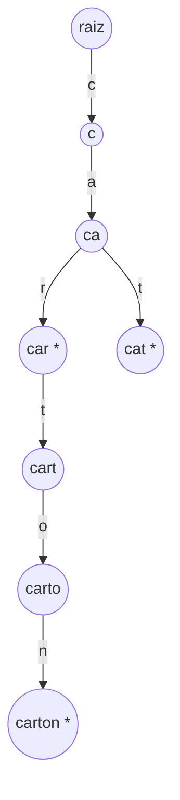
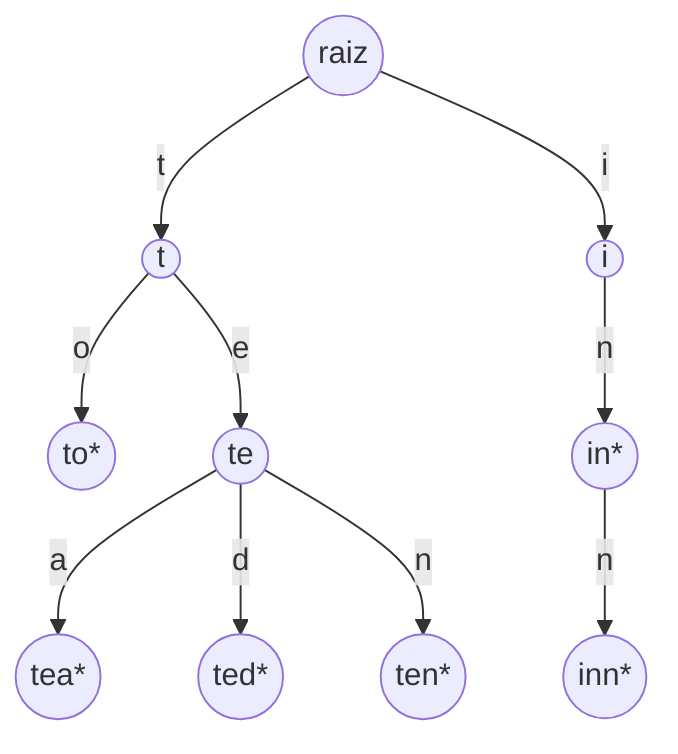

## Objetivos de Aprendizagem

- Definir uma trie como uma árvore na qual os caracteres de uma chave são soletrados um por aresta ao longo de um caminho raiz-a-nó, em vez de armazenados como um valor inteiro em um único nó.
- Explicar por que chaves que compartilham um prefixo em uma trie também compartilham o caminho na árvore que soletra aquele prefixo, e por que esta é a fonte estrutural de toda operação de prefixo que uma trie suporta.
- Contrastar o modelo de armazenamento de uma trie com o de uma hash table, e enunciar precisamente qual operação uma hash table não consegue realizar eficientemente que uma trie consegue.
- Identificar o papel do marcador "fim de palavra" em distinguir uma chave completa de um mero prefixo de uma chave mais longa armazenada na mesma trie.
- Prever, dado um pequeno conjunto de chaves de string, o formato aproximado da trie que resultaria de inseri-las.

## Contexto e Motivação

Toda estrutura de dados neste curso se compromete com uma regra sobre onde os dados vivem, e essa regra determina quais perguntas a estrutura pode responder rapidamente. Arrays se comprometem com posição; árvores binárias de busca se comprometem com um invariante de ordenação que corta pela metade o espaço de busca em todo nó; hash tables, cobertas anteriormente neste currículo, se comprometem com algo ainda mais agressivo, calculam a localização de armazenamento de uma chave diretamente de uma função aritmética dos bits da chave, descartando qualquer relação entre a estrutura interna da chave e onde ela acaba. É exatamente por isso que uma hash table alcança lookup O(1) em caso médio: a função hash embaralha chaves similares em posições não relacionadas de propósito, então nenhum agrupamento acidental degrada o desempenho. Mas esse mesmo embaralhamento é também por que uma hash table não consegue responder a uma pergunta como "dê-me toda chave que começa com `car`" sem uma varredura completa de toda chave armazenada, `"car"`, `"cart"`, e `"carton"` poderiam fazer hash para três posições completamente não relacionadas, porque nada sobre a função hash preserva o fato de que compartilham um prefixo. A hash table nunca foi projetada para preservar essa relação; foi projetada para destruí-la, a serviço de espalhar chaves uniformemente.

Uma trie (o nome vem de "re**trie**val" (recuperação), embora convencionalmente pronunciada "try" para evitar confusão com "tree") faz a aposta oposta. Em vez de fazer hash de uma chave para uma única localização, uma trie soletra a chave um caractere de cada vez, com cada caractere correspondendo a uma aresta em uma árvore, de modo que o caminho da raiz até qualquer nó representa a sequência de caracteres lidos até agora. A consequência imediata, e é toda a razão pela qual tries existem como uma estrutura distinta digna de estudo, é que duas chaves compartilhando um prefixo comum são forçadas, pela própria mecânica de inserção, a compartilhar o trecho inicial de caminho que soletra aquele prefixo. `"car"`, `"cart"`, e `"carton"` todos passam pelos mesmos três nós para `c`, `a`, `r` antes de divergir, porque inserir cada uma delas percorre as mesmas três primeiras arestas. Isso não é uma otimização engenhosa sobreposta à estrutura; é uma consequência estrutural direta de como uma trie representa strings em absoluto, e é a propriedade que uma hash table estruturalmente não pode oferecer, porque uma hash table não tem nenhuma noção de "percorrer parte do caminho para dentro de uma chave", um código hash é calculado tudo de uma vez a partir da chave inteira, ou não calculado de forma alguma.

Essa relação complementar vale a pena manter precisamente, não como "tries são melhores que hash tables." Para lookup de chave exata, "essa string exata está presente, e qual valor está associado a ela", uma hash table bem ajustada permanece a escolha mais rápida e mais econômica em memória na maioria das situações práticas, e nada sobre uma trie muda isso. O que muda é a *pergunta sendo feita*: no momento em que uma carga de trabalho precisa de operações baseadas em prefixo, sugestões de autocompletar, verificação ortográfica contra um dicionário, roteamento por correspondência de prefixo mais longo (ambos cobertos como aplicações reais mais adiante neste tópico), o lookup médio O(1) de uma hash table se torna irrelevante, porque a pergunta que ela responde mais rápido ("essa chave exata está presente?") não é a pergunta sendo feita ("quais chaves começam desta forma?"). Este conceito, e os dois que o seguem, existem para dar a você uma estrutura construída especificamente para exatamente esse segundo tipo de pergunta, ao custo rotineiro do primeiro tipo (lookup de trie para uma chave exata de comprimento L custa O(L), não O(1) em média), uma troca que um designer de sistema faz deliberadamente, uma vez que a carga de trabalho exige.

## Teoria Central

### O que é uma trie

Uma **trie** (também chamada de **árvore de prefixo**) é uma árvore especializada para armazenar um conjunto de chaves de string (ou, mais geralmente, sequências extraídas de algum alfabeto fixo), onde:

- Toda aresta é rotulada com um único caractere.
- O caminho da raiz até qualquer nó soletra, ao concatenar os rótulos de aresta ao longo do caminho, o prefixo de string que aquele nó representa.
- Alguns nós são marcados como nós de **fim-de-palavra** (ou "terminal"), significando que o prefixo soletrado pelo caminho até aquele nó é ele mesmo uma chave completa armazenada na trie, não meramente um prefixo de alguma chave armazenada mais longa.
- Um nó tipicamente contém uma coleção de filhos, um por possível próximo caractere, comumente implementado como um dicionário (para um alfabeto geral ou grande) ou um array de tamanho fixo (para um alfabeto pequeno e conhecido como letras minúsculas do inglês, onde um array de 26 posições basta).

Crucialmente, um nó em uma trie não armazena nenhum pedaço da própria chave como dado naquele nó, a chave é codificada inteiramente pelo *caminho* percorrido para alcançar o nó, não por nada escrito no nó. Essa é a diferença fundamental de uma árvore binária de busca, onde todo nó armazena uma chave inteira (ou valor comparável) e o formato da árvore reflete comparações de ordenação entre chaves inteiras, não uma decomposição caractere-por-caractere de qualquer chave única.

### Por que prefixos compartilhados se tornam caminhos compartilhados

Inserção em uma trie é uma caminhada caractere-por-caractere: começando na raiz, para cada caractere da chave sendo inserida, siga a aresta filha existente para aquele caractere se uma existir, ou crie um novo nó e aresta se não existir, depois marque o nó final alcançado como fim-de-palavra. Porque essa caminhada sempre começa da mesma raiz e sempre segue a *mesma aresta* para o *mesmo caractere* na *mesma posição*, quaisquer duas chaves que concordam em seus primeiros k caracteres vão, por construção, percorrer a sequência idêntica de k nós antes de seus caminhos poderem possivelmente divergir. Não há forma de inserir `"cart"` depois de `"car"` sem passar de volta pelos nós `c`, `a`, `r` já criados, o prefixo compartilhado e o caminho compartilhado são o mesmo fato visto duas vezes, não dois fatos que acontecem de coincidir.



Aqui `"car"`, `"cart"`, `"carton"`, e `"cat"` são todos inseridos. Nós marcados com `*` são nós de fim-de-palavra, `car`, `carton`, e `cat` são chaves completas armazenadas, enquanto `c`, `ca`, e `cart` são prefixos de chaves armazenadas mas (neste exemplo) não elas mesmas chaves armazenadas, então não são marcadas. Note que `"car"`, `"cart"`, e `"carton"` compartilham o exato mesmo caminho de três nós para seu prefixo comum `car`, e só divergem no quarto caractere.

### O marcador de fim-de-palavra e por que importa

Sem uma forma de distinguir "este nó é uma chave completa" de "este nó é meramente um ponto de passagem a caminho de uma chave mais longa," uma trie não conseguiria responder corretamente a uma busca básica: `"car"` é de fato uma chave que foi inserida, ou a trie meramente contém palavras mais longas que acontecem de começar com essas três letras? Ambas as situações produzem o nó idêntico no final do caminho `c → a → r`; a única coisa que difere é uma flag booleana naquele nó. Isso é por que toda implementação de trie precisa de um marcador explícito de fim-de-palavra (às vezes representado como um filho sentinela especial, às vezes como um campo booleano no nó), omiti-lo colapsa "é um prefixo de algo armazenado" e "é ele mesmo armazenado" na mesma resposta, que é um bug real, não uma escolha estilística, abordado mais adiante como um Equívoco Comum abaixo.

### O contraste com hash table, tornado concreto

Recorde da disciplina pré-requisito que todo o argumento de desempenho de uma hash table se apoia em uma função hash que deliberadamente embaralha chaves, `hash("car")`, `hash("cart")`, e `hash("carton")` são esperados a cair em três índices não relacionados, precisamente porque distribuição uniforme (espalhar chaves similares) é o que uma *boa* função hash é definida para fazer. Essa escolha de design é exatamente certa para a pergunta que uma hash table é construída para responder rapidamente ("essa chave exata está presente?") e exatamente errada para a pergunta "quais chaves começam com `car`?", responder isso com uma hash table exige ou varrer toda chave armazenada e verificar seu prefixo (O(n) no número de chaves armazenadas, independentemente de quantas de fato correspondem) ou manter um índice auxiliar separado, que é realmente uma admissão de que a própria hash table não consegue fazer isso e algo em formato de trie tem que ser aparafusado ao lado dela.

Uma trie inverte a troca: localizar toda chave com prefixo `car` custa apenas o tempo de percorrer os três caracteres de `car` até seu nó (O(3), não O(n)), mais o tempo de enumerar qualquer subárvore que penda abaixo dele (proporcional ao número de correspondências, não ao número de não correspondências), a mecânica de encontrar aquela subárvore e coletar as correspondências é o assunto do próximo conceito neste tópico. Lookup de chave exata, em contraste, custa O(L) em uma trie (L sendo o comprimento da chave) versus O(1) em média em uma hash table, uma trie nunca supera uma hash table bem ajustada naquilo para que hash tables são construídas. As duas estruturas são respostas genuinamente complementares a perguntas genuinamente diferentes, não respostas concorrentes à mesma pergunta.

## Exemplos Resolvidos

### Exemplo 1 — construindo uma trie a partir de uma pequena lista de palavras e rastreando prefixos compartilhados

**Problema:** Insira as palavras `"to"`, `"tea"`, `"ted"`, `"ten"`, `"in"`, e `"inn"` em uma trie vazia. Identifique quais nós são compartilhados e quais caminhos divergem.

**Solução.** Percorrendo a inserção uma palavra de cada vez:

- `"to"`: raiz → `t` → `to*` (novos nós para `t` e `to`; `to` marcado fim-de-palavra).
- `"tea"`: raiz → `t` (já existe, reutilize) → `te` (novo) → `tea*` (novo, marcado).
- `"ted"`: raiz → `t` (reutilize) → `te` (reutilize) → `ted*` (novo, marcado). Note que `te` agora tem dois filhos, `a` e `d`.
- `"ten"`: raiz → `t` (reutilize) → `te` (reutilize) → `ten*` (novo, marcado). `te` agora tem três filhos: `a`, `d`, `n`.
- `"in"`: raiz → `i` (novo) → `in*` (novo, marcado).
- `"inn"`: raiz → `i` (reutilize) → `in` (reutilize, já marcado de `"in"`) → `inn*` (novo, marcado).

O formato resultante: `t` é compartilhado por `to`, `tea`, `ted`, `ten` (todos os quatro passam por ele); `te` é compartilhado por `tea`, `ted`, `ten` (três dos quatro, já que `to` diverge logo depois de `t`); `in` é compartilhado por `in` e `inn`, e é ele mesmo tanto uma chave completa (marcada fim-de-palavra) *quanto* um prefixo de uma chave mais longa armazenada (`inn`), demonstrando que um nó ser marcado fim-de-palavra não o impede de ter seus próprios filhos.



### Exemplo 2 — um nó mínimo de trie em Python, e por que a chave nunca é armazenada como dado

**Problema:** Esboce a menor classe `Node` razoável para uma trie sobre letras minúsculas do inglês, e explique quais dados são (e não são) armazenados em cada nó.

**Solução.**

```python
class TrieNode:
    def __init__(self):
        self.children = {}       # mapeia um único caractere -> TrieNode
        self.is_end_of_word = False

class Trie:
    def __init__(self):
        self.root = TrieNode()
```

Note o que está ausente: nenhum campo em `TrieNode` armazena "a string que este nó representa." Essa string nunca é armazenada em lugar algum explicitamente, existe apenas implicitamente, como a sequência de caracteres rotulando as arestas percorridas de `self.root` para alcançar este nó particular. Esta é a expressão direta em nível de código do ponto da Teoria Central de que uma trie codifica uma chave através de *caminho*, não através de *conteúdo de nó*. (Inserção, busca, e coleta de prefixo usando essa classe são construídas completamente no próximo conceito.)

### Exemplo 3 — por que uma hash table genuinamente não consegue fazer isso eficientemente

**Problema:** Dadas as seis palavras do Exemplo 1 armazenadas em vez disso em um `dict` do Python (um substituto para uma hash table), escreva o código para encontrar toda palavra armazenada começando com `"te"`, e note seu custo.

**Solução.**

```python
words = {"to": True, "tea": True, "ted": True, "ten": True, "in": True, "inn": True}

prefix = "te"
matches = [w for w in words if w.startswith(prefix)]
# matches == ["tea", "ted", "ten"]
```

Isso funciona, mas note a estrutura de custo: a compreensão de lista deve verificar `w.startswith(prefix)` contra *toda única chave no dicionário*, incluindo `"to"`, `"in"`, e `"inn"`, nenhuma das quais corresponde, porque o layout baseado em hash de um `dict` não dá nenhuma forma de pular diretamente para "as chaves que começam com `te`." O custo é O(n) no número total de palavras armazenadas, independentemente de quantas de fato compartilham o prefixo. Contraste isso com a trie do Exemplo 1: percorrer `t → te` alcança o nó `te` diretamente em dois passos, e tudo abaixo dele (`tea`, `ted`, `ten`) já está reunido em um lugar, estruturalmente, sem mais nada por perto para filtrar. A vantagem de velocidade do dicionário para lookup exato (`"ted" in words`, O(1) em média) simplesmente não se transfere para consultas de prefixo, porque as duas operações dependem de propriedades opostas de como chaves mapeiam para localizações de armazenamento.

## Equívocos Comuns e Armadilhas

- **"Uma trie é apenas uma hash table chique para strings."** Uma trie e uma hash table resolvem problemas diferentes bem. Uma hash table se destaca em associação e lookup de chave exata (O(1) em média) precisamente porque embaralha chaves em localizações não relacionadas; uma trie se destaca em consultas baseadas em prefixo (encontrar todas as chaves compartilhando um dado prefixo) precisamente porque preserva a estrutura caractere-por-caractere das chaves como caminhos de árvore. Tratá-las como intercambiáveis, ou assumir que uma é um upgrade estrito sobre a outra, perde o fato de que foram construídas para responder perguntas diferentes e tipicamente trocam velocidade de lookup exato por capacidade de consulta de prefixo.
- **"Se um nó não tem filhos, não pode ser o fim de uma chave, e se é marcado fim-de-palavra, não pode ter filhos."** Ambas as metades são falsas, e o caso `in`/`inn` do Exemplo 1 demonstra a segunda diretamente: o nó para `in` é marcado fim-de-palavra (já que `"in"` é uma chave armazenada) e também tem um filho para `inn`. Um nó folha (sem filhos) é sempre fim-de-palavra (tem que representar uma chave completa armazenada, já que nada se estende além dele), mas um nó fim-de-palavra não é exigido a ser uma folha.
- **"Todo nó em uma trie representa um caractere."** Um nó representa uma *posição* alcançada depois de alguma sequência de caracteres (um prefixo), não armazena ou representa um único caractere em si. O caractere vive na *aresta* levando ao nó, não no nó. Essa distinção importa ao implementar uma trie: o mapa de filhos vive no nó, indexado por caractere, mas nenhum campo no nó precisa registrar "qual caractere me trouxe aqui," já que essa informação é recuperável de qual entrada no mapa de filhos do pai apontou aqui.
- **"Tries sempre usam menos memória que hash tables porque compartilham prefixos."** Compartilhamento de prefixo só economiza memória quando chaves de fato compartilham prefixos substancialmente; um conjunto de chaves com quase nenhum prefixo compartilhado (por exemplo, UUIDs aleatórios) ganha pouco da estrutura de uma trie e pode consumir consideravelmente mais memória que uma hash table armazenando as mesmas chaves, porque todo nó carrega a sobrecarga de uma coleção de filhos completa (um dicionário ou um array de 26+ elementos) mesmo quando apenas um ou dois filhos são jamais populados. A ternary search trie, coberta a seguir neste tópico, existe especificamente para abordar esse problema de sobrecarga por nó.

## Resumo

Uma trie armazena chaves de string soletrando os caracteres de cada chave um por aresta ao longo de um caminho raiz-a-nó, de modo que quaisquer duas chaves compartilhando um prefixo são estruturalmente forçadas a compartilhar o segmento de caminho que soletra aquele prefixo compartilhado, uma consequência mecânica direta de como inserção percorre a árvore, não uma otimização incidental. Um marcador de fim-de-palavra em cada nó distingue um nó representando uma chave completa armazenada de um nó que é meramente um ponto de passagem em direção a uma mais longa, já que ambas as situações de outra forma podem produzir um nó idêntico. Isso torna uma trie o complemento natural, não a rival, de uma hash table: uma hash table deliberadamente destrói qualquer relação entre as localizações de armazenamento de chaves similares em troca de lookup médio O(1) de chave exata, enquanto uma trie deliberadamente preserva essa relação em troca de operações de prefixo nativas e eficientes, encontrar toda chave começando com um dado prefixo custa a uma trie apenas o comprimento do prefixo mais o tamanho da subárvore correspondente, enquanto uma hash table deve recorrer a varrer toda chave armazenada. Nenhuma estrutura domina a outra; a escolha certa depende de se a pergunta central da carga de trabalho é "essa chave exata está aqui?" ou "quais chaves começam desta forma?"

## Documentation Links

- [Sedgewick & Wayne — Algorithms Lectures (Princeton)](https://algs4.cs.princeton.edu/lectures/) — doc
- [Stanford CS166 — Data Structures](https://web.stanford.edu/class/cs166) — doc
