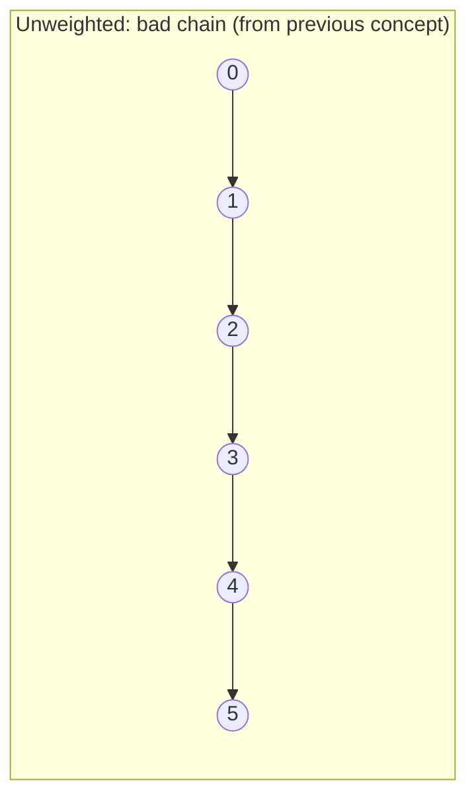
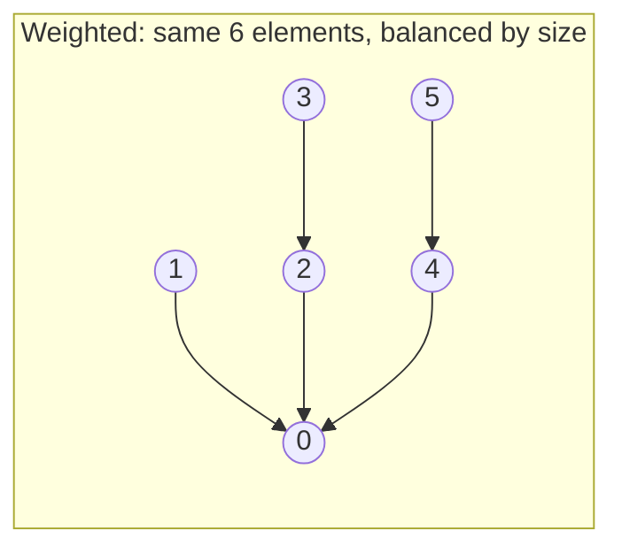

## Learning Objectives

- Implement weighted quick-union, attaching the root of the smaller (by size or rank) tree under the root of the larger one.
- Prove that union by size (or rank) alone caps the height of every tree at O(log n).
- Distinguish "union by size" (track element counts) from "union by rank" (track an upper bound on height), and explain why either suffices for the same asymptotic guarantee.
- Trace a sequence of unions under the weighted rule and show the resulting tree stays shallow where the naive rule (from the previous concept) would have produced a chain.
- Connect the "always merge smaller into larger" principle to the doubling argument used to amortize dynamic array growth, as a second instance of the same idea.

## Context & Motivation

The previous concept left quick-union with a specific, self-inflicted weakness: its `union(p, q)` always attached `p`'s root under `q`'s root, with no regard for which of the two trees was taller or held more elements. That indifference is precisely what let an unlucky (or entirely ordinary) sequence of unions chain every element into a single degenerate path, making `find` cost O(n) in the worst case. The fix, first popularized in exactly this form by Sedgewick and Wayne's treatment of union-find (again, the opening material of Princeton's "Algorithms, Part I"), requires no new data structure and no new operation — it only requires `union` to make one additional decision before attaching one root under the other: *which* root goes under which. Always attach the root of the smaller tree under the root of the larger tree, never the reverse. This single rule, called "weighting" or "union by size" (tracking element counts) or "union by rank" (tracking a height bound), provably caps the height of every tree at O(log n), regardless of how adversarial the sequence of unions is.

This is worth pausing on, because it is a genuinely elegant piece of algorithm design: no new bookkeeping structure was introduced, no operation's asymptotic category changed (union is still, essentially, "find two roots, write one pointer"), and yet the worst case for `find` collapses from linear to logarithmic, purely by being deliberate about which root becomes the child rather than leaving it to accident. This is also a recognizable instance of a broader pattern already seen in this curriculum's Data Structures I material: the doubling argument used to amortize the cost of dynamic array growth (where an array that grows by doubling its capacity, rather than by a fixed increment, keeps the *total* cost of all the resizes low relative to the number of insertions) works for a structurally similar reason — a policy that keeps the "expensive to redo" quantity (array capacity there, tree height here) growing in a controlled, geometric way, rather than allowing it to be driven arbitrarily by whatever order operations happen to arrive in.

## Core Theory

### The weighting rule

Maintain, alongside the `parent` array from quick-union, a second array recording either the **size** (number of elements) of the tree rooted at each root, or the **rank** (an upper bound on tree height) of each root. On `union(p, q)`, find both roots as before, but instead of unconditionally attaching one under the other, compare the weights and attach the smaller tree's root under the larger tree's root:

```python
class WeightedQuickUnion:
    def __init__(self, n):
        self.parent = list(range(n))
        self.size = [1] * n  # each singleton tree has size 1

    def find(self, p):
        while self.parent[p] != p:
            p = self.parent[p]
        return p

    def connected(self, p, q):
        return self.find(p) == self.find(q)

    def union(self, p, q):
        root_p, root_q = self.find(p), self.find(q)
        if root_p == root_q:
            return
        if self.size[root_p] < self.size[root_q]:
            self.parent[root_p] = root_q
            self.size[root_q] += self.size[root_p]
        else:
            self.parent[root_q] = root_p
            self.size[root_p] += self.size[root_q]
```

`find` is unchanged from quick-union — this optimization only changes how `union` decides which root to attach where. The extra bookkeeping (an `if` comparison and one array update to keep the merged tree's size current) is O(1) additional work per union — the asymptotic cost of `union` is unaffected; what changes is the guarantee on how tall the resulting trees can ever become.

### Theorem: weighted union caps tree height at O(log n)

**Claim.** Using union by size (or rank), the tree containing any element, after any sequence of unions, has height at most ⌊log₂ n⌋, where n is the total number of elements.

**Proof sketch.** The key observation is about what has to be true for any given element `x` to end up at depth `d` in its tree. Each time `x`'s depth increases by one, it is because the tree `x` currently sits in was just attached *underneath* another tree (as the smaller of the two, by the weighting rule) — and attaching under a rule that always merges the smaller into the larger means the tree `x` was part of, right before that merge, had a size at most equal to the tree it merged with. So each depth-increasing event for `x` at least *doubles* the size of the tree `x` belongs to (a tree of size `s` merging with a tree of size ≥ `s` produces a tree of size ≥ `2s`). A tree can double in size at most log₂(n) times before it reaches size n (the whole universe) — so `x`'s depth can increase at most log₂(n) times, meaning its final depth, and therefore the height of any tree, is bounded by O(log n). ∎

This is exactly the same shape of argument as the doubling analysis for dynamic array resizing: there, each resize event at least doubles the array's capacity, so at most O(log n) resizes can occur before capacity reaches n; here, each depth-increasing event for a given element at least doubles the size of its tree, so at most O(log n) such events can occur before the tree could plausibly contain the entire universe of n elements. In both cases, a policy that ties "cost of the next expensive-looking step" to "at least doubling some resource" is what turns a quantity that could otherwise grow linearly (array resizes without doubling; tree height without weighting) into one bounded logarithmically.

### Contrasting with the unweighted case





The same six elements, merged via the same underlying connectivity facts, can end up as either a height-5 chain (left, unweighted) or a tree of height 2 (right, weighted) purely depending on whether the merge rule ever considers tree size. Nothing about the *connectivity information* differs between the two — both correctly represent one group of six connected elements — but the shape, and therefore the cost of future `find` calls, is dramatically different.

### Union by rank vs. union by size

Union by *size* tracks the exact element count of each tree and always attaches by comparing counts directly, as coded above. Union by *rank* instead tracks an upper bound on each tree's height (not necessarily the exact height once path compression, covered next, is introduced) and attaches the lower-rank root under the higher-rank root; when two trees of equal rank merge, the resulting tree's rank increases by one (this is the only case in which rank needs to increase). Both achieve the identical O(log n) height bound via the same doubling-style argument — the reason both work is that either quantity (size or rank) suffices to identify, at merge time, which tree is "smaller" in the sense that matters (fewer future depth increases ahead of it), and it turns out either serves as a perfectly good proxy for making that comparison. In practice, both are equally standard; size has the minor advantage of also being directly useful information (e.g., "how many elements are in this group") independent of the union-find mechanics.

## Worked Examples

### Example 1 — replaying the chain-forming sequence with weighting

**Problem:** Repeat the exact union sequence from the previous concept's Example 2 — `union(0,1)`, `union(1,2)`, `union(2,3)`, `union(3,4)`, `union(4,5)` on n = 6 elements — but now using weighted quick-union (union by size). Compare the resulting tree height to the unweighted chain of height 5.

**Trace.** Start: `parent = [0,1,2,3,4,5]`, `size = [1,1,1,1,1,1]`.

- `union(0,1)`: roots 0 (size 1) and 1 (size 1) — sizes equal, so the `else` branch fires: attach root_q (1) under root_p (0). `parent[1] = 0`, `size[0] = 2`. Tree: 1 → 0.
- `union(1,2)`: `find(1) = 0` (size 2), `find(2) = 2` (size 1). 2's tree is smaller, so attach 2 under 0. `parent[2] = 0`, `size[0] = 3`. Tree: 0 has children {1, 2}.
- `union(2,3)`: `find(2) = 0` (size 3), `find(3) = 3` (size 1). Attach 3 under 0. `parent[3] = 0`, `size[0] = 4`. Tree: 0 has children {1,2,3}.
- `union(3,4)`: `find(3) = 0` (size 4), `find(4) = 4` (size 1). Attach 4 under 0. `parent[4] = 0`, `size[0] = 5`.
- `union(4,5)`: `find(4) = 0` (size 5), `find(5) = 5` (size 1). Attach 5 under 0. `parent[5] = 0`, `size[0] = 6`.

**Result:** every one of 1, 2, 3, 4, 5 is a direct child of root 0 — a tree of height 1, not 5. Every subsequent `find` on any of these six elements now costs exactly one hop, in stark contrast to the unweighted chain's five-hop worst case for the exact same sequence of connectivity facts.

### Example 2 — a case where the smaller tree is not the most recently created one

**Problem:** With n = 7, perform `union(0,1)` then `union(2,3)` (creating two separate 2-element trees), then `union(0,2)` (merging the two 2-element trees), then `union(4,0)` (merging a singleton into the now 4-element tree). Trace sizes and show the final tree height.

**Trace.** Start: `size = [1]*7`.

- `union(0,1)`: sizes 1 and 1, equal → attach 1 under 0. `size[0] = 2`.
- `union(2,3)`: sizes 1 and 1, equal → attach 3 under 2. `size[2] = 2`.
- `union(0,2)`: `find(0)=0` (size 2), `find(2)=2` (size 2). Equal sizes → attach root_q (2) under root_p (0) per the `else` branch. `parent[2] = 0`, `size[0] = 4`. Now 2's existing child, 3, is still attached to 2 — so 3 sits at depth 2 (3 → 2 → 0), while 1 sits at depth 1 (1 → 0).
- `union(4,0)`: `find(4)=4` (size 1), `find(0)=0` (size 4). Attach 4 under 0. `size[0] = 5`.

**Final tree:** root 0, with children 1, 2, 4 directly, and 3 as a child of 2 (so 3 is at depth 2). Height is 2 — still comfortably within the O(log n) bound for 7 elements (⌊log₂ 7⌋ = 2) — but this example shows the bound is on height, not on every path being length 1; some elements (like 3, folded in as part of a merged subtree) can sit deeper than others, as long as the total height never exceeds the logarithmic bound.

## Common Misconceptions & Pitfalls

- **"Union by rank/size makes `find` itself faster in its implementation, not just in the worst case."** The `find` code is completely unchanged from plain quick-union — it still walks parent pointers one at a time to the root. What changes is a guarantee about how many pointers there could ever be to walk, because the trees are now provably shallow. The speedup is a consequence of the *structure* the weighting produces, not a change to the `find` algorithm's logic.
- **"Since equal-size trees merge either way, the choice of which root becomes parent in a tie doesn't matter at all, ever."** For the height bound, it genuinely doesn't matter which of two equal-weight roots becomes the parent — both choices preserve the O(log n) guarantee. But it can matter for the exact resulting shape (as Example 2 shows, with element 3 ending up at depth 2 rather than depth 1) — the height bound is about the worst case across the whole tree, not a claim that every element sits at the same depth.
- **"Rank is the same thing as height, always."** Rank starts as an accurate height bound, but once path compression (the next concept) is introduced, actual tree heights can shrink below what rank records, since compression does not bother updating rank on every flattening. Rank remains a valid *upper* bound on height, but it can become a loose one — this is a deliberate simplification, not a bug, and does not affect the correctness of using rank to decide future merges.
- **"Weighting alone gets union-find all the way to constant time per operation."** Weighting alone caps height at O(log n) — a real, substantial improvement over the unbounded chains of naive quick-union, but `find` is still O(log n) in the worst case under weighting alone, not O(1). Getting to the near-constant amortized bound requires combining this with path compression, covered in the next concept, and analyzed together in the concept after that.

## Summary

Union by rank (or size) fixes quick-union's core weakness — arbitrary, undisciplined attachment of one root under another — with a single deliberate rule: always attach the smaller (by size) or shallower (by rank) tree's root under the larger one's, never the reverse. This one change, requiring only O(1) extra bookkeeping per union, provably caps every tree's height at O(log n), because each event that increases any given element's depth requires the tree containing it to at least double in size, and a quantity can only double O(log n) times before reaching the full universe of n elements — the same doubling-argument shape used to amortize dynamic array resizing. The same connectivity facts that produced a height-5 degenerate chain under naive quick-union produce a height-1 or height-2 tree under weighting, as the worked examples show directly. Weighting alone is not yet the final word — `find` is still O(log n) in the worst case — but it is the first of the two optimizations that, combined with path compression next, bring union-find to its famous near-constant amortized performance.

## Documentation Links

- [Sedgewick & Wayne — Algorithms Lectures (Princeton)](https://algs4.cs.princeton.edu/lectures/) — doc
- [Stanford CS166 — Data Structures](https://web.stanford.edu/class/cs166) — doc
