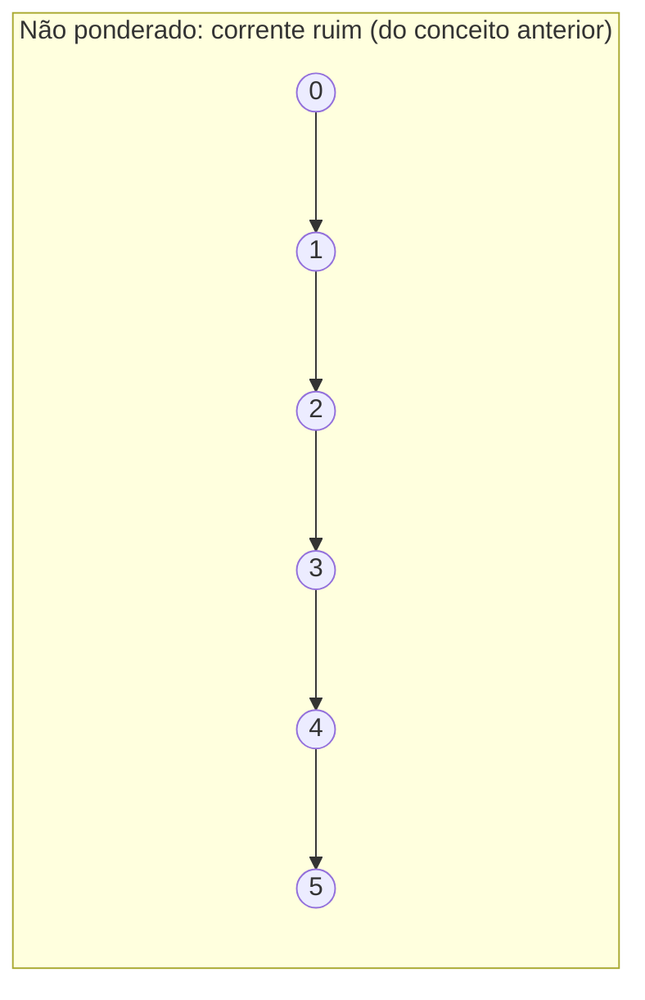
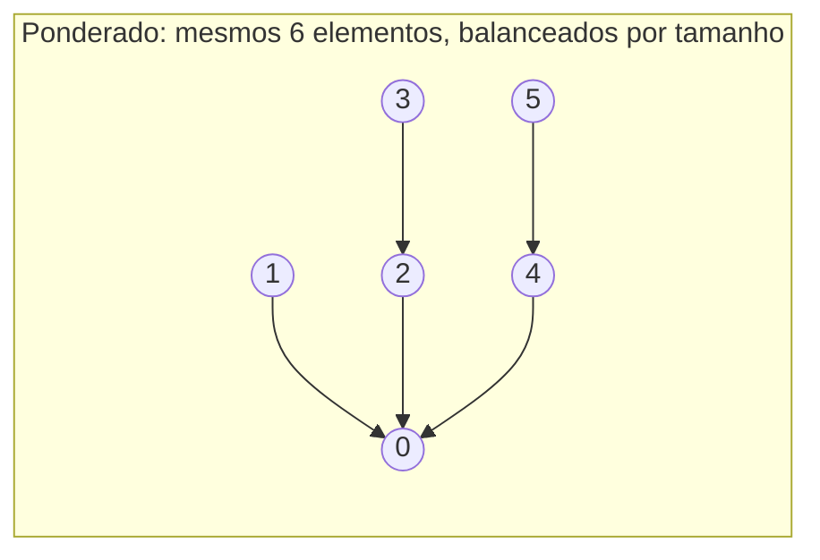

## Objetivos de Aprendizagem

- Implementar weighted quick-union, anexando a raiz da árvore menor (por size ou rank) sob a raiz da maior.
- Provar que union por size (ou rank) sozinho limita a altura de toda árvore a O(log n).
- Distinguir "union por size" (rastrear contagens de elemento) de "union por rank" (rastrear um limite superior de altura), e explicar por que qualquer um é suficiente para a mesma garantia assintótica.
- Rastrear uma sequência de uniões sob a regra ponderada e mostrar que a árvore resultante permanece rasa onde a regra ingênua (do conceito anterior) teria produzido uma corrente.
- Conectar o princípio "sempre funda o menor no maior" ao argumento de dobramento usado para amortizar o crescimento de array dinâmico, como uma segunda instância da mesma ideia.

## Contexto e Motivação

O conceito anterior deixou quick-union com uma fraqueza específica e auto-infligida: seu `union(p, q)` sempre anexava a raiz de `p` sob a raiz de `q`, sem nenhuma consideração por qual das duas árvores era mais alta ou continha mais elementos. Essa indiferença é precisamente o que permitiu que uma sequência azarada (ou inteiramente comum) de uniões encadeasse todo elemento em um único caminho degenerado, tornando `find` custar O(n) no pior caso. O conserto, primeiro popularizado exatamente nessa forma pelo tratamento de union-find de Sedgewick e Wayne (novamente, o material de abertura de "Algorithms, Part I" de Princeton), não exige nenhuma estrutura de dados nova e nenhuma operação nova, apenas exige que `union` tome uma decisão adicional antes de anexar uma raiz sob a outra: *qual* raiz vai sob qual. Sempre anexe a raiz da árvore menor sob a raiz da árvore maior, nunca o reverso. Essa única regra, chamada de "ponderação" ou "union por size" (rastreando contagens de elemento) ou "union por rank" (rastreando um limite de altura), comprovadamente limita a altura de toda árvore a O(log n), independentemente de quão adversarial a sequência de uniões seja.

Vale a pena parar nisso, porque é uma peça genuinamente elegante de design de algoritmo: nenhuma nova estrutura de contabilidade foi introduzida, nenhuma categoria assintótica de operação mudou (union ainda é, essencialmente, "encontre duas raízes, escreva um ponteiro"), e ainda assim o pior caso para `find` colapsa de linear para logarítmico, puramente por ser deliberado sobre qual raiz se torna o filho em vez de deixar isso ao acaso. Esta também é uma instância reconhecível de um padrão mais amplo já visto no material de Estruturas de Dados I deste currículo: o argumento de dobramento usado para amortizar o custo de crescimento de array dinâmico (onde um array que cresce dobrando sua capacidade, em vez de por um incremento fixo, mantém o custo *total* de todos os redimensionamentos baixo em relação ao número de inserções) funciona por uma razão estruturalmente similar, uma política que mantém a quantidade "cara de refazer" (capacidade de array ali, altura de árvore aqui) crescendo de forma controlada e geométrica, em vez de permitir que seja conduzida arbitrariamente por qualquer ordem em que as operações aconteçam de chegar.

## Teoria Central

### A regra de ponderação

Mantenha, ao lado do array `parent` do quick-union, um segundo array registrando ou o **size** (número de elementos) da árvore enraizada em cada raiz, ou o **rank** (um limite superior na altura de árvore) de cada raiz. Em `union(p, q)`, encontre ambas as raízes como antes, mas em vez de anexar incondicionalmente uma sob a outra, compare os pesos e anexe a raiz da árvore menor sob a raiz da árvore maior:

```python
class WeightedQuickUnion:
    def __init__(self, n):
        self.parent = list(range(n))
        self.size = [1] * n  # cada árvore singleton tem tamanho 1

    def find(self, p):
        while self.parent[p] != p:
            p = self.parent[p]
        return p

    def connected(self, p, q):
        return self.find(p) == self.find(q)

    def union(self, p, q):
        root_p, root_q = self.find(p), self.find(q)
        if root_p == root_q:
            return
        if self.size[root_p] < self.size[root_q]:
            self.parent[root_p] = root_q
            self.size[root_q] += self.size[root_p]
        else:
            self.parent[root_q] = root_p
            self.size[root_p] += self.size[root_q]
```

`find` é inalterado do quick-union, essa otimização apenas muda como `union` decide qual raiz anexar onde. A contabilidade extra (uma comparação `if` e uma atualização de array para manter o tamanho da árvore fundida atualizado) é O(1) de trabalho adicional por união, o custo assintótico de `union` é inafetado; o que muda é a garantia sobre quão altas as árvores resultantes podem se tornar.

### Teorema: union ponderado limita altura de árvore a O(log n)

**Afirmação.** Usando union por size (ou rank), a árvore contendo qualquer elemento, depois de qualquer sequência de uniões, tem altura no máximo ⌊log₂ n⌋, onde n é o número total de elementos.

**Esboço de prova.** A observação chave é sobre o que tem que ser verdade para qualquer dado elemento `x` acabar na profundidade `d` em sua árvore. Toda vez que a profundidade de `x` aumenta em um, é porque a árvore em que `x` atualmente está foi recém-anexada *sob* outra árvore (como a menor das duas, pela regra de ponderação), e anexar sob uma regra que sempre funde a menor na maior significa que a árvore da qual `x` fazia parte, exatamente antes daquela fusão, tinha um tamanho no máximo igual à árvore com que fundiu. Então todo evento de aumento de profundidade para `x` pelo menos *dobra* o tamanho da árvore à qual `x` pertence (uma árvore de tamanho `s` fundindo com uma árvore de tamanho ≥ `s` produz uma árvore de tamanho ≥ `2s`). Uma árvore pode dobrar de tamanho no máximo log₂(n) vezes antes de alcançar tamanho n (o universo inteiro), então a profundidade de `x` pode aumentar no máximo log₂(n) vezes, significando que sua profundidade final, e portanto a altura de qualquer árvore, é limitada por O(log n). ∎

Este é exatamente o mesmo formato de argumento que a análise de dobramento para redimensionamento de array dinâmico: ali, todo evento de redimensionamento pelo menos dobra a capacidade do array, então no máximo O(log n) redimensionamentos podem ocorrer antes de a capacidade alcançar n; aqui, todo evento de aumento de profundidade para um dado elemento pelo menos dobra o tamanho de sua árvore, então no máximo O(log n) desses eventos podem ocorrer antes de a árvore poder plausivelmente conter o universo inteiro de n elementos. Em ambos os casos, uma política que atrela "custo do próximo passo de aparência cara" a "pelo menos dobrar algum recurso" é o que transforma uma quantidade que de outra forma poderia crescer linearmente (redimensionamentos de array sem dobramento; altura de árvore sem ponderação) em uma limitada logaritmicamente.

### Contrastando com o caso não ponderado





Os mesmos seis elementos, fundidos via os mesmos fatos de conectividade subjacentes, podem acabar como ou uma corrente de altura 5 (esquerda, não ponderada) ou uma árvore de altura 2 (direita, ponderada) puramente dependendo de se a regra de fusão sequer considera tamanho de árvore. Nada sobre a *informação de conectividade* difere entre as duas (ambas corretamente representam um grupo de seis elementos conectados), mas o formato, e portanto o custo de futuras chamadas `find`, é dramaticamente diferente.

### Union por rank vs. union por size

Union por *size* rastreia a contagem exata de elemento de cada árvore e sempre anexa comparando contagens diretamente, como codificado acima. Union por *rank* em vez disso rastreia um limite superior na altura de cada árvore (não necessariamente a altura exata uma vez que compressão de caminho, coberta a seguir, é introduzida) e anexa a raiz de rank menor sob a raiz de rank maior; quando duas árvores de rank igual se fundem, o rank da árvore resultante aumenta em um (este é o único caso em que rank precisa aumentar). Ambas alcançam o mesmo limite de altura O(log n) idêntico via o mesmo estilo de argumento de dobramento, a razão pela qual ambas funcionam é que qualquer quantidade (size ou rank) é suficiente para identificar, no momento da fusão, qual árvore é "menor" no sentido que importa (menos aumentos de profundidade futuros à sua frente), e acontece que qualquer uma serve como um proxy perfeitamente bom para fazer essa comparação. Na prática, ambas são igualmente padrão; size tem a vantagem menor de também ser informação diretamente útil (por exemplo, "quantos elementos há neste grupo") independente da mecânica de union-find.

## Exemplos Resolvidos

### Exemplo 1 — reproduzindo a sequência formadora de corrente com ponderação

**Problema:** Repita a sequência de união exata do Exemplo 2 do conceito anterior, `union(0,1)`, `union(1,2)`, `union(2,3)`, `union(3,4)`, `union(4,5)` em n = 6 elementos, mas agora usando weighted quick-union (union por size). Compare a altura de árvore resultante com a corrente não ponderada de altura 5.

**Rastreamento.** Início: `parent = [0,1,2,3,4,5]`, `size = [1,1,1,1,1,1]`.

- `union(0,1)`: raízes 0 (tamanho 1) e 1 (tamanho 1), tamanhos iguais, então o ramo `else` dispara: anexa root_q (1) sob root_p (0). `parent[1] = 0`, `size[0] = 2`. Árvore: 1 → 0.
- `union(1,2)`: `find(1) = 0` (tamanho 2), `find(2) = 2` (tamanho 1). A árvore de 2 é menor, então anexe 2 sob 0. `parent[2] = 0`, `size[0] = 3`. Árvore: 0 tem filhos {1, 2}.
- `union(2,3)`: `find(2) = 0` (tamanho 3), `find(3) = 3` (tamanho 1). Anexe 3 sob 0. `parent[3] = 0`, `size[0] = 4`. Árvore: 0 tem filhos {1,2,3}.
- `union(3,4)`: `find(3) = 0` (tamanho 4), `find(4) = 4` (tamanho 1). Anexe 4 sob 0. `parent[4] = 0`, `size[0] = 5`.
- `union(4,5)`: `find(4) = 0` (tamanho 5), `find(5) = 5` (tamanho 1). Anexe 5 sob 0. `parent[5] = 0`, `size[0] = 6`.

**Resultado:** cada um dos elementos 1, 2, 3, 4, 5 é um filho direto da raiz 0, uma árvore de altura 1, não 5. Toda busca `find` subsequente em qualquer um desses seis elementos agora custa exatamente um salto, em contraste marcante com o pior caso de cinco saltos da corrente não ponderada para a exata mesma sequência de fatos de conectividade.

### Exemplo 2 — um caso onde a árvore menor não é a mais recentemente criada

**Problema:** Com n = 7, execute `union(0,1)` depois `union(2,3)` (criando duas árvores separadas de 2 elementos), depois `union(0,2)` (fundindo as duas árvores de 2 elementos), depois `union(4,0)` (fundindo um singleton na agora árvore de 4 elementos). Rastreie tamanhos e mostre a altura de árvore final.

**Rastreamento.** Início: `size = [1]*7`.

- `union(0,1)`: tamanhos 1 e 1, iguais → anexe 1 sob 0. `size[0] = 2`.
- `union(2,3)`: tamanhos 1 e 1, iguais → anexe 3 sob 2. `size[2] = 2`.
- `union(0,2)`: `find(0)=0` (tamanho 2), `find(2)=2` (tamanho 2). Tamanhos iguais → anexe root_q (2) sob root_p (0) pelo ramo `else`. `parent[2] = 0`, `size[0] = 4`. Agora o filho existente de 2, 3, ainda está anexado a 2, então 3 fica na profundidade 2 (3 → 2 → 0), enquanto 1 fica na profundidade 1 (1 → 0).
- `union(4,0)`: `find(4)=4` (tamanho 1), `find(0)=0` (tamanho 4). Anexe 4 sob 0. `size[0] = 5`.

**Árvore final:** raiz 0, com filhos 1, 2, 4 diretamente, e 3 como filho de 2 (então 3 está na profundidade 2). A altura é 2, ainda confortavelmente dentro do limite O(log n) para 7 elementos (⌊log₂ 7⌋ = 2), mas este exemplo mostra que o limite é sobre altura, não sobre todo caminho ter comprimento 1; alguns elementos (como 3, dobrado como parte de uma subárvore fundida) podem ficar mais profundos que outros, contanto que a altura total nunca exceda o limite logarítmico.

## Equívocos Comuns e Armadilhas

- **"Union por rank/size torna o próprio `find` mais rápido em sua implementação, não apenas no pior caso."** O código de `find` é completamente inalterado do quick-union comum, ainda sobe ponteiros de pai um de cada vez até a raiz. O que muda é uma garantia sobre quantos ponteiros poderia jamais haver para subir, porque as árvores agora são comprovadamente rasas. A aceleração é uma consequência da *estrutura* que a ponderação produz, não uma mudança na lógica do algoritmo `find`.
- **"Já que árvores de tamanho igual se fundem de qualquer forma, a escolha de qual raiz se torna pai em um empate não importa em absoluto, nunca."** Para o limite de altura, genuinamente não importa qual das duas raízes de peso igual se torna o pai, ambas as escolhas preservam a garantia O(log n). Mas pode importar para o formato exato resultante (como o Exemplo 2 mostra, com o elemento 3 acabando na profundidade 2 em vez de profundidade 1), o limite de altura é sobre o pior caso através da árvore inteira, não uma afirmação de que todo elemento fica na mesma profundidade.
- **"Rank é a mesma coisa que altura, sempre."** Rank começa como um limite de altura preciso, mas uma vez que compressão de caminho (o próximo conceito) é introduzida, alturas de árvore reais podem encolher abaixo do que rank registra, já que compressão não se preocupa em atualizar rank em todo achatamento. Rank permanece um limite *superior* válido para altura, mas pode se tornar frouxo, isso é uma simplificação deliberada, não um bug, e não afeta a correção de usar rank para decidir fusões futuras.
- **"Ponderação sozinha leva union-find até tempo constante por operação."** Ponderação sozinha limita altura a O(log n), uma melhoria real e substancial sobre as correntes ilimitadas do quick-union ingênuo, mas `find` ainda é O(log n) no pior caso sob ponderação sozinha, não O(1). Chegar ao limite amortizado quase constante exige combinar isso com compressão de caminho, coberta no próximo conceito, e analisada em conjunto no conceito depois desse.

## Resumo

Union por rank (ou size) conserta a fraqueza central do quick-union, anexação arbitrária e indisciplinada de uma raiz sob outra, com uma única regra deliberada: sempre anexe a raiz da árvore menor (por size) ou mais rasa (por rank) sob a da maior, nunca o reverso. Essa única mudança, exigindo apenas O(1) de contabilidade extra por união, comprovadamente limita a altura de toda árvore a O(log n), porque todo evento que aumenta a profundidade de qualquer dado elemento exige que a árvore contendo-o pelo menos dobre de tamanho, e uma quantidade só pode dobrar O(log n) vezes antes de alcançar o universo completo de n elementos, o mesmo formato de argumento de dobramento usado para amortizar redimensionamento de array dinâmico. Os mesmos fatos de conectividade que produziram uma corrente degenerada de altura 5 sob quick-union ingênuo produzem uma árvore de altura 1 ou altura 2 sob ponderação, como os exemplos resolvidos mostram diretamente. Ponderação sozinha ainda não é a palavra final, `find` ainda é O(log n) no pior caso, mas é a primeira das duas otimizações que, combinada com compressão de caminho a seguir, trazem union-find ao seu famoso desempenho amortizado quase constante.

## Documentation Links

- [Sedgewick & Wayne — Algorithms Lectures (Princeton)](https://algs4.cs.princeton.edu/lectures/) — doc
- [Stanford CS166 — Data Structures](https://web.stanford.edu/class/cs166) — doc
