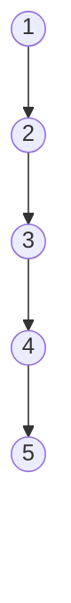
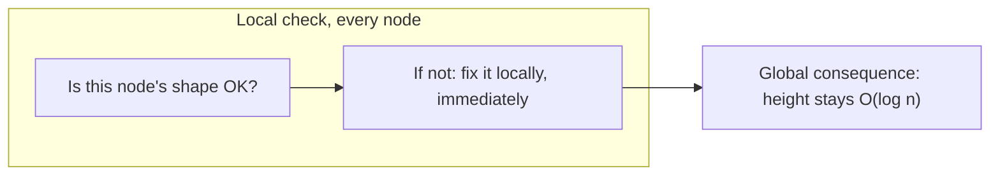
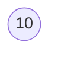
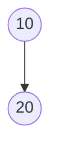
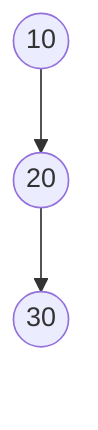
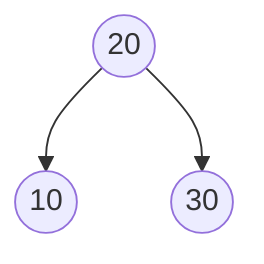

## Learning Objectives

- Restate precisely why a plain binary search tree's O(log n) guarantee fails, citing the specific sorted-insertion degeneration mechanism from Data Structures I.
- Define a **balance invariant** as a rule, checked and restored after every insertion or deletion, that bounds a tree's height to O(log n) regardless of insertion order.
- Explain the general principle that a *local* per-node condition, enforced everywhere, can guarantee a *global* structural property (bounded height) — the idea every self-balancing tree in this discipline builds on.
- Preview the two invariants this discipline develops (AVL's strict per-node height rule, red-black's looser color-based rule) and state that both trade a little bookkeeping overhead for a hard height guarantee.
- Given an insertion sequence, predict whether a balance invariant would need to intervene, without yet knowing the mechanics of how it intervenes.

## Context & Motivation

The immediately preceding concept in this curriculum, BST Performance and Balance, ended on a deliberately uncomfortable note. It proved — not asserted, proved, with a worked example anyone can trace by hand — that a plain binary search tree offers no guarantee whatsoever that its height stays close to log₂(n). Feed it the values 1 through 5 already in sorted order, and `insert` does exactly what it is supposed to do at every step: compare, find the value is larger than everything already present, go right, find an empty spot, attach. There is no bug anywhere in that process. And yet the result is a chain — node 1 pointing right to node 2, pointing right to node 3, and so on — a structure that is a perfectly valid binary search tree by every rule defined so far, but whose height is n − 1 instead of the roughly log₂(n) a "bushy" tree would have. For n = 1,000,000, that is the difference between a search touching about 20 nodes and one touching up to 999,999 — a five-order-of-magnitude gap, arising purely from the order values arrived in, with the search algorithm itself completely unchanged.

That prior concept was explicit that this failure is not a corner case to be dismissed — it is the *default* outcome for a meaningful class of realistic inputs. Sorted or nearly-sorted data is not a contrived adversarial input; it shows up constantly in practice — timestamps logged in order, auto-incrementing keys, alphabetically pre-sorted names, IDs assigned sequentially by another system upstream. Any of these, inserted one at a time into a plain BST, reproduces the same collapse: a linked list wearing a binary tree's clothing. The prior concept named the fix without building it — "self-balancing binary search trees... covered later, in `data-structures-ii`" — and deliberately left the mechanism as a forward reference. This concept is that promise being kept, and it is where this discipline actually begins.

The strategy this discipline pursues is not "detect degeneration after the fact and rebuild the tree" — that would mean periodically paying an O(n) cost to fix something that already went wrong, and it would still allow arbitrarily bad performance in between rebuilds. The strategy is instead to make degeneration *structurally impossible*: define a rule about shape that every node must satisfy at all times, check it incrementally as the tree changes, and restore it immediately, locally, whenever an insertion or deletion would otherwise break it. That rule is what this concept calls a **balance invariant**, and the rest of this discipline is the story of two different ways to define one — AVL trees, which enforce a strict numeric condition on subtree heights, and red-black trees, which enforce a looser condition using colors instead of numbers. Both close off the exact failure mode just described. Neither is "the" fix in some unique sense; they are two different, both entirely valid, answers to the same design question, and comparing them honestly is this discipline's final concept.

## Core Theory

### Recapping the exact failure, precisely

To be concrete about what is being fixed, restate the mechanism from the prerequisite concept without softening it: given a plain BST and an insertion sequence, each insertion follows the BST's ordering rule down from the root to the first empty position and attaches there — there is no step in this process that ever looks at the tree's overall shape. When every newly inserted value happens to be larger than every value already present (the sorted-order case) or smaller than every value already present (the reverse-sorted case), every single insertion is forced down the same side, and the tree accumulates as one long chain rather than branching. The BST invariant — left subtree smaller, right subtree larger — holds at every node throughout; nothing here is invalid. It is simply unbounded in the worst case: height h can be as large as n − 1, and since search, insert, and delete are all O(h) (each walks exactly one root-to-somewhere path), an O(n) height means O(n) operations — no better than scanning an unsorted linked list.

This is the shape a balance invariant exists to make impossible, at every point in the tree's lifetime — not just at the end, but after every single insertion along the way.

### Defining a balance invariant

A **balance invariant** is a precise, checkable condition on a tree's shape, defined so that:

1. It can be verified (and, when violated, restored) by looking only at a small, local neighborhood of the tree — typically a node and its immediate children or grandchildren — not the whole structure.
2. If it holds at every node, it forces the tree's height to be O(log n), no matter what order the n values were inserted or deleted in.
3. It can be restored after any single insertion or deletion using only a bounded amount of local restructuring work, not a full rebuild.

The word "invariant" is doing real work here: it names a property that is supposed to hold *always*, at every quiescent moment (that is, in between operations) — not something checked occasionally, but something a correct implementation never allows to be violated for longer than the single operation currently in progress. This is exactly the same use of the word as a loop invariant or a class invariant elsewhere in this curriculum: a claim that is established once and then maintained by every subsequent step that could threaten it.

Two structures in this discipline instantiate this idea with two different concrete rules:

- **AVL trees** (next concept) define the invariant numerically: for every node, the heights of its left and right subtrees differ by at most 1. This is a strict, easily stated condition, checked with simple arithmetic at each node.
- **Red-black trees** (covered after AVL rotations) define the invariant using a color attached to each node (red or black) and a small set of coloring rules, which turn out to bound height by roughly 2·log₂(n+1) — a looser bound than AVL's, but still O(log n), and cheaper to restore on average.

Both are, in the sense defined above, balance invariants: local, checkable, height-bounding, and locally restorable. Neither is discussed in mechanical detail in this concept — that is the job of the next three concepts — but understanding that they are *two answers to the same question* is the organizing idea this whole discipline hangs on.

### Why a local rule can guarantee a global property

It is worth pausing on why this strategy even works, since it is not obvious on first encounter that a purely local, per-node check could possibly say anything about the tree's overall height. The intuition is a counting argument, made precise for AVL trees in the next concept: if every node individually is forbidden from being "too lopsided" relative to its own children, then a tree cannot get tall without also being forced to have a large number of nodes — tallness and sparseness cannot coexist under the invariant. Conversely, if a tree has only n nodes, the invariant caps how tall it is permitted to be, because a taller tree under the same local restriction would require more nodes than are available. This is the shape of the argument for both AVL and red-black trees, even though the specific bound differs (AVL trees end up strictly shorter than red-black trees for the same n, at the cost of pickier rebalancing — the subject of the final concept in this discipline).

### The other half of the trade: rebalancing has a cost

A balance invariant is not free. Maintaining it means that after an insertion or deletion, the structure may need to perform extra work — a **rotation**, a local restructuring operation covered in full mechanical detail in the next-but-one concept — to restore the invariant before the operation is considered complete. This means every insert or delete in a self-balancing tree does strictly more work, on average, than the equivalent operation on a plain BST: a plain BST insert is "walk down, attach" and nothing else; a self-balancing insert is "walk down, attach, then walk back up checking and possibly fixing the invariant." The saving grace, proved concept by concept in this discipline, is that this extra work is itself only O(log n) per operation (proportional to the height, which the invariant is simultaneously keeping small) — so the *total* asymptotic cost of insert or delete remains O(log n), just with a larger constant factor than a plain BST's best case. What is being purchased with that constant-factor overhead is the elimination of the *worst* case entirely: a self-balancing tree has no equivalent of the sorted-insertion collapse, because the invariant would intervene at the very first insertion that threatened to create it.

## Worked Examples

### Example 1 — locating the exact insertion that would first violate the AVL invariant

**Problem:** Consider inserting the sorted sequence `10, 20, 30` one value at a time into an initially empty BST, exactly as the prerequisite concept did with a longer sequence. At which insertion does the AVL balance invariant (subtree heights differ by at most 1 at every node) first become violated, assuming no rebalancing has occurred yet?

**Step through the insertions.**

Insert `10`: tree is a single node. Trivially balanced (both subtrees are empty, height −1 by convention, difference 0).

Insert `20`: `20 > 10`, becomes 10's right child. Node 10 now has an empty left subtree (height −1) and a right subtree containing just node 20 (height 0). Difference = 0 − (−1) = 1. Still within the allowed {−1, 0, 1} range — no violation yet.

Insert `30`: `30 > 10`, go right to 20; `30 > 20`, becomes 20's right child. Now check node 10: its left subtree is still empty (height −1), and its right subtree is rooted at 20, which itself has a right child (30), so that subtree has height 1. Difference at node 10 = 1 − (−1) = 2.

**Conclusion.** The invariant is violated at node 10 immediately after the third insertion — the first point at which the sorted-order pattern has produced three nodes in a straight line. This is exactly the shape a rotation (next concept) exists to correct, and it is no coincidence that it takes exactly three same-direction insertions to trigger the first violation — that threshold is a direct consequence of the ±1 tolerance the invariant allows.

### Example 2 — the same sequence, but middle-out, never violates the invariant

**Problem:** Insert `20, 10, 30` (the same three values, different order) and check the AVL invariant after each step.

Insert `20`: single node, trivially balanced.

Insert `10`: `10 < 20`, becomes 20's left child. Node 20's left subtree has height 0, right subtree height −1 (empty). Difference = 1. Within range.

Insert `30`: `30 > 20`, becomes 20's right child. Node 20's left subtree (just 10) has height 0, right subtree (just 30) has height 0. Difference = 0.

**Conclusion.** Same three values, same number of insertions, and the invariant holds at every step without any correction ever being needed — because this insertion order happens to be exactly the "bushy" pattern the prerequisite concept identified as good. The invariant does not do anything different here; it simply never finds anything to fix. This is the general pattern: a balance invariant only intervenes when the natural, undirected result of an insertion would otherwise produce a shape it forbids — it is not extra overhead on every operation, only on the operations that actually threaten the guarantee.

### Example 3 — scaling the stakes: why this matters for a real system

**Problem:** A database index is implemented as a search tree holding 10 million keys, and the application inserts keys in increasing order (a common pattern for auto-incrementing primary keys). Compare the worst-case number of comparisons per lookup with and without a balance invariant.

**Without a balance invariant (plain BST).** Sorted-order insertion produces the degenerate chain described in Core Theory, with height n − 1 = 9,999,999. A lookup for the most recently inserted key touches essentially all 10 million nodes in the worst case.

**With a balance invariant (AVL or red-black, mechanics deferred to later concepts).** Height is guaranteed O(log n) regardless of insertion order. log₂(10,000,000) ≈ 23.3, so even the loosest of the two invariants covered in this discipline keeps height under roughly 2 × 24 ≈ 48 in the worst case — a lookup touches at most a few dozen nodes.

**Takeaway.** The gap here — a few dozen comparisons versus potentially ten million — is exactly the gap this discipline exists to close, and it is precisely the scenario (auto-incrementing keys, a genuinely common real-world insertion pattern) where a plain BST's worst case is not a hypothetical edge case but the expected outcome. This is why essentially no production search-tree implementation — not a database index, not a language's standard-library ordered map — is a plain, unbalanced BST; all of them implement some balance invariant, and the next four concepts build the two most important ones from the ground up.

## Common Misconceptions & Pitfalls

- **"Self-balancing trees eliminate the cost of insertion and deletion."** They don't eliminate it — they bound it. A self-balancing insert still does strictly more work than a plain BST's best-case insert, because it must check and potentially restore the invariant after attaching the new node. What is eliminated is the *worst* case, not the per-operation overhead; Example 1 shows the invariant can trigger extra work after as few as three insertions.
- **"The balance invariant needs to re-examine the whole tree after every insertion."** It does not — this is precisely why the invariant is defined to be checkable and restorable *locally*. A correct implementation only inspects (and, if needed, restructures) nodes along the single path from the newly inserted node back up to the root, which is itself only O(log n) nodes once the invariant is already holding — never the whole tree.
- **"Any tree that 'looks' reasonably balanced by eye satisfies a balance invariant."** A balance invariant is a precise, numeric or color-based condition, not an impression. Example 1's tree after inserting `30` looks only mildly lopsided to the eye, yet it already violates the AVL invariant's exact ±1 threshold — "looks fine" and "satisfies the invariant" are not the same claim.
- **"There is one correct definition of 'balanced.'"** AVL and red-black trees are both legitimate, both widely used, and they define balance differently — one strict and numeric, one looser and color-based — producing trees of different heights for the same data under the same invariant-restoring discipline. Comparing these honestly, including the fact that neither is strictly "better" in all situations, is the subject of this discipline's closing concept.
- **"Balance invariants only matter for sorted input."** Sorted or reverse-sorted input is the clearest way to *demonstrate* the plain BST's worst case, but any insertion sequence that happens to repeatedly favor one side — not necessarily perfectly sorted — can degrade height well past O(log n). A balance invariant guards against the entire family of bad orderings, not just the fully sorted one used to illustrate it.

## Summary

The prerequisite concept proved that a plain binary search tree offers no guarantee on height — sorted-order insertion (or its reverse) forces every value down the same side, collapsing an n-node BST into a chain of height n − 1, and turning every O(h) operation into an O(n) one, despite every step along the way being a perfectly valid BST operation. This concept named the general fix: a **balance invariant**, a precise, locally checkable, locally restorable condition on shape, enforced after every insertion and deletion, that forces height to stay O(log n) no matter what order values arrive in. This discipline develops exactly two such invariants — AVL's strict per-node rule that left and right subtree heights differ by at most 1, and red-black's looser color-based rule — each restored via a local restructuring operation called a rotation, at the cost of extra bookkeeping and extra (but still O(log n)) work per operation, in exchange for eliminating the worst case entirely. The next concept makes the AVL invariant precise and shows why it is strong enough to force O(log n) height on its own.

## Documentation Links

- [MIT 6.006 — Lecture Notes (OCW)](https://ocw.mit.edu/courses/6-006-introduction-to-algorithms-spring-2020/pages/lecture-notes/) — doc
- [Sedgewick & Wayne — Algorithms Lectures (Princeton)](https://algs4.cs.princeton.edu/lectures/) — doc
