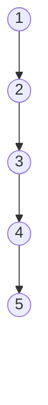
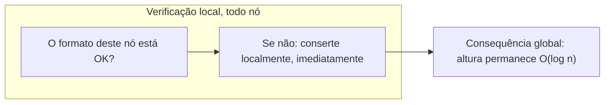
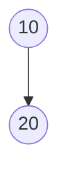
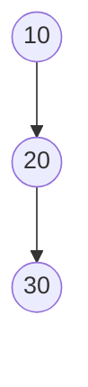
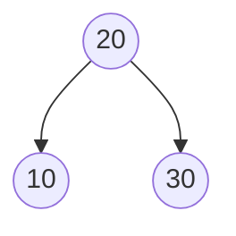

## Objetivos de Aprendizagem

- Reafirmar precisamente por que a garantia O(log n) de uma árvore binária de busca comum falha, citando o mecanismo específico de degeneração por inserção ordenada de Estruturas de Dados I.
- Definir um **invariante de balanceamento** como uma regra, verificada e restaurada depois de toda inserção ou remoção, que limita a altura de uma árvore a O(log n) independentemente da ordem de inserção.
- Explicar o princípio geral de que uma condição *local* por nó, aplicada em todo lugar, pode garantir uma propriedade *global* estrutural (altura limitada), a ideia sobre a qual toda árvore autobalanceada nesta disciplina se constrói.
- Antecipar os dois invariantes que esta disciplina desenvolve (a regra estrita de altura por nó da AVL, a regra mais frouxa baseada em cor da rubro-negra) e enunciar que ambos trocam um pouco de sobrecarga de contabilidade por uma garantia rígida de altura.
- Dada uma sequência de inserção, prever se um invariante de balanceamento precisaria intervir, sem ainda saber a mecânica de como ele intervém.

## Contexto e Motivação

O conceito imediatamente anterior neste currículo, Desempenho e Balanceamento de BST, terminou em uma nota deliberadamente desconfortável. Ele provou, não apenas afirmou, provou, com um exemplo resolvido que qualquer um pode rastrear à mão, que uma árvore binária de busca comum não oferece garantia alguma de que sua altura permaneça próxima de log₂(n). Alimente-a com os valores 1 a 5 já em ordem crescente, e `insert` faz exatamente o que deveria fazer em cada passo: compara, descobre que o valor é maior que tudo que já está presente, vai para a direita, encontra um espaço vazio, anexa. Não há nenhum bug em lugar algum desse processo. E ainda assim o resultado é uma corrente, o nó 1 apontando à direita para o nó 2, apontando à direita para o nó 3, e assim por diante, uma estrutura que é uma árvore binária de busca perfeitamente válida por toda regra definida até agora, mas cuja altura é n − 1 em vez do log₂(n) aproximado que uma árvore "frondosa" teria. Para n = 1.000.000, isso é a diferença entre uma busca tocando cerca de 20 nós e uma tocando até 999.999, uma lacuna de cinco ordens de magnitude, surgindo puramente da ordem em que os valores chegaram, com o próprio algoritmo de busca completamente inalterado.

Aquele conceito anterior foi explícito de que essa falha não é um caso extremo a ser descartado, é o resultado *padrão* para uma classe significativa de entradas realistas. Dados ordenados ou quase ordenados não são uma entrada adversarial artificial; aparecem constantemente na prática, timestamps registrados em ordem, chaves autoincrementais, nomes pré-ordenados alfabeticamente, IDs atribuídos sequencialmente por outro sistema a montante. Qualquer um desses, inserido um de cada vez em uma BST comum, reproduz o mesmo colapso: uma lista encadeada vestida de árvore binária. O conceito anterior nomeou o conserto sem construí-lo, "árvores binárias de busca autobalanceadas... cobertas mais tarde, em `data-structures-ii`", e deliberadamente deixou o mecanismo como uma referência futura. Este conceito é essa promessa sendo cumprida, e é onde esta disciplina de fato começa.

A estratégia que esta disciplina persegue não é "detectar degeneração depois do fato e reconstruir a árvore", isso significaria pagar periodicamente um custo O(n) para consertar algo que já deu errado, e ainda permitiria desempenho arbitrariamente ruim entre reconstruções. A estratégia é em vez disso tornar a degeneração *estruturalmente impossível*: definir uma regra sobre formato que todo nó deve satisfazer o tempo todo, verificá-la incrementalmente conforme a árvore muda, e restaurá-la imediatamente, localmente, sempre que uma inserção ou remoção de outra forma a quebraria. Essa regra é o que este conceito chama de **invariante de balanceamento**, e o resto desta disciplina é a história de duas formas diferentes de definir um, árvores AVL, que impõem uma condição numérica estrita sobre alturas de subárvore, e árvores rubro-negras, que impõem uma condição mais frouxa usando cores em vez de números. Ambas eliminam exatamente o modo de falha acabado de descrever. Nenhuma é "o" conserto em algum sentido único; são duas respostas diferentes, ambas totalmente válidas, à mesma pergunta de design, e compará-las honestamente é o conceito final desta disciplina.

## Teoria Central

### Recapitulando a falha exata, precisamente

Para ser concreto sobre o que está sendo consertado, reafirme o mecanismo do conceito pré-requisito sem suavizá-lo: dada uma BST comum e uma sequência de inserção, cada inserção segue a regra de ordenação da BST descendo da raiz até a primeira posição vazia e anexa ali, não há nenhum passo nesse processo que jamais olhe para o formato geral da árvore. Quando todo valor recém-inserido acontece de ser maior que todo valor já presente (o caso de ordem crescente) ou menor que todo valor já presente (o caso de ordem decrescente), toda única inserção é forçada para o mesmo lado, e a árvore se acumula como uma corrente longa em vez de ramificar. O invariante da BST, subárvore esquerda menor, subárvore direita maior, se mantém em todo nó durante todo o processo; nada aqui é inválido. É simplesmente ilimitado no pior caso: a altura h pode ser tão grande quanto n − 1, e como busca, inserção, e remoção são todas O(h) (cada uma percorre exatamente um caminho de raiz-a-algum-lugar), uma altura O(n) significa operações O(n), não melhor que varrer uma lista encadeada não ordenada.

Este é o formato que um invariante de balanceamento existe para tornar impossível, em todo ponto na vida da árvore, não apenas no final, mas depois de toda única inserção ao longo do caminho.

### Definindo um invariante de balanceamento

Um **invariante de balanceamento** é uma condição precisa e verificável sobre o formato de uma árvore, definida de modo que:

1. Pode ser verificado (e, quando violado, restaurado) olhando apenas para uma vizinhança pequena e local da árvore, tipicamente um nó e seus filhos ou netos imediatos, não a estrutura inteira.
2. Se se mantém em todo nó, força a altura da árvore a ser O(log n), não importa em que ordem os n valores foram inseridos ou removidos.
3. Pode ser restaurado depois de qualquer única inserção ou remoção usando apenas uma quantidade limitada de trabalho de reestruturação local, não uma reconstrução completa.

A palavra "invariante" está fazendo trabalho real aqui: nomeia uma propriedade que deveria se manter *sempre*, em todo momento quiescente (ou seja, entre operações), não algo verificado ocasionalmente, mas algo que uma implementação correta nunca permite ser violado por mais tempo do que a única operação atualmente em progresso. Este é exatamente o mesmo uso da palavra que um invariante de loop ou um invariante de classe em outro lugar neste currículo: uma afirmação que é estabelecida uma vez e depois mantida por todo passo subsequente que poderia ameaçá-la.

Duas estruturas nesta disciplina instanciam essa ideia com duas regras concretas diferentes:

- **Árvores AVL** (próximo conceito) definem o invariante numericamente: para todo nó, as alturas de suas subárvores esquerda e direita diferem em no máximo 1. Esta é uma condição estrita e facilmente enunciada, verificada com aritmética simples em cada nó.
- **Árvores rubro-negras** (cobertas depois das rotações AVL) definem o invariante usando uma cor anexada a cada nó (vermelho ou preto) e um pequeno conjunto de regras de coloração, que acabam limitando a altura a aproximadamente 2·log₂(n+1), um limite mais frouxo que o da AVL, mas ainda O(log n), e mais barato de restaurar em média.

Ambas são, no sentido definido acima, invariantes de balanceamento: locais, verificáveis, limitadoras de altura, e localmente restauráveis. Nenhuma é discutida em detalhe mecânico neste conceito, isso é o trabalho dos próximos três conceitos, mas entender que são *duas respostas para a mesma pergunta* é a ideia organizadora sobre a qual toda esta disciplina se apoia.

### Por que uma regra local pode garantir uma propriedade global

Vale a pena parar para pensar por que essa estratégia sequer funciona, já que não é óbvio à primeira vista que uma verificação puramente local, por nó, pudesse possivelmente dizer algo sobre a altura geral da árvore. A intuição é um argumento de contagem, tornado preciso para árvores AVL no próximo conceito: se todo nó individualmente é proibido de ser "desequilibrado demais" em relação aos seus próprios filhos, então uma árvore não pode ficar alta sem também ser forçada a ter um número grande de nós, altura e esparsidade não podem coexistir sob o invariante. Reciprocamente, se uma árvore tem apenas n nós, o invariante limita quão alta ela pode ser, porque uma árvore mais alta sob a mesma restrição local exigiria mais nós do que estão disponíveis. Este é o formato do argumento tanto para árvores AVL quanto rubro-negras, mesmo que o limite específico difira (árvores AVL acabam estritamente mais baixas que árvores rubro-negras para o mesmo n, ao custo de rebalanceamento mais exigente, o assunto do conceito final desta disciplina).

### A outra metade da troca: rebalanceamento tem um custo

Um invariante de balanceamento não é grátis. Mantê-lo significa que depois de uma inserção ou remoção, a estrutura pode precisar realizar trabalho extra, uma **rotação**, uma operação de reestruturação local coberta em detalhe mecânico completo no conceito seguinte, para restaurar o invariante antes de a operação ser considerada completa. Isso significa que toda inserção ou remoção em uma árvore autobalanceada faz estritamente mais trabalho, em média, do que a operação equivalente em uma BST comum: uma inserção de BST comum é "desça, anexe" e nada mais; uma inserção autobalanceada é "desça, anexe, depois suba de volta verificando e possivelmente consertando o invariante." A vantagem, provada conceito por conceito nesta disciplina, é que esse trabalho extra é ele mesmo apenas O(log n) por operação (proporcional à altura, que o invariante está simultaneamente mantendo pequena), então o custo *total* assintótico de inserção ou remoção permanece O(log n), apenas com um fator constante maior que o melhor caso de uma BST comum. O que está sendo comprado com essa sobrecarga de fator constante é a eliminação completa do *pior* caso: uma árvore autobalanceada não tem equivalente ao colapso de inserção ordenada, porque o invariante interviria já na primeiríssima inserção que ameaçasse criá-lo.

## Exemplos Resolvidos

### Exemplo 1 — localizando a inserção exata que primeiro violaria o invariante AVL

**Problema:** Considere inserir a sequência ordenada `10, 20, 30` um valor de cada vez em uma BST inicialmente vazia, exatamente como o conceito pré-requisito fez com uma sequência mais longa. Em qual inserção o invariante de balanceamento AVL (alturas de subárvore diferem em no máximo 1 em todo nó) primeiro se torna violado, assumindo que nenhum rebalanceamento ocorreu ainda?

**Percorra as inserções.**

Insira `10`: a árvore é um único nó. Trivialmente balanceada (ambas subárvores estão vazias, altura −1 por convenção, diferença 0).

Insira `20`: `20 > 10`, se torna filho direito de 10. O nó 10 agora tem uma subárvore esquerda vazia (altura −1) e uma subárvore direita contendo apenas o nó 20 (altura 0). Diferença = 0 − (−1) = 1. Ainda dentro da faixa permitida {−1, 0, 1}, sem violação ainda.

Insira `30`: `30 > 10`, vai à direita para 20; `30 > 20`, se torna filho direito de 20. Agora verifique o nó 10: sua subárvore esquerda ainda está vazia (altura −1), e sua subárvore direita está enraizada em 20, que ela mesma tem um filho direito (30), então essa subárvore tem altura 1. Diferença no nó 10 = 1 − (−1) = 2.

**Conclusão.** O invariante é violado no nó 10 imediatamente depois da terceira inserção, o primeiro ponto em que o padrão de ordem crescente produziu três nós em linha reta. Este é exatamente o formato que uma rotação (próximo conceito) existe para corrigir, e não é coincidência que sejam necessárias exatamente três inserções na mesma direção para disparar a primeira violação, esse limiar é uma consequência direta da tolerância de ±1 que o invariante permite.

### Exemplo 2 — a mesma sequência, mas do meio para fora, nunca viola o invariante

**Problema:** Insira `20, 10, 30` (os mesmos três valores, ordem diferente) e verifique o invariante AVL depois de cada passo.

Insira `20`: nó único, trivialmente balanceado.

Insira `10`: `10 < 20`, se torna filho esquerdo de 20. A subárvore esquerda do nó 20 tem altura 0, subárvore direita altura −1 (vazia). Diferença = 1. Dentro da faixa.

Insira `30`: `30 > 20`, se torna filho direito de 20. A subárvore esquerda do nó 20 (apenas 10) tem altura 0, subárvore direita (apenas 30) tem altura 0. Diferença = 0.

**Conclusão.** Mesmos três valores, mesmo número de inserções, e o invariante se mantém em todo passo sem nenhuma correção jamais ser necessária, porque essa ordem de inserção acontece de ser exatamente o padrão "frondoso" que o conceito pré-requisito identificou como bom. O invariante não faz nada diferente aqui; simplesmente nunca encontra nada para consertar. Este é o padrão geral: um invariante de balanceamento só intervém quando o resultado natural e não direcionado de uma inserção de outra forma produziria um formato que ele proíbe, não é sobrecarga extra em toda operação, apenas nas operações que de fato ameaçam a garantia.

### Exemplo 3 — escalando os riscos: por que isso importa para um sistema real

**Problema:** Um índice de banco de dados é implementado como uma árvore de busca contendo 10 milhões de chaves, e a aplicação insere chaves em ordem crescente (um padrão comum para chaves primárias autoincrementais). Compare o número de pior caso de comparações por busca com e sem um invariante de balanceamento.

**Sem um invariante de balanceamento (BST comum).** Inserção em ordem crescente produz a corrente degenerada descrita na Teoria Central, com altura n − 1 = 9.999.999. Uma busca pela chave inserida mais recentemente toca essencialmente todos os 10 milhões de nós no pior caso.

**Com um invariante de balanceamento (AVL ou rubro-negra, mecânica adiada para conceitos posteriores).** A altura é garantida O(log n) independentemente da ordem de inserção. log₂(10.000.000) ≈ 23,3, então mesmo o mais frouxo dos dois invariantes cobertos nesta disciplina mantém a altura sob aproximadamente 2 × 24 ≈ 48 no pior caso, uma busca toca no máximo algumas dezenas de nós.

**Conclusão.** A lacuna aqui, algumas dezenas de comparações versus potencialmente dez milhões, é exatamente a lacuna que esta disciplina existe para fechar, e é precisamente o cenário (chaves autoincrementais, um padrão de inserção genuinamente comum no mundo real) onde o pior caso de uma BST comum não é um caso extremo hipotético mas o resultado esperado. É por isso que essencialmente nenhuma implementação de árvore de busca em produção, nem um índice de banco de dados, nem um mapa ordenado de biblioteca padrão de uma linguagem, é uma BST comum e não balanceada; todas implementam algum invariante de balanceamento, e os próximos quatro conceitos constroem os dois mais importantes do zero.

## Equívocos Comuns e Armadilhas

- **"Árvores autobalanceadas eliminam o custo de inserção e remoção."** Não eliminam, elas limitam. Uma inserção autobalanceada ainda faz estritamente mais trabalho que o melhor caso de inserção de uma BST comum, porque deve verificar e potencialmente restaurar o invariante depois de anexar o novo nó. O que é eliminado é o *pior* caso, não a sobrecarga por operação; o Exemplo 1 mostra que o invariante pode disparar trabalho extra depois de tão poucas quanto três inserções.
- **"O invariante de balanceamento precisa reexaminar a árvore inteira depois de toda inserção."** Não precisa, isso é precisamente por que o invariante é definido para ser verificável e restaurável *localmente*. Uma implementação correta apenas inspeciona (e, se necessário, reestrutura) nós ao longo do único caminho do nó recém-inserido de volta até a raiz, que é em si apenas O(log n) nós uma vez que o invariante já se mantém, nunca a árvore inteira.
- **"Qualquer árvore que 'parece' razoavelmente balanceada a olho nu satisfaz um invariante de balanceamento."** Um invariante de balanceamento é uma condição precisa, numérica ou baseada em cor, não uma impressão. A árvore do Exemplo 1 depois de inserir `30` parece apenas levemente desequilibrada a olho nu, mas já viola o limiar exato de ±1 do invariante AVL, "parece bem" e "satisfaz o invariante" não são a mesma afirmação.
- **"Existe uma definição correta de 'balanceada'."** AVL e árvores rubro-negras são ambas legítimas, ambas amplamente usadas, e definem balanceamento diferentemente, uma estrita e numérica, uma mais frouxa e baseada em cor, produzindo árvores de alturas diferentes para os mesmos dados sob a mesma disciplina de restauração de invariante. Comparar isso honestamente, incluindo o fato de que nenhuma é estritamente "melhor" em todas as situações, é o assunto do conceito de encerramento desta disciplina.
- **"Invariantes de balanceamento só importam para entrada ordenada."** Entrada ordenada ou em ordem reversa é a forma mais clara de *demonstrar* o pior caso de uma BST comum, mas qualquer sequência de inserção que acontece de repetidamente favorecer um lado, não necessariamente perfeitamente ordenada, pode degradar a altura bem além de O(log n). Um invariante de balanceamento protege contra toda a família de ordenações ruins, não apenas a totalmente ordenada usada para ilustrá-la.

## Resumo

O conceito pré-requisito provou que uma árvore binária de busca comum não oferece garantia sobre altura, inserção em ordem (ou sua reversa) força todo valor para o mesmo lado, colapsando uma BST de n nós em uma corrente de altura n − 1, e transformando toda operação O(h) em uma O(n), apesar de todo passo ao longo do caminho ser uma operação de BST perfeitamente válida. Este conceito nomeou o conserto geral: um **invariante de balanceamento**, uma condição precisa, localmente verificável, localmente restaurável sobre formato, imposta depois de toda inserção e remoção, que força a altura a permanecer O(log n) não importa em que ordem os valores cheguem. Esta disciplina desenvolve exatamente dois desses invariantes, a regra estrita por nó da AVL de que as alturas das subárvores esquerda e direita diferem em no máximo 1, e a regra mais frouxa baseada em cor da rubro-negra, cada uma restaurada via uma operação de reestruturação local chamada rotação, ao custo de contabilidade extra e trabalho extra (mas ainda O(log n)) por operação, em troca de eliminar o pior caso inteiramente. O próximo conceito torna o invariante AVL preciso e mostra por que ele é forte o suficiente para forçar altura O(log n) por conta própria.

## Documentation Links

- [MIT 6.006 — Lecture Notes (OCW)](https://ocw.mit.edu/courses/6-006-introduction-to-algorithms-spring-2020/pages/lecture-notes/) — doc
- [Sedgewick & Wayne — Algorithms Lectures (Princeton)](https://algs4.cs.princeton.edu/lectures/) — doc
