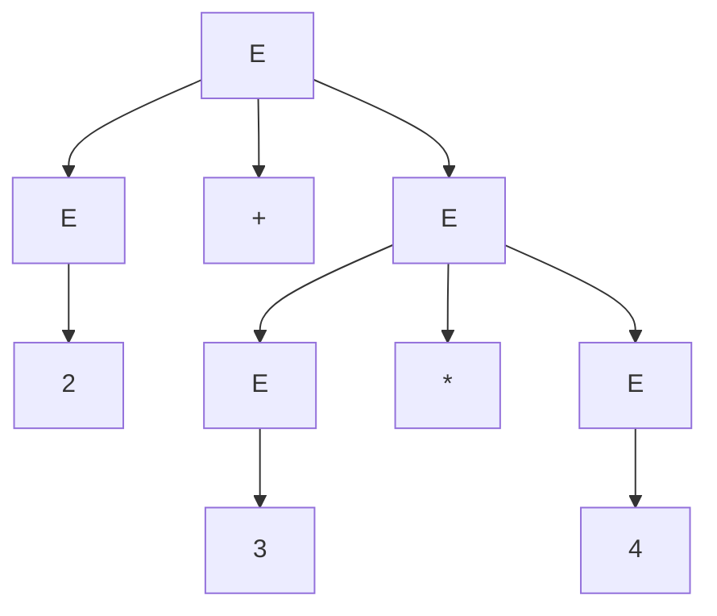
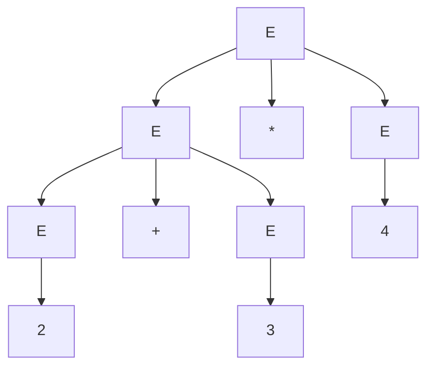
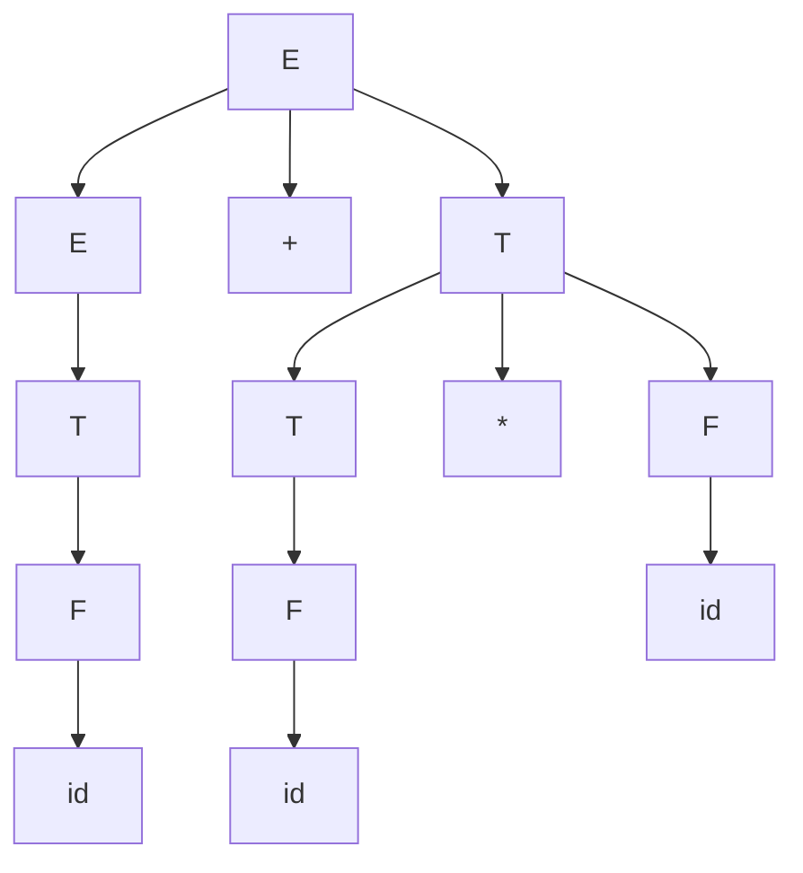

## Learning Objectives

- Define grammar ambiguity precisely: a grammar is ambiguous when some string it generates has two or more distinct parse trees.
- Distinguish true ambiguity (two different trees for one string) from two derivations that merely apply the same rules in a different order (which produce one and the same tree).
- Construct, for a known ambiguous grammar, two explicit distinct parse trees for the same string.
- Rewrite an ambiguous arithmetic-expression grammar using layered nonterminals to encode operator precedence, and verify the rewritten grammar has only one parse tree for the previously ambiguous string.
- Explain the practical consequences of ambiguity for a compiler or calculator that relies on a grammar's parse tree to determine meaning.

## Context & Motivation

The previous concept established that a derivation's *order* — leftmost, rightmost, or anything in between — never changes which parse tree gets built from a given sequence of rule applications; different orderings of the same rule applications always collapse onto the same tree. This concept is about the genuinely different situation: a single grammar generating a single string via two *different* sequences of rule applications, producing two structurally distinct trees. That distinction — same rules, different order, one tree, versus different rules entirely, two trees — is the exact line this concept draws, and it is one of the most commonly blurred ideas in an introductory treatment of grammars, precisely because both situations involve "more than one derivation for the same string."

Ambiguity is not a theoretical curiosity; it is the practical failure mode grammars are usually designed to avoid. The canonical, real-world instance is exactly the one every calculator and every compiler has to solve: does `2 + 3 * 4` mean "add 2 to 3, then multiply by 4" (giving 20) or "multiply 3 by 4, then add 2" (giving 14)? A grammar that cannot distinguish these two readings structurally is a grammar that has failed to encode operator precedence, and a parser built on it has no principled way to decide which arithmetic answer is correct — it would have to bolt on precedence rules from outside the grammar entirely. Sipser's treatment and the ACM/IEEE curriculum both flag ambiguity as a first-class concern for exactly this reason: it is not enough for a grammar to generate the right *set* of strings; for any grammar meant to assign meaning (an arithmetic value, a program's semantics, a document's structure), it must assign each string a single, unambiguous structure, or the string's meaning is genuinely undefined until some external rule breaks the tie.

## Core Theory

### Definition of ambiguity

A context-free grammar G is **ambiguous** if there exists at least one string w ∈ L(G) that has two or more distinct parse trees. Equivalently, some string has two or more distinct *leftmost* derivations (fixing the derivation to always be leftmost removes the "same tree, different order" confusion entirely: if two leftmost derivations of the same string differ, they are guaranteed to correspond to two genuinely different trees, since leftmost order is itself fixed and cannot vary). A language is called **inherently ambiguous** if every grammar that generates it is ambiguous — no rewriting can remove the ambiguity — though most ambiguity encountered in practice, including the running example here, is a property of a *particular* grammar, not of the language itself, and can be removed by choosing a better grammar for the same language.

### The critical distinction: ambiguity vs. derivation order

It is worth restating precisely, because this is the exact point the previous concept set up: leftmost and rightmost derivations of the *same sequence of rule applications* are not two sources of ambiguity — they produce the identical parse tree, just narrated in a different order. Ambiguity requires two derivations that apply a genuinely *different sequence of rules* to the same string, resulting in two trees that differ in shape (different grouping, different nesting), not merely two orderings of writing down the same tree's construction. A grammar is not ambiguous just because a string can be derived "in more than one way" if every one of those ways is only a reordering; it is ambiguous only when the ways disagree on structure.

### Running example: the unambiguous-looking grammar that isn't

Take the same arithmetic grammar from the previous concept:

```
E -> E + E | E * E | ( E ) | id
```

and the string `id + id * id` (write it as `2 + 3 * 4` for concreteness, with `id` standing for a number).

**Parse tree 1 — `+` applied last (grouped as `2 + (3 * 4)`):**



This tree comes from the leftmost derivation `E ⇒ E+E ⇒ id+E ⇒ id+E*E ⇒ id+id*E ⇒ id+id*id`, i.e., expanding the root as `E -> E + E` first, then expanding the second E as a product.

**Parse tree 2 — `*` applied last (grouped as `(2 + 3) * 4`):**



This tree comes from the leftmost derivation `E ⇒ E*E ⇒ E+E*E ⇒ id+E*E ⇒ id+id*E ⇒ id+id*id`, i.e., expanding the root as `E -> E * E` first, with the first E then expanding as a sum.

Both derivations are leftmost, both apply exactly three E-expanding rules and terminate in `id + id * id`, and yet they produce two structurally different trees — one where `+` is the root operation, one where `*` is the root operation. This is genuine ambiguity, not a reordering: the two trees group the operands differently, and a tree's root operation is conventionally understood as "the last operation performed," so the two trees literally disagree about whether this expression means (2 + 3) × 4 = 20 or 2 + (3 × 4) = 14.

### Removing ambiguity: layering precedence into the grammar

The fix is to stop letting a single nonterminal E freely choose between `+` and `*` at every step, and instead introduce separate nonterminals for each precedence level, so the grammar's structure itself forces higher-precedence operators to bind tighter:

```
E -> E + T | T
T -> T * F | F
F -> ( E ) | id
```

Here **E** (expression) handles addition at the loosest binding, **T** (term) handles multiplication one level tighter, and **F** (factor) handles parenthesized expressions and plain identifiers at the tightest binding. Because a `T` can only be reached by an `E` after already committing to "no more `+` here," and an `F` can only be reached by a `T` after already committing to "no more `*` here," every derivation is forced to build multiplication as a lower, more tightly-nested subtree relative to addition — precedence becomes a structural fact about which nonterminal wins outermost, not an external rule applied after the fact.

**Verifying only one tree now exists for `id + id * id`.** The only leftmost derivation is:

```
E ⇒ E + T           (rule: E -> E + T — a + is present, so E must use this rule, not E -> T)
  ⇒ T + T           (rule: E -> T, the leftmost T is just a bare term id)
  ⇒ id + T          (rule: T -> F, then F -> id)
  ⇒ id + T * F       (rule: T -> T * F, the remaining T must absorb the *)
  ⇒ id + F * F        (rule: T -> F)
  ⇒ id + id * F        (rule: F -> id)
  ⇒ id + id * id        (rule: F -> id)
```



There is no alternative rule choice at any step that also leads to a valid terminal string: E's rules force a `+` to appear only at the outermost level (since `E -> T` has no `+` in it at all, the only way to introduce a `+` is `E -> E + T`, and that `+` can never end up nested below a `*` in the resulting tree), so this is the only parse tree for this string in the rewritten grammar — the ambiguity is gone, and it corresponds to the conventionally correct reading 2 + (3 × 4).

## Worked Examples

### Example 1 — confirming ambiguity by finding two leftmost derivations

**Problem:** Show that `E -> E + E | E * E | id` is ambiguous using the string `id + id + id`.

**Derivation A:** `E ⇒ E+E ⇒ id+E ⇒ id+E+E ⇒ id+id+E ⇒ id+id+id`, grouping as the root `+` combining `id` with the subtree `(E+E)` on the right — this reads as `id + (id + id)`.

**Derivation B:** `E ⇒ E+E ⇒ E+E+... ` — more precisely, `E ⇒ E+E ⇒ (E+E)+E ⇒ ...`: expand the *first* E of the top-level `E+E` as `E+E` itself, giving `id+id+E ⇒ id+id+id`, grouping as `(id + id) + id`.

Both are valid leftmost derivations reaching `id+id+id`, and they produce different trees (one with the right `+` nested inside, one with the left `+` nested inside) — even though addition is associative and both give the same numeric answer, the trees themselves are structurally distinct, so the grammar is ambiguous on this string regardless of the fact that the ambiguity happens not to change the arithmetic result here.

### Example 2 — is reordering alone ever ambiguity? A non-example

**Problem:** For the balanced-parentheses grammar `S -> (S) | SS | ε` and the string `()`, confirm that the leftmost and rightmost derivations do *not* constitute ambiguity.

**Leftmost:** `S ⇒ (S) ⇒ ()` (rule (S), then rule ε).
**Rightmost:** `S ⇒ (S) ⇒ ()` — for this particular string there is only one variable at each step, so leftmost and rightmost coincide entirely; both derivations are identical, both use the same two rules in the same order, and both produce the single tree `S -> ( S ) -> ε`. This is not ambiguity (there is only one derivation here at all, let alone two structurally distinct ones) — it is included specifically to contrast with Example 1, where two *different* rule sequences (not merely two orderings) were required to demonstrate real ambiguity.

### Example 3 — checking the fixed grammar handles a harder case

**Problem:** Using `E -> E + T | T`, `T -> T * F | F`, `F -> (E) | id`, derive `( id + id ) * id` and confirm parentheses correctly override the default precedence.

**Derivation:** `E ⇒ T ⇒ T*F ⇒ F*F ⇒ (E)*F ⇒ (E+T)*F ⇒ (T+T)*F ⇒ (F+T)*F ⇒ (id+T)*F ⇒ (id+F)*F ⇒ (id+id)*F ⇒ (id+id)*id`. Tracing the tree shape: the `*` sits at the very root (it is the outermost operation), with its left child rooted at `F -> (E)`, forcing the `+` inside the parenthesized `E` to be fully evaluated as one unit before the outer `*` combines it with the final `id`. This correctly reflects that explicit parentheses force `(id + id)` to bind together regardless of the default precedence between `+` and `*` — the grammar's `F -> ( E )` rule is exactly what allows a parenthesized subexpression to "reset" precedence back to the loosest level (E) inside the parentheses.

## Common Misconceptions & Pitfalls

- **"If a string has two different derivations, the grammar is ambiguous."** Not necessarily — Example 2 shows a string with a leftmost and a rightmost derivation that are simply two ways of describing the identical tree (and here, since there's only one variable to expand at each step, they're not even different sequences). Ambiguity specifically requires two derivations that disagree on tree *structure*, not just on the bookkeeping order of substitutions.
- **"Ambiguity only matters if it changes the numeric result."** Example 1 shows a string (`id+id+id`) with two genuinely distinct parse trees that happen to agree on numeric value (addition is associative), yet the grammar is still, correctly, called ambiguous — ambiguity is a structural property of the grammar and string, defined by tree count, not by whether downstream evaluation happens to coincide.
- **"Adding parentheses around every operation removes ambiguity."** Requiring explicit parentheses everywhere is one way to sidestep the problem, but it is not what removing ambiguity from the grammar means — the fix demonstrated here rewrites the grammar itself (layering E, T, F) so that *unparenthesized* input like `id + id * id` is still accepted, and still gets exactly one tree, because precedence is now structural rather than externally imposed.
- **"An ambiguous grammar generates a different language than its unambiguous rewrite."** L(G) — the set of strings generated — is identical for `E -> E+E | E*E | id` and the layered `E/T/F` version; rewriting for unambiguity changes which trees each string gets, never which strings are in the language. Confusing "changes the language" with "changes the parse structure" is a common error when first seeing a grammar rewritten this way.

## Summary

A grammar is ambiguous exactly when some string it generates has two or more distinct parse trees — not when a string merely has two derivations that differ only in the cosmetic order of substitutions, since any two orderings of the same rule applications collapse onto one tree. The classic demonstration is an arithmetic grammar without precedence levels, `E -> E + E | E * E | id`, which assigns the string `id + id * id` two structurally different trees corresponding to the two different orders of operations a calculator would have to choose between. Layering the grammar into separate nonterminals for expressions, terms, and factors (`E -> E + T | T`, `T -> T * F | F`, `F -> ( E ) | id`) removes the ambiguity for this language by making precedence a structural consequence of which nonterminal a rule belongs to, while generating exactly the same set of strings as before. Ambiguity is a real, practical defect for anything that must extract a single meaning from a grammar's tree — a calculator, a compiler's parser — and rewriting the grammar, not adding rules outside it, is the standard remedy.

## Documentation Links

- [Sipser — Introduction to the Theory of Computation, 3rd ed.](https://cs.brown.edu/courses/csci1810/fall-2023/resources/ch2_readings/Sipser_Introduction.to.the.Theory.of.Computation.3E.pdf) — doc
- [ACM/IEEE CS2013 — Full Curriculum Site](https://csed.acm.org/cs2013-version/) — doc
