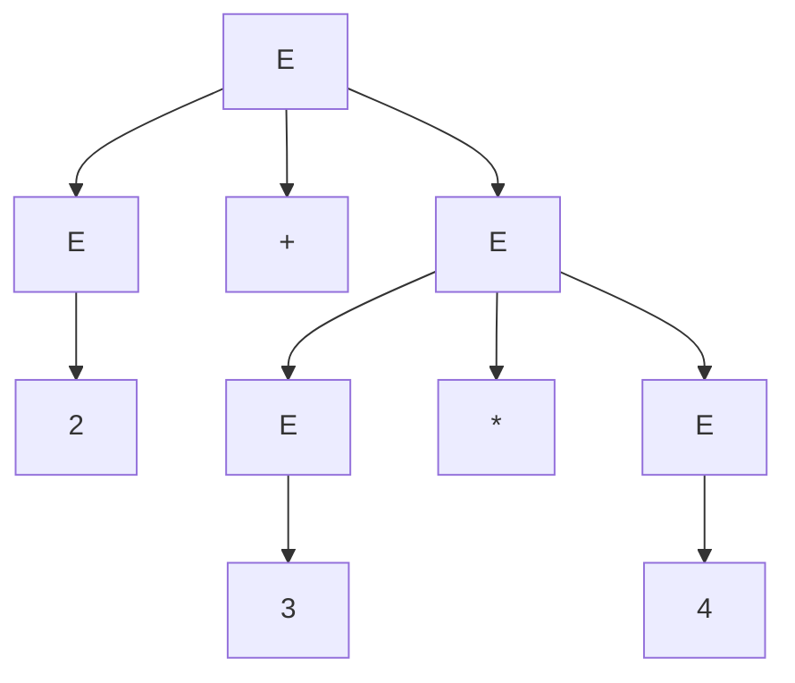
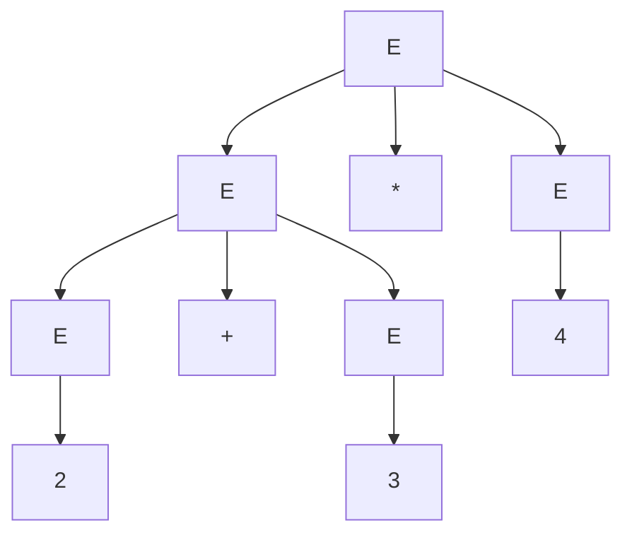
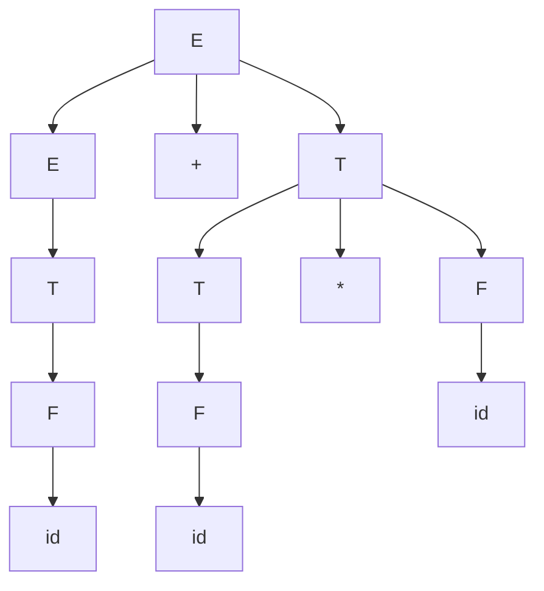

## Objetivos de Aprendizagem

- Definir precisamente a ambiguidade de uma gramática: uma gramática é ambígua quando alguma string que ela gera tem duas ou mais árvores de derivação distintas.
- Distinguir ambiguidade verdadeira (duas árvores diferentes para uma string) de duas derivações que apenas aplicam as mesmas regras em ordem diferente (que produzem uma única e mesma árvore).
- Construir, para uma gramática conhecidamente ambígua, duas árvores de derivação explícitas e distintas para a mesma string.
- Reescrever uma gramática ambígua de expressões aritméticas usando não-terminais em camadas para codificar precedência de operadores, e verificar que a gramática reescrita tem apenas uma árvore de derivação para a string anteriormente ambígua.
- Explicar as consequências práticas da ambiguidade para um compilador ou uma calculadora que depende da árvore de derivação de uma gramática para determinar significado.

## Contexto e Motivação

O conceito anterior estabeleceu que a *ordem* de uma derivação, seja a mais à esquerda, a mais à direita, ou qualquer coisa entre elas, nunca muda qual árvore de derivação é construída a partir de uma dada sequência de aplicações de regras; ordens diferentes das mesmas aplicações de regras sempre colapsam na mesma árvore. Este conceito trata da situação genuinamente diferente: uma única gramática gerando uma única string por meio de duas sequências *diferentes* de aplicações de regras, produzindo duas árvores estruturalmente distintas. Essa distinção (mesmas regras, ordem diferente, uma árvore, contra regras inteiramente diferentes, duas árvores) é exatamente a linha que este conceito traça, e é uma das ideias mais comumente confundidas em um tratamento introdutório de gramáticas, precisamente porque ambas as situações envolvem "mais de uma derivação para a mesma string."

Ambiguidade não é uma curiosidade teórica; é o modo de falha prático que as gramáticas normalmente são projetadas para evitar. A instância canônica do mundo real é exatamente aquela que toda calculadora e todo compilador precisa resolver: `2 + 3 * 4` significa "somar 2 a 3, depois multiplicar por 4" (dando 20) ou "multiplicar 3 por 4, depois somar 2" (dando 14)? Uma gramática que não consegue distinguir essas duas leituras estruturalmente é uma gramática que falhou em codificar a precedência de operadores, e um parser construído sobre ela não tem forma principiada de decidir qual resposta aritmética está correta: teria que acoplar regras de precedência vindas totalmente de fora da gramática. O tratamento de Sipser e o currículo ACM/IEEE ambos sinalizam ambiguidade como uma preocupação de primeira classe exatamente por essa razão: não basta que uma gramática gere o *conjunto* certo de strings; para qualquer gramática destinada a atribuir significado (um valor aritmético, a semântica de um programa, a estrutura de um documento), ela deve atribuir a cada string uma única estrutura, sem ambiguidade, ou o significado da string fica genuinamente indefinido até que alguma regra externa desempate.

## Teoria Central

### Definição de ambiguidade

Uma gramática livre de contexto G é **ambígua** se existe ao menos uma string w ∈ L(G) que tem duas ou mais árvores de derivação distintas. Equivalentemente, alguma string tem duas ou mais derivações *mais à esquerda* distintas (fixar a derivação para ser sempre a mais à esquerda remove inteiramente a confusão "mesma árvore, ordem diferente": se duas derivações mais à esquerda da mesma string diferem, elas necessariamente correspondem a duas árvores genuinamente diferentes, já que a ordem mais à esquerda em si é fixa e não pode variar). Uma linguagem é chamada **inerentemente ambígua** se toda gramática que a gera é ambígua (nenhuma reescrita pode remover a ambiguidade), embora a maior parte da ambiguidade encontrada na prática, incluindo o exemplo em curso aqui, seja uma propriedade de uma gramática *particular*, não da linguagem em si, e possa ser removida escolhendo uma gramática melhor para a mesma linguagem.

### A distinção crítica: ambiguidade versus ordem de derivação

Vale a pena reafirmar isso com precisão, porque é exatamente o ponto que o conceito anterior preparou: derivações mais à esquerda e mais à direita da *mesma sequência de aplicações de regras* não são duas fontes de ambiguidade, elas produzem a árvore de derivação idêntica, apenas narrada em ordem diferente. Ambiguidade exige duas derivações que aplicam uma *sequência de regras genuinamente diferente* à mesma string, resultando em duas árvores que diferem em formato (agrupamento diferente, aninhamento diferente), não apenas duas ordens de registrar a construção da mesma árvore. Uma gramática não é ambígua só porque uma string pode ser derivada "de mais de uma forma" se cada uma dessas formas é apenas um reordenamento; ela é ambígua somente quando as formas discordam quanto à estrutura.

### Exemplo em curso: a gramática que parece não ambígua, mas é

Considere a mesma gramática aritmética do conceito anterior:

```
E -> E + E | E * E | ( E ) | id
```

e a string `id + id * id` (escrita como `2 + 3 * 4` para concretude, com `id` representando um número).

**Árvore de derivação 1: `+` aplicado por último (agrupado como `2 + (3 * 4)`):**



Esta árvore vem da derivação mais à esquerda `E ⇒ E+E ⇒ id+E ⇒ id+E*E ⇒ id+id*E ⇒ id+id*id`, ou seja, expandindo a raiz primeiro como `E -> E + E`, depois expandindo o segundo E como um produto.

**Árvore de derivação 2: `*` aplicado por último (agrupado como `(2 + 3) * 4`):**



Esta árvore vem da derivação mais à esquerda `E ⇒ E*E ⇒ E+E*E ⇒ id+E*E ⇒ id+id*E ⇒ id+id*id`, ou seja, expandindo a raiz primeiro como `E -> E * E`, com o primeiro E depois se expandindo como uma soma.

Ambas as derivações são mais à esquerda, ambas aplicam exatamente três regras de expansão de E e terminam em `id + id * id`, e ainda assim produzem duas árvores estruturalmente diferentes: uma onde `+` é a operação raiz, outra onde `*` é a operação raiz. Isso é ambiguidade genuína, não um reordenamento: as duas árvores agrupam os operandos de forma diferente, e a operação raiz de uma árvore é convencionalmente entendida como "a última operação realizada", então as duas árvores literalmente discordam sobre se esta expressão significa (2 + 3) × 4 = 20 ou 2 + (3 × 4) = 14.

### Removendo a ambiguidade: colocando precedência em camadas na gramática

A correção é parar de deixar um único não-terminal E escolher livremente entre `+` e `*` a cada passo, e em vez disso introduzir não-terminais separados para cada nível de precedência, de modo que a própria estrutura da gramática force os operadores de maior precedência a se ligarem mais fortemente:

```
E -> E + T | T
T -> T * F | F
F -> ( E ) | id
```

Aqui **E** (expressão) trata a adição na ligação mais frouxa, **T** (termo) trata a multiplicação um nível mais apertado, e **F** (fator) trata expressões entre parênteses e identificadores simples na ligação mais apertada. Como um `T` só pode ser alcançado por um `E` depois de já se comprometer com "nenhum `+` mais aqui", e um `F` só pode ser alcançado por um `T` depois de já se comprometer com "nenhum `*` mais aqui", toda derivação é forçada a construir a multiplicação como uma subárvore mais baixa e mais aninhada em relação à adição: a precedência se torna um fato estrutural sobre qual não-terminal vence mais externamente, não uma regra externa aplicada depois.

**Verificando que agora existe apenas uma árvore para `id + id * id`.** A única derivação mais à esquerda é:

```
E ⇒ E + T           (regra: E -> E + T; um + está presente, então E deve usar esta regra, não E -> T)
  ⇒ T + T           (regra: E -> T, o T mais à esquerda é apenas um termo id isolado)
  ⇒ id + T          (regra: T -> F, depois F -> id)
  ⇒ id + T * F       (regra: T -> T * F, o T restante deve absorver o *)
  ⇒ id + F * F        (regra: T -> F)
  ⇒ id + id * F        (regra: F -> id)
  ⇒ id + id * id        (regra: F -> id)
```



Não há escolha alternativa de regra em nenhum passo que também leve a uma string terminal válida: as regras de E forçam um `+` a aparecer apenas no nível mais externo (já que `E -> T` não tem nenhum `+` nela, a única forma de introduzir um `+` é `E -> E + T`, e esse `+` nunca pode acabar aninhado abaixo de um `*` na árvore resultante), então esta é a única árvore de derivação para esta string na gramática reescrita: a ambiguidade desapareceu, e ela corresponde à leitura convencionalmente correta 2 + (3 × 4).

## Exemplos Resolvidos

### Exemplo 1: confirmando ambiguidade encontrando duas derivações mais à esquerda

**Problema:** Mostre que `E -> E + E | E * E | id` é ambígua usando a string `id + id + id`.

**Derivação A:** `E ⇒ E+E ⇒ id+E ⇒ id+E+E ⇒ id+id+E ⇒ id+id+id`, agrupando com o `+` raiz combinando `id` com a subárvore `(E+E)` à direita; isso se lê como `id + (id + id)`.

**Derivação B:** `E ⇒ E+E ⇒ E+E+... `, mais precisamente, `E ⇒ E+E ⇒ (E+E)+E ⇒ ...`: expanda o *primeiro* E do `E+E` de nível mais alto como `E+E` propriamente, dando `id+id+E ⇒ id+id+id`, agrupando como `(id + id) + id`.

Ambas são derivações mais à esquerda válidas chegando a `id+id+id`, e produzem árvores diferentes (uma com o `+` direito aninhado por dentro, outra com o `+` esquerdo aninhado por dentro); mesmo que a adição seja associativa e ambas deem a mesma resposta numérica, as árvores em si são estruturalmente distintas, então a gramática é ambígua nesta string independentemente do fato de que a ambiguidade aqui não muda o resultado aritmético.

### Exemplo 2: reordenamento sozinho é ambiguidade? Um contraexemplo

**Problema:** Para a gramática de parênteses balanceados `S -> (S) | SS | ε` e a string `()`, confirme que as derivações mais à esquerda e mais à direita *não* constituem ambiguidade.

**Mais à esquerda:** `S ⇒ (S) ⇒ ()` (regra (S), depois regra ε).

**Mais à direita:** `S ⇒ (S) ⇒ ()`; para esta string em particular há apenas uma variável a cada passo, então mais à esquerda e mais à direita coincidem inteiramente; ambas as derivações são idênticas, ambas usam as mesmas duas regras na mesma ordem, e ambas produzem a única árvore `S -> ( S ) -> ε`. Isso não é ambiguidade (há apenas uma derivação aqui, quanto mais duas estruturalmente distintas); é incluído especificamente para contrastar com o Exemplo 1, onde duas sequências de regras *diferentes* (não apenas duas ordens) foram necessárias para demonstrar ambiguidade real.

### Exemplo 3: verificando que a gramática corrigida trata um caso mais difícil

**Problema:** Usando `E -> E + T | T`, `T -> T * F | F`, `F -> (E) | id`, derive `( id + id ) * id` e confirme que os parênteses sobrepõem corretamente a precedência padrão.

**Derivação:** `E ⇒ T ⇒ T*F ⇒ F*F ⇒ (E)*F ⇒ (E+T)*F ⇒ (T+T)*F ⇒ (F+T)*F ⇒ (id+T)*F ⇒ (id+F)*F ⇒ (id+id)*F ⇒ (id+id)*id`. Rastreando o formato da árvore: o `*` fica bem na raiz (é a operação mais externa), com seu filho esquerdo enraizado em `F -> (E)`, forçando o `+` dentro do E entre parênteses a ser totalmente avaliado como uma unidade antes que o `*` externo o combine com o `id` final. Isso reflete corretamente que parênteses explícitos forçam `(id + id)` a se ligarem juntos independentemente da precedência padrão entre `+` e `*`: a regra `F -> ( E )` da gramática é exatamente o que permite que uma subexpressão entre parênteses "reinicie" a precedência de volta ao nível mais frouxo (E) dentro dos parênteses.

## Equívocos Comuns e Armadilhas

- **"Se uma string tem duas derivações diferentes, a gramática é ambígua."** Não necessariamente: o Exemplo 2 mostra uma string com uma derivação mais à esquerda e uma mais à direita que são simplesmente duas formas de descrever a árvore idêntica (e aqui, como há apenas uma variável para expandir a cada passo, elas nem chegam a ser sequências diferentes). Ambiguidade exige especificamente duas derivações que discordam quanto à *estrutura* da árvore, não apenas quanto à ordem de registro das substituições.
- **"Ambiguidade só importa se muda o resultado numérico."** O Exemplo 1 mostra uma string (`id+id+id`) com duas árvores de derivação genuinamente distintas que por acaso concordam no valor numérico (a adição é associativa), e ainda assim a gramática continua sendo, corretamente, chamada de ambígua: ambiguidade é uma propriedade estrutural da gramática e da string, definida pela contagem de árvores, não por a avaliação posterior acabar coincidindo ou não.
- **"Adicionar parênteses em torno de cada operação remove a ambiguidade."** Exigir parênteses explícitos em todo lugar é uma forma de contornar o problema, mas não é o que significa remover a ambiguidade da gramática: a correção demonstrada aqui reescreve a própria gramática (colocando E, T, F em camadas) de modo que entradas *sem parênteses* como `id + id * id` ainda sejam aceitas, e ainda recebam exatamente uma árvore, porque a precedência agora é estrutural em vez de imposta externamente.
- **"Uma gramática ambígua gera uma linguagem diferente da sua reescrita não ambígua."** L(G), o conjunto de strings geradas, é idêntico para `E -> E+E | E*E | id` e para a versão em camadas `E/T/F`; reescrever para remover a ambiguidade muda quais árvores cada string recebe, nunca quais strings estão na linguagem. Confundir "muda a linguagem" com "muda a estrutura de derivação" é um erro comum ao ver pela primeira vez uma gramática reescrita dessa forma.

## Resumo

Uma gramática é ambígua exatamente quando alguma string que ela gera tem duas ou mais árvores de derivação distintas, não quando uma string meramente tem duas derivações que diferem apenas na ordem cosmética das substituições, já que quaisquer duas ordens das mesmas aplicações de regras colapsam em uma árvore. A demonstração clássica é uma gramática aritmética sem níveis de precedência, `E -> E + E | E * E | id`, que atribui à string `id + id * id` duas árvores estruturalmente diferentes correspondendo às duas ordens diferentes de operações entre as quais uma calculadora teria que escolher. Colocar a gramática em camadas com não-terminais separados para expressões, termos e fatores (`E -> E + T | T`, `T -> T * F | F`, `F -> ( E ) | id`) remove a ambiguidade para esta linguagem tornando a precedência uma consequência estrutural de a qual não-terminal cada regra pertence, gerando exatamente o mesmo conjunto de strings de antes. Ambiguidade é um defeito real e prático para qualquer coisa que precise extrair um único significado da árvore de uma gramática (uma calculadora, o parser de um compilador), e reescrever a gramática, não adicionar regras fora dela, é o remédio padrão.

## Documentation Links

- [Sipser: Introduction to the Theory of Computation, 3rd ed.](https://cs.brown.edu/courses/csci1810/fall-2023/resources/ch2_readings/Sipser_Introduction.to.the.Theory.of.Computation.3E.pdf): doc
- [ACM/IEEE CS2013: Full Curriculum Site](https://csed.acm.org/cs2013-version/): doc
