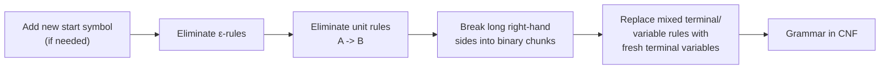

## Learning Objectives

- State the two permitted rule shapes of Chomsky Normal Form (A → BC and A → a), plus the one exception rule for generating ε.
- Explain why a standardized rule shape simplifies later proofs and parsing algorithms, rather than treating CNF as an arbitrary formality.
- Apply the three main conversion steps — eliminating ε-rules, eliminating unit rules, and breaking up long right-hand sides — to a specific, concrete grammar.
- Verify, for a converted grammar, that every remaining rule actually matches one of the two allowed CNF shapes.
- Recognize that CNF conversion preserves the generated language exactly, even though it changes the grammar's rules and parse-tree shapes.

## Context & Motivation

The previous concept showed that the same language can be generated by more than one grammar, and that some of those grammars are better than others — the layered E/T/F grammar generated exactly the same strings as the flat, ambiguous E-only grammar, but with better structural behavior. Chomsky Normal Form pushes this same idea to its logical extreme: instead of picking a grammar for one specific property (like removing ambiguity), CNF asks for a grammar in a completely standardized shape, where every single rule looks like one of only two possible patterns. The remarkable fact — provable and not at all obvious on first hearing it — is that *every* context-free grammar can be converted into an equivalent one in this restricted form, without losing or gaining a single string from the language it generates.

The motivation for wanting this is entirely practical, and it is worth being explicit about rather than treating CNF as busywork. Two major payoffs, both coming later in this discipline and in the broader field, depend directly on rules having a fixed, predictable shape. First, the CYK (Cocke-Younger-Kasami) parsing algorithm — a standard, general way to decide whether a string belongs to a context-free language in polynomial time — is defined entirely in terms of combining two adjacent substrings via an A → BC rule; without that fixed binary shape, the algorithm's clean dynamic-programming structure falls apart. Second, proofs about context-free languages, most notably the upcoming pumping lemma for context-free languages, rely on bounding how tall a parse tree must be relative to the length of the string it produces — a bound that is easy to state and easy to prove when every internal node has exactly two children (from A → BC rules) or is a leaf's immediate parent (from A → a rules), and considerably messier to establish when rules can have arbitrarily long, irregular right-hand sides. CNF is, in short, a grammar normalized the way a fraction is normalized to lowest terms: nothing about the underlying language changes, but everything built on top of it becomes easier to state and prove.

## Core Theory

### The two permitted shapes

A context-free grammar is in **Chomsky Normal Form** if every rule has one of exactly two shapes:

- **A → BC**, where A, B, C are all variables, and neither B nor C is the start symbol, or
- **A → a**, where A is a variable and a is a single terminal.

In addition, the rule **S → ε** is permitted as a single, explicit exception, but only for the start symbol S, and only if the language actually contains the empty string — this is the one place CNF allows a right-hand side that is neither of the two standard shapes. No other rule is allowed to produce ε, no rule is allowed to have a single variable alone on the right-hand side (a **unit rule**, A → B), and no rule is allowed a right-hand side longer than two symbols or one that mixes terminals and variables together (such as A → aB).

### Why the restriction is useful, concretely

Because every non-ε rule produces either exactly two variables or exactly one terminal, a CNF parse tree has a very rigid, predictable internal shape: every internal node has *exactly* two children (from an A → BC rule), and every leaf's immediate parent has *exactly* one child, that child being the terminal itself (from an A → a rule). This is precisely the shape CYK parsing exploits — the algorithm fills in a table where each cell asks "can this substring be derived from this variable," and answering that question for a substring of length n reduces to checking all ways of splitting it into two shorter substrings, each independently derivable from some B and some C such that A → BC is a rule. That reduction to "combine two adjacent smaller answers" is only clean because CNF guarantees every derivation step really is a two-way split (or a single terminal at the bottom) — no rule can, say, jump straight from A to a five-symbol string, which would break the table's recurrence.

### The conversion pipeline

Converting an arbitrary CFG into CNF proceeds in a fixed order of passes over the rule set, each one eliminating exactly one kind of disallowed shape:



1. **New start symbol.** If S ever appears on the right-hand side of some rule, introduce a fresh S₀ → S so the start symbol never has to be recreated mid-derivation (this matters once ε-rules are removed, since a lone S → ε exception must apply only at the very top).
2. **Eliminate ε-rules.** For every rule A → ε (other than a permitted S → ε), remove it, and for every rule that contains A on its right-hand side, add every version of that rule with A deleted (all combinations, if A appears more than once).
3. **Eliminate unit rules.** For every rule A → B (B a single variable), remove it, and instead give A every rule that B has directly.
4. **Break up long right-hand sides.** Any rule A → X₁X₂...Xₖ with k > 2 is replaced by a chain of new rules, each introducing one fresh variable to hold "everything from here to the end."
5. **Replace mixed rules.** Any remaining rule with a terminal mixed alongside a variable (like A → aB) has the terminal replaced by a fresh variable dedicated to that one terminal (Uₐ → a), so the terminal never sits next to a variable on a right-hand side.

### Worked conversion, step by step

Take the small, deliberately non-CNF grammar:

```
S -> aSb | AB
A -> aA | ε
B -> b
```

Here V = {S, A, B}, Σ = {a, b}. This grammar has an ε-rule (A → ε), a right-hand side longer than two symbols alongside a terminal (aSb has three symbols mixed with terminals), and no unit rules yet — all three problems the pipeline above targets.

**Step 1 — new start symbol.** S never appears on a right-hand side here, so this step changes nothing; S₀ is unnecessary.

**Step 2 — eliminate ε-rules.** A → ε is removed. A appears on the right-hand side of A → aA (twice removed and once kept — removing the A from `aA` gives `a`) and of S → AB (removing A gives S → B). So:

```
S -> aSb | AB | B
A -> aA | a
B -> b
```

(A → aA already covered "A appears once" — deleting that one A gives the new rule A → a.)

**Step 3 — eliminate unit rules.** S → B is a unit rule. B's own rules are just B → b, so replace S → B with S → b directly:

```
S -> aSb | AB | b
A -> aA | a
B -> b
```

**Step 4 — break up the long right-hand side.** S → aSb has three symbols. Introduce a fresh variable, say X₁, to hold "S followed by b," giving S → aX₁ and X₁ → Sb:

```
S -> aX1 | AB | b
X1 -> Sb
A -> aA | a
B -> b
```

**Step 5 — replace mixed terminal/variable rules.** S → aX₁ mixes terminal a with variable X₁; X₁ → Sb mixes variable S with terminal b; A → aA mixes a with A. Introduce Uₐ → a and U_b → b, and substitute:

```
S  -> Ua X1 | AB | b
X1 -> S Ub
A  -> Ua A | a
B  -> b
Ua -> a
Ub -> b
```

**Final check.** Every rule now has shape A → BC (S → UaX1, X1 → SUb, A → UaA, S → AB) or A → a (S → b, A → a, B → b, Ua → a, Ub → b) — exactly the two permitted CNF shapes, with no ε-rule anywhere (correctly, since this language does not contain the empty string: the shortest string, with A and B both at their minimum aⁿb form and n=0, is `ab` from S → AB → a·b, or `ab` from S → aSb needing at least one more layer — either way ε is never reachable). The conversion is complete, and this CNF grammar generates exactly the same language as the original.

## Worked Examples

### Example 1 — tracing which original rule caused which CNF rule

**Problem:** For the conversion above, explain in one line each why S → aSb could not simply stay as it was.

**Reasoning.** A → BC requires *exactly two variables* on the right-hand side; `aSb` has one terminal, one variable, one terminal — three symbols total, and two of them are terminals, not variables. It fails the A → BC shape on symbol count (3 ≠ 2) and fails the A → a shape by not being a single terminal. Both defects are fixed together: Step 4 splits the three symbols into a two-symbol structure (a, X₁), and Step 5 replaces the remaining bare terminal `a` with a dedicated variable Ua, so the final rule S → Ua X1 has exactly two variables, matching A → BC exactly.

### Example 2 — deriving a string in both grammars and comparing tree shapes

**Problem:** Derive `aabb` using the original grammar and using the CNF grammar, and compare.

**Original grammar:** `S ⇒ aSb ⇒ a(AB)b ⇒ a(aA)Bb ⇒ aa(ε)Bb ⇒ aabb`, using rules S → aSb, then S → AB (on the inner S), then A → aA, then A → ε, then B → b. Reading the pieces in order — a (from the outer wrap), a (from A), b (from B), b (from the outer wrap) — spells `aabb`. ✓

**CNF grammar:** `S ⇒ Ua X1 ⇒ a X1 ⇒ a(S Ub) ⇒ aSb ⇒ a(AB)b ⇒ a(aB)b ⇒ aabb`, using rules S → Ua X1, Ua → a, X1 → S Ub, Ub → b, then S → AB (on the inner S), A → a, B → b. Both grammars accept `aabb`, confirming the languages agree on this string; the CNF derivation simply takes more, smaller steps, each introducing exactly one new variable's worth of structure, consistent with every CNF rule being either binary or terminal-producing.

### Example 3 — spotting a non-CNF rule in an unfamiliar grammar

**Problem:** Given the rule set `T -> Fx | ε | UV | c`, identify which rules violate CNF and why.

**Reasoning.** `T -> Fx`: assuming F is a variable and x is a terminal, this mixes a variable and a terminal — not A → BC (needs two variables) and not A → a (needs to be a single terminal alone) — violates CNF, needs a dedicated terminal-variable substitution. `T -> ε`: only legal if T is the grammar's start symbol; otherwise it must be eliminated via the ε-elimination pass. `T -> UV`: with U and V both variables, this already matches A → BC exactly — no change needed. `T -> c`: a single terminal — already matches A → a exactly — no change needed.

## Common Misconceptions & Pitfalls

- **"Converting to CNF changes what language the grammar generates."** The conversion is carefully designed to preserve L(G) exactly — every step (removing an ε-rule, removing a unit rule, splitting a long right-hand side) is a *language-preserving* rewrite, proven so as part of the construction. What changes is the shape of the rules and, generally, the shape and size of parse trees (CNF trees tend to be taller and more binary-branching), never the set of strings generated.
- **"Any grammar that already looks simple is already in CNF."** The original example grammar here (`S -> aSb | AB`, `A -> aA | ε`, `B -> b`) looks compact and ordinary, yet violates CNF in three separate ways at once (an ε-rule, a too-long right-hand side, mixed terminal/variable rules) — CNF is a specific, narrow syntactic target, not a vague notion of "simple."
- **"The S → ε exception means CNF allows ε-rules generally."** The exception is deliberately singular: only the start symbol may have an ε-rule, and only when ε is genuinely in the language; every other variable's ε-rules must be eliminated by substitution (Step 2), never left in place.
- **"Because CNF grammars look more complicated (more variables, more rules), they are a worse choice for everyday grammar-writing."** CNF is a normalized target used for specific downstream purposes — CYK parsing and pumping-lemma-style proofs — not a recommendation for how to hand-write a grammar for readability. A grammar author still writes the natural, compact version (like the original three-line grammar here) and converts to CNF only when an algorithm or proof specifically requires that fixed shape.

## Summary

Chomsky Normal Form restricts every rule in a context-free grammar to one of two shapes — A → BC (two variables) or A → a (one terminal) — with a single, narrow exception allowing S → ε when the language contains the empty string. Every context-free grammar can be converted into an equivalent CNF grammar generating the identical language, via a fixed sequence of passes: eliminate ε-rules, eliminate unit rules, then break up any remaining long or mixed right-hand sides into binary chunks and dedicated terminal-producing variables. The worked conversion here took a compact three-rule grammar with all three kinds of disallowed shapes and produced a CNF grammar recognizing exactly the same strings, rule by rule. The reason this standardization is worth the mechanical trouble is entirely downstream: algorithms like CYK parsing and proofs like the context-free pumping lemma both depend on every derivation step being a clean binary split or a single terminal production, a guarantee only a normalized grammar like CNF provides.

## Documentation Links

- [Sipser — Introduction to the Theory of Computation, 3rd ed.](https://cs.brown.edu/courses/csci1810/fall-2023/resources/ch2_readings/Sipser_Introduction.to.the.Theory.of.Computation.3E.pdf) — doc
- [MIT 18.404J — OCW Calendar](https://ocw.mit.edu/courses/18-404j-theory-of-computation-fall-2020/pages/calendar/) — doc
